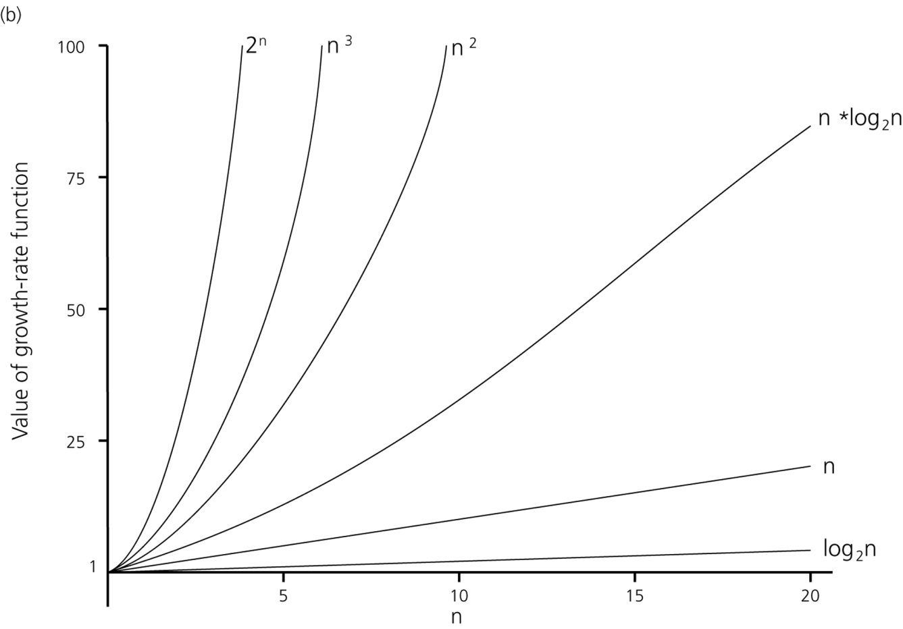
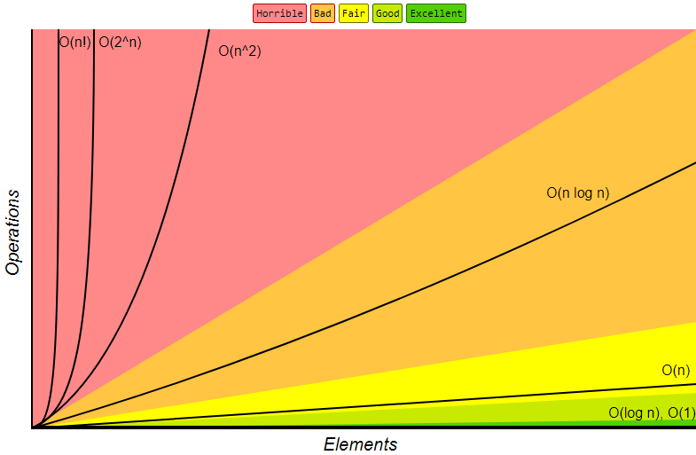
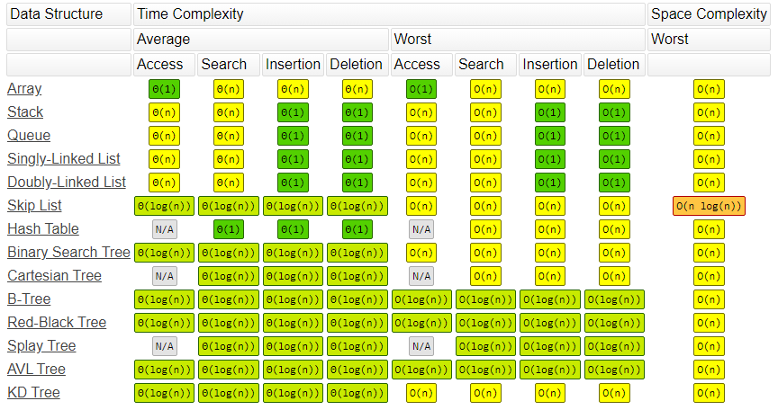
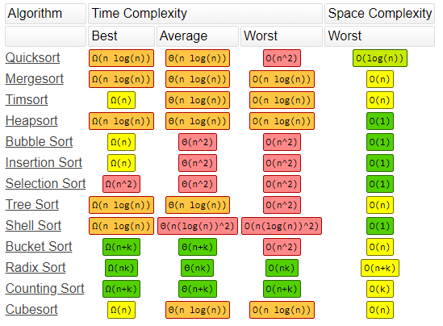
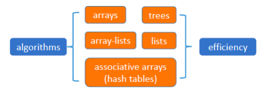
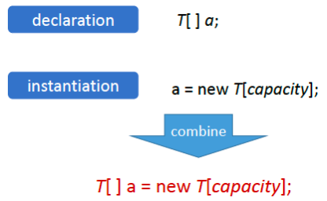
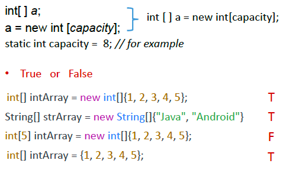
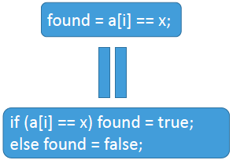

# Big O Problem

Niklaus Wirth 

the father of Pascal  
won the Turing Prize in 1984

<center>Algorithms + Data Structures = Programs</center>

## Problem Solving

- Some programming tasks are routine.
- Some are more challenging, if you want to find a good solution, or the best solution to a problem. 
- Sometimes you may not even be sure whether a solution to a problem exists! 

Knowledge of algorithm-design techniques and efficient data structures gives you a useful toolbox to draw on, as a programmer.

```java
for(inti=0; i < 10000000; i++) {
    for(intj=0; j < 10; j++)
        { }
}
```
Total time: 3 ms
```java
for(inti=0; i < 10; i++) {
    for(intj=0; j < 10000000; j++)
        { }
}
```
Total time: 5 ms

---

```java
double[] a =new double[10000000];
for(int j=0;j<10000000;j++)
    a[j]=j;
double sum=0;
for (int i=0; i<10000000; i++)
sum += a[i];
```
Total time: 42 ms
```java
double[] a =new double[10000000];
for(int j=0;j<10000000;j++)
    a[j]=j;
double sum=0,sum1=0,sum2=0,sum3=0,sum4=0;
for (int i=0; i<10000000; i+=4{
    sum1+=a[i];sum2+=a[i+1];sum3+=a[i+2];sum4+=a[i+3];
}
sum = sum1+sum2+sum3+sum4;
```
Total time: 33 ms

## Comparing algorithms & data structures

- How do we know if an algorithm or a data structure is any good?
- How do we know which one to choose?

There are many different:
- ways to organize and access data
- sorting algorithms
- data compression algorithms
- ways to solve optimization problems

## Two common measures: Time & Space

<strong><span style="color: red">Time:</span></strong>  
How <i><span style="color: red">fast</span></i> does the algorithm run? 

<strong><span style="color: red">Space:</span></strong>  
How <i><span style="color: red">much</span></i> _storage space_ on the computer is needed to run the algorithm? 

<strong><span style="color: red">Efficient:</span></strong>  
We say that an algorithm is _efficient_ if it is a _speedy_ algorithm (not just because it “works well”).

<strong><span style="color: red">Space-efficient:</span></strong>  
We say that an algorithm is _space-efficient_ if it takes up little space.

## Comparing Algorithm Efficiency

- Suppose we have two algorithms for solving the same problem. How do we know which one is more efficient?
- We could implement both algorithms and perform a comparison on the time (or space) it takes to run each program.
- However, there are problems with this approach:
    - We would be <span style="color: red">comparing <i>implementations</i>, not <i>algorithms itself</i></span>.
    - The input data chosen <span style="color: red">might favor one</span> implementation over another, giving a false impression.

## Order-of-Magnitude Analysis

- To analyze algorithms independently of specific implementations, computers or data, we use a measure in terms of the _size of the input_ to the problem. It is usual to use a variable _n_ to describe the size of the input.
- For example:
    - Sorting algorithms are usually analyzed in terms of the number of items to be sorted
    - Searching through a file could be analyzed in terms of the file size – the number of characters in a file
- We will use a notation known as <span style="color: red">Big ‘O’ notation</span> to describe the order of magnitude of the time and space complexity of an algorithm.

## Complexity and Big 'O' Notation

- The definition of how Big 'O' works is complicated and tricky at first glance, so we will first look at an example to understand how to measure an algorithm or a piece of code...
- One important point to note:
- When measuring complexity, you should _specify what it is that you are counting_, for example:
    - lines of code executed
    - number of array accesses
    - number of comparisons

### Find the maximum value in an array

```java
int[] a = {57, 6, 25, -9, 45, 46, …, 5, -99};
```
```java
assert a.length > 0;
int n = a.length;
int j = 1;
int maxValue = a[0];
while (j < n) {
    if (a[j] > maxValue)
        maxValue = a[j];
    j++;
}
```
This examines <span style="color: red">at least 1</span> element of _a_ and <span style="color: red">at most <i>n</i></span>

### Beginners guide to Big O Notation by Rob Bell

https://rob-bell.net/2009/06/a-beginners-guide-to-big-o-notation/

## Complexity and Big 'O' Notation (2)

- To state the <i><span style="color: blue">time efficiency (time complexity)</span></i> of an algorithm:
    - We give an <strong><span style="color: red">upper bound</span></strong> on how long the algorithm takes (to within an order of magnitude);
    - It is expressed in terms of the size of the input.
- For example:
    - An algorithm taking exactly <i><span style="color: orange">n-1</span></i> steps – we could say that the algorithm was <i><span style="color: orange">O(n)</span></i> (“order n”).
    - An algorithm taking <i><span style="color: orange">n²-4</span></i> steps can be described as <i><span style="color: orange">O(n²)</span></i> (pronounced “order n squared”)

### Big O examples

- The big O notation
(a) gives an <strong><span style="color: blue">order of magnitude</span></strong> rather than a precise number of steps, so it is better to say O(n) rather than O(2n-1)  
(b) gives an <strong><span style="color: blue">upper bound</span></strong> (think of this as “no worse than”)  

1, 5, 30000, 56 are all <i><span style="color: orange">O(1)</span></i>  
n, 4n, 678n, 10000n + 2, are all <i><span style="color: orange">O(n)</span></i>  
n², 5n² + 6n + 1, n² + log n, 3n²-1000 are all <i><span style="color: orange">O(n²)</span></i>  
$2\log_{2}n$, $\log_{7}n$, $1000+\log_{100}n$ are all <i><span style="color: orange">O(log n)</span></i>  

### Reminder: Log Table (for base 2)

| $n$ | $2^n$   |
| --- | ------- |
| 0   | 1       |
| 1   | 2       |
| 2   | 4       |
| 3   | 8       |
| 4   | 16      |
| 5   | 32      |
| ... | ...     |
| 10  | 1024    |
| 20  | 1048576 |

| $\log_{2}n$ | $n$     |
| ----------- | ------- |
| 0           | 1       |
| 1           | 2       |
| 2           | 4       |
| 3           | 8       |
| 4           | 16      |
| 5           | 32      |
| ...         | ...     |
| 10          | 1024    |
| 20          | 1048576 |

### Function behaviour (complexity vs elements)



Hierarchy: 
O($1$) < O($log n$) < O($n$) < O($n * log n$) < O($n^2$) < O($n^3$) < O($2^n$)



## Names for orders

- O($1$) constant (does not depend on n)
- O($n$) linear (depends directly on n)
- O($n^2$) quadratic /kwɑːˈdrætɪk/(squared)
- O($n^i$) polynomial /ˌpɑːliˈnoʊmiəl/
- O($log n$) logarithmic /ˌlɔːɡəˈrɪðmɪk/
- O($base^n$) exponential /ˌekspəˈnenʃl/

## Example Growth Rates

Table of common growth-rate functions (approximately):

|              | $10$  | $100$    | $1,000$ | $10,000$ | $10^5$  | $10^6$  |
| ------------ | ----- | -------- | ------- | -------- | ------- | ------- |
| $\log_{2}n$  | $3$   | $6$      | $9$     | $13$     | $16$    | $19$    |
| $n$          | $10$  | $100$    | $1,000$ | $10,000$ | $10^5$  | $10^6$  |
| $n\log_{2}n$ | $30$  | $664$    | $9,965$ | ~$10^5$  | ~$10^6$ | ~$10^7$ |
| $n^2$        | $100$ | $10,000$ | $10^6$  | $10^8$   | $10^10$ | $10^12$ |

O($log n$) algorithms are much quicker than O($n$) algorithms, which are in turn much quicker than O($n^2$)

## Some constant-time algorithms

- O(1) algorithms (constant time complexity) always <span style="color: red">take the same number of steps</span>, no matter how much input data there is
- Examples of O(1) algorithms (usually):
    - finding out whether a list is empty or not
    - finding out the value of the first element of a list
    - Some tasks must take longer, e.g.
    - finding the maximum element in an unsorted list requires going through the whole list, so can't take O(1) time – it will need to be O(n).

### Linear Search

- Linear search uses a linear data structure such as an array or list (for example an *ArrayList* object).
- Linear search is <i><span style="color: orange">O(n)</span></i> comparisons
- This is the case whether
    - using an array or list
    - the element sought-for is found or not
    - you are considering the “<span style="color: red">worst case</span>” or the “average case”

### Bubble Sort

```java
void bubbleSort(int[] a) {
    int n = a.length;
    for (int j = n-1; j > 0; j--)
        for (int i = 0; i < j; i++)
            if (a[i] > a[i+1])
                swap(a[i], a[i+1]);
}
```
Complexity of bubbleSort?  
(Count the nested loops)  
O(n²)

### Insertion Sort

```java
void insertionSort(int[] a) {
    int i = 1;
    while (i < a.length) {
        int x = a[i];
        j = i;
        while (j != 0 && a[j-1] > x) {
            a[j] = a[j-1];
            j--;
        } // j == 0 || a[j-1] <= x
        a[j] = x; i++;
    }
}
```
Complexity of insertion Sort?  
O(n²)

### More sorting algorithms

- Naïve sorting algorithms are <i><span style="color: orange">O(n²)</span></i>,
    - e.g. bubble sort, insertion sort, selection sort
- We can do better than <i><span style="color: orange">O(n²)</span></i> for sorting!

### Quick Sort

```java
void quickSort(int low, int high, int[] numbers) {
    // first do partitioning
    int i = low; int j = high;
    int pivot = numbers[low];
    while (i <= j) {
        while (numbers[i] < pivot) i++;
        while (numbers[j] > pivot) j--;
        if (i <= j) {
            swap (numbers[i], numbers[j]);
            i++; j--;
        }
    }
    if (low < j) quicksort(low, j, numbers);
    if (i < high) quicksort(i, high, numbers);
}
```
Complexity of quickSort?  
average: O(n log(n))  
worst: O(n²)  

### Binary Search

```java
// returns true if x is in a
public static boolean search(int [ ] a, int x)
    int i, j, m;
    i = -1; j = a.length;
    while (j != i + 1) {
        m = (i + j ) / 2;
        if (a[m] <= x) i = m; else j = m;
    }
    // 0 <= i && i <= j && j <= a.length && (a[i] <= x < a[j]) && (j == i + 1)
    return i >= 0 && i < a.length && a[i] == x;
}
```
Complexity of binary search?  
Note the halving.  
Average: O(log n)  
Worst: O(n)

### Common Data Structure Operations



### Array Sorting Algorithms



> [!CAUTION]
> ⚠️注意：涉及到长字符串操作时，即使没有显式写出遍历逻辑，也可能存在O(n)的时间复杂度。如 `a="abcdefg";a+="h";`

## Complexity: References reading

- Goodrich & Tamassia (5th ed),
    - Chapter 4, Data Structures and Algorithms in Java
- Weiss,
    - Chapter 2, Data Structures and Problem Solving Using Java
- Cormen, Leiserson & Rivest,
    - Chapter 2, Introduction to Algorithms
- https://www.bigocheatsheet.com/

## Summary
- What you want to be familiar with by the end of the week:
    - big O notation
    - complexity of simple algorithms
    - how to get expressions for T(n) from algorithms
    - performance of some sorting algorithms

# Linear Search
## Sets and Sequences

- A <span style="color: red">set</span> is a collection of values (all of the same type).
    - There is <i><span style="color: red">no concept of order</span></i>.
    - a value can only occur in a set once.
- A <span style="color: red">sequence</span> is an <i><span style="color: red">ordered</span></i> collection of values (all of the same type).
    - Items can be selected by index.
    - The same value can occur more than once in a sequence.

## Representing sets and sequences

- In this module we will look at various <span style="color: red">data structures</span> for representing sets and sequences and relationships.



## Arrays

- An array is a data structure that can store elements (values) (of the same type).
    - <span style="color: red">Elements</span> can be accessed by means of an integer <span style="color: red">index</span>.
    - Most programming languages provide arrays.
    - Most recently devised programming languages index the elements starting at <span style="color: red">zero('zero-based')</span>.

### Arrays in Java



#### Arrays in Java: example



### Accessing arrays

- We access an element of an array by <i><span style="color: red">indexing</span></i>.
    - a\[i\]
- valid i must satisfy the condition
    - 0 <= i < capacity
> Java implementations <span style="color: red">check</span> this condition and will issue an <span style="color: red">error message</span> if the condition does not hold. (‘Array access out of bounds’).

### Using an array to represent a set

- We can represent a set (of fixed maximum size) using an array.
- <span style="color: blue">For example:</span>
    - <span style="color: blue">static final int maxSize = 8;</span>
    - <span style="color: blue">int[ ] values = new int[maxSize];</span>
    - <span style="color: blue">int size = 0; // 0 <= size <= maxSize</span>
- Usually we use an integer variable size (or whatever name) to indicate how many values there are currently in the set.

## is the set empty?

- The set is <i><span style="color: red">empty</span></i> if *size* is zero:
    - empty ➔ size == 0;
- <i>What type is variable <span style="color: red">empty?</span></i>

## Include a value in the set

- We <i><span style="color: red">include</span></i> a value x in the set by using the next free position.
- This is indicated by the value of size:
```java
a[size] = x; // size initially zero
```
> Since a value can appear in a set only once. <span style="color: red">Ensure:</span> the set does not already contain _x_.

- We then need to increase size by one:
```java
size ++;
```
> Indicate one more element was included. <span style="color: red">Ensure:</span> `size < maxSize` or `size != maxSize`

## Does the set contain a particular value?

- We can determine whether a value *x* appears in a set by using a <i><span style="color: red">linear search</span></i>.
- We start at the beginning of the array and keep advancing <i><span style="color: red">until</span></i>:
    - <span style="color: blue">either</span> we have gone off the end
    - <span style="color: blue">or else</span> we have found a value *x*

## Linear search

- This suggests a <i><span style="color: red">while</span></i> loop:
set current to first  
while <i><span style="color: red">(what?)</span></i> {  
    advance current
} // gone off end <span style="color: blue">or else</span> current is *x*

> What? should be
- `!(gone off end or else current is x)====!(p||q)`
- `!(gone off end) and then !(current is x)=====!p && !q`

### Linear search as program

```java
int i;
i = 0;
while (i != capacity && a[i] != x) { // see next slide
    i = i + 1;
} // i == capacity || a[i] == x
```

> after the loop: `i == capacity`, so <i><span style="color: red">no x</span></i> found, or <i><span style="color: red">first x</span></i> in a found at <i><span style="color: red">i</span></i>

## Order is important

- Please note that the order of terms is <span style="color: red">important</span>:
- We’d better not write:

```java
int i;
i = 0;
while (a[i] != x && i != capacity ) { // erroneous
    i = i + 1;
}
```

> Why comment on it as erroneous?

because we might ask about a\[i\] <i><span style="color: red">before</span></i> checking that <i><span style="color: red">i</span></i> is in range

## Conditional Boolean operators not commutative

- As we have seen, <i><span style="color: blue">conditional and</span></i> and <i><span style="color: blue">conditional or</span></i> are <i><span style="color: red">not commutative</span></i> in programming sometimes.
- So, in general:
    - p && q ≠q && p
    - p || q ≠q || p
Furthermore, they do not <i><span style="color: red">distribute</span></i>:  
(p && q) || r ≠(p || r) && (q || r)

## Avoiding conditional operators

- If these properties of conditional Boolean operators trouble us, or
- If the condition is something more complex than just a\[i\] == x,
- Then we can apply the <span style="color: red">‘bounded linear search theorem’.</span>

## bounded linear search theorem

```java
int i = 0;
boolean found = false;
while (!found && i != capacity) { // order not important
    found = a[i] == x;
    i = i + 1;
}
```

> <i><span style="color: red">i == capacity</span></i> means there is no *x* in *a*  
> <i><span style="color: red">found</span></i> means first *x* found at <i><span style="color: red">i-1</span></i> position

## Assigning value of Boolean expression



So no need for <i><span style="color: red">if</span></i> statement here.

## Excluding from a set

- Find index of element. Use linear search.
- If not found
    - nothing to do
- If x found at j,
`a[j] ← a[size – 1] // swap last element into j`  
`size ← size - 1`

## Representing a sequence

Similar to a set except:
- No need to check for duplicates before appending
- Need to preserve order when deleting…

## Deleting from sequence

- Use index of element to be deleted (there can be many _x_’s in a). 
- Let’s call that index value i:

```java
condition 0 <= i < size
j ← i
while ( j < size -1) {
    a[j] ← a[j + 1] // copy
    j ← j + 1
}
size ← size – 1 //elements number-1
```

## Dijkstra reference

- Professor Edsger Dijkstra writes about the linear search theorem in:
    - EWD 1009 ‘On a somewhat disappointing correspondence’
    - https://www.cs.utexas.edu/users/EWD/transcriptions/EWD10xx/EWD1009.html

## More-sophisticated structures

- An <i><span style="color: red">array-list</span></i> can be extended at run time, and provides built-in methods such as <i><span style="color: red">contains</span></i> and <i><span style="color: red">indexOf</span></i>.
- They are implemented in a similar way to what we have seen here with arrays.
- We will be looking at more-efficient structures in this module, such as <i><span style="color: red">sorted sequences</span></i>, <i><span style="color: red">hash-tables</span></i> and <i><span style="color: red">trees</span></i>.

## Summary

- What you want to be familiar with by the end of the week:
    - big O notation
    - complexity of simple algorithms
    - how to get expressions for T(n) from algorithms
    - performance of some sorting algorithms
