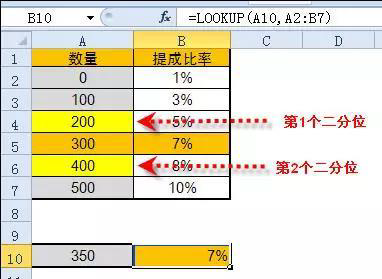
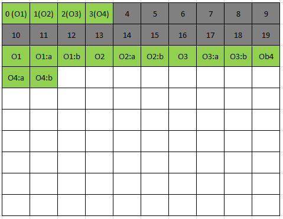
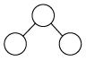
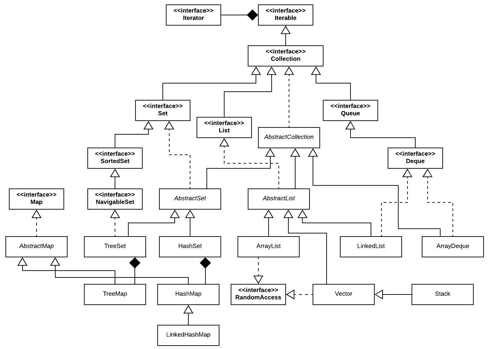

# Comparing and making informed decisions

## Content

- Recap of abstract data types introduced
- Comparison of implementations
- The Java Collections API: The good, the bad and the ugly
- Determining the best abstract data type and implementation for a task

## Disclaimers

- This session may be heavy in places but will give you some useful insights
- Points regarding memory are not absolute due to JVMs (Java Virtual Machines) handling memory differently. Other programming languages may also behave differently.

## A note on Typesetting

- Any text in `monospaced` font explicitly denotes either a Java class / interface (e.g. `ArrayList` / `List`) or source code.
- There are a number of times these words are used in a more general sense and are not specific to Java.

## Abstract Data Types

- List
- Set
- Map / Dictionary
- Graph
- Queue
- Priority Queue
- Double-ended queue
- Stack

## Some other Abstract Data Types

- Multiset / Bag<br>Same as a Set, but multiple equal values allowed
- Multimap<br>Same as a Map, but a key can have multiple values
- Double-ended priority queue<br>Double-ended queue, based on a priority

## Which data structure is suitable

- Task:<br>Check a user’s login session is active
- Information available:<br>A user’s session ID and a collection of active session IDs

<span style="color: red">Question:</span><br>What data structure is best suited to the task?

---

- Task:<br>Retrieve a user’s details by their username
- Information available:<br>A user’s username

<span style="color: red">Question:</span><br>What data structure is best suited to the task?

## List - Expected Behaviour

- Duplicates allowed: Yes
- Order: Determined by the insertion point
- Actions:
    - append / prepend to the list
    - retrieve from a list
    - empty check
- Use cases:
    - Many, when we want a collection of objects with duplicates and dynamic sizing
    - e.g. Storing adjacent nodes in a graph

## Set - Expected Behaviour

- Duplicate allowed: **No**
- Order: **Depends on implementation. In a standard set,** ***order is not guaranteed.***
- Actions:
    - add value to set
    - contains value
    - check if empty
- Example use cases:
    - Retaining visited objects in a depth/breadth-first search of a graph
    - Any task where we want a collection but no duplicates

## Map - Expected Behaviour

- Duplicate keys allowed: No
- Duplicate values allowed: Yes
- Order: Depends on implementation
- Actions:
    - add mapping (key → value)
    - retrieve value by key
    - empty check

- Example use case:
    - Lookup tables (mostly)



## Graph - Expected Behaviour

- Duplicate allowed: Each ‘vertex’ is unique
- Order: Depends on the traversal algorithm
- Actions:
    - add / remove vertices
    - add / remove edges
    - get vertex value
    - update vertex value
    - get vertex neighbours
    - adjacency between vertices
- Example use cases:
    - Social network friendship connections

## Queue - Expected Behaviour

- Duplicates allowed: Yes
- Order: First In First Out (FIFO)
- Actions:
    - add to the back of the queue (enqueue)
    - remove from the front of the queue (dequeue)
    - peek at the front of the queue
    - check if empty
- Example use cases:
    - Process transactions
    - Breadth-first search of a graph

## Priority Queue - Expected Behaviour

- Duplicates allowed: Yes
- Order: Best In First Out (BIFO)
- Actions:
    - add to the queue with priority
    - remove highest-priority from the queue
    - peek at the highest-priority element in the queue
    - check if empty
- Example use cases:
    - Process transactions based on priority
    - Pathfinding (Dijkstra, A\*)

## Stack - Expected Behaviour

- Duplicates allowed: Yes
- Order: Last In First out (LIFO)
- Actions:
    - add to the top of the stack (push)
    - remove from the top of the stack (pop)
    - peek at the top of the stack
    - check if empty
- Example use cases:
    - Undo/redo functionality/Depth-first search of a graph
    - Iterative in-order traversal of a binary search tree

## List implementations

- There are two common list implementations:
    - Array based (`ArrayList` and `Vector`)
    - Linked list (`LinkedList`)
- Which is best?
    - Array-based implementations offer O(1) retrieval for access of any element in the list. However, the array must be resized when full O(n).
    - Linked lists offer O(1) time complexity for appending/prepending and retrieval for the head and tail and resizing is not needed.

### List implementations Time complexity big-O

| **Operation**   | **Array list**                   | **Linked list** |
| --------------- | -------------------------------- | --------------- |
| append          | **O(1)** / O(n) if resize needed | **O(1)**        |
| prepend         | O(n)                             | **O(1)**        |
| get first       | **O(1)**                         | **O(1)**        |
| get last        | **O(1)**                         | **O(1)**        |
| get by index    | **O(1)**                         | O(n)            |
| remove first    | O(n)                             | **O(1)**        |
| remove last     | **O(1)**                         | **O(1)**        |
| remove by index | **O(n)**                         | **O(n)**        |
| size            | **O(1)**                         | **O(1)**        |

## Arrays and Memory Random Access

- Arrays are random access(direct access) structures
- This makes arrays O(1) for accessing any element by its index
- How?
    - An array is allocated: <center><i>size × data type size memory</i></center>
    - We know the start location of the array
    - So, jumping to the correct memory location is determined by: <center><i>start location + (index × data type size)</i></center>
    - This is constant O(1), i.e., not depends on *n*

## Arrays and Memory

- Arrays are usually <span style="color: red">a contiguous block of memory</span> for storing values (references in the case of reference types)
- A lot of space can be wasted, due to needing free space to allow the insertion of new elements
- Object references in Java require 32 bits (for 32-bit systems) or 64 bits (for 64-bit systems).
- The following array:

```java
Object[] array = new Object[1000];
```

> - Requires 64 ×1,000 bits of contiguous memory allocation = 640,000 bits (80,000 bytes) even if the list is empty
> 
> - Not drastic, but still a waste of memory (1,000 is a very small list in terms of real systems)

### Arrays and Memory Crude Example

Consider the following:

```java
public class Obj {
    private double a, b;
}
public class Main {
    public static void main(String[] args) {
        Obj[] arr = new Obj[20];
        for (int i = 0; i < 4; i++) {
            arr[i] = new Obj();
        }
    }
}
```

---

- Each block in this example is 8 bytes (64 bits)
    - Grey → Unused array space (but space still allocated)
    - Green → Used
    - White → Unused



> Objects require 8 bytes 'housekeeping' then space for references/ primitives (in this case object Obj has two double primitives, each 8 bytes)

### Arrays and Memory Pros and Cons

- Although space is 'wasted', arrays benefit from modern CPU *caching* and pre-fetching during iteration as the memory is in one contiguous block
- The primary issue with arrays is finding contiguous memory sufficient for storing the array.<br>Imagine a list intended to cater for 1 billion objects <span style="color: red">= 8 bytes * 1 billion = 8 GB</span> of contiguous memory and this is just to store the object references!

---

- Consider that the above array was resized when attempting to add the ½ billion to 1 item (original array size ½ billion). Until garbage collection occurs, 4GB for the original array + 8GB for the new array is required
- Moral: big data requires lots of memory and arrays ‘struggle’ with a large amount of data due to their contiguous data and the need to resize in order not to waste memory
- The max size of an array-based list is <center><code>Integer.MAX_VALUE</code> → 2,147,483,647</center>
- Some of the problems above could be worked around by linking multiple arrays, but this introduces overheads

## List iteration

```java
public static void displayList(List<Object> list) {
    for (int i = 0; i < list.size(); i++){
        System.out.println(list.get(i));
    }
}
List iteration
List<Object> arrayList = new ArrayList<>();
List<Object> linkedList = new LinkedList<>();
…
displayList(arrayList);  // Time complexity for
displayList(linkedList); // these two calls?
```

## Array list iterator implementation

```java
class ArrayListIterator<E> implements Iterator<E> {
    int index = 0;
    @Override
    public boolean hasNext() {
        return index < array.length;
    }
    @Override
    public E next() {
        return array[index++];
    }
};
```

## Linked list iterator implementation

```java
class Node<E> {
    Node<E> next;
    E data;
}
```

```java
class LinkedListIterator<E> implements Iterator<E> {
    Node<E> current = head;
    @Override
    public boolean hasNext() {
        return current != null;
    }
    @Override
    public E next() {
        E result = current.data;
        current = current.next;
        return result;
    }
};
```

## Enhanced for loop Syntactical sugar

```java
for (Object obj : iterable) {
    System.out.println(obj);
}
```

The enhanced for loop above is just syntactical sugar for:
<center>⬇️</center>

```java
for (Iterator<Object> iter = iterable.iterator(); iter.hasNext(); /** incrementer not needed **/) {
    System.out.println(iter.next());
}
```

## List iteration - Take Two

```java
public static void displayList(List<Object> list) {
    for (Object obj : list) {
        System.out.println(obj);
    }
}
List<Object> arrayList = new ArrayList<>();
List<Object> linkedList = new LinkedList<>();
…
displayList(arrayList);   // Time complexity for
displayList(linkedList);  // these two calls?
```

## Sets

<span style="color: red">Question:</span>  
How do you retrieve a specific element from a set?

---

<span style="color: red">Answer:</span>
That’s a silly question.

The only way you could retrieve a specific element from a set is by having the element to begin with.

### Sets - What are they good for?

- Checking the presence of an element within a set, e.g. whether a vertex has already been visited in a depth-first / breadth-first search of a Graph<br>Faster than a list, O(1) hash set or O(log n) tree set
- Avoiding duplicates
- Checking whether a subset exists in another set
- Obtaining intersections/differences (e.g. Venn diagram)
- Efficiently maintaining non-index order (sorted sets such as tree set \[i.e. binary search tree\])

### Set implementations Time complexity big-O

| **Operation** | **Hash set**                     | **Tree set** |
| ------------- | -------------------------------- | ------------ |
| add           | **O(1)** / O(n) if resize needed | **O(log n)** |
| remove        | **O(1)**                         | **O(log n)** |
| contains      | **O(1)**                         | **O(log n)** |
| size          | **O(1)**                         | **O(1)**     |

- <span style="color: red">Hash set wins hands-down for the basic operations, but the order is chaotic.</span>
- <span style="color: red">Whenever an order is required, a tree set should be used</span>

## Tree Sets

- You have been taught that tree set implementations (i.e. binary search trees) offer O(log n) time complexity
- On average this is the case for a self-balancing binary search tree, but the worst-case time complexity is actually O(h), where h is the height of the tree.
- A balanced tree with 1024 to 2047 (inclusive) items will have a height of 10.

$$2^{10} = 1024 \hspace{2em} 2^{11} - 1 = 2047$$
$$\log_{2}{1024} = 10 \hspace{2em} \log_{2}{2047} = 10.999 ~ \text{(less than 11)}$$

Hence, O(log n) as log *n == h*, <span style="color: red">if balanced</span>

---

- If you are struggling with logarithms, think about it this way:

<span style="color: blue">level 0 = 1 node (root)</span>  
<span style="color: blue">level 1 = 2 * previous level nodes = 2 nodes</span>  
<span style="color: blue">level 2 = 2 * previous level nodes = 4 nodes</span>  
<span style="color: blue">level 3 = 2 * previous level nodes = 8 nodes</span>  
<span style="color: blue">level 4 = 2 * previous level nodes = 16 nodes</span>  
<span style="color: blue">……………</span>  
<span style="color: blue">level 9 = 2 * previous level nodes = 512 nodes</span>  
<span style="color: blue">level 10 = 2 * previous level nodes = 1024 nodes</span>  
<span style="color: blue">[height == 10]</span>  

<span style="color: red">1 + 2 + 4 + 8 + 16 + 32 + 64 + 128 + 256 + 512 + 1024 = 2,047</span>



---

<span style="background-color: rgb(66, 157, 218)">If a balanced tree were to contain double the number of elements (i.e. 2 × 2047 = 4094 elements), <span style="color: red">the height of the tree would only increase by 1</span>.</span>
<center>⬇️</center>
<span style="background-color: rgb(66, 157, 218)">This means that despite the number of elements doubling, <span style="color: red">the number of iterations</span> required (on average) to search for an element in the tree <span style="color: red">only increases by 1</span>.</span>
<center>⬇️</center>
<span style="background-color: rgb(254, 117, 3)">The <span style="color: blue">benefit of tree</span> structures and logarithmic algorithms only becomes truly apparently as <i>n</i> moves towards a larger number</span>

---

<span style="color: red">Question:</span>  
For a balanced binary search tree containing 1 billion elements, at most how many iterations would be required (on average) to find any element in the tree?

---

<span style="color: red">Answer:</span>  
$\log_{2}{1,000,000,000} = 29.897 \approx 29$ iterations (floored result above)

<span style="color: red">Comparison to a list:</span>  
O(n) = 1,000,000,000 iterations
- ~ 34.483 million times more than the balanced binary search tree

## Digression: Calculate logarithms

```java
int log2Est(int n) {
    return n > 1 ? (1 + log2Est(n/2)) : 0;
}
```

<span style="color: red">or</span>

```java
int log2Est(int n) {
    assert n > 0;
    int y = 0;
    while (n > 1) {n = n/2; y++;}
    return y;
}
```

> <span style="color: red">the number of times you can divide it by 2 before you go below 1</span>

## Map implementations Time complexity big-O

| **Operation** | **Hash map**                     | **Tree map** |
| ------------- | -------------------------------- | ------------ |
| put           | **O(1)** / O(n) if resize needed | O(log n)     |
| get           | **O(1)**                         | O(log n)     |
| remove        | **O(1)**                         | O(log n)     |
| contains      | **O(1)**                         | O(log n)     |
| size          | **O(1)**                         | **O(1)**     |

- <span style="color: rgb(220, 0, 111)">In reality, a Map is just a Set of keys that map to a Collection of Objects.</span>
- <span style="color: rgb(220, 0, 111)">In the Java API, Maps are used to implement the Sets…</span>

## JAVA SET Implementation, It’s just a MAP…

e.g. Inside `HashSet<E>`:

```java
private transient HashMap<E,Object> map;
// Dummy value to associate with an Object in the
// backing Map
private static final Object PRESENT = new Object();
public boolean add(E e) {
    return map.put(e, PRESENT)==null;
}
```

## Java Collections API

- The Java Collections API provides the following implementations of common abstract data types (some omitted)
    - List → `ArrayList, LinkedList` and `Vector`
    - Set → `HashSet, LinkedHashSet` and `TreeSet`
    - Map → `HashMap, LinkedHashMap` and `TreeMap`
    - Graph → You wish
    - Queue → `LinkedList, ArrayDeque`
    - Priority queue → `PriorityQueue`
    - Double-ended queue → `LinkedList, ArrayDeque`
    - Stack → `Stack, ArrayDeque, LinkedList`

---



## Java Collections API Issues

- Design decisions and changes to the Java language have resulted in some notable issues with the Collections API:
    - <span style="color: red">No Stack interface</span>. There is a class `Stack`, which extends `Vector`, an old 'thread safe' *list* implementation, which introduces overhead.
    - `HashSet` uses `HashMap` internally. This creates extra bloat, since although there is just a value, a key value pair is stored (2 $\times$ object references)
    - `TreeSet` uses `TreeMap` internally. Less efficient, as per the `HashSet` problem above
    - Legacy '`Object`' methods, where generics should be used. Introduces type safety issues.

---

- As a developer you should be aware that the Collections API is designed to be flexible. This has efficiency and performance consequences.
- Use of generic types or `Object` means no direct storing of primitive types.
- Consider an `ArrayList` for storing integers (the problem applies to all of the Collections API implementations...)
    - `ArrayList`’s underlying array is: `Object[] elementData;` On a 64-bit system, this means each element requires 8 bytes.
    - Additionally the wrapper class `Integer` incurs the overhead of being a reference type (16 bytes).
    - A primitive `int` only requires 4 bytes.

---

<table>
  <thead>
    <tr>
      <th colspan="2" style="text-align: center; background-color: #4a90d9; color: white;">Comparison</th>
    </tr>
    <tr>
      <th style="background-color: #4a90d9; color: white; width: 50%;">Object[]</th>
      <th style="background-color: #4a90d9; color: white; width: 50%;">int[]</th>
    </tr>
  </thead>
  <tbody>
    <tr style="background-color: #e8edcf;">
      <td style="padding: 1em;">8 bytes × array length<br>+ 16 bytes per <code>Integer</code> wrapper</td>
      <td style="padding: 1em;">4 bytes × array length, stored directly<br>in the array</td>
    </tr>
    <tr style="background-color: rgb(240, 241, 230);">
      <td style="padding: 1em;">
        100 elements in a full array<br>
        = 800 bytes + 1,600 bytes<br>
        <strong style="color: red;">Total = 2,400 bytes</strong>
      </td>
      <td style="padding: 1em;">
        100 elements in a full array<br>
        <strong style="color: red;">Total = 400 bytes</strong>
      </td>
    </tr>
  </tbody>
</table>

As a result, a full `ArrayList` of `Integer` elements uses 6 times more memory than an efficient implementation designed explicitly for storing `int` primitives.(This is ignoring the additional overhead of the static attributes in the `Integer` class and auto-boxing / unboxing).

## Java Collections API Conclusion

- The Collections API is great if you want to a straight-out-of-the-box implementation of your favorite abstract data type
- However when time and space complexity is of utmost importance, you should consider a custom implementation
- For the most part you will be fine using the Collections API and will benefit from the range of utilities available and interoperability with other libraries

## Which data structure is suitable

- Task:<br>Check a user’s login session is active
- Information available:<br>A user’s session ID and a collection of active session IDs

<span style="color: red">Question:</span>  
What data structure is best suited to the task?

---

Example List implementation:

```java
boolean isSessionActive(List<String> active, String user) {
    boolean found = false;
    Iterator<String> iter = active.iterator();
    while (!found && iter.hasNext()) {
        found = iter.next().equals(user);
    }
    return found;
}
```

---

Example Set implementation:

```java
boolean isSessionActive(Set<String> active, String user) {
    return active.contains(user);
}
```

---

- Conclusion:
    - Both are equally functional, but a `List` would offer O(n) regardless of implementation, whereas a hash-table based `Set` implementation would offer O(1).
    - Note: A `SortedSet` implementation such as `TreeSet` would offer O(log n).

---

- Task:<br>Retrieve a user’s details by their username
- Information available:<br>A user’s username

<span style="color: red">Question:</span>  
What data structure is best suited to the task?

---

- <span style="color: red">List?</span>
    - Maybe, but would require an O(n) search of the list and check that the User object’s username matched what we were looking for (also assumes the username is stored in this object)
- <span style="color: red">Set?</span>
    - No. The Set would contain the User objects, so to get it we would need to have the User object to begin with…
- <span style="color: red">Queue? Stack?</span>
    - No. Sure if the interface allows us to do a linear search, but we’ve established this is O(n)
- <span style="color: red">Map?</span>
    - A mapping of the username → User object would work a treat!
    - If we don’t care about order (or rarely care) then a Hash map implementation is the way to go O(1)

---

- Sometimes the right data structure isn’t immediately apparently.
- We should first program to an interface (e.g. Set / List) and then change the implementation to suit the use the case.
- For example:
    1. If I want to store a key value pair, a Map is the obvious choice. It’s specifically designed for this use. Then
    2. But should I use a Tree map or a Hash map?

---

- In most cases the answer will be a Hash map. It’s quick with O(1) time complexity on most operations.
- If however, the contents of the Map rarely change and we frequently want to display the keys in order, then the Tree map is a better choice.
- Hash maps also waste memory, since the underlying implementation is an array. Java’s `HashMap` (using default load factor 0.75) always wastes at least <i>0.25 * table size * reference size(8 bytes)</i> bytes

## The implications of a poor decision

Consider the algorithm for a breadth-first traversal of a graph:

```java
class Node {
    List<Node> adjacent;
    String value;
}
```

Consider the algorithm for a breadth-first traversal of a graph:

```java
void bft(Node start) {
    List<Node> nodes = new ArrayList<>();
    List<Node> visited = new ArrayList<>();
    nodes.add(start);
    while (!nodes.isEmpty()) {
        Node current = nodes.remove(0);
        if (!visited.contains(current))
            System.out.println(current.value);
        visited.add(current);
        for (Node n : current.adjacent) {
            if (!visited.contains(n))
                nodes.add(n);
        }
    }
}
```

---

```java
void bft(Node start) {
    List<Node> nodes = new ArrayList<>();
    List<Node> visited = new ArrayList<>();
    nodes.add(start);
    while (!nodes.isEmpty()) { // isEmpty O(1)
        Node current = nodes.remove(0); // remove O(n)
        if (!visited.contains(current)) // contains O(n)
            System.out.println(current.value);
        visited.add(current); // add O(1)
        for (Node n : current.adjacent) {
            if (!visited.contains(n)) // contains O(n)
                nodes.add(n); // add O(1)
        }
    }
}
```

## The implications of a <span style="color: red">better</span> decision

```java {2-3}
void bft(Node start) {
    Queue<Node> nodes = new LinkedList<>();
    Set<Node> visited = new HashSet<>();
    nodes.add(start);
    while (!nodes.isEmpty()) { // isEmpty O(1)
        Node current = nodes.remove(0); // remove O(1)
        if (!visited.contains(current)) // contains O(n)
            System.out.println(current.value);
        visited.add(current); // add O(1)
        for (Node n : current.adjacent) {
            if (!visited.contains(n)) // contains O(1)
                nodes.add(n); // add O(1)
        }
    }
}
```
