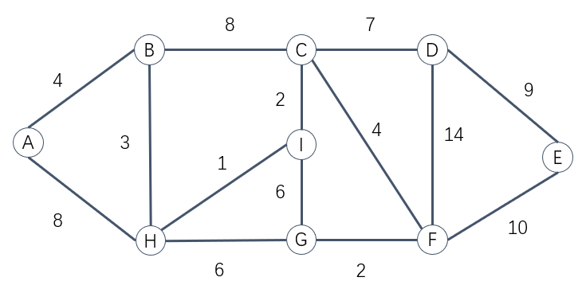

# Revision

## Key points

- Basic conception
    - Big O
- Data structure
    - Array
    - List
    - Stack
    - Queue
    - Priority Queue
    - Hash Table
    - Tree
    - Graph
- Algorithm
    - Sorting
    - Linear Search
    - Binary Search
    - Hashing
    - Recursion
    - Traverse Tree
    - Path Finding

## Final Examination

- Two hours
- Write the answers on the answer sheets

- Type and weight of the questions
    - Multiple Choice Questions(one correct answer) ------- 12 $\times$ 3 marks
    - Short Answer Questions --------- 49 marks
    - Encoding Questions -------- 15 marks

## Question1

- What are the features of the Stack, the Queue, and the Priority Queue?
- Assume `s` represents one empty Stack and `q` represents one empty queue, the variable `a`, `b`, `c`, `d` should be?

```java
s.push(“China");
s.push(“Italy");
s.push(“Japan”)
s.pop();
s.push(“Germany");
s.push(“England");
s.pop();
String a = s.pop();
s.push(“Russia");
String b = s.pop();

q.add(“China");
q.add(“Italy");
q.remove();
q.add(“Japan");
q.add(“Germany");
q.add(“England”)
q.remove();
String c = q.remove();
q.add(“Russia");
String d = q.remove();
```

---

- Please implement the basic operation of the stack created based on an array
    - push
    - pop
    - peek
    - isEmpty
- Please implement the basic operation of the queue created based on a single linked list
    - add
    - remove
    - peek
    - isEmpty

## Question2

- What are the features of the hash table?
- How to implement the insertion operation and deletion operation on a hash table?
- How to solve the collision problem when inserting data into a hash table?

---

- Devise a hash function
    - $h(k)= (k+29)\%13$
- Table size is set to 13

- Using the data in the following collection
    - `{233, 56, 89, 123, 380, 239, 9, 60, 261, 334, 17}`
    - Draw the hash table by using the quadratic probing way
    - Draw the hash table by using the chaining way

- How to calculate the average successful access and unsuccessful access steps on this hash table?

## Question3

- What are the features of the Binary Tree, the Complete Binary Tree and the Binary Search Tree?
- Insert the following name into an empty Binary Search Tree without considering balancing it.
    - “Thor”，“BalckPanther”，“StarLord”，“Mantis”，“Gamora”，“Strange”，“Groot”，“IronMan”，“Hulk”，“Falcon”，“AntMan”

- Please draw the tree out.
- Write down the values held in the nodes visited in searching in your tree for the name “IronMan”.

## Question4

- The time complexity of the following sorting algorithms
    - Insertion sorting
    - Selection sorting
    - Bubble sorting
    - Quick Sorting
- How to implement the selection sorting and insertion sorting algorithms?

## Question5

- Using Dijkstra’s algorithm to find the shortest path from A to E, showing the progress of path finding.
- State the traverse sequence of nodes by using DFT and BFT, starting from A.



## Question6

- Please compare the data structures learned in this semester, and list the scenarios these data structures are suitable for.
