# Binary search 二分查找

## Simple in principle <span style="color: orange">but</span> Hard in practice <br>原理简单<span style="color: orange">但是</span>难以实践

<center>Programming Pearls: Jon Bentley</center> <center>编程珠玑：乔恩·本特利</center>
<center>Binary Search</center> <center>二分查找</center>
<center><a href="https://www.solipsys.co.uk/new/BinarySearchReconsidered.html#toc_name000" target="_blank">https://www.solipsys.co.uk/new/BinarySearchReconsidered.html#toc_name000</a></center>

- “Professional programmers had a couple of hours to convert the above description (binary search) into a program in the language of their choice ... <br>
  “专业程序员有几个小时的时间将上述描述（二分查找）转换为他们选择的语言编写的程序...
- At the end of the specified time, almost all the programmers reported that they had correct code for the task ... <br>
  “在指定的时间结束时，几乎所有程序员都报告说他们已经为该任务编写了正确的代码...
- ninety percent of the programmers found bugs in their programs.” <br>
  “90%的程序员在他们的程序中发现了错误。”

## Principle 原则

Efficient search in a sequence.  在序列中高效搜索。  
Requirement (pre-condition): <span style="color: red">The sequence must be <i>ordered</i>.</span><br>
要求（前提条件）：<span style="color: red">序列必须 <i>有序</i>。</span>

This version is by Prof. Niklaus Wirth  <br> 此版本由 Niklaus Wirth 教授提供  
It is surprisingly efficient and easy to show to be correct <br> 它非常高效，而且很容易证明其正确性

## Pre-condition 前置条件

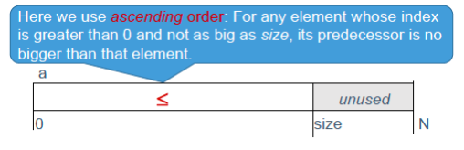
The sequence in the array must be _ordered_. <br> 数组中的序列必须是有序的。

```java
T a[N]; (* a[0] to a[N-1] *)
/* T is any type for which < == ... defined, such as int */
/* precondition:
    0 <=size <= N &
    (∀i: 0 < i < size: a[i-1] <=a[i]) */
```

## Invariant 不变式

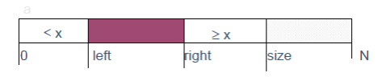

```java
/* precondition: 0 <=size <= N &
(∀i: 0 < i < size: a[i-1] <= a[i]) */
int left, right; /* 0 ... size */
/* invariant: precondition &
    a[0 ... left–1] < x &  // all before left are less than x
    a[right ... size-1] >= x*/
```
<span style="color: red">all from <i>right</i> up to <i>size-1</i> are at least as big as x</span>
<span style="color: red">所有从 <i>right</i> 到 <i>size-1</i> 的元素都至少和 x 一样大</span>

## Initially

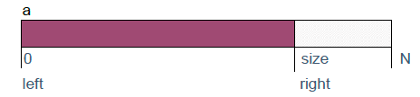

```java
left = 0; right = size;
/* makes empty segments */
```

## Finally

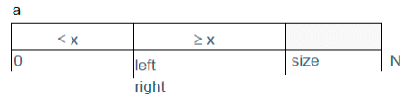
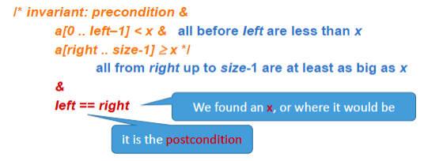

## Outline of loop 循环概述

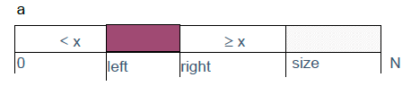

```java
left = 0; right = size;
/* invariant*/
while (left != right) {
    /* invariant & left != right */
    body
    /* invariant */
}
/* (invariant & left == right) => postcondition*/
```

## Body: Inspect mid element 主体：检查中间元素

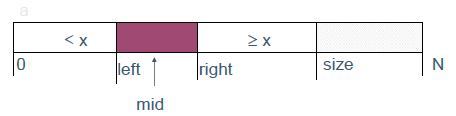

```java
int mid;
…
mid = (left + right) / 2;
a[mid] < x ?     left = mid +1;
a[mid] >= x ?    right = mid;
```

## Body: Inspect *mid* element 主体：检查*mid*元素

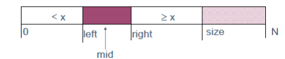

```java
left = 0; right = size;
while (left != right) { /* invariant and left != right */
    mid = (left + right) / 2;
    if (a[mid] < x) left = mid + 1;
    else right = mid;
    /* invariant */
}
```

## At the end

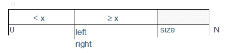

<span style="color: red"><i>left</i> == <i>right</i> and so found if <i>a[left]</i> == x,</span>
<span style="color: red">(or <i>a[right]</i> == x, since <i>left</i> == <i>right</i>)</span>

---

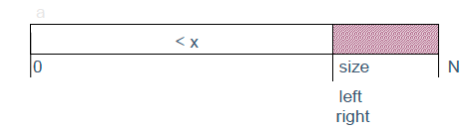

<span style="color: red"><i>left</i> == <i>right</i> and so <span style="color: orange">found</span> if <i>a[left]</i> == <i>x</i></span>
<span style="color: red">(or <i>a[right]</i> == <i>x</i>)</span>
what if *right* never moved. <span style="color: red">All elements &lt; x</span>, as in picture?
Correct? <span style="color: red">No</span>: we need to be sure that:
```
0 <= left < size
```

## The algorithm

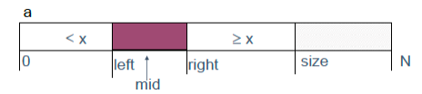

```java
left = 0; right = size;
while (left != right) { /* invariant and left != right */
    mid = (left + right) / 2;
    if (a[mid] < x) left = mid + 1;
    else right = mid;
    /* invariant */
}
found = (left != size) && (a[left] == x);
```

## Proving that it terminates: Bound <br> 证明它终止：界限

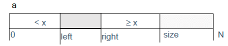

Length of <span style="color: grey">grey area</span> is reduced each time, so *bound* is *right* - *left*

Each time the body is carried out:  
either *left* gets bigger, or  
*right* gets smaller  
So eventually left == right and it terminates.

## O(?)

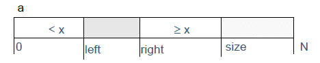

Length of <span style="color: grey">grey area</span> is <i><span style="color: red">halved</span></i> each time, so the time complexity of the binary search algorithm is?
$$O(log~n)$$

## Efficiency 效率

“Not found” takes more iterations\* than versions of binary search that terminate as soon as an *x* is found.  
“未找到“需要比立即在找到*x*时终止的二分查找版本更多的迭代。

However, each iteration requires *only* one access of the array; so more efficient.  
然而，每次迭代*只*需要访问数组一次；因此更高效。

Useful consequence(结果):
finds first (lowest-indexed) x

<i><span style="color: red">Thinking question: How many more iterations?</span></i>
## Just one more thing …


There is still a problem!
left + right might lead to <span style="color: red">numeric overflow 数值溢出</span>;
This can be avoided by using a bit of algebra 代数:
$$middle = \frac{left + right}{2} = left + \frac{right-left}{2}$$
<span style="color: red">The expression on the right side will not overflow, since its value never exceeds that of right.</span>

## So finally …

```java
left = 0; right = size;
while (left != right) { /* invariant and left != right */
    mid = left + (right - left) / 2;
    if (a[mid] < x) left = mid + 1;
    else right = mid;
    /* invariant */
}
found = (left != size) && (a[left] == x);
```

## Summary

**After studying the material of this lecture and the associated parts of the textbook and attempting the exercises, you should be able to:**

**Explain what is meant by a binary search**

**Understand the** **_precondition_** **of a binary search.**

**Correctly** **_implement_** **a binary search given a suitable loop invariant.** <br> **给出合适的循环不变式，正确实现二分查找。**

## Practical exercise 实践练习

- Problem:<br>Input $n(𝑛 ≤ 10^6)$ non-negative integers $𝑎_1, 𝑎_2, 𝑎_3, ……, 𝑎_𝑛, (𝑎_𝑖 ≤ 10^9)$, which are monotonically non-decreasing. Then perform $m(m ≤ 10^5)$ queries. For each query, an integer $q(q ≤ 10^9)$ is given. You are required to output the index of the first occurrence of this number q in the sequence. If it is not found, output -1.<br>
- 题目：<br> 输入 $n(𝑛 ≤ 10^6)$ 个非负整数 $𝑎_1, 𝑎_2, 𝑎_3, ……, 𝑎_𝑛, (𝑎_𝑖 ≤ 10^9)$，它们按单调不降顺序排列。然后进行 $m(m ≤ 10^5)$ 次查询。每次查询给定一个整数 $q(q ≤ 10^9)$。要求输出该数字 q 在序列中第一次出现的下标；若未找到则输出 -1。

---

- Input:
    - The first line contains two integers n and m, representing the number of integers and the number of queries.<br>第一行包含两个整数 n 和 m，分别表示整数个数和查询次数。
    - The second line contains n integers, representing the numbers to be queried.<br>第二行包含 n 个整数，表示待查询的有序序列。
    - The third line contains m integers, representing the indices of the numbers to be queried.<br>第三行包含 m 个整数，表示要查询的目标数值。
    - Example:
```console
11 2
1 3 3 5 7 9 11 13 15 15
3 12
find q[j] 3 at 1
find q[j] 12 at -1
```

# Sorting

## Content

- 'Straight' sorting 直接排序
    - Why straight sorting is not very good <br>为什么直接排序并不理想
- Quicksort 快速排序
    - Who discovered it <br>是谁发现了它
    - Why is it so quick <br>为什么它这么快
    - When it is ‘Slowsort’ <br>什么时候它会变成“慢排序”

## Typical scenario 典型场景

- **I sort coursework submissions manually into alphabetical order of author.**<br>**我手动把课程作业按作者字母顺序排序。**
    - I took 30 minutes to sort 25 students.<br>我给 25 位学生排序花了 30 分钟。
    - How long do you estimate the sorting for 50 students will take him?<br>你估计给 50 位学生排序要花多久？
<center><span style="color: red">2 hours!</span></center>

- Most sorting algorithms are $O(n^2)$, that is, time is proportional to number of records _squared_, so if _n_ doubles the sorting takes <span style="color: red">4</span> times as long<br>大多数排序算法是 $O(n^2)$，也就是时间与记录数的平方成正比，所以当 _n_ 翻倍时，排序时间会变为 <span style="color: red">4</span> 倍。

## Insertion Sort 插入排序

**This 'straight' sorting method works by inserting the next item of the unsorted stretch of a sequence into the already-sorted first stretch of the sequence.**<br>**这种“直接”排序方法的思路是：把未排序区间的下一个元素插入到前面已经排好序的区间中。**

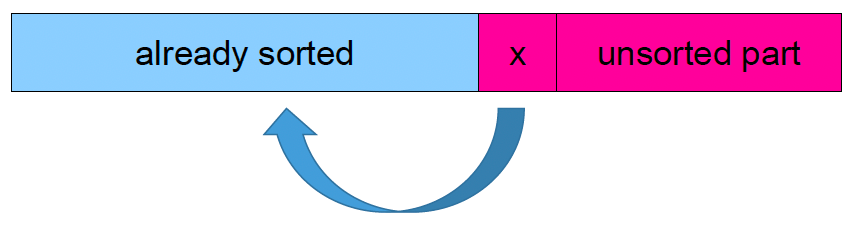
<center>Insert x to the appropriated position</center>
<center>将 x 插入到合适的位置</center>

```java
// post a[0..size-1] is ascending
void insertionSort(int [ ] a) {
    int i= 1; int x; int j;
    while (i < a.length) {
        // a[0..i-1] is ascending
        // insert value at a[i] into correct position in a[0..i-1]
        j= i; x= a[i]; // x is the value originally at a[i]
        while (j != 0 && a[j-1] > x) {
            // 'budge up' values that are bigger than the one at a[i]
            a[j]= a[j-1]; j--;
        } // j == 0 OR a[j-1] <= x
        // 'drop in' x, the value that was at a[j]
        a[j]= x;
        i++; // advance to insert next value
    } // i >= a.length
}
```

### Performance of Insertion Sort 插入排序的性能

- The insertion sort has a <i><span style="color: red">while loop</span></i> iterating through all <i><span style="color: red">n</span></i> elements of the sequence.<br>插入排序有一个 <i><span style="color: red">while 循环</span></i> 会遍历序列中全部 <i><span style="color: red">n</span></i> 个元素。
- Within that it has another <i><span style="color: red">while loop</span></i> iterating though all the elements <i><span style="color: red">before</span></i> the one to be inserted<br>在此循环内部，还有另一个 <i><span style="color: red">while 循环</span></i>，遍历待插入元素 <i><span style="color: red">之前</span></i> 的所有元素。
- So the performance is proportional to <i><span style="color: red">n<sup>2</sup></span></i>.<br>因此其性能与 <i><span style="color: red">n<sup>2</sup></span></i> 成正比。

## Simple sorting methods 简单排序方法

- Simple (naive) sorting methods such as <i><span style="color: red">selection sort</span></i>, <i><span style="color: red">insertion sort and ‘bubble sort’</span></i> are O(n<sup>2</sup>) – that means they take time proportional to the size of the sequence squared.<br>简单（朴素）排序方法，如 <i><span style="color: red">选择排序</span></i>、<i><span style="color: red">插入排序和冒泡排序</span></i> 的复杂度是 O(n<sup>2</sup>)，即耗时与序列长度的平方成正比。
- They only move values <span style="color: blue">a short distance on each pass</span>.<br>它们每一趟只会把元素移动 <span style="color: blue">很短的距离</span>。

## Quicksort: discoverer 快速排序：发现者

- He called it ‘Quicksort’ because it is dramatically quick.<br>他将其命名为“Quicksort（快速排序）”，因为它的速度非常快。
- Machine translation: ‘To assist in efficient look-up of words in a dictionary, he discovered the well-known sorting algorithm Quicksort’.<br>机翻示例：“为了高效查找字典中的单词，他发现了著名的排序算法 Quicksort。”


Professor Sir Tony Hoare FRS <br> 英国皇家学会会士 Tony Hoare 爵士教授

> <span style="color: blue">C.A.R. Hoare, “Quicksort”, The Computer J.,Vol. 5, No. 1, Apr. 1962, pp. 10-15.</span>

### Quicksort 快速排序

- **Works in place –**
    - no extra storage space needed.<br>不需要额外存储空间。
- **Not stable –**
    - does not preserve the order of records with same keys is dramatically fast!<br>不保证相同关键字记录的相对顺序，但速度非常快！

### Inspiration comes from 灵感来源

- <b>If we had values that we knew to be in <i><span style="color: red">completely the wrong order</span></i>, we could <span style="color: blue">reverse the order in n/2 steps</span>:</b><br><b>如果我们知道一组值处于<i><span style="color: red">完全相反的顺序</span></i>，就可以在 <span style="color: blue">n/2 步内把它们反转</span>：</b>
- start at the ends and swap elements until we reach the middle.<br>从两端开始交换元素，直到扫描到中间。
- **We don’t usually have completely mis-ordered lists, but it gives the idea for Quicksort.**<br>**实际中序列通常不是完全反序，但这给了快速排序设计思路。**

### Partitioning 划分

- **To sort array *a*:**<br>**对数组 *a* 进行排序：**
    - Pick any item at random, call it <span style="color: red">x</span> (the <span style="color: blue">pivot</span>)<br>随机选取一个元素，记为 <span style="color: red">x</span>（即<span style="color: blue">主元 pivot</span>）
    - Scan array from left until an item <span style="color: red">a<sub>i</sub> &gt; x</span> is found<br>从左向右扫描，直到找到一个 <span style="color: red">a<sub>i</sub> &gt; x</span> 的元素
    - Scan array from right until an item <span style="color: red">a<sub>j</sub> &lt; x</span> is found<br>从右向左扫描，直到找到一个 <span style="color: red">a<sub>j</sub> &lt; x</span> 的元素
    - Now exchange the two items and continue this ‘scan and swap’ process until the two scans meet somewhere in the middle of the array.<br>交换这两个元素，并持续执行这种“扫描并交换”的过程，直到两端扫描在数组中间相遇。
- actually we use <span style="color: red">a<sub>i</sub> &gt;= x</span> and <span style="color: red">a<sub>i</sub> &lt;= x</span> to simplify <span style="color: blue">loop guards（循环约束）</span><br>
---

- The result is that the array is now ‘partitioned’ into a<br>结果是数组被“划分”为：
    - left part with keys all less than or equal to x<br>左侧部分：键值都小于等于 x
    - and a right part with keys all greater than or equal to x.<br>右侧部分：键值都大于等于 x。
- These two parts can now be separately sorted – by Quicksort!<br>这两个部分接下来可以分别继续用快速排序处理！

```java
void quicksort(int [ ] a, int low, int high) {
    int i= low, j= high, temp;
    int pivot= a[(low + high) / 2];
    while (i <= j) {
        while (a[i] < pivot) i++;
        while (a[j] > pivot) j--;
        // forall k :low ..i -1: a[k] < pivot && forall k: j+1 .. high: a[k] > pivot &&
        // a[i] >= pivot && a[j] <= pivot
        if (i <= j) {
            temp= a[i]; a[i]= a[j]; a[j]= temp;
            i++; j--;
        }
    }
…
}
```

### Now <i><span style="color: orange">partition</span></i> the <i><span style="color: orange">partitions</span></i> 继续划分子区间

- We have only <i><span style="color: orange">partitioned</span></i>, but we wish to <i><span style="color: orange">sort</span></i>.<br>我们目前只是完成了<i><span style="color: orange">划分</span></i>，目标是最终<i><span style="color: orange">排序</span></i>。
- Repeat the partitioning process on each of the partitions until left with a partition of only one element<br>对每个子区间重复执行划分，直到每个区间只剩一个元素。
- method <i><span style="color: red">quicksort</span></i> activates itself <i><span style="color: red">recursively</span></i>.<br><i><span style="color: red">quicksort</span></i> 方法会<i><span style="color: red">递归</span></i>调用自身。

### Quicksort 快速排序

```java
void quicksort(int [ ] a, int low, int high) {
    int i= low, j= high, temp;
    int pivot= a[(low + high) / 2];
    while (i < j) {
        while (a[i] < pivot) i++;
        while (a[j] > pivot) j--;
        if (i <= j) {
            temp= a[i]; a[i]= a[j]; a[j]= temp;
            i++; j--;
        }
    }
    if (low < j) quicksort(a,low, j); // recursive call
    if (i < high) quicksort(a, i, high); // recursive call
}
```

> [!INFO] Info 信息
> recursive 递归的
> 
> recursion 递归

> [!TIP] Tip 提示
> Time complexity: <br>时间复杂度：
> 
> average: $O(n~log~n)$ <br>平均：$O(n~log~n)$
> 
> worst: $O(n^2)$ <br>最坏：$O(n^2)$

> [!CHECK] Principal 原理
> 1. i, j = position <br>i、j 是位置指针
> 2. pivot is data, compare with others <br>pivot 是基准值，用它与其他元素比较
> 3. right place: move on / wrong place: i, j stop, swap <br>位置正确则继续移动；位置错误时 i、j 停下并交换
> 4. left right <br>左右两侧同步推进

#### Getting it started 开始调用

```java
void sort(int [ ] a) {
    quicksort(a, 0, a.length-1);
}
```

### Analysis of Quicksort 快速排序分析

- Average performance is $O(n\times log~n)$<br>平均性能为 $O(n\times log~n)$。
- Worst case: <br>最坏情况：
    - when data is already ordered, performance becomes $O(n^2)$ unless middle element chosen as pivot.<br>当数据已接近有序时，若主元选择不佳，性能会退化到 $O(n^2)$。
    - Worst-case performance is improved by choosing middle element as pivot<br>选择中间元素作为主元可改善最坏情况表现。
$$a[\frac{left + right}{2}]$$

## Comparison of sorting 排序比较

- **‘Straight’, ‘naive’ sorts —— $O(n^2)$** <br>**“直接/朴素”排序 —— $O(n^2)$**
- **‘logarithmic sorts’ (_Quicksort_) —— $O(n\times log~n)$**<br>**“对数级”排序（_Quicksort_）—— $O(n\times log~n)$**
- **_Bubble sort_** **is the slowest sorting method known! (but has a catchy name)**<br>**_冒泡排序_** **是已知最慢的常见排序方法之一！（但名字很好记）**
- **_Quicksort_** **is one of the fastest.**<br>**_快速排序_** **是最快的方法之一。**

### Actual numbers 具体数值

| $n$   | $n^2$ (Bubblesort) | $n\log_{2}(n)$ (Quicksort) |
| ----- | ------------------ | -------------------------- |
| 32    | 1,024              | 160                        |
| 64    | 4,096              | 384                        |
| 128   | 16,384             | 896                        |
| 256   | 65,536             | 2,048                      |
| 512   | 262,144            | 4,608                      |
| 1,024 | 1,048,576          | 10,240                     |

## References 参考资料

> C.A.R. Hoare, “Quicksort”, The Computer J.,
> Vol. 5, No. 1, Apr. 1962, pp. 10-15.
> https://portal.acm.org/citation.cfm?id=366644

> The Art of Computer Programming, Vol. 3 – Sorting and Searching
> ISBN 0201896850
> Author Donald E Knuth
> Addison-Wesley

> Zonnon Report
> Zonnon Language Report
> Jürg Gutknecht
> Editors: Brian Kirk and David Lightfoot
> July 2009
> https://www.zonnon.ethz.ch/language/report.html

> From the Communications of the ACM

## Summary 总结

- **After studying the material of this week and attempting the exercises, you should be able to:**<br>**学习本周内容并完成练习后，你应该能够：**
    - understand why straight sorting techniques are not very efficient<br>理解为什么直接排序技术效率不高
    - understand the principle of _Quicksort_ <br>理解 _Quicksort_ 的基本原理
    - know the efficiency of _Quicksort_ (average case)<br>掌握 _Quicksort_ 的平均情况效率
    - know worst-case performance of _Quicksort_<br>了解 _Quicksort_ 的最坏情况性能

## Better Quicksort (Three-way QuickSort) 更优快速排序（三路快排）

```java
public void quickSort3Way(int[] arr, int low, int high) {
    if (low >= high) return;
    int lt = low, i = low + 1, gt = high;
    int pivot = arr[low];
    while (i <= gt) {
        if (arr[i] < pivot) {
            swap(arr, lt++, i++);
        } else if (arr[i] > pivot) {
            swap(arr, i, gt--);
        } else {
            i++;
        }
    }
    quickSort3Way(arr, low, lt - 1);
    quickSort3Way(arr, gt + 1, high);
}
```

## Concurrent Quicksort 并发快速排序

```pascal
activity PQuickSort(L, R: integer);
var i, j: integer; w, x: ElementOfArray;
begin i := L; j := R;
  x := MyArray[(L + R) div 2];
  repeat
    while MyArray[i] < x do i := i + 1 end;
    while x < MyArray[j] do j := j - 1 end;
    if i <= j then
      w := MyArray[i];
      MyArray[i] := MyArray[j]; MyArray[j] := w;
      i := i + 1; j := j - 1;
    end
  until i > j;
  if L < j then new PQuickSort(L, j) end; (*new activity – runs in parallel *)
  if i < R then new PQuickSort(i, R) end; (*new activity – runs in parallel *)
end QuickSort;

procedure ConcurrentQS;
begin
(* now instantiate the first activity with initial parameters *)
  new PQuickSort(integer(0), integer(MAX_SIZE - 1));
end ConcurrentQS;
```
* https://www.zonnon.ethz.ch/language/report.html

https://www.zonnon.ethz.ch

# Linked list 链表

## Content 内容

- Implementation and efficiency of _ArrayList_ <br>_ArrayList_ 的实现与效率
- Linked lists <br>链表
- Insertion into, and deletion from, linked lists. <br>链表的插入与删除
- A linked list abstract data type (ADT) <br>链表抽象数据类型（ADT）
- Recap of _inner classes_ <br>回顾 _inner classes_（内部类）
- _Iterators_  _迭代器_

## Arraylist under the bonnet ArrayList 底层原理

- Defined in the JDK already<br>在 JDK 中已经定义
```java
// ArrayList.java
public class ArrayList<E> extends AbstractList<E>
        implements List<E>, RandomAccess, Cloneable, java.io.Serializable
{
    @java.io.Serial
    private static final long serialVersionUID = 8683452581122892189L;

    /**
     * Default initial capacity.
     */
    private static final int DEFAULT_CAPACITY = 10;

    /**
     * Shared empty array instance used for empty instances.
     */
    private static final Object[] EMPTY_ELEMENTDATA = {};

    /**
     * Shared empty array instance used for default sized empty instances. We
     * distinguish this from EMPTY_ELEMENTDATA to know how much to inflate when
     * first element is added.
     */
    private static final Object[] DEFAULTCAPACITY_EMPTY_ELEMENTDATA = {};

    /**
     * The array buffer into which the elements of the ArrayList are stored.
     * The capacity of the ArrayList is the length of this array buffer. Any
     * empty ArrayList with elementData == DEFAULTCAPACITY_EMPTY_ELEMENTDATA
     * will be expanded to DEFAULT_CAPACITY when the first element is added.
     */
    transient Object[] elementData; // non-private to simplify nested class access

    /**
     * The size of the ArrayList (the number of elements it contains).
     *
     * @serial
     */
    private int size;

    /**
     * Constructs an empty list with the specified initial capacity.
     *
     * @param  initialCapacity  the initial capacity of the list
     * @throws IllegalArgumentException if the specified initial capacity
     *         is negative
     */
    public ArrayList(int initialCapacity) {
        if (initialCapacity > 0) {
            this.elementData = new Object[initialCapacity];
        } else if (initialCapacity == 0) {
            this.elementData = EMPTY_ELEMENTDATA;
        } else {
            throw new IllegalArgumentException("Illegal Capacity: "+
                                               initialCapacity);
        }
    }

    /**
     * Constructs an empty list with an initial capacity of ten.
     */
    public ArrayList() {
        this.elementData = DEFAULTCAPACITY_EMPTY_ELEMENTDATA;
    }

    /**
     * Constructs a list containing the elements of the specified
     * collection, in the order they are returned by the collection's
     * iterator.
     *
     * @param c the collection whose elements are to be placed into this list
     * @throws NullPointerException if the specified collection is null
     */
    public ArrayList(Collection<? extends E> c) {
        Object[] a = c.toArray();
        if ((size = a.length) != 0) {
            if (c.getClass() == ArrayList.class) {
                elementData = a;
            } else {
                elementData = Arrays.copyOf(a, size, Object[].class);
            }
        } else {
            // replace with empty array.
            elementData = EMPTY_ELEMENTDATA;
        }
    }
}
```
- An ArrayList “wraps” an array (whose default capacity is 10, but this can be changed)<br>ArrayList 对数组进行了“封装”（默认容量为 10，但可以调整）。
- The <i><span style="color: red">size</span></i> field keeps track of how many elements in the array actually hold data<br><i><span style="color: red">size</span></i> 字段用于记录数组中实际存放了多少个元素。

## Adding an element to an arraylist

- Case 1: Add to end of list without exceeding capacity<br>情况 1：在不超过容量的前提下追加到末尾
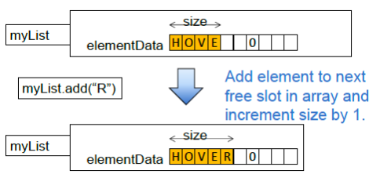

- Case 2: Add to end of list and exceed capacity<br>情况 2：追加到末尾并触发扩容
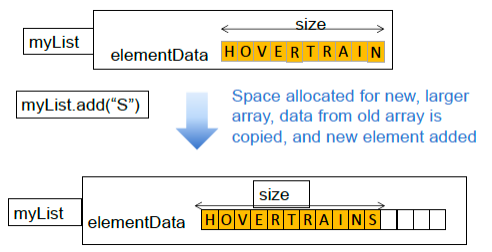

- Case 3: Insert into list<br>情况 3：在中间位置插入
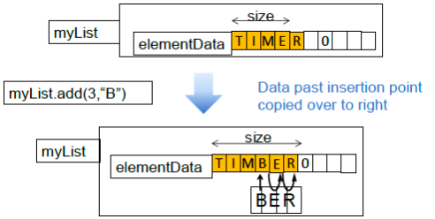

## Performance of arraylist ArrayList

- Adding to an ArrayList can potentially mean that existing data has to be copied from one location in memory to another. This can <span style="color: red">be inefficient when the size of the list is large</span>.<br>向 ArrayList 添加元素可能意味着要把已有数据从一块内存复制到另一块内存；当列表很大时，这会<span style="color: red">效率较低</span>。
- This problem arises <span style="color: red">because</span> an ArrayList keeps its data in a contiguous block.<br>这个问题产生的<span style="color: red">原因</span>在于 ArrayList 使用连续内存块存储数据。


## Linked lists

- A linked list keeps each of its elements <span style="color: red">in a separate block of memory</span>.<br>链表会把每个元素存放在<span style="color: red">独立的内存块</span>中。
- Each element has a pointer to the next element.<br>每个元素都包含一个指向下一个元素的指针。
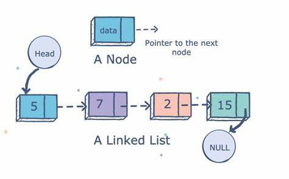
<span style="color: blue">Tail of list:</span>
<span style="color: blue">链表尾部：</span>
<span style="color: blue">Pointer to next element is <i><span style="color: red">null</span></i></span><br>
<span style="color: blue">指向下一个元素的指针为 <i><span style="color: red">null</span></i></span>

### A Class to represent nodes in linked lists (of Strings) 用于表示链表节点（字符串）的类

```java
public class Node {
    String data;
    Node next;
}
```

### Inserting data at the head of a linked list 在链表头部插入数据

```java
public static void insertAtHead(String data) {
    Node newNode = new Node();
    newNode.data = data;
    newNode.next = head;
    head = newNode;
}
```

### Inserting data after a particular node 在指定节点后插入数据

```java
public static void insertAfter(String data, Node insertPoint) {
    Node newNode = new Node();
    newNode.data = data;
    newNode.next = insertPoint.next;
    insertPoint.next = newNode;
}
```

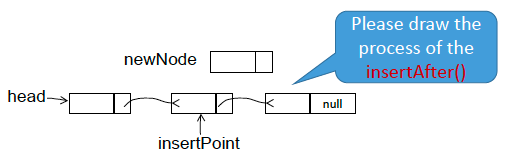

---

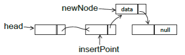

### Deleting the node at the head 删除头节点

```java
public static void deleteHead() {
    head = head.next;
}
```

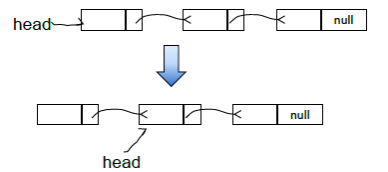

### Deleting the node at a particular point 删除指定位置后的节点

```java
public static void deleteAfter(Node deletePoint) {
    deletePoint.next = deletePoint.next.next;
}
```

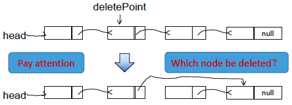

### Printing the data in a list 打印链表中的数据

```java
public static void printList() {
    Node current = head;
    while (current != null) {
        System.out.println(current.data);
        current = current.next;
    }
}
```

### Searching in a list 在链表中查找

```java
// return first node in list with data value sought,
// or null if not found
public static Node find(String sought) {
    Node current = head;
    while (current != null && !current.data.equals(sought)) {
        current = current.next;
    } // current == null || current.data.equals(sought)
    return current;
}
```

### A simple linked List ADT (Abstract Data Type) 一个简单的链表 ADT（抽象数据类型）

- There is already a LinkedList class in the Java API, but which hides the implementation details from the user.<br>Java API 中已经有 LinkedList 类，但它对用户隐藏了实现细节。(更好的说法是Java标准库)
<span style="background-color: rgb(66, 157, 218)">Now, we try to create our own Linked list</span>  
<span style="background-color: rgb(66, 157, 218)">It will help us comprehend linked list deeper</span>

1. <span style="color: red">Hide the details of the Node class by making it as a private</span> inner class <span style="color: red">of an enclosing LinkedList class</span><br>将 Node 类设为封闭 LinkedList 类的<span style="color: red">私有内部类</span>，从而隐藏其实现细节。

```java
public class StringLinkedList {
    private static class Node {
        String data;
        Node next;
    }
    private Node head;
    …
```

## Brief introduction of Inner classes 内部类简介

- An inner class is defined within another class.<br>内部类是定义在另一个类内部的类。
- The differences between inner classes and standard classes are that:<br>内部类与普通类的区别在于：
    - Each object of the inner class is associated with an object of the enclosing class and has access to fields and methods of the enclosing object (even private ones).<br>每个内部类对象都关联一个外部类对象，并可访问外部对象的字段和方法（包括 private）。
    - Similarly the enclosing class, has access to the fields and methods of the inner class (even private ones)<br>同样地，外部类也可以访问内部类的字段和方法（包括 private）。
    - An inner class can be private.<br>内部类可以声明为 private。

```java
public class A {
    …
    private class B {
        …
    }
}
```

### Static inner classes 静态内部类

- Normally an instance of an inner class will be associated with an instance of its enclosing class and will have access to non-static fields and methods of that class.<br>通常，内部类实例会绑定到某个外部类实例，并可访问该外部类的非静态字段和方法。
- If the inner class is declared to be static then it is not associated with any particular instance of the enclosing class and therefore only has access to static members of the enclosing class (because those members have the same value for all instances of the class).<br>如果内部类被声明为 static，它就不再绑定任何具体外部类实例，因此只能访问外部类的静态成员（因为这些成员对所有实例相同）。

```java
public class A {
    private static int i;
    private int j;
    private static class B{
        …
    }
}
```
<span style="background-color: rgb(66, 157, 218)"><span style="color: red">Methods</span> of class B can refer to the static variable i, but not the non-static variable j.</span> <br>
<span style="background-color: rgb(66, 157, 218)">B 类的<span style="color: red">方法</span>可以访问静态变量 i，但不能访问非静态变量 j。</span>

### UML Notation for Inner classes 内部类的 UML 表示法

```java
public class Out {
    …
    private class In {
        …
    }
}
```

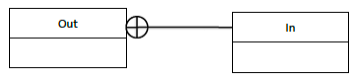

## Insertion into the linked list 向链表插入

- We previously described two methods:<br>前面我们介绍过两种方法：
    - <span style="color: blue">public static void insertAtHead(String data)</span>
    - <span style="color: blue">public static void insertAfter(String data, Node insertPoint)</span>
- The first of these can be made a public method of our linked list class.<br>第一种可以作为链表类的 public 方法。
- The second would have to be private, because it refers to the Node class, which is now private. What we can do is define a public method like this<br>第二种因为涉及 Node 类（现已私有）只能设为 private；我们可以改为定义如下 public 方法。

```java
public void insert(int index, String data) {
    if (index == 0) {
        insertAtHead(data);
    } else {
        Node insertPoint = head;
        for (int i = 0; i < index - 1; i++) {
            insertPoint = insertPoint.next;
        }
        insertAfter(data, insertPoint);
    }
}
```

## Deletion from the list 从链表删除

- Deletion can be handled in a similar manner to insertion.<br>删除操作可以用与插入类似的方式处理。
- Note that both the insert and delete methods may throw a null pointer exception if the index parameter is out of range.<br>注意：如果 index 参数越界，insert 和 delete 方法都可能抛出空指针异常。

```java
public void delete(int index) {
    if (index == 0) {
        deleteHead();
    } else {
        Node deletePoint = head;
        for (int i = 0; i < index - 1; i++) {
            deletePoint = deletePoint.next;
        }
        deleteAfter(deletePoint);
    }
}
```

## Iterating through the list 遍历链表

- There are circumstances in which we may need to iterate through all the elements in a list. For example, we might want to print them all or sum them (if they are numeric).<br>在某些场景下，我们需要遍历链表中的所有元素。例如打印全部元素，或在元素为数值时求和。
- We could write separate methods for all these cases, _printList_, _addList_, and so on. However, this would be cumbersome, and we can’t anticipate all cases where we might need to perform an iteration.<br>我们可以为这些场景分别写 _printList_、_addList_ 等方法，但这种做法很繁琐，而且无法预先覆盖所有遍历需求。
- <span style="color: red">A much more elegant solution is to allow our list to create an <i>Iterator</i>.</span><br><span style="color: red">更优雅的方案是让链表能够创建一个 <i>Iterator</i>（迭代器）。</span>

## Iterators 迭代器

- An iterator is <span style="color: red">an object</span> that is associated with a list, and which implements (at least) the following two methods:<br>迭代器是与列表关联的<span style="color: red">对象</span>，至少应实现以下两个方法：
- <span style="color: red"><i>next()</i></span>: After the iterator has been created, the first call to _next()_ returns the first element in the list, the second call returns the second element, and so on.<br><span style="color: red"><i>next()</i></span>：创建迭代器后，第一次调用返回第一个元素，第二次调用返回第二个元素，依此类推。
- <span style="color: red"><i>hasNext()</i></span>: _a_ boolean method that returns true if there is another element that can be retrieved by _next()_ and false if there is not (because we have already retrieved the last element.<br><span style="color: red"><i>hasNext()</i></span>：布尔方法；若后续还有可由 _next()_ 获取的元素则返回 true，否则返回 false（表示已到最后一个元素）。
- Iterators may, optionally, implement a method <span style="color: red"><i>remove</i></span>, which deletes the next element in the list.<br>迭代器还可以选择性实现 <span style="color: red"><i>remove</i></span> 方法，用于删除列表中的下一个元素。

---

- <span style="background-color: rgb(66, 157, 218)">The <span style="color: red">Java API</span> includes an interface <i>Iterator</i>, that defines the three methods mentioned above.</span><br><span style="background-color: rgb(66, 157, 218)"><span style="color: red">Java API</span> 提供了 <i>Iterator</i> 接口，其中定义了上面提到的三个方法。</span>
- <span style="background-color: rgb(66, 157, 218)">It also includes an <span style="color: red">interface <i>Iterable</i></span> which defines just one method <i>iterator()</i> which returns an iterator.</span><br><span style="background-color: rgb(66, 157, 218)">它还提供了 <span style="color: red"><i>Iterable</i> 接口</span>，仅定义一个方法 <i>iterator()</i>，用于返回迭代器。</span>
- <span style="background-color: rgb(66, 157, 218)">Lists should implement this interface.</span><br><span style="background-color: rgb(66, 157, 218)">列表类型应实现这个接口。</span>

```java
public class StringLinkedList implements Iterable<String> {
    @Override
    public Iterator<String> iterator() {
        return new StrItr(head);
    }
    private class StrItr implements Iterator<String> {
```

### Iterator class 迭代器类

```java {8}
private class StrItr implements Iterator<String> {
    private Node current;
    private StrItr(Node start) {current=start;}
    @Override
    public boolean hasNext() {return (current != null);}
    @Override
    public String next() {
        // Thinking Question: Think more about these three statements
        String result = current.data;
        current = current.next;
        return result;
    }
    @Override
    public void remove() {
        throw new UnsupportedOperationException("Not supported");
    }
}
```

### Iterating through the list 遍历链表

- If <span style="color: red"><i>myList</i></span> implements *iterable* and we want to iterate through it, for example, to print out all the elements it contains, we can write:<br>如果 <span style="color: red"><i>myList</i></span> 实现了 *iterable*，并且我们希望遍历它（例如打印其中所有元素），可以这样写：
```java
Iterator<String> iter = myList.iterator();
    while (iter.hasNext()) {
        System.out.println(iter.next());
    }
```
- or
```java
for (String s : myList) {
    System.out.println(s);
}
```
