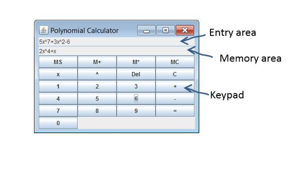
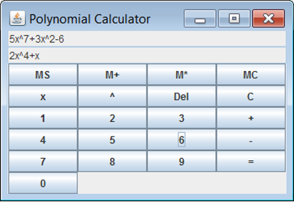

# A Linked List Class to Represent Polynomials <br>用链表类表示多项式

## Introduction <br>介绍

In this exercise you will create a simple application that manipulates polynomial expressions. You will create a linked list class to represent the expressions.  

> [!NOTE] Vocabulary
> Polynomial 多项式  
> 
> Term 项  
> 
> Coefficient 系数  
> 
> Power 指数

## Recap on polynomials <br>多项式回顾

You probably learnt about polynomial expressions at school. However, in case you have forgotten all that, a polynomial expression of one variable is an expression in which multiples of powers of that variable are added together. So for example the following are all polynomial expressions of one variable:  
你可能在学校学过多项式表达式。不过如果你已经忘了，单变量多项式就是把该变量各次幂的若干倍数相加得到的表达式。例如下面这些都属于单变量多项式：
$$
\begin{aligned}
&3x^2-2x+1 \\ 
&2x^{10}+5x^4-6x+12 \\
&x+1 \\
&3x^6+2 \\
\end{aligned}
$$
Each of the components that we add together is referred to as a _term_. So $3x^6+2$ has two terms, $3x^6$ and $2$. The number by which we multiply the variable is known as the _coefficient_ of the term and the number to which we raise $x$ is the _power_. So in the term $3x^6$ the coefficient is $3$ and the power is $6$. Note that $x^0=1$ so a number such as $2$ can be treated as a term whose coefficient is $2$ and whose power is $0$.  
我们相加的每个组成部分都称为一个 _term_（项）。例如 $3x^6+2$ 有两项：$3x^6$ 和 $2$。变量前面的乘数称为该项的 _coefficient_（系数），而 $x$ 的指数称为 _power_（幂次）。所以在 $3x^6$ 中，系数是 $3$，幂次是 $6$。注意 $x^0=1$，因此像 $2$ 这样的常数也可看作系数为 $2$、幂次为 $0$ 的一项。

Polynomials can be added together. For example  
多项式可以相加。例如：

$$
5x^3+2x^2+1+2x^4+x^2+5x-4=2x^4+5x^3+3x^2+5x-3
$$

They can also be multiplied together. For example  
多项式也可以相乘。例如：

$$
\begin{aligned}
&\hspace{1.35em}(2x^4+x)\times(5x^3+2x^2+1) \\
&=(2x^4)\times(5x^3+2x^2+1) + x\times(5x^3+2x^2+1) \\
&=(10x^7+4x^6+2x^4)+(5x^4+2x^3+x) \\
&=10x^7+4x^6+7x^4+2x^3+x
\end{aligned}
$$

## The Polynomial Calculator <br>多项式计算器

Download the source code on the module website, then compile and run it. You should see something resembling Figure 1 overleaf.  
从课程模块网站下载源代码，然后编译并运行。你应该会看到与下图（图 1）类似的界面。

> Figure 1 The Polynomial Calculator Application  
> 图 1 多项式计算器应用

Clicking any of the keys ‘0’-‘9’, ‘x’ , ‘^’ ‘+’ or ‘-’ results in the same character appearing in the entry area. You can use them to write a polynomial expression in the entry area, with ‘^’ representing the operation of raising a variable to a power.  
点击 ‘0’ 到 ‘9’、‘x’、‘^’、‘+’ 或 ‘-’ 键，输入区会出现对应字符。你可以用这些键在输入区书写多项式表达式，其中 ‘^’ 表示幂运算。

If you click on the ‘=’ key the expression in the entry area will be checked to see if it is a syntactically correct polynomial. If it is not then an error message is displayed. If the expression is correct then it _should_ be simplified, but that does not happen yet, so you are going to have to write the code that does it.  
点击 ‘=’ 键后，程序会检查输入区表达式是否为语法正确的多项式。若不正确，会显示错误信息。若正确，程序*本应*将其化简，但目前还没有实现，所以这部分代码需要你来完成。

Clicking on the ‘MS’ key moves the expression in the entry area to the memory area. Clicking on ‘M+’ _should_ add the expressions in the two areas and put the result in the memory area. Clicking on ‘M*’ _should_ multiply them and put the result in the memory area. However neither of those two keys work yet. You are going to fix that. ‘MC’ clears the memory area.  
点击 ‘MS’ 键会把输入区表达式存入存储区。点击 ‘M+’ *本应*把两个区域中的表达式相加并将结果放入存储区；点击 ‘M*’ *本应*执行乘法并把结果放入存储区。不过这两个键目前都还不能正常工作，你需要修复它们。‘MC’ 用于清空存储区。

The key ‘C’ clears the entry area and the key ‘Del’ deletes the last character in the entry area.  
‘C’ 键清空输入区，‘Del’ 键删除输入区最后一个字符。


> Figure 2 The Polynomial Calculator  
> 图 2 多项式计算器

### What you have to do <br>你需要完成的内容

The main class of the application, which is called _PolyCalc_, contains the following two methods  
应用的主类名为 _PolyCalc_，其中包含以下两个方法：
```java
public static void main(String[] args) {
	javax.swing.SwingUtilities.invokeLater(
		new Runnable() {
			@Override
			public void run() {
				createAndShowGui();
			}
		}
	);
}

private static void createAndShowGui() {
	Polynomial entryPoly = new ALPoly();
	Polynomial storePoly = new ALPoly();
	GUI view = new GUI(entryPoly, storePoly);
}
```
As you can see, two objects of the class _ALPoly_ are created and passed to the GUI class. The two _ALPoly_ objects implement an interface _Polynomial_ which is set out in appendix A. The Polynomial interface defines methods to be implemented by objects that represent polynomial equations. The _ALPoly_ class implements them using an ArrayList. However there are a number of _problems_ with it:  
如你所见，代码创建了两个 _ALPoly_ 对象并传给 GUI 类。这两个 _ALPoly_ 对象实现了附录 A 中定义的 _Polynomial_ 接口。_Polynomial_ 接口规定了表示多项式对象应实现的方法。_ALPoly_ 用 ArrayList 实现这些方法，但它存在一些问题：
- The methods _addPoly_ and _multiplyPoly_ don’t do anything. That’s why the _M+_ and _M\*_ keys don’t work.<br>_addPoly_ 和 _multiplyPoly_ 方法目前没有实际功能，所以 _M+_ 与 _M\*_ 按钮无法工作。
- An ArrayList isn’t a very sensible choice here, for reasons set out in the lecture. To fix this you will create an implementation a class that implements the _Polynomial_ interface and stores data in a linked list of your own creation. You should modify the main method so as to use this new class. You should not make any other modifications to the code. The Java API already contains a _LinkedList_ class, but you should **_not_** use it.<br>根据课堂中讲过的原因，这里使用 ArrayList 并不是很合适。为了解决这些问题，你需要自己实现一个类：它实现 _Polynomial_ 接口，并使用你自己编写的链表来存储数据。你应修改 main 方法以使用这个新类，除此之外不应修改其他代码。Java API 虽然有现成的 _LinkedList_ 类，但你***不应***使用它。

#### Exercise 1

Create a class that implements _Polynomial_ and which contains a linked list similar to that shown in the lecture notes, except that the data elements of the node are objects of the _Term_ class rather than Strings. The _Term_ class is one of those that has been supplied to you.  
创建一个实现 _Polynomial_ 的类，内部使用与课件类似的链表结构；不同的是，节点中的数据元素应是 _Term_ 类对象，而不是字符串。_Term_ 类已提供给你。

Implement the _addTerm_ method so that it just adds to the head of the list. Implement the iterator method in a manner similar to that shown in the lecture notes. Implement the _addPoly_ and _multiplyByPoly_ methods so that they do nothing. Modify the main method so that it uses your new class, and check that the application behaves in the way you would expect.  
实现 _addTerm_ 方法，使其仅在链表头部插入项。按照课件示例实现迭代器方法。将 _addPoly_ 和 _multiplyByPoly_ 先实现为空操作。修改 main 方法以使用你的新类，并检查应用行为是否符合预期。

#### Exercise 2

Modify your class so that, rather than adding terms at the head of the list you add them so that terms are in order of their power. In other words if you added the terms $3x^2$, $4$, $-5x^2$ and $x^3$ in that order the polynomial would be displayed as $x^3+3x^2-5x^2+4$  
修改你的类：不要再总是头插，而是按幂次顺序插入各项。换句话说，若按顺序加入 $3x^2$、$4$、$-5x^2$、$x^3$，显示结果应为 $x^3+3x^2-5x^2+4$。

For the time being don’t worry about the fact that you end up with more than one term with the same power.  
暂时不用处理“相同幂次出现多项”的问题。

#### Exercise 3

Modify the implementation so that when you add two terms with the same power, you end up with only one term in the expression. So for example rather than $x^3+3x^2-5x^2+4$ you get $x^3-2x^2+4$. Don’t worry about the fact that some coefficients may be $0$. So for example if you added $3x^2$, $4$, $-3x^2$ and $x^3$ it would be OK to end up with $x^3+0x^2+4$.  
继续修改实现：当加入两个幂次相同的项时，应合并成表达式中的一项。比如将 $x^3+3x^2-5x^2+4$ 合并为 $x^3-2x^2+4$。暂时不用担心系数可能变成 $0$ 的情况。例如加入 $3x^2$、$4$、$-3x^2$、$x^3$ 后得到 $x^3+0x^2+4$ 也是可以接受的。

#### Exercise 4

Modify the implementation so that terms with a coefficient of $0$ are removed. In other words you get $x^3+4$ rather than $x^3+0x^2+4$.  
继续修改实现：删除系数为 $0$ 的项。也就是说，结果应为 $x^3+4$，而不是 $x^3+0x^2+4$。

#### Exercise 5

Implement the addPoly method. **Hint:** you have already implemented the _addTerm_ method. Think about what that method does and how you can use it to implement addPoly.  
实现 addPoly 方法。**提示：** 你已经实现了 _addTerm_，思考它的行为以及如何复用它来实现 addPoly。

#### Exercise 6

Implement the _multiplyByPoly_ method. **Hint:** make a copy of your internal linked list. Then call the _clear_ method. Then use _addTerm_ repeatedly.  
实现 _multiplyByPoly_ 方法。**提示：** 先复制一份内部链表，再调用 _clear_，然后重复调用 _addTerm_ 构建结果。

## Appendix: The Polynomial interface <br>附录：Polynomial 接口

```java
package polycalc;

/**
 *
 * Interface to be implemented by classes that represent polynomial expressions
 */
public interface Polynomial extends Iterable<Term> {
    
    /**
     * Add a term to the expression
     *
     * @param term the term to be added.
     */
    public void addTerm(Term term);
    
    /**
     * Add another polynomial to this one
     *
     * @post This polynomial is equal to its original value plus poly.
     * The added polynomial poly is unchanged
     * added
     * @param poly Expression to be added
     */
    public void addPoly(Polynomial poly);
    
    /**
     * Multiply this polynomial by another one
     *
     * @post This polynomial is equal to its original value multiplied by
     * the expression poly. The expression poly is unchanged.
     * 
     * @param poly Expression to be added
     */
    public void multiplyByPoly(Polynomial poly);
    
    /**
     * Remove all terms from this polynomial
     */
    public void clear();
}
```

> [!CHECK] Reference Answer

```java
// ALPoly.java
/*
 * To change this license header, choose License Headers in Project Properties.
 * To change this template file, choose Tools | Templates
 * and open the template in the editor.
 */

package polycalc;

import java.util.ArrayList;
import java.util.Iterator;

/**
 *
 * @author Leon Liang
 */
public class ALPoly implements Polynomial {
    private ArrayList<Term> termList = new ArrayList<Term>();

    @Override
    public void addTerm(Term term) {
        termList.add(term);
    }

    @Override
    public void addPoly(Polynomial poly) {
        //not implemented
    }

    @Override
    public void multiplyByPoly(Polynomial poly) {
        //not implemented
    }

    @Override
    public void clear() {
        termList.clear();
    }

    @Override
    public Iterator<Term> iterator() {
        return termList.iterator();
    }
    
}
```

```java
// GUI.java
  /*
 * To change this license header, choose License Headers in Project Properties.
 * To change this template file, choose Tools | Templates
 * and open the template in the editor.
 */
package polycalc;

import java.awt.Container;
import java.awt.GridLayout;
import java.awt.event.ActionEvent;
import java.awt.event.ActionListener;
import java.text.ParseException;
import javax.swing.BoxLayout;
import javax.swing.JButton;
import javax.swing.JFrame;
import javax.swing.JOptionPane;
import javax.swing.JPanel;
import javax.swing.JTextField;

/**
 *
 * @author
 */
public class GUI {

    private final JFrame frame = new JFrame("Polynomial Calculator");
    private final JTextField entryField = new JTextField(30);
    private final JTextField storeField = new JTextField(30);
    private final Polynomial entryPoly;
    private final Polynomial storePoly;

    public GUI(Polynomial entryPoly, Polynomial storePoly) {
        this.entryPoly = entryPoly;
        this.storePoly = storePoly;

        frame.setDefaultCloseOperation(JFrame.EXIT_ON_CLOSE);

        Container contentPane = frame.getContentPane();
        contentPane.setLayout(new BoxLayout(contentPane, BoxLayout.Y_AXIS));
        entryField.setEditable(false);
        contentPane.add(entryField);
        storeField.setEditable(false);
        contentPane.add(storeField);

        JPanel buttonPanel = new JPanel();
        buttonPanel.add(makeMemStoreButton());
        buttonPanel.add(makeMemPlusButton());
        buttonPanel.add(makeMemTimesButton());
        buttonPanel.add(makeMemClearButton());

        buttonPanel.add(makeEntryButton("x"));
        buttonPanel.add(makeEntryButton("^"));
        buttonPanel.add(makeDelButton());
        buttonPanel.add(makeClearButton());

        buttonPanel.setLayout(new GridLayout(6, 4));
        for (int i = 1; i <= 3; i++) {
            buttonPanel.add(makeEntryButton(Integer.toString(i)));
        }
        buttonPanel.add(makeEntryButton("+"));

        for (int i = 4; i <= 6; i++) {
            buttonPanel.add(makeEntryButton(Integer.toString(i)));
        }
        buttonPanel.add(makeEntryButton("-"));

        for (int i = 7; i <= 9; i++) {
            buttonPanel.add(makeEntryButton(Integer.toString(i)));
        }
        buttonPanel.add(makeEqualsButton());

        buttonPanel.add(makeEntryButton("0"));

        contentPane.add(buttonPanel);

        frame.pack();
        frame.setVisible(true);

    }

    private JButton makeEntryButton(String entry) {
        final String buttonText = entry;
        final JButton button = new JButton(buttonText);
        button.addActionListener(new ActionListener() {

            @Override
            public void actionPerformed(ActionEvent e) {
                addToEntry(buttonText);
            }
        });
        return button;
    }

    private JButton makeOperatorButton(String op) {
        JButton button = new JButton(op);
        return button;
    }

    private void addToEntry(String x) {
        String current = entryField.getText();
        entryField.setText(current + x);
    }

    private JButton makeEqualsButton() {
        final JButton eqButton = new JButton("=");
        eqButton.addActionListener(new ActionListener() {

            @Override
            public void actionPerformed(ActionEvent e) {
                updateEntry();
            }

        });
        return eqButton;

    }

    private String polyToString(Polynomial poly) {
        StringBuilder s = new StringBuilder();

        boolean first = true;
        for (Term term : poly) {

            int coeff = term.getCoefficient();
            int power = term.getPower();

            if (coeff >= 0 && !first) {
                s.append("+");
            }
            if (coeff == -1 && power != 0) {
                s.append("-");
            } else if (!(coeff == 1 && power != 0)) {
                s.append(Integer.toString(term.getCoefficient()));
            }
            if (power != 0) {
                s.append("x");
                if (power != 1) {
                    s.append("^");
                    s.append(Integer.toString(term.getPower()));
                }
            }
            first = false;
        }

        return s.toString();
    }

    private boolean stringToPoly(String text, Polynomial poly) {
        Tokeniser tok = new Tokeniser(text);
        poly.clear();
        try {
            while (tok.hasNext()) {
                poly.addTerm(tok.getNextToken());
            }
            return true;
        } catch (ParseException ex) {
            //System.err.println(ex);
            //System.err.println("at index " + ex.getErrorOffset());
            JOptionPane.showMessageDialog(frame, ex.getMessage(), "Error",
                    JOptionPane.ERROR_MESSAGE);
            poly.clear();
            return false;
        }
    }

    private boolean updateEntry() {
        String text = entryField.getText();
        boolean result = stringToPoly(text, entryPoly);
        if (result) {
            entryField.setText(polyToString(entryPoly));
        }
        return result;
    }

    private void updateStore() {
        storeField.setText(polyToString(storePoly));
    }

    private JButton makeClearButton() {
        final JButton clrButton = new JButton("C");
        clrButton.addActionListener(new ActionListener() {

            @Override
            public void actionPerformed(ActionEvent e) {

                //entryPoly.clear();
                entryField.setText("");
                updateEntry();
            }

        });
        return clrButton;
    }

    private JButton makeMemClearButton() {
        final JButton button = new JButton("MC");
        button.addActionListener(new ActionListener() {

            @Override
            public void actionPerformed(ActionEvent e) {

                storePoly.clear();
                updateStore();
            }

        });
        return button;
    }

    private JButton makeMemStoreButton() {
        final JButton button = new JButton("MS");
        button.addActionListener(new ActionListener() {

            @Override
            public void actionPerformed(ActionEvent e) {
                if (updateEntry()) {
                    copy(entryPoly, storePoly);
                    updateStore();
                }
            }

        });
        return button;
    }

    private JButton makeMemPlusButton() {
        final JButton button = new JButton("M+");
        button.addActionListener(new ActionListener() {

            @Override
            public void actionPerformed(ActionEvent e) {
                if (updateEntry()) {
                    storePoly.addPoly(entryPoly);
                    updateStore();
                }
            }

        });
        return button;
    }

    private JButton makeMemTimesButton() {
        final JButton button = new JButton("M*");
        button.addActionListener(new ActionListener() {

            @Override
            public void actionPerformed(ActionEvent e) {
                if (updateEntry()) {
                    storePoly.multiplyByPoly(entryPoly);
                    updateStore();
                }
            }

        });
        return button;
    }

    private void copy(Polynomial p1, Polynomial p2) {
        p2.clear();
        for (Term term : p1) {
            p2.addTerm(term);
        }
    }

    private JButton makeDelButton() {
        final JButton clrButton = new JButton("Del");
        clrButton.addActionListener(new ActionListener() {

            @Override
            public void actionPerformed(ActionEvent e) {
                String text = entryField.getText();
                text = text.substring(0, text.length() - 1);

                entryField.setText(text);
            }

        });
        return clrButton;
    }
}
```

```java
// LinkedListPoly.java
package polycalc;

import java.util.Iterator;

public class LinkedListPoly implements Polynomial {
    private TermLinkedList termList = new TermLinkedList();
    /**
     * Add a term to the expression
     *
     * @param term the term to be added.
     */
    @Override
    public void addTerm(Term term) {
        // Use the linked-list-only helper to insert in order and combine like powers.
        termList.insertOrderedAndCombine(term);
    }

    /**
     * Add another polynomial to this one
     *
     * @param poly Expression to be added
     * @post This polynomial is equal to its original value plus poly.
     * The added polynomial poly is unchanged
     * added
     */
    @Override
    public void addPoly(Polynomial poly) {
        if (poly == null) return;

        // Collect terms into an array first to avoid modifying the
        // underlying polynomial while iterating (handles case poly == this).
        int count = 0;
        for (Term t : poly) {
            count++;
        }

        Term[] terms = new Term[count];
        int i = 0;
        for (Term t : poly) {
            terms[i++] = t;
        }

        // Add each term using addTerm (which handles ordering and combining)
        for (Term t : terms) {
            if (t != null) {
                // Use a new Term instance to avoid accidental aliasing with
                // implementations that might rely on object identity.
                addTerm(new Term(t.getCoefficient(), t.getPower()));
            }
        }
    }

    /**
     * Multiply this polynomial by another one
     *
     * @param poly Expression to be added
     * @post This polynomial is equal to its original value multiplied by
     * the expression poly. The expression poly is unchhanged.
     */
    @Override
    public void multiplyByPoly(Polynomial poly) {
        if (poly == null) return;

        // Copy this polynomial's terms into an array
        int countThis = 0;
        for (Term t : this) countThis++;
        Term[] thisTerms = new Term[countThis];
        int idx = 0;
        for (Term t : this) thisTerms[idx++] = t;

        // Copy the other polynomial's terms into an array (handles poly == this)
        int countPoly = 0;
        for (Term t : poly) countPoly++;
        Term[] polyTerms = new Term[countPoly];
        idx = 0;
        for (Term t : poly) polyTerms[idx++] = t;

        // Clear this polynomial and build the product using addTerm
        clear();

        for (Term a : thisTerms) {
            for (Term b : polyTerms) {
                // Multiply coefficients and add powers
                int coeff = a.getCoefficient() * b.getCoefficient();
                int power = a.getPower() + b.getPower();
                addTerm(new Term(coeff, power));
            }
        }
    }

    /**
     * Remove all terms from this polynomial
     */
    @Override
    public void clear() {
        termList.clear();
    }

    /**
     * Returns an iterator over elements of type {@code T}.
     *
     * @return an Iterator.
     */
    @Override
    public Iterator<Term> iterator() {
        return termList.iterator();
    }
}
```

```java
// PolyCalc.java
/*
 * To change this license header, choose License Headers in Project Properties.
 * To change this template file, choose Tools | Templates
 * and open the template in the editor.
 */
package polycalc;

/**
 *
 * @author Leon Liang
 */
public class PolyCalc {

    /**
     * @param args the command line arguments
     */
    public static void main(String[] args) {
        javax.swing.SwingUtilities.invokeLater(
                new Runnable() {
                    @Override
                    public void run() {
                        createAndShowGui();
                    }
                }
        );

    }

    private static void createAndShowGui() {
//        Polynomial entryPoly = new ALPoly();
//        Polynomial storePoly = new ALPoly();
        Polynomial entryPoly = new LinkedListPoly();
        Polynomial storePoly = new LinkedListPoly();

        GUI view = new GUI(entryPoly, storePoly);
    }

}
```

```java
// Polynomial.java
package polycalc;

/**
 *
 * Interface to be implemented by classes that represent polynomial expressions
 */
public interface Polynomial extends Iterable<Term> {

    /**
     * Add a term to the expression
     *
     * @param term the term to be added.
     */
    public void addTerm(Term term);

    /**
     * Add another polynomial to this one
     *
     * @post This polynomial is equal to its original value plus poly.
     * The added polynomial poly is unchanged
     * added
     * @param poly Expression to be added
     */
    public void addPoly(Polynomial poly);

    /**
     * Multiply this polynomial by another one
     *
     * @post This polynomial is equal to its original value multiplied by
     * the expression poly. The expression poly is unchhanged.
     * 
     * @param poly Expression to be added
     */
    public void multiplyByPoly(Polynomial poly);

    /**
     * Remove all terms from this polynomial
     */
    public void clear();
}
```

```java
// Term.java


package polycalc;

/**
 *
 * Immutable class representing a term of the form cx^e that could appear in a
 polynomial expression, where x is the variable, c the coefficient, and
 e the power
 */
public final class Term {
    private final int coefficient;
    private final int power;
    
    /**
     * Create an immutable object representing a term
     * @param coefficient Coefficent of the term
     * @param power Power of the term
     */
    public Term(int coefficient, int power) {
        this.coefficient = coefficient;
        this.power = power;
    }
    
    /**
     * Get the coefficient of this term
     * @return the coefficient
     */
    public int getCoefficient() {
        return coefficient;
    }
    
    /**
     * Get the power of the term
     * @return the power
     */
    public int getPower() {
        return power;
    }
}
```

```java
// TermLinkedList.java
package polycalc;

import java.util.Iterator;
import java.util.NoSuchElementException;

public class TermLinkedList {
    private static class Node {
        Term term;
        Node next;

        public Node(Term term) {
            this.term = term;
            this.next = null;
        }
    }
    private Node head;
    public TermLinkedList() {
        head = null;
    }
    public TermLinkedList(Term term) {
        head = new Node(term);
    }
    public void insertAtHead(Term term) {
        Node newNode = new Node(term);
        newNode.next = head;
        head = newNode;
    }
    public void insertTail(Term term) {
        Node newNode = new Node(term);
        if (head == null) {
            head = newNode;
        } else {
            Node current = head;
            while (current.next != null) {
                current = current.next;
            }
            current.next = newNode;
        }
    }
    /**
     * Insert the given term so the list remains ordered by descending power.
     * If a term with the same power already exists, combine by summing coefficients
     * (the resulting coefficient may be zero and will be kept).
     *
     * This method performs the operation in-place using the linked list only
     * (no built-in collections are used).
     */
    public void insertOrderedAndCombine(Term term) {
        // Do not insert terms with a zero coefficient
        if (term.getCoefficient() == 0) {
            return;
        }

        if (head == null) {
            head = new Node(term);
            return;
        }

        // If new term has higher power than head, insert at head
        if (term.getPower() > head.term.getPower()) {
            insertAtHead(term);
            return;
        }

        Node prev = null;
        Node current = head;
        while (current != null) {
            if (term.getPower() == current.term.getPower()) {
                // combine coefficients
                int summed = current.term.getCoefficient() + term.getCoefficient();
                if (summed == 0) {
                    // remove current node
                    if (prev == null) {
                        head = current.next;
                    } else {
                        prev.next = current.next;
                    }
                } else {
                    current.term = new Term(summed, current.term.getPower());
                }
                return;
            } else if (term.getPower() > current.term.getPower()) {
                // insert before current
                // New term has non-zero coefficient (checked above). Insert before current.
                Node newNode = new Node(term);
                if (prev == null) {
                    newNode.next = head;
                    head = newNode;
                } else {
                    prev.next = newNode;
                    newNode.next = current;
                }
                return;
            }
            prev = current;
            current = current.next;
        }

        // Insert at tail (lowest power)
        prev.next = new Node(term);
    }
    public void insertAfter(Term term, Term newTerm) {
        if (head == null) return;
        Node current = head;
        while (current != null) {
            if (termEquals(current.term, term)) {
                Node newNode = new Node(newTerm);
                newNode.next = current.next;
                current.next = newNode;
                return;
            }
            current = current.next;
        }
    }
    public void insertAfter(int index, Term term) {
        if (index < 0) throw new IndexOutOfBoundsException("index must be >= 0");
        if (head == null) {
            throw new IndexOutOfBoundsException("index out of range");
        }
        Node current = head;
        int i = 0;
        while (current != null && i < index) {
            current = current.next;
            i++;
        }
        if (current == null) {
            throw new IndexOutOfBoundsException("index out of range");
        }
        Node newNode = new Node(term);
        newNode.next = current.next;
        current.next = newNode;
    }
    public void clear() {
        head = null;
    }
    public void deleteHead() {
        if (head != null) {
            head = head.next;
        }
    }
    public void delete(Term term) {
        if (head == null) return;
        // If head matches
        if (termEquals(head.term, term)) {
            head = head.next;
            return;
        }
        Node prev = head;
        Node current = head.next;
        while (current != null) {
            if (termEquals(current.term, term)) {
                prev.next = current.next;
                return;
            }
            prev = current;
            current = current.next;
        }
    }
    public void delete(int index) {
        if (index < 0) throw new IndexOutOfBoundsException("index must be >= 0");
        if (head == null) throw new IndexOutOfBoundsException("index out of range");
        if (index == 0) {
            head = head.next;
            return;
        }
        Node prev = head;
        Node current = head.next;
        int i = 1;
        while (current != null && i < index) {
            prev = current;
            current = current.next;
            i++;
        }
        if (current == null) throw new IndexOutOfBoundsException("index out of range");
        prev.next = current.next;
    }
    public void print() {
        Node current = head;
        while (current != null) {
            System.out.println(current.term);
            current = current.next;
        }
    }
    public Term find(Term term) {
        Node current = head;
        while (current != null) {
            if (termEquals(current.term, term)) {
                return current.term;
            }
            current = current.next;
        }
        return null;
    }
    public Term findTail(Term term) {
        // Return the last occurrence of a term matching the provided term
        Node current = head;
        Term found = null;
        while (current != null) {
            if (termEquals(current.term, term)) {
                found = current.term;
            }
            current = current.next;
        }
        return found;
    }
    public int findIndex(Term term) {
        int index = 0;
        Node current = head;
        while (current != null) {
            if (termEquals(current.term, term)) {
                return index;
            }
            index++;
            current = current.next;
        }
        return -1;
    }
    public Iterator<Term> iterator() {
        return new TermLinkedListIterator();
    }
    private class TermLinkedListIterator implements Iterator<Term> {
        private Node current = head;
        @Override
        public boolean hasNext() {
            return current != null;
        }

        /**
         * Returns the next element in the iteration.
         *
         * @return the next element in the iteration
         * @throws NoSuchElementException if the iteration has no more elements
         */
        @Override
        public Term next() {
            if (current == null) {
                throw new java.util.NoSuchElementException();
            }
            Term result = current.term;
            current = current.next;
            return result;
        }
    }

    // Helper to compare terms by coefficient and power (Term doesn't override equals)
    private boolean termEquals(Term a, Term b) {
        if (a == b) return true;
        if (a == null || b == null) return false;
        return a.getCoefficient() == b.getCoefficient() && a.getPower() == b.getPower();
    }
}
```

```java
// TestLinkedListPoly.java
package polycalc;

public class TestLinkedListPoly {
    public static void main(String[] args) {
        LinkedListPoly p = new LinkedListPoly();
        p.addTerm(new Term(3, 2));
        p.addTerm(new Term(4, 0));
        p.addTerm(new Term(-5, 2));
        p.addTerm(new Term(1, 3));

        System.out.println("Expected: 1x^3, -2x^2, 4x^0");
        for (Term t : p) {
            System.out.println(t.getCoefficient() + "x^" + t.getPower());
        }

        // Test zero-coefficient combination
        LinkedListPoly q = new LinkedListPoly();
        q.addTerm(new Term(3, 2));
        q.addTerm(new Term(-3, 2));
        q.addTerm(new Term(4, 0));
        q.addTerm(new Term(1, 3));

        System.out.println("\nExpected: 1x^3, 4x^0");
        for (Term t : q) {
            System.out.println(t.getCoefficient() + "x^" + t.getPower());
        }

        // Test addPoly: r += s
        LinkedListPoly r = new LinkedListPoly();
        r.addTerm(new Term(1, 3));
        r.addTerm(new Term(3, 2));
        r.addTerm(new Term(4, 0));

        LinkedListPoly s = new LinkedListPoly();
        s.addTerm(new Term(-5, 2));

        r.addPoly(s);
        System.out.println("\nAfter r.addPoly(s) Expected: 1x^3, -2x^2, 4x^0");
        for (Term t : r) {
            System.out.println(t.getCoefficient() + "x^" + t.getPower());
        }

        // Test addPoly when poly == this (should safely double terms)
        LinkedListPoly self = new LinkedListPoly();
        self.addTerm(new Term(1, 1));
        self.addTerm(new Term(2, 0));
        self.addPoly(self);
        System.out.println("\nAfter self.addPoly(self) Expected: 2x^1, 4x^0");
        for (Term t : self) {
            System.out.println(t.getCoefficient() + "x^" + t.getPower());
        }

        // Test multiplyByPoly
        LinkedListPoly m1 = new LinkedListPoly();
        m1.addTerm(new Term(1, 1)); // x
        m1.addTerm(new Term(1, 0)); // +1 => x+1

        LinkedListPoly m2 = new LinkedListPoly();
        m2.addTerm(new Term(1, 1)); // x
        m2.addTerm(new Term(-1, 0)); // -1 => x-1

        m1.multiplyByPoly(m2); // (x+1)(x-1) = x^2 -1
        System.out.println("\nAfter m1.multiplyByPoly(m2) Expected: 1x^2, -1x^0");
        for (Term t : m1) {
            System.out.println(t.getCoefficient() + "x^" + t.getPower());
        }
    }
}
```

```java
// Tokeniser.java
/*
 * To change this license header, choose License Headers in Project Properties.
 * To change this template file, choose Tools | Templates
 * and open the template in the editor.
 */
package polycalc;

import java.text.ParseException;

/**
 *
 * @author
 */
/*
 * To change this template, choose Tools | Templates
 * and open the template in the editor.
 */
/**
 *
 * @author p0073862
 */
public class Tokeniser {

    private final String expr;
    private int index;

    /**
     * Create a Tokeniser that can divide an expression into a sequence of Terms
     *
     * @param expr the expression to be converted into Tokens
     */
    public Tokeniser(String expr) {
        this.expr = expr;
        index = 0;
    }

    /**
     * Determine whether we have read the last term in the expression
     *
     * @return true if there is another token to be read from the expression
     * false otherwise.
     */
    public boolean hasNext() {
        return hasCurrentChar();
    }

    /**
     * Get the next Token
     *
     * @throws java.text.ParseException
     * @pre hasNext()
     * @return the next token in the expression
     */
    public Term getNextToken() throws ParseException {
        int sign = 1;
        if (currentChar() == '-') {
            sign = -1;
            consumeChar();
        } else if (currentChar() == '+') {
            consumeChar();
        } else if (index != 0) {
            throw new ParseException("Expected operator", index);
        }

        int coeff;
        if (Character.isDigit(currentChar())) {
            coeff = readInteger();
        } else {
            coeff = 1;
            if (currentChar() != 'x') {
                throw new ParseException("Expected x got " + currentChar(), index);
            }
        }

        int power = 0;
        if (hasCurrentChar() && currentChar() == 'x') {
            consumeChar();
            power = 1;
            if (hasCurrentChar() && currentChar() == '^') {
                consumeChar();
                power = readInteger();
            }
        }

//        System.out.println("Coeff = " + coeff + " Power = " + power);
//        if (hasCurrentChar()) {
//            System.out.println("Current char = " + currentChar());
//        }
        return new Term(sign * coeff, power);

    }

    private int readInteger() throws ParseException {
        StringBuilder builder = new StringBuilder();
        while (hasCurrentChar() && Character.isDigit(currentChar())) {
            builder.append(currentChar());
            consumeChar();
        }

        try {
            int result = Integer.valueOf(builder.toString());
            return result;
        } catch (NumberFormatException ex) {
            throw new ParseException(ex.getMessage(), index);
        }

    }

    private char currentChar() throws ParseException {
        if (!hasCurrentChar()) {
            throw new ParseException("Unexpected end of input", index);
        }
        return expr.charAt(index);
    }

    private boolean hasCurrentChar() {
        return index < expr.length();
    }

//    private void consumeChar(char c) throws ParseException {
//        if (currentChar() != c) {
//            throw new ParseException("Expected character " + c, index);
//        }
//        consumeChar();
//    }

    private void consumeChar() {
        index++;
    }
}
```
