# Associative Arrays

## Array

- An array maps an index (usually an integer) to an element, of any type.
- Arrays in Java have indexes starting at 0.
- Access by indexing
```java
a[i] /* 0 <= i < size */
```
- *An array is a function from natural numbers to elements all of the same type.*

<span style="background-color: rgb(66, 157, 218)"><i>So can we use an array <b>every time</b> we want to connect numbers to values?</i></span>

## Actual example: exam scoring

- Class of about 300 students
- Student numbers 5 digits
- Students usually marked once, or sometimes twice (borderline).
- Program to check that no student marked more than twice

```java
static final int range = 100000; // 5-digit numbers
int [ ] timesMarked= new int [range];
for (int i= 0; i != range ; i++) timesMarked[i] = 0;
…
timesMarked[studentNum]= timesMarked[studentNum] + 1;
```

<span style="color: red">Very sparsely used array!</span><br><span style="color: red">0.3% of array is used! Very space-inefficient.</span>

## We need to <span style="color: orange"><i>map</i></span> a <span style="color: orange"><i>key</i></span> to a <span style="color: orange"><i>value</i></span>

- Example:<br>link (<span style="color: orange"><i>'map'</i></span>) key (student number) to value (student information).
- This is called a <span style="color: orange"><i>mapping</i></span>.
- <span style="color: orange"><i>At most one</i></span> value for any key.
- Also called a <span style="color: orange"><i>function</i></span>, from key to value.

## Example: email-address lookup

"Sharon" → "sharoncurtis@brookes.ac.uk"  
"David" → "dlightfoot@brookes.ac.uk"  
"Ian" → "ibayley@brookes.ac.uk"  
Pronounce "<span style="color: red">→</span>" as "<span style="color: red">maps to</span>"  

## Associative array

- <span style="color: red">ADT(abstract data type)</span>
    - An associative array is an <span style="color: red"><i>abstract data type</i></span>
    - it is composed of <span style="color: red">a <i>collection</i> of unique keys</span> and <span style="color: red">a collection of values</span>, where each key is associated with one value (or set of values).

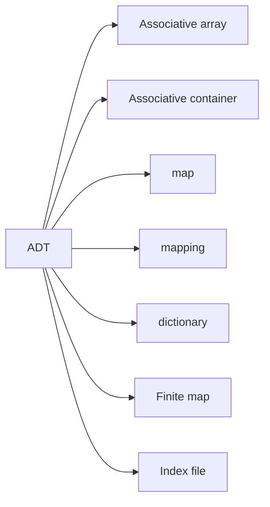

---

- The operation of finding the value associated with a key is called <span style="color: red">a <i>lookup</i></span> or <span style="color: red"><i>indexing</i></span>, and this is the most important operation supported by an associative array.
- The relationship between a key and its value is sometimes called a <span style="color: red"><i>mapping</i></span> or <span style="color: red">binding</span>. For example, if the value associated with the key "bob" is 7, we say that our array `maps` "bob" to 7.
- Associative arrays are very closely related to the mathematical concept of <span style="color: red">a <i>function</i> with a finite <i>domain</i></span>.

## Possible example: sequence of entries

```java
public class DelegateSeq implements IDelegateDB {
    private Delegate[] table;
    private final static int tableSize = 10; // or whatever
    private int numEntries;
    public DelegateSeq() {
        System.out.println("Simple sequence");
        table = new Delegate[tableSize];
        clearDB();
    }
    public void clearDB() {
        numEntries = 0;
    }
}
```

### Sequence of entries : *put*

```java
public Delegate put(Delegate delegate) {
    assert numEntries != tableSize; // very simple
    assert delegate != null;
    String name = delegate.getName();
    assert name != null && !name.equals("");
    Delegate previous;
    int pos = findPos(name);
    // we have to check not already in table. Time efficiency of findPos? (next slide)
    if (pos == numEntries) { // new
        numEntries++;
        previous = null;
    } else {
        previous = table[pos];
    }
    table[pos] = delegate;
    return previous;
}
```

### Sequence of entries: *findPos*

```java
private int findPos(String name) {
    assert name != null && !name.equals("");
    int i = 0;
    while (i != numEntries && !table[i].getName().equals(name))
        i++;
    return i;
}
```

<span style="background-color: rgb(66, 157, 218)"><i><b>time complexity of findPos?</b></i></span>  
<span style="background-color: rgb(66, 157, 218)"><i><b>Simple linear search: O(n)</b></i></span>  
<span style="background-color: rgb(66, 157, 218)">So put (and also get) have linear time complexity.</span>  

## Simple sequence gives O(n) behaviour

- Can be improved by using an *ordered* sequence.
- Then we can use a _binary search_.

### Ordered sequence: *findPos*

```java
private int findPos(String name) {
    // returns position where name is, or would go
    assert name != null && !name.equals("");
    int left = 0, right = numEntries;
    while (left != right) {
        int mid = (left + right) / 2;
        if (name.compareTo(table[mid].getName()) > 0) left = mid + 1;
        else right = mid;
    }
    return left; // or right, since left == right
}
```

<span style="background-color: rgb(66, 157, 218)">This is a <b>binary search</b>, so <b>O(log n)</b> – much better than unordered</span>

### Ordered sequence: *put*

```java
public Delegate put(Delegate delegate) {
    // assertions as before
    Delegate previous;
    int pos = findPos(name);
    if (pos == numEntries || !name.equals(table[pos].getName())) { // new
        int i = numEntries;
        while (i != pos) { // ‘budging up’ to keep the table ordered
            table[i] = table[i-1]; i--;
        }
        numEntries++;
        previous = null;
    } else {
        previous = table[pos];
    }
    table[pos] = delegate;
    return previous;
}
```

<span style="background-color: rgb(66, 157, 218)">But the 'budging up' <b>is O(n), so not much improvement</b>.</span>

## Ordered not much improvement

- Self indexing _can be_ O(1) – constant time. But works only in very special cases.
    - But leads to very sparse use of space in most cases.
    - But leads to very sparse use of space in most cases.
- Using a sequence works OK, but has **O(n)** time complexity.
- Ordered sequence is better: _put_ is **O(n)**, but _get_ is **O(log n)** because of the binary search.
- But we want **O(1)** in all cases.

## Answer: *Hash tables*

Hans Peter Luhn IBM, 1954  
Very clever idea!  

We will see how they are made available in the Java Base-Class Library (API) and also _how they work_.  

https://spectrum.ieee.org/tech-history/silicon-revolution/hans-peter-luhn-and-the-birth-of-the-hashing-algorithm


Hans Peter Luhn

## Java API *HashMap* : Method Summary

- `void clear()` <span style="color: orange"><i>Removes all mappings from this map.</i></span>  
- `boolean containsKey(K key)` <span style="color: orange"><i>Returns true if this map contains a mapping for the specified key.</i></span>  
- `boolean containsValue(V value)` <span style="color: orange"><i>Returns true if this map maps one or more keys to the specified value.</i></span>  
- `V get(K key)` <span style="color: orange"><i>Returns the value to which the specified key is mapped in this identity hash map, or null if the map contains no mapping for this key.</i></span>  
- `boolean isEmpty()` <span style="color: orange"><i>Returns true if this map contains no key-value mappings.</i></span>  
- `Set<K> keySet()` <span style="color: orange"><i>Returns a set view of the keys contained in this map.</i></span>  
- `V put(K key, V value)` <span style="color: orange"><i>Associates the specified value with the specified key in this map.</i></span><br><span style="color: orange"><i>(Returns the old discarded value – same with remove below)</i></span>  
- `V remove(K key)` <span style="color: orange"><i>Removes the mapping for this key from this map if present.</i></span>  
- `int size()` <span style="color: orange"><i>Returns the number of key-value mappings in this map.</i></span>  
- `Collection<V> values()` <span style="color: orange"><i>Returns a collection view of the values contained in this map.</i></span>  

# Hash tables

> [!ABSTRACT] Vocabulary
> retrieve  检索  
> 
> modulo  取模  
> 
> quadratic probing  平方探查  
> 
> load factor  负载因子

## Hash tables (associative arrays)

- **Content topics:**
    - Hashing
    - Hash functions
    - Collision resolution
        - Probing (open addressing)
        - Chaining

## Typical scenario

- Fast storage and searching of large tables, lists, databases etc
- Need to <span style="color: red">minimize</span> processing operations (comparisons and index calculations) per search
- Numerous application areas for fast table-lookup
- <span style="color: blue">For example:<br>databases, dictionaries, compiler symbol table, search engines, password lookup ...</br>
## What’s the problem

- How to store and then be able to locate items from a large data set very quickly
- The problem is whatever search methods we use, the following fact will not change: <br><span style="color: red">The more data we have, the slower the access</span>

### What’s the problem - realistic demand

- <span style="color: red">The more data we have, the slower the access</span>
- For example:
    - Suppose a compiler allows 6-character symbol names that start with an upper-case letter (A-Z) followed by 5 alpha-numeric (0-9, A-Z)
    - How many possible symbol names could there possibly be?
    - Answer: $26^1 \times 36^5 = 1,572,120,576$ or approximately $1.572 \times 10^9$
    - It would <span style="color: red">not be sensible</span> to allocate this amount ($1.572 \times 10^9$) of memory and use fewer than 10,000 elements (an amount of elements that a program usually handles)

---


A 16-digit bank card
- For example:
    - How many possible accounts
        - $10^{16}$
    - World population
        - $8068351220 \approx 8.07 \times 10^9$
    - Proportion of accounts we may use
        - $8.07 \times 10^{9-16}$
        - $0.0000807\%$
<span style="color: red">Too wasteful</span>  
<span style="color: red">No necessary</span>

### What’s the problem- efficiency

- Linear search
    - With N items on average, we need to trawl through N/2 of them to find the one we want. So a linear search is O(N)
    - With twice the number of data items, the search time doubles

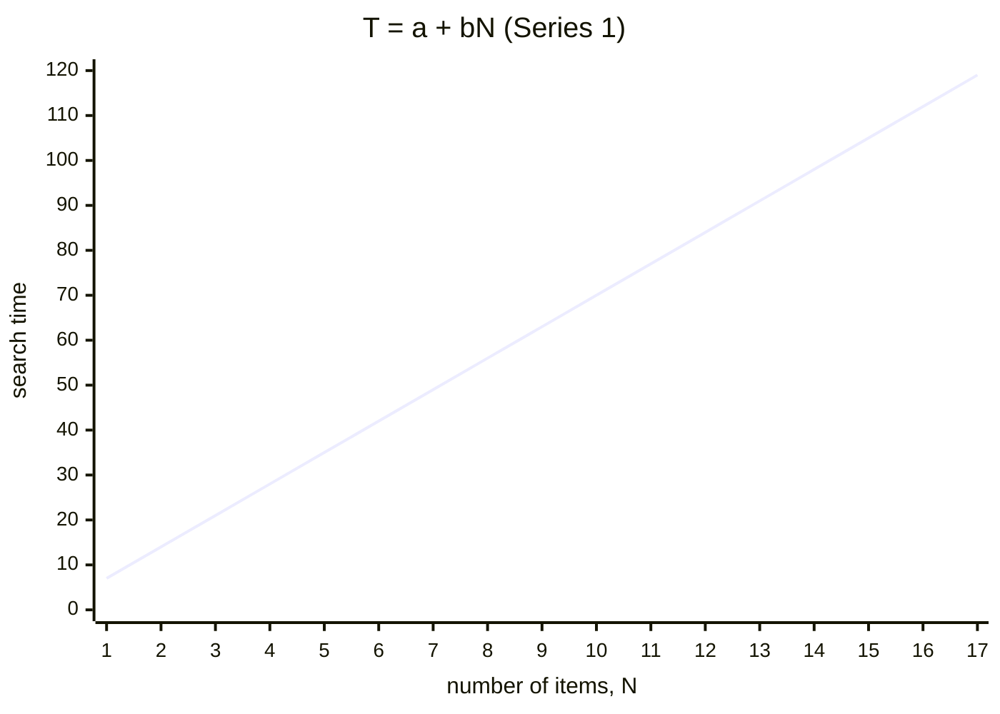

---

- Binary Search
    - This is the technique we use to find an entry in a telephone directory in which the entries are sorted. The complexity of the binary search is O(logN)

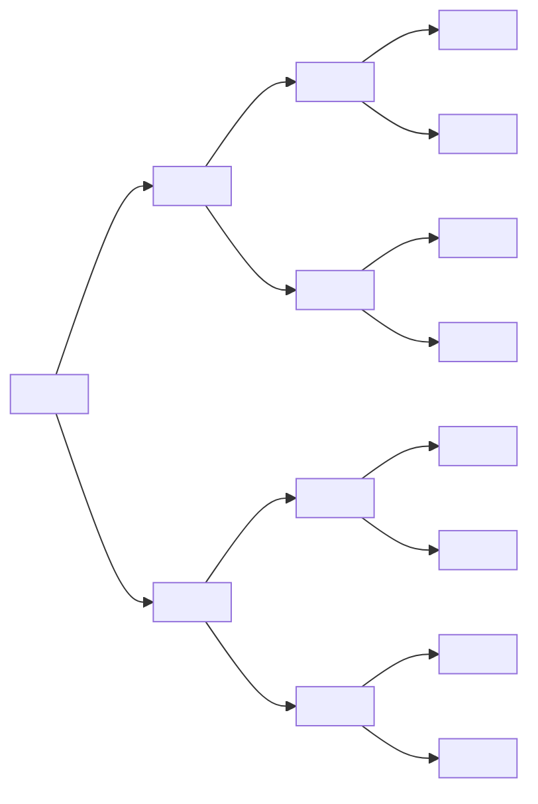

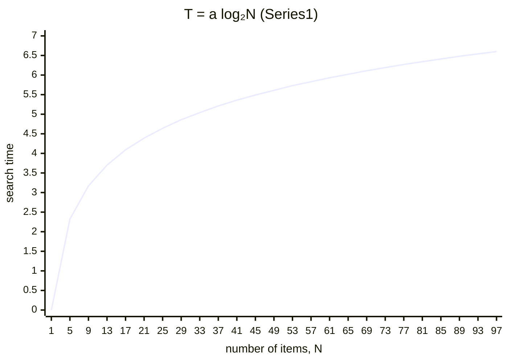

## Search-Algorithm Performance

- Linear search is O(N) – is the worst-possible case, *linear* time
- Binary search is O(log N) – is better, *logarithmic* time, but requires data to be sorted
- <span style="color: red">What we desire is O(1) or O(N<sup>0</sup>)</span>
    - i.e. search time is constant, independent of data size N
    - so we can reach any data in a fixed number of operations, i.e. *constant* time

## 'Associative' array

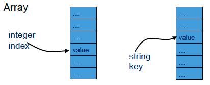
- Suitable data structures for associative array:
    - Binary search tree \[O(logn)\]
    - Hash table \[O(1)\]

## 'Hashing'

- 'Messing things up', for example:
    - Corned-beef hash `// 玉米牛肉糜`
    - Hash brown potatoes `// 薯饼`
- Hence the meat-mincing machine in next slide…
- <span style="background-color: rgb(66, 157, 218)">Hashing for CS: <br>A method of transforming a search key into an address, for the purpose of fast and efficient storage and retrieval of data items.</span>

### Example: finding someone quickly

|  |  |  |  |
| ------------------------------------ | ------------------------------------ | ------------------------------------ | ------------------------------------ |

## How does hashing work

- Instead of storing each new data item in the next free memory location, we need to find a way to find its storage location based on a key value from the data content.
- That way we will be able to locate each data item, <span style="color: red">using its key value</span>.

---

- <span style="color: red">Hashing:</span>
- The process of <span style="color: red"><b>build a relationship</b> between constant numbers</span> (such as 1, 2, 3…) <span style="color: red">and particular content</span>.

---

- So the location to store/find a data item is obtained using a *hash* function applied to the data item (key) value
- The hash function <span style="color: red">maps a key to an <i>arbitrary</i> (but not '<i>random</i>') integer</span> 'bucket number'
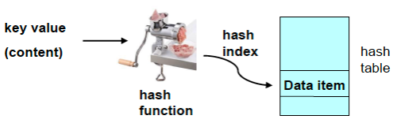

## What is a hash function

- <span style="color: red">Hash function(method):</span>
    - The way/method to <span style="color: red">convey the particular contents into constant numbers</span>.

### A hashing example

- Lets' store some names of a few people in a table of size 12, so index 0 to 11 in Java
- The key value for each person is simply the name string, e.g. "`ChrisC`"
- The hash function is obtained from the sum of the ASCII codes of the characters in each string.

<table>
    <caption style="caption-side: bottom; padding: 10px;">
        ASCII codes for letters
    </caption>
	<tr>
		<td>A</td>
		<td>B</td>
		<td>C</td>
		<td>D</td>
		<td>E</td>
		<td>F</td>
		<td>G</td>
		<td>H</td>
		<td>I</td>
		<td>J</td>
		<td>K</td>
		<td>L</td>
		<td>M</td>
	</tr>
	<tr>
		<td>65</td>
		<td>66</td>
		<td>67</td>
		<td>68</td>
		<td>69</td>
		<td>70</td>
		<td>71</td>
		<td>72</td>
		<td>73</td>
		<td>74</td>
		<td>75</td>
		<td>76</td>
		<td>77</td>
	</tr>
	<tr>
		<td>N</td>
		<td>O</td>
		<td>P</td>
		<td>Q</td>
		<td>R</td>
		<td>S</td>
		<td>T</td>
		<td>U</td>
		<td>V</td>
		<td>W</td>
		<td>X</td>
		<td>Y</td>
		<td>Z</td>
	</tr>
	<tr>
		<td>78</td>
		<td>79</td>
		<td>80</td>
		<td>81</td>
		<td>82</td>
		<td>83</td>
		<td>84</td>
		<td>85</td>
		<td>86</td>
		<td>87</td>
		<td>88</td>
		<td>89</td>
		<td>90</td>
	</tr>
	<tr>
		<td>a</td>
		<td>b</td>
		<td>c</td>
		<td>d</td>
		<td>e</td>
		<td>f</td>
		<td>g</td>
		<td>h</td>
		<td>i</td>
		<td>j</td>
		<td>k</td>
		<td>l</td>
		<td>m</td>
	</tr>
	<tr>
		<td>97</td>
		<td>98</td>
		<td>99</td>
		<td>100</td>
		<td>101</td>
		<td>102</td>
		<td>103</td>
		<td>104</td>
		<td>105</td>
		<td>106</td>
		<td>107</td>
		<td>108</td>
		<td>109</td>
	</tr>
	<tr>
		<td>n</td>
		<td>o</td>
		<td>p</td>
		<td>q</td>
		<td>r</td>
		<td>s</td>
		<td>t</td>
		<td>u</td>
		<td>v</td>
		<td>w</td>
		<td>x</td>
		<td>y</td>
		<td>z</td>
	</tr>
	<tr>
		<td>110</td>
		<td>111</td>
		<td>112</td>
		<td>113</td>
		<td>114</td>
		<td>115</td>
		<td>116</td>
		<td>117</td>
		<td>118</td>
		<td>119</td>
		<td>120</td>
		<td>121</td>
		<td>122</td>
	</tr>
</table>

| C   | h   | r   | i   | s   | C   |
| --- | --- | --- | --- | --- | --- |
| 67  | 104 | 114 | 105 | 115 | 67  |

---

- To obtain an index in the range 0 to 11 calculate: character code sum, modulo 12
- So, hash = (sum of ASCII codes for each character in string) modulo 12 (% operator)
- Range of hash index is 0 to 11

<span style="color: blue">Hash value for "ChrisC"</span>  
<span style="color: blue">Sum of character codes: 67 + 104 + 114 + 105 + 115 + 67 = 572</span>  
<span style="color: blue">572 mod 12 is 8</span>  
<span style="color: blue">So hash value is 8</span>  

Similarly:
- "ChrisC" → 8
- "SharonC“→ 2
- "DavidL“→ 0
- "IanB“→ 10

## Simple Hashing

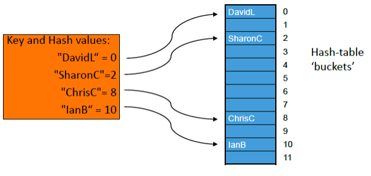

### *Too*-simple hash function

```java
int hashFirstChar(String s) { // just value of first character
    return s.charAt(0) % tableSize;
    // mod tableSize gives a value in range 0 .. tableSize-1
}
```
(Can do the _% tableSize_ later instead)
<center><span style="color: red">This hash function has problem:</span></center>
<center><span style="color: blue">names starting with <span style="color: red">same</span> letter all have <span style="color: red">same</span> hash value!</span></center>

### Modify simple hash function-v1

```java
final int tableSize = 12; // for example
private static int hashSum(String key) {
    int hashValue = 0;
    for(int j = 0; j != key.length(); j++)
        hashValue = hashValue + (int)key.charAt(j);
    return hashValue; // or hashValue % tableSize here or later
}
```
<center><span style="color: red">This hash function still has problem:</span></center>
<center><span style="color: red">Different</span> names with <span style="color: red">same</span> letters hash to <span style="color: red">same</span> value!</center>
<center>hashSum("marcel") = hashSum("carmel") = 628</center>

### Modify simple hash function-v2

```java {5}
private static int hashWeighted(String key) {
    int hashValue = 0;
    for(int j = 0; j != key.length(); j++)
        hashValue = j * hashValue + (int)key.charAt(j);
        // "j *" here is weighting
    return hashValue;
}
```
hashWeighted("marcel") = 34153  
hashWeighted ("carmel") = 33153  
<span style="color: red">This hash function still has problem</span>

#### Danger! Overflow ahead!

- hashWeighted("Brzeczyszczykiewicz") <br>= 1,876,978,831,955,724,338
- But biggest integer in 32 bits, `Integer.MAX_VALUE` <br>= 2,147,483,647
<span style="color: red">Numeric overflow! Can crash program.</span>

### Possible solution avoiding overflow

```java
private static int hashWeighted(String key) {
    int hashValue = 0;
    for(int j = 0; j != key.length(); j++)
        hashValue = (j * hashValue + (int)key.charAt(j)) % tableSize;
    return hashValue;
}
```

## Some examples of hashing functions

- **Division**:<br>h(k) is the remainder (modulus) of key k after division by the size of the table, s.<br>h(k) = k % s; if k = 7155, s = 97 then h(k) = 74
- **Truncation**:<br>Take a few of the first or last characters of the key as the hash code. Can work well, provided the characters are evenly distributed.

---

- **Mid-square**:<br>the key is squared and the middle digits of the result are used as the hashed value.<br>k = 7155; k<sup>2</sup> = 51194025; h(k) = 94 (from 511 <span style="color: red">94</span> 025)
- **Folding**:<br>the key is partitioned into several parts and the sum of the parts is used to produce the hash code<br>k = 7155; 71 + 55 → 126 or 17 + 55 → 72
- ……

## Practice: calculate your name hash value

- Store some names of a group students, so table size should be <span style="color: red">26</span>, the key value for each one is simply the name string, e.g. "`Tony`"
- The hash function is <span style="color: red"><b>Division</b></span>:
    - <span style="color: red">k is the sum of the ASCII codes of the letters in the name string;</span>
    - <span style="color: red"><i>h(k)</i> is the remainder (modulus) of key <i>k</i> after division by the size of the table, s.<br><i>h(k)</i> = k % s; s = 26</span>

<table>
    <caption style="caption-side: bottom; padding: 10px;">
        ASCII codes for letters
    </caption>
	<tr>
		<td>A</td>
		<td>B</td>
		<td>C</td>
		<td>D</td>
		<td>E</td>
		<td>F</td>
		<td>G</td>
		<td>H</td>
		<td>I</td>
		<td>J</td>
		<td>K</td>
		<td>L</td>
		<td>M</td>
	</tr>
	<tr>
		<td>65</td>
		<td>66</td>
		<td>67</td>
		<td>68</td>
		<td>69</td>
		<td>70</td>
		<td>71</td>
		<td>72</td>
		<td>73</td>
		<td>74</td>
		<td>75</td>
		<td>76</td>
		<td>77</td>
	</tr>
	<tr>
		<td>N</td>
		<td>O</td>
		<td>P</td>
		<td>Q</td>
		<td>R</td>
		<td>S</td>
		<td>T</td>
		<td>U</td>
		<td>V</td>
		<td>W</td>
		<td>X</td>
		<td>Y</td>
		<td>Z</td>
	</tr>
	<tr>
		<td>78</td>
		<td>79</td>
		<td>80</td>
		<td>81</td>
		<td>82</td>
		<td>83</td>
		<td>84</td>
		<td>85</td>
		<td>86</td>
		<td>87</td>
		<td>88</td>
		<td>89</td>
		<td>90</td>
	</tr>
	<tr>
		<td>a</td>
		<td>b</td>
		<td>c</td>
		<td>d</td>
		<td>e</td>
		<td>f</td>
		<td>g</td>
		<td>h</td>
		<td>i</td>
		<td>j</td>
		<td>k</td>
		<td>l</td>
		<td>m</td>
	</tr>
	<tr>
		<td>97</td>
		<td>98</td>
		<td>99</td>
		<td>100</td>
		<td>101</td>
		<td>102</td>
		<td>103</td>
		<td>104</td>
		<td>105</td>
		<td>106</td>
		<td>107</td>
		<td>108</td>
		<td>109</td>
	</tr>
	<tr>
		<td>n</td>
		<td>o</td>
		<td>p</td>
		<td>q</td>
		<td>r</td>
		<td>s</td>
		<td>t</td>
		<td>u</td>
		<td>v</td>
		<td>w</td>
		<td>x</td>
		<td>y</td>
		<td>z</td>
	</tr>
	<tr>
		<td>110</td>
		<td>111</td>
		<td>112</td>
		<td>113</td>
		<td>114</td>
		<td>115</td>
		<td>116</td>
		<td>117</td>
		<td>118</td>
		<td>119</td>
		<td>120</td>
		<td>121</td>
		<td>122</td>
	</tr>
</table>

## Practice

- Design your own hash method
    - to calculate the hash value for your name string
    - should be different from the example method mentioned above
    - try to use easy way

<span style="color: red">The most handsome boy/most beautiful girl demonstrate</span>

> [!NOTE] Summary Quiz
> https://ks.wjx.top/vm/ttamyHO.aspx
> 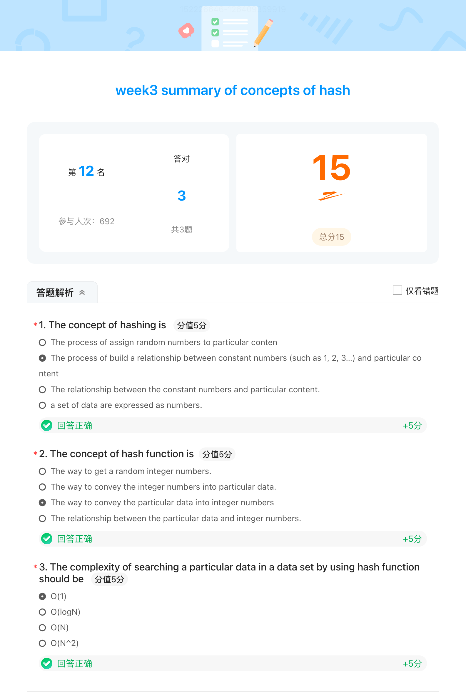

## Simple Hashing – with Hash Clash

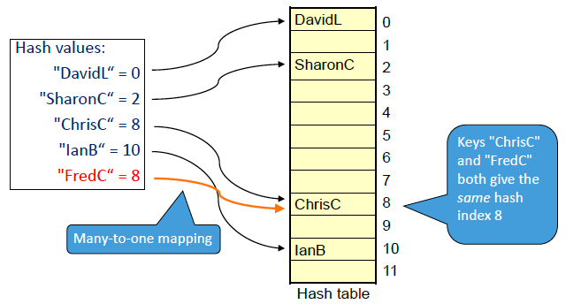

## Search(Retrieval)

- Use the same hashing function and collision-resolution method as for inserting.
- At best can get <span style="color: red"><i>O(1)</i></span> – constant time.
> Can’t do better than that!

## Perfect hash function

A _perfect_ hash function gives <span style="color: red">no <i>collisions</i></span>:  
For all x and y:
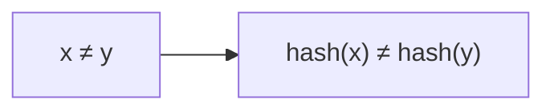
- Possible if you know the data.
- _Collision_ is when two or more keys have the same hash value.
- Rarely possible, but for example in a compiler,
- determine whether identifier is a _reserved word_.
- We _know_ all the reserved words, so can construct a perfect hash function.

## Desirable characteristics of a hashing function

- <span style="color: red"><i>Quick</i></span> to calculate
- Gives good <span style="color: red"><i>spread</i></span> – different keys map to different bucket/slot numbers (positions in the table)
- <span style="color: red"><i>A perfect</i></span> hashing function maps every key to a <span style="color: red">different</span> bucket/slot number
- but in practice, sometimes get a ‘<span style="color: red"><i>clash</i></span>’ 💣 – more than one key is mapped to the _same_ bucket number.
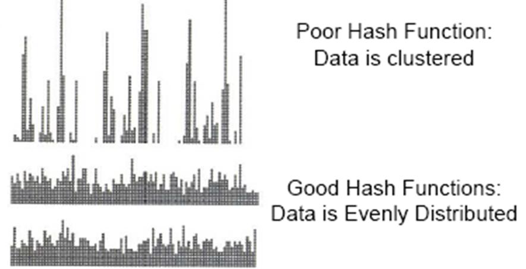

## More about hash functions

- The hash function can potentially generate any hash table index, 0..TableSize-1 so we often use the modulo (%) operator to restrict the hash function range
- A hash function directs us to a single storage location for a particular data key value
- If we could guarantee that each possible key value maps on to <span style="color: red">a unique entry (1:1 mapping)</span> then our hashing would be perfect.
- Because the hash table in practice is limited in size, and the difficulty of ensuring one-to-one mapping, we need to <span style="color: red">allow for collisions</span>.
> Try to reduce collisions!  
> Impossible to eliminate!

## One Java built-in `hashCode()` method

$\text{hashCode}(s) = s[0] \times 31^{(n-1)} + s[1] \times 31^{(n-2)} + \dots + s[n-1] \times 31^0$  
$e.g.$  
$\text{hashcode}(^{\prime\prime}\text{A}^{\prime\prime}) = 65$  
$\text{hashcode}(^{\prime\prime}\text{AB}^{\prime\prime}) = 65 \times 31^1 + 66 = 2081$  
$\text{hashcode}(^{\prime\prime}\text{ABC}^{\prime\prime}) = 65 \times 31^2 + 66 \times 31^1 + 67 = 64578$  
<span style="color: red">Beware numeric overflow! Use % early.</span>
```java
public class Hash10 {
    public static void main(String[] args) {
        System.out.println("hashCode(\"A\")="+"A".hashCode());
        System.out.println("hashCode(\"AB\")="+"AB".hashCode());
        System.out.println("hashCode(\"ABC\")="+"ABC".hashCode());
        System.out.println("hashCode(\"ABCD\")="+"ABCD".hashCode());
    }
}
```
result:
```console
hashCode("A")=65
hashCode("AB")=2081
hashCode("ABC")=64578
hashCode("ABCD")=2001986
```

## Probability of hash clashes

- What is the probability that 2 (or more) people in a group of n <span style="color: red">share a birthday month</span>?<br>Assume that birthdays are equally and randomly distributed over 12 months.
Q(n) = probability that n people have distinct birthday months  
Q(2) = 11/12 = 0.9166  
Q(3) = 11/12 x 10/12 = 0.7639  
Q(4) = 11/12 x 10/12 x 9/12 = 0.5729  
etc  

P(n) = 1-Q(n) = probability that 2 or more people of the n **share a birthday month**, so  
P(2) = 0.0834  
P(3) = 0.236  
P(4) = 0.427  
P(5) = 0.618  
P(6) = 0.777  
etc.  

> 5 people > 50%

```mermaid
xychart-beta
    title "birthday months problem"
    x-axis "n" [0,2,4,6,8,10,12]
    y-axis "P(x)" 0 --> 1.0
    line "Series1" [0,0.1,0.3,0.6,0.85,0.95,1.0]
```

## Probabilities of clashes in Hash Table

- A surprising example:
    - Create a hash table with Table_Size=1,000,000 entries (index 0..Table_Size-1)
    - Hash function creates an arbitrary index number (based on the key value) that is uniformly distributed in the range 0..Table_Size-1
    - Keep adding hash entries to the table
    - The probability that a collision will occur before 2,500 entries are made is 95%, i.e. when the table is only <span style="color: red">0.25%</span> full
- <span style="color: red">Conclusion: clashes can occur more frequently than we might intuitively expect.</span>

## Collision Resolution – *Linear* probing

- Hash collisions can be resolved by probing to find an alternative location.
    - If a collision occurs \[hash(key1)=hash(key2)\] look for next table entry that is free
    - First calculate:
        - `Index1 = hash(Key)` (which cell is not available)
        - `hash(key)` maps to range 0 ..Table_Size-1
    - Next calculate
        - `Index2 =(Index1 + probe) % Table_Size`
    - repeating with probe = 1,2,3,.. until a vacant entry is found (probe function)

---

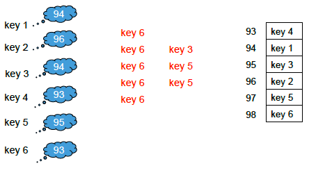
<span style="color: red">primary clustering has occurred for keys that hash to index 93 and 94</span>

---

- Hash collisions can be resolved by _probing_ to find an <span style="color: red">alternative location</span>.
    - <span style="color: red">Advantages:</span>
        - resolves hash clash
        - simple algorithm
    - <span style="color: red">Disadvantages:</span>
        - local clustering around the primary key (termed primary clustering, such as key1~key6)
        - deletion is tricky (it leaves holes)

### Linear probing - Number of probes

- the data is stored <span style="color: red">within</span> the hash table (also called 'closed hashing').
- We want to <span style="color: red">increase efficiency for probing</span>
<span style="color: red">= easy to find a vacant cell to store the hash value</span>  
<span style="color: red">= give more space than the storage required</span>

which one is easier to find a vacant cell to store hash code for key1~key6 (<span style="color: red">collision existed</span>)

## Collision resolution: Open addressing

- <span style="color: red">Open addressing</span>
- The average number of probes for a search depends critically on the hash-table <span style="color: red"><i>load factor</i></span>, <span style="color: red"><i>L</i></span><br><span style="color: red"><i>L = number_of_items_in_table / Table_Size</i></span>
often expressed as a percentage  
<span style="background-color: rgb(66, 157, 218)">Therefore the maximum capacity is simply the hash table size, and <span style="color: red">maximum load factor is 1.0</span>.</span>

## Linear probing - Number of probes

- The average number of probes for a search depends critically on the hash-table <span style="color: red">load factor</span>
- Average number of probes calculation is complex to derive
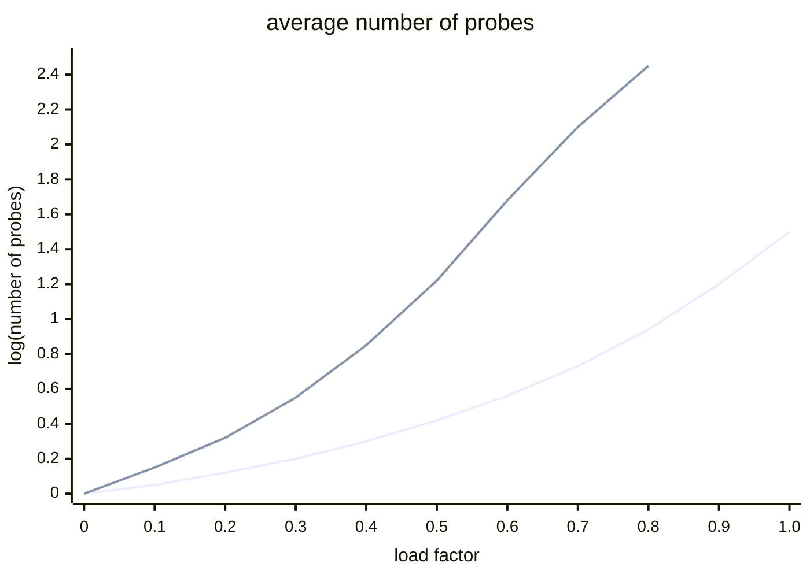

## To solve clustering

- Primary clustering
    - When keys hash to the same location and are then stored close by – this leads to *primary clustering*
    - <span style="color: red">Avoid by</span> allowing the probe function to provide a greater spread of keys
- Secondary clustering
    - When keys hash to the same index and then follow the same probe sequence (same offset), this leads to *secondary clustering*
    - <span style="color: red">Avoid with</span> probe offset being non-linear (quadratic) or a function of the key (double hashing)

### To solve clustering– Quadratic Probing

- As linear probing but instead of looking for *next* table entry, we move in jumps of a *size* involving the <span style="color: red"><i>square</i></span> of the probe integer
    - First calculate:<br>`Index1 = hash(Key)` (which is not available)
    - Next calculate<br>`Index2 = (Index1 + i²) mod Table_Size`<br>with i=1,2,3, …
    - So jump *on* by 1, 4, 9, 16, 25 …

---

- Advantages:
    - As linear and pseudo-random probing but primary clustering is reduced.
    - Also simpler than pseudo-random probing
- Disadvantage:
    - (of all probing methods) is a degraded performance when the table starts to become full.
    - Can lead to <span style="color: red"><i>infinite loop</i></span> since empty cells might be repeatedly skipped over. Need to detect this and avoid it. (OK if load factor < 50%.)

### To solve clustering– Double Hashing

- can avoid both primary and secondary clustering.
- uses <span style="color: red"><i>two</i> hash functions</span>: <span style="color: red">initial <i>hash</i></span>, and <span style="color: red"><i>probe</i></span><br>`Index1 = hash(key)`<br><span style="color: red">{ideally maps to 0..Table_Size-1}</span>
- If Index1 entry is occupied use a <span style="color: red"><i>probe</i></span> function to locate a vacant position<br>`Index2 = (Index1 + i * probe(key)) % Table_Size`<br>(note `probe(key)` computed only once)
- Probe index <span style="color: red">i</span> = 1, 2, 3,… until a vacant position is found – but you should limit the number of probes to avoid wrap around to the same index and thus possible infinite loop.

---

- Can require fewer probes, giving better performance than linear probing
- Ensure probe(key) > 0 , ideally probe(key) maps to *1*..Table_Size-1
Linear probing is double hashing when  
probe(key) = <span style="color: red">? 1</span>

### Double hashing

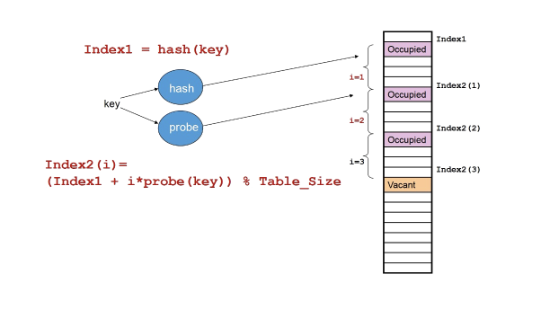
Double hashing:  
_hash_ is the first function  
_probe is the second function_

## Open-Addressing Hashing Efficiency

- Average steps of probes

<table border="1" cellpadding="6" cellspacing="0">
  <thead>
    <tr>
      <th><i>method</i></th>
      <th colspan="3"><i>successful searches</i></th>
      <th colspan="3"><i>unsuccessful searches</i></th>
    </tr>
    <tr>
      <th>load factor</th>
      <th>50%</th>
      <th>80%</th>
      <th>90%</th>
      <th>50%</th>
      <th>80%</th>
      <th>90%</th>
    </tr>
  </thead>
  <tbody>
    <tr>
      <td>linear probing</td>
      <td>1.5</td>
      <td>3.0</td>
      <td>5.5</td>
      <td>2.5</td>
      <td>13.0</td>
      <td>50.0</td>
    </tr>
    <tr>
      <td>quadratic probing</td>
      <td>1.4</td>
      <td>2.2</td>
      <td>2.9</td>
      <td>2.2</td>
      <td>5.8</td>
      <td>11.4</td>
    </tr>
    <tr>
      <td>double hashing</td>
      <td>1.4</td>
      <td>2.0</td>
      <td>2.6</td>
      <td>2.0</td>
      <td>5.0</td>
      <td>10.0</td>
    </tr>
  </tbody>
</table>

## collision resolution: chaining

- Separate <span style="color: red">chaining</span>
    - start a <span style="color: orange"><i>linked list</i></span> to store the data for each key for that maps to the hash-table location
    - each hash table entry can then accommodate a *list* of key values that share the same hash value
- Since each hash table entry can be a list there is no limit to the hash-table capacity, so the <span style="color: red"><i>load factor may exceed 1.0</i></span>.

---

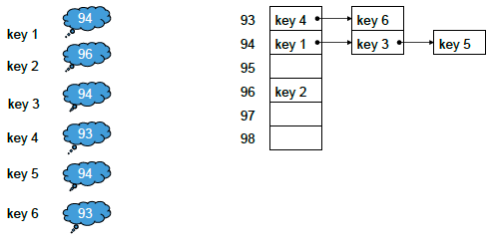
- Linked lists within the hash table handle collisions
- Alternative to 'open addressing', Linked list of all elements whose keys have same hash index.

### collision resolution: chaining example

```java
import java.util.LinkedList;
import java.util.ListIterator;
public class Hash11 {
    public static void main(String[] args) {
        final int HTS = 12; // hash table size
        LinkedList[] staff=new LinkedList[HTS];
        for(int i=0; i<HTS; i++)
            staff[i]=new LinkedList();
        addStaff(staff,"Sharon");
        addStaff(staff,"Chris");
        addStaff(staff,"Ian");
        addStaff(staff,"David");
        addStaff(staff,"Peter");
        addStaff(staff,"Muhammad");
        addStaff(staff,"Arantza");
        addStaff(staff,"Ken");
        addStaff(staff,"Richard");
        addStaff(staff,"Hong");
        addStaff(staff,"William");
        addStaff(staff,"Mark");
        addStaff(staff,"Bob");
        addStaff(staff,"Clare");
        addStaff(staff,"Faye");
        ListIterator iterator=staff[0].listIterator();
        for(int i=0; i<HTS; i++) {
            iterator=staff[i].listIterator();
            System.out.print("staff["+i+"]: ");
            while (iterator.hasNext())
                System.out.print(iterator.next()+" ");
            System.out.println();
        }
    }
    private static void addStaff(LinkedList[] staff, String key) {
        final int HTS = 12; // hash table size
        staff[hash(key)].addLast(key);
    }
    private static int hash(String key) {
        final int HTS = 12; // hash table size
        return Math.abs(key.hashCode() % HTS);
    }
}
```
run:
```console
staff[0]: Hong
staff[1]: Richard
staff[2]:
staff[3]: Sharon
staff[4]: Muhammad Ken
staff[5]: Arantza William Mark Bob
staff[6]:
staff[7]: Chris Clare
staff[8]: David Peter
staff[9]:
staff[10]: Ian
staff[11]: Faye
BUILD SUCCESSFUL (total time: 0 seconds)
```

### Hashing with Chaining

- Average number of probes
    - For the number of probes (or comparisons), first determine the average chain length for cells having a chain
    - In the illustration the average chain length is<br>$((1 \times 1) + (1 \times 2) + (1 \times 3)) \div 3 = 2$
    - <span style="color: red">For an unsuccessful search</span> the complete chain is inspected. The number of comparisons is this average chain length, so is 2
    - <span style="color: red">For a successful search</span> on average the search travels midway along the chain. For chain length k, the mid length is $(1+2+...+k)\div k = (k+1) \div 2$, so with an average chain length of 2 the mid length is $(2+1)\div 2 = 1.5$

## Linear Probing vs Chaining

| <span style="color: red">Linear Probing</span>                                                                                                                                                                                                    | <span style="color: red">Chaining</span>                                                                                                                                                                                                                         |
| ------------------------------------------------------------------------------------------------------------------------------------------------------------------------------------------------------------------------------------------------- | ---------------------------------------------------------------------------------------------------------------------------------------------------------------------------------------------------------------------------------------------------------------- |
| - Can require less memory (best for small data records)<br>- Best when load factor is low<br>- No pointers or memory allocation, so safe operation<br>- Insertion can be quicker, without memory allocation<br>- Memory references more localized | - Simple to implement<br>- Less sensitive to clustering, but need to monitor chain lengths because searching in a chain is linear, O(n)<br>- Better for high load-factor situations as hash table linked lists do not fill up<br>- Better for large data records |

## Hashing Performance

- Best Case (ideal) O(1)
- Worst case (all keys hash to same slot) O(n)
- Performance very dependent on hash table <span style="color: red">Load Factor<br>Load Factor = number of items in table / table size</span>
- Likelihood of collision strongly related to load factor
- Load Factor (L) = 0 represents empty table
    - <span style="color: red">Open Addressing: 0 ≤ L ≤ 1, (hash table can only fill to capacity)</span>
    - <span style="color: red">Chaining: 0 ≤ L, (so L can exceed 1)</span>
- Typically performance becomes poor when table > 80% full
- Rebuild with a bigger table to improve performance if table becomes full

## Disadvantages of hash tables

- The *size* of the table is *fixed* and must be estimated in advance. It cannot be changed at runtime.
- Table size should be about 10% larger than the maximum expected number of entries.
- Hashing algorithms are <span style="color: red">designed for efficient <i>insertion</i> and <i>retrieval</i></span>. <span style="color: red">Deletions are <span style="color: orange"><i>cumbersome</i></span> and should be <i>avoided</i>.</span> (Don’t just replace entry by *null* – "example: Where's Wally")<br>Use 'lazy deletion'; don’t really remove – just mark entry as inactive.
- Contents *not stored in order*, so <span style="color: red"><i>sorting needed</i></span>.
- The space needed for pointers for chaining could be used for a larger table.

## Summary

- Access time is not dependent on the size of the table, at best O(1)
- Good for storing data not directly representable as array indexes,<br>or for storing sets of data from very large data sets.
- <span style="color: red">Key values mapped to index by <i>hashing function</i>.</span>
- <span style="color: red">Different keys mapping to same index means <i>collision</i>.</span>
- <span style="color: red"><i>Collision resolution</i>:</span>
    - <span style="color: red">'<i>open addressing</i>' using various '<i>probing</i>' algorithms;</span>
    - <span style="color: red"><i>chaining</i> (most efficient, but uses more memory).</span>
- <span style="color: red">Hashing efficiency depends critically on hash-table load factor and degree of clustering</span>

## References

- Robert Sedgewick, Algorithms in Java, Addison-Wesley, Ch 14.
- Mark Allen Weiss, Data Structures and Algorithm Analysis, Addison-Wesley, Ch 5
- Cormen, Leiserson and Rivest, Introduction to Algorithms, Ch 12
- Niklaus Wirth, Algorithms+Data Structures=Programs, Prentice-Hall
- Wikipedia: https://en.wikipedia.org/wiki/Hash_table

## Extra: history

- The idea of hashing arose independently in different places.
- In January 1953, H. P. Luhn wrote an internal IBM memorandum that used hashing with chaining.
- Gene Amdahl, Elaine M. McGraw, Nathaniel Rochester, and Arthur Samuel implemented a program using hashing at about the same time. Open addressing with linear probing (relatively prime stepping) is credited to Amdahl, but Ershov (in Russia) had the same idea.
