> [!NOTE] Vocabulary
> recursion 递归
> 
> recursive 递归的
> 
> self-referential 自引用
> 
> traverse 遍历

# Recursion

## Content

- Recursion
    - What is recursion
    - What it is good for
    - When not to use recursion
    - Backtracking

## Basic concepts about Recursion

- Self-referential (defined in terms of itself)

- Natural numbers:
    - a) 1 is a <span style="color: red">natural number</span>
    - b) The successor of a natural number is a natural number

- Recursion is a programming technique much used in *declarative* (*functional*) programming -a different way of getting repetition.

|  |  |
| ------------------------------------ | ------------------------------------ |

### Recursive entertainment

The movie *Inception* described one scenario:  
<span style="color: red">Dream in dream</span>


### Recursive pattern: Fractals

| Koch snowflake                                                                                   | the Barnsley fern                                                                                                  |
| ------------------------------------------------------------------------------------------------ | ------------------------------------------------------------------------------------------------------------------ |
|                                                              |                                                                                |
| <span style="background-color: rgb(66, 157, 218)">Shapes made of smaller versions of self</span> | <span style="background-color: rgb(66, 157, 218)">Not a photo,<br>It is generated by a mathematical formula</span> |

### Recursive description: Ancestor

An ancestor is:
- a) a parent, or
- b) a parent’s ancestor


## Factorial function

- Factorial 5, written <span style="color: red">5!</span>, is:
    - $5\times4\times3\times2\times1$
- and <span style="color: red">6!</span> is
    - $6\times5\times4\times3\times2\times1$, so $6\times5!$

⬇

Factorial function, for non-negative integers is:
- a) $0! = 1$
- b) if $n > 0$, then $n! = n\times(n - 1)!$

## Factorial function in Java

```java
int factorial (int n) {
/*  pre: n >= 0
    post: factorial(n) = n!  */
    if (n == 0) then return 1;
    else return n * factorial(n - 1);
} /* factorial */
```

<span style="color: red">This function has problem:</span>  
> [!CAUTION] Caution
> - <span style="color: red">inefficient and</span>
> - <span style="color: red">factorial(n) > maximum integer probably</span>

## Infinite recursion (silly)

```java
void TellStory() {
    System.out.println("It was a dark and stormy night");
    System.out.println("and the captain said to the mate");
    System.out.println(" 'Tell us a story mate' ");
    System.out.println("and this is the story he told … ");
    TellStory();
} /* TellStory */
```

<span style="color: red">This function has problem:</span>  
> [!CAUTION] Caution
> - <span style="color: red">infinite and</span>
> - <span style="color: red">lead to stack overflow</span>

## Useful recursion

- To be useful the recursion must <span style="color: red"><i>terminate</i></span>, so there must be
    - <span style="color: red"><i>at least one</i> non-recursive</span>, <span style="color: red"><i>base case</i></span> (*in factorial, it is* 0!)
    - as well as <span style="color: red">recursive cases</span>.

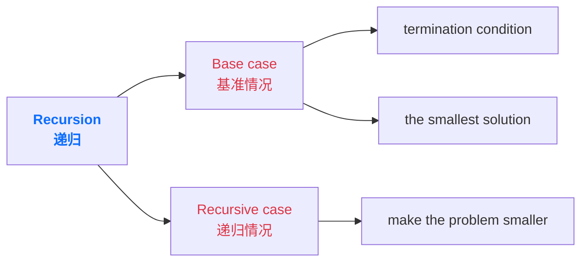

## Other recursive examples

- A <span style="color: red">linked list</span> is:
    - a) empty, or
    - b) has a <span style="color: red"><i>head</i></span> (first element)<br>and a <span style="color: red"><i>tail</i></span>, which is a <span style="color: red">linked list</span>

- A <span style="color: red">tree</span> is:
    - a) empty, or
    - b) has a <span style="color: red">root</span>,<br>and <span style="color: red">left (sub-) tree</span> and <span style="color: red">right (sub-) tree</span>

## A Recursive Class-Linked lists

```java {4}
public class Node {
    public String data;
    public Node next;
    // Here’s the recursive bit! One of the fields of Node is another Node
    public Node(String data) {
        this.data = data;
    }
}
```


---

```java
public static void main(String[] args) {
    Node n1 = new Node("Have");
    Node n2 = new Node("a");
    n1.next = n2;
    Node n3 = new Node("banana");
    n2.next = n3;
    Node node = n1;
    while (node != null) {
        System.out.print(node.data + " ");
        node = node.next;
    }
}
```

## Length of a list

- How to calculate the length of a list :
    - a) the length of an empty list is 0
    - b) the length of a (non-empty) list is:<br>1 + the length of the tail of the list

```java
int length (Node ls) {
/* pre: ls is a well formed linked list
post: length(ls) is the number of nodes in the list starting at ls */
    if (ls == null) return 0; // empty list
    else return 1 + length(ls.next); // 1+ length of tail of list
} /* length */
```

## Practice in class

- using f(i, j) represents the 𝑗<sup>𝑡ℎ</sup> number in the 𝑖<sup>𝑡ℎ</sup> line.

Pascal’s Triangle(1654)  
Yanghui’s Triangle(1261)
```java
public class YanghuiTriangle {
    public YanghuiTriangle() {}
    public int calculateYanghuiTriangle(int i, int j) {
        if (j==1 || i==j) {
            return 1;
        }
        else {
            return calculateYanghuiTriangle(i-1, j-1)+calculateYanghuiTriangle(i-1,j);
        }
    }
    public static void main(String[] args) {
        YanghuiTriangle yh = new YanghuiTriangle();
        System.out.println(yh.calculateYanghuiTriangle(5,3));
    }
}
```

---

- The Tower of Hanoi is a classic mathematical puzzle that consists of three rods (or pillars) and several disks of different sizes, which can slide onto any rod. The puzzle starts with the disks in a neat stack in ascending order of size on one rod, the smallest at the top, thus making a conical shape.
- The objective of the puzzle is to move the entire stack to another rod, obeying the following simple rules:
    1. Only one disk can be moved at a time.
    2. Each move consists of taking the upper disk from one of the stacks and placing it on top of another stack or on an empty rod.
    3. No disk may be placed on top of a smaller disk.

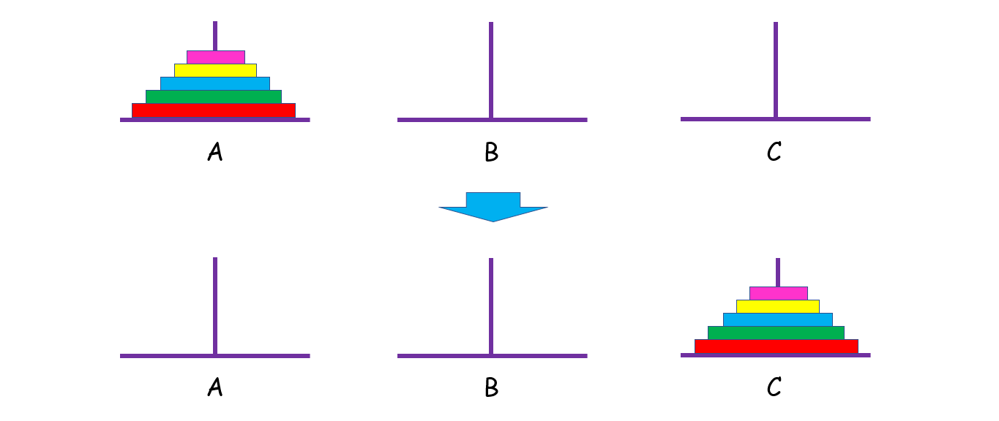

---

- Input
    - an integer n, which represents the number of disks on trod A
    - for example:

```console
3
```

- Output
    - displaying the steps of moving the disks;
    - for example:

```console
A->C
A->B
C->B
A->C
B->A
B->C
A->C
```

> A->B means moving the top disk from trod A to the top of trod B

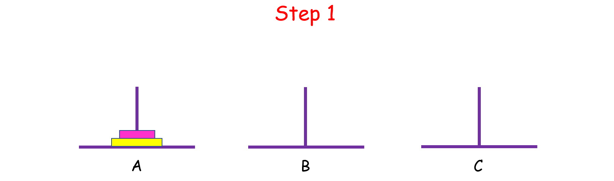
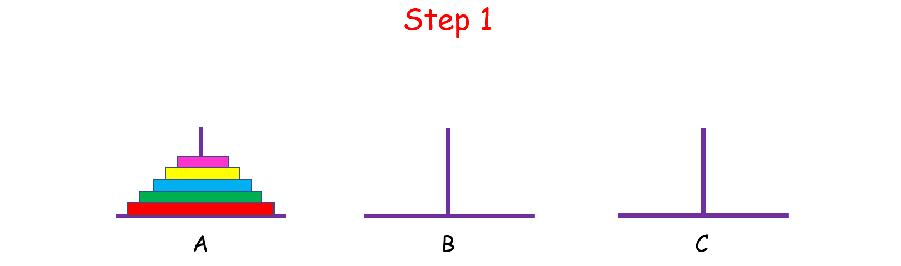

## In contrast to recursive: iterative

- The term <span style="color: red"><i>iterative</i></span> comes from the Latin <span style="color: red"><i>iter</i></span> meaning a <span style="color: red"><i>journey</i></span>, as in *itinerary, itinerant, iteration, iterator, …*
- In programming it refers to <span style="color: red">making repetitions</span> by using 'looping' statements, such as <span style="color: red"><i>while, for</i></span>, …

## Iterative example - isPresent

```java
static boolean isPresent (int[] a, int x) {
    // pre: true
    // post: isPresent(a, x) <=> “there is an x in a”
    int i = 0;
    while(i != a.length && a[i] != x) {
        i++;
    } // i == a.length || a[i] == x
    return i != a.length;
}
```

## Recursive example - isPresent()

```java
static boolean isPresentAux(int[] a, int x, int start) {
/* pre: true
post: isPresent(a, x, start) <=>
"there is an x in a", starting from start */
    boolean result;
    if (start == a.length) result = false; // empty sequence
    else if (a[start] == x) result = true; // found x
    else result = isPresentAux(a, x, start+1);
    return result;
}
static boolean isPresent (int[] a, int x) {
/* pre: true
post: isPresent(a, x) <=> “there is an x in a” */
    return isPresentAux(a, x, 0);
}
```

## Traversing a list: recursive, forward

- Traversing a (singly) linked list <span style="color: red"><i>recursively</i></span> in the <span style="color: red">forward</span> direction is easy:

```java
void traverse (Node ls) {
    if (ls != null) {
        Process(ls.data); // process head
        traverse(ls.next); // traverse tail of list
    }
} /* traverse */
```

## Traversing a list: recursive, backward

- Traversing a (singly) linked list <span style="color: red"><i>recursively</i></span> in the <span style="color: red">backward</span> direction is easy too:

```java
void reverseTraverse (Node ls) {
    if (ls != null) {
        reverseTraverse(ls.next);
        Process(ls.data);
    }
} /* reverseTraverse */
```

## How recursion works

- When a method is <span style="color: red"><i>called</i></span> its parameters, local variables and return address are <span style="color: red"><i>stacked</i></span> on the method-call stack.
    - Nested calls lead to deeper stacking.
    - A call of a method to itself is just another nested call.

## When <span style="color: red"><i>not</i></span> to use recursion

- It is best to use a recursive algorithm when the data structure is itself recursively defined
- <span style="color: red">Don’t use</span> a recursive approach when a simple iterative approach is available
    - Examples: searching, traversing, and inserting in a list is easy to do iteratively

➢ <span style="color: red">But</span>, traversing a list backwards ('*backtracking*') is easy to do recursively but hard to do iteratively.

### When <span style="color: red"><i>not</i></span> to use recursion - example

Fibonacci numbers:  
fib<sub>0</sub> = 0    fib<sub>1</sub> = 1    fib<sub>n</sub> = fib<sub>n-1</sub> + fib<sub>n-2</sub>, for n > 0

```java
int Fib (int n) { /* doubly recursive */
/* pre: n >= 0
post: Fib(n) is the nth Fibonacci number */
    if (n == 0) return 0;
    else if (n == 1) return 1;
    else return Fib(n - 1) + Fib (n - 2);
} /* fib */
```

<span style="background-color: rgb(66, 157, 218)">Very inefficient: values repeatedly calculated, then <span style="color: red">'forgotten'</span></span>

---

- How many times program called `Fib()` recursively when calculating `Fib(5)`?
    - <span style="color: red">15 times</span>
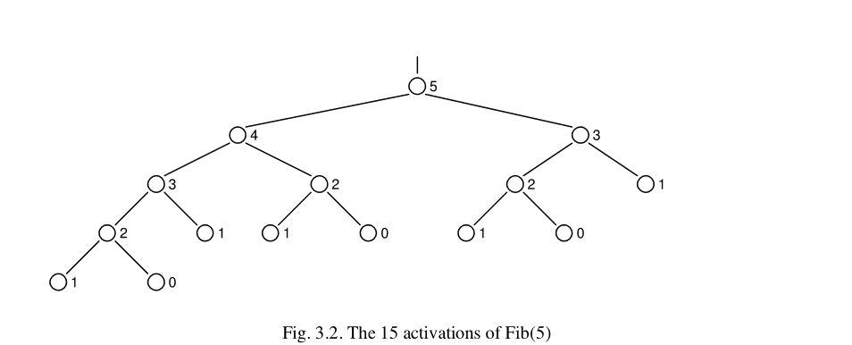
<center>From Algorithms and Data Structures</center>
<center>N. Wirth page 90</center>

---

- Iterative version

```java
int Fib (int n) { /* iterative */
/* pre: n >= 0
post: Fib(n) is the nth Fibonacci number */
    int i, x, y, z;
    i= 1; x= 1; y= 0;
    while (i != n) {
        z = x; i = i + 1; x = x + y; y = z;
    }
    return x;
} /* Fib */
```

## Tracing recursion - example

- Need to take care to know which call is which.

```java
int sum(int arr[], int n) {
    if (n == 0) return 0;
    else {
        int smallResult = sum(arr, n - 1);
        return smallResult + arr[n - 1];
    }
}
```

- Assume the array contains: `{2, 4, 6}`, and that the call to the sum is:
    - `sum(arr, 3);` which will sum the first three elements of the array.

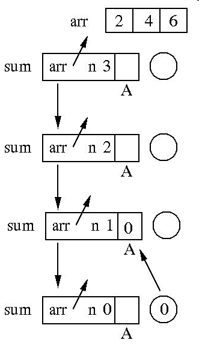
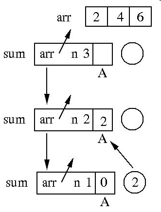
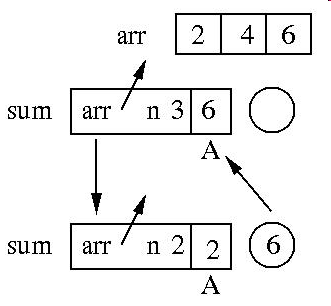
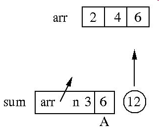

## When is recursion really useful

- Really useful if backtracking is involved.
- Call-stack keeps stack of values to return to.

## reverseTraverse: iterative version

- What if we want to traverse the list in **reverse** order?
    - Needs backtracking.
    - We need to traverse, stacking pointers to nodes, and then return by unstacking them.

```java
public static void reverseTraverseIterative(Node first) {
    Node p = first;
    NodeStack ns = new NodeStack(); // assume such a class available
    while (p != null) {
        ns.push(p);
        p = p.next;
    }
    while (!ns.empty()) {
        System.out.println(ns.pop().data);
    }
}
```

<span style="color: red">Not so simple iteratively.</span>

## Questions

- Which of these operations needs backtracking?
    - Find length of a list
    - Insert in an ordered list
    - Find average value in a list
    - Display above-average values in a list

---

- What's the time complexity of the method below that displays all the elements in a _LinkedList_?

```java
static void displayList(LinkedList<String> list) {
    for (int i = 0; i < list.size(); i++) {
        System.out.println(list.get(i));
    }
}
```

Answer:
- <span style="color: red"><i>get</i></span> has to traverse through the list to find the <span style="color: red"><i>i</i>th</span> element, so that is n, but the loop calls get n times,
- so <span style="color: red">O(n<sup>2</sup>) - a slow process.</span>

## Summary

- Iteration often more *efficient* than recursion (but *Fibonacci* is a very extreme case).
- Sometimes there is a choice of iterative versus recursive.
- Recursive typically closer to definition of data structure.
- Recursion is very useful when backtracking involved.
- Backtracking used in optimal-fitting algorithms - beyond scope of this module.

---

- After studying the material of this week and attempting the exercises, you should be able to:
    - understand the concept of recursion
    - apply a recursive approach to defining an algorithm
    - know when not to use recursion
    - know how to trace a recursion
- We will use recursion a great deal with trees.

# Call stack

## Content

- The call stack
- Recursion and the call stack
- Exceptions and the call stack
- Finally blocks and the try with resources construct

## What information MUST be maintained when a method is called?

```java {3,4}
public static void main(String[] args) {
    double answer = getSum(2,3);
// Need to remember which line to return to in the calling method.
// This information is no longer needed when the called method returns.
    System.out.println(answer);
}
```
```java {3,4}
public static double getSum(double x, double y) {
    double sum = x+y;
// Need to keep track of the values of local variables and formal parameters.
// This information is no longer needed when the called method returns.
    return sum;
}
```

---

```java
public static void main(String[] args) {
    double answer = getAverage(2,3);
    System.out.println(answer);
}
public static double getAverage(double x, double y){
    double average = getSum(x,y)/2;
    return average;
}
public static double getSum(double x, double y) {
    double sum = x+y;
    return sum;
}
```

1. `getAverage` is called. Need to keep track of its local variables, etc.
2. `getSum` is called. Need to keep track of its local variables etc.
3. `getSum` returns. No longer need information stored in step 2.
4. `getAverage` returns. No longer need information stored in step 1.

<span style="background-color: rgb(66, 157, 218)">The data most recently added is first to be removed.<br>What would be a suitable data structure?</span>

## The call stack (Schematic)

```java
public static void main(String[] args) {
    double answer = getAverage(2,3);
    System.out.println(answer);
}
public static double getAverage(double x, double y){
    double average = getSum(x,y)/2;
    return average;
}
public static double getSum(double x, double y) {
    double sum = x+y;
    return sum;
}
```

<table>
    <tr>
        <td>getSum<br>x=2<br>y=3</td>
        <td><span style="background-color: rgb(66, 157, 218)">A value for <span style="color: red"><i>sum</i></span> is calculated. This then becomes the return value for the method.</span></td>
    </tr>
    <tr>
        <td>getAverage<br>x=2<br>y=3<br>average=2.5</td>
        <td><span style="background-color: rgb(66, 157, 218)">Stack frame for <span style="color: red"><i>getSum</i></span> is “popped”. Return value used to calculate a value for variable <span style="color: red"><i>average</i></span>. This is then returned.</span></td>
    </tr>
    <tr>
        <td>main<br>args=[]<br>answer = 2.5</td>
        <td><span style="background-color: rgb(66, 157, 218)">Control returned to <span style="color: red"><i>main</i></span> method</span></td>
    </tr>
</table>

<span style="background-color: rgb(66, 157, 218)">Information about each running method is kept in <span style="color: red">a <i>stack frame</i></span>, which is pushed onto the stack when the method is called, and popped when it returns.</span>

## Visualising the call stack

A useful tool:  
https://cscircles.cemc.uwaterloo.ca/java_visualize/  
allows you to visualize the call stack as you run a program

<iframe
  id="java_visualize"
  title="Java Visualizer"
  width="100%"
  height="550"
  src="https://cscircles.cemc.uwaterloo.ca/java_visualize/"
  style="max-width: 200%; width: 125%; height: 687.5px; transform: scale(0.8); transform-origin: 0 0;">
</iframe>

## Understanding Recursion

- There are two ways to convince yourself that a recursive method works:
    1. Reason about it <span style="color: red"><i>inductively</i></span>. This is probably the best thing to do first.
    2. Think about what happens to the call stack as it runs. Try this if option 1 is not working for you.

## Inductive reasoning

- Let us use induction to convince ourselves that the method below works. We need to do two things:
    - Convince ourselves that it works for the <span style="color: red"><i>base case</i></span>.
    - Convince ourselves that it works for the <span style="color: red"><i>recursive case</i></span>, if we *assume* that any recursive calls do what they are supposed to do.

```java
/**Reverse the order of the elements in an ArrayList of Strings**/
public static void reverse(ArrayList<String> a) {
    if (a.size() > 1) {
        String s = a.remove(0);
        reverse(a);
        a.add(s);
    }
}
```

### Inductive reasoning：Base case

- If `a.size() <= 1` then the reverse method is not called recursively, and the ArrayList a is unchanged. This is exactly what should happen.

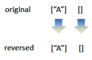

### Inductive reasoning: recursive case

a→\[“A”, “B”, “C”, “D”\]

```java {5}
/**
* Reverse the order of the elements in an ArrayList of Strings
*/
public static void reverse(ArrayList<String> a) {
    if (a.size() > 1) {
        String s = a.remove(0);
        reverse(a);
        a.add(s);
    }
}
```

---

s→“A”  
a→\[“B”, “C”, “D”\]

```java {6}
/**
* Reverse the order of the elements in an ArrayList of Strings
*/
public static void reverse(ArrayList<String> a) {
    if (a.size() > 1) {
        String s = a.remove(0);
        reverse(a);
        a.add(s);
    }
}
```

---

s→“A”  
a→\[“D”, “C”, “B”\]

```java {7}
/**
* Reverse the order of the elements in an ArrayList of Strings
*/
public static void reverse(ArrayList<String> a) {
    if (a.size() > 1) {
        String s = a.remove(0);
        reverse(a);
        a.add(s);
    }
}
```

## Inductive reasoning

- We have proved that:
    - Our method works when `a.size() == 1` or `a.size() == 0`.
    - For any n, if the method works for `a.size() == n-1`, then it also works for `a.size() == n`.
    - So we can see that…
    - The method works for `a.size() == 2` (because of A and B).
    - The method works for `a.size() == 3` (because of B and C).
    - The method works for `a.size() == 4` (because of B and D)
    - The method works for `a.size() == 5` (because of B and E)
    - And so on...
- However if that’s hard to understand, we can also think about what happens on the call stack…

## Recursion and the call stack

```java {2}
public static void reverse(ArrayList<String> a) {
    if (a.size() > 1) {
        String s = a.remove(0);
        reverse(a);
        a.add(s);
    }
}
```

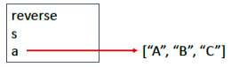

---

```java {3}
public static void reverse(ArrayList<String> a) {
    if (a.size() > 1) {
        String s = a.remove(0);
        reverse(a);
        a.add(s);
    }
}
```

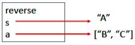

---

```java {4}
public static void reverse(ArrayList<String> a) {
    if (a.size() > 1) {
        String s = a.remove(0);
        reverse(a);
        a.add(s);
    }
}
```

<span style="background-color: rgb(66, 157, 218)">Each stack frame has its own <i>separate</i> copy of the variables a and s</span>

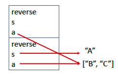

---

```java {3}
public static void reverse(ArrayList<String> a) {
    if (a.size() > 1) {
        String s = a.remove(0);
        reverse(a);
        a.add(s);
    }
}
```

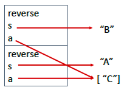

---

```java {4}
public static void reverse(ArrayList<String> a) {
    if (a.size() > 1) {
        String s = a.remove(0);
        reverse(a);
        a.add(s);
    }
}
```

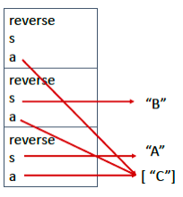

---

```java {2}
public static void reverse(ArrayList<String> a) {
    if (a.size() > 1) {
        String s = a.remove(0);
        reverse(a);
        a.add(s);
    }
}
```


<span style="background-color: rgb(66, 157, 218)">Base case. Topmost invocation of the method returns.</span>

---

```java {4}
public static void reverse(ArrayList<String> a) {
    if (a.size() > 1) {
        String s = a.remove(0);
        reverse(a);
        a.add(s);
    }
}
```


---

```java {5}
public static void reverse(ArrayList<String> a) {
    if (a.size() > 1) {
        String s = a.remove(0);
        reverse(a);
        a.add(s);
    }
}
```

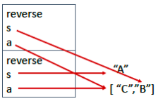

---

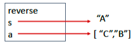

---

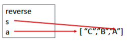

## CHECKED EXCEPTIONS (RECAP)

```java {2}
public static void writeArray(ArrayList<Integer> nums) {
    PrintWriter out = new PrintWriter(new FileWriter("OutFile.txt"));
    for (int num : nums) {
        out.println(num);
    }
    out.close();
}
```

- This code will not compile because the `FileWriter` constructor can throw an `IOException`, which is <span style="color: red"><i>checked</i></span>.
- We must either `catch` this exception, or explicitly declare that the method `throws` it.

### Solution 1: Catch the exception

```java {8}
public static void writeArray(ArrayList<Integer> nums) {
    try {
        PrintWriter out = new PrintWriter(new FileWriter("OutFile.txt"));
        for (int num : nums) {
            out.println(num);
        }
        out.close();
    } catch (IOException ex) {
        System.out.println("Error opening file");
    }
}
```

### Solution 2: add a “throws” clause

```java {1}
public static void writeArray(ArrayList<Integer> nums) throws IOException {
    PrintWriter out = new PrintWriter(new FileWriter("OutFile.txt"));
    for (int num : nums) {
        out.println(num);
    }
    out.close();
}
```

- The compiler will be happy with this, because we have acknowledged that the exception can be thrown. If there is an exception handler further down the call stack then it can be caught.
- <span style="color: red">Question: Which solution is better?</span>

### Solution 1: Catch the exception

```java {8}
public static void writeArray(ArrayList<Integer> nums) {
    try {
        PrintWriter out = new PrintWriter(new FileWriter("OutFile.txt"));
        for (int num : nums) {
            out.println(num);
        }
        out.close();
    } catch (IOException ex) {
        System.out.println("Error opening file");
    }
}
```

- This solution assumes that the method is being called in a context in which we can write a message to standard output and be confident that someone will see it.
- We can’t guarantee that this is true, so it is probably better to throw the exception and allow it to be caught by a handler that can deal with it more sensibly.

### Better solution: Throw early, catch late

- In general, a method should not catch an exception unless you can <span style="color: red">guarantee</span> that it will be able to handle the exception sensibly.
- If you cannot do this, then it is better to allow the exception to be thrown.
- But what actually happens when you throw it?

## Exceptions

- When an exception is thrown the call stack is “unwound”. That is to say entries are popped from the stack until a suitable catch block is found. The code in the catch block is then executed.
- The catch block might be in the same method as the one that generated the exception, in which case no unwinding is necessary
- If no suitable catch block is found then the program terminates with some sort of error message.

<span style="color: red">Method E throws an exception that can be handled by Method B’s catch block</span>

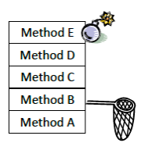

<span style="color: red">Method B has a suitable catch block.</span>

---

<span style="color: red">Stack unwinds until we find the catch block</span>

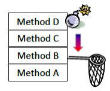

<span style="color: red">Method B has a suitable catch block.</span>

---

<span style="color: red">Stack unwinds until we find the catch block</span>

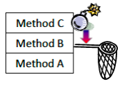

<span style="color: red">Method B has a suitable catch block.</span>

---

<span style="color: red">Stack unwinds until we find the catch block</span>  
<span style="color: red">Exception is “caught”. Code in catch block is executed.</span>

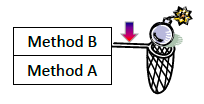

<span style="color: red">Method B has a suitable catch block.</span>

---

- Programming tip:
    - <span style="color: blue">If your code does this, ask yourself if you could have achieved the same effect with an 'if' statement.</span>


## Finally blocks

- The code below is intended to read a set of text files and write out the first line of each to an output file.
- However if a problem if an exception is thrown while reading one of the input files, the output file will not be closed. We could fix this using a 'finally' block.

```java
public static void firstLines(ArrayList<String> fileNames, String outFileName) throws FileNotFoundException {
    PrintStream outStream = new PrintStream(outFileName);
    for (String file : fileNames) {
        FileInputStream inStream = new FileInputStream(file);
        Scanner scan = new Scanner(inStream);
        String line = scan.nextLine();
        outStream.println(line);
    }
    outStream.close();
}
```

---

```java {3,10}
public static void firstLines(ArrayList<String> fileNames, String outFileName) throws FileNotFoundException {
    PrintStream outStream = new PrintStream(outFileName);
    try {
        for (String file : fileNames) {
            FileInputStream inStream = new FileInputStream(file);
            Scanner scan = new Scanner(inStream);
            String line = scan.nextLine();
            outStream.println(line);
        }
    } finally {
        outStream.close();
    }
}
```

---

- If an exception occurs during the try block, the finally block is executed, then the call stack is unwound until a handler for the exception is found.
- Note that the role of the finally block is <span style="color: red"><i>not</i></span> to handle the exception.
- If the try block completes normally then the finally block is still executed.

## Try with resources

- It is common for finally blocks to close resources that have been opened immediately before the try block. If the resource(s) in question implement the interface `java.lang.Autocloseable` then <span style="color: red">the try … finally structure can be replaced by a "try with resources" construct</span>, as illustrated below.

```java {2}
public static void firstLines(ArrayList<String> fileNames, String outFileName) throws FileNotFoundException {
    try (PrintStream outStream = new PrintStream(outFileName)) {
        for (String file : fileNames) {
            FileInputStream inStream = new FileInputStream(file);
            Scanner scan = new Scanner(inStream);
            String line = scan.nextLine();
            outStream.println(line);
        }
    }
}
```

## Summary

- When a method is invoked, a _stack frame_ is pushed onto the _call stack_. When the method returns the frame is popped.
- Each recursive call to a method pushes a separate frame onto the call stack. So you end up with multiple frames, representing multiple invocations of the method.
- When an exception is thrown, the call stack is _unwound_ until a method with a suitable try block is found.
- If a try block is associated with a finally block, the code in this block is always executed. If an exception occurs, the finally block is executed and then the call stack is unwound until a catch block is found.
- A "try with resources" construct can be used as an alternative to a finally block in cases where resources need to be closed.
