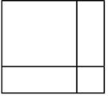

# Recursion

## Agenda

The object of this practical is for you to practice the technique of recursion.

## Exercise 1 - Calculating Exponents using Recursion

Raising a number to a power, an exponent, such as $y$ to the power 2 ($y$ squared), is written with circumflex (`^`) in some notations and as `**` in others. So $y$ squared, $y^2$, is written `y^2` or `y ** 2`. When we write $y^n$ we mean $y$ to the power $n$.

Using the facts that $y^0 = 1$ and $y^n = y \times y^{n-1}$, for $n > 0$, write a recursive method (that does not use the `^` operator)

```java
public static double power(double y, int n) {
// pre: n >= 0
// post: the value returned is y^n
}
```

What is the base case of a recursive method? What is the recursive case?

Specifically, what are the base case(s) and recursive case(s) of the code from part (a)?

## Exercise 2 - Getting some practice code set up

Download the supplied code files from the student website and get them up and running as a project as usual. The main file is `RecursionPractice.java`.

Add the code of the method from Exercise 1, and try it out on various values by inserting into the main method lines such as:

```java
System.out.println("2 to the power 5 is " + power(2,5));
```

> [!SUCCESS] Reference Answer
> ```java
> public static int power(int y, int n) {
> 	// pre: n >= 0
> 	// post: the value returned is y^n
> 	if (n == 0) {
> 		return 1;
> 	} else {
> 		return y * power(y, n - 1);
> 	}
> }
> ```

## Exercise 3 - Chessboard squares

Write a **recursive** method, which does not use multiplication , which given a positive integer $n$, calculates how many $1 \times 1$ squares there are on a $n \times n$ chessboard :

```java
public static int chessBoardSquares(int n) {
// pre: n >= 1
// post: the result is the number of squares on an n × n chessboard
}
```

For example, `chessBoardSquares(5)` should return the value 25. Test your method by adding code like the following to your main method:

```java
for (int i = 1; i <= 8; i++) {
    System.out.println("chessBoardSquares(i) for i = " + i + " is " + chessBoardSquares(i));
}
```

> Hints:
> 1. Use recursion on $n$, and have your base case be $n = 1$.
> 
> 2. For the recursive case, draw a $n \times n$ chessboard, and then identify where inside that you can see a $(n − 1) \times (n − 1)$ chessboard.
> 
> 3. See also extra 'hint' here:  
> 

> [!SUCCESS] Reference Answer
> Use the fact that an $n \times n$ board has:
>
> - all the $1 \times 1$ squares in the first $(n-1) \times (n-1)$ board, plus
> - one new row of $n$ squares, and
> - one new column of $n$ squares,
> 
> but the corner square gets counted twice, so you add $2n-1$.
> 
> That gives the recursive rule:
> 
> $$f(1)=1,\qquad f(n)=f(n-1)+(2n-1)$$
> 
> Since multiplication is not allowed, this works well.
> 
> ```java
> public static int chessBoardSquares(int n) {
>     // pre: n >= 1
>     // post: the result is the number of 1x1 squares on an n × n chessboard
>     if (n == 1) {
>         return 1;
>     }
>     return chessBoardSquares(n - 1) + (2 * n - 1);
> }
> ```

## Exercise 4 - Array Matching

Write a **recursive** method that returns `true` precisely when the first $n$ integers of two given arrays of integers are the same.

```java
public static boolean arrayMatch(int n, int[] a, int[] b) {
// pre: 0 <= n <= a.length and 0 <= n <= b.length
// post: true is returned precisely when the values
//   a[0] ... a[n-1] are exactly the same as
//   the values b[0] ... b[n-1]
}
```

Test your method with some code such as this in the main method:

```java
int[] a = {1, 2, 3, 4, 5, 6};
int[] b = {1, 2, 4, 8, 16};
for (int i = 1; i <= 5; i++)
    System.out.println("arrayMatch(i, a, b) for i = " + i + " is " + arrayMatch(i,a,b));
```


> Hints:
> 
> 1. Use recursion on $n$, and have your base case be $n = 0$
> 
> 2. For the recursive case, draw a diagram of the two arrays indicating where the first $n$ elements are. Draw also a diagram of the two arrays indicating where the first $n-1$ elements are. Ask yourself: how can the result from comparing the first $n-1$ items be used to compare the first $n$ items? Look at the difference between the diagrams.

> [!SUCCESS] Reference Answer
> ```java
> public static boolean arrayMatch(int n, int[] a, int[] b) {
> 	// pre: 0 <= n <= a.length and 0 <= n <= b.length
> 	// post: true is returned precisely when the values
> 	//   a[0] ... a[n-1] are exactly the same as
> 	//   the values b[0] ... b[n-1]
> 	if (n == 0) {
> 		return true;
> 	}
> 	if (a[n - 1] != b[n - 1]) {
> 		return false;
> 	}
> 	return arrayMatch(n - 1, a, b);
> }
> ```
> 
> Another answer
> 
> ```java
> public static boolean arrayMatch2(int n, int[] a, int[] b) {
> 	if (n == 0) {
> 		return true;
> 	}
> 	return a[n - 1] == b[n - 1] && arrayMatch2(n - 1, a, b);
> }
> ```

## Exercise 5 - Triangle numbers

Write a **recursive** method, which, given an integer $n$, calculates the sum of the integers from $1$ to $n$:
```java
public static int triangle(int n) {
// pre: n >= 1
// post: the result is the sum 1 + 2 + ... + n
}
```

**Hint**: use recursion on $n$, and have your base case be $n = 1$.

Test your method by some code such as the following in your main method:

```java
for (int i = 1; i <= 10; i++)
    System.out.println("Triangle number " + i + " is " + triangle(i));
```

> [!SUCCESS] Reference Answer
> ```java
> public static int triangleNumber(int i) {
> 	// pre: n >= 1
> 	// post: the result is the sum 1 + 2 + ... + n
> 	if (i == 1) {
> 		return 1;
> 	}
> 	return triangleNumber(i - 1) + i;
> }
> ```

## Exercise 6 - Array printing

Write a **recursive** method, to print out (using a `System.out.println` statement) all the contents of an array from positions $0$ to $n-1$:

```java
public static void printFirstN(String[] a, int n) {
// pre: 0 <= n <= a.length
// post: the values a[0] ... a[n-1] are printed on the screen
}
```

Test your method with some code such as the following in the main method:

```java
String[] a = {"Red", "Yellow", "Pink", "Green", "Orange"};
printFirstN(a, a.length);
```

> [!SUCCESS] Reference Answer
> ```java
> public static void printFirstN(String[] a, int n) {
> 	// pre: 0 <= n <= a.length
> 	// post: the values a[0] ... a[n-1] are printed on the screen
> 	if (n == 0) {
> 		return;
> 	}
> 	printFirstN(a, n - 1);
> 	System.out.println(a[n - 1]);
> }
> ```
> 
> Another answer
> 
> ```java
> public static void printFirstN2(String[] a, int n) {
> 	if (n != 0) {
> 		System.out.println(a[n - 1]);
> 		printFirstN2(a, n - 1);
> 	}
> }
> ```

# Exploring the Call Stack

### Java Visualizer
<br>
<iframe
  id="java_visualize"
  title="Java Visualizer"
  width="100%"
  height="550"
  src="https://cscircles.cemc.uwaterloo.ca/java_visualize/"
  style="max-width: 200%; width: 125%; height: 687.5px; transform: scale(0.8); transform-origin: 0 0;">
</iframe>

## Exercise 1

Go to the [*java visualizer*](#java-visualizer) tool at https://cscircles.cemc.uwaterloo.ca/java_visualize/ then run the example from the lecture slides and observe what happens on the call stack. The code for the relevant methods is:

```java
public static void main(String[] args) {
    double answer = getAverage(2,3);
    System.out.println(answer);
}

public static double getAverage(double x, double y){
    double average = getSum(x,y)/2;
    return average;
}

public static double getSum(double x, double y) {
    double sum = x+y;
    return sum;
}
```

## Exercise 2

Use the [visualizer tool](#java-visualizer) to run the 'reverse' example from the lecture slides. The code for the reverse method is:

```java
public static void reverse(ArrayList<String> a) {
    if (a.size() > 1) {
        String s = a.remove(0);
        reverse(a);
        a.add(s);
    }
}
```

You will need to create a `main` method that creates an `ArrayList`, adds some values to it, and then calls the `reverse` method. You will also need to import `java.util.ArrayList`.

```java
import java.util.ArrayList;

public class ReverseArrayListDemo {
    // 递归反转ArrayList<String>的核心方法
    public static void reverse(ArrayList<String> a) {
        if (a.size() > 1) {
            // 移除并获取第一个元素
            String s = a.remove(0);
            // 递归反转剩余元素
            reverse(a);
            // 将移除的元素添加到列表末尾
            a.add(s);
        }
    }
    
    // 主方法：测试反转逻辑
    public static void main(String[] args) {
        // 1. 创建并初始化ArrayList
        ArrayList<String> list = new ArrayList<>();
        list.add("A");
        list.add("B");
        list.add("C");
        list.add("D");
        
        // 2. 输出反转前的列表
        System.out.println("反转前: " + list);
        
        // 3. 调用递归反转方法
        reverse(list);
        
        // 4. 输出反转后的列表
        System.out.println("反转后: " + list);
    }
}
```

## Exercise 3

Make a Java project from the source file `Anagram.java` and run it with some short strings as parameter. Using the [visualizer](#java-visualizer) or otherwise try to understand how the recursion is working.

```java
// src/anagrams/Anagrams.java
package anagrams;
import java.util.*;
public class Anagrams {
    private static void recursivePermute(char[] sa, int start) {
        int len = sa.length;
        if (start == len) System.out.println(sa);
        else {
            for (int i = start; i < len; i++) {
                char temp = sa[start];
                sa[start] = sa[i];
                sa[i] = temp;
                recursivePermute(sa, start + 1);
                sa[i] = sa[start];
                sa[start] = temp;
            } // for
        } // if
    } // recursivePermute
    
    private static void permuteString(String s) {
        char[] sa = new char[s.length()];
        for (int i = 0; i < s.length(); i++) sa[i] = s.charAt(i);    
        recursivePermute(sa, 0);
    }
    
    public static void main(String[] args) {
        System.out.print("String to permute? ");
        Scanner keyboard = new Scanner(System.in);
        String initial = keyboard.next();
        permuteString(initial);
    }
}
```

## Exercise 4

Make a Java project from the source file `EightQuuens.java` and run it. Using the [visualizer](#java-visualizer) or otherwise try to understand how the recursion is working.

```java
// src/eightQueens/EightQueens.java
package eightQueens;
/**
 * from Algorithms and Data Structures page 97
 * © N. Wirth 1985 (Oberon version: August 2004)
 * Translated into Java and corrected
 */
public class EightQueens {
    static int[] x = new int[8];
    static boolean[] a = new boolean[8];
    static boolean[] b = new boolean[15];
    static boolean[] c = new boolean[15];
    // x[i] is position of queen in i th column
    // a[j] means "no queen lies on j th row"
    // b[k] means "no queen occupies k th /-diagonal"
    // c[k] means "no queen occupies k th \-diagonal"
    // in /-diagonal k is i+j
    // in \-diagonal k is i-j+7
    
    public static void writeIt() {
        for (int k = 0; k <= 7; k++) {
            System.out.print(" " + x[k]);
        }
        System.out.println();
    } // end writeIt
    
    public static void tryIt(int i) {
        for (int j = 0; j <= 7; j++) { // corrected from Oberon version
            if (a[j] && b[i + j] && c[i - j + 7]) {
                x[i] = j;
                a[j] = false; b[i + j] = false; c[i - j + 7] = false;
                if (i < 7) 
                    tryIt(i + 1);
                 else 
                    writeIt();
                a[j] = true; b[i + j] = true; c[i - j + 7] = true;
            }
        }
    } // end tryIt
    
    public static void main(String[] args) {
        for (int i = 0; i <= 7; i++) a[i] = true;
        for (int i = 0; i <= 14; i++) {
            b[i] = true; c[i] = true;
        }
        tryIt(0);
    }
}
```

## Exercise 5

Make a Java project from the source file `Ackermann.java` and run it. Using the [visualizer](#java-visualizer) or otherwise try to understand how the recursion is working.

```java
// src/ackermann/Ackermann.java
package ackermann;
public class Ackermann {
    public static int A (int m, int n){
    System.out.println("Calling A, m = " + m + " n = " + n);
    int result = 0;
    if (m == 0) result = n + 1;
    else if (m > 0 && n == 0) result = A(m-1, 1);
    else if (m > 0 && n > 0) result = A(m-1, A(m, n-1));
    System.out.println("Returning " + result);
    return result;
}

    public static void main(String[] args) {
        System.out.println(A(4, 2));
    }   
}
```

> [!CAUTION] CAUTION
> Highly explosive! Use very small values for $m$ and $n$ only.

# Bonus: Hanoi

```java
public class Hanoi {
    public static void hanoi(int n, String from, String to, String via) {
        if (n == 1) {
            System.out.println("Move disk from " + from + " to " + to);
        } else {
            hanoi(n - 1, from, via, to);
            System.out.println("Move disk from " + from + " to " + to);
            hanoi(n - 1, via, to, from);
        }
    }
    
    public static void main(String[] args) {
        int n = 3; // number of disks
        hanoi(n, "A", "C", "B");
    }
}
```
