# Tree 树

## Content 内容

- Binary Trees<br>二叉树
- Recursive techniques with trees<br>树上的递归技术
- Traversals<br>遍历

## What is a Tree (Graph Theory)? 什么是树（图论）

- In graph theory, a tree is an undirected graph that contains no cycles (i.e. no paths that take you back to the node on which you started).  
在图论中，树是一种不包含环的无向图（即不存在一条路径能让你回到起始节点）。

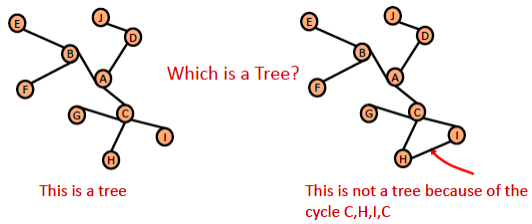

## What is a Tree (Computer Science)? 什么是树（计算机科学）

- In computer science we generally think of trees as being <span style="color: red"><i>rooted trees</i></span>.<br>在计算机科学中，我们通常讨论的是<span style="color: red"><i>有根树</i></span>。
    - One node is designated as the <span style="color: red">root</span>.<br>其中一个节点被指定为<span style="color: red">根节点</span>。
    - The nodes adjacent to it are the roots of its <span style="color: red"><i>subtrees</i></span><br>与其相邻的节点分别是其<span style="color: red"><i>子树</i></span>的根。

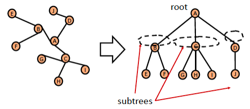

## Example 示例


### Example: XML/HTML documents 示例：XML/HTML 文档

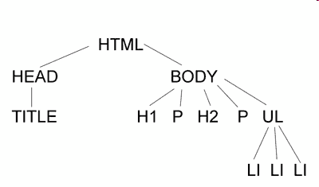

## Binary trees 二叉树

- Binary trees have <span style="color: red"><i>two</i> sub-trees</span>:<br>二叉树有<span style="color: red"><i>两个</i>子树</span>：


|  | 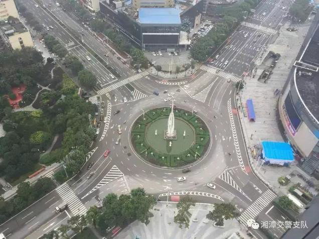 |  |  |
| ------------------------------------ | ------------------------------------ | ------------------------------------ | ------------------------------------ |

<span style="color: red">Which is Binary tree?<br>哪个是二叉树？</span>

## Basic Terminology for Binary Trees 二叉树基础术语

> Terminology 术语

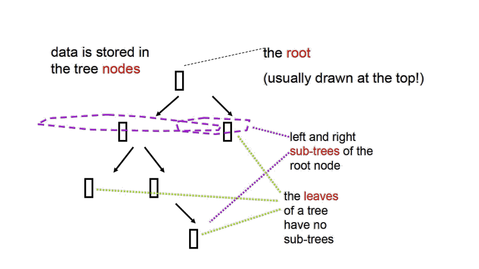

---

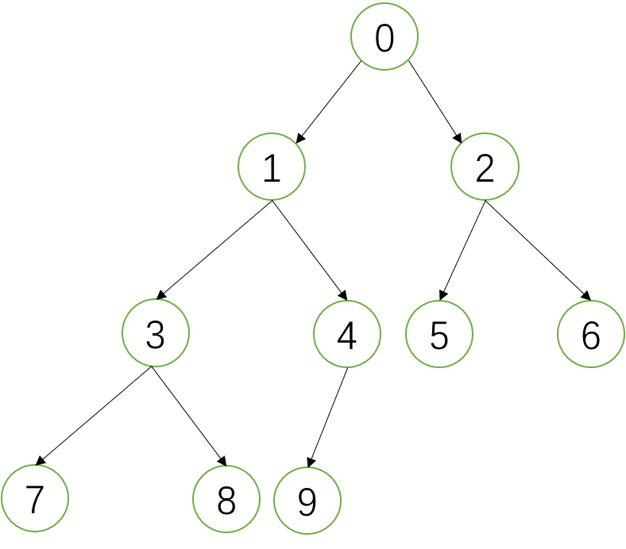

<span style="color: red">Root: 根节点<br><br>Left-subtree: 左子树<br><br>Right-subtree: 右子树<br><br>leaves: 叶子节点</span>

## How do we represent binary trees? 如何表示二叉树？

- A (binary) tree is<br>（二叉）树可以定义为：
    - either empty, <br>要么是空树，
    - or consists of a node, containing some data, along with references to two sub-trees, known as the _left_ and _right_ sub <span style="color: red">trees</span>. <br>要么由一个包含数据的节点组成，并带有指向两棵子树的引用，分别称为 _left_ 和 _right_ 子<span style="color: red">树</span>。

⬆️  
<span style="background-color: rgb(66, 157, 218)">Note the <span style="color: red"><i>recursive</i></span> definition.<br>注意这个<span style="color: red"><i>递归</i></span>定义。</span>

## Represent Binary Trees of Integers 用整数表示二叉树

```java {12,13}
public class BinaryTree {
    public Member data;
    public BinaryTree left; //null if there is no left subtree
    public BinaryTree right; //null if there is no right subtree
    public BinaryTree(Member val) {
        data = val;
        left = null;
        right = null;
    }
}
BinaryTree t;
// A tree can be represented by a reference to its root.
// This reference is null if the tree is empty.
```

## Recursive Tree Algorithms 递归树算法

Since trees are defined recursively, it is often simplest to process them using recursive algorithms. Here is an example:  
由于树本身是递归定义的，通常使用递归算法处理它最简单。示例如下：

```java
/** Count the number of nodes in a binary tree **/
public static int count(BinaryTree t) {
    if (t == null) {
        return 0;
    } else {
        return 1 + count(t.left) + count(t.right);
    }
}
```

## Traversals 遍历

> Traverse 遍历

- A <span style="color: red"><i>traversal</i></span> is a systematic way of going through all the data in a data structure.<br><span style="color: red"><i>遍历</i></span>是系统化地访问数据结构中全部数据的一种方式。
- So, for example, for a list of type `ArrayList<String>`, this is a traversal:<br>例如，对于 `ArrayList<String>` 类型的列表，下面就是一次遍历：

```java
for (String s : list) {
    // makes s successively each value in list
    ............
}
```

---

- For trees there are several traversals, including:<br>对树而言，常见遍历方式包括：
    - <span style="color: orchid">pre-order</span> traversal<br><span style="color: orchid">先序</span>遍历
    - <span style="color: midnightblue">in-order</span> traversal<br><span style="color: midnightblue">中序</span>遍历
    - <span style="color: royalblue">post-order</span> traversal<br><span style="color: royalblue">后序</span>遍历

### Pre-order traversal 先序遍历

- The pre-order traversal algorithm is recursive:<br><span style="color: royalblue">If tree is not empty:</span><br>先序遍历算法是递归的：<br><span style="color: royalblue">若树非空：</span>
    - <span style="color: royalblue">visit root</span><br><span style="color: royalblue">先访问根节点</span>
    - <span style="color: royalblue">then traverse the left subtree</span><br><span style="color: royalblue">再遍历左子树</span>
    - <span style="color: royalblue">then traverse the right subtree</span><br><span style="color: royalblue">最后遍历右子树</span>

> <span style="color: red">traversals are done recursively, in <i>pre-order</i> fashion<br>遍历以递归方式按<i>先序</i>执行</span>

<span style="background-color: rgb(66, 157, 218)">It is called a pre-order traversal because "pre" means "before", and <span style="color: red">the root is visited before the subtrees</span>.<br>之所以称为先序遍历，是因为 “pre” 表示“之前”，即<span style="color: red">根节点在子树之前被访问</span>。</span>

#### Pre-order Example 先序示例

<span style="color: royalblue">If tree is not empty:<br>若树非空：</span>
- <span style="color: royalblue">visit root</span><br><span style="color: royalblue">访问根节点</span>
- <span style="color: royalblue">then traverse the left subtree</span><br><span style="color: royalblue">遍历左子树</span>
- <span style="color: royalblue">then traverse the right subtree</span><br><span style="color: royalblue">遍历右子树</span>

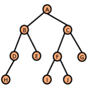

Pre-order traversal of graph:<br>该图的先序遍历：  
<span style="color: red">A,B,D,H,E,C,F,I,J,G</span>

#### An implementation of pre-order traversal 先序遍历实现

```java
public static void preOrderTraversal(BinaryTree t) {
    if (t != null) {
        System.out.println(t.data);
        preOrderTraversal(t.left);
        preOrderTraversal(t.right);
    }
}
```

### In-order traversal 中序遍历

- The in-order traversal algorithm is recursive:<br>中序遍历算法是递归的：
    - <span style="color: royalblue">If tree is not empty:</span><br><span style="color: royalblue">若树非空：</span>
        - <span style="color: royalblue">traverse the left subtree</span><br><span style="color: royalblue">先遍历左子树</span>
        - <span style="color: royalblue">then visit root</span><br><span style="color: royalblue">再访问根节点</span>
        - <span style="color: royalblue">then traverse the right subtree</span><br><span style="color: royalblue">最后遍历右子树</span>

> <span style="color: red">traversals are done recursively, in <i>in-order</i> fashion<br>遍历以递归方式按<i>中序</i>执行</span>

<span style="background-color: rgb(66, 157, 218)">For an in-order traversal, the root is visited <span style="color: red">“in between”</span> the subtrees.<br>中序遍历中，根节点在两棵子树<span style="color: red">“之间”</span>被访问。</span>

#### In-order Example 中序示例

<span style="color: royalblue">If tree is not empty:<br>若树非空：</span>
- <span style="color: royalblue">traverse the left subtree</span><br><span style="color: royalblue">遍历左子树</span>
- <span style="color: royalblue">then visit root</span><br><span style="color: royalblue">访问根节点</span>
- <span style="color: royalblue">then traverse the right subtree</span><br><span style="color: royalblue">遍历右子树</span>

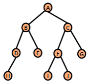

In-order traversal of graph:<br>该图的中序遍历：  
<span style="color: red">H,D,B,E,A,I,F,J,C,G</span>

#### An implementation of in-order traversal 中序遍历实现

```java
public static void inOrderTraversal(BinaryTree t) {
    if (t != null) {
        inOrderTraversal(t.left);
        System.out.println(t.data);
        inOrderTraversal(t.right);
    }
}
```

### Post-order traversal 后序遍历

- The post-order traversal algorithm is recursive:<br>后序遍历算法是递归的：
    - <span style="color: royalblue">If tree is not empty:</span><br><span style="color: royalblue">若树非空：</span>
        - <span style="color: royalblue">traverse the left subtree</span><br><span style="color: royalblue">先遍历左子树</span>
        - <span style="color: royalblue">then traverse the right subtree</span><br><span style="color: royalblue">再遍历右子树</span>
        - <span style="color: royalblue">visit root</span><br><span style="color: royalblue">最后访问根节点</span>

> <span style="color: red">traversals are done recursively, in <i>post-order</i> fashion<br>遍历以递归方式按<i>后序</i>执行</span>

<span style="background-color: rgb(66, 157, 218)">It is called a post-order traversal because <span style="color: red">“post” means “after”,</span> and the root is visited after the subtrees.<br>之所以称为后序遍历，是因为 <span style="color: red">“post” 表示“之后”</span>，根节点在子树之后被访问。</span>

#### Post-order Example 后序示例

<span style="color: royalblue">If tree is not empty:<br>若树非空：</span>
- <span style="color: royalblue">traverse the left subtree</span><br><span style="color: royalblue">遍历左子树</span>
- <span style="color: royalblue">then traverse the right subtree</span><br><span style="color: royalblue">遍历右子树</span>
- <span style="color: royalblue">then visit root</span><br><span style="color: royalblue">访问根节点</span>

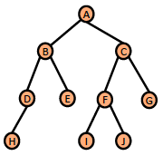

Post-order traversal of graph:<br>该图的后序遍历：  
<span style="color: red">H,D,E,B,I,J,F,G,C,A</span>

#### An implementation of post-order traversal 后序遍历实现

```java
public static void postOrderTraversal(BinaryTree t) {
    if (t != null) {
        postOrderTraversal(t.left);
        postOrderTraversal(t.right);
        System.out.println(t.data);
    }
}
```

## Requirements for this week 本周学习要求

You should achieve by the end of this week’s work:  
完成本周学习后，你应当能够：
- understand binary trees<br>理解二叉树
- able to store data in binary trees<br>能够在二叉树中存储数据
- understand pre-order, post-order and in-order traversals on binary trees<br>理解二叉树的先序、后序和中序遍历
- able to write recursive functions on trees.<br>能够在树结构上编写递归函数。

# Binary search tree 二叉搜索树

## A Binary Search Tree 二叉搜索树示例

- This is an example of Binary Search Tree<br>这是一个二叉搜索树示例。
- What property does it have that makes it a binary tree?<br>它具备什么性质使它成为二叉树？
- What additional property does it have?<br>它还具备什么额外性质？
- Why might that property be useful?<br>这个额外性质为什么有用？

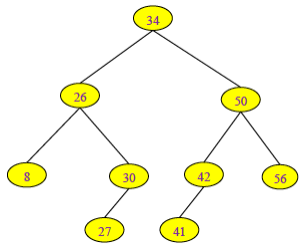

## Binary Search Trees 二叉搜索树

- These are a special kind of <span style="color: red"><i>binary tree</i></span><br>它是<span style="color: red"><i>二叉树</i></span>的一种特殊类型。
    - the data they contain must be <span style="color: red">a <i>comparable</i> type</span> (where you can do `<`, `>`, `==`, .equals comparisons), e.g. int, char, String<br>(.compareTo)<br>其中存储的数据必须是<span style="color: red"><i>可比较</i>类型</span>（可进行 `<`、`>`、`==`、`.equals` 比较），如 int、char、String（可用 `.compareTo`）。
    - The data at the <span style="color: red">root</span> node is <span style="color: red">greater than</span> all the data in the <span style="color: red">left subtree</span><br><span style="color: red">根</span>节点数据<span style="color: red">大于</span>左子树中所有数据
    - The data at the <span style="color: red">root</span> node is <span style="color: red">less than</span> all data in the <span style="color: red">right subtree</span><br><span style="color: red">根</span>节点数据<span style="color: red">小于</span>右子树中所有数据
    - … and so on, all the way down the tree (<span style="color: orange">recursive definition</span>)<br>该性质在整棵树上递归成立（<span style="color: orange">递归定义</span>）

---

- Usually binary search trees represent <span style="color: red">a <i>set</i> of values</span><br>二叉搜索树通常表示一组<span style="color: red"><i>集合</i></span>值。
    - there are <span style="color: red">no <i>duplicate</i> values in the tree</span><br>树中<span style="color: red">没有<i>重复</i>值</span>
    - Of course, any <span style="color: red"><i>binary search tree</i> is also a <i>binary tree</i></span><br>当然，任何<span style="color: red"><i>二叉搜索树</i></span>也都是<i>二叉树</i>

> Invented by P.F. Windley, A.D. Booth, A.J.T. Colin, and T.N. Hibbard in 1960 (Wikipedia)<br>由 P.F. Windley、A.D. Booth、A.J.T. Colin 和 T.N. Hibbard 于 1960 年提出（Wikipedia）。

## Is this a Binary Search Tree? 这是二叉搜索树吗？

| 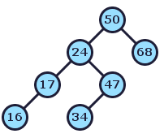 | 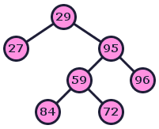 | 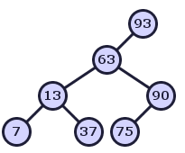 |
| ------------------------------------ | ------------------------------------ | ------------------------------------ |

## Datatype Invariants 数据类型不变式

- A <span style="color: red"><i>datatype invariant</i></span> is a property of an <span style="color: red"><i>abstract data type</i></span> which holds for all objects of that type.<br><span style="color: red"><i>数据类型不变式</i></span>是某个<span style="color: red"><i>抽象数据类型</i></span>中对所有对象都成立的性质。
- The datatype invariant <span style="color: orange">for binary search trees</span> is:<br>二叉搜索树的<span style="color: orange">数据类型不变式</span>是：
    - The data at the root node is <span style="color: orange"><i>greater</i></span> than all the data in the left sub-tree<br>根节点数据<span style="color: orange"><i>大于</i></span>左子树所有数据
    - The data at the root node is <span style="color: orange"><i>less</i></span> than all the data in the right sub-tree<br>根节点数据<span style="color: orange"><i>小于</i></span>右子树所有数据
    - ... and so on, all the way down the tree<br>该性质在整棵树中逐层递归成立
    - <span style="color: orange"><i>no duplicate</i></span> values in the tree - so any implementation of such a tree is also an implementation of the concept of a set with operations union-with-singleton and membership.<br>树中<span style="color: orange"><i>无重复</i></span>值，因此这类树本质上也实现了集合概念（支持单元素并集与成员判断）。

## A Search Tree class (for integers) 搜索树类（整数版本）

```java {5,6}
public class SearchTree {
    public int data; // or whatever
    public SearchTree left;
    public SearchTree right;
    // Reminder:
    // reference-type fields are initialized to null by default.
    public SearchTree(int data) {
        this.data = data;
    }
}
```

## Insertion into a Search Tree 在搜索树中插入

```java
public SearchTree insert( SearchTree tree, int val) {
    if (tree == null) {
        tree = new SearchTree(val);
    } else if (val > tree.data) {
        tree.right = insert(tree.right, val);
    } else if (val < tree.data) {
        tree.left = insert(tree.left, val);
    } // do nothing -- val is already in tree
	return tree;
}
```

<span style="color: red">Does it use recursive method?<br>它是否使用了递归方法？</span>

<span style="color: red">What is the base case?<br>它的递归基线条件是什么？</span>

### Insertion into a Search Tree: Example 搜索树插入示例

```java {2}
public SearchTree insert( SearchTree tree, int val) {
    if (tree == null) {
        tree = new SearchTree(val);
    } else if (val > tree.data) {
        tree.right = insert(tree.right, val);
    } else if (val < tree.data) {
        tree.left = insert(tree.left, val);
    }
	return tree;
}
```

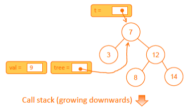

> <span style="background-color: rgb(66, 157, 218)">We have some variable SearchTree t. The initial call is <span style="color: red">t = insert(t,9)</span> where t points to the root of the tree.<br>设有变量 SearchTree `t`，初始调用为 <span style="color: red">t = insert(t,9)</span>，其中 `t` 指向树根。</span>

---

```java {4}
public SearchTree insert( SearchTree tree, int val) {
    if (tree == null) {
        tree = new SearchTree(val);
    } else if (val > tree.data) {
        tree.right = insert(tree.right, val);
    } else if (val < tree.data) {
        tree.left = insert(tree.left, val);
    }
	return tree;
}
```

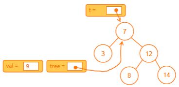

> <span style="background-color: rgb(66, 157, 218)">9 &gt; 7 so insert on right<br>9 &gt; 7，因此向右侧插入。</span>

---

```java {2}
public SearchTree insert( SearchTree tree, int val) {
    if (tree == null) {
        tree = new SearchTree(val);
    } else if (val > tree.data) {
        tree.right = insert(tree.right, val);
    } else if (val < tree.data) {
        tree.left = insert(tree.left, val);
    }
	return tree;
}
```

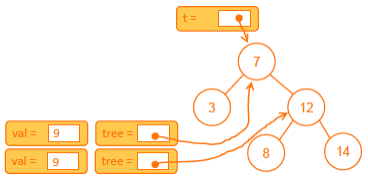

> <span style="background-color: rgb(66, 157, 218)">Start of recursive call<br>开始递归调用。</span>

---

```java {7}
public SearchTree insert( SearchTree tree, int val) {
    if (tree == null) {
        tree = new SearchTree(val);
    } else if (val > tree.data) {
        tree.right = insert(tree.right, val);
    } else if (val < tree.data) {
        tree.left = insert(tree.left, val);
    }
	return tree;
}
```

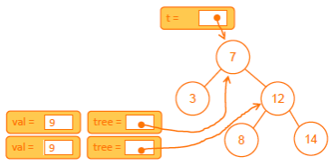

> <span style="background-color: rgb(66, 157, 218)">9 &lt; 12 so insert to left<br>9 &lt; 12，因此向左侧插入。</span>

---

```java {2}
public SearchTree insert( SearchTree tree, int val) {
    if (tree == null) {
        tree = new SearchTree(val);
    } else if (val > tree.data) {
        tree.right = insert(tree.right, val);
    } else if (val < tree.data) {
        tree.left = insert(tree.left, val);
    }
	return tree;
}
```

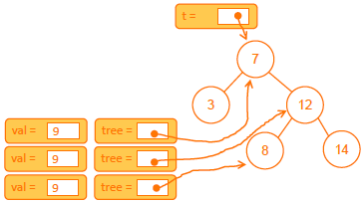

> <span style="background-color: rgb(66, 157, 218)">Start of recursive call<br>开始递归调用。</span>

---

```java {5}
public SearchTree insert( SearchTree tree, int val) {
    if (tree == null) {
        tree = new SearchTree(val);
    } else if (val > tree.data) {
        tree.right = insert(tree.right, val);
    } else if (val < tree.data) {
        tree.left = insert(tree.left, val);
    }
	return tree;
}
```

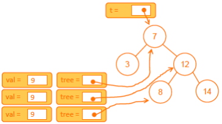

> <span style="background-color: rgb(66, 157, 218)">9 &gt; 8 so insert to right<br>9 &gt; 8，因此向右侧插入。</span>

---

```java {2}
public SearchTree insert( SearchTree tree, int val) {
    if (tree == null) {
        tree = new SearchTree(val);
    } else if (val > tree.data) {
        tree.right = insert(tree.right, val);
    } else if (val < tree.data) {
        tree.left = insert(tree.left, val);
    }
	return tree;
}
```

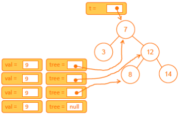

> <span style="background-color: rgb(66, 157, 218)">Start of recursive call<br>开始递归调用。</span>

---

```java {3}
public SearchTree insert( SearchTree tree, int val) {
    if (tree == null) {
        tree = new SearchTree(val);
    } else if (val > tree.data) {
        tree.right = insert(tree.right, val);
    } else if (val < tree.data) {
        tree.left = insert(tree.left, val);
    }
	return tree;
}
```

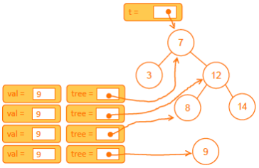

> <span style="background-color: rgb(66, 157, 218)">Create a new tree and return it<br>创建新节点（新树）并返回。</span>

---

```java {5}
public SearchTree insert( SearchTree tree, int val) {
    if (tree == null) {
        tree = new SearchTree(val);
    } else if (val > tree.data) {
        tree.right = insert(tree.right, val);
    } else if (val < tree.data) {
        tree.left = insert(tree.left, val);
    }
	return tree;
}
```

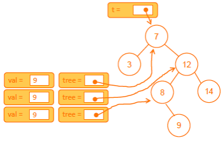

> <span style="background-color: rgb(66, 157, 218)">Return to third invocation of insert() and update right subtree<br>返回到第三层 `insert()` 调用，并更新右子树。</span>

---

```java {7}
public SearchTree insert( SearchTree tree, int val) {
    if (tree == null) {
        tree = new SearchTree(val);
    } else if (val > tree.data) {
        tree.right = insert(tree.right, val);
    } else if (val < tree.data) {
        tree.left = insert(tree.left, val);
    }
	return tree;
}
```

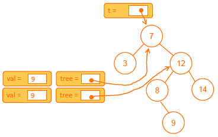

> <span style="background-color: rgb(66, 157, 218)">Return to second invocation of insert(). <br>The assignment statement does not change location of left subtree<br>返回到第二层 `insert()` 调用。<br>赋值语句不会改变左子树的位置。</span>

---

```java {7}
public SearchTree insert( SearchTree tree, int val) {
    if (tree == null) {
        tree = new SearchTree(val);
    } else if (val > tree.data) {
        tree.right = insert(tree.right, val);
    } else if (val < tree.data) {
        tree.left = insert(tree.left, val);
    }
	return tree;
}
```

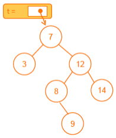

> <span style="background-color: rgb(66, 157, 218)">Return to original statement t=insert(t,9)<br>The location of tree has not changed, but it has an extra node.<br>返回最初语句 `t=insert(t,9)`。<br>树的根位置未改变，但树中新增了一个节点。</span>

## Searching a Search Tree 在搜索树中查找

```java
public static boolean contains(SearchTree tree, int val) {
    if (tree == null) {
        return false;
    } else if (val > tree.data) {
        return contains(tree.right, val);
    } else if (val < tree.data) {
        return contains(tree.left, val);
    } else { // tree.data==val
        return true;
    }
}
```

<span style="color: red">Does it use recursive method?<br>它是否使用了递归方法？</span>

<span style="color: red">What is the base case?<br>它的递归基线条件是什么？</span>

## Exercise 练习

- Sketch out the tree that would be produced by inserting the values 4, 5, 10, 25, 39 _in that order_, using the insert method shown earlier.<br>使用前面给出的 `insert` 方法，按顺序插入 4、5、10、25、39，画出最终生成的树。
- Using the search method shown earlier, how many method calls do you need to make in order to find out whether 39 is in the resulting tree?<br>使用前面的查找方法，要判断结果树中是否存在 39，需要调用多少次方法？
- How many method calls do you need to make to find out whether 100 is in the tree?<br>若判断 100 是否在树中，需要调用多少次方法？

## Special situation with binary search trees 二叉搜索树的特殊情况

If a tree  
is <span style="color: red">lopsided</span>,  
a search can still  
take up to _n_ steps,  
for a tree with n nodes.  
Said to have _degenerated_ into a linked list.  
如果一棵树  
是<span style="color: red">偏斜</span>的，  
那么查找仍可能  
需要最多 _n_ 步，  
（对于有 n 个节点的树）。  
这种情况称为退化为链表。  

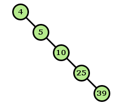

## Best to make the class *contain* a tree, not *be* one 最好让类“包含”一棵树，而不是“本身就是”一棵树

- Make a class *BinarySearchTree contain* a class *Node*.<br>让 *BinarySearchTree* 类内部“包含” *Node* 类。
- *BinarySearchTree* can then have as fields:<br>*BinarySearchTree* 可包含如下字段： 
    - *root* - a Node<br>*root*：一个节点引用
    - *numEntries* - an integer<br>*numEntries*：整数计数

## A Search Tree class (for integers) 搜索树类（整数版）

```java
public class BinarySearchTree {
    
    private class Node {
        private int data;
        private Node left;
        private Node right;
        
        public Node(int data) {
            this.data = data;
        }
    }
    
    private Node root;
    private int numEntries;
    
    public BinarySearchTree() {
        root = null;
        numEntries = 0;
    }
…
```

### Recursive `addNode` 递归版 `addNode`

```java
public Node addNode(Node tree, int val) {
    if (tree == null) {
        tree = new Node(val);
    } else if (val > tree.data) {
        tree.right = addNode(tree.right, val);
    } else if (val < tree.data) {
        tree.left = addNode(tree.left, val);
    } // val is already in tree; take action
    return tree;
}
```

#### `BinarySearchTree.insert` using recursive `addNode` 使用递归 `addNode` 的 `BinarySearchTree.insert`

```java
public void insert (int val) {
    root = addNode(root, val);
    numEntries++;
} // BinarySearchTree.insert
```

### Iterative `addNode` 迭代版 `addNode`

```java
public void addNode(int key, String name) { // does not use recursive way
    Node p, parent;
    p = root;
    while (p != null && p.key != key) {
        parent = p;
        if (key < p.key) p = p.left; else p = p.right;
    }
    if (p == null) {
        Node newNode = new Node(key, name);
        if (p == root) root = newNode;
        else if (p == parent.left) parent.left = newNode;
        else parent.right = newNode;
        numEntries++;
    }
    else // p != null - duplicate node detected! Take appropriate action
}
```

#### `BinarySearchTree.insert` using iterative `addNode` 使用迭代 `addNode` 的 `BinarySearchTree.insert`

```java
public void insert (int val) {
    addNode(val);
} // BinarySearchTree.insert
```

## Perfectly balanced trees 完全平衡树

A <span style="color: red"><i>perfectly balanced</i></span> tree with $2^{(k+1)} - 1$ nodes, will have $depth \times (height)~k$ so searches take at most $k$ steps  
对于一个包含 $2^{(k+1)} - 1$ 个节点的<span style="color: red"><i>完全平衡</i></span>树，其深度（高度）为 $k$，因此查找最多只需 $k$ 步。

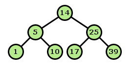

- The <span style="color: red"><i>depth</i> of a tree</span> defined to be<br>树的<span style="color: red"><i>深度</i></span>定义为：
    - the length of the longest path from the root to a leaf,<br>从根到叶子最长路径的长度；
    - so a tree consisting only of the root node has a depth of 0.<br>因此只有根节点的树深度为 0；
    - The depth of an empty tree can be taken to be -1.<br>空树深度可定义为 -1。

---

A <span style="color: red"><i>perfectly balanced</i></span> tree  
一棵<span style="color: red"><i>完全平衡</i></span>树


For <span style="color: red"><i>n</i> nodes</span>, searches take no more than $\underline{\textcolor{red}{(1 + log~n)}}$ steps.  
对于 <span style="color: red"><i>n</i></span> 个节点，查找步数不超过 $\underline{\textcolor{red}{(1 + log~n)}}$。
- This is described as a $\textcolor{red}{O(log~n)}$ <span style="color: red">algorithm</span> and it is a lot faster than an algorithm with $n$ steps, which would be $O(n)$.<br>这被称为 $\textcolor{red}{O(log~n)}$ 级别<span style="color: red">算法</span>，明显快于需要 $n$ 步的 $O(n)$ 算法。

## Self-balancing trees 自平衡树

- A balanced tree offers better access time, but re-balancing a tree takes time, so it is a trade-off.<br>平衡树查询更快，但维护平衡本身也需要成本，这是一种权衡。
- This has led to a variety of engineering solutions for self-balancing trees.These include:<br>因此工程上出现了多种自平衡树方案，包括：
    - <span style="color: red">“AVL” trees:</span> G. M. Adelson-Velskii and E. M. Landis, 1962<br><span style="color: red">“AVL 树”</span>：G. M. Adelson-Velskii 与 E. M. Landis（1962）
    - <span style="color: red">“Red-black” trees:</span> Rudolf Bayer (1972).<br><span style="color: red">“红黑树”</span>：Rudolf Bayer（1972）
    - <span style="color: red">"Symmetric binary B-Trees: Data structure and maintenance algorithms".</span> Acta Informatica. 1 (4): 290-306<br><span style="color: red">“对称二叉 B 树：数据结构与维护算法”</span>，发表于 Acta Informatica 1(4): 290-306

## `TreeMap`（树映射）

- The provided Java collection class `TreeMap` implements the interface `Map`.<br>Java 提供的集合类 `TreeMap` 实现了 `Map` 接口。
- It uses a *Red-Black* tree and offers $\textcolor{red}{O(log~n)}$ access time.<br>它基于*红黑树*，访问复杂度为 $\textcolor{red}{O(log~n)}$。
    - <span style="color: orange">Note: <i>HashMap</i> can offer</span> $\textcolor{orange}{O(1)}$ <span style="color: orange">access time.</span><br><span style="color: orange">注意：<i>HashMap</i> 访问可达</span> $\textcolor{orange}{O(1)}$ <span style="color: orange">级别。</span>
- But it is possible to iterate through a `TreeMap` accessing the values in order; this is not possible with a `HashMap`.<br>但 `TreeMap` 可以按有序顺序迭代访问值，而 `HashMap` 通常无法做到这一点。

## Access Time 访问时间

- Searching is faster in a binary search tree, just as *binary search* in a sorted array is faster than linear search.<br>在二叉搜索树中查找通常更快，正如有序数组中的*二分查找*快于线性查找。
- There is a trade-off: cost of keeping tree balanced versus cost of searches.<br>存在权衡：维护平衡的代价与查找代价之间需要取舍。
- It is easy to sort numbers using a binary search tree - <span style="color: red">why and how?</span><br>用二叉搜索树做排序很自然，<span style="color: red">为什么？怎么做？</span>

## Requirements 学习目标

- What you want to achieve by the end of this week's work:<br>本周结束时你应达成：
    - understand binary trees<br>理解二叉树
    - understand binary search trees<br>理解二叉搜索树
    - know the difference!<br>明确两者差异
    - be able to write recursive functions on trees.<br>能在树结构上编写递归函数

> [!QUESTION] Thingking Question 思考题
> 以下二叉树的区别：
> 
> 完美二叉树（perfect binary tree）
> 
> 完全二叉树（complete binary tree）
> 
> 完满二叉树（full binary tree）
