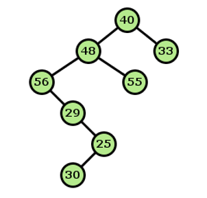
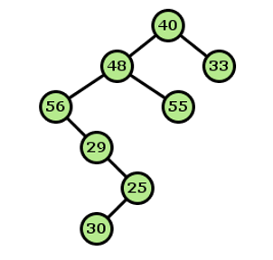
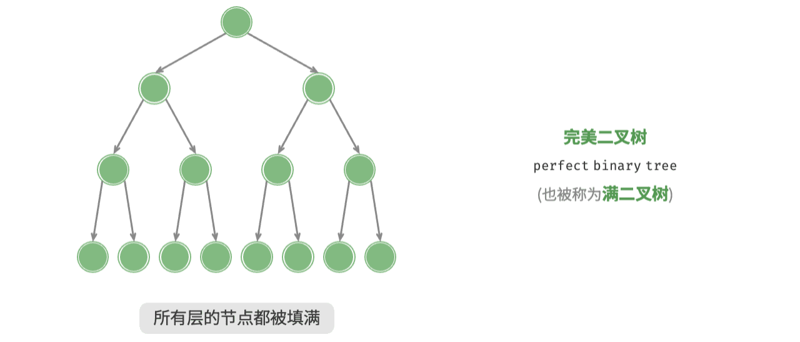
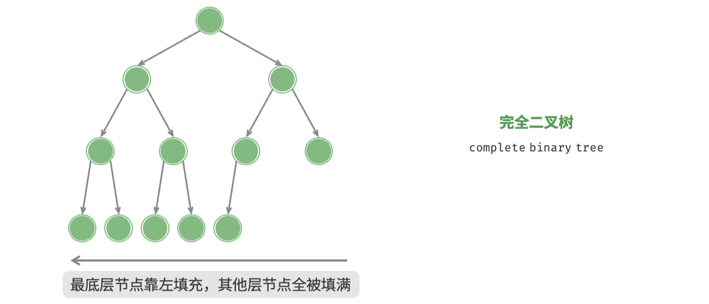
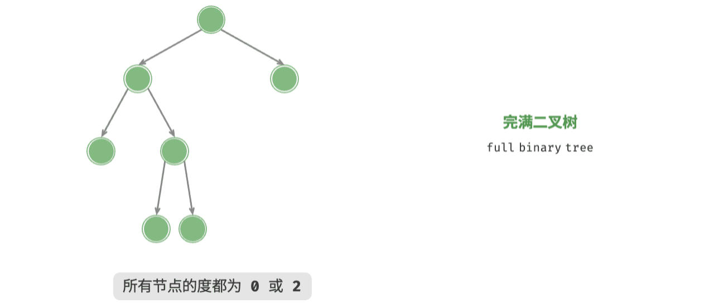
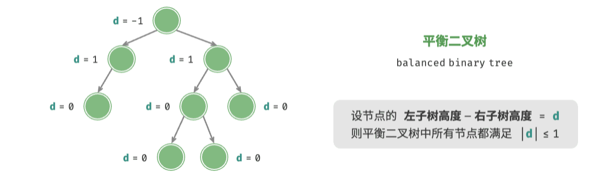
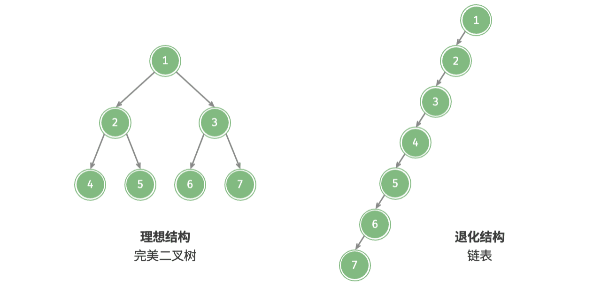

# Exercises Binary Trees<br>二叉树练习

## Exercise 1 - Getting set up<br>练习 1：环境准备

Download the code provided on the website, organise your folders, and get a project set up as usual. You should now see the following files in the project:  
从网站下载提供的代码，整理好文件夹，并按常规方式完成项目搭建。此时你应在项目中看到以下文件：

- **TreePlay.java** - the main program<br>**TreePlay.java**：主程序
- **BinaryTree.java** - a class representing binary trees of integers<br>**BinaryTree.java**：表示整数二叉树的类
- **TreeUtilities.java** - various utilities, including for generating random trees and for pop-up windows displaying binary trees<br>**TreeUtilities.java**：各种工具方法，包括生成随机树与弹窗显示二叉树
- **TreeNavigator.java** - a class with some empty method stubs, which you will complete in the practical<br>**TreeNavigator.java**：包含若干待补全方法桩的类，你将在本次实践中完成它们

Have a look at the `main()` method in the main class `TreePlay` and its comments. Now run the program to see what it does.  
先查看主类 `TreePlay` 中的 `main()` 方法及其注释，然后运行程序观察其行为。

Please note that you _don’t_ need to know how the creation of a random tree or the display of a tree works (inside `TreeUtilities.java`) for this practical. These facilities are just provided to make it easier for you to create multiple sample trees to try things out on, and see the contents of the trees.  
请注意，在本次实践中你 _不需要_ 理解随机树生成或树可视化显示（`TreeUtilities.java` 内部）是如何实现的。这些功能只是为了便于你快速创建多个样例树并查看树内容。

## Exercise 2 - Traversals<br>练习 2：遍历

Implement the method `preOrderTraversal()` in the `TreeNavigator` class. After that, add a line of code to the `main` method in the main class, `TreePlay`, to look at the results of your traversals, so that you now have  
在 `TreeNavigator` 类中实现 `preOrderTraversal()`。随后在主类 `TreePlay` 的 `main` 方法中添加代码，以查看遍历结果，即：

```java
BinaryTree t = TreeUtilities.createRandomTree(); 
System.out.println("PREORDER TRAVERSAL");
TreeNavigator.preOrderTraversal(t);

TreeUtilities.showTree(t);
```

Run the code - but _STOP_ before clicking on the continue button. Before the program gets to printing out the pre-order traversal of the tree, predict the results: write down on a piece of paper what the tree looks like, and write down what you THINK is the pre-order traversal of the tree. Then click on the continue button. Were you right? If not, try again.  
运行代码，但在点击继续按钮前先 _停下_。在程序打印先序遍历结果前，请先预测：把树形结构画在纸上，并写下你“认为”的先序遍历序列。然后再点击继续。你猜对了吗？如果没有，再试一次。

Now implement the `postOrderTraversal()` and `inOrderTraversal()` methods, and test them by adding code to the `TreePlay` class, as you did for the `preOrderTraversal()` method. Note that it will be easier to check your results if you call your TreeNavigator methods _before_ calling `TreeUtilities.showTree()`.  
接着实现 `postOrderTraversal()` 和 `inOrderTraversal()`，并像测试 `preOrderTraversal()` 一样，在 `TreePlay` 中添加测试代码。注意：若先调用 TreeNavigator 方法、再调用 `TreeUtilities.showTree()`，结果会更容易核对。

## Exercise 3 - Counting the Leaves<br>练习 3：统计叶子节点

Now implement the `leafCount()` method in the TreeNavigator class so that you count how many _leaves_ there are in a binary tree:  
现在在 TreeNavigator 类中实现 `leafCount()`，用于统计二叉树中的_叶子节点_数量：

```java
public int leafCount(BinaryTree t)…
```

For example, in this binary tree →  
例如，在这棵二叉树中 →

there are precisely three leaves (containing 30, 33 and 55):  
恰好有三个叶子节点（值为 30、33 和 55）：



Add a line in the main method of the `TreePlay` class, before the tree gets displayed, like this  
在 `TreePlay` 类的 `main` 方法中、树显示之前，加入如下代码：

```java
System.out.println("LEAF COUNT = " + TreeNavigator.leafCount(t));
TreeUtilities.showTree(t);
```

so you can check the result of the `leafCount` method while the tree is displayed on the screen.  
这样你就可以在树可视化显示时同步核对 `leafCount` 的结果。

## Exercise 4 - The Depth of a Binary Tree<br>练习 4：二叉树深度

The _depth_ of a binary tree is the number of <u>edges</u> that you have to traverse to get from the root of the tree to its furthest leaf.  
二叉树的*深度*是指：从树根到最远叶子节点所需经过的<u>边</u>数。

> Usually, height is the same as depth.  
> 通常高度（height）与深度（depth）在这里可视为同义。

Note: a tree with only one node has depth 0, an empty tree is taken to have -1, and for example, the height of this tree is 5, because you have to traverse 5 edges to get from the root to the furthest leaf:  
注意：只有一个节点的树深度为 0；空树深度视为 -1。下图这棵树高度为 5，因为从根到最远叶子需要经过 5 条边：



> Hint: the method `Math.max` may be useful (look it up in the API documentation).  
> 提示：`Math.max` 方法可能有帮助（可查阅 API 文档）。

In the `TreeNavigator` class, implement the method `depth()` and test it by adding lines to the `TreePlay` class. The best way to do this is to add a line before the tree gets displayed, like this  
在 `TreeNavigator` 类中实现 `depth()` 方法，并在 `TreePlay` 类中添加测试代码。推荐在树显示前加入如下语句：

```java
System.out.println("DEPTH = " + TreeNavigator.depth(t));
TreeUtilities.showTree(t);
```

so you can check the result of the `depth()` method while the tree is displayed on the screen. As before, try it on a few more trees, to test that it seems to work ok.  
这样你就能在树显示时核对 `depth()` 的结果。和之前一样，再多测几棵树，确认实现表现正常。

## Further Exercises (optional)<br>进阶练习（可选）

These exercises are provided so that if at some point you would like to practise further with binary tree concepts, you have some exercises to try. They would be very good for revision purposes!  
这些练习用于你后续继续巩固二叉树概念，非常适合复习使用。

## Exercise 5 - More Practice on Recursive Methods<br>练习 5：递归方法进阶

Write a recursive method `strictlyBinary()` (to go in the `TreeNavigator` class)  
编写递归方法 `strictlyBinary()`（放在 `TreeNavigator` 类中）：

```java
public static boolean strictlyBinary(BinaryTree t)
```

which returns true if and only if the tree is `strictly binary`. A tree is strictly binary if it is not empty, and every node that is not a leaf has precisely two subtrees.  
当且仅当该树是 `strictly binary`（严格二叉树）时返回 `true`。严格二叉树要求：树非空，且每个非叶节点都恰好有两个子树。

## Reference Answer

> [!DONE] Reference Answer
> ```java
> // src/binary_tree/TreeNavigator.java
> package binary_tree;
> /**
>  * @author Anka
>  */
> public class TreeNavigator {
> 
>     /**
>      * Print out a preorder traversal of a binary tree
>      *
>      * @param t root of the tree to be traversed
>      */
>     public static void preOrderTraversal(BinaryTree t) {
>         if (t != null) {
>             System.out.println(t.data);
>             preOrderTraversal(t.left);
>             preOrderTraversal(t.right);
>         }
>     }
> 
>     /**
>      * Print out a postorder traversal of a binary tree
>      *
>      * @param t root of the tree to be traversed
>      */
>     public static void postOrderTraversal(BinaryTree t) {
>         if (t != null) {
>             postOrderTraversal(t.left);
>             postOrderTraversal(t.right);
>             System.out.println(t.data);
>         }
>     }
> 
>     /**
>      * Print out a inorder traversal of a binary tree
>      *
>      * @param t root of the tree to be traversed
>      */
>     public static void inOrderTraversal(BinaryTree t) {
>         if (t != null) {
>             inOrderTraversal(t.left);
>             System.out.println(t.data);
>             inOrderTraversal(t.right);
>         }
>     }
> 
>     /**
>      * Count the leaves on a binary tree
>      * @param t root of the tree to be examined
>      * @return the number of leaves in the tree
>      */
>     public static int leafCount(BinaryTree t) {
>         int count = 0;
>         if (t != null) {
>             if (t.left == null && t.right == null) {
>                 count = 1;
>             } else {
>                 count += leafCount(t.left);
>                 count += leafCount(t.right);
>             }
>             return count;
>         } else {
>             return 0;
>         }
>     }
> 
>     /**
>      * Find the depth of a binary tree
>      * @param t the root of the tree to be examined
>      * @return depth of the tree
>      */
>     public static int depth(BinaryTree t) {
>         if (t != null) {
>             int leftDepth = depth(t.left);
>             int rightDepth = depth(t.right);
>             return 1 + Math.max(leftDepth, rightDepth);
>         } else {
>             return 0;
>         }
>     }
>     public static int depth2(BinaryTree t) {
>         if (t == null) {
>             return -1;
>         } else {
>             return 1 + Math.max(depth2(t.left), depth2(t.right));
>         }
>     }
> 
>     /**
>      * Determine whether a tree is strictly binary
>      * @param t the tree to be examined
>      * @return true if the tree is strictly binary, false if it is not
>      */
>     public static boolean strictlyBinary(BinaryTree t) {
>         if (t != null) {
>             if ((t.left == null && t.right != null) || (t.left != null && t.right == null)) {
>                 return false;
>             } else {
>                 return strictlyBinary(t.left) && strictlyBinary(t.right);
>             }
>         } else {
>             return true;
>         }
>     }
>     public static boolean strictlyBinary2(BinaryTree t) {
>         if (t == null) {
>             return false;
>         } else if (t.left == null && t.right == null) {
>             return true;
>         } else {
>             return strictlyBinary2(t.left) && strictlyBinary2(t.right);
>         }
>     }
> }
> ```

# Practical: Cross-referencing (Binary search tree)<br>实践：交叉引用（基于二叉搜索树）

You are going to complete the implementation (in Java) of a program that will generate a **cross-reference** listing of a text provided in a file.  
你将完成一个 Java 程序：对给定文件中的文本生成**交叉引用**列表。

For example, look at this file  
例如，考虑这个文件  
→

> Macavity's a Mystery Cat: he's called the Hidden Paw
> 
> For he's the master criminal who can defy the Law.
> 
> He's the bafflement of Scotland Yard, the Flying Squad's despair
> 
> For when they reach the scene of crime Macavity's not there!
> 
> \[T S Eliot]

The cross-reference you will produce will display a list, in alphabetic order, of each word in the text and the line numbers of the lines on which it appears.  
你要生成的交叉引用将按字母顺序列出文本中的每个单词，以及该单词出现的行号。

The line numbers should appear in ascending order, and, if a word appears on a line of the text more than once, then the line number should appear only **once** for that word in the cross-reference list.  
行号应按升序显示；若同一单词在同一行出现多次，该行号在交叉引用中也只应出现 **一次**。

For example, the cross reference of the above file is as follows  
例如，上述文件的交叉引用如下  
→

<table>
    <tr>
        <td>a: 1<br>bafflement: 3<br>called: 1<br>can: 2<br>Cat: 1<br>crime: 4<br>criminal: 2<br>defy: 2<br>despair: 3<br>Eliot: 5<br>Flying: 3<br>For: 2, 4<br>he's: 1, 2, 3<br>Hidden: 1<br>Law: 2<br>Macavity's: 1, 4<br>master: 2</td>
        <td>Mystery: 1<br>not: 4<br>of: 3, 4<br>Paw: 1<br>reach: 4<br>S: 5<br>scene: 4<br>Scotland: 3<br>Squad's: 3<br>T: 5<br>the: 1, 2, 3, 4<br>there: 4<br>they: 4<br>when: 4<br>who: 2<br>Yard: 3</td>
    </tr>
</table>

To produce the cross-reference listing, you will use a _binary search tree_ to store the words in the file, and each word in the tree should be stored along with a list of the numbers of the lines on which it appears. Note that you will not need to do any _explicit sorting_ in this program to get values in the desired order.  
为生成交叉引用列表，你将使用*二叉搜索树*存储文件中的单词，并为每个单词维护其出现行号列表。注意：为了得到所需顺序，你不需要做任何_显式排序_。

For a longer example, see the _Appendix_ of this document.  
更长示例见文末*附录*。

## Exercise 1

Set up a project from the sources supplied on the student website, in the usual way.  
用学生网站提供的源码按常规方式搭建项目。

Take a look at the two files you are provided with:  
查看提供给你的文件：

- `Xrefs.java` _-_ the main program (**DO NOT ALTER**)<br>`Xrefs.java`：主程序（**不要修改**）
- `WordTree.java` - where the binary search tree is **(DO NOT ALTER)**<br>`WordTree.java`：二叉搜索树数据结构定义（**不要修改**）
- `TreeUtils.Java` - this contains various routines for processing trees, and it is the only file that you should alter<br>`TreeUtils.java`：包含各种树处理例程，也是唯一需要你修改的文件

The data structure for the _binary search tree_ to store the words is provided for you, in the file `WordTree.java`. In the exercises below, you will modify the file `TreeUtils.java` so as to implement the following methods:  
用于存储单词的*二叉搜索树*数据结构已在 `WordTree.java` 提供。接下来你需要修改 `TreeUtils.java`，实现以下方法：

- `recordWord()` - adding a word to a tree<br>`recordWord()` - 向树中添加单词
- `display()` - for the displaying a tree<br>`display()` - 显示树中内容
- `numberOfEntries()` - counting how many different words there are in a tree<br>`numberOfEntries()` - 统计树中不同单词的数量

Study the Java classes, and, in particular, in `TreeUtils.java` the specifications as pre- and post-conditions of the methods.  
请阅读这些 Java 类，尤其关注 `TreeUtils.java` 中各方法的前置条件与后置条件说明。

Start editing the file `TreeUtils.java` by putting your name as the author.  
先在 `TreeUtils.java` 中将作者信息改为你的名字。

Note that when you add a word to the tree, if the word is new, then a new node should be added to the tree, but if the word has been seen before, then the line-number of the new occurrence of the word should be added to the list of line numbers accompanying the word in the tree.  
注意：向树中添加单词时，若该词是新词则应新建节点；若该词已存在，则应将此次出现的行号加入该词对应的行号列表。

## Exercise 2<br>练习 2

Implement the method  
实现下列方法：

```java
recordWord(WordTree tree, String word, int lineNo)
```

This method should insert the word `word` into the tree `tree`, and should return a reference to the tree that results from this insertion. If `tree` is null then the method should create a tree containing just the word `word`.  
该方法应将单词 `word` 插入树 `tree`，并返回插入后的树引用。若 `tree` 为 `null`，则应创建一棵仅含 `word` 的新树并返回。

**Note:** you do not need to copy existing nodes into a new tree. Just insert the word supplied and return a reference to the modified tree.  
**注意：** 你不需要把已有节点复制到新树中，只需在原树上插入该词并返回修改后的树引用。

**Note**: you can compare strings by using suitable methods from the `String` class, in particular look up the methods `equalsIgnoreCase()` and `compareToIgnoreCase()`. For example if `word1` and `word2` are the two strings to be compared, then the expression `word1.compareToIgnoreCase(word2)` will return 0 if the two words are the same (ignoring upper/lower case), will return a number less than 0 if `word1` occurs before `word2` in the dictionary, and will return a number greater than 0 if `word1` occurs after `word2` in the dictionary.  
**注意：** 比较字符串可使用 `String` 类方法，特别是 `equalsIgnoreCase()` 与 `compareToIgnoreCase()`。例如比较 `word1` 与 `word2` 时，`word1.compareToIgnoreCase(word2)`：若两词相同（忽略大小写）返回 0；若 `word1` 在词典序中位于 `word2` 之前则返回小于 0；反之返回大于 0。

_Suggestion_: don’t worry about the line numbers at first, but produce a first version of your program that just produces an alphabetically ordered list of all the (different) words that appeared in the input file.  
_建议_：开始阶段先不处理行号，先做出一个版本，只输出输入文件中所有不同单词的字母序列表。

Also, don’t forget that, if a word appears on a line of the text more than once, then the line number should appear only **once.**  
同时别忘了：若同一单词在同一行出现多次，该行号也只应记录 **一次**。

## Exercise 3<br>练习 3

Implement the method `display()`. If you traverse the binary search tree in the right order then the words will come out in alphabetical order. You will **not** need to sort the list of words if you have built it in the right way.  
实现 `display()` 方法。若你按正确顺序遍历二叉搜索树，输出单词将天然按字母序排列。只要树构建正确，你**不需要**额外排序。

You may assume that the list of line numbers for any one word will fit on one line of the display.  
你可以假设：任意单词对应的行号列表都能在显示中放在同一行。

## Exercise 4<br>练习 4

Implement the method `numberOfEntries()`.  
实现 `numberOfEntries()` 方法。

## Reference Answer

> [!DONE] Reference Answer
> ```java
> // src/binary_search_tree/TreeUtils.java
> package binary_search_tree;
> /**
>  * @author GitHub Copilot
>  */
> public class TreeUtils {
>     /**
>      * Records a new occurrence of a given word into a WordTree.
>      *
>      * @param tree The WordTree into which the word should be recorded (N.B.
>      * this can be null, in which case a new tree should be created and returned)
>      * @param word the word to be recorded
>      * @param lineNo the line number on which the word occurred
>      * @return a reference to the modified tree, with the new word inserted.
>      * N.B if tree is null, the method should create a WordTree
>      * containing the word to be inserted, and should return it.
>      * PRECONDITION: tree is a well formed binary search tree
>      * POSTCONDITION: if word was not in tree, then the word and its line number
>      * (lineNo) have been inserted into ordered word tree, else line has been 
>      * appended to line-number list for word (if we haven't already recorded 
>      * that line number for this word)
>      */
>     public static WordTree recordWord(WordTree tree, String word, int lineNo) {
>         // If tree is empty, create a new node and return it
>         if (tree == null) {
>             return new WordTree(word, lineNo);
>         }
> 
>         // Compare words ignoring case to maintain dictionary order
>         int cmp = word.compareToIgnoreCase(tree.word);
>         if (cmp == 0) {
>             // Word already in this node: add the line number if not already present
>             if (!tree.lineNumbers.contains(lineNo)) {
>                 tree.lineNumbers.add(lineNo);
>             }
>         } else if (cmp < 0) {
>             // Insert into left subtree
>             tree.left = recordWord(tree.left, word, lineNo);
>         } else {
>             // Insert into right subtree
>             tree.right = recordWord(tree.right, word, lineNo);
>         }
> 
>         return tree;
>     }
> 
>     /**
>      * Displays all the words in a WordTree.
>      *
>      * @param tree the WordTree whose contents are to be displayed
>      * PRECONDITION: tree is a well formed binary search tree
>      * POSTCONDITION words have been written out in alphabetical order, each 
>      * followed by ascending list of line numbers on which the word occurs
>      */
>     public static void display(WordTree tree) {
>         if (tree == null) return;
> 
>         // In-order traversal to display words in alphabetical order
>         display(tree.left);
> 
>         // Print word followed by its line numbers (ascending order)
>         System.out.print(tree.word + ": ");
>         for (int i = 0; i < tree.lineNumbers.size(); i++) {
>             System.out.print(tree.lineNumbers.get(i));
>             if (i < tree.lineNumbers.size() - 1) System.out.print(", ");
>         }
>         System.out.println();
> 
>         display(tree.right);
>     }
> 
>     /**
>      * Counts how many different words there are in a WordTree
>      *
>      * @param tree the WordTree whose words are to be counted
>      * @return the number of different words in tree
>      * PRECONDITION: tree is a well formed binary search tree
>      */
>     public static int numberOfEntries(WordTree tree) {
>         if (tree == null) return 0;
>         return 1 + numberOfEntries(tree.left) + numberOfEntries(tree.right);
>     }
> }
> ```

## Appendix

If you want to entertain yourself look at:  
如果你想放松一下，可以看看：

https://www.youtube.com/watch?v=TKlub5vB9z8

<div class="iframe-container">
    <iframe src="//player.bilibili.com/player.html?isOutside=true&aid=725150363&bvid=BV12S4y127eg&cid=559964089&p=1&autoplay=0" scrolling="no" border="0" frameborder="no" framespacing="0" allowfullscreen="true"></iframe>
</div>
<style>
  .iframe-container {
    width: 100%;
    aspect-ratio: 4 / 3;
  }
  .iframe-container iframe {
    width: 100%;
    height: 100%;
    border: 0;
  }
</style>

Here is an example output for `Moses.txt`, which contains a nonsense poem from the film *Singing in the Rain*:  
下面是 `Moses.txt` 的输出示例；该文本来自电影 *Singing in the Rain* 中的一首无厘头诗：

```
************************************
Producing a cross-reference for the file:
Moses.txt
************************************
1: Moses supposes his toeses are Roses,
2: But Moses supposes erroneously,
3: Moses he knowses his toeses aren't roses,
4: As Moses supposes his toeses to be!
5: Moses supposes his toeses are Roses,
6: But Moses supposes erroneously,
7: A mose is a mose!
8: A rose is a rose!
9: A toes a toes!
10: Hooptie doodie doodle
11: Moses supposes his toeses are Roses,
12: But Moses supposes erroneously,
13: For Moses he knowses his toeses aren't roses,
14: As Moses supposes his toeses to be!
15: Moses
16: (Moses supposes his toeses are roses)
17: Moses
18: (Moses supposes erroneously)
19: Moses
20: (Moses supposes his toeses are roses)
21: As Moses supposes his toeses to be! 
22: A Rose is a rose is a rose is a rose is
23: A rose is for Moses as potent as toeses
24: Couldn't be a lily or a daphi daphi dilli
25: It's gotta be a rose cuz it rhymes with mose!
26: Moses!
27: Moses!
28: Moses!
A: 7, 8, 9, 22, 23, 24, 25
are: 1, 5, 11, 16, 20
aren't: 3, 13
As: 4, 14, 21, 23
be: 4, 14, 21, 24, 25
But: 2, 6, 12
Couldn't: 24
cuz: 25
daphi: 24
dilli: 24
doodie: 10
doodle: 10
erroneously: 2, 6, 12, 18
For: 13, 23
gotta: 25
he: 3, 13
his: 1, 3, 4, 5, 11, 13, 14, 16, 20, 21
Hooptie: 10
is: 7, 8, 22, 23
it: 25
It's: 25
knowses: 3, 13
lily: 24
mose: 7, 25
Moses: 1, 2, 3, 4, 5, 6, 11, 12, 13, 14, 15, 16, 17, 18, 19, 20, 21, 23, 26, 27, 28
or: 24
potent: 23
rhymes: 25
rose: 8, 22, 23, 25
Roses: 1, 3, 5, 11, 13, 16, 20
supposes: 1, 2, 4, 5, 6, 11, 12, 14, 16, 18, 20, 21
to: 4, 14, 21
toes: 9
toeses: 1, 3, 4, 5, 11, 13, 14, 16, 20, 21, 23
with: 25
number of words: 144
number of different words: 35
```


# Reference Answer to the Thinking Question in lecture<br>lecture思考题参考答案

## 常见二叉树类型

### 完美二叉树

如下图所示，<u>完美二叉树（perfect binary tree）</u>所有层的节点都被完全填满。在完美二叉树中，叶节点的度为 $0$ ，其余所有节点的度都为 $2$ ；若树的高度为 $h$ ，则节点总数为 $2^{h+1} - 1$ ，呈现标准的指数级关系，反映了自然界中常见的细胞分裂现象。

> [!TIP] Tip
> 请注意，在中文社区中，完美二叉树常被称为<u>满二叉树</u>。



### 完全二叉树

如下图所示，<u>完全二叉树（complete binary tree）</u>仅允许最底层的节点不完全填满，且最底层的节点必须从左至右依次连续填充。请注意，完美二叉树也是一棵完全二叉树。



### 完满二叉树

如下图所示，<u>完满二叉树（full binary tree）</u>除了叶节点之外，其余所有节点都有两个子节点。



### 平衡二叉树

如下图所示，<u>平衡二叉树（balanced binary tree）</u>中任意节点的左子树和右子树的高度之差的绝对值不超过 1 。



## 二叉树的退化

下图展示了二叉树的理想结构与退化结构。当二叉树的每层节点都被填满时，达到“完美二叉树”；而当所有节点都偏向一侧时，二叉树退化为“链表”。

- 完美二叉树是理想情况，可以充分发挥二叉树“分治”的优势。
- 链表则是另一个极端，各项操作都变为线性操作，时间复杂度退化至 $O(n)$ 。



如下表所示，在最佳结构和最差结构下，二叉树的叶节点数量、节点总数、高度等达到极大值或极小值。

|                             | 完美二叉树         | 链表    |
| --------------------------- | ------------------ | ------- |
| 第 $i$ 层的节点数量         | $2^{i-1}$          | $1$     |
| 高度为 $h$ 的树的叶节点数量 | $2^h$              | $1$     |
| 高度为 $h$ 的树的节点总数   | $2^{h+1} - 1$      | $h + 1$ |
| 节点总数为 $n$ 的树的高度   | $\log_2 (n+1) - 1$ | $n - 1$ |
