# AVL Tree<br>AVL 树

## Content<br>内容

- Purpose of AVL Tree<br>AVL 树的目的
- Node Rotation<br>节点旋转
- Build an AVL Tree<br>构建 AVL 树

## Searching on BST<br>在 BST 上查找

> BST: Binary Search Tree 二叉搜索树

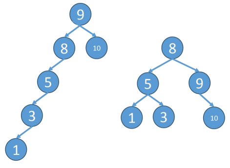

2 Binary Search Tree with the same Nodes, the steps for searching node 1 are quite <span style="color: red">different</span>.  
两棵包含相同节点的二叉搜索树，在查找节点 1 时所需步骤却非常<span style="color: red">不同</span>。

Which is better?  
哪棵更好？

How to evaluate the “better”?  
如何衡量“更好”？

---

The height (depth) of a BST is a key factor in determining the number of search steps.  
BST 的高度（深度）是决定查找步数的关键因素。

Less height, fewer steps, much better!  
高度越低，步数越少，性能越好。

Make a BST shorter and Wider rather than letting it grow taller and skinny: <span style="color: red">Balancing</span>.  
与其让 BST 又高又瘦，不如让它更矮更宽：这就是<span style="color: red">平衡化</span>。

## Balancing BST<br>平衡 BST

- Balanced Tree 平衡树：
    - Resembles a pyramid or a bush.<br>形态类似金字塔或灌木状。
    - The height is minimized.<br>树高尽量小。
    - Time complexity: O(log n).<br>时间复杂度通常为 O(log n)。
    - The Balance Factor of every node must be -1, 0, or +1.<br>每个节点的平衡因子必须是 -1、0 或 +1。
        - <span style="color: red">balance factor = Height(left subtree) – Height(right subtree)</span><br><span style="color: red">平衡因子 = 左子树高度 - 右子树高度</span>
        - <span style="color: red">Each node has one balance factor</span><br><span style="color: red">每个节点都有一个平衡因子</span>
        - <span style="color: red">0: The left and right subtrees have equal height.</span><br><span style="color: red">0：左右子树等高</span>
        - <span style="color: red">+1: The left subtree is one level higher.</span><br><span style="color: red">+1：左子树高一层</span>
        - <span style="color: red">-1: The right subtree is one level higher.</span><br><span style="color: red">-1：右子树高一层</span>
        - <span style="color: red">&gt; 1 or &lt; -1: The node is unbalanced, and the tree must perform an adjustment.</span><br><span style="color: red">&gt;1 或 &lt;-1：节点失衡，树必须调整</span>

## What is an AVL Tree?<br>什么是 AVL 树？

- An AVL tree is a type of <span style="color: red"><b>self-balancing</b></span> binary search tree, named after its inventors, Adelson-Velsky and Landis, who introduced it in 1962.  
AVL 树是一种<span style="color: red"><b>自平衡</b></span>二叉搜索树，名称来自其发明者 Adelson-Velsky 和 Landis（1962 年提出）。
- The defining characteristic of an AVL tree is its strict balance condition. For every node in the tree, the Balance Factor of every node must be -1, 0, or +1.  
AVL 树的核心特征是严格平衡条件：对树中每个节点，其平衡因子必须是 -1、0 或 +1。
- If an insertion or deletion operation causes any node's balance factor to become 2 or -2, the tree is considered unbalanced. It must be restructured through a process called <span style="color: red"><b>rotation</b></span> to restore the AVL property.  
如果插入或删除导致某节点平衡因子变为 2 或 -2，则树被视为失衡，必须通过<span style="color: red"><b>旋转</b></span>进行重构以恢复 AVL 性质。

## Four scenarios of imbalance<br>四种失衡场景

| 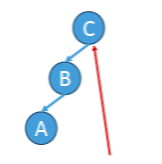 | 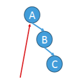 | 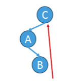 | 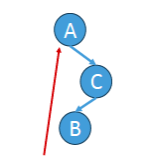 |
| --- | --- | --- | --- |
| - Left of Left is too high<br>- <span style="color: red">LL case</span><br>- <span style="color: red">.BF &gt; 1</span><br>- <span style="color: red">.left.BF&gt;=0</span><br>- 左子树的左侧过高<br>- <span style="color: red">LL 情况</span><br>- <span style="color: red">.BF &gt; 1</span><br>- <span style="color: red">.left.BF&gt;=0</span> | - Right of Right is too high<br>- <span style="color: red">RR case</span><br>- <span style="color: red">.BF&lt;-1</span><br>- <span style="color: red">.right.BF&lt;=0</span><br>- 右子树的右侧过高<br>- <span style="color: red">RR 情况</span><br>- <span style="color: red">.BF&lt;-1</span><br>- <span style="color: red">.right.BF&lt;=0</span> | - Left’s Right is too high<br>- <span style="color: red">LR case</span><br>- <span style="color: red">.BF&gt;1</span><br>- <span style="color: red">.left.BF&lt;0</span><br>- 左子树的右侧过高<br>- <span style="color: red">LR 情况</span><br>- <span style="color: red">.BF&gt;1</span><br>- <span style="color: red">.left.BF&lt;0</span> | - Right’s Left is too high<br>- <span style="color: red">RL case</span><br>- <span style="color: red">.BF&lt;-1</span><br>- <span style="color: red">.right.BF&gt;0</span><br>- 右子树的左侧过高<br>- <span style="color: red">RL 情况</span><br>- <span style="color: red">.BF&lt;-1</span><br>- <span style="color: red">.right.BF&gt;0</span> |

## Rotation of AVL Tree<br>AVL 树旋转

> Tip: using AI

- Task 1 (compulsory)<br>任务 1（必做）
    - State the steps one by one for rotating the nodes of each scenario<br>逐步写出每种场景下节点旋转的步骤
- Task 2 (compulsory)<br>任务 2（必做）
    - Please implement the rotation function for each scenario.<br>实现每种场景对应的旋转函数
- Task 3 (compulsory)<br>任务 3（必做）
    - Please implement the insertion operation of the AVL Tree using the rotation functions devised in task 2<br>利用任务 2 的旋转函数实现 AVL 树插入
- Task 4 (optional)<br>任务 4（可选）
    - Please implement the deletion operation of the AVL Tree using the rotation functions devised in task 2 (optional)<br>利用任务 2 的旋转函数实现 AVL 树删除（可选）

## Build an AVL Tree<br>构建 AVL 树

- Rebalance the Tree when inserting a new node into the AVL Tree<br>向 AVL 树插入新节点时需要重平衡
    - insert as a BST at the beginning<br>先按 BST 规则完成插入
    - rebalance the Tree before returning the new subtree<br>返回新子树前完成重平衡
        - rotate the subtree depending on different scenarios<br>根据不同失衡场景旋转子树

<center style="color: red">Complete the exercise!<br>完成练习！</center>

> In-class exercise document: [practice-class.docx](https://vle.zycdut.net/sites/student.zy.cdut.edu.cn/files/attachments/practice-class.docx)

# Huffman coding<br>哈夫曼编码

Huffman coding is a neat example of using binary trees. It’s also the foundation for text compression algorithms. We won’t describe the algorithm but will spend time focusing on how it works and how it makes clever use of trees.  
哈夫曼编码是二叉树应用的经典示例，也是文本压缩算法的基础。这里我们不展开算法细节，而重点理解它如何工作，以及如何巧妙利用树结构。

First, a little background. To know how compression works, we need to know how much space a text file takes. Suppose we have a text file with just one word: *tilt*. How much space does that use? You can use the `stat` command (available on Unix). First, save the word in a file called `test.txt`. Then, using `stat`,  
先补一点背景知识。要理解压缩，先要知道文本占用多少空间。假设文本文件只有一个单词：*tilt*。它占多大空间？可以使用 Unix 的 `stat` 命令。先把这个词保存到 `test.txt`，然后执行：

```shell
$ cat test.txt
tilt

$ stat -f%z test.txt
4
```

so that file takes up 4 bytes: 1 byte per character.  
结果显示文件占 4 字节：每个字符 1 字节。

This makes sense. Assuming we are using ISO-8859-1 (see the following sidebar for what this means), each letter takes up exactly 1 byte. For example, the letter $a$ is ISO-8859-1 code 97, which I can write in binary as 01100001. That is 8 bits. A bit is a digit that can be either 0 or 1. And there are eight of them. Eight bits is 1 byte. So the letter $a$ is represented using 1 byte. ISO-8859-1 code goes from 00000000, which represents the null character, all the way to 11111111, which represents $\ddot { y }$ (Latin lowercase letter $y$ with diaeresis). There are 256 possible combinations of 0s and 1s with 8 bits, so the ISO-8859-1 code allows for 256 possible letters.  
这很合理。若使用 ISO-8859-1（含义见下方说明），每个字符正好占 1 字节。比如字母 $a$ 的 ISO-8859-1 编码是 97，二进制写作 01100001，也就是 8 位。bit（二进制位）只能是 0 或 1，8 位就是 1 字节，所以字母 $a$ 用 1 字节表示。ISO-8859-1 编码范围从 00000000（空字符）到 11111111（$\ddot { y }$，带分音符的小写 y）。8 位共有 256 种组合，因此 ISO-8859-1 可表示 256 个字符。

## Character encoding<br>字符编码

As this example will show you, there are many different ways to encode characters. That is, the letter a could be written in binary in many different ways.  
正如这个例子所示，字符编码有很多种方式。也就是说，同一个字母 a 可以在不同编码中对应不同二进制表示。

It started with ASCII. In the 1960s, ASCII was created. ASCII is a 7-bit encoding. Unfortunately, ASCII did not include a lot of characters. ASCII does not include any characters with umlauts ($\ddot {u}$ or $\ddot { o }$ , for example) or common currencies like the British pound or Japanese yen.  
最早是 ASCII。ASCII 在 1960 年代诞生，是 7 位编码。但 ASCII 覆盖字符较少，不包含许多字符，比如带分音符的字母（如 $\ddot {u}$ 或 $\ddot { o }$）以及常见货币符号（英镑、日元等）。

So ISO-8859-1 was created. ISO-8859-1 is an 8-bit encoding, so it doubles the number of characters that ASCII provided. We went from 128 characters to 256 characters. But this was still not enough, and countries began making their own encodings. For example, Japan has several encodings for Japanese since ISO-8859-1 and ASCII were focused on European languages. The whole situation was a mess until Unicode was introduced.  
于是出现了 ISO-8859-1。它是 8 位编码，将字符数量从 ASCII 的 128 扩展到 256。但这仍不够，各国开始制定自己的编码方案。例如日本就有多个日文编码，因为 ASCII 与 ISO-8859-1 主要面向欧洲语言。在 Unicode 出现前，整体编码生态非常混乱。

Unicode is an encoding standard. It aims to provide characters for any language. Unicode has 149,186 characters as of version 15—quite a jump from 256! More than 1,000 of these are emojis.  
Unicode 是一个编码标准，目标是覆盖所有语言。到 Unicode 15 版本为止，字符数达 149,186，相比 256 有巨大提升；其中超过 1,000 个是 emoji。

Unicode is the standard, but you need to use an encoding that follows the standard. The most popular encoding today is UTF-8. UTF-8 is variable-length character encoding, which means characters can be anywhere from 1 to 4 bytes (8–32 bits).  
Unicode 是标准，但实际存储时要用遵循该标准的具体编码。当前最常见的是 UTF-8。UTF-8 是变长编码，单个字符可占 1 到 4 字节（8–32 位）。

You don’t need to worry too much about this. I’ve kept the example simple intentionally by using ISO-8859-1, which is 8 bits—a nice consistent quantity of bits to work with.  
这里不必过度纠结细节。为了便于讲解，示例故意使用 8 位固定长度的 ISO-8859-1，便于统一处理。

Just remember these takeaways:  
只需记住以下结论：
- Compression algorithms try to reduce the number of bits needed to store each character.<br>压缩算法的目标是减少每个字符所需位数。
- If you need to pick an encoding for a project, UTF-8 is a good default choice.<br>项目选编码时，UTF-8 通常是很好的默认选项。

Let’s decode some binary to ISO-8859-1 together:  
我们来把一段二进制解码为 ISO-8859-1：

`011100100110000101100100`. You can Google an ISO-8859-1 table or a binary-to-ISO-8859-1 converter to make this easier.  
`011100100110000101100100`。你可以查 ISO-8859-1 对照表或在线转换器来简化操作。

First, we know that each letter is 8 bits, so I am going to divide this into chunks of 8 bits to make it easier to read:  
首先，每个字符是 8 位，所以先按 8 位分组，便于阅读：

> 01110010 01100001 01100100

Great, now we see that there are three letters. Looking them up in an ISO-8859-1 table, I see they spell out rad: 01110010 is r, and so on. This is how your text editor takes the binary data in a text file and displays it as ISO-8859-1. You can view the binary information by using xxd. This utility is available on Unix. Here is how tilt looks in binary:  
这样就能看出有 3 个字符。查 ISO-8859-1 表后可知它们拼成 rad：01110010 对应 r，后面同理。这就是文本编辑器把文件二进制按 ISO-8859-1 显示为字符的过程。你可以用 Unix 的 `xxd` 查看二进制；`tilt` 的二进制如下：

```shell
$ xxd -b test.txt 
00000000: 01110100 01101001 01101100 01110100
tilt
```

Here is where the compression comes in. For the word tilt, we don’t need 256 possible letters; we just need three. So we don’t need 8 bits; we only need 2. We could come up with our own 2-bit code just for these three letters:  
压缩的关键在这里：对于单词 tilt，我们不需要 256 个字符候选，只需要 3 个。因此不必用 8 位，2 位就够了。可为这 3 个字符自定义 2 位编码：

```
t = 00
i = 01
l = 10
```

Here is how we could write *tilt* using our new code: 00011000. I can make this easier to read by adding spaces again: 00 01 10 00. If you compare it to the mapping, you’ll see this spells out *tilt*.  
用新编码写 *tilt*：00011000。加空格后是 00 01 10 00。对照映射可验证正是 *tilt*。

This is what Huffman coding does: it looks at the characters being used and tries to use less than 8 bits. That is how it compresses the data. Huffman coding generates a tree.  
哈夫曼编码本质上就是这样：根据实际出现字符，尽量用少于 8 位来表示，从而压缩数据。它会构建一棵树。

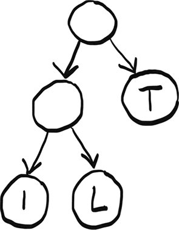

You can use this tree to find the code for each letter. Starting at the root node, find a path down to the letter $L$. Whenever you choose a left branch, append a 0 to your code. When you choose a right branch, append 1. When you get to a letter, stop progressing down the tree. So the code for the letter $L$ is 01. Here are the three codes given by the tree:  
可通过这棵树得到每个字母编码：从根出发，找到字母 $L$。每走左分支追加 0，每走右分支追加 1。到达字母（叶子）就停止。因此 $L$ 的编码是 01。该树给出的 3 个编码为：

```
i = 00
l = 01
t = 1
```

Notice that the letter T has a code of just one digit. Unlike ISO-8859-1, *in Huffman coding, the codes don’t all have to be the same length*. This is important. Let’s see another example to understand why.  
注意字母 T 只有 1 位编码。与 ISO-8859-1 不同，*哈夫曼编码不要求所有编码等长*。这一点非常关键。再看一个例子。

Now we want to compress the phrase "paranoid android." Here is the tree generated by the Huffman coding algorithm.  
现在压缩短语 “paranoid android.”。下图是对应的哈夫曼树。

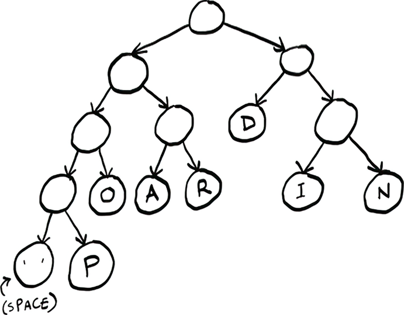

Check yourself: What is the code for the letter $P$? Try it yourself before reading on. It is 0001. What about the letter $D$? It is 10.  
自测一下：字母 $P$ 的编码是什么？先自己试，再往下看。答案是 0001。那 $D$ 呢？答案是 10。

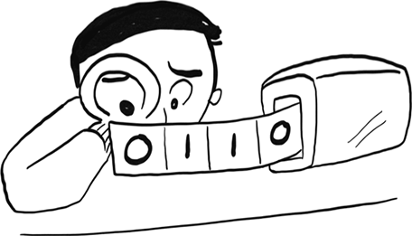

In this case, there are actually three different possible lengths! Suppose we try to decode some binary data: 01101010. We see the problem right away: we can’t chunk this up the way we did with ISO-8859-1! While all ISO-8859-1 codes were eight digits, here the code could be two, three, or four digits. *Since the code length varies, we can’t use chunking anymore.*  
在这个例子中，编码长度竟有三种！假设我们要解码 01101010，问题立刻出现：不能像 ISO-8859-1 那样按固定长度分块。ISO-8859-1 都是 8 位，而这里可能是 2、3 或 4 位。*编码长度可变，因此不能再用固定分块法。*

Instead, we need to look at one digit at a time, as if we are looking at a tape.  
相反，我们必须像读磁带一样，每次读取 1 位。

Here’s how to do it: first number is 0, so go left (I’m only showing part of the tree here).  
做法如下：第一个数字是 0，往左走（这里只画了树的一部分）。

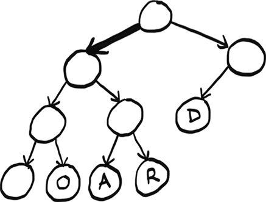

Then we get a 1, so we go right.  
接着读到 1，往右走。

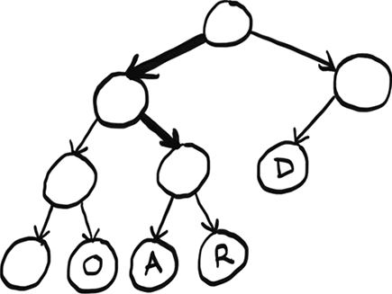

Then we get another 1, so we go right again.  
再读到一个 1，再往右走。

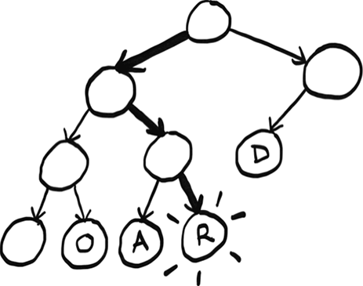

Aha! We found a letter. This is the binary data we have left: 01010. We can start over at the root node and find the other letters. Try decoding the rest yourself and then read on. Did you get the word? It was *rad*. This is a big difference between Huffman coding and ISO-8859-1. The codes can vary, so the decoding needs to be done differently.  
到这里就命中一个字母了。剩余二进制是 01010。然后从根重新开始继续找下一个字母。你可以先自己解完再看答案。得到的单词是 *rad*。这正是哈夫曼编码和 ISO-8859-1 的关键差异：编码可变长，因此解码方式也必须变化。

It is more work to do it this way instead of chunking. But there is one big benefit. Notice that the letters that show up more often have shorter codes. $D$ appears three times, so its code is just two digits versus $I$, which appears twice, and $P$, which appears only once. Instead of assigning 4 bits to everything, we can compress frequently used letters even more. You can see how, in a longer piece of text, this would be a big savings!  
这种逐位解码比固定分块更麻烦，但有一个巨大收益：高频字符会得到更短编码。比如 $D$ 出现 3 次，编码只有 2 位；而 $I$ 出现 2 次，$P$ 只出现 1 次，编码更长。这样就不必给每个字符都分配同样位数，高频字符可被更强压缩。在长文本中节省会非常可观。

Now that we understand at a high level how Huffman coding works, let’s see what properties of trees Huffman is taking advantage of here.  
现在我们已经从高层理解了哈夫曼编码，接下来看看它利用了树的哪些性质。

First, could there be overlap between codes? Take this code for example:  
首先，编码之间会不会重叠？看这个例子：

```
a = 0
b = 1
c = 00
```

Now if you see the binary 001, is that $AAB$ or $CB$? $c$ and $a$ share part of their code, so it’s unclear. Here is what the tree for this code would look like.  
如果看到二进制 001，它是 $AAB$ 还是 $CB$？由于 $c$ 和 $a$ 的编码前缀重叠，结果不唯一。对应树形如下：

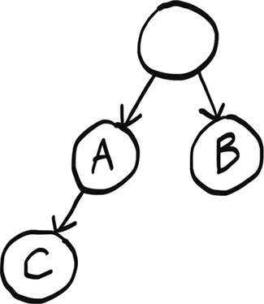

We pass A on the way to C, which causes the problem.  
从根到 C 的路径会经过 A，这就是歧义来源。

That’s not a problem with Huffman coding because letters only show up at leaf nodes. And there’s a unique path from the root to each leaf node—that’s one of the properties of trees. So we can guarantee overlap is not a problem.  
但哈夫曼编码不会出现这个问题，因为字母只放在叶子节点。根到每个叶子的路径唯一，这是树的基本性质之一，因此可保证无歧义。

When we read the code one digit at a time, we are assuming we will eventually end up at a letter. If this was a graph with a cycle, we couldn’t make that assumption. We could get stuck in the cycle and end up in an infinite loop.  
逐位读取编码时，我们默认最终一定会到达某个字母。如果结构是带环图，这个假设就不成立，可能陷入环中导致死循环。

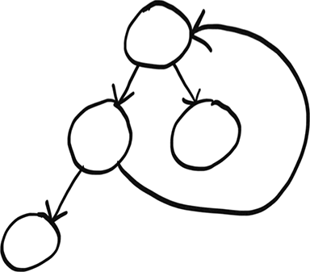

But since this is a tree, we know there are no cycles, so we are guaranteed to end up at some letter.  
但这里是树，不存在环，因此一定会落到某个字母节点。

We are using a rooted tree. Rooted trees have a root node, which is important because we need to know where to start! Graphs do not necessarily have a root node.  
我们用的是有根树。有根树有明确根节点，这非常重要，因为解码需要固定起点；一般图不一定有“根”。

Finally, the type of tree used here is called a *binary tree*. Binary trees can have at most two children—the left child and the right child. This makes sense because binary only has two digits. If there was a third child, it would be unclear what digit it is supposed to represent.  
最后，这里使用的是*二叉树*。二叉树每个节点最多两个孩子：左和右。这与二进制只有 0、1 两个符号完全对应。若有第三个孩子，就无法明确它表示哪个二进制符号。

This chapter introduced you to trees. In the next chapter, we will see some different types of trees and what they are used for.  
本章介绍了树的基本概念。下一章我们会继续看不同类型的树及其应用场景。
