# Stacks and Queues

## Content

- Stacks
- Abstract data types
- Queues
- Priority queues
- Stacks and queues in the Java collections framework

## Stacks

- A stack is an object that contains a list of elements, like an *ArrayList*.
- However the methods of a stack allow us <span style="color: red">to add elements only to the top of the list</span>, <span style="color: red">and to remove only the element that is at the top of the list</span>.

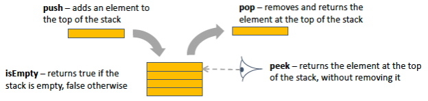

---

- 4 operations on stack

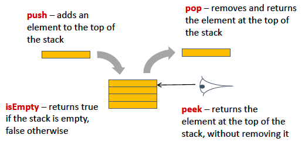

### Stack feature：Last in first out

- A Stack is a <span style="color: red">“Last In First Out” (LIFO) structure</span>.
- Real world examples
    - A stack of plates waiting to be washed
    - A stack of cards in a patience game (see practical instructions).
    - Other Games such as Connect 4, Towers of Hanoi, etc.
    - Many examples in computer science – e.g. stack of method calls.


### Implementing a stack using an Arraylist

```java
public class StringStack {
    private ArrayList<String> list = new ArrayList<String>();
    public void push(String s) {
        list.add(s);
    }
    public String pop() {
        assert list.size() != 0;
        return list.remove(list.size()-1);
    }
    public String peek() {
        assert list.size() != 0;
        return list.get(list.size()-1);
    }
    public boolean isEmpty() {
        return list.isEmpty();
    }
}
```

#### What did we do

- We took an *ArrayList*, which has more than 25 methods, and used it to create a *StringStack*, that can perform only 4.
- Everything we can do with a *StringStack* we can also do with an *ArrayList*.
- There are many things we can do with an *ArrayList* but cannot do with the *StringStack*.
- So what was the point of the stack? Is it wasteful?

#### Why would we do that

- There are many cases in which we want to treat data as being on a stack.
- In these cases there are advantages in hiding all methods except those that treat the data as being on a stack.
    - It makes the program easier to understand, reason about, and modify.
    - It means that we can replace one implementation of a stack with another.

> <span style="background-color: rgb(66, 157, 218)">A better way to describe the procedure of program</span>

## Abstraction

- In computer science <span style="color: red"><i>Abstraction</i></span> is the hiding of irrelevant detail.
- The fact that our *StringStack* uses an *ArrayList* to store data is irrelevant. We do not need to know that the stack is implemented in this way, and we do not want anyone to write code that is dependent on that particular implementation.

> <span style="background-color: rgb(66, 157, 218)">Hiding is better than showing more detail for you to worry about</span>

### Abstract data types

- A stack is an example of an <span style="color: red"><i>Abstract Data Type</i> (ADT)</span>.
- An ADT is defined by a set of operations that can be performed on its data.
- The ADT <span style="color: red">hides all details</span> of how those operations are implemented, and how data are stored.
- The operations that can be performed ADT define an *interface* to the ADT.

## Stack exercise

- If s is an initially empty stack
- state the values of the variables a and b after the following code fragment is run:

```java
s.push("Red");
s.push("Orange");
s.push("Blue");
s.pop();
s.push("Yellow");
s.pop();
String a = s.pop();
s.push("Brown");
s.pop();
String b = s.pop();
```

## Queues

- A queue is an ADT which maintains a list of data
- The methods available allow us to <span style="color: red">add data only to the back of the queue</span>, and to <span style="color: red">remove data only from the front of the queue</span>.
- A queue is <span style="color: red">FIFO (First In First Out)</span> structure

---

- 4 operations on queue

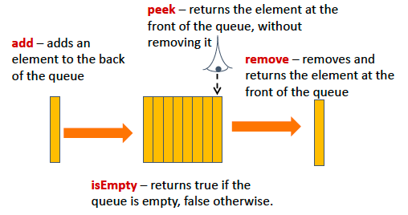

### Implementing a queue using an Arraylist

```java
public class StringQueue {
    private ArrayList<String> list = new ArrayList<String>();
    public void add(String s) {
        list.add(s);
    }
    public String remove() {
        assert list.size() != 0;
        return list.remove(0);
    }
    public String peek() {
        assert list.size() != 0;
        return list.get(0);
    }
    public boolean isEmpty() {
        return list.isEmpty();
    }
}
```

### Queue Exercise

- If the q refers to a queue that is initially empty
- state the values of the variables a and b after the following code fragment is run

```java
q.add("Diamond");
q.add("Tobby");
q.remove();
q.add("Garnet");
q.add("Emeric");
q.remove();
String a = q.remove();
q.add("Sapphire");
String b = q.remove();
```

## Priority queues

- A *priority queue* implements the same methods as an ordinary queue, but it works in <span style="color: red">BIFO (Best In First Out)</span> manner.
- Each element in the queue is allocated a *priority*, and the `remove()` method always removes the element with the highest priority.

---

- For example suppose that a priority queue contains Strings, and that when two Strings are compared the one that is lowest in alphabetical order has highest priority.
- The code

```java
pq.add("Jam");
pq.add("Ham");
pq.add("Spam");
String best = pq.remove();
```

Results in best pointing to the String "Ham".

### Implementing a priority queue

- A simple implementation would use an *ArrayList* and would be like the queue implementation shown earlier except that the add method is implemented as follows:

```java
public void add(String s) {
    int i = 0;
    int size = list.size();
    while (i < size && s.compareTo(list.get(i)) > 0) {
        i++;
    }
    list.add(i, s);
}
```

> - The add method would be O(n)
> 
> - A more efficient implementation uses a data structure known as a *heap* (not the same as *the* heap). The add method is then O(log n)
> 
> - We shall not cover heaps in this module.

## Double-ended queue (DEQUE)

- A <span style="color: red"><i>deque</i> (pronounced “deck”)</span> is like a queue, except that elements can be added or removed from either end.

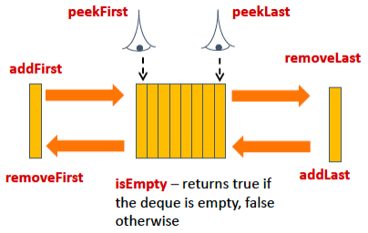

## Stacks and queues in the java collections framework

- The Java collections framework contains an interface `Queue`, which extends the `Collection` interface.
- The `Queue` interface contains the methods that we have already mentioned when describing queues, plus a few others.
- For example in addition to the `remove()` method, there is an `poll()` method. The difference between the two is that, if the queue is empty, `remove()` throws an exception whereas `poll()` returns a `null` value.

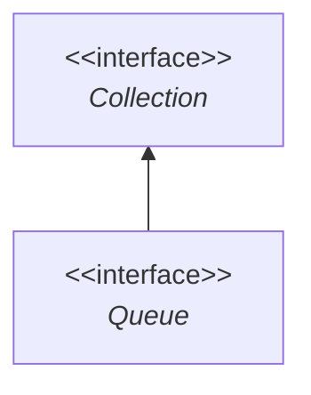

---

- Similarly the `Queue` interface provides `add()` and `offer()` methods, the difference being that `add()` has a `void` return type and throws an exception if the capacity of the queue is exceeded, whereas `offer` returns a Boolean value – false if the capacity was exceeded, and true otherwise.
- The `Queue` interface is implemented by, among others, the `LinkedList` and `ArrayDeque` classes


---

- The Java collections framework does not contain a `Stack` interface. There is a `Stack` class, but its use is not advised. It is better to use the `ArrayDeque` class
- There is a class <span style="color: red"><code>PriorityQueue</code></span> that implements the `Queue` interface and where the `remove()`, `poll()`, and `peek()` methods <span style="color: red">return the highest-priority element</span>.

### Simplified summary of some java collections framework classes

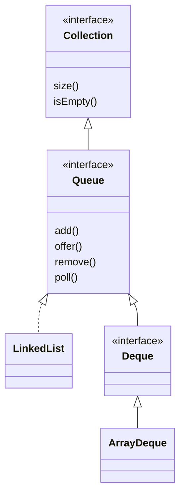

---

```java
public class LinkedList<E> extends AbstractSequentialList<E> implements List<E>, Deque‹E>, Cloneable, Serializable {
    transient int size;
    transient LinkedList.Node<E> first;
    transient LinkedList.Node<E> last;
    private static final long serialVersionUID = 876323262645176354L;
    public LinkedList() {
        this.size = 0;
    }
    public LinkedList(@NotNull @Flow(sourcelsContainer = true, targetsContainer = true) Collection<? extends E> c) {
    this();
    this.addAll(c);
}
```

## Summary

- A *stack* is a LIFO (Last-In, First-Out) structure.
- A *queue* is a FIFO (First-In, First-Out) structure.
- A *priority queue* is BIFO (Best-In, First-Out) structure.
- A *deque* behaves like a queue except that data can be added or removed from either end.
- Abstraction is the deliberate concealment of irrelevant detail.
- An *Abstract Data Type* is defined by the operations that it allows you to perform on its data. The implementation of these methods, and the means by which data are stored, are deliberately concealed.
- The Java collections framework contains classes and interfaces representing stacks, queues, priority queues, and deques.

# Graphs

## Content

- Basic graph definitions
- Implementation of graph data structures
- Traversals and applications

## Graphs: Nodes and Edges

- Network-like data structures can be represented using <span style="color: red"><i>graphs</i></span>.
- A graph consists of a set of <span style="color: red"><i>nodes</i></span> (also known as <span style="color: red"><i>vertices</i></span>) together with a set of <span style="color: red"><i>edges</i></span> (also known as <span style="color: red"><i>arcs</i></span>) connecting them
- Some graphs may have <span style="color: red"><i>loops</i></span> (a <span style="color: red"><i>loop</i></span> is an edge connecting a node to itself)

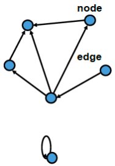

## Graphs: Directed and Undirected

- Graphs can be <span style="color: red"><i>directed</i></span> (e.g. a street map with one way streets)
- or <span style="color: red"><i>undirected</i></span> (e.g. street map where all streets can be traversed in any direction)

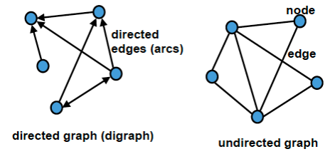

### Example: Chengdu Subway

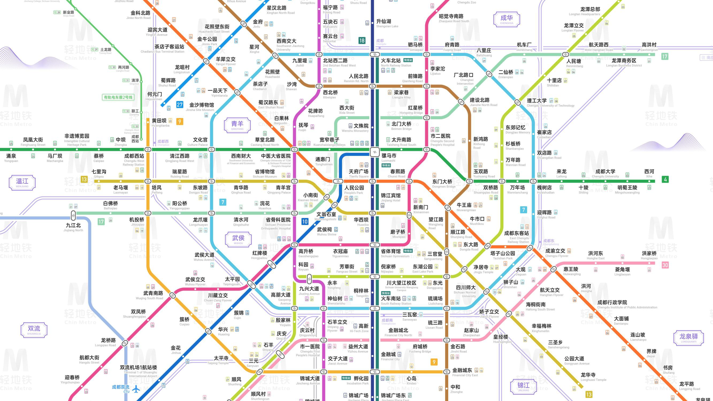

## Graphs: Data Storage

- As well as the nodes and edge structure, graphs typically have additional data stored.
- This data can be at nodes and/or edges,
- For example: in the Chengdu Subway graph:
    - <span style="color: blue">nodes have names of stations</span>
    - <span style="color: blue">edges are labeled with the line(s) between those stations</span>

## Implementing Graphs on a Computer

- There are two common ways of representing graph data:
    - <span style="color: red">adjacency matrices</span>
    - <span style="color: red">adjacency lists</span>

### Adjacency Matrix

- This uses <span style="color: red">a two-dimensional array</span> of booleans(note this is a <span style="color: blue">static</span> data structure)
- The array shows which edges are connected to which other edges.

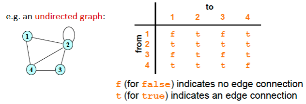

---

- Please draw the adjacency matrix for following graph

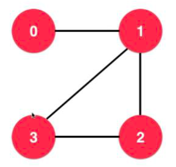

---

<span style="color: red">Directed Graph:</span>

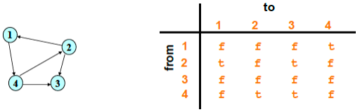

Straightforward to program:

```java
boolean[][] edgeMatrix = new boolean[n][n];
```

An edge exists <span style="color: red">from <code>node i</code> to <code>node j</code></span> when `edgeMatrix[i][j]` is `true`

### Adjacency Matrices

- Access to edge information is fast, due to use of arrays.
- Storage of node data
    - use an additional array of information, one piece of information per node
- Storage of edge data
    - use an additional 2D array of information, one piece of information per edge

#### Adjacency Matrices features

- Space usage:
    - For a graph with $\textcolor{orange}n$ nodes, it can have from $\textcolor{orange}0$ <span style="color: orange">to</span> $\textcolor{orange}{n^2}$ <span style="color: orange">edges</span> (including loops and counting two-way edges twice), so the space taken up in memory to store the graph using an adjacency matrix is the space required to store $\textcolor{orange}{n^2}$ boolean values.
- If a graph is <span style="color: orange"><i>sparse</i></span> (significantly fewer edges than $n^2$), this can be wasteful of space. There is a more efficient way of representing sparse graphs

### Adjacency Lists

- For each node is stored a list of nodes that it connects to (note this is more of a <span style="color: blue">dynamic</span> data structure)

e.g. for a graph with <span style="color: blue">n</span> nodes labeled with integers, could use an array of length <span style="color: blue">n</span>, each pointing to the node's adjacency list

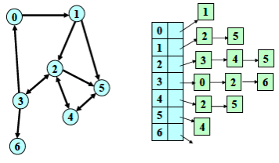

---

- Please draw the adjacency list for following graph


#### Adjacency Lists: integer labels

- e.g. if the nodes are labeled by integers, an adjacency lists structure could be of type

```java
ArrayList<Integer>[]
```

- An edge exists from node `i` to node `j` when `j` is a node in the list `adjacencyLists[i]`

```java
ArrayList<Interger> adjacencyLists[]= new ArrayList[n];
```

#### Adjacency Lists: non-integer labels

- More generally, if there is a type `Node` for the nodes of the graph, an adjacency list structure could be

```java
ArrayList<Node> adjacencyLists = new ArrayList<Node>();
```

- where each `Node` would contain its own adjacency list of type `ArrayList<Node>`.
- In this case, edge exists from node `n` to node `m` when `m` is a node in the adjacency list belonging to node `n`.

---

```java
Class Teacher {
    …………
    public ArrayList<Teacher> adjacencyLists = new ArrayList<Teacher>();
}
…………
Teacher l,j,ja,jak;
l.adjacencyLists.add(j);
```

#### Adjacency Lists features

- Access to edge information is not as fast as an adjacency matrix, because the relevant list has to be traversed.
- However, the amount of memory required to store the adjacency lists can be less, as it is proportional to how many edges are in the graph.

> <span style="background-color: rgb(66, 157, 218)">More edges more space</span>

## Traversals

- A <span style="color: orange"><i>traversal</i></span> is a way of systematically going through all the data in a structure, visiting each piece of data precisely once.
- Traversals can be used for various purposes, including searching.
- Two common types of graph traversal:
    - <span style="color: red">Depth-first traversal</span>
    - <span style="color: red">Breadth-first traversal</span>

<span style="color: blue">3 traversal methods for binary tree</span>

### Depth-First Traversal

- Start at some node S
    - If there is a node that is adjacent to S that you have not yet visited then visit it
    - If there is an unvisited node adjacent to the one you just visited, then visit that.

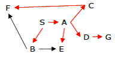

---

- Keep on doing this until you come to a “dead end”, that is to say that you reach a node that either has no adjacent nodes at all, or where all the adjacent nodes have already been visited.
- When you get to a dead end, "<span style="color: red">backtrack</span>" along the path that you just followed until you come to a node that has an unvisited adjacent node, and repeat the process from there.


#### Depth-First Traversal: Another Example

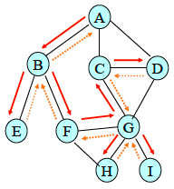

This traversal:  
$\textcolor{orange}{A, B, E, F, G, C, D, H, I}$  
Different depth-first traversals are also possible, for example:  
$\textcolor{orange}{A, B, E, F, G, H, I, C, D}$  

#### Depth-First Traversal: Notes

- DFT can be implemented on directed graphs (in that case, <span style="color: red"><i>the edge directions must be respected</i></span>) or on undirected graphs (every edge goes in both directions)
- DFT can be implemented using recursion, or using a <span style="color: blue"><b>stack of nodes</b></span> (not covered in this lecture)
- In either case, a record needs to be kept of the <span style="color: blue"><b>set of nodes that have been visited</b></span>
    - this set could be represented as an <span style="color: blue">array of booleans</span>, for example, one boolean for each node.

#### Depth-First Traversal pseudocode (recursive version)

```
dft(g,n) {
    visit(n)
    mark n as visited
    for each node x adjacent to n {
        if x is unvisited then
            dft(g,x)
    }
}
```

> <span style="background-color: rgb(66, 157, 218)">Notes:</span>
> 
> - <span style="background-color: rgb(66, 157, 218)">We assume that all nodes are originally marked as unvisited.</span>
> 
> - <span style="background-color: rgb(66, 157, 218)">You don’t need to worry about what the visit method does (if you are worried, imagine that it just prints out the name of the node being visited).</span>

### Breadth-First Traversal

- Start at some point S
- Repeat
    - Visit all the nodes adjacent to S
    - Visit all the nodes adjacent to the ones you just visited (unless you have already visited them)
    - And so on

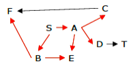

---

Explores nodes in a pattern that "<span style="color: red">radiates out</span>" from the start point.

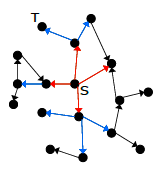

#### Breadth-First Traversal Example

- Starting at the root node, visit all its neighbours before visiting all their neighbours, and so on.

One possible order of nodes visited using this method:  
$\textcolor{orange}{A, B, C, D, E, F, G, H, I}$

> <span style="background-color: rgb(66, 157, 218)">Note: as B was visited before C and D, B’s neighbors need to be visited before those of C and D.</span>

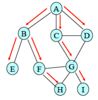

#### Breadth-First Traversal: Notes

- BFT can also be implemented on directed graphs (<span style="color: red"><i>respect the edge directions</i></span>) or on undirected graphs (every edge goes in both directions)
- BFT is usually implemented using a queue of nodes (the queue holds nodes waiting to be visited). The queue is used in the same way the stack is used for DFT. \[Code not covered.\]
- Similarly as for DFT, a record needs to be kept of which nodes have been visited (e.g. in an array of booleans).

### Using BFT/DFT to test connectivity

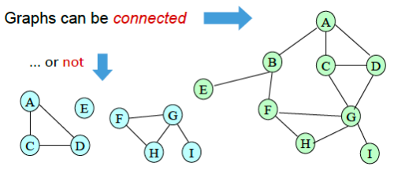

- Informally, an undirected graph is <span style="color: red"><i>connected</i></span> if you can draw it <span style="color: red">ALL without taking your pen off the paper</span> (you may have to retrace some parts of it!)

### Exercise

- To <span style="color: blue">test the connectivity</span> of an <span style="color: red">undirected*</span> graph:

<span style="color: red">Algorithm:</span>  
Start from any node, do a BFT or DFT from that node, and test afterwards whether all the nodes were visited.

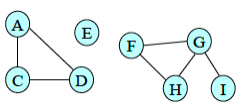

> <span style="background-color: rgb(66, 157, 218)">* It’s more complicated if the graph is directed.</span>

<span style="color: red">Why?</span>

## Checklist

- What you want to be capable of by the end of this week:
    - know basic graph terminology
    - know suitable storage structures for graph data
    - perform both depth-first and breadth-first traversals of graphs
    - describe uses for graphs and traversals
