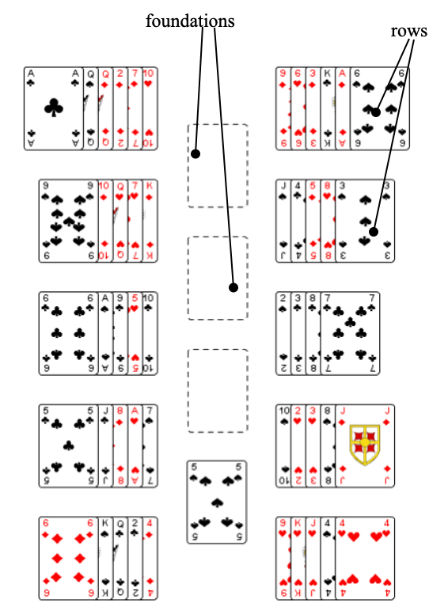
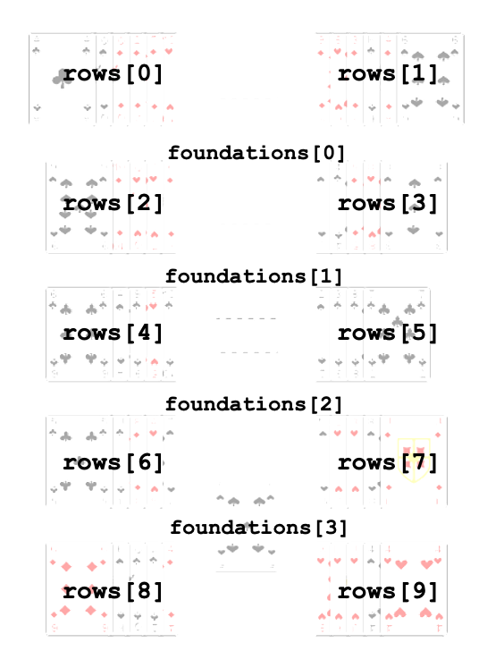
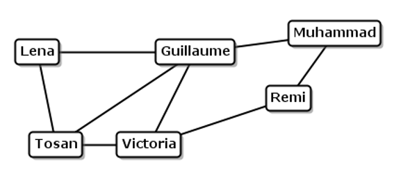

>[!TIP] Warm Tip
> Complete source code zip is provided for download at end of this article.

# Practical: Stacks and Queues

This practical takes a look at  the abstract datatypes stacks and queues. You will also write some code that uses stack and/or queue operations to implement the rules for a Patience game.

## Exercise 1 (for discussion)

Determine which kind of behavior would be displayed by each of the following (stack, queue). Justify your answers.  
a)	Names of tutors at St Custard’s Tutorial College where tutor first to be laid off (made redundant) is a longest-serving tutor.  
b)	Names of employees at Fosdyke’s Mill where employee first to be laid off (made redundant) is most recently taken on.  
c)	letters awaiting sorting in a postal sorting office.  

## Exercise 2 – Fortress Patience

The rules of Fortress Patience are shown on the next page.  
a)	Get familiar with how the game is played - see the rules on the web page, but ask your tutor if anything is unclear.  
b)	Spot which card arrangement(s) might involve a ...stack? ...queue? ...list? ...array?  
For any stack you find, identify the top of the stack.  
For any queue you find, identify the front and back of the queue.  

Check your answers with your practical tutor to see if you’re right, before continuing.

### Fortress Patience Rules Summary

The ranks of the cards “wrap around”: 2, 3, 4, 5, 6, 7, 8, 9, 10, J, Q, K, A, 2, 3, ...
 
Only a card that is uppermost on the end of a row can be moved, and can be moved either to another row or a foundation pile, subject to the following constraints:
 
1. **Any movable card may be moved to an empty foundation pile, provided there is not already a foundation pile for cards of the same suit.**

For example, in this game, the A♣︎ or the 6♣︎ could be moved to an empty foundation pile, but not the 9♠︎, because there is already a foundation for ♠︎s.

2. **A movable card may be moved to a non-empty foundation pile only if it is the same suit as, and one higher in rank than, the card currently on top of the foundation pile.**

For example, in this game, the 6♠︎ could be moved on top of the 5♠︎, but not the 9♠︎ (wrong rank), nor the 6♣︎ (wrong suit).

3. **Any movable card may be moved to an empty row.**

4. **A movable card may be moved to the uppermost end of a non-empty row, only if it is the same color as, and one differing in rank from, the card currently uppermost on the destination row.**

For example, in this game, either the 7♣︎ or the 5♣︎ could be moved on top of the 6♠︎. But neither the A♠︎ nor the 6♣︎ could be moved on top of the 6♠︎ (wrong rank). The 6♦︎ could not be moved on top of the 7♣︎ (wrong color).  
Also, nothing can currently be put on top of the A♣︎ because there isn’t a black 2 or a black K available at the uppermost end of a row.



## Exercise 3 – Set-up

Create a new, empty project. Be careful to untick the box that asks you if you want to create a main class. Download the practical start code from the Students Website and paste it into the /src file of your new project.

You should now have the project ready to go. The files it contains are as follows:

- `Patience.java` – the main file (no need to look at this file)
- **`Card.java` – a class to represent a playing card (look, but don’t alter)**
- **`CardStack.java` – a class representing an arrangement of playing cards with stack-like behavior (look, but don’t alter)**
- **`Rules.java` – where you will write the code for the rules of the game**
- `Controller.java` – the class that draws and controls the visual display (no need to look at this file)
- `GameDisplay.java` – the class that specifies the user interaction with the game and how the stacks are to be displayed
- `StackDisplayInfo.java` – a container class that stores details of how to display the stacks graphically
- `PictureCards.java` – a class that provides drawing methods for J,Q,K cards (no need to look at this file)

Try compiling and running the program – if it asks you to set a main class, just select `Patience` as the main class. The program should compile and run ok, and produce a random layout of cards for the game, but it won’t allow any cards to be moved yet.

## Exercise 4 – Code Inspection

a) Take a look at the `Card` class, see how it represents a card, and see what methods it has. It’s well-commented, so you should be able to understand everything, but ask your practical tutor if there’s anything you’re unclear about.

b) Similarly, take a look at the `CardStack` [^1] class. You should find standard stack methods available.

c) The `Rules` class is where you’re going to be writing code. Part of this class shuffles and deals the cards (this bit is written for you), and you are going to write the code to allow card moves according to the rules of *Fortress Patience*. 

Within the **`Rules`** class, notice the data structures **`foundations`** and **`rows`** used to hold the arrangements of cards. Here’s a diagram to show you which part of the layout of cards corresponds to which bit of these two data structures:



[^1]: We could have used `Stack<Card>` from the Java Collections framework instead, but we’re using this `CardStack` class so you can see how the methods for a stack of cards are implemented.

d) You are going to be implementing the following two methods in the Rules class:

- `moveRowCardToFoundationIfPossible` <br>called every time called the user tries to move the uppermost card of a row to one of the foundation piles
- `moveRowCardToRowIfPossible` <br>called every time the user tries to move the uppermost card of a row to another row 

Look at their descriptions, in particular their **pre**-conditions and **post**-conditions, and check that you are clear about what each method is supposed to do.  
Run the program again, trying to clicking on cards in attempts to move them, and watch what appears in the Output window – you should see it state when it is calling one of these methods. That should help to make it clear when one of these methods is being called.  

## Exercise 5 – Moving cards 

A good place to start is to write code to move the cards, without worrying about whether a move is allowed or not according to the rules of the game. So, for each of the two methods listed above, implement a simple move of the correct card to where the user tried to move it to, ignoring the rules for now.  
Test your code by running the program and checking that the card does move in the right fashion.  
Hint:  
- You’ll have to think how to refer to where the card is going from, and how to refer to where the card is going to.  You’ll also have to think about which operation(s) might be useful for removing a card from where it is currently, and how you can move the card to the correct destination.

## Exercise 6 – Card moves between rows

Now change your code for the `moveRowCardToRowIfPossible` method so that it incorporates the rules for moving the uppermost card of a row onto another row, only moving the card when it’s supposed to move according to the rules of *Fortress Patience*.   
Hints:  
- Make sure you are clear about what the rules say for a card move in between rows. If you are not sure about what the rules say, ask your tutor.
- Try implementing the restriction on card colors first, then worry about their ranks. Look carefully at what the rules say about card rankings!
- You’ll have two cases to deal with: when the destination row is empty, and when there’s one or more cards there already. 
- Note the preconditions for some of the stack methods, and be careful that you don’t call a method with the precondition “The stack is not empty” when the stack is, in fact, empty.  If you do violate the precondition, what happens?
- You may find it helpful to write a method to find out whether the rank of one card is one higher than the rank of another card (remember the “wraparound” rule).
- Try and test whether your method works, by running the program and trying lots of card moves between rows. Be sure to check not only that a card gets moved from the correct row to the correct destination row when it is supposed to be, but also check that when a card is NOT supposed to move, that it does indeed remain unmoved.
- Also test what happens when you try and move a card to an empty row. As you’ve not yet implemented rules for moving of cards to foundation piles, you should be easily able to move all the cards in a row out of the way to empty it and thus test this aspect of your code.

## Exercise 7 – Card moves to foundation piles

Now change your code for the `moveRowCardToFoundationIfPossible` method that moves a card from a row to a foundation pile, and incorporate the rules about *suit*-matching (*not* color-matching this time!) and rank when adding to a non-empty foundation. (For the moment, allow any card to be moved to an empty pile: the restrictions on moving a card to an empty pile are addressed in the exercise below.)  
Hints: see the hints for the previous exercise, and test similarly.

## Exercise 8 – Card moves to foundation piles

Further change your code for the `moveRowCardToFoundationIfPossible` method so that it also incorporates the restriction for moving a card from a row to an empty foundation pile: a card can’t be moved to an empty foundation pile if there is already a foundation pile for that suit.  
Hint:  
- You will need to be creative to think of how you can examine the other foundation piles and figure out whether there is already a foundation pile for the relevant suit.

## Exercise 9 - Enjoy a nice game of Fortress Patience ☺︎

> [!CHECK] Reference Answer
> ```java
> // Rules.java
> /** This method is called when the user tries to move the uppermost
>   * card of the r-th row, to the f-th foundation pile.
>   *
>   * Pre:  0<=r<10    (i.e. the index of the row is within range)
>   *       && 0<=f<4    (i.e. the index of the foundation is within range)
>   *       && !rows[r].isEmpty() (i.e. there is at least one card in the row)
>   *
>   * Post: If the rules permit, the uppermost card of the r-th row
>   *       been moved onto the f-th foundation pile, leaving all other
>   *       cards where they were.
>   *       If the rules do not permit this move, all cards are left
>   *       exactly where they were before.
>   */
>     public void moveRowCardToFoundationIfPossible(int r, int f) {
>         // Pre-conditions guaranteed by caller: r in range, f in range, and rows[r] not empty
>         CardStack source = rows[r];
>         CardStack dest = foundations[f];
>         if (source.isEmpty()) return; // defensive
> 
>         Card top = source.peek();
> 
>         // If destination foundation is empty: any card may be placed
>         // provided there is not already a foundation pile for that suit.
>         if (dest.isEmpty()) {
>             // check other foundations for same suit
>             for (int i = 0; i < foundations.length; i++) {
>                 if (!foundations[i].isEmpty()) {
>                     Card ft = foundations[i].peek();
>                     if (ft.getSuit() == top.getSuit()) {
>                         // there's already a foundation pile for this suit
>                         return;
>                     }
>                 }
>             }
>             dest.push(source.pop());
>             return;
>         }
> 
>         // Otherwise, can place if same suit and rank is one higher than foundation top
>         Card destTop = dest.peek();
>         if ((top.getSuit() == destTop.getSuit())
>             && isOneHigher(top, destTop)) {
>             dest.push(source.pop());
>         }
>     }
> 
> 
> /** This method is called when the user tries to move the uppermost
>   * card of the r1-th row, onto the uppermost end of the r2-th row.
>   *
>   * Pre:  0<=r1<10    (i.e. the index of the source row is within range)
>   *       && 0<=r2<10  (i.e. the index of the destination row is within range)
>   *
>   * Post: If the rules permit, the uppermost card of the r1-th row has
>   *       been moved onto the uppermost end of the r2-th row, leaving all other
>   *       cards where they were.
>   *       If the rules do not permit this move, all cards are left
>   *       exactly where they were before.
>   *
>   */
>     public void moveRowCardToRowIfPossible(int r1, int r2) {
>         // Pre-conditions guaranteed by caller: r1 and r2 are within 0..9
>         CardStack source = rows[r1];
>         CardStack dest = rows[r2];
> 
>         // nothing to do if source empty
>         if (source.isEmpty()) return;
> 
>         Card moving = source.peek();
> 
>         // Case 1: destination empty. In Fortress Patience only a King may be placed
>         if (dest.isEmpty()) {
>             if (moving.getRank() == Card.KING) {
>                 dest.push(source.pop());
>             }
>             return;
>         }
> 
>         // Case 2: destination non-empty. Build down by same color,
>         // and the destination top must differ in rank by exactly 1 (wraparound allowed)
>         Card destTop = dest.peek();
>         // colors must be the same
>         if (!moving.getColour().equals(destTop.getColour())) return;
> 
>         // rank must differ by exactly 1, with wraparound (K<->A)
>         if (isAdjacentRank(moving, destTop)) {
>             dest.push(source.pop());
>         }
>     }
> 
>     /** Returns true if card a's rank is exactly one higher than card b's rank.
>       * Accounts for wraparound: Ace is considered one higher than King.
>       */
>     private boolean isOneHigher(Card a, Card b) {
>         int ra = a.getRank();
>         int rb = b.getRank();
>         if (ra == rb + 1) return true;
>         // wraparound: Ace (1) is one higher than King (13)
>         if ((ra == Card.ACE) && (rb == Card.KING)) return true;
>         return false;
>     }
> 
>     /** Returns true if the ranks of a and b differ by exactly 1, accounting for wraparound.
>       * Examples: (7,6)->true, (5,6)->true, (A,K)->true, (A,2)->true.
>       */
>     private boolean isAdjacentRank(Card a, Card b) {
>         int ra = a.getRank();
>         int rb = b.getRank();
>         if (Math.abs(ra - rb) == 1) return true;
>         // wrap cases: Ace (1) adjacent to King (13)
>         if ((ra == Card.ACE && rb == Card.KING) || (ra == Card.KING && rb == Card.ACE)) return true;
>         return false;
>     }
> ```

# Practical: Friendship Graphs

## Introduction

In this week’s exercise, we will create code to represent graphs that have features resembling those found on social networking sites like Facebook.

This uses the idea of a “friendship graph” to let you explore representing graphs and doing some useful things with graphs. For example, here’s an (undirected) graph depicting friendships between various people:



For simplicity, all people in the example graphs you’ll use will have different names.

## Exercise 1 – Warm-up

As you will shortly be using adjacency matrices, remind yourself of the concept by stating the adjacency matrix for the above graph:

<table>
    <tr>
        <td></td>
        <td>Guillaume</td>
        <td>Lena</td>
        <td>Muhammad</td>
        <td>Remi</td>
        <td>Tosan</td>
        <td>Victoria</td>
    </tr>
    <tr>
        <td>Guillaume</td>
        <td>F</td>
        <td>T</td>
        <td></td>
        <td></td>
        <td></td>
        <td></td>
    </tr>
    <tr>
        <td>Lena</td>
        <td></td>
        <td></td>
        <td></td>
        <td></td>
        <td></td>
        <td></td>
    </tr>
    <tr>
        <td>Muhammad</td>
        <td></td>
        <td></td>
        <td></td>
        <td></td>
        <td></td>
        <td></td>
    </tr>
    <tr>
        <td>Remi</td>
        <td></td>
        <td></td>
        <td></td>
        <td></td>
        <td></td>
        <td></td>
    </tr>
    <tr>
        <td>Tosan</td>
        <td></td>
        <td></td>
        <td></td>
        <td></td>
        <td></td>
        <td></td>
    </tr>
    <tr>
        <td>Victoria</td>
        <td></td>
        <td></td>
        <td></td>
        <td></td>
        <td></td>
        <td></td>
    </tr>
</table>

## Exercise 2 – Project set-up

Set yourself up a project from the existing sources supplied on the Students Website, in the usual way. 

You’ve been supplied with four code files:

- **`NotFacebook.java`** – the main program where you’ll write code to call various methods on sample graphs
- **`FriendsGraph.java`** – a class for representing (undirected) graphs where the nodes are people and the edges are friendships between people. 
- `Node.java` – a small container class for representing a node of the graph (which you do not need to alter)
- `GraphUtilities.java` – a class for reading in graphs from files and drawing them on the screen (you don’t need to alter the code in this file).

Run the program (the **`main`** method is in the **`NotFacebook`** class), to check that the project is set up ok. You’ll be asked to select a file containing a description of a graph.  
You have been supplied with three sample graphs, in files `graph1.txt`, `graph2.txt`  and `graph3.txt`, so choose one of those. You should find that the nodes of the graph above are displayed, but none of the edges!  
Note: for the following exercises, do not change the data structures supplied; use the ones provided for you in the code you’ve been given.  

## Exercise 3 – Adding Edges

Getting the edges to appear requires two steps:

1. First, implement the private **`addEdge(int node1, int node2)`** method of the `FriendsGraph` class (the empty body of the method is supplied for you already). <br>To do this, you’ll need to look carefully through the `FriendsGraph` class and see how the nodes and edges are stored using an adjacency matrix, and how the other addEdge method of the `FriendsGraph` class works. You may need to also look up and remind yourself of how two-dimensional arrays are declared and used in Java: as you will see, the adjacency matrix is a two-dimensional array.

> [!CHECK] Reference Answer
> ```java
> // FriendsGraph.java
> private void addEdge(int node1, int node2) {
>     // simple bounds check to help catch incorrect usage
>     if (node1 < 0 || node1 >= size || node2 < 0 || node2 >= size) {
>         throw new IndexOutOfBoundsException("Node index out of bounds: " + node1 + " -> " + node2);
>     }
>     adjacencyMatrix[node1][node2] = true;
> }
> ```

2. To make the edges appear, also implement the following method of the `FriendsGraph` class:

```java
/** Returns true if there is an edge from the first node to the second.
  *
  * @pre           0 < node1, node2 < size
  * @param node1   the source node of the queried edge
  * @param node2   the target node of the queried edge
  * @return        true iff there is an edge node1 -> node2
  */
public boolean edgeFrom(int node1, int node2)
```

> [!CHECK] Reference Answer
> ```java
> // FriendsGraph.java
> public boolean edgeFrom(int node1, int node2) {
>     // simple bounds check to help catch incorrect usage
>     if (node1 < 0 || node1 >= size || node2 < 0 || node2 >= size) {
>         throw new IndexOutOfBoundsException("Node index out of bounds: " + node1 + " -> " + node2);
>     }
>     return adjacencyMatrix[node1][node2];
> }
> ```

Check that your methods work ok by viewing all three sample graphs.

## Exercise 4 – Finding the index of a node

Add to the `FriendshipGraph` class a method with the following signature and specification. 

```java
/**
 * Get the index of a node
 * @param name name of a person in the graph
 * @return the index of the node that represents the named
 * person, if they are in the graph, otherwise -1
 */
public int getNodeIndex(String name)
```

> [!CHECK] Reference Answer
> ```java
> // FriendshipGraph.java
> public int getNodeIndex(String name) {
>     Integer idx = nodeMap.get(name);
>     return (idx == null) ? -1 : idx;
> }
> ```

Note that you can make use of the `nodeMap` field.

## Exercise 5 – Friendship Testing

Add to the FriendGraph class a method with the following signature and specification. 

```java
/** Returns true precisely when the two people are in 
  * the graph and are listed as friends.
  * @pre             true
  * @param person1   the first person
  * @param person2   the second person
  * @return          true if these two people are friends    
  *                  in the graph
  */
public boolean areFriends(String person1, String person2)
```

1. Now test your method by writing several tests in the main method of the NotFacebook class, like this:

```java
if (g.areFriends("Remi","Victoria"))
    System.out.println("Remi and Victoria are friends.");
else
    System.out.println("Remi and Victoria are not friends.");
```

Please note that these tests are best placed *before* the line

```java
        GraphUtilities.showGraph(g);
```

so that the results of your tests will be visible at the same time as the graph pop-up window.

> [!CHECK] Reference Answer
> ```java
> // FriendGraph.java
> public boolean areFriends(String person1, String person2) {
>     int idx1 = getNodeIndex(person1);
>     int idx2 = getNodeIndex(person2);
>     if (idx1 == -1 || idx2 == -1) return false;
>     return edgeFrom(idx1, idx2);
> }
> ```

## Exercise 6 - Depth-First Traversal

Create a new class `GeneralUtilities`, and add a method, with the following signature

```java
/**
 * Perform a depth first traversal of a graph, printing out the        
  * name of each node visited
  * @param g Graph to be traversed
  * @param startName Name of the first person to be printed out
 */
public static void depthFirstTraversal(FriendsGraph g, String startName)
```

that uses a ***recursive*** algorithm to traverse the graph in a depth-first way, printing out all the names of the people found in the graph. (Using `System.out.println` statements to do this is fine). An easy way to do that would be to use a modified version of the dft algorithm described in the lecture slides, with the following signature

```java
private static void dft(FriendsGraph g, int i, Set<Integer> visited)
```

The parameter `i` is the index of a node in the graph, and the Set `visited` is used to keep track of which nodes have been visited. You can then implement the depthFirstTraversal method by simply calling the dft method with argument i set to be the index of the node with the specified name, and visited to an empty HashSet.

Modify the `NotFaceBook` class so that it calls this method immediately before the line `GraphUtilities.showGraph(g);`

**N.B. we want a recursive solution to this problem.**

**Also N.B.** You should ***not*** implement these methods in the `FriendsGraph` class.

> [!CHECK] Reference Answer
> ```java
> // GeneralUtilities.java
> public static void depthFirstTraversal(FriendsGraph g, String startName) {
>     if (g == null) return;
>     int startIdx = g.getNodeIndex(startName);
>     if (startIdx == -1) {
>         System.out.println("depthFirstTraversal: start node '" + startName + "' not found in graph.");
>         return;
>     }
>     Set<Integer> visited = new HashSet<Integer>();
>     dft(g, startIdx, visited);
> }
> private static void dft(FriendsGraph g, int i, Set<Integer> visited) {
>     System.out.println(g.getNode(i).getName());
>     visited.add(i);
>     for (int j : g.getAdjacentNodes(i)) {
>         if (!visited.contains(j)) {
>             dft(g, j, visited);
>         }
>     }
> }
> ```

## Optional Exercise 7 – Mutual Friends  *(more challenging!)*

Within the `GeneralUtilities` class **create** a method specified as follows:

```java
/**
 * Returns a list of mutual friends of two people in a graph
 *
 * @param g The graph
 * @param person1 Name of first person
 * @param person2 Name of second person
 * @return a list of names of the mutual friends of the two  
 * people, empty if one person is not in the graph or they have 
 * no mutual friends
 *
 */
public static List<String> mutualFriends(FriendsGraph g, String person1, String person2
```

Mutual friends are people who are friends of both the given people. For example, in the graph on page 1, Lena and Victoria are the mutual friends of Guillaume and Tosan.  
Include a few tests in the main method of the `NotFacebook` class to print out various lists of mutual friends for various people in (and not in) the graphs, and include a comment containing a copy-and-paste of your output from running the program, noting which graph it was that you were using. 

> [!CHECK] Reference Answer
> ```java
> // GeneralUtilities.java
> public static List<String> mutualFriends(FriendsGraph g, String person1, String person2) {
>     List<String> result = new ArrayList<String>();
>     if (g == null) return result;
>     int idx1 = g.getNodeIndex(person1);
>     int idx2 = g.getNodeIndex(person2);
>     if (idx1 == -1 || idx2 == -1) return result;
> 
>     // iterate over neighbors of idx1 and check if also neighbor of idx2
>     for (int neigh : g.getAdjacentNodes(idx1)) {
>         if (g.edgeFrom(idx2, neigh)) {
>             result.add(g.getNode(neigh).getName());
>         }
>     }
>     return result;
> }
> ```

# Complete Source Code Download

> [!EXAMPLE] Zip List
> - [stacks-and-queues.zip](https://gitee.com/anka_luotianyi/obu-level5-semester2-assets/releases/download/dsa-week8/stacks-and-queues.zip)
> - [graphs.zip](https://gitee.com/anka_luotianyi/obu-level5-semester2-assets/releases/download/dsa-week8/graphs.zip)
