# Pathfinding

## Content

- Finding the shortest path between two nodes in a graph
- Dijkstra's algorithm
- The A\* ("A-star") algorithm
- Priority Queues
- Problems we can solve using path-finding algorithms

## What is graph

- Nodes(vertices)
- Edges(arcs)
- Directed or undirected graph

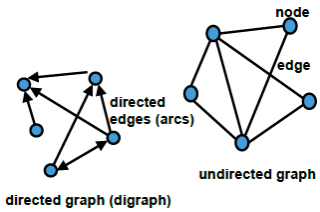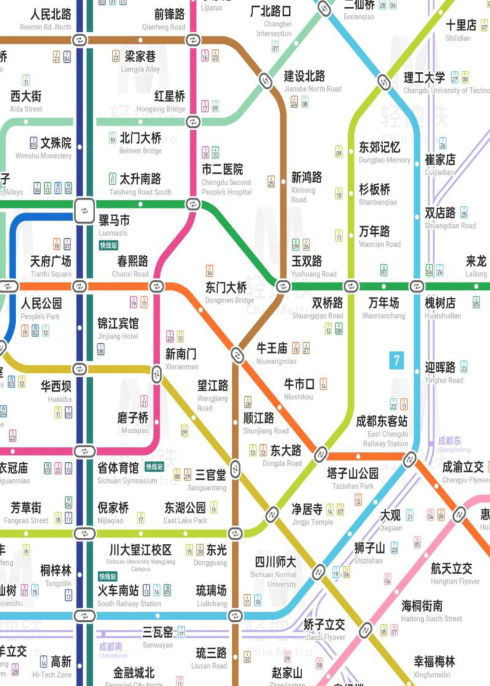

## Path finding

- Suppose that I want to get from one subway station to another by the <span style="color: red">quickest route</span>.
- Suppose that I want to get from one country to another country by the <span style="color: red">cheapest way</span>.

> <span style="background-color: rgb(66, 157, 218)">What should we do for these two questions?</span>

---

- The solution for <span style="color: red">finding the quickest route</span> is:
    1. Represent the subway as a graph, with stations as nodes.
    2. Label each edge of the graph with its "cost"-the time it would take to traverse that edge.
    3. The time taken to traverse any path is then the sum of the costs of the edges you move through.
    4. So all we have to do is find the path with the shortest total cost.

---

- How to implement the solution we mentioned above?
    - <span style="color: red">Dijkstra’s algorithm</span>
    - <span style="color: red">The A* (“A-star”) algorithm</span>

## Dijkstra’s algorithm

- Calculates shortest path between two nodes, which we shall call <span style="color: red"><i>Start</i></span> and <span style="color: red"><i>End</i></span>.
- Assumes that there are <span style="color: red">no negative edge costs</span>.
- Works on <span style="color: red">both directed and undirected graphs</span>.

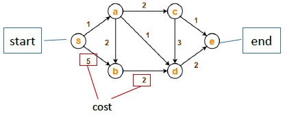

---

- If nodes represent subway stations, the cost could represent

A. the line length between stations.  
B. the fee we spend from one station to another  
C. the time we spend from one station to another  
D. all of above  

> <span style="background-color: rgb(66, 157, 218)"><span style="color: red">Summary: </span><br>Cost could be any meaningful thing to edges</span>

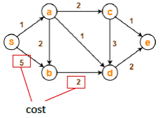

---

- Makes use of two sets of nodes:
    - <span style="color: red"><i>Closed</i></span> - If a node N is in this set then we have already calculated the shortest path from *Start* to N.
    - <span style="color: red"><i>Open</i></span> - If a node N is in this set then we may have considered a path from *Start* to N but we don’t yet know whether it is the shortest path.

---

- For each node we maintain two extra pieces of information:
    - The <span style="color: red"><i>g-value</i> of a node</span>. ----This is the total cost of the best path that we have found (so far) from *Start* to this node.
    - A <span style="color: red">"back" pointer</span> to the *previous* node on that path.
- The <span style="color: red"><i>Open</i> set behaves as a priority queue</span>, in which the node with the lowest g-value has the highest priority.

> <span style="color: blue">What is the feature of the PQ?</span>

---

- Dijkstra’s algorithm only works on undirected graph, yes or no?
- The node with the lowest g-value has the highest priority, yes or no?
- Dijkstra’s algorithm is used for?

---

- Are there negative edge costs for Dijkstra’s algorithm?
- Does the Closed Set contain all of the calculated nodes?
- Does the Closed Set contain the visited nodes?
- What does the edge‘s cost represent?

---

```
set Closed to be empty
add all nodes in the graph to Open.
set the g-value of Start to 0, and the g-value of all the other nodes to ∞
set previous to be none for all nodes.
while End is not in Closed do
    let X be the node in Open that has the lowest g-value (highest priority)
    remove X from Open and add it to Closed.
    if X is not equal to End then
        for each node N that is adjacent to X in the graph, and also in Open do
            let g’ = g-value of X + cost of edge from X to N
            if g’ is less than the current g-value of N then
                change the g-value of N to g’
                make N’s previous pointer point to X
            endif
        endfor
    endif
endwhile
```

> <span style="background-color: rgb(66, 157, 218)">reconstruct the shortest path from <i>Start</i> to <i>End</i> by following "<i>previous</i>" pointers to find the <i>previous</i> node to <i>End</i>, the <i>previous</i> node to that <i>previous</i> node, and so on.</span>

### Example: find a path from A to B

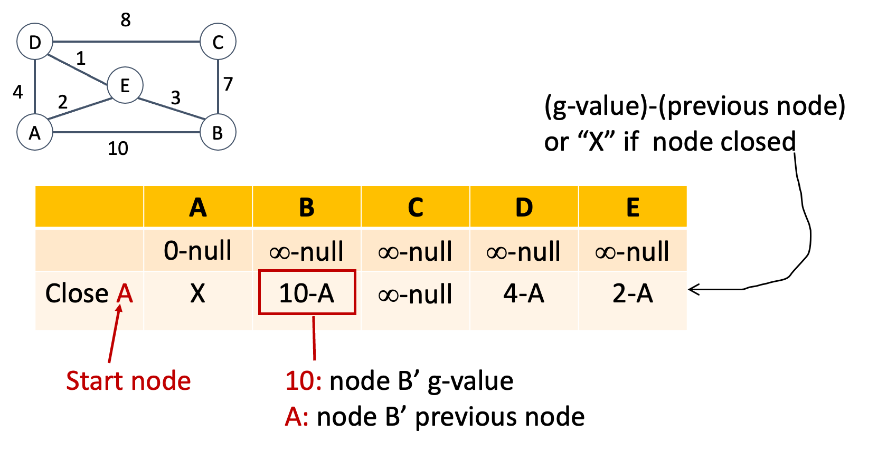
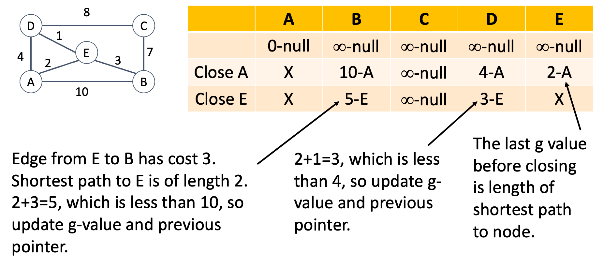
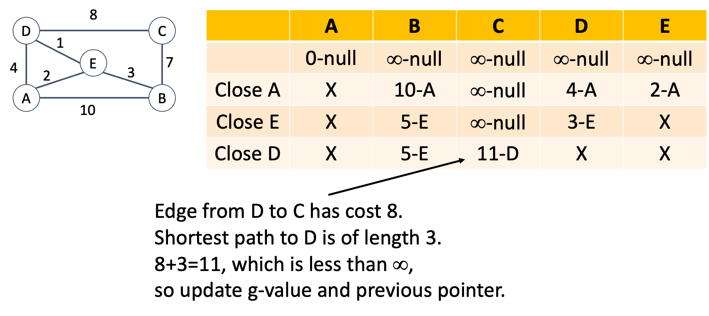
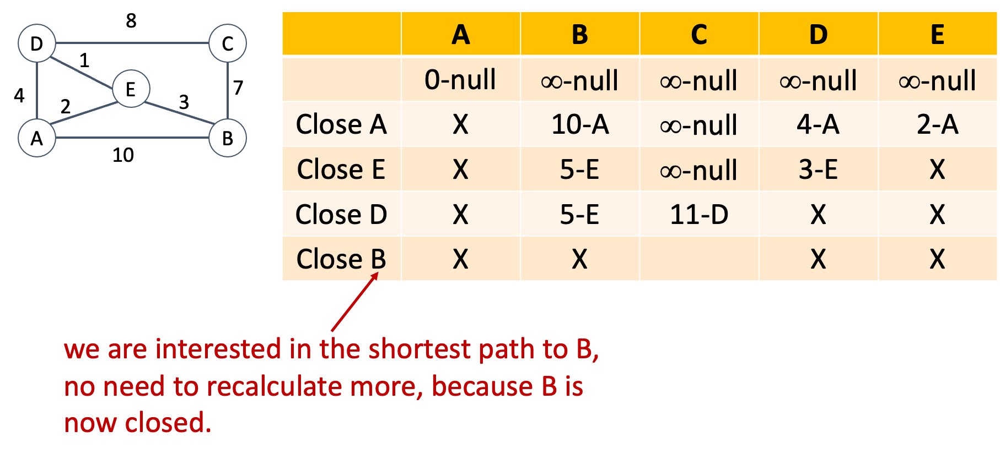
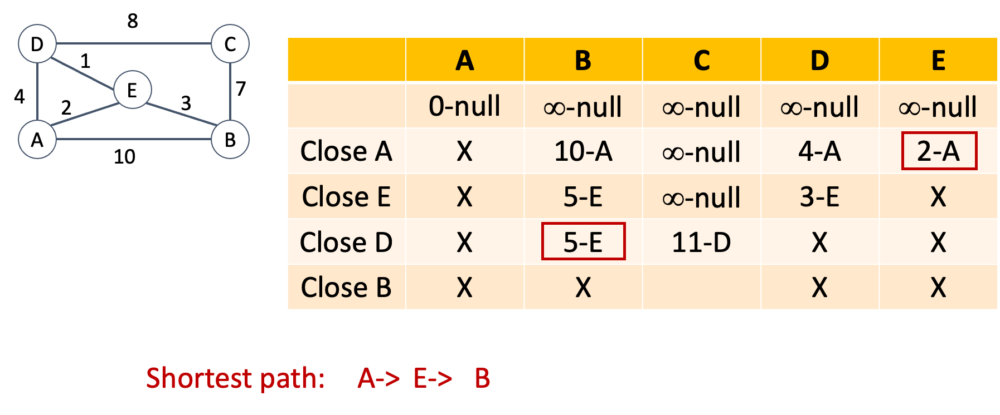

### Example: find a path from A to C

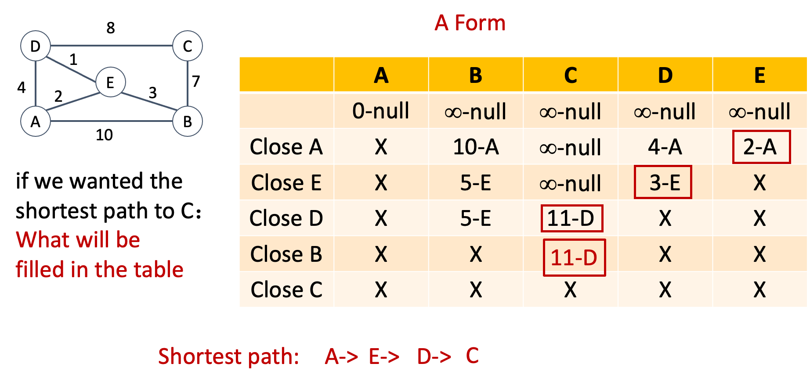

### Example: another form

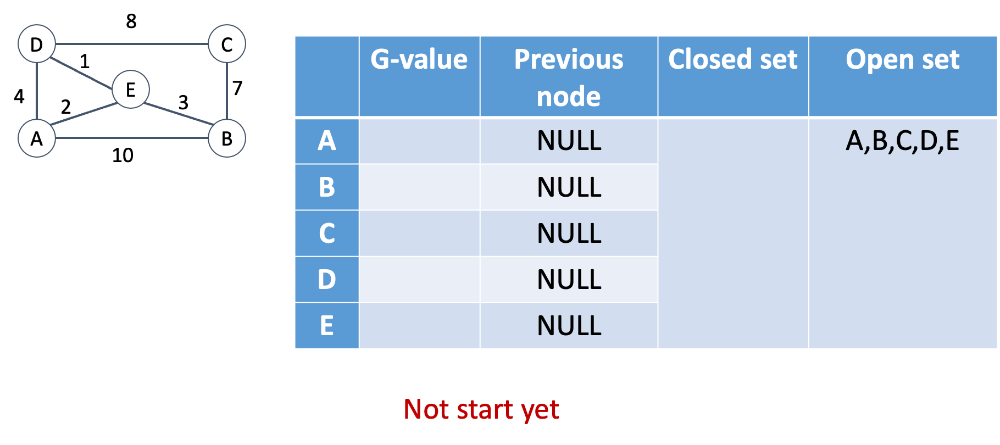
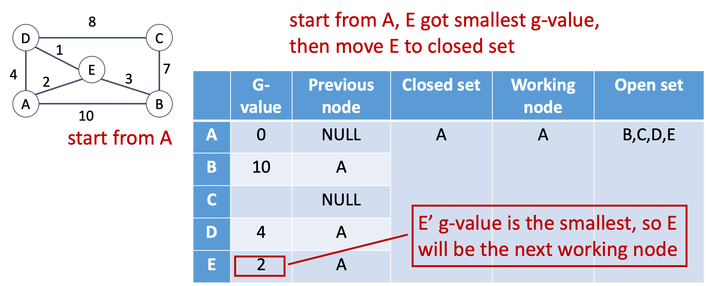
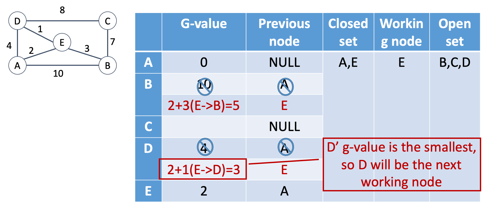
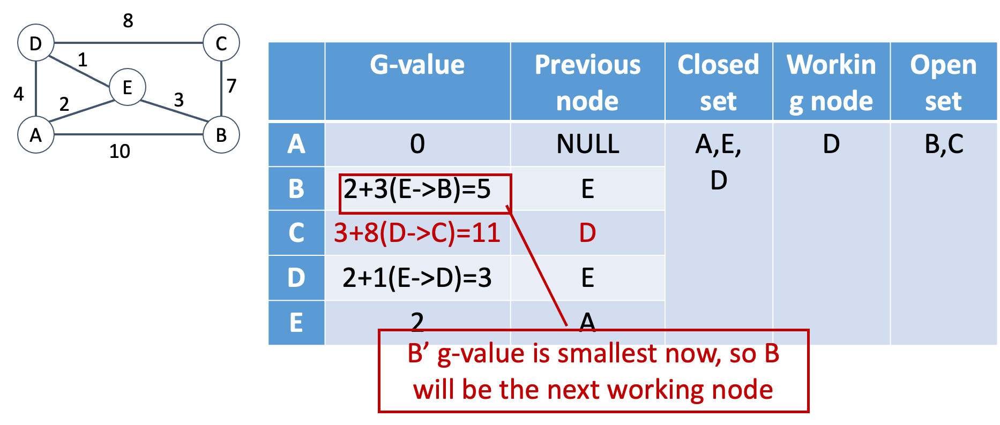
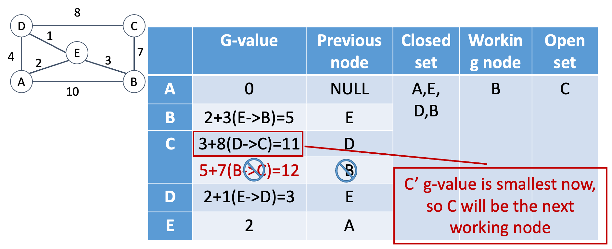
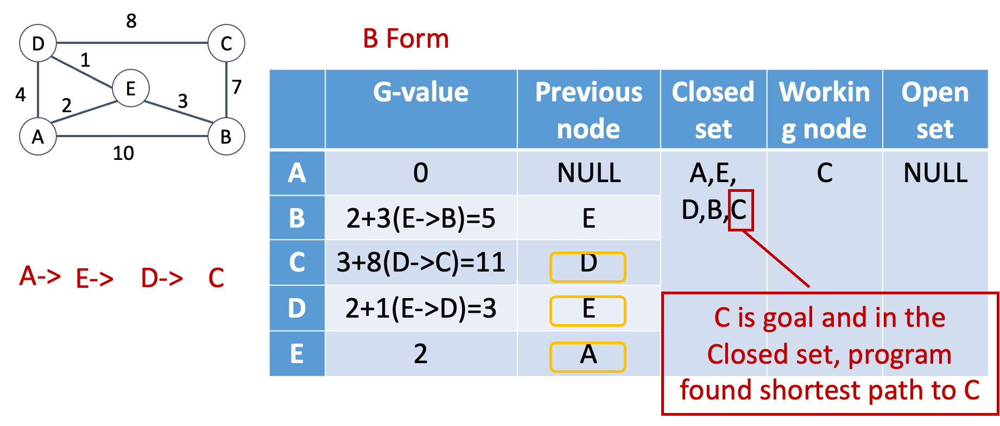

## Dijkstra’s algorithm

- Are there negative edge costs for Dijkstra’s algorithm?
    - No. Dijkstra’s algorithm **only works with non-negative edge costs/weights**. It cannot process negative edge costs, as its greedy selection of the shortest path node fails when negative edges exist (a later path could become shorter, but the algorithm never revisits finalized nodes).
- The node with the lowest g-value has the highest priority, yes or no?
    - Yes. Dijkstra’s uses a min-priority queue that always prioritizes and expands the unvisited node with the **smallest current g-value** (the known shortest path cost from the start node).
- What does the edge‘s cost represent?
    - An edge’s cost is a **quantitative weight** that represents the expense to traverse between two connected nodes. It can stand for physical distance, travel time, fuel cost, energy consumption, network latency, number of steps, or any measurable effort/loss between two vertices in a graph.

<center style="color: red">Measurable quantity for relationship</center>

---

- Thinking question:
    - The disadvantages of Dijkstra’s algorithm?
        1. **Cannot handle negative edge weights**<br>It relies on a greedy strategy: once a node is marked as visited/finalized, its shortest path is never updated again. Negative edge weights can create shorter alternative paths to already finalized nodes, making the algorithm give incorrect results. It also **cannot detect negative cycles**.
        2. **Only single-source shortest path**<br>It only calculates the shortest path from **one starting node** to all other nodes. To get all-pairs shortest paths, you must run the algorithm repeatedly for every vertex, which is inefficient.
        3. **Inefficient for large sparse graphs (naive implementation)**<br>The basic adjacency-matrix version runs in $O(V^2)$ time, which is slow for graphs with many vertices. Even with a binary priority queue, it is $O(E \log V)$, which is less optimal for very large-scale graphs compared to other specialized algorithms.
        4. **Greedy limitation**<br>It makes locally optimal choices at each step, which do not always lead to the global optimum if graph conditions change (only works reliably with fixed, non-negative edge costs).
        5. **Not suitable for dynamic graphs**<br>It cannot easily adapt to graphs where edge weights change dynamically; it requires re-running the whole algorithm from scratch.

### Prove dijkstra’s algorithm works?

- It is relatively simple to prove that Dijkstra’s algorithm does indeed calculate the shortest path between two nodes. The thing we have to demonstrate is that a node does not get added to the closed set until its g-value is equal to the length of the shortest path from the Start node to the node in question.
- Unfortunately the proof is slightly beyond the scope of this lecture, but watch how nodes get added to the closed set in the examples that follow, and try to see if you can convince yourself that they are not added until we have calculated the shortest path to them.

### Exercise 1

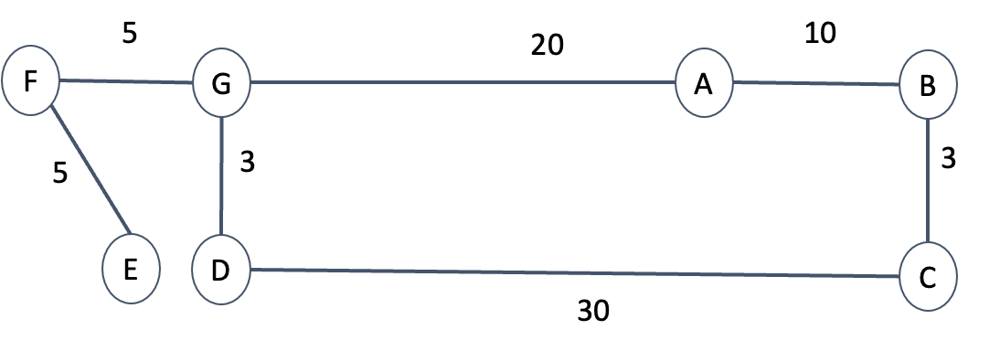

- Using a similar notation to that in the previous example, show the sequence of steps  by which Dijkstra’s algorithm would calculate the <span style="color: red">shortest path from A to E</span>.
- State which nodes get closed, and in what order.

<table style="border-collapse: collapse; width: 100%; text-align: center; color: black">
  <thead>
    <tr>
      <th style="background-color: #f7c340; border: 1px solid #ddd; padding: 12px;"></th>
      <th style="background-color: #f7c340; border: 1px solid #ddd; padding: 12px; color: black">A</th>
      <th style="background-color: #f7c340; border: 1px solid #ddd; padding: 12px; color: black">B</th>
      <th style="background-color: #f7c340; border: 1px solid #ddd; padding: 12px; color: black">C</th>
      <th style="background-color: #f7c340; border: 1px solid #ddd; padding: 12px; color: black">D</th>
      <th style="background-color: #f7c340; border: 1px solid #ddd; padding: 12px; color: black">E</th>
      <th style="background-color: #f7c340; border: 1px solid #ddd; padding: 12px; color: black">F</th>
      <th style="background-color: #f7c340; border: 1px solid #ddd; padding: 12px; color: black">G</th>
    </tr>
  </thead>
  <tbody>
    <tr style="background-color: #f9e9cc;">
      <td style="border: 1px solid #ddd; padding: 12px;"></td>
      <td style="border: 1px solid #ddd; padding: 12px;">0-null</td>
      <td style="border: 1px solid #ddd; padding: 12px;">∞-null</td>
      <td style="border: 1px solid #ddd; padding: 12px;">∞-null</td>
      <td style="border: 1px solid #ddd; padding: 12px;">∞-null</td>
      <td style="border: 1px solid #ddd; padding: 12px;">∞-null</td>
      <td style="border: 1px solid #ddd; padding: 12px;">∞-null</td>
      <td style="border: 1px solid #ddd; padding: 12px;">∞-null</td>
    </tr>
    <tr style="background-color: #f9e9cc;">
      <td style="border: 1px solid #ddd; padding: 12px;">Close A</td>
      <td style="border: 1px solid #ddd; padding: 12px;">×</td>
      <td style="border: 1px solid #ddd; padding: 12px;">10-A</td>
      <td style="border: 1px solid #ddd; padding: 12px;">∞-null</td>
      <td style="border: 1px solid #ddd; padding: 12px;">∞-null</td>
      <td style="border: 1px solid #ddd; padding: 12px;">∞-null</td>
      <td style="border: 1px solid #ddd; padding: 12px;">∞-null</td>
      <td style="border: 2px solid red; padding: 12px;">20-A</td>
    </tr>
    <tr style="background-color: #f9e9cc;">
      <td style="border: 1px solid #ddd; padding: 12px;">Close B</td>
      <td style="border: 1px solid #ddd; padding: 12px;">×</td>
      <td style="border: 1px solid #ddd; padding: 12px;">×</td>
      <td style="border: 1px solid #ddd; padding: 12px;">13-B</td>
      <td style="border: 1px solid #ddd; padding: 12px;">∞-null</td>
      <td style="border: 1px solid #ddd; padding: 12px;">∞-null</td>
      <td style="border: 1px solid #ddd; padding: 12px;">∞-null</td>
      <td style="border: 1px solid #ddd; padding: 12px;">20-A</td>
    </tr>
    <tr style="background-color: #f9e9cc;">
      <td style="border: 1px solid #ddd; padding: 12px;">Close C</td>
      <td style="border: 1px solid #ddd; padding: 12px;">×</td>
      <td style="border: 1px solid #ddd; padding: 12px;">×</td>
      <td style="border: 1px solid #ddd; padding: 12px;">×</td>
      <td style="border: 1px solid #ddd; padding: 12px;">43-C</td>
      <td style="border: 1px solid #ddd; padding: 12px;">∞-null</td>
      <td style="border: 1px solid #ddd; padding: 12px;">∞-null</td>
      <td style="border: 1px solid #ddd; padding: 12px;">20-A</td>
    </tr>
    <tr style="background-color: #f9e9cc;">
      <td style="border: 1px solid #ddd; padding: 12px;">Close G</td>
      <td style="border: 1px solid #ddd; padding: 12px;">×</td>
      <td style="border: 1px solid #ddd; padding: 12px;">×</td>
      <td style="border: 1px solid #ddd; padding: 12px;">×</td>
      <td style="border: 1px solid #ddd; padding: 12px;">23-G</td>
      <td style="border: 1px solid #ddd; padding: 12px;">∞-null</td>
      <td style="border: 2px solid red; padding: 12px;">25-G</td>
      <td style="border: 1px solid #ddd; padding: 12px;">×</td>
    </tr>
    <tr style="background-color: #f9e9cc;">
      <td style="border: 1px solid #ddd; padding: 12px;">Close D</td>
      <td style="border: 1px solid #ddd; padding: 12px;">×</td>
      <td style="border: 1px solid #ddd; padding: 12px;">×</td>
      <td style="border: 1px solid #ddd; padding: 12px;">×</td>
      <td style="border: 1px solid #ddd; padding: 12px;">×</td>
      <td style="border: 1px solid #ddd; padding: 12px;">∞-null</td>
      <td style="border: 1px solid #ddd; padding: 12px;">25-G</td>
      <td style="border: 1px solid #ddd; padding: 12px;">×</td>
    </tr>
    <tr style="background-color: #f9e9cc;">
      <td style="border: 1px solid #ddd; padding: 12px;">Close F</td>
      <td style="border: 1px solid #ddd; padding: 12px;">×</td>
      <td style="border: 1px solid #ddd; padding: 12px;">×</td>
      <td style="border: 1px solid #ddd; padding: 12px;">×</td>
      <td style="border: 1px solid #ddd; padding: 12px;">×</td>
      <td style="border: 2px solid red; padding: 12px;">30-F</td>
      <td style="border: 1px solid #ddd; padding: 12px;">×</td>
      <td style="border: 1px solid #ddd; padding: 12px;">×</td>
    </tr>
    <tr style="background-color: #f9e9cc;">
      <td style="border: 1px solid #ddd; padding: 12px;">Close E</td>
      <td style="border: 1px solid #ddd; padding: 12px;">×</td>
      <td style="border: 1px solid #ddd; padding: 12px;">×</td>
      <td style="border: 1px solid #ddd; padding: 12px;">×</td>
      <td style="border: 1px solid #ddd; padding: 12px;">×</td>
      <td style="border: 1px solid #ddd; padding: 12px;">×</td>
      <td style="border: 1px solid #ddd; padding: 12px;">×</td>
      <td style="border: 1px solid #ddd; padding: 12px;">×</td>
    </tr>
  </tbody>
</table>

## Are we nearly there yet? <br>Heuristically informed search

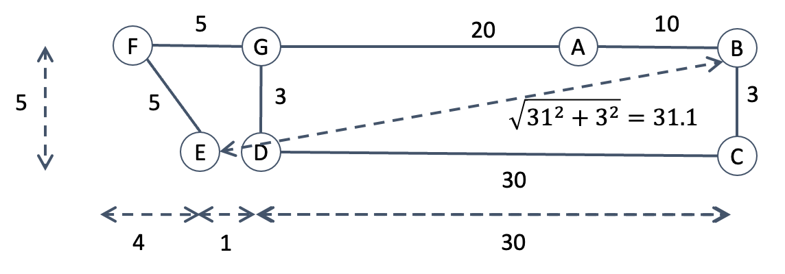

- Suppose that the graph for Exercise 1 had been drawn to scale, and that we knew the co-ordinates of each point. For example G might be at (0,0), A at (20,0), D at (0,3), and so on.
- This means that we can calculate the straight line distance between any two points using Pythagoras’ theorem（毕达哥拉斯定理，勾股定理）
- We know that the length of the shortest path between two points must be greater than or equal to the length of the straight line that connects them. We can therefore use the straight line distance as a <span style="color: red"><i>heuristic</i></span>, that is to say a rough and ready measure of how long a path between two points <span style="color: red">is likely to be</span>.
- Using our heuristic, we can see that this wasn’t so smart! Although we can get from A to B at a cost of only 10 units, it is going to cost us at least another 31.1 units to get all the way from B to E. It might be more sensible to look at paths leading off from G.
- When we used Dijkstra’s algorithm to find the shortest path, we calculated g‑values for G and B, and then added B to the closed set, because its g‑value was the lower. After that we calculated a g‑value for C.
- Using our heuristic, we can see that this wasn’t so smart! Although we can get from A to B at a cost of only 10 units, it is going to cost us at least another 31.1 units to get all the way from B to E. It might be more sensible to look at paths leading off from G.

## The A\* algorithm

- The A\* (“A-star”) algorithm makes use of an *admissible* heuristic to aid the search for a path between two points. It was invented in 1968 at Stanford International for use in *Shakey* the robot.
- The heuristic doesn’t have to be the straight-line distance, but it does have to be *admissible*.
- Also we can’t have negative edge.
- For each node we calculate an <span style="color: red"><i>f-value</i></span> which is equal to the <span style="color: red">g-value plus the heuristic value for that node</span>.
- There are different variants of the A* algorithm, and different ways of describing each variant. Since we have already met Dijkstra’s algorithm, we shall present A* as a modification of Dijkstra. 
- The *Open* set still behaves as a priority queue, but priority is determined <span style="color: red">using <i>f-values</i> rather than <i>g-values</i></span>. 
- In other words when we choose a node to add to the *Closed* set, we pick the one with the lowest *f-value*, rather than the lowest *g-value*.

### A\* algorithm (our version)

```
set Closed to be empty
add all nodes in the graph to Open.
set the g-value of Start to 0, and the g-value of all the other nodes to ∞
set previous to be none for all nodes.
    while End is not in Closed do
    let X be the node in Open  that has the lowest f-value (highest priority) 
    (f-value is g-value + the heuristic value for that node)
    remove X from Open and add it to Closed.
    if X is not equal to End then
		for each node N that is adjacent to X in the graph, and also in Open do
			let g’  = g-value of X + cost of edge from X to N
			if g’ is less than the current g-value of N then 
				change the g-value of N to g’ 
				make its previous pointer point to X
			endif
		endfor
	endif
endwhile
```

### A\* path from A to E

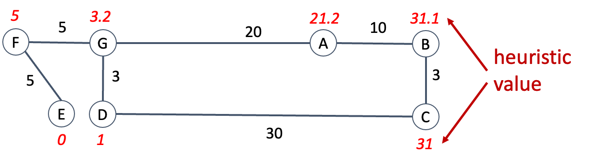

- The numbers in italics by each node represent heuristic estimates of the distance between that node and the target node E (in this case they are straight line distances calculated on the assumption that the graph is drawn to scale, but we could use other admissible heuristics).
- Let us see how A\* would calculate the shortest path from A to E

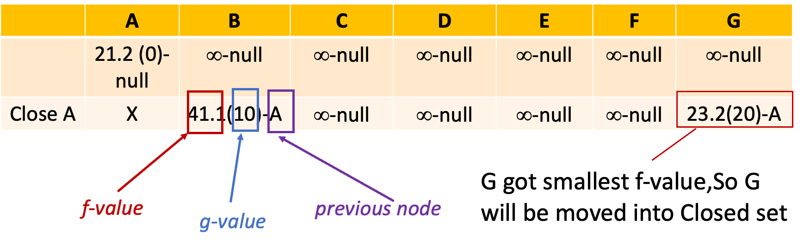
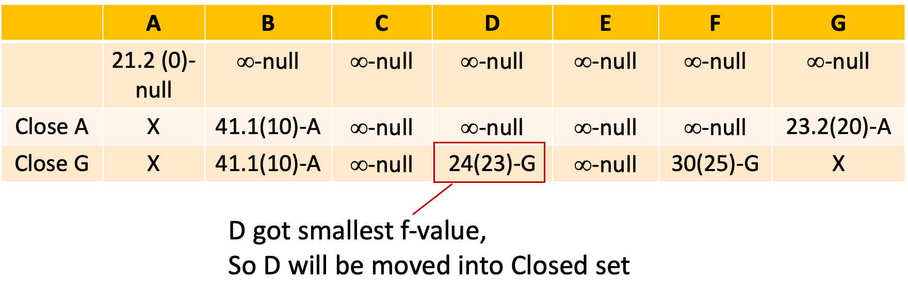
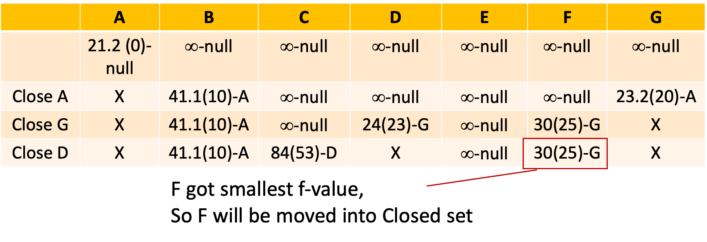
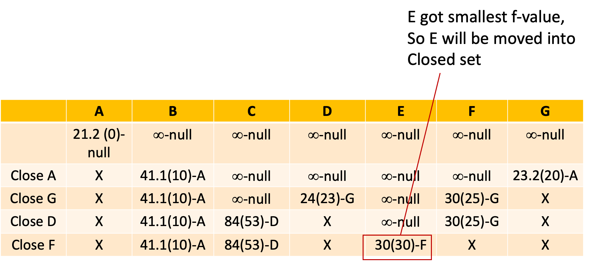
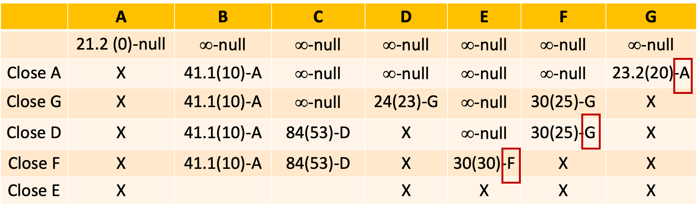

Shortest path:  
`A -> G -> F -> E`

### How does A* compare to Dijkstra?

- Both A\* and Dijkstra’s algorithm compute the same shortest path: A, G, F, E
- However A\* gets to the answer more quickly. When we calculated the path using Dijkstra we ended up closing seven nodes: A, B, C, G, D, F, E. When we use A\* we close only five nodes: A, G, D, F, E
- Informally, the reason that A\* does not close B or C is that our heuristic allows the algorithm to determine that those nodes are too far away from the target to be worth exploring any further.

### What assumptions does A\* make?

- In order for A* to work, we must make two assumptions.
    - The heuristic is admissible.
    - There are no negative edge costs.
- The version of A* presented here makes a third assumption. The heuristic has to be consistent. This means that for any two nodes X and Y we have $$h(Y) - h(X) \leq c(X,Y)$$Where $c(X,Y)$ is the cost of the edge from $X$ to $Y$ and $h(X)$, $h(Y)$ are the heuristic values for $X$ and $Y$
- However this assumption is not critical to the use of A\*. If it did not hold we could use a slightly modified version of A\* that does not have a Closed set.

### Other versions of A\*(book version)

- In our version of A\*:
    - every node is added to the *Open* set at the start. The start node is initially assigned a g-value of 0.
    - all other nodes are given an initial g-value of ∞. Nodes acquire a finite g-value when an adjacent node is added to the *Closed* set.
- In the versions of A\* that you will see in text books:
    - the only node that is initially added to the Open set is the start node.
    - <span style="color: red">Other nodes are added to the <i>Open</i> set when an adjacent node is closed.</span> This is, in practice, identical to what happens in our version.
- As mentioned previously, there are versions of A\* that do not use a *Closed* set, and which can handle heuristics that are not *consistent*.

## A\* algorithm

- The meaning of H-value?
    - The **H-value (heuristic value)** is the **estimated approximate cost** from the **current node** to the **target/goal node** in the graph.
    - It is a guess (not the real exact path cost) used by A\* to guide the search toward the goal efficiently.
- Could we set H-value for each node randomly?
    - **No, we cannot.**
        - A\* algorithm depends on a reasonable heuristic function. Random H-values provide no meaningful guidance toward the goal.
        - Random H may overestimate the real path cost, breaking the **admissible heuristic** rule. This makes A\* lose optimality (may not find the shortest path).
        - Random H also causes inefficient, aimless searching and greatly increases computation time.

## A note on Priority queues

- In both Dijkstra’s and the A\* algorithm, we represent the <span style="color: red"><i>Open</i> set as a <i>min-priority</i> queue</span>. The priority of a node is determined by its g-value (Dijkstra) or f-value (A\*).
- The use of priority queues makes the algorithms more efficient because removing a node becomes O(log n) rather than O(n).
- However the priority queue must be implemented in such a way that the priority of a node can be altered after it has been added to the queue. 
- <span style="color: red"><b>Note</b></span> that the *PriorityQueue* class in the Java API does not allow this (you can alter the priority of the node after adding it, but the queue will not then behave correctly).

## Other problems that we can tackle using pathfinding algorithms

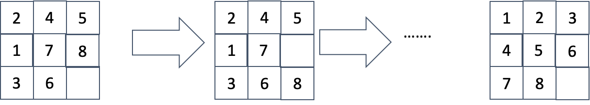

- Consider the familiar puzzle where a set of 8 tiles are arranged in a grid with one empty square, and where the tiles must be put into order by repeatedly sliding tiles into the empty square.
- We can represent this problem as a graph, where the nodes are the different possible arrangements of the tiles within the grid. There is an edge between two nodes, with a cost of 1, if we can get from the first node to the second by sliding a tile into the empty square.
- We could solve the problem of putting an arrangement of tiles into the correct order by finding the shortest path through the graph that ends with the tiles in the right order. We could use Dijkstra to do this. We could use A\*. A possible heuristic would be the number of tiles that are in the "wrong" place.

## Summary

- Both Dijkstra’s and the A\* algorithm solve the problem of finding the shortest path between two nodes in a graph.
- Both algorithms use an *Open* set of nodes. The variant of A\* presented in this lecture also uses a *Closed* set.
- The *Open* set behaves as a *priority queue*, with priority determined by the *g-values* of nodes (Dijkstra) or their *f-values* (A\*).
- The A* algorithm makes use of an *admissible heuristic* to guide the search for the shortest path.
- Path-finding algorithms such as Dijkstra and A* can be used to find routes on maps. <span style="color: blue">They can also be used to solve other problems that can be represented as graphs.</span>

---

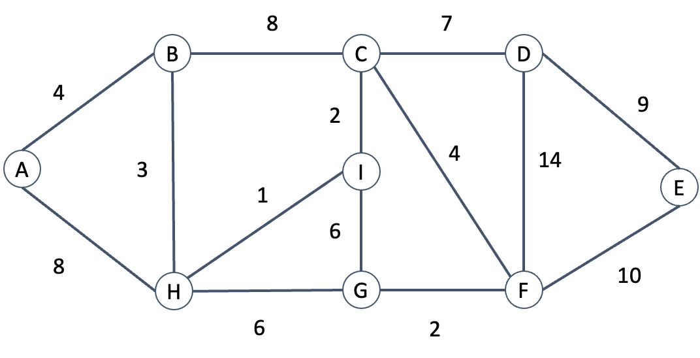
