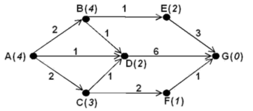

# Path finding Exercises



Consider the graph shown above. The links are annotated to show their cost (for instance the link between D and G has a cost 6). The figures in brackets next to the nodes represent heuristic estimates of the distance from those nodes to the node G (don’t worry about how we arrived at these estimates, we just did). Assume that the method we use never overestimates the distance to G (i.e. it is admissible).

## Exercise 1

Using a similar notation to that used in the lecture, show the sequence of steps by which Dijkstra’s algorithm would calculate the shortest path from A to G. Note that you do _not_ need to make use of the heuristics to answer this part of the question. If you have a choice about which node is at the front of the “Open” set priority queue (because two nodes have the same g-value) then pick the one that comes lowest in the alphabet.

## Exercise 2

Now show the sequence of steps by which the A\* algorithm would calculate the shortest path.

## Reference Answer

```java
// pathFinding.java
// Command-line flags:
// -g <graphFile>: specify a graph file (format: each non-empty non-comment line: FROM TO WEIGHT)
// -h <heuristicFile>: specify a heuristic file (format: each non-empty non-comment line: NODE H)
// If no files provided, uses built-in graph and heuristics from the diagram in the lecture slides.
import java.util.*;
import java.io.*;

public class pathFinding {

	static class Edge { String to; int w; Edge(String to, int w){this.to=to;this.w=w;} }

	// Build the directed graph corresponding to the diagram
	private static Map<String, List<Edge>> buildGraph() {
		Map<String, List<Edge>> g = new HashMap<>();
		for (String name: Arrays.asList("A","B","C","D","E","F","G")) g.put(name, new ArrayList<>());

		// From diagram (directed): A->B(2), A->C(2), A->D(1)
		g.get("A").add(new Edge("B",2));
		g.get("A").add(new Edge("C",2));
		g.get("A").add(new Edge("D",1));

		// B->D(1), B->E(1)
		g.get("B").add(new Edge("D",1));
		g.get("B").add(new Edge("E",1));

		// C->D(1), C->F(2)
		g.get("C").add(new Edge("D",1));
		g.get("C").add(new Edge("F",2));

		// D->G(6)
		g.get("D").add(new Edge("G",6));

		// E->G(3)
		g.get("E").add(new Edge("G",3));

		// F->G(1)
		g.get("F").add(new Edge("G",1));

		return g;
	}

	// Utility: produce the Open list ordered by (g, alphabetical) for printing
	private static String formatOpen(Map<String,Integer> dist, Set<String> closed) {
		List<String> nodes = new ArrayList<>();
		for (String n: dist.keySet()) if (!closed.contains(n) && dist.get(n) < Integer.MAX_VALUE) nodes.add(n);
		nodes.sort((x,y)->{
			int dx = dist.get(x), dy = dist.get(y);
			if (dx!=dy) return Integer.compare(dx,dy);
			return x.compareTo(y);
		});
		StringBuilder sb = new StringBuilder("{");
		for (int i=0;i<nodes.size();i++){
			String n = nodes.get(i);
			sb.append(n).append("(").append(dist.get(n)).append(")");
			if (i<nodes.size()-1) sb.append(", ");
		}
		sb.append("}");
		return sb.toString();
	}

	// Dijkstra with verbose trace
	private static void dijkstraTrace(Map<String,List<Edge>> graph, String start, String goal) {
		// distances and parents
		Map<String,Integer> dist = new HashMap<>();
		Map<String,String> parent = new HashMap<>();
		for (String v: graph.keySet()) { dist.put(v, Integer.MAX_VALUE); parent.put(v, null); }
		dist.put(start, 0);

		// Priority queue entries; comparator by (dist, name) using current dist map for tie-breaking
		PriorityQueue<String> pq = new PriorityQueue<>((x,y)->{
			int dx = dist.get(x), dy = dist.get(y);
			if (dx!=dy) return Integer.compare(dx,dy);
			return x.compareTo(y);
		});
		pq.add(start);

		Set<String> closed = new LinkedHashSet<>();

		System.out.println("Initial state:");
		System.out.println("g("+start+")=0; all others = ∞");
		System.out.println("Open = {"+start+"(0)}; Closed = {}");
		System.out.println();

		while (!pq.isEmpty()){
			String u = pq.poll();
			// skip stale entries: if u already closed or its dist is infinite, continue
			if (closed.contains(u)) continue;
			if (dist.get(u)==Integer.MAX_VALUE) continue;

			// Pop u
			System.out.println("Pop " + u + " (g=" + dist.get(u) + ")");
			closed.add(u);

			// Relax neighbors
			for (Edge e: graph.get(u)){
				String v = e.to; int w = e.w;
				int tentative = dist.get(u) + w;
				System.out.print("  Relax "+u+" -> "+v+" (w="+w+"): ");
				if (tentative < dist.get(v)){
					System.out.println("update g("+v+") from " + (dist.get(v)==Integer.MAX_VALUE?"∞":dist.get(v)) + " to " + tentative + ", parent("+v+")="+u);
					dist.put(v, tentative);
					parent.put(v, u);
					pq.remove(v); // remove stale if present
					pq.add(v);
				} else {
					System.out.println("no update (tentative="+tentative+", current=" + (dist.get(v)==Integer.MAX_VALUE?"∞":dist.get(v)) + ")");
				}
			}

			// Print Open and Closed (Open computed from dist/closed for clarity)
			String openStr = formatOpen(dist, closed);
			System.out.println("  Open = " + openStr + "; Closed = " + closed);
			System.out.println();

			if (u.equals(goal)) break; // stop when goal popped
		}

		if (dist.get(goal)==Integer.MAX_VALUE) {
			System.out.println("No path from " + start + " to " + goal);
			return;
		}

		// Reconstruct path
		List<String> path = new ArrayList<>();
		for (String at = goal; at!=null; at = parent.get(at)) path.add(at);
		Collections.reverse(path);
		System.out.println("Shortest path: " + String.join(" -> ", path) + " with total cost " + dist.get(goal));
	}

		// Heuristics from diagram (admissible)
		private static Map<String,Integer> buildHeuristics() {
			Map<String,Integer> h = new HashMap<>();
			h.put("A", 4);
			h.put("B", 4);
			h.put("C", 3);
			h.put("D", 2);
			h.put("E", 2);
			h.put("F", 1);
			h.put("G", 0);
			return h;
		}

		private static String formatOpenAStar(Map<String,Integer> dist, Set<String> closed, Map<String,Integer> h) {
			List<String> nodes = new ArrayList<>();
			for (String n: dist.keySet()) if (!closed.contains(n) && dist.get(n) < Integer.MAX_VALUE) nodes.add(n);
			nodes.sort((x,y)->{
				int fx = dist.get(x) + h.getOrDefault(x, 0);
				int fy = dist.get(y) + h.getOrDefault(y, 0);
				if (fx!=fy) return Integer.compare(fx,fy);
				return x.compareTo(y);
			});
			StringBuilder sb = new StringBuilder("{");
			for (int i=0;i<nodes.size();i++){
				String n = nodes.get(i);
				int gx = dist.get(n);
				int hx = h.getOrDefault(n, 0);
				int fx = gx + hx;
				sb.append(n).append("(").append(gx).append("/"+hx+"="+fx+")");
				if (i<nodes.size()-1) sb.append(", ");
			}
			sb.append("}");
			return sb.toString();
		}

		// A* with verbose trace
		private static void aStarTrace(Map<String,List<Edge>> graph, Map<String,Integer> h, String start, String goal) {
			Map<String,Integer> dist = new HashMap<>();
			Map<String,String> parent = new HashMap<>();
			for (String v: graph.keySet()) { dist.put(v, Integer.MAX_VALUE); parent.put(v, null); }
			dist.put(start, 0);

			PriorityQueue<String> pq = new PriorityQueue<>((x,y)->{
				int fx = (dist.get(x)==Integer.MAX_VALUE?Integer.MAX_VALUE:dist.get(x)+h.get(x));
				int fy = (dist.get(y)==Integer.MAX_VALUE?Integer.MAX_VALUE:dist.get(y)+h.get(y));
				if (fx!=fy) return Integer.compare(fx,fy);
				return x.compareTo(y);
			});
			pq.add(start);

			Set<String> closed = new LinkedHashSet<>();

			System.out.println("A* initial state:");
			System.out.println("g("+start+")=0; h("+start+")="+h.getOrDefault(start,0)+"; f="+(0+h.getOrDefault(start,0)));
			System.out.println("Open = {"+start+"(0/"+h.getOrDefault(start,0)+"="+(0+h.getOrDefault(start,0))+")}; Closed = {}");

			System.out.println();

			while (!pq.isEmpty()){
				String u = pq.poll();
				if (closed.contains(u)) continue;
				if (dist.get(u)==Integer.MAX_VALUE) continue;

				int fu = dist.get(u) + h.getOrDefault(u,0);
				System.out.println("Pop " + u + " (g=" + dist.get(u) + ", h="+h.getOrDefault(u,0)+", f="+fu+")");

				closed.add(u);

				if (u.equals(goal)) {
					System.out.println("  Goal popped; terminating.");
					break;
				}


				for (Edge e: graph.get(u)){
					String v = e.to; int w = e.w;
					int tentative = dist.get(u) + w;
					int fTent = tentative + h.getOrDefault(v,0);
					System.out.print("  Relax "+u+" -> "+v+" (w="+w+"): ");
					if (tentative < dist.get(v)){
						System.out.println("update g("+v+") from " + (dist.get(v)==Integer.MAX_VALUE?"∞":dist.get(v)) + " to " + tentative + ", h("+v+")="+h.getOrDefault(v,0)+", f="+fTent+", parent("+v+")="+u);
						dist.put(v, tentative);
						parent.put(v, u);
						pq.remove(v);
						pq.add(v);
					} else {
						System.out.println("no update (tentative="+tentative+", current=" + (dist.get(v)==Integer.MAX_VALUE?"∞":dist.get(v)) + ")");
					}
				}

				String openStr = formatOpenAStar(dist, closed, h);
				System.out.println("  Open = " + openStr + "; Closed = " + closed);
				System.out.println();
			}

			if (dist.get(goal)==Integer.MAX_VALUE) {
				System.out.println("No path from " + start + " to " + goal);
				return;
			}

			List<String> path = new ArrayList<>();
			for (String at = goal; at!=null; at = parent.get(at)) path.add(at);
			Collections.reverse(path);
			System.out.println("A* Shortest path: " + String.join(" -> ", path) + " with total cost " + dist.get(goal));
		}

		// Read graph from a simple text file: each non-empty non-comment line: FROM TO WEIGHT
		private static Map<String, List<Edge>> readGraphFromFile(String path) throws Exception {
			Map<String,List<Edge>> g = new HashMap<>();
			try (BufferedReader br = new BufferedReader(new java.io.FileReader(path))) {
				String line;
				while ((line = br.readLine())!=null) {
					line = line.trim();
					if (line.isEmpty() || line.startsWith("#")) continue;
					String[] parts = line.split("\\s+");
					if (parts.length < 3) throw new IllegalArgumentException("Invalid graph line: '"+line+"' (expected: FROM TO WEIGHT)");
					String from = parts[0];
					String to = parts[1];
					int w = Integer.parseInt(parts[2]);
					g.putIfAbsent(from, new ArrayList<>());
					g.putIfAbsent(to, new ArrayList<>());
					g.get(from).add(new Edge(to, w));
				}
			}
			return g;
		}

		// Read heuristics file: each non-empty non-comment line: NODE H
		private static Map<String,Integer> readHeuristics(String path) throws Exception {
			Map<String,Integer> h = new HashMap<>();
			try (BufferedReader br = new BufferedReader(new java.io.FileReader(path))) {
				String line;
				while ((line = br.readLine())!=null) {
					line = line.trim();
					if (line.isEmpty() || line.startsWith("#")) continue;
					String[] parts = line.split("\\s+");
					if (parts.length < 2) throw new IllegalArgumentException("Invalid heuristic line: '"+line+"' (expected: NODE H)");
					String node = parts[0];
					int val = Integer.parseInt(parts[1]);
					h.put(node, val);
				}
			}
			return h;
		}

	public static void main(String[] args) {
		// Determine input sources: support command-line flags:
		// -g <graphFile> -h <heuristicFile>
		String graphFile = null;
		String heurFile = null;
		for (int i=0;i<args.length;i++){
			if ("-g".equals(args[i]) && i+1<args.length) { graphFile = args[++i]; }
			else if ("--graph".equals(args[i]) && i+1<args.length) { graphFile = args[++i]; }
			else if ("-h".equals(args[i]) && i+1<args.length) { heurFile = args[++i]; }
			else if ("--heuristic".equals(args[i]) && i+1<args.length) { heurFile = args[++i]; }
		}

		Map<String,List<Edge>> graph;
		Map<String,Integer> h = null;
		if (graphFile!=null) {
			try {
				graph = readGraphFromFile(graphFile);
				System.out.println("Loaded graph from: " + graphFile);
			} catch (Exception e) {
				System.err.println("Failed to read graph file '"+graphFile+"': "+e.getMessage());
				System.err.println("Falling back to default graph.");
				graph = buildGraph();
			}
		} else {
			graph = buildGraph();
			System.out.println("Using default graph built into program.");
		}

		if (heurFile!=null) {
			try {
				h = readHeuristics(heurFile);
				System.out.println("Loaded heuristics from: " + heurFile);
			} catch (Exception e) {
				System.err.println("Failed to read heuristic file '"+heurFile+"': "+e.getMessage());
				System.err.println("Falling back to default heuristics (if available).");
				h = buildHeuristics();
			}
		} else {
			// If no heuristic file provided, use default heuristics when running A*; otherwise A* will still run but with missing nodes defaulting to 0
			h = buildHeuristics();
			System.out.println("Using default heuristics built into program.");
		}

		// Run Dijkstra from A to G and print detailed trace
		dijkstraTrace(graph, "A", "G");

		System.out.println();
		// Run A* from A to G and print detailed trace
		aStarTrace(graph, h, "A", "G");
	}
}
```

```
# sample_graph.txt
# Sample graph matching the diagram
# Format: FROM TO WEIGHT
A B 2
A C 2
A D 1
B D 1
B E 1
C D 1
C F 2
D G 6
E G 3
F G 1
```

```
# sample_heuristics.txt
# Sample heuristics matching the diagram
# Format: NODE H
A 4
B 4
C 3
D 2
E 2
F 1
G 0
```
