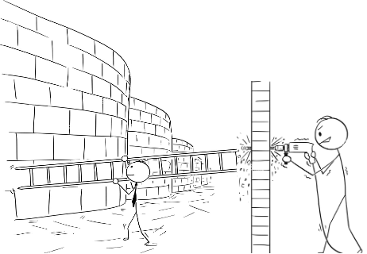
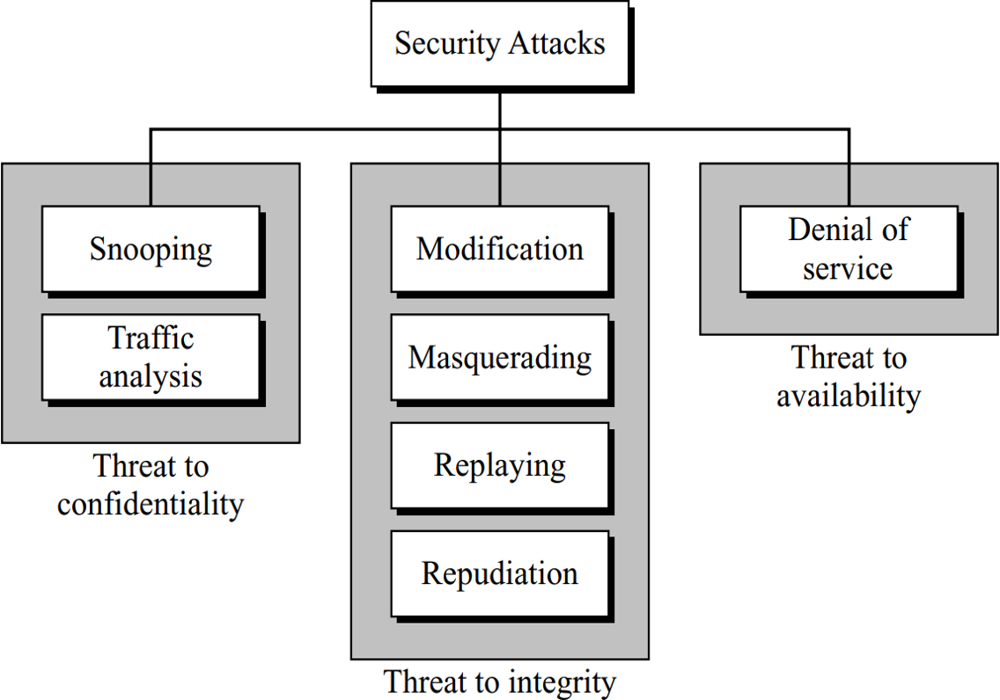
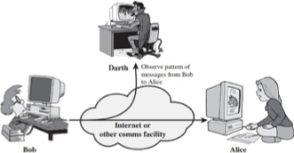
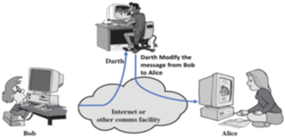
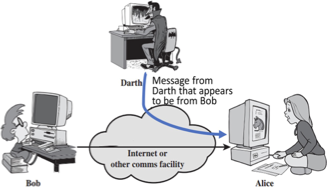
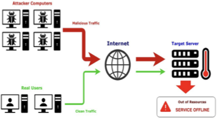
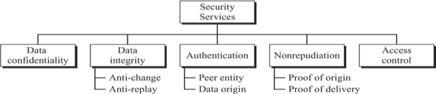
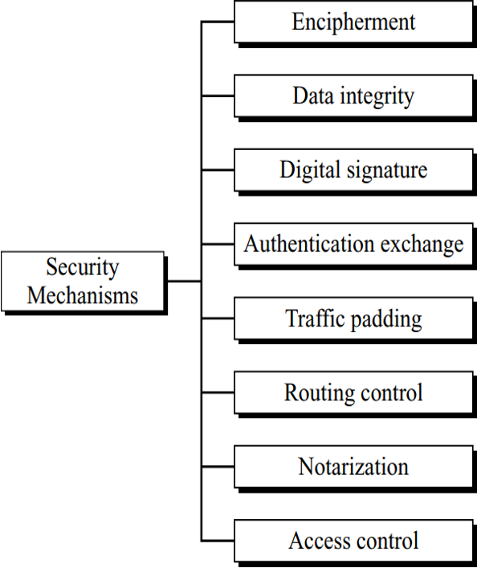
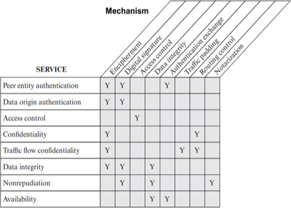

## Lecture Outline

1. Introduction to security and the importance of protecting information
2. Core security goals: confidentiality, integrity, and availability
3. Types of security attacks on confidentiality, integrity, and availability
4. Passive and active attacks
5. Security services and Security Mechanisms

## Learning Outcomes

By the end of this lecture, students should be able to:
1. Explain what security means in information systems
2. Describe the three main security goals
3. Differentiate between threat, vulnerability, and attack
4. Identify common attacks on confidentiality, integrity, and availability
5. Distinguish between passive and active attacks
6. Relate security goals, attacks, services, and mechanisms to real world examples

## Security Goals

- Security is protection from, or resilience against potential harm caused by others, by restraining (preventing) the freedom of others to act.
- Beneficiaries of security may be of persons and social groups, objects and institutions, ecosystems or any other entity or phenomenon vulnerable to unwanted change.
- Now a days, information is the most important asset that has a value like any other asset.
- As an asset, information needs to be secured from attacks.

---

> To be secured, the information needs achieve the following:

| Confidentiality                 | Integrity                          | Availability                                        |
| ------------------------------- | ---------------------------------- | --------------------------------------------------- |
| Hidden from unauthorized access | Protected from unauthorized change | Available to an authorized entity when it is needed |

---

### Confidentiality
- Confidentiality is the ability not to disclose information to unauthorized persons, programs, or processes.
- Confidentiality requires measures to ensure that only authorized persons have access to information
- Unauthorized persons are denied access to them
- Simply put, confidentiality means that something is secret and should not be passed on to unintentional persons or organizations.

---

### Integrity
- Integrity is the ability to ensure that a system and its data has not suffered unauthorized modification
- Data cannot be modified by unauthorized person while it stored in the system or transmitted through the public channel.
- Integrity protection protects not only data, but also operating systems, applications and hardware from being altered by unauthorized individuals.

---

### Availability
- In order for an information system to be useful it must be available to authorized users.
- Availability guarantees that users can timely and uninterruptedly accessed to the system and applications when they need them.
- The most common attack that impacts availability is denial-of-service (DoS) in which the attacker interrupts access to information, system, devices or other network resources.
- In a DoS attack, hackers flood a server with superfluous requests, overwhelming the server and degrading service for legitimate users.

---

Example!!!
- When Facebook went offline globally for almost 6 hours in the early hours of October 5, 2021.
- The cost of this outage, according to cybersecurity watchdog Net- Blocks, was to the tune of $160 million to the global economy.
- Facebook’s share price tumbled, and data suggests that Mark Zucker- berg, founder and CEO of Facebook, lost as much as $7 billion and Facebook saw $40 billion in market capitalization wiped out.

### Brief Questions

## Security Attacks

What is a threat?
- Any potential danger to information or systems that can exploit a vulnerability (gap), intentionally or accidentally, and obtain, damage, or destroy an asset.

What is a vulnerability?
- A weakness or gap in a security system that can be exploited by threats to gain unauthorized access.

What is an attack?
- Is the action taken by a threat actor to exploit a vulnerability in a harmful manner.

---

| Threat                                   | Vulnerability                                          | Attack                                   |
| ---------------------------------------- | ------------------------------------------------------ | ---------------------------------------- |
| A hacker assessing a system              | Scanning the system to look for a “hole” or deficiency | Lunching an attack to cause damage       |
|  |                |  |

---

Attacks Threatening Confidentiality
In general, two types of attacks threaten the confidentiality of information: snooping and traffic analysis. [^1]
[^1]: Cryptography and Network Security, Behrouz A. Forouzan, Second Edition, page: 3

### Snooping
- Snooping refers to unauthorized access to or interception of data.
- For example, a file transferred through the Internet may contain confidential information.
- An unauthorized entity may intercept the transmission and use the contents for her own benefit.
- To prevent snooping, we can use encipherment (encryption).  techniques.

---

Attacks Threatening Confidentiality Continue...
### Traffic Analysis
- Although encryption of data may make it non-intelligible (which can not understand) for the interceptor (Attacker).
- The attacker can obtain some other type of information by monitoring online traffic.
- For example, the attacker can find the electronic address (such as the e-mail address) of the sender or the receiver.
- The attacker can collect pairs of requests and responses to help his/her guess the nature of transaction.

Traffic Analysis

---

Attacks Threatening Integrity
The integrity of data can be threatened by several kinds of attacks: modification, masquerading, replaying, and repudiation.

### Modification
- After intercepting or accessing information, the attacker modifies the information to make it beneficial to him/herself
- For example, a customer sends a message to a bank to do some transaction.
- The attacker intercepts the message and changes the type of transaction to benefit him/herself.
- Note that sometimes the attacker simply deletes or delays the message to harm the system or to benefit from it.

Message Modification Attacks

---

Attacks Threatening Integrity Continue...
### Masquerading
- Masquerading, or spoofing, happens when the attacker impersonates somebody else.
- For example, an attacker might steal the bank card and PIN of a bank customer and pretend that she is that customer.
- Sometimes the attacker pretends instead to be the receiver entity.
- For example, a user tries to contact a bank, but another site pretends that it is the bank and obtains some information from the user.

Masquerading Attacks
> [!NOTE]
> phishing是利用假冒（masquerade）网站行骗的行为

---

Attacks Threatening Integrity Continue...
### Replaying
- Replaying attack, the attacker obtains a copy of a message sent by a user and later tries to replay it.
- For example, a person sends a request to her bank to ask for payment to the attacker, who has done a job for her.
- The attacker intercepts the message and sends it again to receive another payment from the bank.

Replay Attacks

---

Attacks Threatening Integrity Continue...
### Repudiation
- This type of attack is performed by one of the two parties in the communication: the sender or the receiver.
- The sender of the message might later deny that she has sent the message; the receiver of the message might later deny that he has received the message.
- An example of denial by the sender would be a bank customer asking her bank to send some money to a third party but later denying that she has made such a request.
- An example of denial by the receiver could occur when a person buys a product from a manufacturer and pays for it electronically, but the manufacturer later denies having received the payment and asks to be paid.

Not Me

---

Attacks Threatening Availability
### Denial of Service
- Denial of service (DoS) is a very common attack. It may slow down or totally interrupt the service of a system.
- The attacker can use several strategies to achieve this. She might send so many bogus requests to a server that the server crashes because of the heavy load.
- The attacker might intercept and delete a server’s response to a client, making the client to believe that the server is not responding.
- The attacker may also intercept requests from the clients, causing the clients to send requests many times and overload the system.

Denial of Service Attacks

---

### Passive and Active Attacks
- Passive Attacks:  In a passive attack, the attacker’s goal is just to obtain information.  This means that the attack does not modify data or harm the system.
- Active Attacks: An active attack may change the data or harm the system.  Attacks that threaten the integrity and availability are active attacks.  Active attacks are normally easier to detect than to prevent, because an attacker can launch them in a variety of ways.

Categorization of passive and active attacks
<table border="1" cellpadding="6" cellspacing="0" style="width: 100%; border-collapse: collapse; text-align: center;">
  <tr>
    <th>Attacks</th>
    <th>Passive/Active</th>
    <th>Threaten</th>
  </tr>
  <tr>
    <td>Snooping</td>
    <td rowspan="2">Passive</td>
    <td rowspan="2">Confidentiality</td>
  </tr>
  <tr>
    <td>Traffic Analysis</td>
  </tr>
  <tr>
    <td>Modification</td>
    <td rowspan="4">Active</td>
    <td rowspan="4">Integrity</td>
  </tr>
  <tr>
    <td>Masquerading</td>
  </tr>
  <tr>
    <td>Replaying</td>
  </tr>
  <tr>
    <td>Repudiation</td>
  </tr>
  <tr>
    <td>Denial of Service</td>
    <td>Active</td>
    <td>Availability</td>
  </tr>
</table>

---

Fine for boy who hacked into Pentagon
In 22 March 1997, a British teenager who got a D grade in A- level computer science was fined yesterday for hacking into United States defence and missile systems and removing files on artificial intelligence and battle management [^2]

Some British celebrities are defending him, saying he never posed a threat.
[^2]: https://www.independent.co.uk/news/fine-for-boy-who-hacked-into-pentagon-1274204.html

### Brief Questions

## Security Services

- International  Telecommunication  Union-Telecommunication  Standardization Sector (ITU-T)= ITU-T (X.800) has defined five services related to the security goals and attacks we defined in the previous sections.

Security Services based on ITU-T (X.800)

- **Confidentiality:**
    - Data confidentiality is designed to protect data from disclosure attack.
    - It is designed to prevent snooping and traffic analysis attack.

---

### Data Integrity
- Data integrity is designed to protect data from modification, insertion, deletion, and replaying by an adversary.
- It may protect the whole message or part of the message.

### Authentication
- This service provides the authentication of the party at the other end of the line.
- In connection-oriented communication, it provides authentication of the sender or receiver during the connection establishment (peer entity authentication).
- In connectionless communication, it authenticates the source of the data (data origin authentication).

---

### Nonrepudiation
- Nonrepudiation service protects against repudiation by either the sender or the receiver of the data.
- In nonrepudiation with proof of the origin, the receiver of the data can later prove the identity of the sender if denied.
- In nonrepudiation with proof of delivery, the sender of data can later prove that data were delivered to the intended recipient.

### Access Control
- Access control provides protection against unauthorized access to data.
- The term access in this definition is very broad and can involve reading, writing, modifying, executing programs, and so on.

### Brief Questions

## Security Mechanism

ITU-T (X.800) also recommends some security mechanisms to provide the security services defined in the previous section. The following Figure gives the taxonomy of these mechanisms.

Security Mechanism based on ITU-T (X.800)

---

**Encipherment:**
- Encipherment, hiding or covering data, can provide confidentiality.
- It can also be used to complement other mechanisms to provide other services.
- Today two techniques cryptography and steganography are used for enciphering.

**Data Integrity:**
- Data integrity refers to the reliability and trustworthiness of data throughout its lifecycle.
- A variety of mechanisms used to assure the integrity of a data unit or stream of data units.

---

**Digital Signature:**
- A digital signature is a means by which the sender can electronically sign the data and the receiver can electronically verify the signature.
- The sender uses a process that involves showing that she owns a private key related to the public key that she has announced publicly.
- The receiver uses the sender’s public key to prove that the message is indeed signed by the sender who claims to have sent the message.

---

Specific Security Mechanisms
**Authentication Exchange:** A mechanism intended to ensure the identity of an entity by means of information exchange.

**Traffic Padding:** Traffic padding produces cipher text output continuously, even in the absence of the plain text. A continuous random data stream is generated. When plain text is available, it is encrypted and transmitted. When input plaintext is not present, random data are encrypted and transmitted.

**Routing Control:** Routing control means selecting and continuously changing different available routes between sender and receiver to prevent the opponent from eavesdropping on a particular route, specifically when a breach of security is suspected.

**Notarization:** The use of a trusted third party to assure certain properties of a data exchange.

Security Services Vs Security Mechanism

### Brief Questions

## Summary

- Security Goals:
    - Confidentiality
    - Integrity
    - Availability
- Attacks Threatening Confidentiality
    - Snooping
    - Traffic Analysis
- Attacks Threatening Integrity
    - Modification
    - Masquerading
    - Replying
    - Repudiation
- Attacks Threatening Availability
    - Denial of Service
    - Active and Passive Attacks
- Security Services:
    - Confidentiality
    - Data Integrity
    - Authentication
    - Nonrepudiation
    - Access Control
- Security Mechanism
    - Encipherment
    - Data Integrity
    - Digital Signature
    - Authentication
    - Traffic Padding
    - Routing Control
    - Notarization
