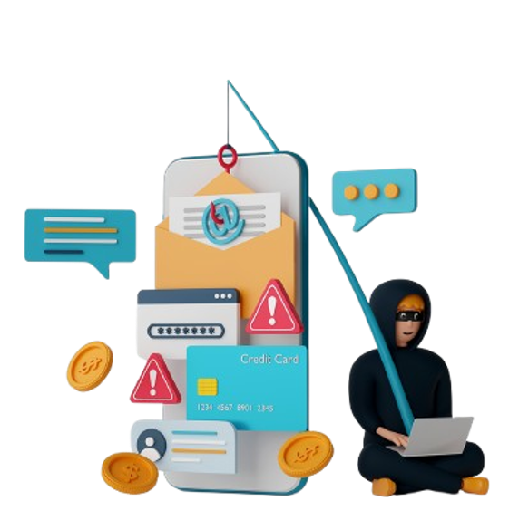
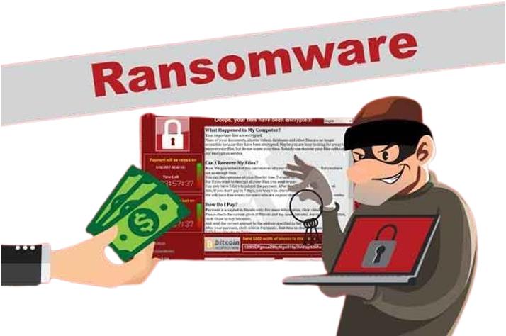
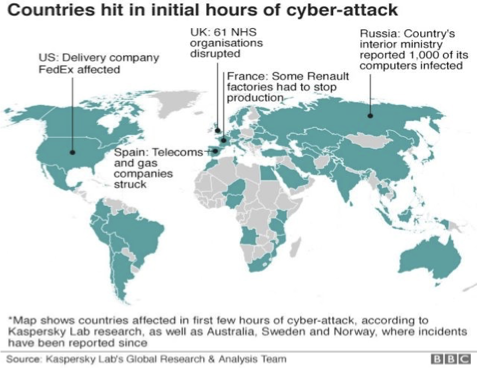
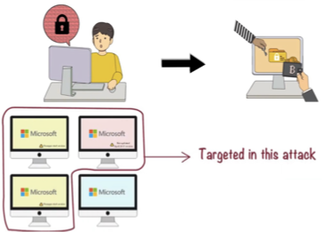
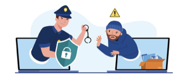
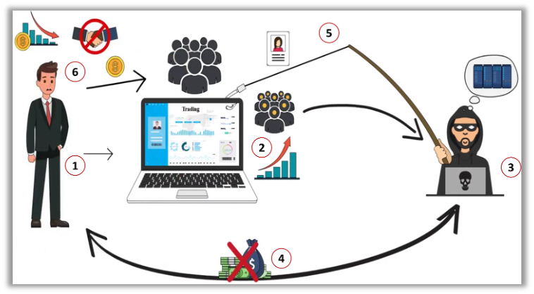
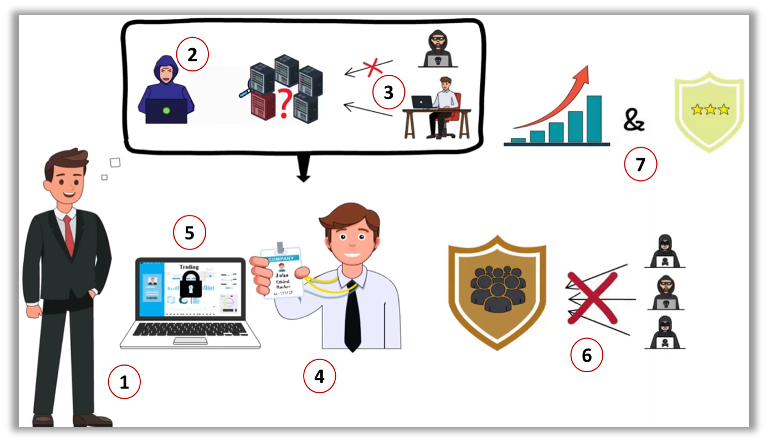
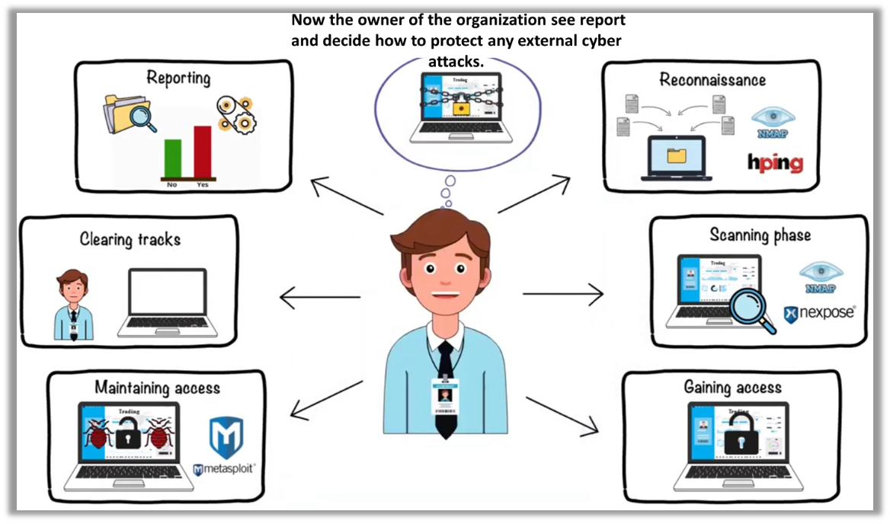
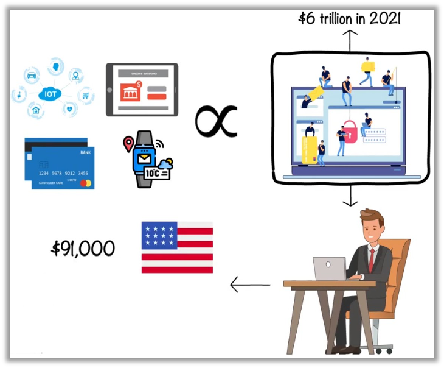
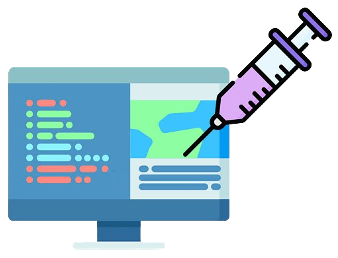

## What’s in It for You?

- Importance of Ethical Hacking
    - Introduction
    - What is Ethical hacking?
    - Types of Cyber Attacks 
    - Case Study for Ethical Hacking
    - Ethical Hacking Process 
    - Ethical Hacking Carrier & Certification

## Introduction

We humans are highly tech-savvy in todays time.

With the extensive use of the internet in modern technologies

Protecting our digital data, like internet banking details, account credentials, and medical records, presents a significant challenge.

---

### Have you heard about the deadly WannaCry ransomware Attack?

---

- It began in May 2017 in Asia and quickly spread worldwide. 
- In just one day, it infected over 230,000 computers in 150 countries. The WannaCry ransomware encrypted data and locked users out of their systems, demanding a ransom of $300 to $600 in Bitcoin. 
- The attack targeted users with unsupported versions of Windows and those who had not installed security updates.

---

- The WannaCry attack impacted all sectors, including top-tier organizations, affecting their systems.
- How can we prevent such attacks?

---

### How can we prevent such attacks?

- To prevent such attack, cybersecurity is implemented.

Cybersecurity is  the  practice  of  protecting networks, programs, computer systems, and components from unauthorized digital attacks, often referred to as hacking.

---

## Ethical hacking

### What is hacking

- Hacking involves exploiting weaknesses in computer networks to gain unauthorized access to information.
- A hacker is someone who attempts to penetrate computer systems. 
- It is a misconception that hacking is always wrong. 

### Types of Hackers

- There are three types of hackers:
    - Black Hat Hackers: Individuals who illegally hack systems for financial gain. Criminal intent, stealing data, deploying malware, financial fraud etc 
        - ILLEGAL
    - White Hat Hackers (Ethical Hackers): These hackers exploit vulnerabilities with permission to help organizations identify security weaknesses.
        - APPROVED
    - Gray Hat Hackers: They find and report vulnerabilities without the owner's consent and may sometimes request payment for these discoveries. A mix of black and white hat hacking.
        - NOT APPROVED

| Black Hat Hackers                    | White Hat Hackers (Ethical Hackers)  | Gray Hat Hackers                     |
| ------------------------------------ | ------------------------------------ | ------------------------------------ |
|  |  |  |
|  |  |  |

## Brief Questions

## Case Study of Ethical Hacking

Why is Ethical Hacking Necessary?

John runs a trading company providing online trading services with customer investments. As his business expanded, <mark>a hacker targeted the company's servers</mark>, stealing credentials of significant accounts and demanding a lump-sum ransom in exchange. 

John underestimated the threat and did not pay the ransom. Consequently, the hacker withdrew money from various customer accounts, leaving John liable for the losses. This incident cost John not only a substantial amount of money but also the trust of his customers.

---

After the incident, John reflected deeply on **what went wrong** with the security infrastructure of his company. 

He wished he had someone who could <mark>simulate an attack to assess system vulnerabilities</mark> before actual hacker penetration. 

Realizing the need, **he employed Dav, an ethical hacker**, to perform this role. Dav, skilled in mimicking hacker techniques, identified and solved several security loopholes.

> Hiring an ethical hacker not only protected his customers from future attacks but also **increased the company’s productivity and safeguarded its reputation**.

## Phases of Ethical Hacking Continue...

Ethical hacking is distributed into six different phases.

Six different phases of ethical hacking

---

- Ethical hacking is divided into six distinct phases:
    1. Reconnaissance: Dav first gathers all necessary information about the organization’s systems he intends to test. Common tools used in this phase include <i><b>NMAP</b></i> and <i><b>hping</b></i>.
    2. Scanning: Using tools like <i><b>NMAP</b></i> and <i><b>xnexpose</b></i>, Dav searches for vulnerabilities in the target system.
    3. Gaining Access: Dav attempts to exploit the identified vulnerabilities to access the organization’s network.
    4. Maintaining Access: To simulate sustained network control, Dav installs backdoors using tools like <i><b>Metasploit</b></i>.
    5. Clearing Tracks: Dav carefully covers his tracks to prevent detection, ensuring no residual signs or traces of intrusion remain.
    6. Reporting: In the final phase, Dav prepares a comprehensive report summarizing the attack, detailing vulnerabilities found, tools used, and the overall success rate of the simulation.

These phases help an ethical hacker like Dav to thoroughly assess and improve an organization’s security.

---

Do you all agree that Dav is an asset to any organization?

If you aspire to become an ethical hacker like Dav, here are some skills you need to acquire:
- Operating Environments: Proficiency in Windows, Linux, UNIX, and MAC is crucial.
- Programming Languages: A solid understanding of HTML, PHP, Python, SQL, and JavaScript is necessary.
- Networking: Networking is the base of ethical hacking. Therefore, you should be good at networking.
- Legal Knowledge: Ethical hackers must be well-versed in security laws to avoid misusing their abilities.
- Certification: Obtaining a global certification in ethical hacking is essential to secure a position like Dav’s.

These skills equip you to protect organizations and enhance their security measures effectively.

## Examples of Ethical Hacking Certification

- (CEH): Certified Ethical Hacker Certification
- (CompTIA PenTest+) and
- (LPT) License Penetration Tester Certification
- You also join cyber security expert master program where you can learn all the skills require for cyber security expert.

## Opportunity for Ethical Hacker

- The endless growth of technology in this area is directly proportional to the number of cyber crimes.
- In the year 2021, cyber crime estimate the cost 6 trillion dollar.
- Hence, to tackle the cyber crimes, organizations are looking for cyber security professionals

## Upcoming Seminar Sessions

We will later explore the following activities in our seminar session

| 1. SQL Injection                     | 2. Phishing                          | 3. ML For Intrusion Detection        |
| ------------------------------------ | ------------------------------------ | ------------------------------------ |
|  |  |  |
