## Lecture Outline

1. Introduction to the Advanced Encryption Standard (AES)
2. Basic characteristics of AES encryption
3. AES block size and key sizes
4. Subkeys Generations
5. AES round transformations
6. SubBytes transformation using S-box
7. ShiftRows transformation
8. MixColumns transformation

## Learning Outcomes

By the end of this lecture, students should be able to:

1. Explain why AES replaced DES as a modern encryption standard
2. Identify the block size and supported key lengths of AES
3. Explain how plaintext is represented as a state matrix in AES
4. Describe the four main AES transformations (SubBytes, ShiftRows, MixColumns, AddRoundKey)
5. Explain how AES encryption rounds operate

## Advanced Encryption Standard (AES)

### How it works

- Key Expansion: The original key (e.g., 128 bits) is expanded into a set of "round keys" used in each step of the encryption. This ensures the key evolves throughout the process, adding complexity.
- Initial Round: The input data (a 16-byte block) is combined with the first round key using a bitwise XOR operation.
- Main Rounds: It applies a series of transformations to the data in multiple rounds (10 rounds for 128-bit keys, 12 for 192-bit, 14 for 256-bit). Each round consists of four steps:
    - **SubBytes**: Each byte in the block is replaced with another byte according to a predefined substitution table (S-box).
    - **ShiftRows**: The rows of the data block (visualized as a 4x4 grid) are shifted to the left by different amounts.
    - **MixColumns**: The columns of the grid are mixed using a mathematical operation, further scrambling the data.
    - **AddRoundKey**: The current round key is XORed with the block, integrating the key into the process.
- Final Round: The last round skips the MixColumns step but includes **SubBytes**, **ShiftRows**, and **AddRoundKey** to finalize the encryption.

---

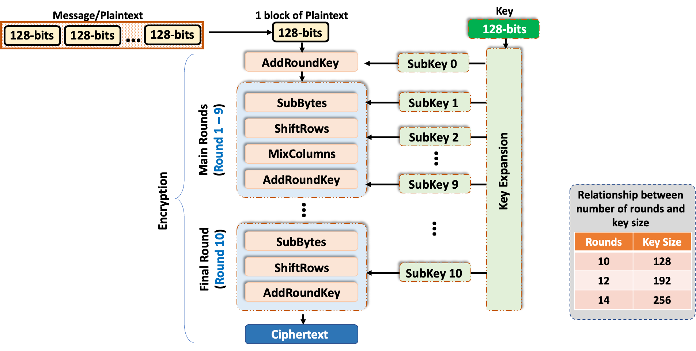

### Key Expansion

- Key Expansion takes the original 128-bit key and expands it into a larger set of keys (called round keys) that AES uses in its encryption rounds. Here we will choose key “cdutobufoscourse”
- For AES-128, which uses 10 rounds of encryption, the process generates 11 round keys (one for the initial round and one for each of the 10 main rounds).
- Each round key is 128 bits (16 bytes), so the total expanded key is 176 bytes (11 rounds $\times$ 16 bytes).

$$
\begin{array}{ll} % 核心修改：替换 @{} 为标准两列左对齐
% 第一行：直接在文本后加 \quad=\quad 实现原间隔效果
\text{Key in text} \hspace{4.4em}\quad=\quad & \text{\textcolor{red}{cdutobufoscourse}} \\[0.6em]
% 第二-四行：保持对齐
\text{Key in 128 bits} \hspace{2.8em}\quad=\quad & 01100011\ \textcolor{red}{01100100}\ 01110101\ \textcolor{red}{01110100}\ 01101111\ \textcolor{red}{01100010} \\
& 01110101\ \textcolor{red}{01100110}\ 01101111\ \textcolor{red}{01110011}\ 01100011\ \textcolor{red}{01101111} \\
& 01110101\ \textcolor{red}{01110010}\ 01110011\ \textcolor{red}{01100101} \\[0.6em]
% 核心修改：*{16}{c} -> 16个c
\text{Key in hexadecimal} \hspace{0.8em}\quad=\quad & \begin{array}{cccccccccccccccc}
63 & \textcolor{red}{64} & 75 & \textcolor{red}{74} & 6F & \textcolor{red}{62} & 75 & \textcolor{red}{66} & 6F & \textcolor{red}{73} & 63 & \textcolor{red}{6F} & 75 & \textcolor{red}{72} & 73 & \textcolor{red}{65} \\
\textcolor{red}{c} & \textcolor{red}{d} & \textcolor{red}{u} & \textcolor{red}{t} & \textcolor{red}{o} & \textcolor{red}{b} & \textcolor{red}{u} & \textcolor{red}{f} & \textcolor{red}{o} & \textcolor{red}{s} & \textcolor{red}{c} & \textcolor{red}{o} & \textcolor{red}{u} & \textcolor{red}{r} & \textcolor{red}{s} & \textcolor{red}{e}
\end{array}
\end{array}
$$

---

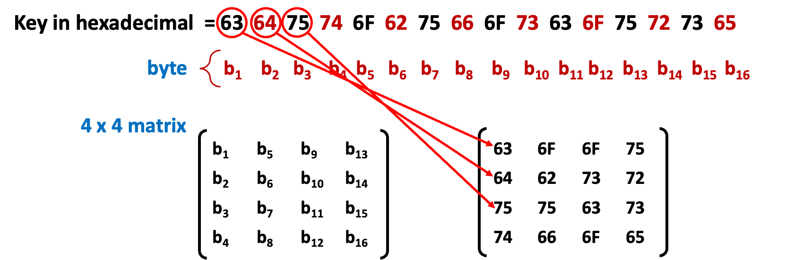

---

- The original key is 4 words (16 bytes $\div$ 4 = 4 words).
- The total expanded key is 44 words (11 rounds $\times$ 4 words per round).
- So, the Key Expansion generates 44 words (labeled $\textcolor{red}{W_0}$ to $\textcolor{red}{W_{43}}$), where:  $\textcolor{red}{W_0}$ to $\textcolor{red}{W_3}$ are the original key. $\textcolor{red}{W_4}$ to $\textcolor{red}{W_{43}}$ are derived iteratively.

---

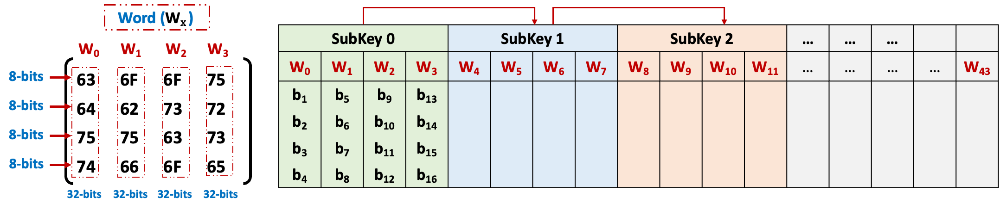

---

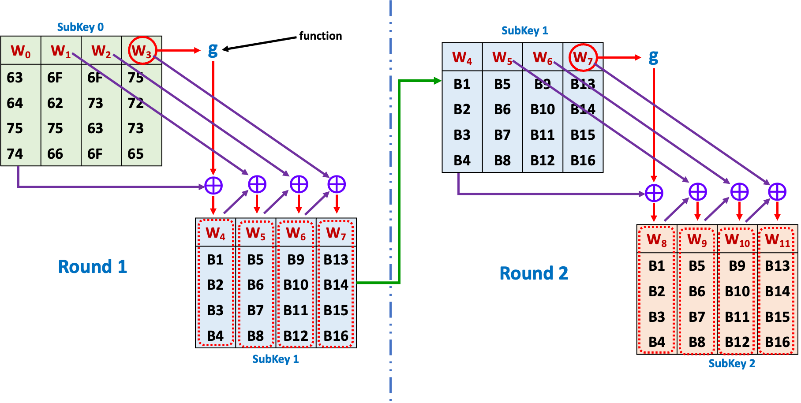

---

$$
\begin{align}
\textcolor{red}{W_4} &= \textcolor{red}{W_0} \textcolor{purple}\oplus \textcolor{blue}{g(}\textcolor{red}{W_3}\textcolor{blue}) \\
\textcolor{red}{W_5} &= \textcolor{red}{W_4} \textcolor{purple}\oplus \textcolor{red}{W_1} \\
\textcolor{red}{W_6} &= \textcolor{red}{W_5} \textcolor{purple}\oplus \textcolor{red}{W_2} \\
\textcolor{red}{W_7} &= \textcolor{red}{W_6} \textcolor{purple}\oplus \textcolor{red}{W_3} \\
\end{align}
$$
$$
\begin{align}
\textcolor{blue}{\text{Round 1 (R1)}} &\textcolor{blue}= \textcolor{red}{W_4}\textcolor{blue}, \textcolor{red}{W_5}\textcolor{blue}, \textcolor{red}{W_6}\textcolor{blue}, \textcolor{red}{W_7} \\
\textcolor{blue}{\text{Round 2 (R2)}} &\textcolor{blue}= \textcolor{red}{W_8}\textcolor{blue}, \textcolor{red}{W_9}\textcolor{blue}, \textcolor{red}{W_{10}}\textcolor{blue}, \textcolor{red}{W_{11}} \\
\textcolor{blue}{\text{Round 3 (R3)}} &\textcolor{blue}= \textcolor{red}{W_{12}}\textcolor{blue}, \textcolor{red}{W_{13}}\textcolor{blue}, \textcolor{red}{W_{14}}\textcolor{blue}, \textcolor{red}{W_{15}}
\end{align}
$$

---

#### Function $\textcolor{blue}{g}$

$$\colorbox{#FBE5D6}{$\textcolor{red}{W_4} = \textcolor{red}{W_0} \textcolor{purple}\oplus \underline{\textcolor{blue}{g(}\textcolor{red}{W_3}\textcolor{blue})}$}$$

- RotWord: Performs a one byte left circular shift on a word. This means that an input word $[\textcolor{red}{b_1}, \textcolor{red}{b_2}, \textcolor{red}{b_3}, \textcolor{red}{b_4}]$ transform into $[\textcolor{red}{b_2}, \textcolor{red}{b_3}, \textcolor{red}{b_4}, \textcolor{red}{b_1}]$.
- SubWord Apply the AES S-box substitution to each byte of the rotated word. This performs a byte substitution on each byte. The first bit represents the row number in S-Box and the second bit represents the column number in S-Box
- Rcon: XOR the result from the subword operation with a round constant (Rcon). This is a fix table.

---

$\textcolor{blue}{g(}\textcolor{red}{W_3}\textcolor{blue})$

- RotWord: Performs a one byte left circular shift on a word. This means that an input word $[\textcolor{red}{b_1}, \textcolor{red}{b_2}, \textcolor{red}{b_3}, \textcolor{red}{b_4}]$ transform into $[\textcolor{red}{b_2}, \textcolor{red}{b_3}, \textcolor{red}{b_4}, \textcolor{red}{b_1}]$.

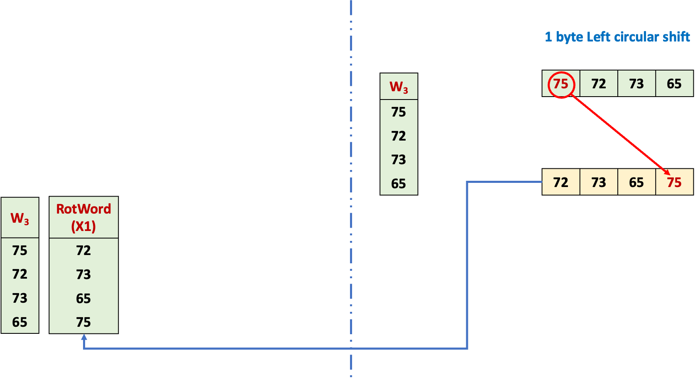

- SubWord: Apply the AES S-box substitution to each byte of the rotated word. This performs a byte substitution on each byte. The first bit represents the row number in S-Box and the second bit represents the column number in S-Box

  <!-- 第一个模块：W3 -->
  

    
W3 &nbsp;

    
75

    
72

    
73

    
65

  

  <!-- 第二个模块：RotWord -->
  

    
RotWord (X1)

    
72

    
73

    
65

    
75

  

  <!-- 箭头 -->
  
→

  <!-- 中间表格 -->
  <table style="border-collapse: collapse; text-align: center;">
    <thead>
      <tr>
        <th style="background-color: #5b9bd5; color: black; padding: 10px 20px; border: 1px solid #ccc;">Row</th>
        <th style="background-color: #5b9bd5; color: black; padding: 10px 20px; border: 1px solid #ccc;">Column</th>
      </tr>
    </thead>
    <tbody>
      <tr style="background-color: #dce8f7;">
        <td style="padding: 10px 20px; border: 1px solid #ccc; text-align: center;">7</td>
        <td style="padding: 10px 20px; border: 1px solid #ccc; text-align: center;">2</td>
      </tr>
      <tr style="background-color: #eaf0fa;">
        <td style="padding: 10px 20px; border: 1px solid #ccc; text-align: center;">7</td>
        <td style="padding: 10px 20px; border: 1px solid #ccc; text-align: center;">3</td>
      </tr>
      <tr style="background-color: #dce8f7;">
        <td style="padding: 10px 20px; border: 1px solid #ccc; text-align: center;">6</td>
        <td style="padding: 10px 20px; border: 1px solid #ccc; text-align: center;">5</td>
      </tr>
      <tr style="background-color: #eaf0fa;">
        <td style="padding: 10px 20px; border: 1px solid #ccc; text-align: center;">7</td>
        <td style="padding: 10px 20px; border: 1px solid #ccc; text-align: center;">5</td>
      </tr>
    </tbody>
  </table>
  <!-- 箭头 -->
  
→

  <!-- 第三个模块：SubWord -->
  

    
SubWord (Y1)

    
40

    
8F

    
4D

    
9D

  

  <table style="border-collapse: collapse; text-align: center; width: 100%; min-width: 800px;">
    <caption style="color: blue; font-weight: bold; margin-bottom: 1px;">AES S-box</caption>
    <thead>
      <tr>
        <th style="border: 1px solid #ccc; background-color: #DEEBF7; padding: 6px;"></th>
        <th style="border: 1px solid #ccc; background-color: #DEEBF7; padding: 6px;">00</th>
        <th style="border: 1px solid #ccc; background-color: #DEEBF7; padding: 6px;">01</th>
        <th style="border: 1px solid #ccc; background-color: #DEEBF7; padding: 6px;">02</th>
        <th style="border: 1px solid #ccc; background-color: #DEEBF7; padding: 6px;">03</th>
        <th style="border: 1px solid #ccc; background-color: #DEEBF7; padding: 6px;">04</th>
        <th style="border: 1px solid #ccc; background-color: #DEEBF7; padding: 6px;">05</th>
        <th style="border: 1px solid #ccc; background-color: #DEEBF7; padding: 6px;">06</th>
        <th style="border: 1px solid #ccc; background-color: #DEEBF7; padding: 6px;">07</th>
        <th style="border: 1px solid #ccc; background-color: #DEEBF7; padding: 6px;">08</th>
        <th style="border: 1px solid #ccc; background-color: #DEEBF7; padding: 6px;">09</th>
        <th style="border: 1px solid #ccc; background-color: #DEEBF7; padding: 6px;">0A</th>
        <th style="border: 1px solid #ccc; background-color: #DEEBF7; padding: 6px;">0B</th>
        <th style="border: 1px solid #ccc; background-color: #DEEBF7; padding: 6px;">0C</th>
        <th style="border: 1px solid #ccc; background-color: #DEEBF7; padding: 6px;">0D</th>
        <th style="border: 1px solid #ccc; background-color: #DEEBF7; padding: 6px;">0E</th>
        <th style="border: 1px solid #ccc; background-color: #DEEBF7; padding: 6px;">0F</th>
      </tr>
    </thead>
    <tbody>
      <tr>
        <th style="border: 1px solid #ccc; background-color: #DEEBF7; padding: 6px;">00</th>
        <td style="border: 1px solid #ccc; padding: 6px;">63</td>
        <td style="border: 1px solid #ccc; padding: 6px;">7C</td>
        <td style="border: 1px solid #ccc; padding: 6px;">77</td>
        <td style="border: 1px solid #ccc; padding: 6px;">7B</td>
        <td style="border: 1px solid #ccc; padding: 6px;">F2</td>
        <td style="border: 1px solid #ccc; padding: 6px;">6B</td>
        <td style="border: 1px solid #ccc; padding: 6px;">6F</td>
        <td style="border: 1px solid #ccc; padding: 6px;">C5</td>
        <td style="border: 1px solid #ccc; padding: 6px;">30</td>
        <td style="border: 1px solid #ccc; padding: 6px;">01</td>
        <td style="border: 1px solid #ccc; padding: 6px;">67</td>
        <td style="border: 1px solid #ccc; padding: 6px;">2B</td>
        <td style="border: 1px solid #ccc; padding: 6px;">FE</td>
        <td style="border: 1px solid #ccc; padding: 6px;">D7</td>
        <td style="border: 1px solid #ccc; padding: 6px;">AB</td>
        <td style="border: 1px solid #ccc; padding: 6px;">76</td>
      </tr>
      <tr>
        <th style="border: 1px solid #ccc; background-color: #DEEBF7; padding: 6px;">10</th>
        <td style="border: 1px solid #ccc; padding: 6px;">CA</td>
        <td style="border: 1px solid #ccc; padding: 6px;">82</td>
        <td style="border: 1px solid #ccc; padding: 6px;">C9</td>
        <td style="border: 1px solid #ccc; padding: 6px;">7D</td>
        <td style="border: 1px solid #ccc; padding: 6px;">FA</td>
        <td style="border: 1px solid #ccc; padding: 6px;">59</td>
        <td style="border: 1px solid #ccc; padding: 6px;">47</td>
        <td style="border: 1px solid #ccc; padding: 6px;">F0</td>
        <td style="border: 1px solid #ccc; padding: 6px;">AD</td>
        <td style="border: 1px solid #ccc; padding: 6px;">D4</td>
        <td style="border: 1px solid #ccc; padding: 6px;">A2</td>
        <td style="border: 1px solid #ccc; padding: 6px;">AF</td>
        <td style="border: 1px solid #ccc; padding: 6px;">9C</td>
        <td style="border: 1px solid #ccc; padding: 6px;">A4</td>
        <td style="border: 1px solid #ccc; padding: 6px;">72</td>
        <td style="border: 1px solid #ccc; padding: 6px;">C0</td>
      </tr>
      <tr>
        <th style="border: 1px solid #ccc; background-color: #DEEBF7; padding: 6px;">20</th>
        <td style="border: 1px solid #ccc; padding: 6px;">B7</td>
        <td style="border: 1px solid #ccc; padding: 6px;">FD</td>
        <td style="border: 1px solid #ccc; padding: 6px;">93</td>
        <td style="border: 1px solid #ccc; padding: 6px;">26</td>
        <td style="border: 1px solid #ccc; padding: 6px;">36</td>
        <td style="border: 1px solid #ccc; padding: 6px;">3F</td>
        <td style="border: 1px solid #ccc; padding: 6px;">F7</td>
        <td style="border: 1px solid #ccc; padding: 6px;">CC</td>
        <td style="border: 1px solid #ccc; padding: 6px;">34</td>
        <td style="border: 1px solid #ccc; padding: 6px;">A5</td>
        <td style="border: 1px solid #ccc; padding: 6px;">E5</td>
        <td style="border: 1px solid #ccc; padding: 6px;">F1</td>
        <td style="border: 1px solid #ccc; padding: 6px;">71</td>
        <td style="border: 1px solid #ccc; padding: 6px;">D8</td>
        <td style="border: 1px solid #ccc; padding: 6px;">31</td>
        <td style="border: 1px solid #ccc; padding: 6px;">15</td>
      </tr>
      <tr>
        <th style="border: 1px solid #ccc; background-color: #DEEBF7; padding: 6px;">30</th>
        <td style="border: 1px solid #ccc; padding: 6px;">04</td>
        <td style="border: 1px solid #ccc; padding: 6px;">C7</td>
        <td style="border: 1px solid #ccc; padding: 6px;">23</td>
        <td style="border: 1px solid #ccc; padding: 6px;">C3</td>
        <td style="border: 1px solid #ccc; padding: 6px;">18</td>
        <td style="border: 1px solid #ccc; padding: 6px;">96</td>
        <td style="border: 1px solid #ccc; padding: 6px;">05</td>
        <td style="border: 1px solid #ccc; padding: 6px;">9A</td>
        <td style="border: 1px solid #ccc; padding: 6px;">07</td>
        <td style="border: 1px solid #ccc; padding: 6px;">12</td>
        <td style="border: 1px solid #ccc; padding: 6px;">80</td>
        <td style="border: 1px solid #ccc; padding: 6px;">E2</td>
        <td style="border: 1px solid #ccc; padding: 6px;">EB</td>
        <td style="border: 1px solid #ccc; padding: 6px;">27</td>
        <td style="border: 1px solid #ccc; padding: 6px;">B2</td>
        <td style="border: 1px solid #ccc; padding: 6px;">75</td>
      </tr>
      <tr>
        <th style="border: 1px solid #ccc; background-color: #DEEBF7; padding: 6px;">40</th>
        <td style="border: 1px solid #ccc; padding: 6px;">09</td>
        <td style="border: 1px solid #ccc; padding: 6px;">83</td>
        <td style="border: 1px solid #ccc; padding: 6px;">2C</td>
        <td style="border: 1px solid #ccc; padding: 6px;">1A</td>
        <td style="border: 1px solid #ccc; padding: 6px;">1B</td>
        <td style="border: 1px solid #ccc; padding: 6px;">6E</td>
        <td style="border: 1px solid #ccc; padding: 6px;">5A</td>
        <td style="border: 1px solid #ccc; padding: 6px;">A0</td>
        <td style="border: 1px solid #ccc; padding: 6px;">52</td>
        <td style="border: 1px solid #ccc; padding: 6px;">3B</td>
        <td style="border: 1px solid #ccc; padding: 6px;">D6</td>
        <td style="border: 1px solid #ccc; padding: 6px;">B3</td>
        <td style="border: 1px solid #ccc; padding: 6px;">29</td>
        <td style="border: 1px solid #ccc; padding: 6px;">E3</td>
        <td style="border: 1px solid #ccc; padding: 6px;">2F</td>
        <td style="border: 1px solid #ccc; padding: 6px;">84</td>
      </tr>
      <tr>
        <th style="border: 1px solid #ccc; background-color: #DEEBF7; padding: 6px;">50</th>
        <td style="border: 1px solid #ccc; padding: 6px;">53</td>
        <td style="border: 1px solid #ccc; padding: 6px;">D1</td>
        <td style="border: 1px solid #ccc; padding: 6px;">00</td>
        <td style="border: 1px solid #ccc; padding: 6px;">ED</td>
        <td style="border: 1px solid #ccc; padding: 6px;">20</td>
        <td style="border: 1px solid #ccc; padding: 6px;">FC</td>
        <td style="border: 1px solid #ccc; padding: 6px;">B1</td>
        <td style="border: 1px solid #ccc; padding: 6px;">5B</td>
        <td style="border: 1px solid #ccc; padding: 6px;">6A</td>
        <td style="border: 1px solid #ccc; padding: 6px;">CB</td>
        <td style="border: 1px solid #ccc; padding: 6px;">BE</td>
        <td style="border: 1px solid #ccc; padding: 6px;">39</td>
        <td style="border: 1px solid #ccc; padding: 6px;">4A</td>
        <td style="border: 1px solid #ccc; padding: 6px;">4C</td>
        <td style="border: 1px solid #ccc; padding: 6px;">58</td>
        <td style="border: 1px solid #ccc; padding: 6px;">CF</td>
      </tr>
      <tr>
        <th style="border: 1px solid #ccc; background-color: #DEEBF7; padding: 6px;">60</th>
        <td style="border: 1px solid #ccc; padding: 6px;">D0</td>
        <td style="border: 1px solid #ccc; padding: 6px;">EF</td>
        <td style="border: 1px solid #ccc; padding: 6px;">AA</td>
        <td style="border: 1px solid #ccc; padding: 6px;">FB</td>
        <td style="border: 1px solid #ccc; padding: 6px;">43</td>
        <td style="border: 1px solid #ccc; padding: 6px;">4D</td>
        <td style="border: 1px solid #ccc; padding: 6px;">33</td>
        <td style="border: 1px solid #ccc; padding: 6px;">85</td>
        <td style="border: 1px solid #ccc; padding: 6px;">45</td>
        <td style="border: 1px solid #ccc; padding: 6px;">F9</td>
        <td style="border: 1px solid #ccc; padding: 6px;">02</td>
        <td style="border: 1px solid #ccc; padding: 6px;">7F</td>
        <td style="border: 1px solid #ccc; padding: 6px;">50</td>
        <td style="border: 1px solid #ccc; padding: 6px;">3C</td>
        <td style="border: 1px solid #ccc; padding: 6px;">9F</td>
        <td style="border: 1px solid #ccc; padding: 6px;">A8</td>
      </tr>
      <tr>
        <th style="border: 1px solid #ccc; background-color: #DEEBF7; padding: 6px;">70</th>
        <td style="border: 1px solid #ccc; padding: 6px;">51</td>
        <td style="border: 1px solid #ccc; padding: 6px;">A3</td>
        <td style="border: 1px solid #ccc; padding: 6px;">40</td>
        <td style="border: 1px solid #ccc; padding: 6px;">8F</td>
        <td style="border: 1px solid #ccc; padding: 6px;">92</td>
        <td style="border: 1px solid #ccc; padding: 6px;">9D</td>
        <td style="border: 1px solid #ccc; padding: 6px;">38</td>
        <td style="border: 1px solid #ccc; padding: 6px;">F5</td>
        <td style="border: 1px solid #ccc; padding: 6px;">BC</td>
        <td style="border: 1px solid #ccc; padding: 6px;">B6</td>
        <td style="border: 1px solid #ccc; padding: 6px;">DA</td>
        <td style="border: 1px solid #ccc; padding: 6px;">21</td>
        <td style="border: 1px solid #ccc; padding: 6px;">10</td>
        <td style="border: 1px solid #ccc; padding: 6px;">FF</td>
        <td style="border: 1px solid #ccc; padding: 6px;">F3</td>
        <td style="border: 1px solid #ccc; padding: 6px;">D2</td>
      </tr>
      <tr>
        <th style="border: 1px solid #ccc; background-color: #DEEBF7; padding: 6px;">80</th>
        <td style="border: 1px solid #ccc; padding: 6px;">CD</td>
        <td style="border: 1px solid #ccc; padding: 6px;">0C</td>
        <td style="border: 1px solid #ccc; padding: 6px;">13</td>
        <td style="border: 1px solid #ccc; padding: 6px;">EC</td>
        <td style="border: 1px solid #ccc; padding: 6px;">5F</td>
        <td style="border: 1px solid #ccc; padding: 6px;">97</td>
        <td style="border: 1px solid #ccc; padding: 6px;">44</td>
        <td style="border: 1px solid #ccc; padding: 6px;">17</td>
        <td style="border: 1px solid #ccc; padding: 6px;">C4</td>
        <td style="border: 1px solid #ccc; padding: 6px;">A7</td>
        <td style="border: 1px solid #ccc; padding: 6px;">7E</td>
        <td style="border: 1px solid #ccc; padding: 6px;">3D</td>
        <td style="border: 1px solid #ccc; padding: 6px;">64</td>
        <td style="border: 1px solid #ccc; padding: 6px;">5D</td>
        <td style="border: 1px solid #ccc; padding: 6px;">19</td>
        <td style="border: 1px solid #ccc; padding: 6px;">73</td>
      </tr>
      <tr>
        <th style="border: 1px solid #ccc; background-color: #DEEBF7; padding: 6px;">90</th>
        <td style="border: 1px solid #ccc; padding: 6px;">60</td>
        <td style="border: 1px solid #ccc; padding: 6px;">81</td>
        <td style="border: 1px solid #ccc; padding: 6px;">4F</td>
        <td style="border: 1px solid #ccc; padding: 6px;">DC</td>
        <td style="border: 1px solid #ccc; padding: 6px;">22</td>
        <td style="border: 1px solid #ccc; padding: 6px;">2A</td>
        <td style="border: 1px solid #ccc; padding: 6px;">90</td>
        <td style="border: 1px solid #ccc; padding: 6px;">88</td>
        <td style="border: 1px solid #ccc; padding: 6px;">46</td>
        <td style="border: 1px solid #ccc; padding: 6px;">EE</td>
        <td style="border: 1px solid #ccc; padding: 6px;">B8</td>
        <td style="border: 1px solid #ccc; padding: 6px;">14</td>
        <td style="border: 1px solid #ccc; padding: 6px;">DE</td>
        <td style="border: 1px solid #ccc; padding: 6px;">5E</td>
        <td style="border: 1px solid #ccc; padding: 6px;">0B</td>
        <td style="border: 1px solid #ccc; padding: 6px;">DB</td>
      </tr>
      <tr>
        <th style="border: 1px solid #ccc; background-color: #DEEBF7; padding: 6px;">A0</th>
        <td style="border: 1px solid #ccc; padding: 6px;">E0</td>
        <td style="border: 1px solid #ccc; padding: 6px;">32</td>
        <td style="border: 1px solid #ccc; padding: 6px;">3A</td>
        <td style="border: 1px solid #ccc; padding: 6px;">0A</td>
        <td style="border: 1px solid #ccc; padding: 6px;">49</td>
        <td style="border: 1px solid #ccc; padding: 6px;">06</td>
        <td style="border: 1px solid #ccc; padding: 6px;">24</td>
        <td style="border: 1px solid #ccc; padding: 6px;">5C</td>
        <td style="border: 1px solid #ccc; padding: 6px;">C2</td>
        <td style="border: 1px solid #ccc; padding: 6px;">D3</td>
        <td style="border: 1px solid #ccc; padding: 6px;">AC</td>
        <td style="border: 1px solid #ccc; padding: 6px;">62</td>
        <td style="border: 1px solid #ccc; padding: 6px;">91</td>
        <td style="border: 1px solid #ccc; padding: 6px;">95</td>
        <td style="border: 1px solid #ccc; padding: 6px;">E4</td>
        <td style="border: 1px solid #ccc; padding: 6px;">79</td>
      </tr>
      <tr>
        <th style="border: 1px solid #ccc; background-color: #DEEBF7; padding: 6px;">B0</th>
        <td style="border: 1px solid #ccc; padding: 6px;">E7</td>
        <td style="border: 1px solid #ccc; padding: 6px;">C8</td>
        <td style="border: 1px solid #ccc; padding: 6px;">37</td>
        <td style="border: 1px solid #ccc; padding: 6px;">6D</td>
        <td style="border: 1px solid #ccc; padding: 6px;">8D</td>
        <td style="border: 1px solid #ccc; padding: 6px;">D5</td>
        <td style="border: 1px solid #ccc; padding: 6px;">4E</td>
        <td style="border: 1px solid #ccc; padding: 6px;">A9</td>
        <td style="border: 1px solid #ccc; padding: 6px;">6C</td>
        <td style="border: 1px solid #ccc; padding: 6px;">56</td>
        <td style="border: 1px solid #ccc; padding: 6px;">F4</td>
        <td style="border: 1px solid #ccc; padding: 6px;">EA</td>
        <td style="border: 1px solid #ccc; padding: 6px;">65</td>
        <td style="border: 1px solid #ccc; padding: 6px;">7A</td>
        <td style="border: 1px solid #ccc; padding: 6px;">AE</td>
        <td style="border: 1px solid #ccc; padding: 6px;">08</td>
      </tr>
      <tr>
        <th style="border: 1px solid #ccc; background-color: #DEEBF7; padding: 6px;">C0</th>
        <td style="border: 1px solid #ccc; padding: 6px;">BA</td>
        <td style="border: 1px solid #ccc; padding: 6px;">78</td>
        <td style="border: 1px solid #ccc; padding: 6px;">25</td>
        <td style="border: 1px solid #ccc; padding: 6px;">2E</td>
        <td style="border: 1px solid #ccc; padding: 6px;">1C</td>
        <td style="border: 1px solid #ccc; padding: 6px;">A6</td>
        <td style="border: 1px solid #ccc; padding: 6px;">B4</td>
        <td style="border: 1px solid #ccc; padding: 6px;">C6</td>
        <td style="border: 1px solid #ccc; padding: 6px;">E8</td>
        <td style="border: 1px solid #ccc; padding: 6px;">DD</td>
        <td style="border: 1px solid #ccc; padding: 6px;">74</td>
        <td style="border: 1px solid #ccc; padding: 6px;">1F</td>
        <td style="border: 1px solid #ccc; padding: 6px;">4B</td>
        <td style="border: 1px solid #ccc; padding: 6px;">BD</td>
        <td style="border: 1px solid #ccc; padding: 6px;">8B</td>
        <td style="border: 1px solid #ccc; padding: 6px;">8A</td>
      </tr>
      <tr>
        <th style="border: 1px solid #ccc; background-color: #DEEBF7; padding: 6px;">D0</th>
        <td style="border: 1px solid #ccc; padding: 6px;">70</td>
        <td style="border: 1px solid #ccc; padding: 6px;">3E</td>
        <td style="border: 1px solid #ccc; padding: 6px;">B5</td>
        <td style="border: 1px solid #ccc; padding: 6px;">66</td>
        <td style="border: 1px solid #ccc; padding: 6px;">48</td>
        <td style="border: 1px solid #ccc; padding: 6px;">03</td>
        <td style="border: 1px solid #ccc; padding: 6px;">F6</td>
        <td style="border: 1px solid #ccc; padding: 6px;">0E</td>
        <td style="border: 1px solid #ccc; padding: 6px;">61</td>
        <td style="border: 1px solid #ccc; padding: 6px;">35</td>
        <td style="border: 1px solid #ccc; padding: 6px;">57</td>
        <td style="border: 1px solid #ccc; padding: 6px;">B9</td>
        <td style="border: 1px solid #ccc; padding: 6px;">86</td>
        <td style="border: 1px solid #ccc; padding: 6px;">C1</td>
        <td style="border: 1px solid #ccc; padding: 6px;">1D</td>
        <td style="border: 1px solid #ccc; padding: 6px;">9E</td>
      </tr>
      <tr>
        <th style="border: 1px solid #ccc; background-color: #DEEBF7; padding: 6px;">E0</th>
        <td style="border: 1px solid #ccc; padding: 6px;">E1</td>
        <td style="border: 1px solid #ccc; padding: 6px;">F8</td>
        <td style="border: 1px solid #ccc; padding: 6px;">98</td>
        <td style="border: 1px solid #ccc; padding: 6px;">11</td>
        <td style="border: 1px solid #ccc; padding: 6px;">69</td>
        <td style="border: 1px solid #ccc; padding: 6px;">D9</td>
        <td style="border: 1px solid #ccc; padding: 6px;">8E</td>
        <td style="border: 1px solid #ccc; padding: 6px;">94</td>
        <td style="border: 1px solid #ccc; padding: 6px;">9B</td>
        <td style="border: 1px solid #ccc; padding: 6px;">1E</td>
        <td style="border: 1px solid #ccc; padding: 6px;">87</td>
        <td style="border: 1px solid #ccc; padding: 6px;">E9</td>
        <td style="border: 1px solid #ccc; padding: 6px;">CE</td>
        <td style="border: 1px solid #ccc; padding: 6px;">55</td>
        <td style="border: 1px solid #ccc; padding: 6px;">28</td>
        <td style="border: 1px solid #ccc; padding: 6px;">DF</td>
      </tr>
      <tr>
        <th style="border: 1px solid #ccc; background-color: #DEEBF7; padding: 6px;">F0</th>
        <td style="border: 1px solid #ccc; padding: 6px;">8C</td>
        <td style="border: 1px solid #ccc; padding: 6px;">A1</td>
        <td style="border: 1px solid #ccc; padding: 6px;">89</td>
        <td style="border: 1px solid #ccc; padding: 6px;">0D</td>
        <td style="border: 1px solid #ccc; padding: 6px;">BF</td>
        <td style="border: 1px solid #ccc; padding: 6px;">E6</td>
        <td style="border: 1px solid #ccc; padding: 6px;">42</td>
        <td style="border: 1px solid #ccc; padding: 6px;">68</td>
        <td style="border: 1px solid #ccc; padding: 6px;">41</td>
        <td style="border: 1px solid #ccc; padding: 6px;">99</td>
        <td style="border: 1px solid #ccc; padding: 6px;">2D</td>
        <td style="border: 1px solid #ccc; padding: 6px;">0F</td>
        <td style="border: 1px solid #ccc; padding: 6px;">B0</td>
        <td style="border: 1px solid #ccc; padding: 6px;">54</td>
        <td style="border: 1px solid #ccc; padding: 6px;">BB</td>
        <td style="border: 1px solid #ccc; padding: 6px;">16</td>
      </tr>
    </tbody>
  </table>

##### Quiz

- Compute the RotWord (X1) and Subword (Y1) of $W_3$ below.

    
W3

    
72

    
69

    
6e

    
67

Waiting…

  <!-- 第一个模块：W3 -->
  

    
W3 &nbsp;

    
72

    
69

    
6e

    
67

  

  <!-- 第二个模块：RotWord -->
  

    
RotWord (X1)

    
69

    
6e

    
67

    
72

  

  <!-- 箭头 -->
  
→

  <!-- 中间表格 -->
  <table style="border-collapse: collapse; text-align: center;">
    <thead>
      <tr>
        <th style="background-color: #5b9bd5; color: black; padding: 10px 20px; border: 1px solid #ccc;">Row</th>
        <th style="background-color: #5b9bd5; color: black; padding: 10px 20px; border: 1px solid #ccc;">Column</th>
      </tr>
    </thead>
    <tbody>
      <tr style="background-color: #dce8f7;">
        <td style="padding: 10px 20px; border: 1px solid #ccc; text-align: center;">6</td>
        <td style="padding: 10px 20px; border: 1px solid #ccc; text-align: center;">9</td>
      </tr>
      <tr style="background-color: #eaf0fa;">
        <td style="padding: 10px 20px; border: 1px solid #ccc; text-align: center;">6</td>
        <td style="padding: 10px 20px; border: 1px solid #ccc; text-align: center;">e</td>
      </tr>
      <tr style="background-color: #dce8f7;">
        <td style="padding: 10px 20px; border: 1px solid #ccc; text-align: center;">6</td>
        <td style="padding: 10px 20px; border: 1px solid #ccc; text-align: center;">7</td>
      </tr>
      <tr style="background-color: #eaf0fa;">
        <td style="padding: 10px 20px; border: 1px solid #ccc; text-align: center;">7</td>
        <td style="padding: 10px 20px; border: 1px solid #ccc; text-align: center;">2</td>
      </tr>
    </tbody>
  </table>
  <!-- 箭头 -->
  
→

  <!-- 第三个模块：SubWord -->
  

    
SubWord (Y1)

    
F9

    
9F

    
85

    
40

  

- Rcon: XOR the result Y1 with a round constant (Rcon).

  <!-- 模块1: W₃ -->
  

    
W3 &nbsp;

    
75

    
72

    
73

    
65

  

  <!-- 模块2: RotWord(X1) -->
  

    
RotWord (X1)

    
72

    
73

    
65

    
75

  

  <!-- 模块3: SubWord(Y1) -->
  

    
SubWord (Y1)

    
40

    
8F

    
4D

    
9D

  

  <!-- 异或符号 -->
  
⊕

  <!-- 模块4: Rcon(R1) -->
  

    
Rcon (R1)

    
01

    
00

    
00

    
00

  

  <!-- 等号 -->
  

    

    

  

  <!-- 模块5: g(W₃) -->
  

    
g (W3) &nbsp;

    
&nbsp;

    
&nbsp;

    
&nbsp;

    
&nbsp;

  

  <table style="border-collapse: collapse; width: 100%; text-align: center;">
    <caption style="color: #0070c0; font-weight: bold; margin-bottom: 8px;">Round Constant Table</caption>
    <thead>
      <tr>
        <th style="border: 1px solid #ccc; background-color: #fff2cc; font-weight: bold; padding: 8px;">Round</th>
        <th style="border: 1px solid #ccc; background-color: #fff2cc; font-weight: bold; padding: 8px;">Byte 1</th>
        <th style="border: 1px solid #ccc; background-color: #fff2cc; font-weight: bold; padding: 8px;">Byte 2</th>
        <th style="border: 1px solid #ccc; background-color: #fff2cc; font-weight: bold; padding: 8px;">Byte 3</th>
        <th style="border: 1px solid #ccc; background-color: #fff2cc; font-weight: bold; padding: 8px;">Byte 4</th>
      </tr>
    </thead>
    <tbody>
      <tr>
        <td style="border: 1px solid #ccc; background-color: #fff2cc; font-weight: bold; padding: 8px;">R1</td>
        <td style="border: 1px solid #ccc; background-color: #eaeaea; padding: 8px;">01</td>
        <td style="border: 1px solid #ccc; background-color: #eaeaea; padding: 8px;">00</td>
        <td style="border: 1px solid #ccc; background-color: #eaeaea; padding: 8px;">00</td>
        <td style="border: 1px solid #ccc; background-color: #eaeaea; padding: 8px;">00</td>
      </tr>
      <tr>
        <td style="border: 1px solid #ccc; background-color: #fff2cc; font-weight: bold; padding: 8px;">R2</td>
        <td style="border: 1px solid #ccc; padding: 8px;">02</td>
        <td style="border: 1px solid #ccc; padding: 8px;">00</td>
        <td style="border: 1px solid #ccc; padding: 8px;">00</td>
        <td style="border: 1px solid #ccc; padding: 8px;">00</td>
      </tr>
      <tr>
        <td style="border: 1px solid #ccc; background-color: #fff2cc; font-weight: bold; padding: 8px;">R3</td>
        <td style="border: 1px solid #ccc; background-color: #eaeaea; padding: 8px;">04</td>
        <td style="border: 1px solid #ccc; background-color: #eaeaea; padding: 8px;">00</td>
        <td style="border: 1px solid #ccc; background-color: #eaeaea; padding: 8px;">00</td>
        <td style="border: 1px solid #ccc; background-color: #eaeaea; padding: 8px;">00</td>
      </tr>
      <tr>
        <td style="border: 1px solid #ccc; background-color: #fff2cc; font-weight: bold; padding: 8px;">R4</td>
        <td style="border: 1px solid #ccc; padding: 8px;">08</td>
        <td style="border: 1px solid #ccc; padding: 8px;">00</td>
        <td style="border: 1px solid #ccc; padding: 8px;">00</td>
        <td style="border: 1px solid #ccc; padding: 8px;">00</td>
      </tr>
      <tr>
        <td style="border: 1px solid #ccc; background-color: #fff2cc; font-weight: bold; padding: 8px;">R5</td>
        <td style="border: 1px solid #ccc; background-color: #eaeaea; padding: 8px;">10</td>
        <td style="border: 1px solid #ccc; background-color: #eaeaea; padding: 8px;">00</td>
        <td style="border: 1px solid #ccc; background-color: #eaeaea; padding: 8px;">00</td>
        <td style="border: 1px solid #ccc; background-color: #eaeaea; padding: 8px;">00</td>
      </tr>
      <tr>
        <td style="border: 1px solid #ccc; background-color: #fff2cc; font-weight: bold; padding: 8px;">R6</td>
        <td style="border: 1px solid #ccc; padding: 8px;">20</td>
        <td style="border: 1px solid #ccc; padding: 8px;">00</td>
        <td style="border: 1px solid #ccc; padding: 8px;">00</td>
        <td style="border: 1px solid #ccc; padding: 8px;">00</td>
      </tr>
      <tr>
        <td style="border: 1px solid #ccc; background-color: #fff2cc; font-weight: bold; padding: 8px;">R7</td>
        <td style="border: 1px solid #ccc; background-color: #eaeaea; padding: 8px;">40</td>
        <td style="border: 1px solid #ccc; background-color: #eaeaea; padding: 8px;">00</td>
        <td style="border: 1px solid #ccc; background-color: #eaeaea; padding: 8px;">00</td>
        <td style="border: 1px solid #ccc; background-color: #eaeaea; padding: 8px;">00</td>
      </tr>
      <tr>
        <td style="border: 1px solid #ccc; background-color: #fff2cc; font-weight: bold; padding: 8px;">R8</td>
        <td style="border: 1px solid #ccc; padding: 8px;">80</td>
        <td style="border: 1px solid #ccc; padding: 8px;">00</td>
        <td style="border: 1px solid #ccc; padding: 8px;">00</td>
        <td style="border: 1px solid #ccc; padding: 8px;">00</td>
      </tr>
      <tr>
        <td style="border: 1px solid #ccc; background-color: #fff2cc; font-weight: bold; padding: 8px;">R9</td>
        <td style="border: 1px solid #ccc; background-color: #eaeaea; padding: 8px;">1B</td>
        <td style="border: 1px solid #ccc; background-color: #eaeaea; padding: 8px;">00</td>
        <td style="border: 1px solid #ccc; background-color: #eaeaea; padding: 8px;">00</td>
        <td style="border: 1px solid #ccc; background-color: #eaeaea; padding: 8px;">00</td>
      </tr>
      <tr>
        <td style="border: 1px solid #ccc; background-color: #fff2cc; font-weight: bold; padding: 8px;">R10</td>
        <td style="border: 1px solid #ccc; padding: 8px;">36</td>
        <td style="border: 1px solid #ccc; padding: 8px;">00</td>
        <td style="border: 1px solid #ccc; padding: 8px;">00</td>
        <td style="border: 1px solid #ccc; padding: 8px;">00</td>
      </tr>
    </tbody>
  </table>

$$\colorbox{#DEEBF7}{$\textcolor{red}{\text{Y1}} = \textcolor{blue}{40~8F~4D~9D} = 01000000~10001111~01001101~10011101$}$$
$$\textcolor{purple}\oplus$$
$$\colorbox{#FFF2CC}{$\textcolor{red}{\text{R1}} = \textcolor{blue}{01~00~00~00} = 00000001~00000000~00000000~00000000$}$$

$$\colorbox{#E2F0D9}{$\textcolor{red}{g(W_3)}= 01000001~10001111~01001101~10011101$}$$
$$\colorbox{#E2F0D9}{$\textcolor{red}{g(W_3)}=\hspace{3em}41\hspace{3em}8F\hspace{3em}4D\hspace{3em}9D$}$$

41 8F 4D 9D

#### Conversion to Binary

| Hexadecimal | Decimal | Binary (4 bits) |
| ----------- | ------- | --------------- |
| `0`           | `0`       | `0000`          |
| `1`           | `1`       | `0001`          |
| `2`           | `2`       | `0010`          |
| `3`           | `3`       | `0011`          |
| `4`           | `4`       | `0100`          |
| `5`           | `5`       | `0101`          |
| `6`           | `6`       | `0110`          |
| `7`           | `7`       | `0111`          |
| `8`           | `8`       | `1000`          |
| `9`           | `9`       | `1001`          |
| `A`           | `10`      | `1010`          |
| `B`           | `11`      | `1011`          |
| `C`           | `12`      | `1100`          |
| `D`           | `13`      | `1101`          |
| `E`           | `14`      | `1110`          |
| `F`           | `15`      | `1111`          |

<code style="background-color: #DEEBF7">40 = 0100 0000</code> <code style="background-color: #DEEBF7">9D = 1001 1101</code>

### Key Expansion

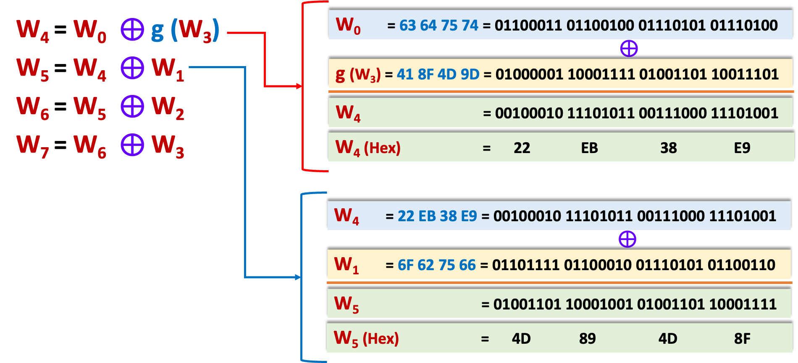
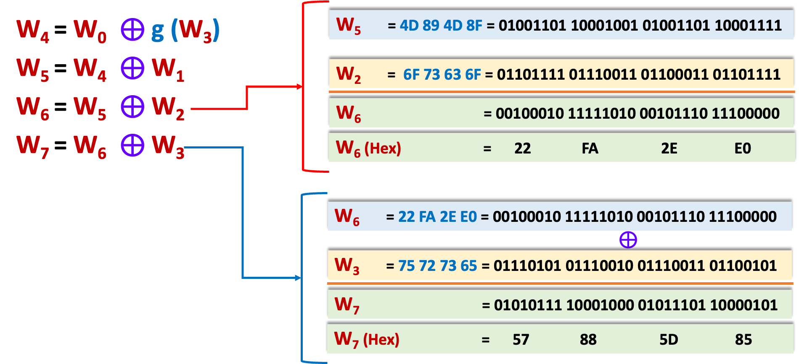
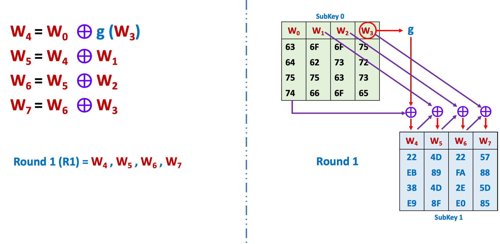
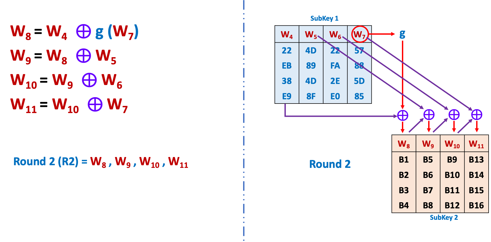
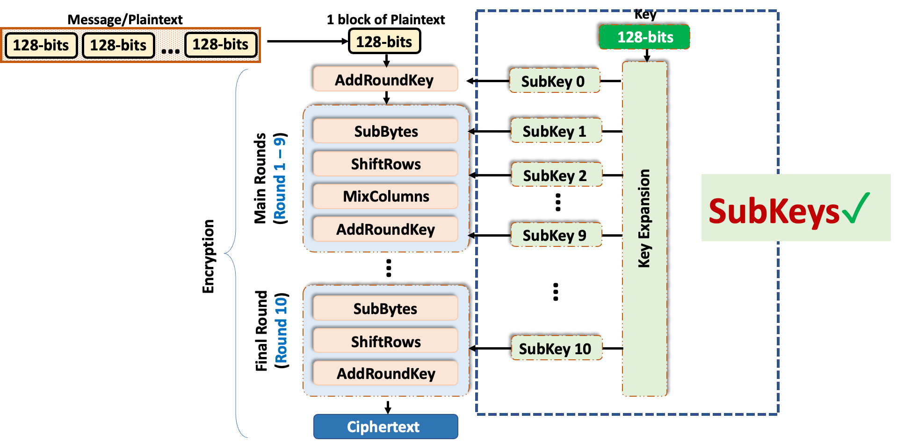

## Initial Round (AddRoundKey)

Message  
128-bits

$$
\begin{array}{ll}
% 文本行：完整红色高亮
\text{Message in text} \hspace{4.4em}= & \text{\textcolor{red}{oursecretmessage}} \\[0.6em]
% 128位二进制：分行排版，等号对齐
\text{Message in 128 bits} \hspace{2.8em}= & 01101111\ 01110101\ 01110010\ 01110011\ 01100101\ 01100011 \\
& 01110010\ 01100101\ 01110100\ 01101101\ 01100101\ 01110011 \\
& 01110011\ 01100001\ 01100111\ 01100101 \\[0.6em]
% 十六进制+字母：顶部对齐，逐列垂直对应
\text{Message in hexadecimal} \hspace{0.8em}= & \begin{array}{cccccccccccccccc}
6\text{F} & 75 & 72 & 73 & 65 & 63 & 72 & 65 & 74 & 6\text{D} & 65 & 73 & 73 & 61 & 67 & 65 \\
\textcolor{red}{o} & \textcolor{red}{u} & \textcolor{red}{r} & \textcolor{red}{s} & \textcolor{red}{e} & \textcolor{red}{c} & \textcolor{red}{r} & \textcolor{red}{e} & \textcolor{red}{t} & \textcolor{red}{m} & \textcolor{red}{e} & \textcolor{red}{s} & \textcolor{red}{s} & \textcolor{red}{a} & \textcolor{red}{g} & \textcolor{red}{e}
\end{array}
\end{array}
$$

---

$$
\begin{align}
\text{Message in hexadecimal} &= 6F~75~72~73~65~63~72~65~74~6D~65~73~73~61~67~65 \\
\textcolor{blue}{\text{byte}} &\textcolor{red}{\hspace{1em}\left\{b_1\ b_2\ b_3\ b_4\ b_5\ b_6\ b_7\ b_8\ b_9\ b_{10}\ b_{11}\ b_{12}\ b_{13}\ b_{14}\ b_{15}\ b_{16}\right.}
\end{align}
$$

$$
\begin{align}
% 上半部分：符号矩阵与子密钥异或
\begin{pmatrix}
b_1 & b_5 & b_9 & b_{13} \\
b_2 & b_6 & b_{10} & b_{14} \\
b_3 & b_7 & b_{11} & b_{15} \\
b_4 & b_8 & b_{12} & b_{16}
\end{pmatrix}
\quad
&\textcolor{purple}{\oplus}
\quad
\begin{pmatrix} \\
\text{\textcolor{blue}{SubKey 0}} \\[0.1em]
\begin{array}{|c|c|c|c|}
\hline
\textcolor{red}{W_0} & \textcolor{red}{W_1} & \textcolor{red}{W_2} & \textcolor{red}{W_3} \\
\hline
\end{array}
\\ ~
\end{pmatrix} \\
\\
% 下半部分：十六进制矩阵异或运算
\begin{pmatrix}
6\text{F} & 65 & 74 & 73 \\
75 & 63 & 6\text{D} & 61 \\
72 & 72 & 65 & 67 \\
73 & 65 & 73 & 65
\end{pmatrix}
\quad
&\textcolor{purple}{\oplus}
\quad
\begin{pmatrix}
63 & 6\text{F} & 6\text{F} & 75 \\
64 & 62 & 73 & 72 \\
75 & 75 & 63 & 73 \\
74 & 66 & 6\text{F} & 65
\end{pmatrix}
\quad
\textcolor{purple}{=}
\quad
\begin{pmatrix}
?? & ?? & ?? & ?? \\
?? & ?? & ?? & ?? \\
?? & ?? & ?? & ?? \\
?? & ?? & ?? & ??
\end{pmatrix}
\end{align}
$$

---

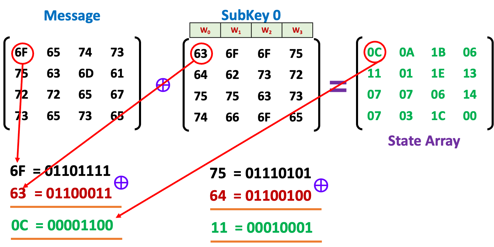

---

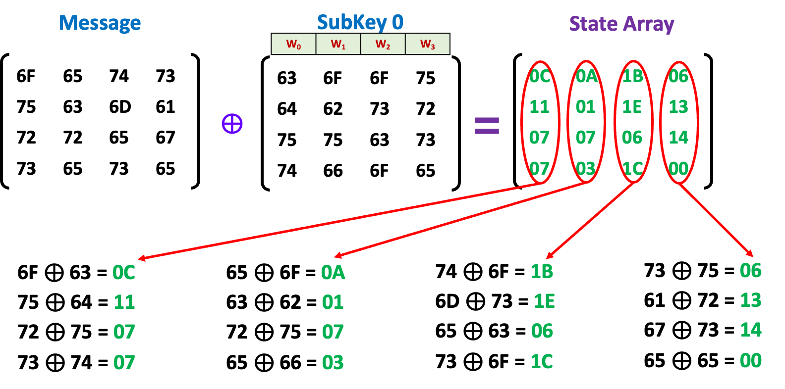

---

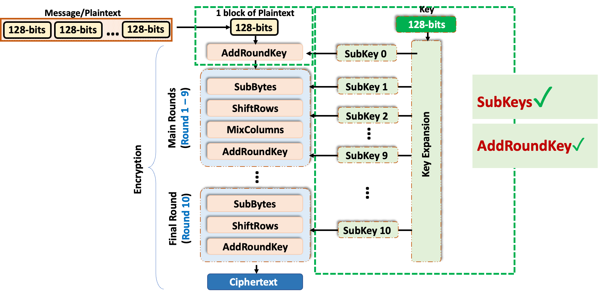

## Main Rounds (Round 1)

### Quiz

What are the steps in a main round?

Waiting…

### Main Rounds - SubBytes

Each byte in the state matrix/array is replaced using the fixed AES S-box (Substitution box).  
For example, a byte like 53 is replaced with ED according to the S-box.

$$
\begin{array}{cc}
\text{\textcolor{purple}{State Array}} & \text{\textcolor{purple}{SubBytes Result}} \\[1em]
\begin{pmatrix}
\textcolor{green}{0C} & \textcolor{green}{0A} & \textcolor{green}{1B} & \textcolor{green}{06} \\
\textcolor{green}{11} & \textcolor{green}{01} & \textcolor{green}{1E} & \textcolor{green}{13} \\
\textcolor{green}{07} & \textcolor{green}{07} & \textcolor{green}{06} & \textcolor{green}{14} \\
\textcolor{green}{07} & \textcolor{green}{03} & \textcolor{green}{1C} & \textcolor{green}{00}
\end{pmatrix}
&
\begin{pmatrix}
\textcolor{red}{FE} & \textcolor{red}{67} & \textcolor{red}{AF} & \textcolor{red}{6F} \\
\textcolor{red}{82} & \textcolor{red}{7C} & \textcolor{red}{72} & \textcolor{red}{7D} \\
\textcolor{red}{C5} & \textcolor{red}{C5} & \textcolor{red}{6F} & \textcolor{red}{FA} \\
\textcolor{red}{C5} & \textcolor{red}{7B} & \textcolor{red}{9C} & \textcolor{red}{63}
\end{pmatrix}
\end{array}
$$

  <table style="border-collapse: collapse; text-align: center; width: 100%; min-width: 800px;">
    <caption style="color: blue; font-weight: bold; margin-bottom: 1px;">AES S-box</caption>
    <thead>
      <tr>
        <th style="border: 1px solid #ccc; background-color: #DEEBF7; padding: 6px;"></th>
        <th style="border: 1px solid #ccc; background-color: #DEEBF7; padding: 6px;">00</th>
        <th style="border: 1px solid #ccc; background-color: #DEEBF7; padding: 6px;">01</th>
        <th style="border: 1px solid #ccc; background-color: #DEEBF7; padding: 6px;">02</th>
        <th style="border: 1px solid #ccc; background-color: #DEEBF7; padding: 6px;">03</th>
        <th style="border: 1px solid #ccc; background-color: #DEEBF7; padding: 6px;">04</th>
        <th style="border: 1px solid #ccc; background-color: #DEEBF7; padding: 6px;">05</th>
        <th style="border: 1px solid #ccc; background-color: #DEEBF7; padding: 6px;">06</th>
        <th style="border: 1px solid #ccc; background-color: #DEEBF7; padding: 6px;">07</th>
        <th style="border: 1px solid #ccc; background-color: #DEEBF7; padding: 6px;">08</th>
        <th style="border: 1px solid #ccc; background-color: #DEEBF7; padding: 6px;">09</th>
        <th style="border: 1px solid #ccc; background-color: #DEEBF7; padding: 6px;">0A</th>
        <th style="border: 1px solid #ccc; background-color: #DEEBF7; padding: 6px;">0B</th>
        <th style="border: 1px solid #ccc; background-color: #DEEBF7; padding: 6px;">0C</th>
        <th style="border: 1px solid #ccc; background-color: #DEEBF7; padding: 6px;">0D</th>
        <th style="border: 1px solid #ccc; background-color: #DEEBF7; padding: 6px;">0E</th>
        <th style="border: 1px solid #ccc; background-color: #DEEBF7; padding: 6px;">0F</th>
      </tr>
    </thead>
    <tbody>
      <tr>
        <th style="border: 1px solid #ccc; background-color: #DEEBF7; padding: 6px;">00</th>
        <td style="border: 1px solid #ccc; padding: 6px;">63</td>
        <td style="border: 1px solid #ccc; padding: 6px;">7C</td>
        <td style="border: 1px solid #ccc; padding: 6px;">77</td>
        <td style="border: 1px solid #ccc; padding: 6px;">7B</td>
        <td style="border: 1px solid #ccc; padding: 6px;">F2</td>
        <td style="border: 1px solid #ccc; padding: 6px;">6B</td>
        <td style="border: 1px solid #ccc; padding: 6px;">6F</td>
        <td style="border: 1px solid #ccc; padding: 6px;">C5</td>
        <td style="border: 1px solid #ccc; padding: 6px;">30</td>
        <td style="border: 1px solid #ccc; padding: 6px;">01</td>
        <td style="border: 1px solid #ccc; padding: 6px;">67</td>
        <td style="border: 1px solid #ccc; padding: 6px;">2B</td>
        <td style="border: 1px solid #ccc; padding: 6px;">FE</td>
        <td style="border: 1px solid #ccc; padding: 6px;">D7</td>
        <td style="border: 1px solid #ccc; padding: 6px;">AB</td>
        <td style="border: 1px solid #ccc; padding: 6px;">76</td>
      </tr>
      <tr>
        <th style="border: 1px solid #ccc; background-color: #DEEBF7; padding: 6px;">10</th>
        <td style="border: 1px solid #ccc; padding: 6px;">CA</td>
        <td style="border: 1px solid #ccc; padding: 6px;">82</td>
        <td style="border: 1px solid #ccc; padding: 6px;">C9</td>
        <td style="border: 1px solid #ccc; padding: 6px;">7D</td>
        <td style="border: 1px solid #ccc; padding: 6px;">FA</td>
        <td style="border: 1px solid #ccc; padding: 6px;">59</td>
        <td style="border: 1px solid #ccc; padding: 6px;">47</td>
        <td style="border: 1px solid #ccc; padding: 6px;">F0</td>
        <td style="border: 1px solid #ccc; padding: 6px;">AD</td>
        <td style="border: 1px solid #ccc; padding: 6px;">D4</td>
        <td style="border: 1px solid #ccc; padding: 6px;">A2</td>
        <td style="border: 1px solid #ccc; padding: 6px;">AF</td>
        <td style="border: 1px solid #ccc; padding: 6px;">9C</td>
        <td style="border: 1px solid #ccc; padding: 6px;">A4</td>
        <td style="border: 1px solid #ccc; padding: 6px;">72</td>
        <td style="border: 1px solid #ccc; padding: 6px;">C0</td>
      </tr>
      <tr>
        <th style="border: 1px solid #ccc; background-color: #DEEBF7; padding: 6px;">20</th>
        <td style="border: 1px solid #ccc; padding: 6px;">B7</td>
        <td style="border: 1px solid #ccc; padding: 6px;">FD</td>
        <td style="border: 1px solid #ccc; padding: 6px;">93</td>
        <td style="border: 1px solid #ccc; padding: 6px;">26</td>
        <td style="border: 1px solid #ccc; padding: 6px;">36</td>
        <td style="border: 1px solid #ccc; padding: 6px;">3F</td>
        <td style="border: 1px solid #ccc; padding: 6px;">F7</td>
        <td style="border: 1px solid #ccc; padding: 6px;">CC</td>
        <td style="border: 1px solid #ccc; padding: 6px;">34</td>
        <td style="border: 1px solid #ccc; padding: 6px;">A5</td>
        <td style="border: 1px solid #ccc; padding: 6px;">E5</td>
        <td style="border: 1px solid #ccc; padding: 6px;">F1</td>
        <td style="border: 1px solid #ccc; padding: 6px;">71</td>
        <td style="border: 1px solid #ccc; padding: 6px;">D8</td>
        <td style="border: 1px solid #ccc; padding: 6px;">31</td>
        <td style="border: 1px solid #ccc; padding: 6px;">15</td>
      </tr>
      <tr>
        <th style="border: 1px solid #ccc; background-color: #DEEBF7; padding: 6px;">30</th>
        <td style="border: 1px solid #ccc; padding: 6px;">04</td>
        <td style="border: 1px solid #ccc; padding: 6px;">C7</td>
        <td style="border: 1px solid #ccc; padding: 6px;">23</td>
        <td style="border: 1px solid #ccc; padding: 6px;">C3</td>
        <td style="border: 1px solid #ccc; padding: 6px;">18</td>
        <td style="border: 1px solid #ccc; padding: 6px;">96</td>
        <td style="border: 1px solid #ccc; padding: 6px;">05</td>
        <td style="border: 1px solid #ccc; padding: 6px;">9A</td>
        <td style="border: 1px solid #ccc; padding: 6px;">07</td>
        <td style="border: 1px solid #ccc; padding: 6px;">12</td>
        <td style="border: 1px solid #ccc; padding: 6px;">80</td>
        <td style="border: 1px solid #ccc; padding: 6px;">E2</td>
        <td style="border: 1px solid #ccc; padding: 6px;">EB</td>
        <td style="border: 1px solid #ccc; padding: 6px;">27</td>
        <td style="border: 1px solid #ccc; padding: 6px;">B2</td>
        <td style="border: 1px solid #ccc; padding: 6px;">75</td>
      </tr>
      <tr>
        <th style="border: 1px solid #ccc; background-color: #DEEBF7; padding: 6px;">40</th>
        <td style="border: 1px solid #ccc; padding: 6px;">09</td>
        <td style="border: 1px solid #ccc; padding: 6px;">83</td>
        <td style="border: 1px solid #ccc; padding: 6px;">2C</td>
        <td style="border: 1px solid #ccc; padding: 6px;">1A</td>
        <td style="border: 1px solid #ccc; padding: 6px;">1B</td>
        <td style="border: 1px solid #ccc; padding: 6px;">6E</td>
        <td style="border: 1px solid #ccc; padding: 6px;">5A</td>
        <td style="border: 1px solid #ccc; padding: 6px;">A0</td>
        <td style="border: 1px solid #ccc; padding: 6px;">52</td>
        <td style="border: 1px solid #ccc; padding: 6px;">3B</td>
        <td style="border: 1px solid #ccc; padding: 6px;">D6</td>
        <td style="border: 1px solid #ccc; padding: 6px;">B3</td>
        <td style="border: 1px solid #ccc; padding: 6px;">29</td>
        <td style="border: 1px solid #ccc; padding: 6px;">E3</td>
        <td style="border: 1px solid #ccc; padding: 6px;">2F</td>
        <td style="border: 1px solid #ccc; padding: 6px;">84</td>
      </tr>
      <tr>
        <th style="border: 1px solid #ccc; background-color: #DEEBF7; padding: 6px;">50</th>
        <td style="border: 1px solid #ccc; padding: 6px;">53</td>
        <td style="border: 1px solid #ccc; padding: 6px;">D1</td>
        <td style="border: 1px solid #ccc; padding: 6px;">00</td>
        <td style="border: 1px solid #ccc; padding: 6px;">ED</td>
        <td style="border: 1px solid #ccc; padding: 6px;">20</td>
        <td style="border: 1px solid #ccc; padding: 6px;">FC</td>
        <td style="border: 1px solid #ccc; padding: 6px;">B1</td>
        <td style="border: 1px solid #ccc; padding: 6px;">5B</td>
        <td style="border: 1px solid #ccc; padding: 6px;">6A</td>
        <td style="border: 1px solid #ccc; padding: 6px;">CB</td>
        <td style="border: 1px solid #ccc; padding: 6px;">BE</td>
        <td style="border: 1px solid #ccc; padding: 6px;">39</td>
        <td style="border: 1px solid #ccc; padding: 6px;">4A</td>
        <td style="border: 1px solid #ccc; padding: 6px;">4C</td>
        <td style="border: 1px solid #ccc; padding: 6px;">58</td>
        <td style="border: 1px solid #ccc; padding: 6px;">CF</td>
      </tr>
      <tr>
        <th style="border: 1px solid #ccc; background-color: #DEEBF7; padding: 6px;">60</th>
        <td style="border: 1px solid #ccc; padding: 6px;">D0</td>
        <td style="border: 1px solid #ccc; padding: 6px;">EF</td>
        <td style="border: 1px solid #ccc; padding: 6px;">AA</td>
        <td style="border: 1px solid #ccc; padding: 6px;">FB</td>
        <td style="border: 1px solid #ccc; padding: 6px;">43</td>
        <td style="border: 1px solid #ccc; padding: 6px;">4D</td>
        <td style="border: 1px solid #ccc; padding: 6px;">33</td>
        <td style="border: 1px solid #ccc; padding: 6px;">85</td>
        <td style="border: 1px solid #ccc; padding: 6px;">45</td>
        <td style="border: 1px solid #ccc; padding: 6px;">F9</td>
        <td style="border: 1px solid #ccc; padding: 6px;">02</td>
        <td style="border: 1px solid #ccc; padding: 6px;">7F</td>
        <td style="border: 1px solid #ccc; padding: 6px;">50</td>
        <td style="border: 1px solid #ccc; padding: 6px;">3C</td>
        <td style="border: 1px solid #ccc; padding: 6px;">9F</td>
        <td style="border: 1px solid #ccc; padding: 6px;">A8</td>
      </tr>
      <tr>
        <th style="border: 1px solid #ccc; background-color: #DEEBF7; padding: 6px;">70</th>
        <td style="border: 1px solid #ccc; padding: 6px;">51</td>
        <td style="border: 1px solid #ccc; padding: 6px;">A3</td>
        <td style="border: 1px solid #ccc; padding: 6px;">40</td>
        <td style="border: 1px solid #ccc; padding: 6px;">8F</td>
        <td style="border: 1px solid #ccc; padding: 6px;">92</td>
        <td style="border: 1px solid #ccc; padding: 6px;">9D</td>
        <td style="border: 1px solid #ccc; padding: 6px;">38</td>
        <td style="border: 1px solid #ccc; padding: 6px;">F5</td>
        <td style="border: 1px solid #ccc; padding: 6px;">BC</td>
        <td style="border: 1px solid #ccc; padding: 6px;">B6</td>
        <td style="border: 1px solid #ccc; padding: 6px;">DA</td>
        <td style="border: 1px solid #ccc; padding: 6px;">21</td>
        <td style="border: 1px solid #ccc; padding: 6px;">10</td>
        <td style="border: 1px solid #ccc; padding: 6px;">FF</td>
        <td style="border: 1px solid #ccc; padding: 6px;">F3</td>
        <td style="border: 1px solid #ccc; padding: 6px;">D2</td>
      </tr>
      <tr>
        <th style="border: 1px solid #ccc; background-color: #DEEBF7; padding: 6px;">80</th>
        <td style="border: 1px solid #ccc; padding: 6px;">CD</td>
        <td style="border: 1px solid #ccc; padding: 6px;">0C</td>
        <td style="border: 1px solid #ccc; padding: 6px;">13</td>
        <td style="border: 1px solid #ccc; padding: 6px;">EC</td>
        <td style="border: 1px solid #ccc; padding: 6px;">5F</td>
        <td style="border: 1px solid #ccc; padding: 6px;">97</td>
        <td style="border: 1px solid #ccc; padding: 6px;">44</td>
        <td style="border: 1px solid #ccc; padding: 6px;">17</td>
        <td style="border: 1px solid #ccc; padding: 6px;">C4</td>
        <td style="border: 1px solid #ccc; padding: 6px;">A7</td>
        <td style="border: 1px solid #ccc; padding: 6px;">7E</td>
        <td style="border: 1px solid #ccc; padding: 6px;">3D</td>
        <td style="border: 1px solid #ccc; padding: 6px;">64</td>
        <td style="border: 1px solid #ccc; padding: 6px;">5D</td>
        <td style="border: 1px solid #ccc; padding: 6px;">19</td>
        <td style="border: 1px solid #ccc; padding: 6px;">73</td>
      </tr>
      <tr>
        <th style="border: 1px solid #ccc; background-color: #DEEBF7; padding: 6px;">90</th>
        <td style="border: 1px solid #ccc; padding: 6px;">60</td>
        <td style="border: 1px solid #ccc; padding: 6px;">81</td>
        <td style="border: 1px solid #ccc; padding: 6px;">4F</td>
        <td style="border: 1px solid #ccc; padding: 6px;">DC</td>
        <td style="border: 1px solid #ccc; padding: 6px;">22</td>
        <td style="border: 1px solid #ccc; padding: 6px;">2A</td>
        <td style="border: 1px solid #ccc; padding: 6px;">90</td>
        <td style="border: 1px solid #ccc; padding: 6px;">88</td>
        <td style="border: 1px solid #ccc; padding: 6px;">46</td>
        <td style="border: 1px solid #ccc; padding: 6px;">EE</td>
        <td style="border: 1px solid #ccc; padding: 6px;">B8</td>
        <td style="border: 1px solid #ccc; padding: 6px;">14</td>
        <td style="border: 1px solid #ccc; padding: 6px;">DE</td>
        <td style="border: 1px solid #ccc; padding: 6px;">5E</td>
        <td style="border: 1px solid #ccc; padding: 6px;">0B</td>
        <td style="border: 1px solid #ccc; padding: 6px;">DB</td>
      </tr>
      <tr>
        <th style="border: 1px solid #ccc; background-color: #DEEBF7; padding: 6px;">A0</th>
        <td style="border: 1px solid #ccc; padding: 6px;">E0</td>
        <td style="border: 1px solid #ccc; padding: 6px;">32</td>
        <td style="border: 1px solid #ccc; padding: 6px;">3A</td>
        <td style="border: 1px solid #ccc; padding: 6px;">0A</td>
        <td style="border: 1px solid #ccc; padding: 6px;">49</td>
        <td style="border: 1px solid #ccc; padding: 6px;">06</td>
        <td style="border: 1px solid #ccc; padding: 6px;">24</td>
        <td style="border: 1px solid #ccc; padding: 6px;">5C</td>
        <td style="border: 1px solid #ccc; padding: 6px;">C2</td>
        <td style="border: 1px solid #ccc; padding: 6px;">D3</td>
        <td style="border: 1px solid #ccc; padding: 6px;">AC</td>
        <td style="border: 1px solid #ccc; padding: 6px;">62</td>
        <td style="border: 1px solid #ccc; padding: 6px;">91</td>
        <td style="border: 1px solid #ccc; padding: 6px;">95</td>
        <td style="border: 1px solid #ccc; padding: 6px;">E4</td>
        <td style="border: 1px solid #ccc; padding: 6px;">79</td>
      </tr>
      <tr>
        <th style="border: 1px solid #ccc; background-color: #DEEBF7; padding: 6px;">B0</th>
        <td style="border: 1px solid #ccc; padding: 6px;">E7</td>
        <td style="border: 1px solid #ccc; padding: 6px;">C8</td>
        <td style="border: 1px solid #ccc; padding: 6px;">37</td>
        <td style="border: 1px solid #ccc; padding: 6px;">6D</td>
        <td style="border: 1px solid #ccc; padding: 6px;">8D</td>
        <td style="border: 1px solid #ccc; padding: 6px;">D5</td>
        <td style="border: 1px solid #ccc; padding: 6px;">4E</td>
        <td style="border: 1px solid #ccc; padding: 6px;">A9</td>
        <td style="border: 1px solid #ccc; padding: 6px;">6C</td>
        <td style="border: 1px solid #ccc; padding: 6px;">56</td>
        <td style="border: 1px solid #ccc; padding: 6px;">F4</td>
        <td style="border: 1px solid #ccc; padding: 6px;">EA</td>
        <td style="border: 1px solid #ccc; padding: 6px;">65</td>
        <td style="border: 1px solid #ccc; padding: 6px;">7A</td>
        <td style="border: 1px solid #ccc; padding: 6px;">AE</td>
        <td style="border: 1px solid #ccc; padding: 6px;">08</td>
      </tr>
      <tr>
        <th style="border: 1px solid #ccc; background-color: #DEEBF7; padding: 6px;">C0</th>
        <td style="border: 1px solid #ccc; padding: 6px;">BA</td>
        <td style="border: 1px solid #ccc; padding: 6px;">78</td>
        <td style="border: 1px solid #ccc; padding: 6px;">25</td>
        <td style="border: 1px solid #ccc; padding: 6px;">2E</td>
        <td style="border: 1px solid #ccc; padding: 6px;">1C</td>
        <td style="border: 1px solid #ccc; padding: 6px;">A6</td>
        <td style="border: 1px solid #ccc; padding: 6px;">B4</td>
        <td style="border: 1px solid #ccc; padding: 6px;">C6</td>
        <td style="border: 1px solid #ccc; padding: 6px;">E8</td>
        <td style="border: 1px solid #ccc; padding: 6px;">DD</td>
        <td style="border: 1px solid #ccc; padding: 6px;">74</td>
        <td style="border: 1px solid #ccc; padding: 6px;">1F</td>
        <td style="border: 1px solid #ccc; padding: 6px;">4B</td>
        <td style="border: 1px solid #ccc; padding: 6px;">BD</td>
        <td style="border: 1px solid #ccc; padding: 6px;">8B</td>
        <td style="border: 1px solid #ccc; padding: 6px;">8A</td>
      </tr>
      <tr>
        <th style="border: 1px solid #ccc; background-color: #DEEBF7; padding: 6px;">D0</th>
        <td style="border: 1px solid #ccc; padding: 6px;">70</td>
        <td style="border: 1px solid #ccc; padding: 6px;">3E</td>
        <td style="border: 1px solid #ccc; padding: 6px;">B5</td>
        <td style="border: 1px solid #ccc; padding: 6px;">66</td>
        <td style="border: 1px solid #ccc; padding: 6px;">48</td>
        <td style="border: 1px solid #ccc; padding: 6px;">03</td>
        <td style="border: 1px solid #ccc; padding: 6px;">F6</td>
        <td style="border: 1px solid #ccc; padding: 6px;">0E</td>
        <td style="border: 1px solid #ccc; padding: 6px;">61</td>
        <td style="border: 1px solid #ccc; padding: 6px;">35</td>
        <td style="border: 1px solid #ccc; padding: 6px;">57</td>
        <td style="border: 1px solid #ccc; padding: 6px;">B9</td>
        <td style="border: 1px solid #ccc; padding: 6px;">86</td>
        <td style="border: 1px solid #ccc; padding: 6px;">C1</td>
        <td style="border: 1px solid #ccc; padding: 6px;">1D</td>
        <td style="border: 1px solid #ccc; padding: 6px;">9E</td>
      </tr>
      <tr>
        <th style="border: 1px solid #ccc; background-color: #DEEBF7; padding: 6px;">E0</th>
        <td style="border: 1px solid #ccc; padding: 6px;">E1</td>
        <td style="border: 1px solid #ccc; padding: 6px;">F8</td>
        <td style="border: 1px solid #ccc; padding: 6px;">98</td>
        <td style="border: 1px solid #ccc; padding: 6px;">11</td>
        <td style="border: 1px solid #ccc; padding: 6px;">69</td>
        <td style="border: 1px solid #ccc; padding: 6px;">D9</td>
        <td style="border: 1px solid #ccc; padding: 6px;">8E</td>
        <td style="border: 1px solid #ccc; padding: 6px;">94</td>
        <td style="border: 1px solid #ccc; padding: 6px;">9B</td>
        <td style="border: 1px solid #ccc; padding: 6px;">1E</td>
        <td style="border: 1px solid #ccc; padding: 6px;">87</td>
        <td style="border: 1px solid #ccc; padding: 6px;">E9</td>
        <td style="border: 1px solid #ccc; padding: 6px;">CE</td>
        <td style="border: 1px solid #ccc; padding: 6px;">55</td>
        <td style="border: 1px solid #ccc; padding: 6px;">28</td>
        <td style="border: 1px solid #ccc; padding: 6px;">DF</td>
      </tr>
      <tr>
        <th style="border: 1px solid #ccc; background-color: #DEEBF7; padding: 6px;">F0</th>
        <td style="border: 1px solid #ccc; padding: 6px;">8C</td>
        <td style="border: 1px solid #ccc; padding: 6px;">A1</td>
        <td style="border: 1px solid #ccc; padding: 6px;">89</td>
        <td style="border: 1px solid #ccc; padding: 6px;">0D</td>
        <td style="border: 1px solid #ccc; padding: 6px;">BF</td>
        <td style="border: 1px solid #ccc; padding: 6px;">E6</td>
        <td style="border: 1px solid #ccc; padding: 6px;">42</td>
        <td style="border: 1px solid #ccc; padding: 6px;">68</td>
        <td style="border: 1px solid #ccc; padding: 6px;">41</td>
        <td style="border: 1px solid #ccc; padding: 6px;">99</td>
        <td style="border: 1px solid #ccc; padding: 6px;">2D</td>
        <td style="border: 1px solid #ccc; padding: 6px;">0F</td>
        <td style="border: 1px solid #ccc; padding: 6px;">B0</td>
        <td style="border: 1px solid #ccc; padding: 6px;">54</td>
        <td style="border: 1px solid #ccc; padding: 6px;">BB</td>
        <td style="border: 1px solid #ccc; padding: 6px;">16</td>
      </tr>
    </tbody>
  </table>

### Main Rounds - ShiftRows

It shifts the bytes in each row of the subbytes result to the left by a specific number of positions.

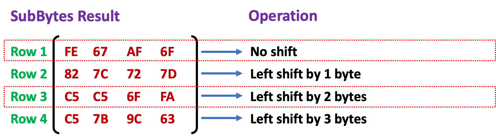

### Main Rounds - Mix Columns

- It transforms each column using matrix multiplication in Galois Field (GF$\textcolor{blue}{(2^8)}$) to ensure that changes to one byte affect all four bytes in the column. 
- This multiplication is not traditional matrix multiplication.
- Each column of the state matrix (consisting of 4 bytes) is treated as a 4-byte vector and is multiplied by a fixed 4 $\times$ 4 matrix
- This is done in GF$(2^8)$ using modulo operations with the irreducible polynomial $x^8+x^4+x^3+x+1$

$$
\begin{array}{c}
\text{\textcolor{purple}{Fixed 4 $\times$ 4}} \\[0.6em]
\begin{pmatrix}
\textcolor{red}{02} & \textcolor{red}{03} & \textcolor{red}{01} & \textcolor{red}{01} \\
\textcolor{red}{01} & \textcolor{red}{02} & \textcolor{red}{03} & \textcolor{red}{01} \\
\textcolor{red}{01} & \textcolor{red}{01} & \textcolor{red}{02} & \textcolor{red}{03} \\
\textcolor{red}{03} & \textcolor{red}{01} & \textcolor{red}{01} & \textcolor{red}{02}
\end{pmatrix}
\end{array}
$$

## Reading Assignment and Optional Group Presentation

Next Lecture  
What is a Galois Field?  
How to compute addition and multiplication in Galois Field (GF).
