## Lecture Outline

1. Review of AES encryption structure
2. ShiftRows transformation in AES
3. MixColumns transformation in AES
4. AddRoundKey transformation

## Learning Outcomes

By the end of this lecture, students should be able to:

1. Describe how rows in the AES state matrix are shifted
2. Describe how columns are transformed using matrix multiplication
3. Understand how AES operations are performed in $GF(2^8)$
4. Perform basic MixColumns calculations using polynomial operations

## Advanced Encryption Standard (AES)

Main Rounds - ShiftRows

It shifts the bytes in each row of the subbytes result to the left by a specific number of positions.

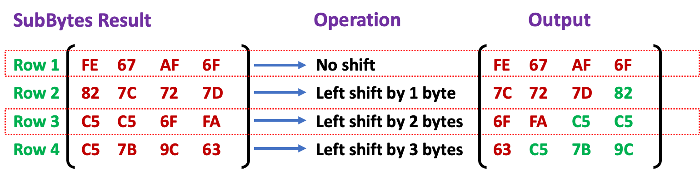

Main Rounds - Mix Columns

- It transforms each column using matrix multiplication in Galois Field ($\textcolor{blue}{GF(2^8)}$) to ensure that changes to one byte affect all four bytes in the column.
- This multiplication is not traditional matrix multiplication.
- Each column of the state matrix (consisting of 4 bytes) is treated as a 4-byte vector and is multiplied by a fixed 4 $\times$ 4 matrix
- This is done in $GF(2^8)$ using modulo operations with the irreducible polynomial $x^8+x^4+x^3+x+1$

$$
\begin{array}{c}
\text{\textcolor{purple}{Fixed 4 $\times$ 4}} \\[0.6em]
\begin{pmatrix}
\textcolor{red}{02} & \textcolor{red}{03} & \textcolor{red}{01} & \textcolor{red}{01} \\
\textcolor{red}{01} & \textcolor{red}{02} & \textcolor{red}{03} & \textcolor{red}{01} \\
\textcolor{red}{01} & \textcolor{red}{01} & \textcolor{red}{02} & \textcolor{red}{03} \\
\textcolor{red}{03} & \textcolor{red}{01} & \textcolor{red}{01} & \textcolor{red}{02}
\end{pmatrix}
\end{array}
$$

---

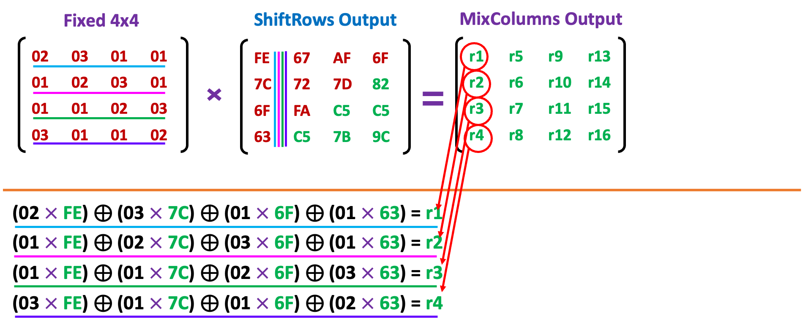

---

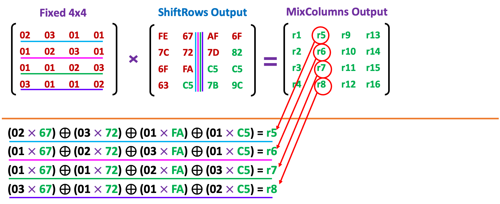

---

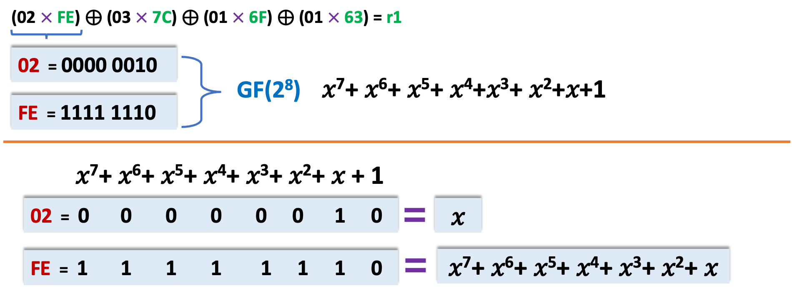
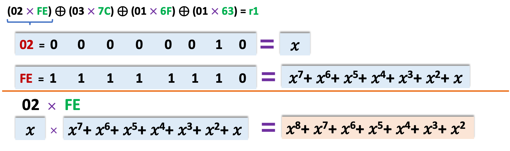

- Convert to binary and Reduce using the irreducible polynomial $\textcolor{blue}{x^8+x^4+x^3+x+1}$

or

- Compute for all, cross out and Reduce using the irreducible polynomial $\textcolor{blue}{x^8+x^4+x^3+x+1}$

$$
(02\,\textcolor{purple}{\times}\,\textcolor{green}{FE}) \oplus (03\,\textcolor{purple}{\times}\,\textcolor{green}{7C}) \oplus (01\,\textcolor{purple}{\times}\,\textcolor{green}{6F}) \oplus (01\,\textcolor{purple}{\times}\,\textcolor{green}{63}) = \textcolor{green}{r1}
$$
$$
\begin{equation}
\textcolor{blue}{GF(2^8)} \hspace{1em} x^7+x^6+x^5+x^4+x^3+x^2+x+1
\end{equation}
$$
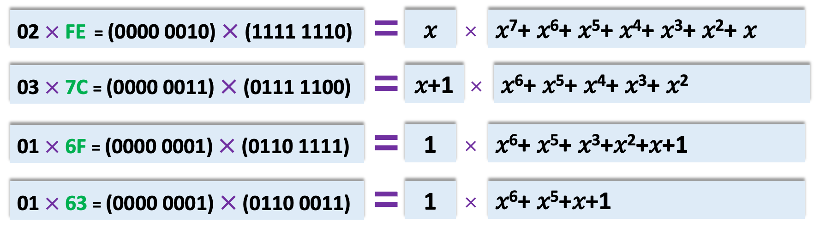
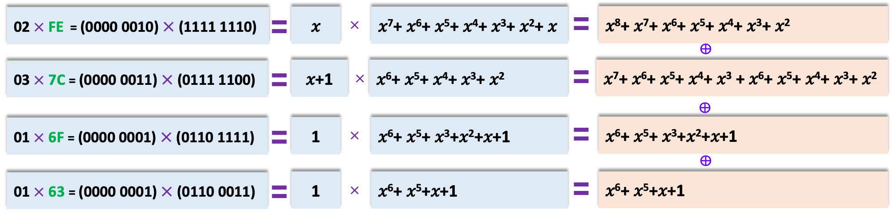
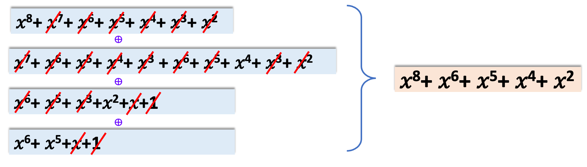

---

- Convert to binary and Reduce using the irreducible polynomial $\textcolor{blue}{x^8+x^4+x^3+x+1}$

$$
(02\,\textcolor{purple}{\times}\,\textcolor{green}{FE}) \oplus (03\,\textcolor{purple}{\times}\,\textcolor{green}{7C}) \oplus (01\,\textcolor{purple}{\times}\,\textcolor{green}{6F}) \oplus (01\,\textcolor{purple}{\times}\,\textcolor{green}{63}) = \textcolor{green}{r1}
$$
$$
\begin{equation}
\textcolor{blue}{GF(2^8)} \hspace{1em} x^7+x^6+x^5+x^4+x^3+x^2+x+1
\end{equation}
$$
$$
\colorbox{#FFE8D6}{$x^8 + x^6 + x^5 + x^4 + x^2$} \; \textcolor{purple}{=} \; \colorbox{#FFE8D6}{$1011110100$}
$$
$$
\colorbox{#FFF3CD}{$x^8 + x^4 + x^3 + x + 1$} \; \textcolor{purple}{=} \; \colorbox{#FFF3CD}{$1000111011$}
$$

---

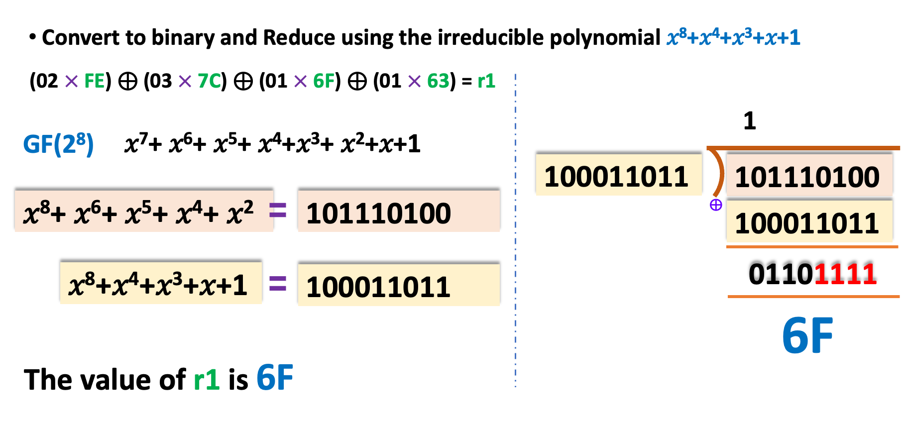

---

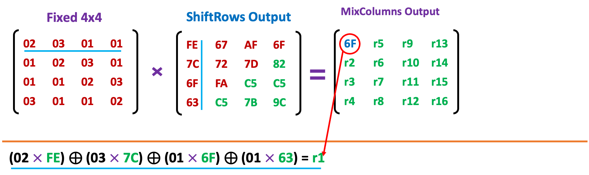

---

Main Rounds – AddRoundKey

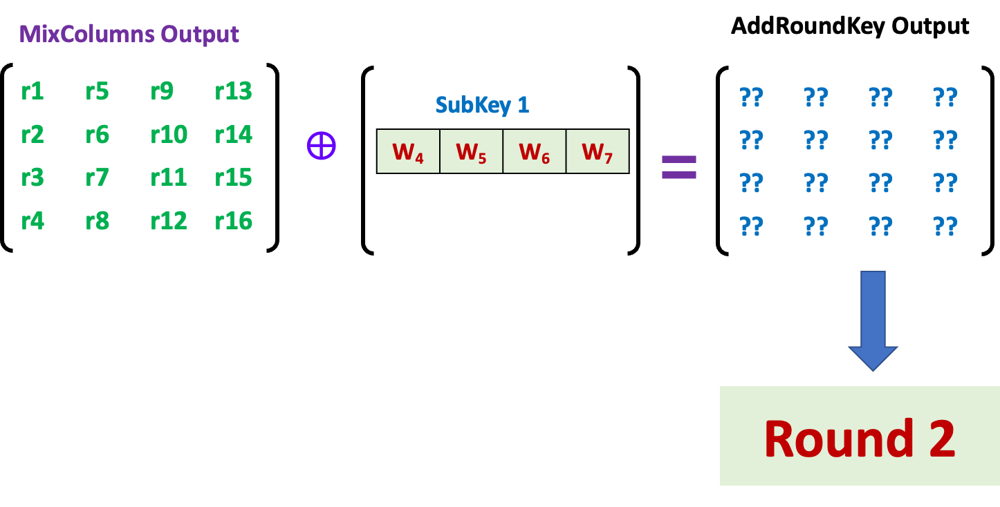

---

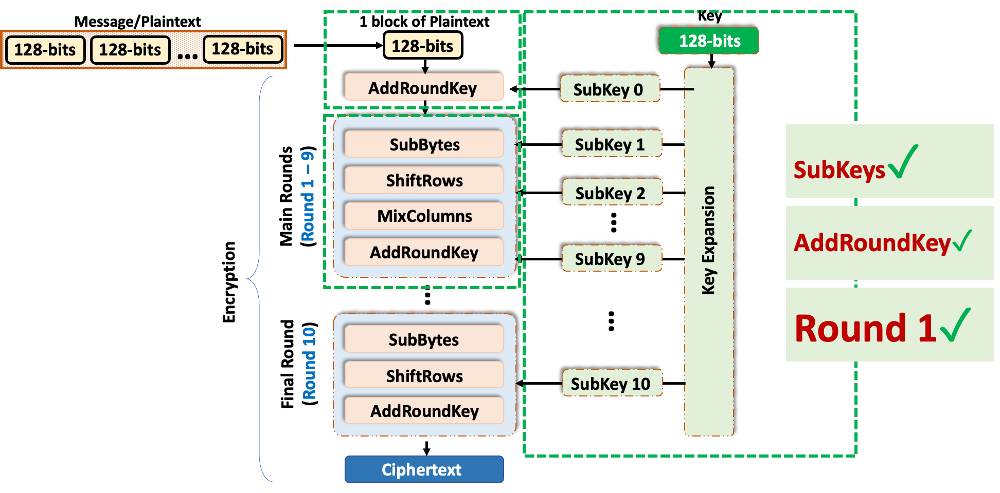
