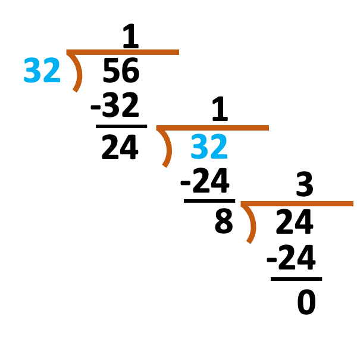
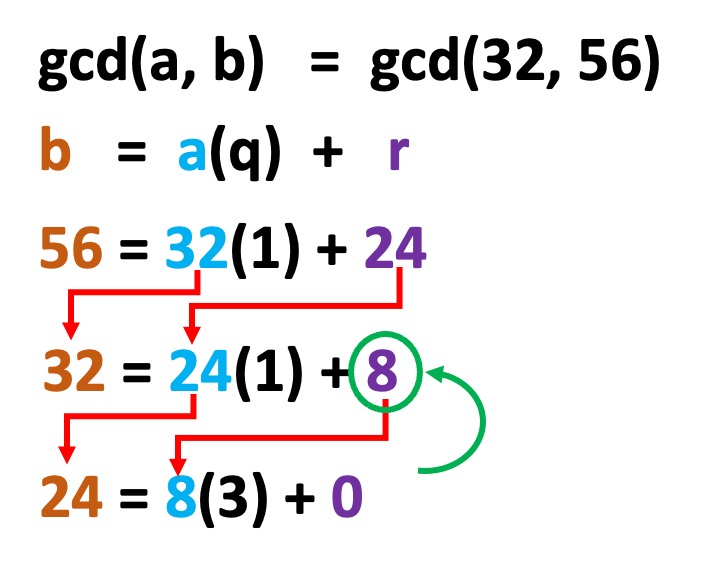
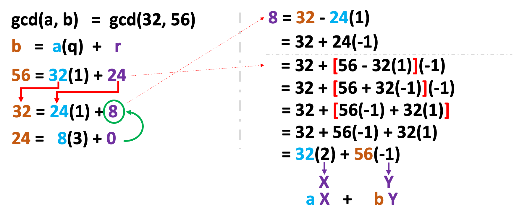
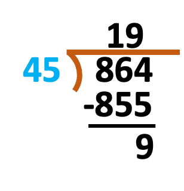

## Lecture Outline

1. Review of basic mathematical concepts used in security
2. Whole number, natural number, factors, prime and composite numbers
3. Greatest Common Divisor (GCD)
4. Euclidean and Extended Euclidean algorithms
5. Co-prime numbers and their properties
6. Introduction to modular arithmetic

## Learning Outcomes

By the end of this lecture, students should be able to:
1. Distinguish between prime and composite numbers
2. Understand what GCD is and how to find it
3. Apply different methods for finding GCD
4. Understand the Euclidean and Extended Euclidean algorithms
5. Identify co-prime numbers
6. Understand the concept of modular arithmetic and perform basic modulo operations

## Review

- Do You Know These Terms?
    - Whole Number
    - Natural Number
    - Factor
    - Prime Number
    - Composite Number
    - Greatest Common Divisor (GCD)
    - Co-Prime
    - Modulus Operator (mod)

### Whole number

- A whole number is any non-negative integer without a decimal component.
- This includes all numbers from 0 upwards: **0, 1, 2, 3, 4, 5,** …….etc.
- Whole numbers are essentially the set of natural numbers including zero.

### Natural number

- A natural number is any integer greater than zero.
- These are members of the set {1, 2, 3, 4, ...}.
- Natural numbers are also known as counting numbers.

### What is a Factor?

- A factor is a number that divides another number completely without leaving a remainder.
- Factors are numbers you multiply together to produce another number.
- Example 1: 4 is a factor of 8 because **8 ÷ 4 = 2** and the remainder is **0**.
- Example 2: For 8, the factors include **1, 2, 4,** and **8**:
    - 8 = 1 × 8 
    - 8 = 2 × 4 
    - 8 = 4 × 2
    - 8 = 8 × 1

### What is a Prime Number?

- A prime number is defined as a number greater than 1 that has **no divisors/factors other than 1 and itself**. 
- A number that can be factored only as 1 times itself is called "prime.“
- <i>1 is not a prime number because it does not have two distinct factors.</i>
- Examples:
    - Example 1: **3** is a prime number because it is greater than 1 and its only factors are **1** and **3** (**3 = 1 × 3**).
    - Example 2: **23** is a prime number because its only factors are 1 and 23 (23 = 1 × 23).

### What is a Composite Number?

- A composite number is a positive integer that has more than two factors.
- This means it can be divided evenly by numbers other than 1 and itself.
- Examples of composite numbers include: **4, 6, 9, 10, 12, 14, 15, 16,** etc.
- Example:
    - 15 is a composite number because it can be factored as:
        - **15 = 1 × 15** 
        - **15 = 3 × 5** 
        - Thus, the factors of 15 are **1, 3, 5,** and **15** itself, exceeding two distinct factors.

## Greatest Common Divisor (GCD)

### What is the Greatest Common Divisor (GCD)?

- The GCD of two or more integers, **none** of which are **zero**, is the **largest positive integer** that divides each of the numbers without any remainder. 
- Consider two numbers 𝑎 and 𝑏. The GCD of these numbers is the highest number that divides both 𝑎 and 𝑏 evenly.
- Example:
    - GCD of **12** and **8**:
        - 1 divides both 12 and 8 (12 ÷ 1 = 12, 8 ÷ 1 = 8)
        - 2 divides both 12 and 8 (12 ÷ 2 = 6, 8 ÷ 2 = 4)
        - 4 divides both 12 and 8 (12 ÷ 4 = 3, 8 ÷ 4 = 2)
    - Thus, the GCD of 12 and 8 is 4, as it is the greatest integer that divides both without leaving a remainder.

### How to find GCD

- There are numerous ways to find GCD of two numbers. These include:
    1. Listing method
    2. Prime factorization method
    3. Long division method
    4. Repeated division method
    5. Euclid’s division algorithm

#### Listing method

- Example:  Find the GCD of **24** and **30** using the listing method. Solution Factors of 24 = **1, 2, 3, 4, 6, 8, 12, 24** Factors of 30 = **1, 2, 3, 5, 6, 10, 15, 30** Common factors of 24 and 30 = **1, 2, 3, 6** GCD of 24 and 30 = **6**

---

- Example:  Find the GCD of **20** and **30** using the listing method. Solution Factors of 20 = **1, 2, 4, 5, 10, 20** Factors of 30 = **1, 2, 3, 5, 6, 10, 15, 30** Common factors of 20 and 30 = **1, 2, 5, 10** GCD of 24 and 30 = 10

#### Long division method

- Example:  Find the GCD of **32** and **56** using the Long division method. Solution

GCD of 32 and 56 = 8

#### Euclid’s division algorithm

- Example: Find the GCD of **32** and **56** using the Euclid’s division algorithm. Solution

The last **non zero** remainder is 8 so the GCD is = 8

#### Extended Euclidean Algorithm

- Example: Find the GCD of **32** and **56** using the Euclid’s division algorithm. Express as linear combination Solution

##### Quiz
Extended Euclidean Algorithm
Example:  Find the GCD of **888** and **54** using the Euclidean Algorithm and Extended. Express as linear combination

## Co-Prime Number

### What is a Co-Prime Number?

- Co-prime numbers are two or more numbers whose greatest common divisor (GCD) is **1**.
- For example, **7** and **8** are co-prime numbers because their GCD is **1**.
Properties of Co-Prime Numbers:
- 1 is co-prime with every other number.
- Prime numbers are co-prime with each other.
- Any two successive numbers (consecutive integers) are always co-prime.
- The sum of any two co-prime numbers is always co-prime with their product.

Example 1:
- **1** and **8**: The GCD of **1** and **8** is **1**.		
- **1** and **98774747**: The GCD of 1 and 98774747 is also **1**, demonstrating that 1 is co-prime with any other number.

Example 2:
- **Prime numbers** are naturally **co-prime to each other**. For instance, 3 and 5 are both prime numbers, and their GCD is 1. Thus, they are co-prime.

Example 3:
- **Any two successive numbers are co-prime.** For example, the GCD of 18 and 19 is 1, making them co-prime. Similarly, 19 and 20 are also co-prime as their GCD is 1.

Example 4:
- A key property of co-prime numbers is that the **sum of any two co-prime numbers is also co-prime with their product**. For instance, consider the numbers 19 and 20:
    - The sum of 19 and 20 is 39.
    - The product of 19 and 20 is 380.
    - The GCD of 39 and 380 is 1, confirming that 19 and 20 are co-prime.

### Quiz: Find the Set of Co-Prime Numbers

- Determine if each pair of numbers is co-prime (i.e., their greatest common divisor is 1): A.24, 36 B.20, 21 C.542, 446 D.765, 345

## Modular Arithmetic

### Division Algorithm

- For any positive integer 𝑛 and any non-negative integer 𝑎, when 𝑎 is divided by 𝑛, it results in an integer quotient 𝑞 and an integer remainder 𝑟 that satisfy the equation:
$$
𝑎 = 𝑞𝑛 + 𝑟 ~~~~~~ where~~0 ≤ 𝑟 < 𝑛
$$

Example:
- Consider dividing 864 by 45:
    - 864 ÷ 45 = 19 remainder 9 
    - Therefore, 864 = 45×19 + 9 
    - This confirms that 𝑎 = 𝑞𝑛 + 𝑟

## Divisor

- A nonzero integer 𝑏 is called a divisor of another integer 𝑎 if 𝑎 = 𝑚 × 𝑏 for some integer 𝑚, meaning 𝑏 divides 𝑎 without leaving a remainder.
- The notation **𝑏∣𝑎** indicates that 𝑏 is a divisor of 𝑎.

Example:
- Dividing 45 by 5: 
    - **45 ÷ 5 = 9**, remainder **0**
    - Thus, **45 = 9 × 5**, confirming **5∣45**

Properties of Divisors:
- **Closure under Multiplication:** If **𝑎∣1**, then **𝑎 = ±1**.
- **Symmetric Property:** If **𝑎∣𝑏** and **𝑏∣𝑎**, then **𝑎 = ±𝑏**. 
- **Zero Divisor:** Any nonzero **𝑏** divides **0** because **0 = 𝑏 × 0**. 
- **Linear Combination:** If **𝑏∣𝑔** and **𝑏∣ℎ**, then 𝑏 divides any linear combination **𝑚𝑔+𝑛ℎ** for integers **𝑚** and **𝑛**. ie. **𝑏∣(𝑚𝑔+𝑛ℎ)**

### Find the Set of Co-Prime Numbers

Proof of Linear Combination Property:
- When we say **𝑏∣𝑔**, it implies **𝑔 = 𝑏 × 𝑘** (this is the property of a divisor). Similarly, if **𝑏∣ℎ**, it implies **ℎ = 𝑏 × 𝑘′** .
- Therefore, for any integers 𝑚 and 𝑛:
    - **𝑚𝑔+𝑛ℎ = 𝑚𝑏𝑘 + 𝑛𝑏𝑘′ = 𝑏(𝑚𝑘+𝑛𝑘′) = 𝑏𝑀**,
- where **𝑀** is an integer given by 𝑀= 𝑚𝑘 + 𝑛𝑘′.

Example of Property 4:
- Let **𝑏=7**, **𝑔=14**, and **ℎ=63**; choose **𝑚=3** and **𝑛=2**.
- To verify:
    - **3𝑔 + 2ℎ = 3×14 + 2×63 = 42 + 126 =168** 
        - **168 =7 × 24  ⟹  7∣168** 
Thus, it is evident that 7∣(3×14 + 2×63).

## Modular Arithmetic

- Modular arithmetic is a system of arithmetic for integers where numbers "**wrap around**" upon reaching a certain value—this modulus. 

Example Using a 12-Hour Clock:
- Let's consider how modular arithmetic works using a 12-hour clock, which is a familiar daily application.

---

- Suppose the current time is 10 o'clock. If I want to meet you in 6 hours, what time will it be?
Calculation:
- Current time = **10**
- Time after **6** hours = **10 + 6 = 16**
- However, on a **12-hour clock**, we calculate **16 mod  12**:
    - Divide **16 by 12**, which equals **1 remainder 4**, or simply, **16 modulo 12 equals 4**.
    - Therefore, we will meet at **4 o'clock**.
- This example shows how, after reaching the maximum of 12, the hours **wrap around to the beginning**, demonstrating the essence of modular arithmetic.

### Quiz Modular Arithmetic

Find the result of the following modulo arithmetic operations:
- `18 mod 12 		= 6`
- `24 mod 12  	    = 0`
- `32 mod 12		= 8`
- `4 mod 12		= 4`
- `8 mod 12		= 8`

### Congruence

- Using this 12-hour clock as an example, if I say, "I want to meet you at 16," this means I want to meet with you at 4 o'clock.
- This can be represented as **16 ≡ 4(mod12)**. 
- This means when you divide 16 by 12, the remainder is 4, thus indicating the time on a 12-hour clock.

### Properties of Congruence

Congruence in modular arithmetic is a relationship between integers indicating that they leave the same remainder when divided by a modulus 𝑛. If 𝑎 and 𝑏 are integers and **𝑛>0**, **𝑎 ≡ 𝑏 mod  𝑛** means 𝑛 divides (𝑎−𝑏) without a remainder.

Example 1:

**16 ≡ 4 mod  12** indicates that 12 divides **16−4=12** evenly.

Reflexivity Property:

**𝑎 ≡ 𝑎 mod  𝑛** for any integer **𝑎**. This is because the difference **𝑎−𝑎=0**, and any number divides zero.

Example 2:

Consider **𝑎=15** and **𝑛=12**, thus **15 ≡ 3 mod  12** since the remainder when **15** is divided by **12** is **3**.

---

Symmetry Property:

If **𝑎 ≡ 𝑏 mod  𝑛**, then **𝑏 ≡ 𝑎 mod  𝑛**. This follows because if 𝑛 divides (𝑎−𝑏), it also divides (𝑏−𝑎)(as 𝑏−𝑎=−(𝑎−𝑏)).

Example of Symmetry:

Since **20 ≡ 30 mod  10**, it follows that **30 ≡ 20 mod  10**, demonstrating that the difference of 20 and 30 (i.e., −10) is also divisible by 10.

Transitivity Property:

If **𝑎 ≡ 𝑏 mod  𝑛** and **𝑏 ≡ 𝑐 mod  𝑛**, then **𝑎 ≡ 𝑐 mod  𝑛**. This property ensures that congruence relations can form equivalence classes under modulo operations.

Proof for Symmetry:

Given **𝑛∣(𝑎−𝑏)** and **𝑛∣(𝑏−𝑎)**, it follows that **𝑛∣((𝑎−𝑏) + (𝑏−𝑎)) = 𝑛∣0**, confirming the symmetry as proved.

### Modular arithmetic Properties

- Property[1]: $\color{blue} (a + b) \bmod n = [(a \bmod n) + (b \bmod n)] \bmod n$

Example: For example, a = 30, b = 12, and n = 5
$$
\begin{aligned}
(30 + 12)\bmod 5 ~ &{\color{red}=} ~ [(30 \bmod 5) + (12 \bmod 5)]\bmod 5 \\
42 \bmod 5 ~ &{\color{red}=} ~ (0 + 2) \bmod 5 \\
\color{green}2 ~ &{\color{red}=} ~ 2 \bmod 5 \\
\implies \qquad 2 ~ &{\color{red}=} ~ 2 \ ({\textcolor{green}{proved}})
\end{aligned}
$$
- $\color{blue} (a − b)\bmod n = [(a \bmod n) − (b \bmod n)]\bmod n$
- $\color{blue} (a ~ × ~ b)\bmod n = [(a \bmod n) ~ × ~ (b \bmod n)]\bmod n$

Example: For example, a = 30, b = 12, and n = 5
$$
\begin{aligned}
(30 \times 12)\bmod 5 ~ &{\color{red}=} ~ [(30 \bmod 5) \times (12 \bmod 5)]\bmod 5 \\
360 \bmod 5 ~ &{\color{red}=} ~ [(0 \times 2) \bmod 5] \\
0 ~ &{\color{red}=} ~ 0 \bmod 5 \implies 0 = 0 \ (\textcolor{green}{proved})
\end{aligned}
$$

### Modular Exponentiation

How to Compute:
- Compute $𝑐 = 𝑎^𝑚 \bmod 𝑛$

Example: $𝑐 =𝑎^{10} \bmod 5$ 
- Key Properties:
    - Multiplicative property: $(𝑥^𝑎)^𝑏=𝑥^{𝑎𝑏}$ 
    - Distributive property over addition: $𝑥^{𝑎+𝑏} = 𝑥^𝑎 × 𝑥^𝑏$ 

---

How to Compute:
- Step by Step Solution for $3^{10} \bmod 5$:
- Calculate $3^2 \bmod 5$:
    - $3^2 = 9$
    - $9 \bmod 5 = 4$
- Calculate $3^4 \bmod 5$ using the square of the result:
    - $(3^2 \bmod 5)^2 = 4^2=16$ 
    - $16 \bmod 5=1$
- Calculate $3^8 \bmod 5$ using the square of $3^4 \bmod 5$:
    - $(3^4 \bmod 5)^2 = 1^2 = 1$ 
- Finally, calculate $3^{10} \bmod 5$:
    - $3^{10} =(3^8×3^2) \bmod 5$
    - $(1×4) mod 5 = 4$
- Conclusion: $3^{10} \bmod 5 = 4$

### Quiz Modular Exponentiation

Compute:
- Compute $2^{34} \bmod 3$
- Compute $3^{30} \bmod 5$
