# Practical Session Plan: Ethical Hacking Phases

## Objective:

To introduce you to ethical hacking by performing basic tasks related to the phases in a controlled environment.

## Phases of Ethical Hacking Continue...

<span style="color: red">Ethical hacking is distributed into six different phases.</span>

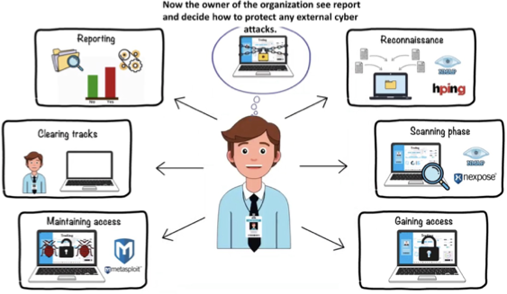

## Phase 1: Reconnaissance

### <span style="color: red">Task1: Perform passive information gathering</span>

- Open your **web browser** and in your search engine (eg www.bing.com) search for `site:example.com filetype:pdf`
- Replace `example.com` with **an actual website**.

| 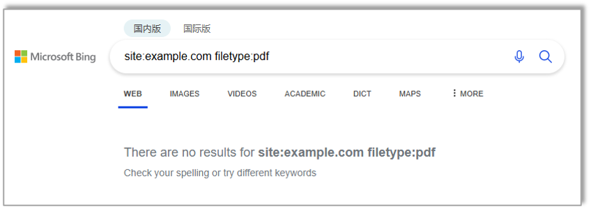<br>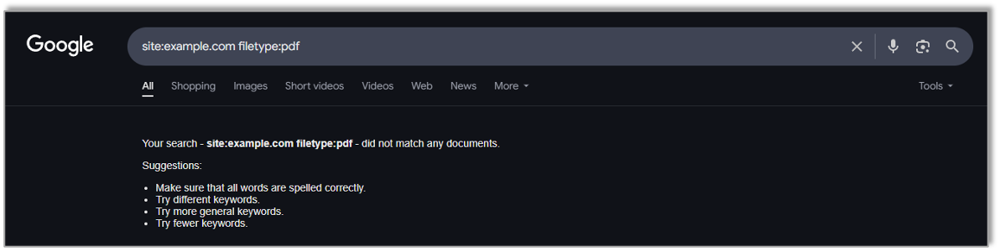 |  |
| ---------------------------------------------------------------------------- | ------------------------------------ |

### <span style="color: red">Task2: Perform passive information gathering with Whois Lookup</span>

1. Download whois from this link https://learn.microsoft.com/en-us/sysinternals/downloads/whois
2. Extract the zip file
3. Open Command Prompt and navigate to (`cd C:\Users\colli\Downloads\WhoIs`) the directory of the extracted
4. Type `whois brookes.ac.uk`

| 1                                    | 2                                    | 3-4                                  |
| ------------------------------------ | ------------------------------------ | ------------------------------------ |
| 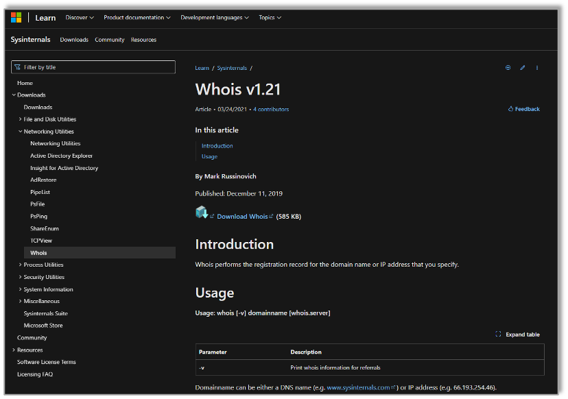 | 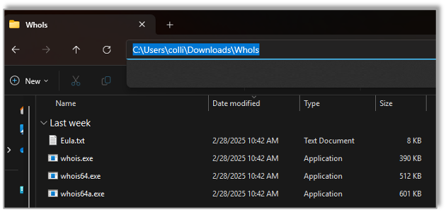 | 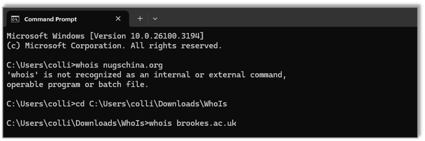 |

### <span style="color: red">Task3: Perform passive information gathering with online tool Netcraft</span>

1. Go to https://sitereport.netcraft.com
2. Type `brookes.ac.uk`

| 1                                    | 2                                    |
| ------------------------------------ | ------------------------------------ |
| 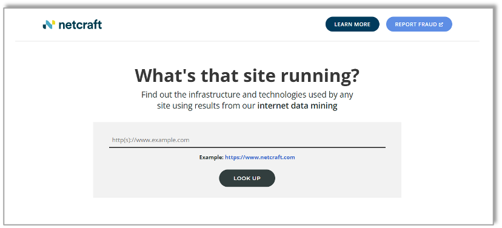 | 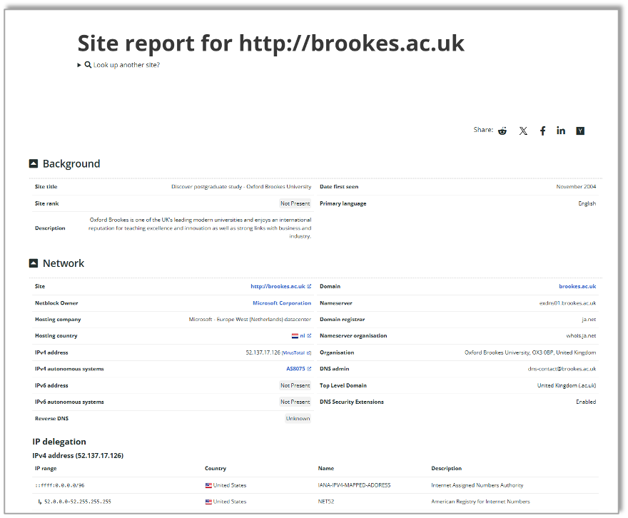 |

## Phase 2: Scanning

### <span style="color: red">Task4: Scan for open ports and vulnerabilities</span>

1. a. Download and Install Angry IP Scanner from https://angryip.org/download

| <span style="color: red">Angry IP Scanner</span> | 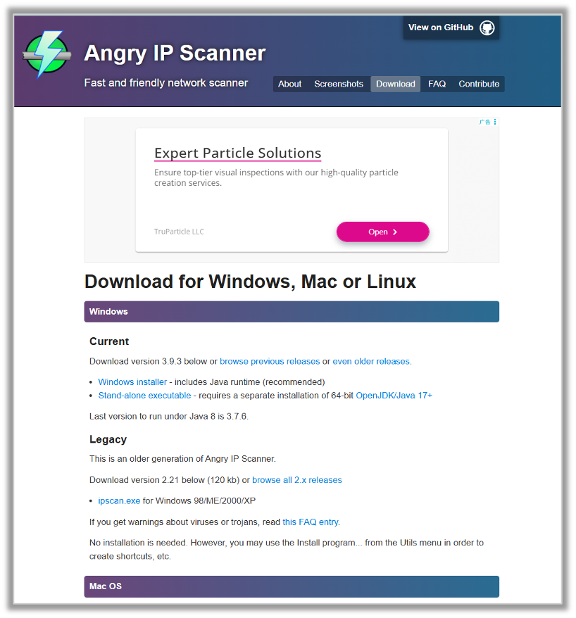 |
| ------------------------------------------------ | ------------------------------------ |

---

1. Scan local devices for open ports and vulnerabilities. 
2. Find the device with IP address 192.168.1.XX in the list
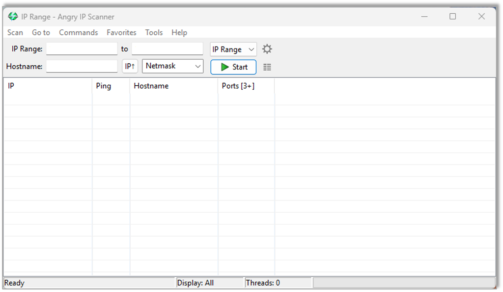

---

| 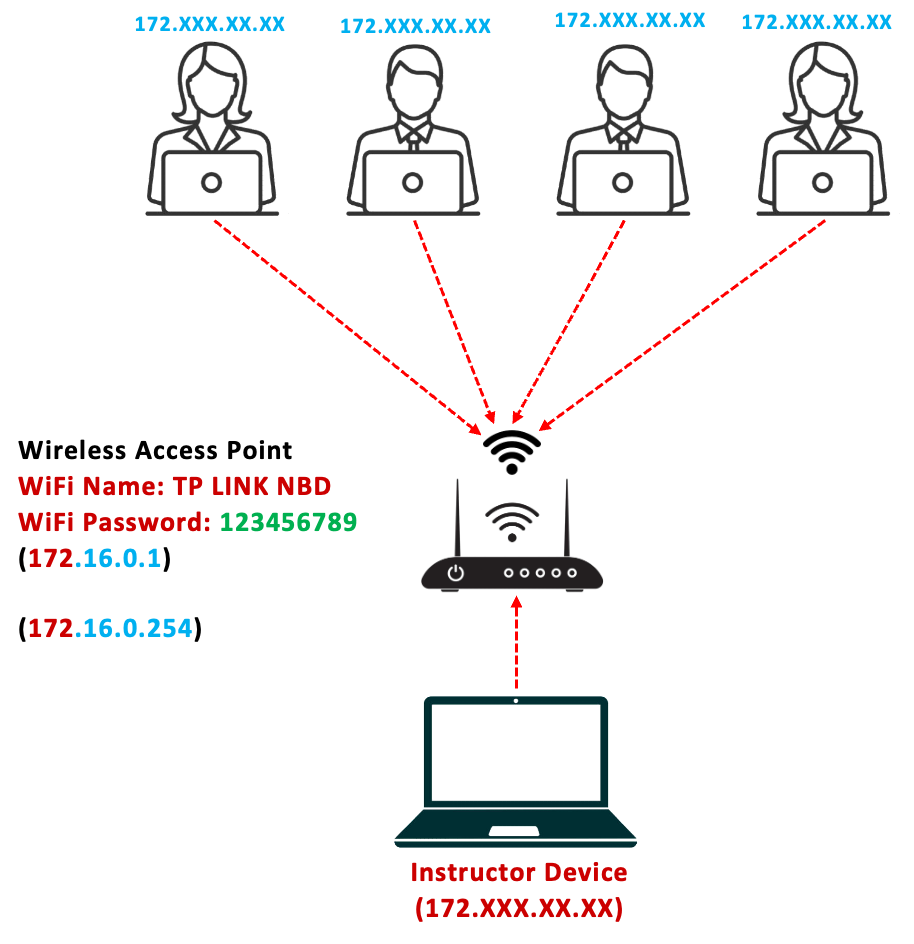 | 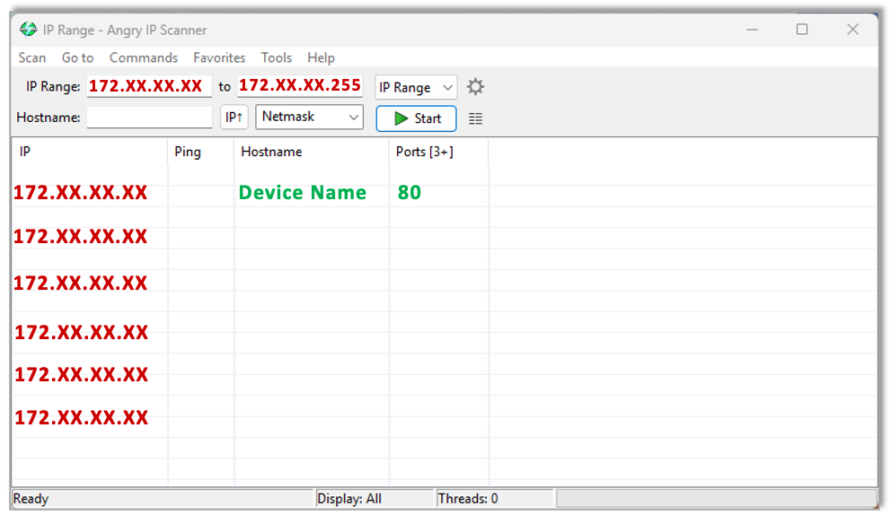 |
| ------------------------------------ | ------------------------------------ |

## Phase 3: Gaining Access (File Services)

### <span style="color: red">Task5: Attempt access public folder or login using weak credentials</span>

1. Attempt to gain access to the public folder of the device with IP address `\\192.168.XX.XX`  in your previous task.
2. Attempt to gain access to the computer as a user using a weak password

| 1                                    | 2                                    |
| ------------------------------------ | ------------------------------------ |
| 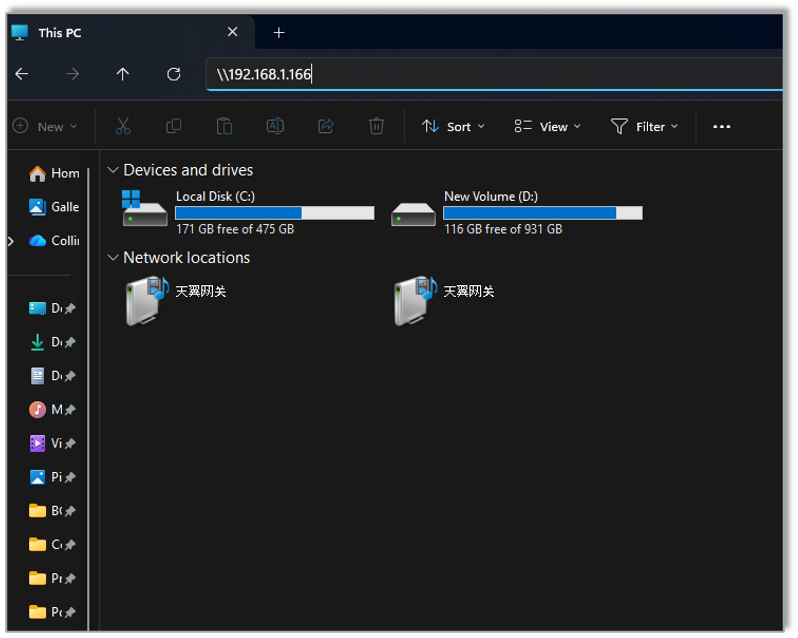 | 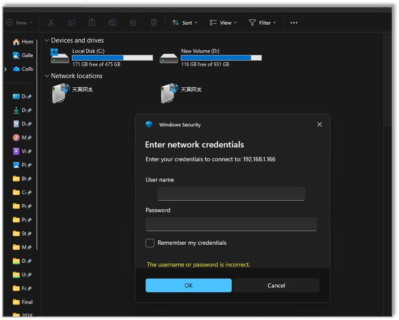 |

## Phase 5: Clearing Tracks

### <span style="color: red">Task5: Clear the Security event logs</span>

If you have been able to gain admin access, Open **PowerShell** on your machine and run:
```powershell
Invoke-Command -ComputerName TARGET_PC -ScriptBlock { wevtutil cl Security }
```
(Replace <i><span style="color: red">TARGET_PC</span></i> with the real **hostname** or **IP**.)
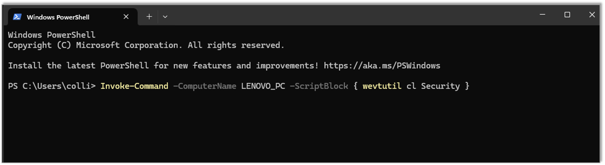

## Phase 6: Reporting

### <span style="color: red">Task6: Document findings</span>

Create a simple report using:
1. Screenshots of scans.
2. A list of open ports and possible vulnerabilities.
3. Security recommendations.

## Gaining Access: (Web Services and Web Data)

Our next session will explore gaining access via web services

| SQL Injection                        |
| ------------------------------------ |
| 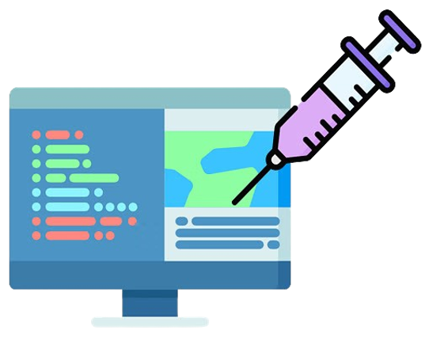 |
