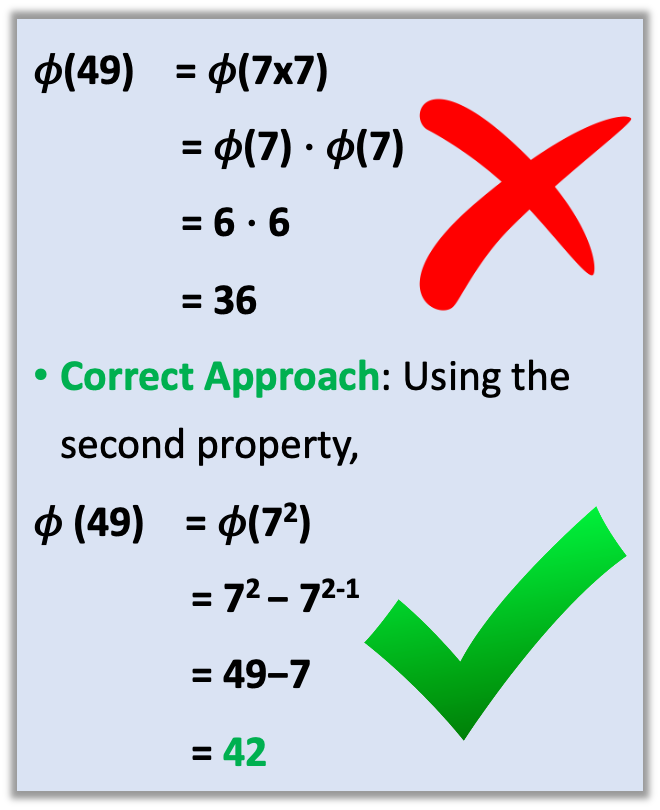

# Fermat’s Theorem and Euler’s Theorem

## Lecture Outline

1. Introduction to Fermat’s Theorem
2. Conditions for applying Fermat’s Theorem
3. Examples of Fermat’s Theorem in modular arithmetic
4. Introduction to Euler’s Totient Function and computing totient values
5. Introduction to Euler’s Theorem
6. Conditions for applying Euler’s Theorem

## Learning Outcomes

By the end of this lecture, students should be able to:
1. Explain the concept of Fermat’s Theorem
2. Identify the conditions required to apply Fermat’s Theorem
3. Apply Fermat’s Theorem to simplify modular exponentiation
4. Define Euler’s Totient Function & Calculate the totient value of a number
5. Apply Euler’s Theorem to solve modular exponentiation problems

## Fermat's Theorem

Before discussing what Fermat's Theorem entails, consider the calculation of $213^{522}\bmod523$. This might seem difficult due to the size of the numbers, but with Fermat's Theorem, we can find a simple solution.  

**The Magic of Fermat's Theorem:**  
The result of $\textcolor{blue}{213^{522}\bmod523}$ is 1.  

**Applying Fermat's Theorem:**  
Fermat’s Theorem states that if p is a prime number and a is an integer not divisible by p, then
$$\textcolor{red}{a^{p-1} \equiv 1 \bmod p}$$
Given <b>523</b> is a **prime number**, any number raised to **522 (which is 523-1)** modulo **523** will result in **1**, according to **Fermat's Theorem**. $\textcolor{blue}{a^{522}\equiv1\bmod523}$

This property exemplifies the theorem's practicality, showing that even without direct calculation, we can determine that $\textcolor{blue}{213^{522} \bmod 523 = 1}$ because $\textcolor{blue}{213^{522}}$ is congruent to $\textcolor{blue}{1^{522}}\bmod\textcolor{blue}{523}$, which simplifies to **1**.

---

<b>Preconditions for Applying Fermat's Theorem:</b>
- Check if p is a prime number: **Fermat's Theorem only applies if p is prime**.
- Ensure a is not divisible by p: a must be an integer that p **does not divide** for the theorem to hold. If these conditions are met, then $\textcolor{red}{a^{p-1} \equiv 1 \bmod p}$

Example:  
Let a=2 and p=3. Since p is **prime** and a is **not divisible by** p, we can apply Fermat's Theorem.  
Calculation:  
Compute $\textcolor{blue}{2^{3-1}\bmod3}$:  
$\textcolor{blue}{2^2 = 4}$  
$\textcolor{blue}{4\bmod3 = 1}$  
Result:  
As expected, $\textcolor{blue}{2^{3-1}\bmod3 = 1}$, proving the theorem's validity in this case.  

---

Example Application  
Given: **a = 2, p = 11**  
**Objective**: Verify the conditions and apply Fermat’s Theorem.  
Conditions:  
p should be a prime number.  
a should not be divisible by p.  
Solution:
**p = 11** is a prime number. **a = 2** is not divisible by **11**. These conditions allow us to apply Fermat's Theorem, which states $\textcolor{red}{a^{p-1} \equiv 1 \bmod p}$.

---

Example (confirming)  
Compute: $\textcolor{blue}{2^{11-1}\bmod11}$  
$\textcolor{blue}{2^{10}\bmod11}$  
Calculating $\textcolor{blue}{2^{10} = 1024}$  
$\textcolor{blue}{1024\bmod11 = 1}$  
Result:
$\mathbf{2^{10}\bmod11 = 1}$, confirming the theorem.

## Euler’s Totient Function

Introduction:  
Euler's totient function, denoted as $\textcolor{blue}{\varphi(n)}$, counts the number of integers between **1** and **$n$ inclusive** that are **co-prime to $n$**. This means they share no common divisors with $n$ other than 1.

Formula:
$$\varphi(n) = \{x \in \mathbb{N} : 1 \le x < n \text{ and } \gcd(x,n) = 1\}$$

Example Calculation - $\mathbf{\varphi(6)}$:
- Consider the integers from 1 to 6: **{1, 2, 3, 4, 5, 6}**.
- Determine which numbers are co-prime to 6 by checking if their **gcd with 6 is 1**:

$\gcd(1,6) = 1$  
$\gcd(2,6) = 2$ (not co-prime)  
$\gcd(3,6) = 3$ (not co-prime)  
$\gcd(4,6) = 2$ (not co-prime)  
$\gcd(5,6) = 1$  
$\gcd(6,6) = 6$ (not co-prime)  

**Result**:
- Only 1 and 5 are co-prime to **6**.
- Therefore, $\textcolor{red}{\varphi(6) = 2}$.

---

Exercise:
- Find the value of $\mathbf{\varphi(9)}$.
- Find the value of $\mathbf{\varphi(12)}$.

---

Properties of Euler’s Totient Function:
- **Prime Numbers**: If $p$ is a prime number, $\gcd(p,q) = 1$ for all $1 \le q < p$. Thus, $\textcolor{blue}{\varphi(p) = p-1}$.
- **Power of Primes**: For a prime number $p$ and any integer $\textcolor{blue}{k \ge 1}$, exactly $\mathbf{ p^{k-1} }$ numbers between **1** and $\mathbf{p^k}$ are divisible by $\mathbf{p}$. This results in: $\textcolor{blue}{ \varphi(p^k)= p^k - p^{k-1} }$.
- **Product of Co-prime Numbers**: If $\textcolor{blue}{a}$ and $\textcolor{blue}{b}$ are relatively prime, then $\textcolor{blue}{\varphi(ab) = \varphi(a) \cdot \varphi(b)}$

---

First Property of Euler’s Totient Function:
- **Prime Numbers**: If $p$ is a prime number, $\gcd(p,q)=1$ for all $1 \le q < p$. Thus, $\textcolor{blue}{\varphi(p) = p-1}$.
Example: Understanding $\mathbf{\varphi(5)}$ through simple computation:
- The set **{1,2,3,4,5}** includes integers less than 5. 
- $\mathbf{\gcd(1,5) = \gcd(2,5) = \gcd(3,5) = \gcd(4,5) = 1}$; $\gcd(5,5)=5$.
- Thus, four numbers are co-prime with **5**, resulting in $\mathbf{\varphi(5)=4}$.

Clarification using $\mathbf{\varphi(23)}$:
- For prime number 23, every number from 1 to 22 is co-prime with 23.
- Thus, $\mathbf{\varphi(23)= 23 - 1 = 22}$.

---

Second Property of Euler’s Totient Function:
- **Power of Primes**: For a prime number $\textcolor{blue}{p}$ and any integer $\textcolor{blue}{k \ge 1}$, exactly $p^{k-1}$ **numbers** between **1** and $\mathbf{p^k}$ are divisible by $\mathbf{p}$. This results in: $\textcolor{blue}{ \varphi(p^k)= p^k - p^{k-1} }$.

Example: Calculate $\mathbf{\varphi(2^3)}$:
- Theorem: From $\textcolor{blue}{ \varphi(p^k)= p^k - p^{k-1} }$, for $\mathbf{p=2}$ and $\mathbf{k=3}$, we have:  $\mathbf{\varphi(2^3) = 2^3 - 2^{3-1} = 8 - 4 = 4}$
- Verification: Considering the set **{1, 2, 3, 4, 5, 6, 7, 8}**, the numbers **co-prime with 8** are **1, 3, 5, 7**.
- The **$\gcd$ of 1, 3, 5, 7 with 8 is 1**, confirming that $\textcolor{red}{\varphi(8) = 4}$.

---

Third Property of Euler’s Totient Function:
- **Product of Co-prime Numbers**: If $\textcolor{blue}{a}$ and $\textcolor{blue}{b}$ are relatively prime, then $\textcolor{blue}{\varphi(ab) = \varphi(a) \cdot \varphi(b)}$.
- Example: Calculate $\mathbf{\varphi(15)}$ where $\mathbf{a = 3}$ and $\mathbf{b = 5}$  (since $\gcd(3,5)=1$, 3 and 5 are relatively prime):
- Calculation: From the properties,
$$\mathbf{\varphi(15) = \varphi(3) \cdot \varphi(5) = (3-1) \cdot (5-1) = 2 \cdot 4 = 8}$$

Important Note: $\textcolor{blue}{a}$ and $\textcolor{blue}{b}$ must be distinct and co-prime for this property to apply.  
For instance, $\mathbf{\varphi(49)}$, which is $\mathbf{7^2}$, should be calculated using the property for prime powers, not as $\mathbf{\varphi(7) \cdot \varphi(7)}$:
- Correct Approach: Using the second property,
$$\mathbf{ \varphi (49) = \varphi(7^2) = 7^2 - 7^{2-1} = 49 - 7 = \textcolor{red}{42} }$$

- **Product of Co-prime Numbers**: If $\textcolor{blue}{a}$ and $\textcolor{blue}{b}$ are relatively prime, then $\textcolor{blue}{\varphi(ab) = \varphi(a) \cdot \varphi(b)}$.

Another Example: Calculate **$\varphi(6)$**, where $6=2\times3$:  
Calculation: Since **2** and **3** are co-prime, 
$$\mathbf{ \varphi(6)= \varphi(2) \cdot \varphi(3) = 1 \cdot 2 = \textcolor{red}{2} }$$

---

Assignment: Complete these exercise and submit during seminar class
- Calculate the Euler's Totient Function $\varphi(n)$ for the given numbers:
1. $\varphi(20)$ 
2. $\varphi(21)$ 
3. $\varphi(19)$ 
4. $\varphi(95)$ 
5. $\varphi(55)$ 
6. $\varphi(29)$ 
7. $\varphi(101)$ 
8. $\varphi(47)$ 

> Show how you computed your answers.  
> Only handwritten solutions.  
> No copy-paste will be accepted.

## Euler’s Theorem

- It states that if $\textcolor{blue}{a}$ and $\textcolor{blue}{m}$ are co-prime (i.e., $\mathbf{\gcd(a,m)=1}$), then $a$ raised to the power of Euler's totient function $\mathbf{\varphi(m)}$ is congruent to **1 modulo $m$**:
$$\textcolor{red}{a^{\varphi(m)} \equiv 1 \bmod m}$$
For the given example where $\mathbf{a=3}$ and $\mathbf{m=10}$:
- **Checking if co-prime**:
    - The gcd of **3** and **10** is **1**, which confirms that **3** and **10** are **co-prime**.
- Apply Euler's Theorem: 
    - We first calculate $\mathbf{\varphi(10)}$, where $\mathbf{10 = 2 \times 5}$, and using the formula for Euler’s Totient function,
    - Calculation of $\varphi(10)$: Since 10 is the product of two distinct prime numbers, $\varphi(10)$ is calculated as:  $\mathbf{\varphi(ab) = \varphi(a) \cdot \varphi(b)}$ $\mathbf{\varphi(10) = \varphi(2) \cdot \varphi(5) = (2-1) \cdot (5-1) = 1 \times 4 = 4}$
    - Now from $\textcolor{red}{a^{\varphi(m)} \equiv 1 \bmod m}$ we show that $\textcolor{red}{3^4 \equiv 1 \bmod 10}$ $3^4\bmod10 = 81\bmod10 = 1\bmod10$
This confirms that $\mathbf{3^4\equiv1\bmod10}$, thus validating Euler's Theorem. 

## Assignment

Complete this exercise and submit during seminar class  
Find a number between 0 and 16 congruent to $\textcolor{red}{5^{234}\bmod17}$ using Fermat's Little Theorem and Modular Exponentiation.
