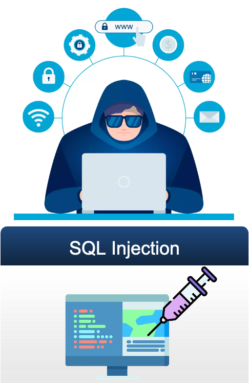
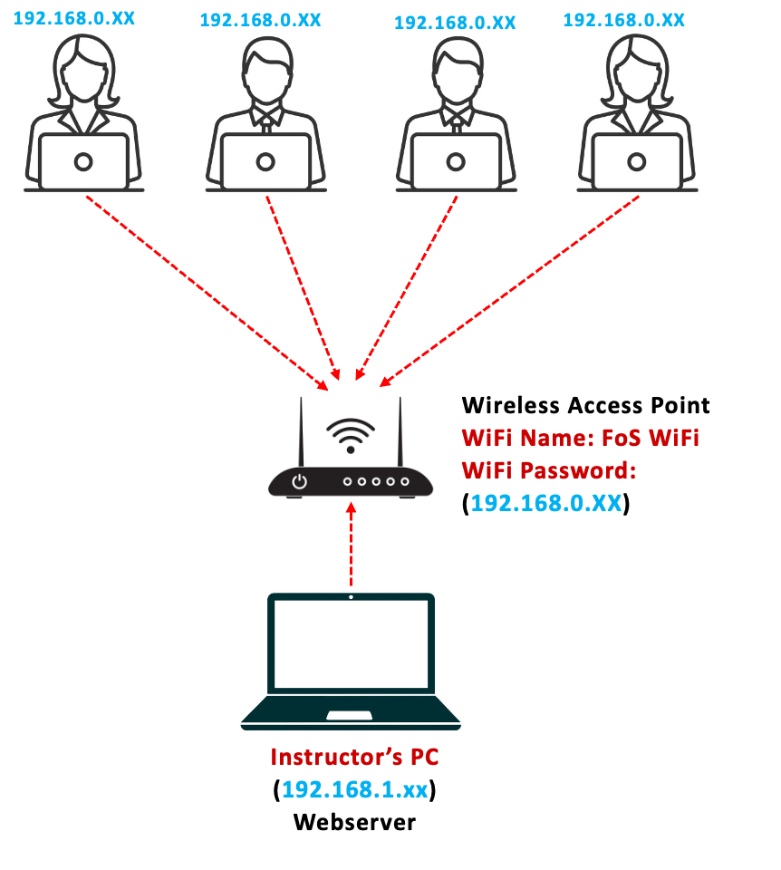
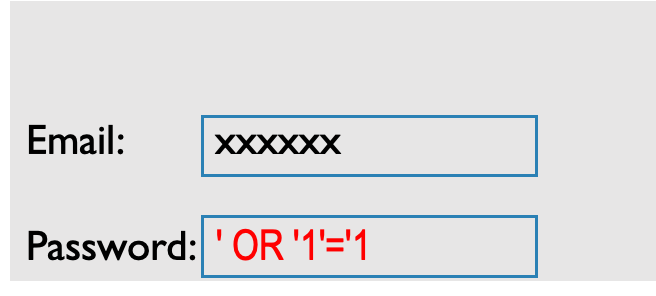
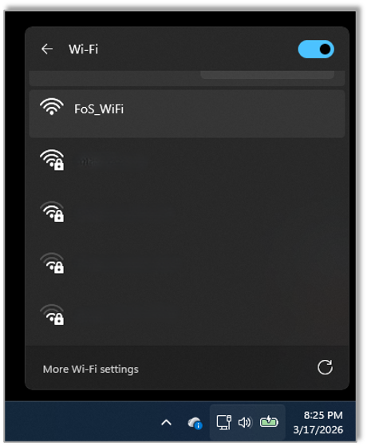
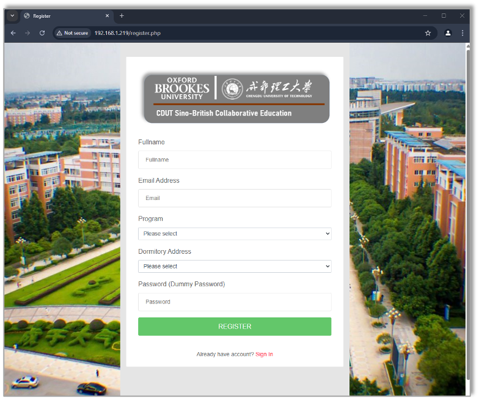
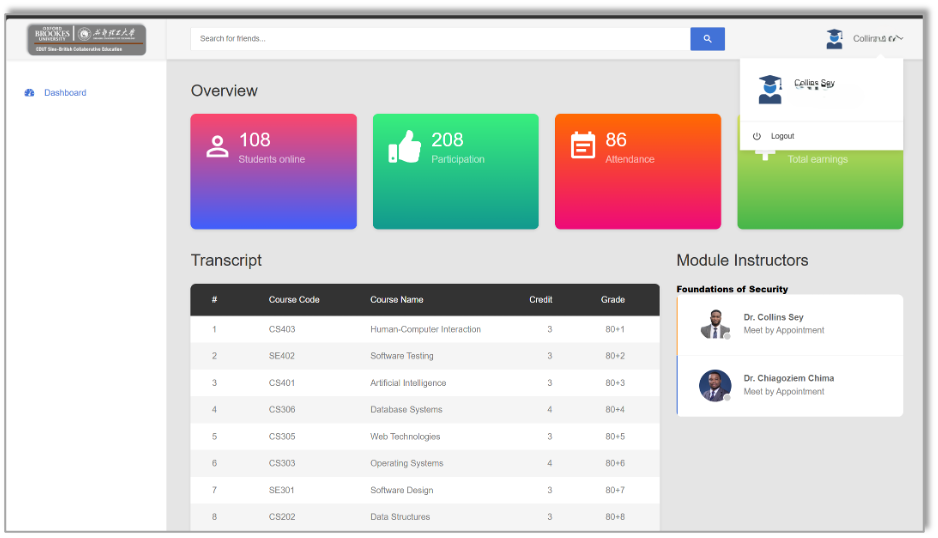

# SQL Injection (1)

## Objective

To introduce you to SQL injection attack, identify and demonstrate common SQL injection attacks, understand the underlying mechanisms that allow these attacks to succeed, and apply best practices in software development to prevent SQL injection vulnerabilities in web applications.


## <span style="color: red">Exploiting Databases Through Code Insertion</span>

### <span style="color: blue">What is it</span>

A type of attack where an attacker exploits vulnerabilities in a web application's input fields to execute malicious SQL commands. These commands allow attackers to interact with a database in unauthorized ways, often leading to data breaches or system compromise.

### <span style="color: blue">How does it happen</span>

Attackers enter malicious SQL code into input fields (e.g., login forms, search boxes).  
The application processes this input without proper validation.

### <span style="color: blue">Example</span>

Bypassing Authentication (login page)  
Extracting Data.

## <span style="color: red">Setup</span>



## <span style="color: red">Tautology Based Injection</span>

Using logical operations that always return true to manipulate query logic.

```sql
SELECT * FROM users WHERE username='anything' OR '1'='1';
```

This injection uses a tautology (**'1'='1'** is always true) to bypass authentication logic and can potentially retrieve user records.

<span style="color: blue">System query</span>

```sql
SELECT * FROM students WHERE email = 'useremail' AND password = 'password';
```

<span style="color: blue">Attacker’s input</span>


<span style="color: blue">Resulting query</span>

```sql
SELECT * FROM students WHERE email = 'xxxxxx' AND password = '' OR '1'='1';
```

## <span style="color: red">Task1: Connect to the Wireless Access Point/Router</span>

1) Connect to the Wireless Access Point / Router as provided by the instructor (WiFi Name & Password will be provided)
2) Open you browser and enter the **IP address (will be provided by the instructor)** of the Webserver PC in your **browser** and hit "Enter"
3) Access the demo web application interface

| 1                                    | 2-3                                  |
| ------------------------------------ | ------------------------------------ |
|  |  |

## <span style="color: red">Task2: Sign up on the web application</span>



## <span style="color: red">Task3: Login to the web application using your registered details. Logout after successful login</span>

|  |  |
| ------------------------------------ | ------------------------------------ |

## <span style="color: red">Task4: Perform a Tautology Based SQL Injection to bypass the login authentication without your registered account</span>


