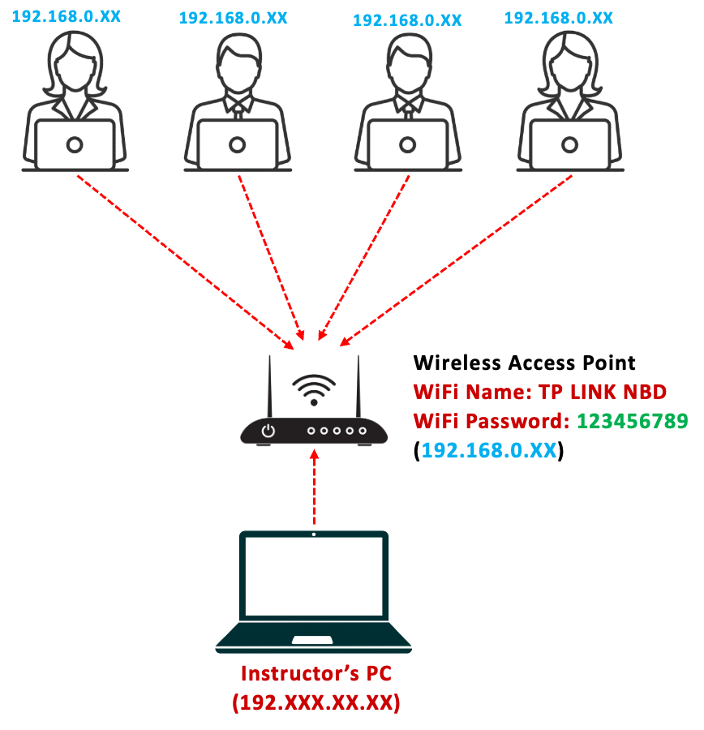
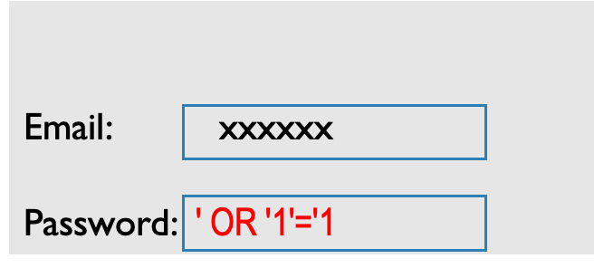

# SQL Injection (2)

## Objective

To demonstrate and test the effectiveness of Tautology-Based SQL Injection in extracting data from a vulnerable database by manipulating SQL queries to always evaluate as true.

## <span style="color: red">Setup</span>



## <span style="color: red">Tautology Based Injection</span>

Using logical operations that always return true to manipulate query logic.

```sql
SELECT * FROM users WHERE username='anything' OR '1'='1';
```

This injection uses a tautology (`'1'='1'` is always true) to bypass authentication logic and can potentially retrieve user records.

<span style="color: blue">System query</span>

```sql
SELECT * FROM students WHERE email = 'useremail' AND password = 'password';
```

<span style="color: blue">Attacker’s input</span>


<span style="color: blue">Resulting query</span>

```sql
SELECT * FROM students WHERE email = 'xxxxxx' AND password = '' OR '1'='1';
```

## <span style="color: red">Task1: Connect to the Wireless Access Point/Router</span>

1) Connect to the Wireless Access Point/ Router as provided by the instructor (WiFi Name & Password will be provided)
2) Open your browser and enter the **IP address (will be provided by the instructor)** of the Webserver PC in your browser and hit “Enter”
3) Access the demo web application interface

## <span style="color: red">Task2: Perform a Tautology Based SQL Injection to Extract Data (Retrieve all registered students – friends) from the university portal</span>


## <span style="color: red">Avoiding Tautology Based SQL Injection</span>

### <span style="color: aqua">Use Prepared Statements and Parameterized Queries</span>

This is one of the most effective defenses against SQL injection. By using prepared statements, the SQL code and the data are bound separately, ensuring that the data is treated only as data and not executable code. Both PDO (PHP Data Objects) and MySQLi in PHP support prepared statements.

### <span style="color: aqua">Whitelist Input Validation</span>

Validate and sanitize user inputs to ensure they conform to expected and allowed formats. For example, if a field expects a number, ensure the input is a number. This doesn’t prevent SQL injection by itself but is a good additional layer of defense.

### <span style="color: aqua">Escape All User Inputs</span>

If you're not using prepared statements or stored procedures, escaping user inputs is a must to ensure that special characters in the input don't lead to malicious SQL being executed.

## <span style="color: red">Avoiding Tautology Based SQL Injection</span>

dash_b
```php {3}
$sql_searchlist = "SELECT * FROM students WHERE Student_Name LIKE '%$std_name%'";
// SQL injection prone
$result_searchlist = $conn->query($sql_searchlist);
if ($result_searchlist->num_rows > 0)
{
```

dash_n
```php {3}
$sql_searchlist = "SELECT * FROM students WHERE Student_Name LIKE CONCAT('%', ?, '%')";
// Prepare a parameterized SQL statement
$sql_searchlist = $conn->prepare($sql_searchlist);

// Bind the user input to the prepared statement
$sql_searchlist->bind_param("s", $std_name);

// Execute the prepared statement
$sql_searchlist->execute();

// Retrieve the results
$result_searchlist = $sql_searchlist->get_result();
if ($result_searchlist->num_rows > 0)
{
```
