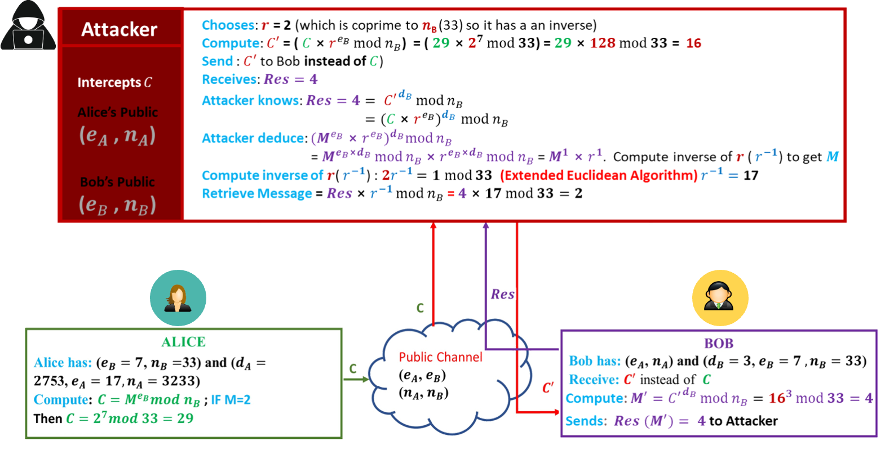
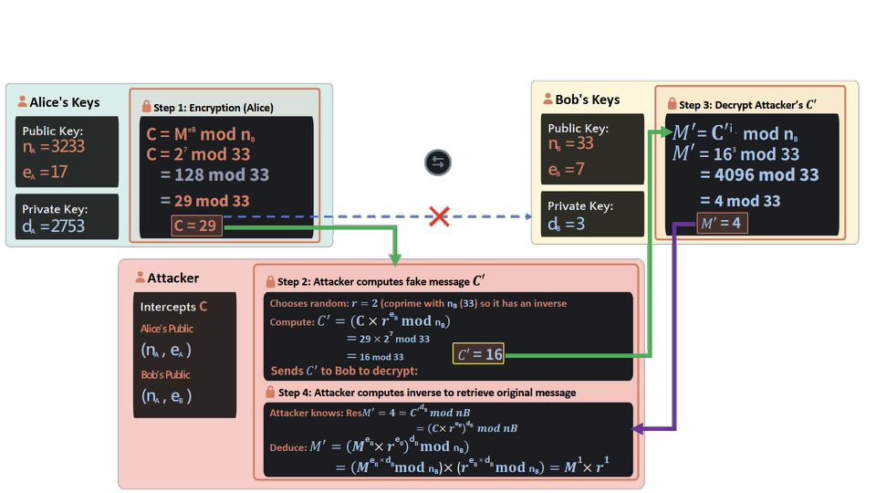

## Lecture Outline

1. Review of RSA cryptographic algorithm
2. Public key and Private key generation in RSA
3. RSA encryption and decryption process
4. Introduction to Chosen Ciphertext Attack (CCA) on RSA
5. Understanding how attackers exploit decryption systems

## Learning Outcomes

By the end of this lecture, students should be able to:
1. Explain the RSA key generation process
2. Identify the steps for generating public and private keys
3. Apply the Extended Euclidean Algorithm to compute the private key
4. Perform RSA encryption and decryption
5. Explain the concept of chosen ciphertext attacks on RSA

## Key Generation

| 1. Select Primes                                                           | 2. Compute $n$                                                                   | 3. Calculate $\phi(n)$                                                       | 4. Choose $e$                                                                      | 5. Compute $d$                                                                   |
| -------------------------------------------------------------------------- | -------------------------------------------------------------------------------- | ---------------------------------------------------------------------------- | ---------------------------------------------------------------------------------- | -------------------------------------------------------------------------------- |
| Choose two **large prime numbers** $p$ and $q$. These must be kept secret. | Calculate the **modulus $n$** by multiplying p and q. This is part of both keys. | Compute **Euler's totient function** using the formula $(p-1) \times (q-1)$. | Select **public exponent $e$** where $1 < e < \phi(n)$ and $\gcd(e, \phi(n)) = 1$. | Calculate **private exponent $d$** as the modular multiplicative inverse of $e$. |
| $p, q = primes$                                                            | $n = p \times q$                                                                 | $\phi(n) = (p-1)(q-1)$                                                       | $1 < e < \phi(n)$ $\gcd(e, \phi(n)) = 1$                                        | $(d × e) \equiv 1 \bmod \phi(n)$                                                 |

| Public Key                            | Private Key                           |
| ------------------------------------- | ------------------------------------- |
| $(n,~ e)$ Share freely with anyone | $(n,~ d)$ Keep secret at all times |

## Public Key Generation

### Public Keys of Alice

  

    <!-- Alice 卡片 -->
    

      

        
🤵🏼‍♀️

        

          
Alice

          
Sender

        

      

      

        

          
💬 Wants to send a message

          
Alice needs to encrypt her message  so only Bob can read it.

        

        

          
🔑 Needs a key pair

          
She must generate public and  private keys for encryption.

        

        

          
📤 Shares public key

          
Her public key can be shared with  anyone, including Bob.

        

      

    

    <!-- 中间安全通道 -->
    

      
↔️

      

        
Secure Channel

        
End-to-end encryption

      

    

    <!-- Bob 卡片 -->
    

      

        
🤵🏻

        

          
Bob

          
Receiver

        

      

      

        

          
📩 Wants to receive message

          
Bob needs to decrypt Alice's message  securely.

        

        

          
🔑 Needs a key pair

          
He must also generate public and  private keys.

        

        

          
🔒 Keeps private key secret

          
His private key must never be shared  with anyone.

        

      

    

  

### Public Keys of Alice & Bob

Both parties generate their public keys simultaneously

  

    <!-- Alice 卡片 -->
    

      <!-- 头部 -->
      

        

          👩
        

        
Alice

      

      <!-- 步骤内容 -->
      

        <!-- 步骤 1 -->
        

          

            1
            Select Prime Numbers
          

          

            PA = 61, 
            QA = 53
          

        

        <!-- 步骤 2 -->
        

          

            2
            Calculate modulus n
          

          

            nA = PA × QA 
            = 61 × 53 = 3233
          

        

        <!-- 步骤 3 -->
        

          

            3
            Choose Public Exponent e
          

          

            

              eA must satisfy: 
              ✓ 1 &lt; eA &lt; φ(nA) 
              ✓ gcd(eA, φ(nA)) = 1 
              eA = 17
            

            

              
Calculate Euler's Totient Function

              φ(nA) = (PA - 1) × (QA - 1) 
              = (61 - 1) × (53 - 1) = 60 × 52 = 3120
            

          

        

        <!-- 公钥 -->
        

          

            🔑
            Alice's Public Key
          

          

            (nA = 3233, eA = 17)
          

        

      

    

    <!-- 中间连接图标 -->
    

        
⇄

    

    <!-- Bob 卡片 -->
    

      <!-- 头部 -->
      

        

          👨
        

        
Bob

      

      <!-- 步骤内容 -->
      

        <!-- 步骤 1 -->
        

          

            1
            Select Prime Numbers
          

          

            PB = 3, 
            QB = 11
          

        

        <!-- 步骤 2 -->
        

          

            2
            Calculate modulus n
          

          

            nB = PB × QB 
            = 3 × 11 = 33
          

        

        <!-- 步骤 3 -->
        

          

            3
            Choose Public Exponent e
          

          

            

              eB must satisfy: 
              ✓ 1 &lt; eB &lt; φ(nB) 
              ✓ gcd(eB, φ(nB)) = 1 
              eB = 7
            

            

              
Calculate Euler's Totient Function

              φ(nB) = (PB - 1) × (QB - 1) 
              = (3 - 1) × (11 - 1) = 2 × 10 = 20
            

          

        

        <!-- 公钥 -->
        

          

            🔑
            Bob's Public Key
          

          

            (nB = 33, eB = 7)
          

        

      

    

  

### Public Keys of Alice

Mathematical constraints for selecting the public exponent e

  

    <!-- 卡片1：Range Constraint -->
    

      <!-- 标题栏 -->
      

        
1

        
Range Constraint

      

      <!-- 核心公式块 -->
      

        
e must be:

        
1 &lt; e &lt; φ(n)

      

      <!-- 列表项 -->
      

        

          ✓
          Greater than 1
        

        

          ✓
          Less than φ(n) (Euler's totient)
        

      

      <!-- 底部说明 -->
      

        Why:
        Ensures e is in the valid multiplicative group
      

    

    <!-- 卡片2：Co-prime Condition -->
    

      <!-- 标题栏 -->
      

        
2

        
Co-prime Condition

      

      <!-- 核心公式块 -->
      

        
e must be co-prime with φ(n):

        
gcd(e, φ(n)) = 1

      

      <!-- 列表项 -->
      

        

          ✓
          No common factors with φ(n)
        

        

          ✓
          Ensures multiplicative inverse exists
        

      

      <!-- 底部说明 -->
      

        Why:
        Required for the decryption key to exist
      

    

    <!-- 卡片3：Modular Inverse -->
    

      <!-- 标题栏 -->
      

        
3

        
Modular Inverse

      

      <!-- 核心公式块 -->
      

        
e × d ≡ 1 (mod φ(n))

        
Must have a multiplicative inverse d

      

      <!-- 列表项 -->
      

        

          ✓
          d is the private key
        

        

          ✓
          <b>Found using Extended Euclidean Algorithm</b>
        

      

      <!-- 底部说明 -->
      

        Why:
        Enables encryption/decryption symmetry
      

    

  

  

    <!-- Alice's φ(n) 模块 -->
    

      
Alice's φ(n)

      
φ(3233) = 3120

    

    <!-- 分隔线 -->
    

    <!-- Bob's φ(n) 模块 -->
    

      
Bob's φ(n)

      
φ(33) = 20

    

    <!-- 分隔线 -->
    

    <!-- 公式提示模块 -->
    

      💡
      
Formula: φ(n) = (p-1) × (q-1)

    

  

## Private Key of Alice

  

    <!-- Alice 左侧卡片 -->
    

      <!-- 头部 -->
      

        
👩

        

          
Alice

          
Private Key Calculation

        

      

      <!-- 公钥信息块 -->
      

        
Public Values

        

          nA = 3233 
          eA = 17
        

      

      <!-- 素数因子块 -->
      

        
Prime Factors

        

          PA = 61 
          QA = 53
        

      

      <!-- 欧拉函数计算块 -->
      

        
Calculate Euler's Totient Function

        

          φ(nA) = (PA - 1) × (QA - 1) 
          = (61 - 1) × (53 - 1) = 60 × 52 = 3120
        

      

      <!-- 私钥展示块 -->
      

        
Private Key

        
dA = 2753

      

    

    <!-- 右侧分步计算卡片 -->
    

      <!-- 标题 -->
      
Step-by-Step Calculation

      <!-- 步骤1：同余方程 -->
      

        
1

        

          
Set Up the Congruence Equation

          

            Find dA such that: 
            eA × dA ≡ 1 (mod φ(nA)) 
            17 × dA ≡ 1 (mod 3120)
          

        

      

      <!-- 步骤2：扩展欧几里得算法（已修正） -->
      

        
2

        

          
Apply Extended Euclidean Algorithm

          

            

              3120 = 17(183) + 9 
              17 = 9(1) + 8 
              9 = 8(1) + 1 
              8 = 1(8) + 0 
              
Working backwards to find the inverse...

            

            

              1 = 9 + 8(-1) 
              1 = 9 + [17 + 9(-1) ] (-1) 
              1 = 9 + 17 (-1) + 9(1) 
              1 = 17 (-1) + 9(2) 
              1 = 17 (-1) + [3120 + 17(-183)](2)
            

            

              1 = 17 (-1) + [3120(2) + 17(-366)] 
              1 = 17 (-1) + 3120(2) + 17(-366) 
              1 = 17 (-367) + 3120(2) 
              

                3120 + (-367) = 2753
              

            

          

        

      

      <!-- 步骤3：私钥解 -->
      

        
3

        

          
Solution: Private Key

          
dA = 2753

          

            Verification: 17 (2753) = 46801 mod 3120 = 3120(15) + 1  mod 3120 ✓
          

        

      

    

  

  

    <!-- Alice 私钥模块 -->
    

      🔒
      

        Alice's Private Key: 
        dₐ = 2753
        (Keep Secret!)
      

    

    <!-- 分隔线 -->
    

    <!-- 用途说明模块 -->
    

      🔑
      Used for decrypting messages
    

  

## Private Key of Bob

  

    <!-- Bob 左侧卡片 -->
    

      <!-- 头部 -->
      

        
👨

        

          
Bob

          
Private Key Calculation

        

      

      <!-- 公钥信息块 -->
      

        
Public Values

        

          nB = 33 
          eB = 7
        

      

      <!-- 素数因子块 -->
      

        
Prime Factors

        

          PB = 3 
          QB = 11
        

      

      <!-- 欧拉函数计算块 -->
      

        
Calculate Euler's Totient Function

        

          φ(nB) = (PB - 1) × (QB - 1) 
          = (3 - 1) × (11 - 1) = 2 × 10 = 20
        

      

      <!-- 私钥展示块 -->
      

        
Private Key

        
dB = 3

      

    

    <!-- 右侧分步计算卡片 -->
    

      <!-- 标题 -->
      
Step-by-Step Calculation

      <!-- 步骤1：同余方程 -->
      

        
1

        

          
Set Up the Congruence Equation

          

            Find dB such that: 
            eB × dB ≡ 1 (mod φ(nB)) 
            7 × dB ≡ 1 (mod 20)
          

        

      

      <!-- 步骤2：扩展欧几里得算法 -->
      

        
2

        

          
Apply Extended Euclidean Algorithm

          

            

              20 = 7(2) + 6 
              7 = 6(1) + 1 
              6 = 1(6) + 0 
              
Working backwards to find the inverse...

            

            

              1 = 7 + 6(-1) 
              1 = 7 + [20 + 7(-2) ] (-1) 
              1 = 7 + [20(-1) + 7(2)] 
              1 = 7(3) + 20(-1)
            

          

        

      

      <!-- 步骤3：私钥解 -->
      

        
3

        

          
Solution: Private Key

          
dB = 3

          

            Verification: 7 (3) = 21 mod 20 = 1 mod 20 ✓
          

        

      

    

  

  

    <!-- Bob 私钥模块 -->
    

      🔒
      

        Bob's Private Key: 
        dB = 3
        (Keep Secret!)
      

    

    <!-- 分隔线 -->
    

    <!-- 用途说明模块 -->
    

      🔑
      Used for decrypting messages
    

  

## Key Pairs Summary

  

    <!-- Alice 卡片 -->
    

      <!-- 头部 -->
      

        
👩

        
Alice

      

      <!-- 公钥区域 -->
      

        🔓
        Public Key
        SHARE
      

      

        

          Modulus n
          3233
        

        

          Exponent e
          17
        

      

      <!-- 私钥区域 -->
      

        🔒
        Private Key
        SECRET
      

      

        

          Exponent d
          2753
        

      

      <!-- 素数因子区域 -->
      

        
Prime Factors (Secret)

        

          

            
p

            
61

          

          

            
q

            
53

          

        

      

    

    <!-- Bob 卡片 -->
    

      <!-- 头部 -->
      

        
👨

        
Bob

      

      <!-- 公钥区域 -->
      

        🔓
        Public Key
        SHARE
      

      

        

          Modulus n
          33
        

        

          Exponent e
          7
        

      

      <!-- 私钥区域 -->
      

        🔒
        Private Key
        SECRET
      

      

        

          Exponent d
          3
        

      

      <!-- 素数因子区域 -->
      

        
Prime Factors (Secret)

        

          

            
p

            
3

          

          

            
q

            
11

          

        

      

    

  

## RSA Encryption & Decryption

With their key pairs generated, Alice and Bob can now securely exchange encrypted messages. The foundation of RSA encryption is established.

  

    <!-- 头像容器：固定定位，完美对齐左右卡片正上方 -->
    

      
👩

      
👨

    

    <!-- 三张卡片：总宽度 880px，与头像宽度完全一致 -->
    

      

        
✈️

        
Alice Encrypts

        
Using Bob's public key

      

      

        
↔️

        
Secure Transfer

        
Encrypted message sent

      

      

        
🔒

        
Bob Decrypts

        
Using his private key

      

    

  

## Encryption & Decryption

### Encryption and Decryption Process

  

    <!-- 加密模块卡片 -->
    

      <!-- 头部 -->
      

        
🔒

        
Encryption

      

      <!-- 说明文本 -->
      

        The sender uses the recipient's public key (n, e) to encrypt  the plaintext message M into ciphertext C.
      

      <!-- 公式块 -->
      

        
Formula:

        
C = Me mod n

      

      <!-- 变量说明列表 -->
      

        

          
C

          
Ciphertext (encrypted message)

        

        

          
M

          
Plaintext message (as number)

        

        

          
e

          
Public exponent

        

        

          
n

          
Modulus (part of public key)

        

      

    

    <!-- 解密模块卡片 -->
    

      <!-- 头部 -->
      

        
🔓

        
Decryption

      

      <!-- 说明文本 -->
      

        The recipient uses their private key (n, d) to decrypt the  ciphertext C back into the original plaintext message M.
      

      <!-- 公式块 -->
      

        
Formula:

        
M = Cd mod n

      

      <!-- 变量说明列表 -->
      

        

          
M

          
Recovered plaintext message

        

        

          
C

          
Ciphertext (encrypted message)

        

        

          
d

          
Private exponent (secret)

        

        

          
n

          
Modulus (same as public key)

        

      

    

  

> [!DANGER] Security Guarantee
> Only the holder of the private key d can decrypt the message. Even if an attacker knows the public key (n, e) and intercepts the ciphertext C, they cannot compute d without factoring n into p and q — a computationally infeasible task for large keys.

### Encryption and Decryption Process

  

    <!-- 左侧：密钥信息总览 -->
    

      <!-- Alice 密钥卡片 -->
      

        

          👤Alice's Keys
        

        

          
Public Key:

          
nA = 3233, eA = 17

        

        

          
Private Key:

          
dA = 2753

        

      

      <!-- Bob 密钥卡片 -->
      

        

          👤Bob's Keys
        

        

          
Public Key:

          
nB = 33, eB = 7

        

        

          
Private Key:

          
dB = 3

        

      

      <!-- 消息卡片 -->
      

        

          ✉️Message to Send
        

        
M = 2

      

    

    <!-- 右侧：加密解密步骤 -->
    

      <!-- 加密步骤 -->
      

        

          🔒Step 1: Encryption (Alice)
        

        

          Alice uses Bob's public key to encrypt the message:
        

        

          

            C = MeB mod nB 
            C = 27 mod 33 
            = 128 mod 33 
            = 29 mod 33
          

          
Ciphertext 
C = 29

          

        

      

      <!-- 解密步骤 -->
      

        

          🔓Step 2: Decryption (Bob)
        

        

          Bob uses his private key to decrypt:
        

        

          

            M = CdB mod nB 
            M = 293 mod 33 
            = 24389 mod 33 
            = 2 mod 33
          

          

            Recovered Message 
M = 2

          

        

      

    

  

## Quiz

  

    <!-- 左侧：密钥信息总览 -->
    

      <!-- Alice 密钥卡片 -->
      

        

          👤Alice's Keys
        

        

          
Public Key:

          
nA = 3233, eA = 17

        

        

          
Private Key:

          
dA = 2753

        

      

      <!-- Bob 密钥卡片 -->
      

        

          👤Bob's Keys
        

        

          
Public Key:

          
nB = 33, eB = 7

        

        

          
Private Key:

          
dB = 3

        

      

      <!-- 消息卡片 -->
      

        

          ✉️Message to Send
        

        
M = 5

      

    

    <!-- 右侧：加解密步骤 -->
    

      <!-- 加密步骤 -->
      

        

          🔒Step 1: Encryption (Alice)
        

        

          Alice uses Bob's public key to encrypt the message:
        

        

          

            C = MeB mod nB 
            C = 57 mod 33 
            = 78125 mod 33 
            = 14 mod 33
          

          

            Ciphertext 
C = 14

          

        

      

      <!-- 解密步骤 -->
      

        

          🔓Step 2: Decryption (Bob)
        

        

          Bob uses his private key to decrypt:
        

        

          

            M = CdB mod nB 
            M = 143 mod 33 
            = 2744 mod 33 
            = 5 mod 33
          

          

            Recovered Message 
M = 5

          

        

      

    

  

## Chosen Ciphertext Attacks (CCA) on RSA Algorithm

The Chosen Ciphertext Attack (CCA) on the RSA algorithm is a type of cryptographic attack where the attacker uses the decryption capabilities of a system/users to decrypt messages by choosing a series of ciphertexts and **using the results to deduce the plaintext** or the encryption key.

### Chosen Ciphertext Attack on RSA

Normal RSA Communication Flow

  

    <!-- 顶部：Alice + 中间大模块 + Bob -->
    

      <!-- Alice 卡片 -->
      

        
👩

        
Alice

        
Sender

        

          
Has Bob's Public Key:

          
(eB, nB)

        

      

      <!-- 中间大容器（加长加宽，完美对齐） -->
      

        <!-- 消息加密整体包裹圆角矩形 -->
        

          

            
Message M

            
2

          

          →
          

            Encryption C = MeB mod nB
          

          →
          

            
Ciphertext C

            
29

          

        

        <!-- Public Channel -->
        

          ☁️ Public Channel (Encrypted)
        

      

      <!-- Bob 卡片（左边缘与 Decryption 卡片严格对齐） -->
      

        
👨

        
Bob

        
Receiver

        

          
Has Private Key:

          
(dB, nB)

        

      

    

    <!-- 底部步骤卡片 -->
    

      

        

          
1

          
Encryption

        

        
Alice uses Bob's public key to encrypt  message M:

        
C = 27 mod 33 = 29

      

      

        

          
2

          
Transmission

        

        
Ciphertext C travels through the public channel.  Even if intercepted, it's unreadable without the  private key.

      

      

        

          
3

          
Decryption

        

        
Bob uses his private key to decrypt:

        
M = 293 mod 33 = 2

      

    

  

## Public Keys of Alice

  

    <!-- Alice 卡片 -->
    

      <!-- 头部 -->
      

        
👩

        

          
Alice

          
Sender

        

      

      <!-- 密钥生成块 -->
      

        
Key Generation

        

          PA = 61, QA = 53 
          nA = 3233 
          φ(nA) = 3120 
          eA = 17 
          dA = 2753
        

      

      <!-- 拥有的权限块 -->
      

        
Has Access To

        

          

            🔑
            Own keys
          

          

            🌍
            Bob's public key
          

        

      

      <!-- 消息块 -->
      

        
Message to Send

        
M = 2

      

    

    <!-- Attacker 卡片 -->
    

      <!-- 头部 -->
      

        
👤

        

          
Attacker

          
Adversary

        

      

      <!-- 攻击能力块 -->
      

        
Capabilities

        

          

            👁️
            Intercepts all traffic
          

          

            📝
            Modifies messages
          

          

            🔑
            Knows public keys
          

        

      

      <!-- 攻击参数块 -->
      

        
Attack Parameters

        

          Chooses:
          r = 2
          
(coprime to nB = 33)

        

      

      <!-- 目标块 -->
      

        
Goal

        

          Recover M without dB
        

      

    

    <!-- Bob 卡片 -->
    

      <!-- 头部 -->
      

        
👨

        

          
Bob

          
Receiver

        

      

      <!-- 密钥生成块 -->
      

        
Key Generation

        

          PB = 3, QB = 11 
          nB = 33 
          φ(nB) = 20 
          eB = 7 
          dB = 3
        

      

      <!-- 拥有的权限块 -->
      

        
Has Access To

        

          

            🔑
            Own private key
          

          

            🔓
            Alice's public key
          

        

      

      <!-- 接收消息块 -->
      

        
Receives

        
C' = 16

        
(not the original C)

      

    

  

> [!DANGER] Attack Setup
> Alice wants to send message M=2 to Bob. The attacker intercepts the communication and substitutes ciphertext C with manipulated C'

## Chosen Ciphertext Attack on RSA

---

---

  

    <!-- Attacker 信息卡片 -->
    

      
Attacker

      

        Intercepts C 
        Alice's Public 
        (nA, eA) 
        Bob's Public 
        (nB, eB)
      

    

    <!-- Attacker 完整计算步骤 -->
    

      <!-- Step 2: Compute fake C' -->
      

        
🔒 Step 2: Attacker computes fake message C'

        

          

            Chooses random: r = 2 (coprime with nB(33) so it has an inverse) 
            Compute: C' = (C × reB mod nB) 
            &nbsp;&nbsp;&nbsp;&nbsp;&nbsp;&nbsp;&nbsp;&nbsp;= 29 × 27 mod 33 
            &nbsp;&nbsp;&nbsp;&nbsp;&nbsp;&nbsp;&nbsp;&nbsp;= 16 mod 33 
            Sends C' to Bob to decrypt:
          

          
C' = 16

        

      

      <!-- Step 4: 完整逆元计算+消息还原 -->
      

        
🔒 Step 4: Attacker computes inverse to retrieve original message

        <!-- 推导部分 -->
        

          Attacker knows: ResM' = 4 = C'dBmod nB 
          &nbsp;&nbsp;&nbsp;&nbsp;&nbsp;&nbsp;&nbsp;&nbsp;&nbsp;&nbsp;&nbsp;&nbsp;&nbsp;&nbsp;&nbsp;&nbsp;&nbsp;&nbsp;= (C×reB)dBmod nB 
          Deduce: M' = (MeB×reB)dBmod nB 
          &nbsp;&nbsp;&nbsp;&nbsp;&nbsp;&nbsp;&nbsp;&nbsp;&nbsp;= (MeB×dBmod nB)×(reB×dBmod nB) = M1×r1
        

        <!-- 逆元计算部分（红框内容） -->
        

          Compute inverse of r to get M: M1 × r1 (r-1)  
          Inverse: 2 (r-1) ≡ 1 mod nB 
          &nbsp;&nbsp;&nbsp;&nbsp;&nbsp;&nbsp;&nbsp;&nbsp;= r-1 = 17
        

        <!-- 最终还原消息部分 -->
        

          Retrieve M: Res × 17 mod nB 
          &nbsp;&nbsp;&nbsp;&nbsp;&nbsp;&nbsp;&nbsp;&nbsp;= 4 × 17 mod 33 
          &nbsp;&nbsp;&nbsp;&nbsp;&nbsp;&nbsp;&nbsp;&nbsp;= 68 mod 33 
          &nbsp;&nbsp;&nbsp;&nbsp;&nbsp;&nbsp;&nbsp;&nbsp;= 2
        

      

    

  

---

  

    <!-- 左侧列：步骤1-3 -->
    

      <!-- 步骤1：Alice Encrypts -->
      

        

          
1

          
Alice Encrypts

        

        

          Alice encrypts M=2 using Bob's public key (eB=7, nB=33):
        

        

          C = MeB mod nB 
          C = 27 mod 33 = 29
        

      

      <!-- 步骤2：Attacker Intercepts -->
      

        

          
2

          
Attacker Intercepts

        

        

          Attacker captures C=29 and chooses r=2 (coprime to 33):
        

        

          C' = (C × reB) mod nB 
          C' = (29 × 27) mod 33 
          C' = (29 × 128) mod 33 = 16
        

      

      <!-- 步骤3：Attacker Sends C' -->
      

        

          
3

          
Attacker Sends C'

        

        

          Attacker forwards C' = 16 to Bob instead of the original C = 29
        

      

    

    <!-- 右侧列：步骤4-6 -->
    

      <!-- 步骤4：Bob Decrypts C' -->
      

        

          
4

          
Bob Decrypts C'

        

        

          Bob decrypts using his private key (dB=3, nB=33):
        

        

          Res = C'dB mod nB 
          Res = 163 mod 33 = 4
        

      

      <!-- 步骤5：Bob Sends Result -->
      

        

          
5

          
Bob Sends Result

        

        

          Bob sends Res=4 back (thinking it's related to the original message):
        

        

          Res = 4
        

      

      <!-- 步骤6：Attacker Recovers M -->
      

        

          
6

          
Attacker Recovers M

        

        

          Attacker computes r-1 mod 33 = 17 using Extended Euclidean Algorithm:
        

        

          M = Res × r-1 mod nB 
          M = 4 × 17 mod 33 
          M = 2 ✓
        

      

    

  

  

    <!-- 原始消息 -->
    

      
Original Message

      
M = 2

    

    <!-- 箭头 -->
    
→

    <!-- 攻击者还原结果 -->
    

      
Attacker Recovered

      
M = 2

    

    <!-- 攻击成功标签 -->
    

      
✓

      
Attack Successful!

    

  

## Assignment

Assignment: Complete this exercise and submit during seminar class

| Alice’s Public key: $\textcolor{red}{𝑛_𝐴 = 3233}$ and $\textcolor{red}{𝑒_𝐴=17}$ Alice’s Private key: $\textcolor{blue}{𝑑_𝐴} = 2753$ | Bob’s Public key: $\textcolor{red}{𝑛_B = 33}$ and $\textcolor{red}{𝑒_B = 7}$ Bob’s Private key: $\textcolor{blue}{𝑑_B} = 3$ |
| -------------------------------------------------------------------------------------------------------------------------------------------- | --------------------------------------------------------------------------------------------------------------------------------- |

Task:  
If Alice wants to send the message $\textcolor{blue}{𝑀 = 5}$ to Bob, perform the chosen ciphertext attack and retrieve the original message if the attacker chooses random number $\textcolor{blue}{r = 2}$. Show the following:  
Modified Ciphertext (C′): \_\_\_\_\_\_\_\_\_\_\_\_\_  
Bob’s Response: \_\_\_\_\_\_\_\_\_\_\_\_\_  
Attacker’s Recover Process: \_\_\_\_\_\_\_\_\_\_\_\_\_  

> Show how you computed your answers.  Only handwritten solutions.  No copy-paste will be accepted.

## Security Strength & Key Sizes

  

    <!-- 第一行：NIST推荐 + 安全基础 -->
    

      <!-- 左上：NIST密钥长度推荐 -->
      

        

          📏 NIST Recommendations for RSA Key Sizes
        

        <!-- 2048-bit RSA -->
        

          

          

            

              
2048-bit RSA

              

                Security: ~112 bits | Status: Acceptable until 2030
              

            

            

              Current Standard
            

          

        

        <!-- 3072-bit RSA -->
        

          

          

            

              
3072-bit RSA

              

                Security: ~128 bits | Status: For beyond 2030
              

            

            

              Recommended
            

          

        

        <!-- 4096-bit RSA -->
        

          

          

            

              
4096-bit RSA

              

                Security: Higher | Use: Long-term protection, root CAs
              

            

            

              Maximum Security
            

          

        

      

      <!-- 右上：安全基础 -->
      

        

          🛡️ Security Foundation
        

        

          RSA's security relies on the computational difficulty of factoring  large numbers
        

        

          

            Easy: Multiply two 1024-bit primes
          

          

            Hard: Factor the 2048-bit product
          

          

            Time: Billions of years with classical computers
          

        

      

    

    <!-- 第二行：量子威胁 + 安全原则 -->
    

      <!-- 左下：量子计算威胁 -->
      

        

          ⚛ Quantum Computing Threat
        

        

          RSA is vulnerable to Shor's algorithm, which can factor large numbers  efficiently on a quantum computer. Current estimates:
        

      

      <!-- 右下：关键安全原则 -->
      

        

          ⚠️ Key Security Principles
        

        

          

            
✓

            Keep private keys absolutely secret
          

          

            
✓

            Use minimum 2048-bit keys
          

          

            
✓

            Rotate keys periodically
          

          

            
✓

            Use secure padding schemes (OAEP)
          

        

      

    

  

## Applications

  

    <!-- 第一行：HTTPS + 数字签名 + 邮件加密 -->
    

      <!-- HTTPS/SSL/TLS -->
      

        

          
🌐

          

            
HTTPS/SSL/TLS

          

        

        

          RSA is used in X.509 certificates to secure web  browsing. When you see the padlock icon, RSA  is likely protecting your connection.
        

        

          

          

            Usage: 90%+ of websites
          

        

      

      <!-- Digital Signatures -->
      

        

          
ᝰ.

          

            
Digital Signatures

          

        

        

          RSA provides authentication and  non-repudiation. Signers cannot deny their  signatures, and recipients can verify authenticity.
        

        

          

          

            Usage: Code signing, document signing
          

        

      

      <!-- Email Encryption -->
      

        

          
✉️

          

            
Email Encryption

          

        

        

          Protocols like S/MIME and PGP use RSA to  encrypt emails, ensuring only intended  recipients can read them.
        

        

          

          

            Usage: Secure corporate email
          

        

      

    

    <!-- 第二行：文件传输 + 软件签名 + 混合方案 -->
    

      <!-- Secure File Transfer -->
      

        

          
🔄

          

            
Secure File Transfer

          

        

        

          SFTP, FTPS, and VPNs use RSA for key  exchange and authentication, protecting data  in transit.
        

        

          

          

            Usage: Enterprise file sharing
          

        

      

      <!-- Software Signing -->
      

        

          
&lt;/&gt;

          

            
Software Signing

          

        

        

          Developers digitally sign software to prove  authenticity and integrity. Users can verify  software hasn't been tampered with.
        

        

          

          

            Usage: OS updates, app stores
          

        

      

      <!-- Hybrid Approach -->
      

        

          
💡

          

            
Hybrid Approach

          

        

        

          RSA is computationally intensive.  In practice, RSA encrypts symmetric keys  (like AES), which then encrypt large data  efficiently.
        

        

          Benefit: Best of both worlds
        

      

    

  

> [!INFO] INFO
> This week dose have seminar class, which theme is phishing, but teacher didn't provide seminar material, so no separate seminar article this week.
