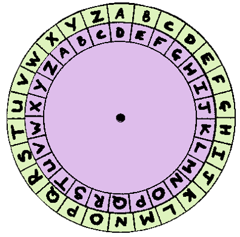
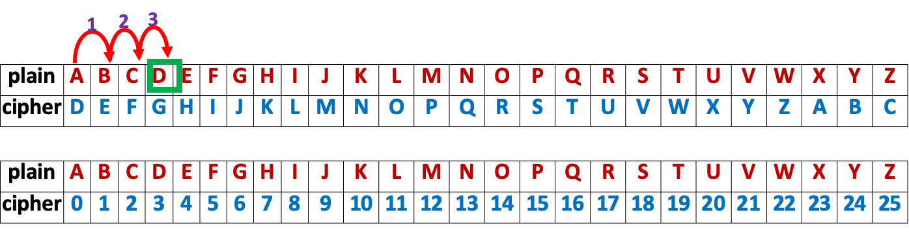
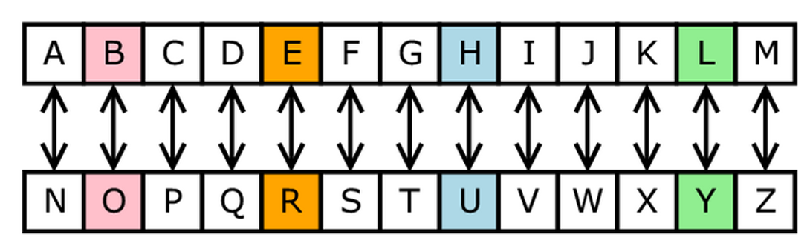
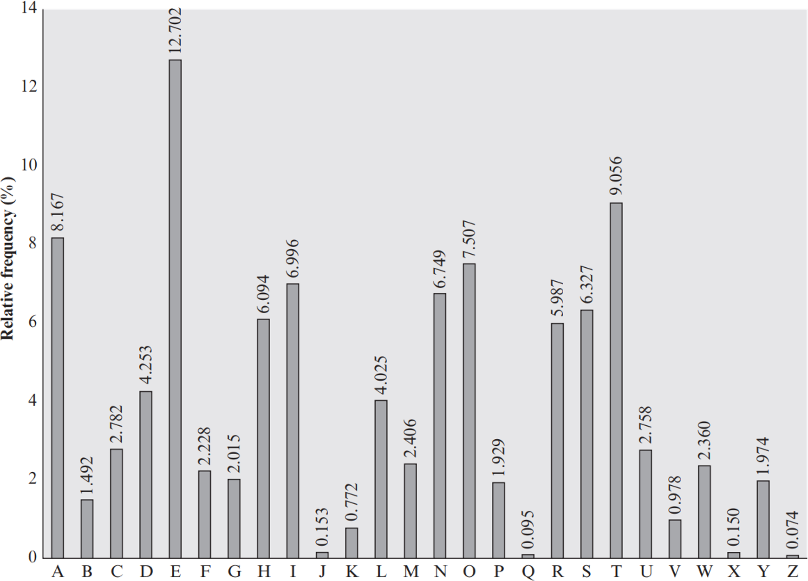
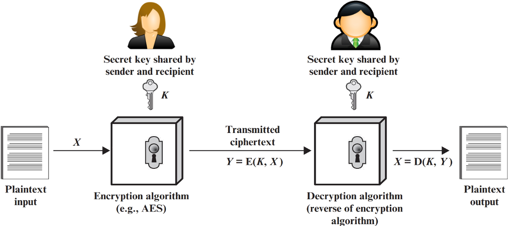
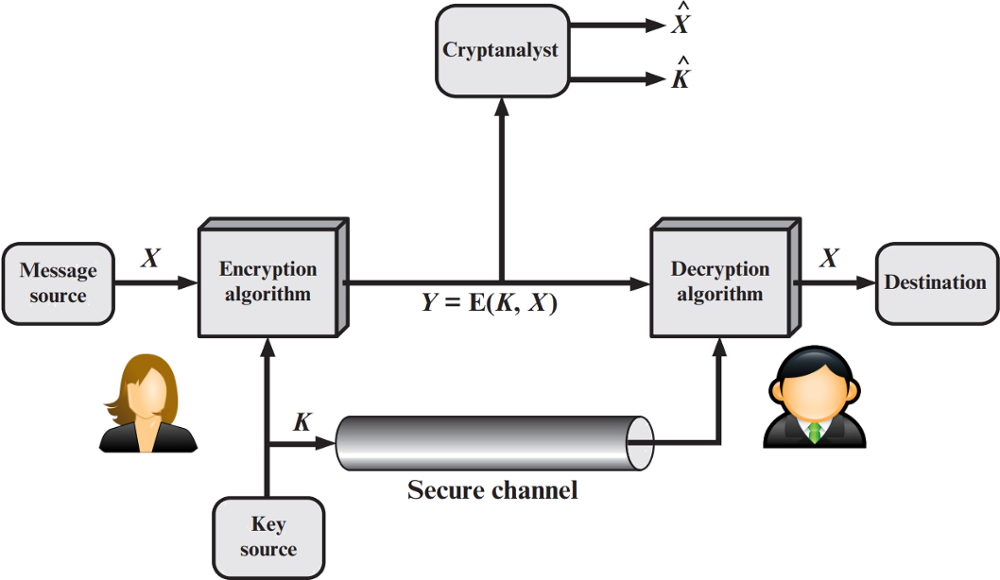
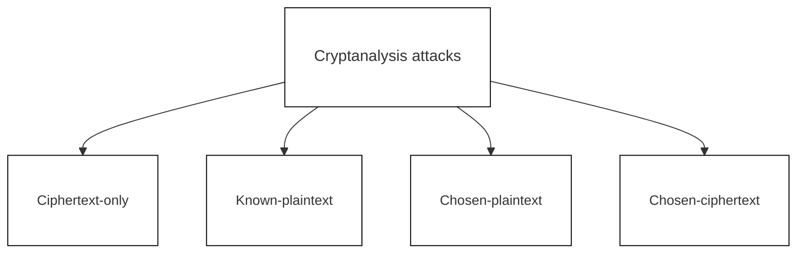

## Lecture Outline

1. Introduction to classical cryptography
2. Caesar Cipher, Monoalphabetic Substitution Cipher
3. Polyalphabetic Cipher - Vigenère Cipher
4. Introduction to symmetric key encryption
5. Overview of cryptanalysis and cryptographic attacks

## Learning Outcomes

By the end of this lecture, students should be able to:

1. Know the various classical cryptographies
2. Explain Caesar Cipher, Monoalphabetic Substitution Cipher, Polyalphabetic Cipher
3. Perform Brute force Attacks on Caesar Cipher
4. Understand the Polyalphabetic Cipher - Vigenère Cipher
5. Understand Symmetric key encryption
6. Understand cryptanalysis and cryptographic attacks

## Classical Cryptographies

## Caesar Cipher

---

The Caesar Cipher is one of the simplest and oldest methods of encryption. It is a type of substitution cipher, where each letter in the plaintext is shifted a certain number of positions down or up the alphabet.

It works by shifting the letters of the alphabet by a fixed number, called the shift key. For example, a shift of 3 would replace 'A' with 'D', 'B' with 'E', and so on.

---

For example, a shift of 3 would replace 'A' with 'D', 'B' with 'E', and so on.

Then the algorithm can be expressed as follows. For each plaintext letter $\textcolor{blue}p$, substitute the ciphertext letter $\textcolor{blue}C$:

$$\mathbf{C = E(p, 3) = (p + 3) ~ mod ~ 26}$$

A shift may be of any amount, so that the general Caesar algorithm is

$$\mathbf{C = E(p, k) = (p + k) ~ mod ~ 26}$$

where $\textcolor{blue}k$ takes on a value in the range 1 to 25. The decryption algorithm is simply

$$\mathbf{p = D(c, k) = (c − k) ~ mod ~ 26}$$

### Example

What is the shift value or key?

Answer: :spoiler[13]

---

All 25 Possible Caesar Cipher Shifts (1-13….)

<!-- 
 -->
  <table style="border-collapse: collapse; font-family: Arial, sans-serif; font-size: 14px; width: 100%; min-width: 800px;">
    <thead>
      <tr>
        <!-- 固定首列：滚动时不移动 -->
        <th style="position: sticky; left: 0; z-index: 2; background-color: #cce5ff; border: 1px solid #000; padding: 8px; width: 60px; text-align: center;">Letter</th>
        <th style="background-color: #f8d7da; border: 1px solid #000; padding: 8px; width: 40px; text-align: center;">S1</th>
        <th style="background-color: #f8d7da; border: 1px solid #000; padding: 8px; width: 40px; text-align: center;">S2</th>
        <th style="background-color: #8b4513; color: #ffffff; border: 1px solid #000; padding: 8px; width: 40px; text-align: center;">S3</th>
        <th style="background-color: #f8d7da; border: 1px solid #000; padding: 8px; width: 40px; text-align: center;">S4</th>
        <th style="background-color: #f8d7da; border: 1px solid #000; padding: 8px; width: 40px; text-align: center;">S5</th>
        <th style="background-color: #f8d7da; border: 1px solid #000; padding: 8px; width: 40px; text-align: center;">S6</th>
        <th style="background-color: #f8d7da; border: 1px solid #000; padding: 8px; width: 40px; text-align: center;">S7</th>
        <th style="background-color: #f8d7da; border: 1px solid #000; padding: 8px; width: 40px; text-align: center;">S8</th>
        <th style="background-color: #f8d7da; border: 1px solid #000; padding: 8px; width: 40px; text-align: center;">S9</th>
        <th style="background-color: #f8d7da; border: 1px solid #000; padding: 8px; width: 40px; text-align: center;">S10</th>
        <th style="background-color: #f8d7da; border: 1px solid #000; padding: 8px; width: 40px; text-align: center;">S11</th>
        <th style="background-color: #f8d7da; border: 1px solid #000; padding: 8px; width: 40px; text-align: center;">S12</th>
        <th style="background-color: #8b4513; color: #ffffff; border: 1px solid #000; padding: 8px; width: 40px; text-align: center;">S13</th>
      </tr>
    </thead>
    <tbody>
      <tr>
        <td style="position: sticky; left: 0; z-index: 1; background-color: #cce5ff; color: #dc3545; border: 1px solid #000; padding: 8px; text-align: center;">A</td>
        <td style="border: 1px solid #000; padding: 8px; text-align: center;">B</td>
        <td style="border: 1px solid #000; padding: 8px; text-align: center;">C</td>
        <td style="background-color: #8b4513; color: #ffffff; border: 1px solid #000; padding: 8px; text-align: center;">D</td>
        <td style="border: 1px solid #000; padding: 8px; text-align: center;">E</td>
        <td style="border: 1px solid #000; padding: 8px; text-align: center;">F</td>
        <td style="border: 1px solid #000; padding: 8px; text-align: center;">G</td>
        <td style="border: 1px solid #000; padding: 8px; text-align: center;">H</td>
        <td style="border: 1px solid #000; padding: 8px; text-align: center;">I</td>
        <td style="border: 1px solid #000; padding: 8px; text-align: center;">J</td>
        <td style="border: 1px solid #000; padding: 8px; text-align: center;">K</td>
        <td style="border: 1px solid #000; padding: 8px; text-align: center;">L</td>
        <td style="border: 1px solid #000; padding: 8px; text-align: center;">M</td>
        <td style="background-color: #8b4513; color: #ffffff; border: 1px solid #000; padding: 8px; text-align: center;">N</td>
      </tr>
      <tr>
        <td style="position: sticky; left: 0; z-index: 1; background-color: #cce5ff; color: #dc3545; border: 1px solid #000; padding: 8px; text-align: center;">B</td>
        <td style="border: 1px solid #000; padding: 8px; text-align: center;">C</td>
        <td style="border: 1px solid #000; padding: 8px; text-align: center;">D</td>
        <td style="background-color: #8b4513; color: #ffffff; border: 1px solid #000; padding: 8px; text-align: center;">E</td>
        <td style="border: 1px solid #000; padding: 8px; text-align: center;">F</td>
        <td style="border: 1px solid #000; padding: 8px; text-align: center;">G</td>
        <td style="border: 1px solid #000; padding: 8px; text-align: center;">H</td>
        <td style="border: 1px solid #000; padding: 8px; text-align: center;">I</td>
        <td style="border: 1px solid #000; padding: 8px; text-align: center;">J</td>
        <td style="border: 1px solid #000; padding: 8px; text-align: center;">K</td>
        <td style="border: 1px solid #000; padding: 8px; text-align: center;">L</td>
        <td style="border: 1px solid #000; padding: 8px; text-align: center;">M</td>
        <td style="border: 1px solid #000; padding: 8px; text-align: center;">N</td>
        <td style="background-color: #8b4513; color: #ffffff; border: 1px solid #000; padding: 8px; text-align: center;">O</td>
      </tr>
      <tr>
        <td style="position: sticky; left: 0; z-index: 1; background-color: #cce5ff; color: #dc3545; border: 1px solid #000; padding: 8px; text-align: center;">C</td>
        <td style="border: 1px solid #000; padding: 8px; text-align: center;">D</td>
        <td style="border: 1px solid #000; padding: 8px; text-align: center;">E</td>
        <td style="background-color: #8b4513; color: #ffffff; border: 1px solid #000; padding: 8px; text-align: center;">F</td>
        <td style="border: 1px solid #000; padding: 8px; text-align: center;">G</td>
        <td style="border: 1px solid #000; padding: 8px; text-align: center;">H</td>
        <td style="border: 1px solid #000; padding: 8px; text-align: center;">I</td>
        <td style="border: 1px solid #000; padding: 8px; text-align: center;">J</td>
        <td style="border: 1px solid #000; padding: 8px; text-align: center;">K</td>
        <td style="border: 1px solid #000; padding: 8px; text-align: center;">L</td>
        <td style="border: 1px solid #000; padding: 8px; text-align: center;">M</td>
        <td style="border: 1px solid #000; padding: 8px; text-align: center;">N</td>
        <td style="border: 1px solid #000; padding: 8px; text-align: center;">O</td>
        <td style="background-color: #8b4513; color: #ffffff; border: 1px solid #000; padding: 8px; text-align: center;">P</td>
      </tr>
      <tr>
        <td style="position: sticky; left: 0; z-index: 1; background-color: #cce5ff; color: #dc3545; border: 1px solid #000; padding: 8px; text-align: center;">D</td>
        <td style="border: 1px solid #000; padding: 8px; text-align: center;">E</td>
        <td style="border: 1px solid #000; padding: 8px; text-align: center;">F</td>
        <td style="background-color: #8b4513; color: #ffffff; border: 1px solid #000; padding: 8px; text-align: center;">G</td>
        <td style="border: 1px solid #000; padding: 8px; text-align: center;">H</td>
        <td style="border: 1px solid #000; padding: 8px; text-align: center;">I</td>
        <td style="border: 1px solid #000; padding: 8px; text-align: center;">J</td>
        <td style="border: 1px solid #000; padding: 8px; text-align: center;">K</td>
        <td style="border: 1px solid #000; padding: 8px; text-align: center;">L</td>
        <td style="border: 1px solid #000; padding: 8px; text-align: center;">M</td>
        <td style="border: 1px solid #000; padding: 8px; text-align: center;">N</td>
        <td style="border: 1px solid #000; padding: 8px; text-align: center;">O</td>
        <td style="border: 1px solid #000; padding: 8px; text-align: center;">P</td>
        <td style="background-color: #8b4513; color: #ffffff; border: 1px solid #000; padding: 8px; text-align: center;">Q</td>
      </tr>
      <tr>
        <td style="position: sticky; left: 0; z-index: 1; background-color: #cce5ff; color: #dc3545; border: 1px solid #000; padding: 8px; text-align: center;">E</td>
        <td style="border: 1px solid #000; padding: 8px; text-align: center;">F</td>
        <td style="border: 1px solid #000; padding: 8px; text-align: center;">G</td>
        <td style="background-color: #8b4513; color: #ffffff; border: 1px solid #000; padding: 8px; text-align: center;">H</td>
        <td style="border: 1px solid #000; padding: 8px; text-align: center;">I</td>
        <td style="border: 1px solid #000; padding: 8px; text-align: center;">J</td>
        <td style="border: 1px solid #000; padding: 8px; text-align: center;">K</td>
        <td style="border: 1px solid #000; padding: 8px; text-align: center;">L</td>
        <td style="border: 1px solid #000; padding: 8px; text-align: center;">M</td>
        <td style="border: 1px solid #000; padding: 8px; text-align: center;">N</td>
        <td style="border: 1px solid #000; padding: 8px; text-align: center;">O</td>
        <td style="border: 1px solid #000; padding: 8px; text-align: center;">P</td>
        <td style="border: 1px solid #000; padding: 8px; text-align: center;">Q</td>
        <td style="background-color: #8b4513; color: #ffffff; border: 1px solid #000; padding: 8px; text-align: center;">R</td>
      </tr>
      <tr>
        <td style="position: sticky; left: 0; z-index: 1; background-color: #cce5ff; color: #dc3545; border: 1px solid #000; padding: 8px; text-align: center;">F</td>
        <td style="border: 1px solid #000; padding: 8px; text-align: center;">G</td>
        <td style="border: 1px solid #000; padding: 8px; text-align: center;">H</td>
        <td style="background-color: #8b4513; color: #ffffff; border: 1px solid #000; padding: 8px; text-align: center;">I</td>
        <td style="border: 1px solid #000; padding: 8px; text-align: center;">J</td>
        <td style="border: 1px solid #000; padding: 8px; text-align: center;">K</td>
        <td style="border: 1px solid #000; padding: 8px; text-align: center;">L</td>
        <td style="border: 1px solid #000; padding: 8px; text-align: center;">M</td>
        <td style="border: 1px solid #000; padding: 8px; text-align: center;">N</td>
        <td style="border: 1px solid #000; padding: 8px; text-align: center;">O</td>
        <td style="border: 1px solid #000; padding: 8px; text-align: center;">P</td>
        <td style="border: 1px solid #000; padding: 8px; text-align: center;">Q</td>
        <td style="border: 1px solid #000; padding: 8px; text-align: center;">R</td>
        <td style="background-color: #8b4513; color: #ffffff; border: 1px solid #000; padding: 8px; text-align: center;">S</td>
      </tr>
      <tr>
        <td style="position: sticky; left: 0; z-index: 1; background-color: #cce5ff; color: #dc3545; border: 1px solid #000; padding: 8px; text-align: center;">G</td>
        <td style="border: 1px solid #000; padding: 8px; text-align: center;">H</td>
        <td style="border: 1px solid #000; padding: 8px; text-align: center;">I</td>
        <td style="background-color: #8b4513; color: #ffffff; border: 1px solid #000; padding: 8px; text-align: center;">J</td>
        <td style="border: 1px solid #000; padding: 8px; text-align: center;">K</td>
        <td style="border: 1px solid #000; padding: 8px; text-align: center;">L</td>
        <td style="border: 1px solid #000; padding: 8px; text-align: center;">M</td>
        <td style="border: 1px solid #000; padding: 8px; text-align: center;">N</td>
        <td style="border: 1px solid #000; padding: 8px; text-align: center;">O</td>
        <td style="border: 1px solid #000; padding: 8px; text-align: center;">P</td>
        <td style="border: 1px solid #000; padding: 8px; text-align: center;">Q</td>
        <td style="border: 1px solid #000; padding: 8px; text-align: center;">R</td>
        <td style="border: 1px solid #000; padding: 8px; text-align: center;">S</td>
        <td style="background-color: #8b4513; color: #ffffff; border: 1px solid #000; padding: 8px; text-align: center;">T</td>
      </tr>
      <tr>
        <td style="position: sticky; left: 0; z-index: 1; background-color: #cce5ff; color: #dc3545; border: 1px solid #000; padding: 8px; text-align: center;">H</td>
        <td style="border: 1px solid #000; padding: 8px; text-align: center;">I</td>
        <td style="border: 1px solid #000; padding: 8px; text-align: center;">J</td>
        <td style="background-color: #8b4513; color: #ffffff; border: 1px solid #000; padding: 8px; text-align: center;">K</td>
        <td style="border: 1px solid #000; padding: 8px; text-align: center;">L</td>
        <td style="border: 1px solid #000; padding: 8px; text-align: center;">M</td>
        <td style="border: 1px solid #000; padding: 8px; text-align: center;">N</td>
        <td style="border: 1px solid #000; padding: 8px; text-align: center;">O</td>
        <td style="border: 1px solid #000; padding: 8px; text-align: center;">P</td>
        <td style="border: 1px solid #000; padding: 8px; text-align: center;">Q</td>
        <td style="border: 1px solid #000; padding: 8px; text-align: center;">R</td>
        <td style="border: 1px solid #000; padding: 8px; text-align: center;">S</td>
        <td style="border: 1px solid #000; padding: 8px; text-align: center;">T</td>
        <td style="background-color: #8b4513; color: #ffffff; border: 1px solid #000; padding: 8px; text-align: center;">U</td>
      </tr>
      <tr>
        <td style="position: sticky; left: 0; z-index: 1; background-color: #cce5ff; color: #dc3545; border: 1px solid #000; padding: 8px; text-align: center;">I</td>
        <td style="border: 1px solid #000; padding: 8px; text-align: center;">J</td>
        <td style="border: 1px solid #000; padding: 8px; text-align: center;">K</td>
        <td style="background-color: #8b4513; color: #ffffff; border: 1px solid #000; padding: 8px; text-align: center;">L</td>
        <td style="border: 1px solid #000; padding: 8px; text-align: center;">M</td>
        <td style="border: 1px solid #000; padding: 8px; text-align: center;">N</td>
        <td style="border: 1px solid #000; padding: 8px; text-align: center;">O</td>
        <td style="border: 1px solid #000; padding: 8px; text-align: center;">P</td>
        <td style="border: 1px solid #000; padding: 8px; text-align: center;">Q</td>
        <td style="border: 1px solid #000; padding: 8px; text-align: center;">R</td>
        <td style="border: 1px solid #000; padding: 8px; text-align: center;">S</td>
        <td style="border: 1px solid #000; padding: 8px; text-align: center;">T</td>
        <td style="border: 1px solid #000; padding: 8px; text-align: center;">U</td>
        <td style="background-color: #8b4513; color: #ffffff; border: 1px solid #000; padding: 8px; text-align: center;">V</td>
      </tr>
      <tr>
        <td style="position: sticky; left: 0; z-index: 1; background-color: #cce5ff; color: #dc3545; border: 1px solid #000; padding: 8px; text-align: center;">J</td>
        <td style="border: 1px solid #000; padding: 8px; text-align: center;">K</td>
        <td style="border: 1px solid #000; padding: 8px; text-align: center;">L</td>
        <td style="background-color: #8b4513; color: #ffffff; border: 1px solid #000; padding: 8px; text-align: center;">M</td>
        <td style="border: 1px solid #000; padding: 8px; text-align: center;">N</td>
        <td style="border: 1px solid #000; padding: 8px; text-align: center;">O</td>
        <td style="border: 1px solid #000; padding: 8px; text-align: center;">P</td>
        <td style="border: 1px solid #000; padding: 8px; text-align: center;">Q</td>
        <td style="border: 1px solid #000; padding: 8px; text-align: center;">R</td>
        <td style="border: 1px solid #000; padding: 8px; text-align: center;">S</td>
        <td style="border: 1px solid #000; padding: 8px; text-align: center;">T</td>
        <td style="border: 1px solid #000; padding: 8px; text-align: center;">U</td>
        <td style="border: 1px solid #000; padding: 8px; text-align: center;">V</td>
        <td style="background-color: #8b4513; color: #ffffff; border: 1px solid #000; padding: 8px; text-align: center;">W</td>
      </tr>
      <tr>
        <td style="position: sticky; left: 0; z-index: 1; background-color: #cce5ff; color: #dc3545; border: 1px solid #000; padding: 8px; text-align: center;">K</td>
        <td style="border: 1px solid #000; padding: 8px; text-align: center;">L</td>
        <td style="border: 1px solid #000; padding: 8px; text-align: center;">M</td>
        <td style="background-color: #8b4513; color: #ffffff; border: 1px solid #000; padding: 8px; text-align: center;">N</td>
        <td style="border: 1px solid #000; padding: 8px; text-align: center;">O</td>
        <td style="border: 1px solid #000; padding: 8px; text-align: center;">P</td>
        <td style="border: 1px solid #000; padding: 8px; text-align: center;">Q</td>
        <td style="border: 1px solid #000; padding: 8px; text-align: center;">R</td>
        <td style="border: 1px solid #000; padding: 8px; text-align: center;">S</td>
        <td style="border: 1px solid #000; padding: 8px; text-align: center;">T</td>
        <td style="border: 1px solid #000; padding: 8px; text-align: center;">U</td>
        <td style="border: 1px solid #000; padding: 8px; text-align: center;">V</td>
        <td style="border: 1px solid #000; padding: 8px; text-align: center;">W</td>
        <td style="background-color: #8b4513; color: #ffffff; border: 1px solid #000; padding: 8px; text-align: center;">X</td>
      </tr>
      <tr>
        <td style="position: sticky; left: 0; z-index: 1; background-color: #cce5ff; color: #dc3545; border: 1px solid #000; padding: 8px; text-align: center;">L</td>
        <td style="border: 1px solid #000; padding: 8px; text-align: center;">M</td>
        <td style="border: 1px solid #000; padding: 8px; text-align: center;">N</td>
        <td style="background-color: #8b4513; color: #ffffff; border: 1px solid #000; padding: 8px; text-align: center;">O</td>
        <td style="border: 1px solid #000; padding: 8px; text-align: center;">P</td>
        <td style="border: 1px solid #000; padding: 8px; text-align: center;">Q</td>
        <td style="border: 1px solid #000; padding: 8px; text-align: center;">R</td>
        <td style="border: 1px solid #000; padding: 8px; text-align: center;">S</td>
        <td style="border: 1px solid #000; padding: 8px; text-align: center;">T</td>
        <td style="border: 1px solid #000; padding: 8px; text-align: center;">U</td>
        <td style="border: 1px solid #000; padding: 8px; text-align: center;">V</td>
        <td style="border: 1px solid #000; padding: 8px; text-align: center;">W</td>
        <td style="border: 1px solid #000; padding: 8px; text-align: center;">X</td>
        <td style="background-color: #8b4513; color: #ffffff; border: 1px solid #000; padding: 8px; text-align: center;">Y</td>
      </tr>
      <tr>
        <td style="position: sticky; left: 0; z-index: 1; background-color: #cce5ff; color: #dc3545; border: 1px solid #000; padding: 8px; text-align: center;">M</td>
        <td style="border: 1px solid #000; padding: 8px; text-align: center;">N</td>
        <td style="border: 1px solid #000; padding: 8px; text-align: center;">O</td>
        <td style="background-color: #8b4513; color: #ffffff; border: 1px solid #000; padding: 8px; text-align: center;">P</td>
        <td style="border: 1px solid #000; padding: 8px; text-align: center;">Q</td>
        <td style="border: 1px solid #000; padding: 8px; text-align: center;">R</td>
        <td style="border: 1px solid #000; padding: 8px; text-align: center;">S</td>
        <td style="border: 1px solid #000; padding: 8px; text-align: center;">T</td>
        <td style="border: 1px solid #000; padding: 8px; text-align: center;">U</td>
        <td style="border: 1px solid #000; padding: 8px; text-align: center;">V</td>
        <td style="border: 1px solid #000; padding: 8px; text-align: center;">W</td>
        <td style="border: 1px solid #000; padding: 8px; text-align: center;">X</td>
        <td style="border: 1px solid #000; padding: 8px; text-align: center;">Y</td>
        <td style="background-color: #8b4513; color: #ffffff; border: 1px solid #000; padding: 8px; text-align: center;">Z</td>
      </tr>
    </tbody>
  </table>
<!-- 
 -->

### Brute Force Attack on the Caesar Cipher

<b>Applicability:</b>

**Known Algorithms:** Encryption and decryption processes are known.

**Limited Keys:** Only 25 possible keys to attempt.

**Recognizable Language:** The plaintext language is easily identifiable.

Decryption Example:

Encrypted Message:  ***PHHW PH DIWHU WKH WRJD SDUWB***

Decryption Attempts:

> An attacker can try all 25 possible keys/shifts in seconds. With modern computers, this takes milliseconds.

---

Encrypted Message:  <b><i>PHHW PH DIWHU WKH WRJD SDUWB</i></b>

Decryption Attempts:

  <!-- 内层：强制双表并排，永不换行 -->
  

    <!-- 左侧表格（KEY 1-13） -->
    <table style="border-collapse: collapse; font-family: Arial, sans-serif; font-size: 14px; border: 1px solid #000; flex-shrink: 0;">
      <thead>
        <tr>
          <th style="background-color: #e0e0e0; border: 1px solid #000; padding: 8px; width: 40px; color: #dc3545; font-weight: bold;">KEY</th>
          <th style="background-color: #e0e0e0; border: 1px solid #000; padding: 8px; width: 60px; color: #dc3545; font-weight: bold;">PHHW</th>
          <th style="background-color: #e0e0e0; border: 1px solid #000; padding: 8px; width: 40px; color: #dc3545; font-weight: bold;">PH</th>
          <th style="background-color: #e0e0e0; border: 1px solid #000; padding: 8px; width: 60px; color: #dc3545; font-weight: bold;">DIWHU</th>
          <th style="background-color: #e0e0e0; border: 1px solid #000; padding: 8px; width: 40px; color: #dc3545; font-weight: bold;">WKH</th>
          <th style="background-color: #e0e0e0; border: 1px solid #000; padding: 8px; width: 40px; color: #dc3545; font-weight: bold;">WRJD</th>
          <th style="background-color: #e0e0e0; border: 1px solid #000; padding: 8px; width: 60px; color: #dc3545; font-weight: bold;">SDUWB</th>
        </tr>
      </thead>
      <tbody>
        <tr>
          <td style="border: 2px solid #dc3545; padding: 8px; text-align: left;">1</td>
          <td style="border: 2px solid #dc3545; padding: 8px; text-align: left;">oggv</td>
          <td style="border: 2px solid #dc3545; padding: 8px; text-align: left;">og</td>
          <td style="border: 2px solid #dc3545; padding: 8px; text-align: left;">chvgt</td>
          <td style="border: 2px solid #dc3545; padding: 8px; text-align: left;">vjg</td>
          <td style="border: 2px solid #dc3545; padding: 8px; text-align: left;">vqic</td>
          <td style="border: 2px solid #dc3545; padding: 8px; text-align: left;">rctva</td>
        </tr>
        <tr>
          <td style="border: 2px solid #dc3545; padding: 8px; text-align: left;">2</td>
          <td style="border: 2px solid #dc3545; padding: 8px; text-align: left;">nffu</td>
          <td style="border: 2px solid #dc3545; padding: 8px; text-align: left;">nf</td>
          <td style="border: 2px solid #dc3545; padding: 8px; text-align: left;">bgufs</td>
          <td style="border: 2px solid #dc3545; padding: 8px; text-align: left;">uif</td>
          <td style="border: 2px solid #dc3545; padding: 8px; text-align: left;">uphb</td>
          <td style="border: 2px solid #dc3545; padding: 8px; text-align: left;">qbsuz</td>
        </tr>
        <tr>
          <td style="border: 1px solid #000; padding: 8px; text-align: left;">3</td>
          <td style="border: 1px solid #000; padding: 8px; text-align: left;">meet</td>
          <td style="border: 1px solid #000; padding: 8px; text-align: left;">me</td>
          <td style="border: 1px solid #000; padding: 8px; text-align: left;">after</td>
          <td style="border: 1px solid #000; padding: 8px; text-align: left;">the</td>
          <td style="border: 1px solid #000; padding: 8px; text-align: left;">toga</td>
          <td style="border: 1px solid #000; padding: 8px; text-align: left;">party</td>
        </tr>
        <tr>
          <td style="border: 1px solid #000; padding: 8px; text-align: left;">4</td>
          <td style="border: 1px solid #000; padding: 8px; text-align: left;">ldds</td>
          <td style="border: 1px solid #000; padding: 8px; text-align: left;">ld</td>
          <td style="border: 1px solid #000; padding: 8px; text-align: left;">zesdq</td>
          <td style="border: 1px solid #000; padding: 8px; text-align: left;">sgd</td>
          <td style="border: 1px solid #000; padding: 8px; text-align: left;">snfz</td>
          <td style="border: 1px solid #000; padding: 8px; text-align: left;">ozqsx</td>
        </tr>
        <tr>
          <td style="border: 1px solid #000; padding: 8px; text-align: left;">5</td>
          <td style="border: 1px solid #000; padding: 8px; text-align: left;">kccr</td>
          <td style="border: 1px solid #000; padding: 8px; text-align: left;">kc</td>
          <td style="border: 1px solid #000; padding: 8px; text-align: left;">ydrcp</td>
          <td style="border: 1px solid #000; padding: 8px; text-align: left;">rfc</td>
          <td style="border: 1px solid #000; padding: 8px; text-align: left;">rmey</td>
          <td style="border: 1px solid #000; padding: 8px; text-align: left;">nyprw</td>
        </tr>
        <tr>
          <td style="border: 1px solid #000; padding: 8px; text-align: left;">6</td>
          <td style="border: 1px solid #000; padding: 8px; text-align: left;">jbbq</td>
          <td style="border: 1px solid #000; padding: 8px; text-align: left;">jb</td>
          <td style="border: 1px solid #000; padding: 8px; text-align: left;">xcqbo</td>
          <td style="border: 1px solid #000; padding: 8px; text-align: left;">qeb</td>
          <td style="border: 1px solid #000; padding: 8px; text-align: left;">qldx</td>
          <td style="border: 1px solid #000; padding: 8px; text-align: left;">mxoqv</td>
        </tr>
        <tr>
          <td style="border: 1px solid #000; padding: 8px; text-align: left;">7</td>
          <td style="border: 1px solid #000; padding: 8px; text-align: left;">iaap</td>
          <td style="border: 1px solid #000; padding: 8px; text-align: left;">ia</td>
          <td style="border: 1px solid #000; padding: 8px; text-align: left;">wbpan</td>
          <td style="border: 1px solid #000; padding: 8px; text-align: left;">pda</td>
          <td style="border: 1px solid #000; padding: 8px; text-align: left;">pkcw</td>
          <td style="border: 1px solid #000; padding: 8px; text-align: left;">lwnpu</td>
        </tr>
        <tr>
          <td style="border: 1px solid #000; padding: 8px; text-align: left;">8</td>
          <td style="border: 1px solid #000; padding: 8px; text-align: left;">hzzo</td>
          <td style="border: 1px solid #000; padding: 8px; text-align: left;">hz</td>
          <td style="border: 1px solid #000; padding: 8px; text-align: left;">vaozm</td>
          <td style="border: 1px solid #000; padding: 8px; text-align: left;">ocz</td>
          <td style="border: 1px solid #000; padding: 8px; text-align: left;">ojbv</td>
          <td style="border: 1px solid #000; padding: 8px; text-align: left;">kvmot</td>
        </tr>
        <tr>
          <td style="border: 1px solid #000; padding: 8px; text-align: left;">9</td>
          <td style="border: 1px solid #000; padding: 8px; text-align: left;">gyyn</td>
          <td style="border: 1px solid #000; padding: 8px; text-align: left;">gy</td>
          <td style="border: 1px solid #000; padding: 8px; text-align: left;">uznyl</td>
          <td style="border: 1px solid #000; padding: 8px; text-align: left;">nby</td>
          <td style="border: 1px solid #000; padding: 8px; text-align: left;">niau</td>
          <td style="border: 1px solid #000; padding: 8px; text-align: left;">julns</td>
        </tr>
        <tr>
          <td style="border: 1px solid #000; padding: 8px; text-align: left;">10</td>
          <td style="border: 1px solid #000; padding: 8px; text-align: left;">fxxm</td>
          <td style="border: 1px solid #000; padding: 8px; text-align: left;">fx</td>
          <td style="border: 1px solid #000; padding: 8px; text-align: left;">tvmxk</td>
          <td style="border: 1px solid #000; padding: 8px; text-align: left;">max</td>
          <td style="border: 1px solid #000; padding: 8px; text-align: left;">mhzt</td>
          <td style="border: 1px solid #000; padding: 8px; text-align: left;">itkmr</td>
        </tr>
        <tr>
          <td style="border: 1px solid #000; padding: 8px; text-align: left;">11</td>
          <td style="border: 1px solid #000; padding: 8px; text-align: left;">ewwl</td>
          <td style="border: 1px solid #000; padding: 8px; text-align: left;">ew</td>
          <td style="border: 1px solid #000; padding: 8px; text-align: left;">sxlwj</td>
          <td style="border: 1px solid #000; padding: 8px; text-align: left;">lzw</td>
          <td style="border: 1px solid #000; padding: 8px; text-align: left;">lgys</td>
          <td style="border: 1px solid #000; padding: 8px; text-align: left;">hsjlq</td>
        </tr>
        <tr>
          <td style="border: 1px solid #000; padding: 8px; text-align: left;">12</td>
          <td style="border: 1px solid #000; padding: 8px; text-align: left;">dvvk</td>
          <td style="border: 1px solid #000; padding: 8px; text-align: left;">dv</td>
          <td style="border: 1px solid #000; padding: 8px; text-align: left;">rwkvi</td>
          <td style="border: 1px solid #000; padding: 8px; text-align: left;">kyv</td>
          <td style="border: 1px solid #000; padding: 8px; text-align: left;">kfxr</td>
          <td style="border: 1px solid #000; padding: 8px; text-align: left;">grikp</td>
        </tr>
        <tr>
          <td style="border: 1px solid #000; padding: 8px; text-align: left;">13</td>
          <td style="border: 1px solid #000; padding: 8px; text-align: left;">cuuj</td>
          <td style="border: 1px solid #000; padding: 8px; text-align: left;">cu</td>
          <td style="border: 1px solid #000; padding: 8px; text-align: left;">qvjuh</td>
          <td style="border: 1px solid #000; padding: 8px; text-align: left;">jxu</td>
          <td style="border: 1px solid #000; padding: 8px; text-align: left;">jewq</td>
          <td style="border: 1px solid #000; padding: 8px; text-align: left;">fqhjo</td>
        </tr>
      </tbody>
    </table>
    <!-- 右侧表格（KEY 14-25） -->
    <table style="border-collapse: collapse; font-family: Arial, sans-serif; font-size: 14px; border: 1px solid #000; flex-shrink: 0;">
      <thead>
        <tr>
          <th style="background-color: #e0e0e0; border: 1px solid #000; padding: 8px; width: 40px; color: #dc3545; font-weight: bold;">KEY</th>
          <th style="background-color: #e0e0e0; border: 1px solid #000; padding: 8px; width: 60px; color: #dc3545; font-weight: bold;">PHHW</th>
          <th style="background-color: #e0e0e0; border: 1px solid #000; padding: 8px; width: 40px; color: #dc3545; font-weight: bold;">PH</th>
          <th style="background-color: #e0e0e0; border: 1px solid #000; padding: 8px; width: 60px; color: #dc3545; font-weight: bold;">DIWHU</th>
          <th style="background-color: #e0e0e0; border: 1px solid #000; padding: 8px; width: 40px; color: #dc3545; font-weight: bold;">WKH</th>
          <th style="background-color: #e0e0e0; border: 1px solid #000; padding: 8px; width: 40px; color: #dc3545; font-weight: bold;">WRJD</th>
          <th style="background-color: #e0e0e0; border: 1px solid #000; padding: 8px; width: 60px; color: #dc3545; font-weight: bold;">SDUWB</th>
        </tr>
      </thead>
      <tbody>
        <tr>
          <td style="border: 1px solid #000; padding: 8px; text-align: left;">14</td>
          <td style="border: 1px solid #000; padding: 8px; text-align: left;">btti</td>
          <td style="border: 1px solid #000; padding: 8px; text-align: left;">bt</td>
          <td style="border: 1px solid #000; padding: 8px; text-align: left;">puitg</td>
          <td style="border: 1px solid #000; padding: 8px; text-align: left;">iwt</td>
          <td style="border: 1px solid #000; padding: 8px; text-align: left;">idvp</td>
          <td style="border: 1px solid #000; padding: 8px; text-align: left;">epgin</td>
        </tr>
        <tr>
          <td style="border: 1px solid #000; padding: 8px; text-align: left;">15</td>
          <td style="border: 1px solid #000; padding: 8px; text-align: left;">assh</td>
          <td style="border: 1px solid #000; padding: 8px; text-align: left;">as</td>
          <td style="border: 1px solid #000; padding: 8px; text-align: left;">othsf</td>
          <td style="border: 1px solid #000; padding: 8px; text-align: left;">hvs</td>
          <td style="border: 1px solid #000; padding: 8px; text-align: left;">hcuo</td>
          <td style="border: 1px solid #000; padding: 8px; text-align: left;">dofhm</td>
        </tr>
        <tr>
          <td style="border: 1px solid #000; padding: 8px; text-align: left;">16</td>
          <td style="border: 1px solid #000; padding: 8px; text-align: left;">zrrg</td>
          <td style="border: 1px solid #000; padding: 8px; text-align: left;">zr</td>
          <td style="border: 1px solid #000; padding: 8px; text-align: left;">nsgre</td>
          <td style="border: 1px solid #000; padding: 8px; text-align: left;">gur</td>
          <td style="border: 1px solid #000; padding: 8px; text-align: left;">gbtn</td>
          <td style="border: 1px solid #000; padding: 8px; text-align: left;">cnegl</td>
        </tr>
        <tr>
          <td style="border: 1px solid #000; padding: 8px; text-align: left;">17</td>
          <td style="border: 1px solid #000; padding: 8px; text-align: left;">yqqf</td>
          <td style="border: 1px solid #000; padding: 8px; text-align: left;">yq</td>
          <td style="border: 1px solid #000; padding: 8px; text-align: left;">mrfqd</td>
          <td style="border: 1px solid #000; padding: 8px; text-align: left;">ftq</td>
          <td style="border: 1px solid #000; padding: 8px; text-align: left;">fasm</td>
          <td style="border: 1px solid #000; padding: 8px; text-align: left;">bmdfk</td>
        </tr>
        <tr>
          <td style="border: 1px solid #000; padding: 8px; text-align: left;">18</td>
          <td style="border: 1px solid #000; padding: 8px; text-align: left;">xppe</td>
          <td style="border: 1px solid #000; padding: 8px; text-align: left;">xp</td>
          <td style="border: 1px solid #000; padding: 8px; text-align: left;">lqepc</td>
          <td style="border: 1px solid #000; padding: 8px; text-align: left;">esp</td>
          <td style="border: 1px solid #000; padding: 8px; text-align: left;">ezrl</td>
          <td style="border: 1px solid #000; padding: 8px; text-align: left;">alcej</td>
        </tr>
        <tr>
          <td style="border: 1px solid #000; padding: 8px; text-align: left;">19</td>
          <td style="border: 1px solid #000; padding: 8px; text-align: left;">wood</td>
          <td style="border: 1px solid #000; padding: 8px; text-align: left;">wo</td>
          <td style="border: 1px solid #000; padding: 8px; text-align: left;">kpdob</td>
          <td style="border: 1px solid #000; padding: 8px; text-align: left;">dro</td>
          <td style="border: 1px solid #000; padding: 8px; text-align: left;">dyqk</td>
          <td style="border: 1px solid #000; padding: 8px; text-align: left;">zkbdi</td>
        </tr>
        <tr>
          <td style="border: 1px solid #000; padding: 8px; text-align: left;">20</td>
          <td style="border: 1px solid #000; padding: 8px; text-align: left;">vnnc</td>
          <td style="border: 1px solid #000; padding: 8px; text-align: left;">vn</td>
          <td style="border: 1px solid #000; padding: 8px; text-align: left;">jocna</td>
          <td style="border: 1px solid #000; padding: 8px; text-align: left;">cqn</td>
          <td style="border: 1px solid #000; padding: 8px; text-align: left;">cxpj</td>
          <td style="border: 1px solid #000; padding: 8px; text-align: left;">yjach</td>
        </tr>
        <tr>
          <td style="border: 1px solid #000; padding: 8px; text-align: left;">21</td>
          <td style="border: 1px solid #000; padding: 8px; text-align: left;">ummb</td>
          <td style="border: 1px solid #000; padding: 8px; text-align: left;">um</td>
          <td style="border: 1px solid #000; padding: 8px; text-align: left;">inbmz</td>
          <td style="border: 1px solid #000; padding: 8px; text-align: left;">bpm</td>
          <td style="border: 1px solid #000; padding: 8px; text-align: left;">bwoi</td>
          <td style="border: 1px solid #000; padding: 8px; text-align: left;">xizbg</td>
        </tr>
        <tr>
          <td style="border: 1px solid #000; padding: 8px; text-align: left;">22</td>
          <td style="border: 1px solid #000; padding: 8px; text-align: left;">tlla</td>
          <td style="border: 1px solid #000; padding: 8px; text-align: left;">tl</td>
          <td style="border: 1px solid #000; padding: 8px; text-align: left;">hmaly</td>
          <td style="border: 1px solid #000; padding: 8px; text-align: left;">aol</td>
          <td style="border: 1px solid #000; padding: 8px; text-align: left;">avnh</td>
          <td style="border: 1px solid #000; padding: 8px; text-align: left;">whyaf</td>
        </tr>
        <tr>
          <td style="border: 1px solid #000; padding: 8px; text-align: left;">23</td>
          <td style="border: 1px solid #000; padding: 8px; text-align: left;">skkz</td>
          <td style="border: 1px solid #000; padding: 8px; text-align: left;">sk</td>
          <td style="border: 1px solid #000; padding: 8px; text-align: left;">glzkx</td>
          <td style="border: 1px solid #000; padding: 8px; text-align: left;">znk</td>
          <td style="border: 1px solid #000; padding: 8px; text-align: left;">zumg</td>
          <td style="border: 1px solid #000; padding: 8px; text-align: left;">vgxze</td>
        </tr>
        <tr>
          <td style="border: 1px solid #000; padding: 8px; text-align: left;">24</td>
          <td style="border: 1px solid #000; padding: 8px; text-align: left;">rjjy</td>
          <td style="border: 1px solid #000; padding: 8px; text-align: left;">rj</td>
          <td style="border: 1px solid #000; padding: 8px; text-align: left;">fkyjw</td>
          <td style="border: 1px solid #000; padding: 8px; text-align: left;">ymj</td>
          <td style="border: 1px solid #000; padding: 8px; text-align: left;">ytlf</td>
          <td style="border: 1px solid #000; padding: 8px; text-align: left;">ufwyd</td>
        </tr>
        <tr>
          <td style="border: 1px solid #000; padding: 8px; text-align: left;">25</td>
          <td style="border: 1px solid #000; padding: 8px; text-align: left;">qiix</td>
          <td style="border: 1px solid #000; padding: 8px; text-align: left;">qi</td>
          <td style="border: 1px solid #000; padding: 8px; text-align: left;">ejxiv</td>
          <td style="border: 1px solid #000; padding: 8px; text-align: left;">xli</td>
          <td style="border: 1px solid #000; padding: 8px; text-align: left;">xske</td>
          <td style="border: 1px solid #000; padding: 8px; text-align: left;">tevxc</td>
        </tr>
      </tbody>
    </table>
  

## Monoalphabetic Substitution Cipher

Is a type of substitution cipher in which each letter of the plaintext is replaced by a unique letter of the alphabet. This means that a single letter of the plaintext is always substituted by the same letter of ciphertext, and the same substitution is used throughout the message.

Key Characteristics

1. One-to-One Mapping: Each letter in the plaintext corresponds to exactly one letter in the ciphertext, and vice versa. For example, 'A' might be replaced with 'D', 'B' with 'Q', and so on.
2. Fixed Substitution: The substitution pattern remains the same throughout the entire message. If a letter 'A' is replaced with 'D' in one part of the message, it will be replaced with 'D' wherever 'A' appears in the plaintext.
3. Key: The cipher is defined by a key, which is a permutation of the alphabet. The key determines the substitution of each letter. For example, the key might look like this:

    <table style="border-collapse: collapse; text-align: center; font-family: monospace; width: 100%; white-space: nowrap;">
      <tr>
        <td style="border: 1px solid #000; padding: 2px 8px;">plain</td>
        <td style="border: 1px solid #000; padding: 2px 8px; color: red;">A</td>
        <td style="border: 1px solid #000; padding: 2px 8px; color: red;">B</td>
        <td style="border: 1px solid #000; padding: 2px 8px; color: red;">C</td>
        <td style="border: 1px solid #000; padding: 2px 8px; color: red;">D</td>
        <td style="border: 1px solid #000; padding: 2px 8px; color: red;">E</td>
        <td style="border: 1px solid #000; padding: 2px 8px; color: red;">F</td>
        <td style="border: 1px solid #000; padding: 2px 8px; color: red;">G</td>
        <td style="border: 1px solid #000; padding: 2px 8px; color: red;">H</td>
        <td style="border: 1px solid #000; padding: 2px 8px; color: red;">I</td>
        <td style="border: 1px solid #000; padding: 2px 8px; color: red;">J</td>
        <td style="border: 1px solid #000; padding: 2px 8px; color: red;">K</td>
        <td style="border: 1px solid #000; padding: 2px 8px; color: red;">L</td>
        <td style="border: 1px solid #000; padding: 2px 8px; color: red;">M</td>
        <td style="border: 1px solid #000; padding: 2px 8px; color: red;">N</td>
        <td style="border: 1px solid #000; padding: 2px 8px; color: red;">O</td>
        <td style="border: 1px solid #000; padding: 2px 8px; color: red;">P</td>
        <td style="border: 1px solid #000; padding: 2px 8px; color: red;">Q</td>
        <td style="border: 1px solid #000; padding: 2px 8px; color: red;">R</td>
        <td style="border: 1px solid #000; padding: 2px 8px; color: red;">S</td>
        <td style="border: 1px solid #000; padding: 2px 8px; color: red;">T</td>
        <td style="border: 1px solid #000; padding: 2px 8px; color: red;">U</td>
        <td style="border: 1px solid #000; padding: 2px 8px; color: red;">V</td>
        <td style="border: 1px solid #000; padding: 2px 8px; color: red;">W</td>
        <td style="border: 1px solid #000; padding: 2px 8px; color: red;">X</td>
        <td style="border: 1px solid #000; padding: 2px 8px; color: red;">Y</td>
        <td style="border: 1px solid #000; padding: 2px 8px; color: red;">Z</td>
      </tr>
      <tr>
        <td style="border: 1px solid #000; padding: 2px 8px;">cipher</td>
        <td style="border: 1px solid #000; padding: 2px 8px; color: blue;">Q</td>
        <td style="border: 1px solid #000; padding: 2px 8px; color: blue;">W</td>
        <td style="border: 1px solid #000; padding: 2px 8px; color: blue;">E</td>
        <td style="border: 1px solid #000; padding: 2px 8px; color: blue;">R</td>
        <td style="border: 1px solid #000; padding: 2px 8px; color: blue;">T</td>
        <td style="border: 1px solid #000; padding: 2px 8px; color: blue;">Y</td>
        <td style="border: 1px solid #000; padding: 2px 8px; color: blue;">U</td>
        <td style="border: 1px solid #000; padding: 2px 8px; color: blue;">I</td>
        <td style="border: 1px solid #000; padding: 2px 8px; color: blue;">O</td>
        <td style="border: 1px solid #000; padding: 2px 8px; color: blue;">P</td>
        <td style="border: 1px solid #000; padding: 2px 8px; color: blue;">A</td>
        <td style="border: 1px solid #000; padding: 2px 8px; color: blue;">S</td>
        <td style="border: 1px solid #000; padding: 2px 8px; color: blue;">D</td>
        <td style="border: 1px solid #000; padding: 2px 8px; color: blue;">F</td>
        <td style="border: 1px solid #000; padding: 2px 8px; color: blue;">G</td>
        <td style="border: 1px solid #000; padding: 2px 8px; color: blue;">H</td>
        <td style="border: 1px solid #000; padding: 2px 8px; color: blue;">J</td>
        <td style="border: 1px solid #000; padding: 2px 8px; color: blue;">K</td>
        <td style="border: 1px solid #000; padding: 2px 8px; color: blue;">L</td>
        <td style="border: 1px solid #000; padding: 2px 8px; color: blue;">Z</td>
        <td style="border: 1px solid #000; padding: 2px 8px; color: blue;">X</td>
        <td style="border: 1px solid #000; padding: 2px 8px; color: blue;">C</td>
        <td style="border: 1px solid #000; padding: 2px 8px; color: blue;">V</td>
        <td style="border: 1px solid #000; padding: 2px 8px; color: blue;">B</td>
        <td style="border: 1px solid #000; padding: 2px 8px; color: blue;">N</td>
        <td style="border: 1px solid #000; padding: 2px 8px; color: blue;">M</td>
      </tr>
    </table>

---

Encryption Process:

- **Step 1:** Take the plaintext message.
- **Step 2:** For each letter in the plaintext, substitute it with the corresponding letter from the ciphertext alphabet according to the key.
- **Step 3:** The result is the ciphertext, which can be transmitted securely.

Example:

- **Plaintext:** "HELLO"
- **Key** (example substitution): A -> Q, B -> W, C -> E, D -> R, E -> T, F -> Y, etc.
- **Ciphertext** (using the example key): "**ITSSG**"
- **Decryption Process:** To decrypt the message, the recipient needs the same key to reverse the substitution, mapping the ciphertext back to the original plaintext.

### Caesar Cipher

Security:
- **Weaknesses:** Monoalphabetic substitution ciphers are vulnerable to frequency analysis. In any language, certain letters appear more frequently than others (e.g., 'E' is the most common letter in English). By analyzing the frequency of letters in the ciphertext, an attacker can often deduce the substitutions and break the cipher.

- **Strengthening:** To enhance security, a polyalphabetic cipher, like the Vigenère cipher, can be used, where each letter is substituted based on a changing key, making frequency analysis more difficult.

## Polyalphabetic Cipher - Vigenère Cipher

### Polyalphabetic Cipher

Is a type of substitution cipher that uses multiple substitutions to encrypt a message, unlike the monoalphabetic cipher, which only uses one.

In this cipher, the same letter of the plaintext can be encrypted to different ciphertext letters, depending on its position in the text or a key.

Key Characteristics

1. **Multiple Substitutions:** Instead of using a single substitution for all letters, multiple substitutions are used for the same letter. This makes it harder for attackers to use frequency analysis to break the code.
2. **Key:** The key in a polyalphabetic cipher is typically a word or phrase that is repeated as necessary to cover the entire plaintext. The key determines the shift or substitution for each letter in the plaintext.
3. **Shift Pattern:** Each letter in the key corresponds to a specific shift in the alphabet. For example, if the key is "KEY", each letter of the plaintext is shifted by the position of the corresponding letter in the key.

### Vigenère Cipher

Created by the French diplomat **Blaise de Vigenère** in the 16th century.

It uses a keyword or key to generate a series of Caesar ciphers based on the letters of the keyword.

Key Characteristics

1. **Key:** The key is a word or phrase that is repeated to match the length of the plaintext.
2. **Shifting Mechanism:** Each letter in the plaintext is shifted by the position of the corresponding letter in the key. The alphabet is shifted forward for each corresponding letter in the key, making the shifts depend on both the letter and its position.

---

<b>Encryption Process</b>:

- **Repeat** the key to match the length of the plaintext.
- **Shift** each plaintext letter forward by the number of positions corresponding to the letter in the key (using the standard alphabetical index, where **A = 0, B = 1, C = 2, ..., Z = 25**).

| A   | B   | C   | D   | E   | F   | G   | H   | I   | J   | K   | L   | M   | N   | O   | P   | Q   | R   | S   | T   | U   | V   | W   | X   | Y   | Z   |
| --- | --- | --- | --- | --- | --- | --- | --- | --- | --- | --- | --- | --- | --- | --- | --- | --- | --- | --- | --- | --- | --- | --- | --- | --- | --- |
|     |     |     |     |     |     |     |     |     |     |     |     |     |     |     |     |     |     |     |     |     |     |     |     |     |     |
| 0   | 1   | 2   | 3   | 4   | 5   | 6   | 7   | 8   | 9   | 10  | 11  | 12  | 13  | 14  | 15  | 16  | 17  | 18  | 19  | 20  | 21  | 22  | 23  | 24  | 25  |

- <b>Example:</b> Encrypt the message "HELLO" using the key "KEY"
    - Step 1: Repeat the key to match the length of the plaintext: **KEYKE**
    - Step 2: Encrypt each letter of the plaintext:

<table>
    <tr>
        <td>'H' (shifted by 'K' = 10th letter) -&gt; 'R'</td>
        <td style="color: black; background-color: #E2F0D9;">H(7) + K(10) = R(17) mod 26</td>
    </tr>
    <tr>
        <td>'E' (shifted by 'E' = 4th letter) -&gt; 'I'</td>
        <td style="color: black; background-color: #E2F0D9;">E(4) + E(4) = I(8) mod 26</td>
    </tr>
    <tr>
        <td>'L' (shifted by 'Y' = 24th letter) -&gt; 'J'</td>
        <td style="color: black; background-color: #E2F0D9;">L(11) + Y(24) = J(35) mod 26</td>
    </tr>
    <tr>
        <td>'L' (shifted by 'K' = 10th letter) -&gt; 'V'</td>
        <td style="color: black; background-color: #E2F0D9;">L(11) + K(10) = V(21) mod 26</td>
    </tr>
    <tr>
        <td>'O' (shifted by 'E' = 4th letter) -&gt; 'S'</td>
        <td style="color: black; background-color: #E2F0D9;">O(14) + E(4) = S(18) mod 26</td>
    </tr>
</table>

Ciphertext: "**RIJVS**"

---

<b>Decryption Process</b>:

- To decrypt, the receiver uses the same key to reverse the shifting process. Each letter in the ciphertext is shifted backward by the number of positions corresponding to the key letter.

- <b>Example:</b>
    - **'R' (shifted back by 'K' = 10th letter) -> 'H'**
    - **'I' (shifted back by 'E' = 4th letter) -> 'E'**
    - **'J' (shifted back by 'Y' = 24th letter) -> 'L'**
    - **'V' (shifted back by 'K' = 10th letter) -> 'L'**
    - **'S' (shifted back by 'E' = 4th letter) -> 'O'**

Plaintext: "**HELLO**"

---

- Another Example:

Key: **deceptivedeceptivedeceptive**

Plaintext: **wearediscoveredsaveyourself**

ciphertext: **zicvtwqngrzgvtwavzhcqyglmgj**

<table style="border-collapse: collapse; text-align: center; font-family: monospace; width: 100%; white-space: nowrap;">
  <tr>
    <td style="border: 1px solid #000; padding: 6px 10px;">key</td>
    <td style="border: 1px solid #000; padding: 6px 10px;">3</td>
    <td style="border: 1px solid #000; padding: 6px 10px;">4</td>
    <td style="border: 1px solid #000; padding: 6px 10px;">2</td>
    <td style="border: 1px solid #000; padding: 6px 10px;">4</td>
    <td style="border: 1px solid #000; padding: 6px 10px;">15</td>
    <td style="border: 1px solid #000; padding: 6px 10px;">19</td>
    <td style="border: 1px solid #000; padding: 6px 10px;">8</td>
    <td style="border: 1px solid #000; padding: 6px 10px;">21</td>
    <td style="border: 1px solid #000; padding: 6px 10px;">4</td>
    <td style="border: 1px solid #000; padding: 6px 10px;">3</td>
    <td style="border: 1px solid #000; padding: 6px 10px;">4</td>
    <td style="border: 1px solid #000; padding: 6px 10px;">2</td>
    <td style="border: 1px solid #000; padding: 6px 10px;">4</td>
    <td style="border: 1px solid #000; padding: 6px 10px;">15</td>
  </tr>
  <tr>
    <td style="border: 1px solid #000; padding: 6px 10px;">plaintext</td>
    <td style="border: 1px solid #000; padding: 6px 10px;">22</td>
    <td style="border: 1px solid #000; padding: 6px 10px;">4</td>
    <td style="border: 1px solid #000; padding: 6px 10px;">0</td>
    <td style="border: 1px solid #000; padding: 6px 10px;">17</td>
    <td style="border: 1px solid #000; padding: 6px 10px;">4</td>
    <td style="border: 1px solid #000; padding: 6px 10px;">3</td>
    <td style="border: 1px solid #000; padding: 6px 10px;">8</td>
    <td style="border: 1px solid #000; padding: 6px 10px;">18</td>
    <td style="border: 1px solid #000; padding: 6px 10px;">2</td>
    <td style="border: 1px solid #000; padding: 6px 10px;">14</td>
    <td style="border: 1px solid #000; padding: 6px 10px;">21</td>
    <td style="border: 1px solid #000; padding: 6px 10px;">4</td>
    <td style="border: 1px solid #000; padding: 6px 10px;">17</td>
    <td style="border: 1px solid #000; padding: 6px 10px;">4</td>
  </tr>
  <tr>
    <td style="border: 1px solid #000; padding: 6px 10px;">ciphertext</td>
    <td style="border: 1px solid #000; padding: 6px 10px;">25</td>
    <td style="border: 1px solid #000; padding: 6px 10px;">8</td>
    <td style="border: 1px solid #000; padding: 6px 10px;">2</td>
    <td style="border: 1px solid #000; padding: 6px 10px; color: black; background-color: #d0d0d0;">21</td>
    <td style="border: 1px solid #000; padding: 6px 10px; color: black; background-color: #d0d0d0;">19</td>
    <td style="border: 1px solid #000; padding: 6px 10px; color: black; background-color: #d0d0d0;">22</td>
    <td style="border: 1px solid #000; padding: 6px 10px;">16</td>
    <td style="border: 1px solid #000; padding: 6px 10px;">13</td>
    <td style="border: 1px solid #000; padding: 6px 10px;">6</td>
    <td style="border: 1px solid #000; padding: 6px 10px;">17</td>
    <td style="border: 1px solid #000; padding: 6px 10px;">25</td>
    <td style="border: 1px solid #000; padding: 6px 10px;">6</td>
    <td style="border: 1px solid #000; padding: 6px 10px; color: black; background-color: #d0d0d0;">21</td>
    <td style="border: 1px solid #000; padding: 6px 10px; color: black; background-color: #d0d0d0;">19</td>
  </tr>
</table>

<table style="border-collapse: collapse; text-align: center; font-family: monospace; width: 100%; white-space: nowrap;">
  <tr>
    <td style="border: 1px solid #000; padding: 6px 10px;">key</td>
    <td style="border: 1px solid #000; padding: 6px 10px;">19</td>
    <td style="border: 1px solid #000; padding: 6px 10px;">8</td>
    <td style="border: 1px solid #000; padding: 6px 10px;">21</td>
    <td style="border: 1px solid #000; padding: 6px 10px;">4</td>
    <td style="border: 1px solid #000; padding: 6px 10px;">3</td>
    <td style="border: 1px solid #000; padding: 6px 10px;">4</td>
    <td style="border: 1px solid #000; padding: 6px 10px;">2</td>
    <td style="border: 1px solid #000; padding: 6px 10px;">4</td>
    <td style="border: 1px solid #000; padding: 6px 10px;">15</td>
    <td style="border: 1px solid #000; padding: 6px 10px;">19</td>
    <td style="border: 1px solid #000; padding: 6px 10px;">8</td>
    <td style="border: 1px solid #000; padding: 6px 10px;">21</td>
    <td style="border: 1px solid #000; padding: 6px 10px;">4</td>
  </tr>
  <tr>
    <td style="border: 1px solid #000; padding: 6px 10px;">plaintext</td>
    <td style="border: 1px solid #000; padding: 6px 10px;">3</td>
    <td style="border: 1px solid #000; padding: 6px 10px;">18</td>
    <td style="border: 1px solid #000; padding: 6px 10px;">0</td>
    <td style="border: 1px solid #000; padding: 6px 10px;">21</td>
    <td style="border: 1px solid #000; padding: 6px 10px;">4</td>
    <td style="border: 1px solid #000; padding: 6px 10px;">24</td>
    <td style="border: 1px solid #000; padding: 6px 10px;">14</td>
    <td style="border: 1px solid #000; padding: 6px 10px;">20</td>
    <td style="border: 1px solid #000; padding: 6px 10px;">17</td>
    <td style="border: 1px solid #000; padding: 6px 10px;">18</td>
    <td style="border: 1px solid #000; padding: 6px 10px;">4</td>
    <td style="border: 1px solid #000; padding: 6px 10px;">11</td>
    <td style="border: 1px solid #000; padding: 6px 10px;">5</td>
  </tr>
  <tr>
    <td style="border: 1px solid #000; padding: 6px 10px;">ciphertext</td>
    <td style="border: 1px solid #000; padding: 6px 10px; color: black; background-color: #d0d0d0;">22</td>
    <td style="border: 1px solid #000; padding: 6px 10px;">0</td>
    <td style="border: 1px solid #000; padding: 6px 10px;">21</td>
    <td style="border: 1px solid #000; padding: 6px 10px;">25</td>
    <td style="border: 1px solid #000; padding: 6px 10px;">7</td>
    <td style="border: 1px solid #000; padding: 6px 10px;">2</td>
    <td style="border: 1px solid #000; padding: 6px 10px;">16</td>
    <td style="border: 1px solid #000; padding: 6px 10px;">24</td>
    <td style="border: 1px solid #000; padding: 6px 10px;">6</td>
    <td style="border: 1px solid #000; padding: 6px 10px;">11</td>
    <td style="border: 1px solid #000; padding: 6px 10px;">12</td>
    <td style="border: 1px solid #000; padding: 6px 10px;">6</td>
    <td style="border: 1px solid #000; padding: 6px 10px;">9</td>
  </tr>
</table>

---

A general equation of the <b>encryption</b> process is
$$\mathbf{C_i = (p_i + k_i ~ mod ~ 26) ~ mod ~ 26}$$

Similarly, <b>decryption</b> is a generalization of the form
$$\mathbf{p_i = (C_i − k_i ~ mod ~ 26) ~ mod ~ 26}$$

## Symmetric Key Encryption

Symmetric Key Encryption is a cryptographic method where the same key is used for both encryption and decryption.

In this system, both the sender and the receiver share a secret key, and they use it to transform plaintext (original message) into ciphertext (encrypted message) and vice versa.

---

Key Characteristics

Single Shared Key:

The **key used** for encryption and decryption is the **same**, which is why it is called "symmetric." Both the sender and receiver must securely share and protect the key.

Encryption and Decryption Process:

- **Encryption:** The plaintext is transformed into ciphertext using an encryption 	algorithm and the shared secret key.
- **Decryption:** The ciphertext is transformed back into plaintext using the same 	algorithm and key.

Confidentiality:

The security of the system relies on keeping the key secret. If an attacker gains access to the key, they can easily decrypt the message.

Efficiency:

They are generally faster and more efficient than asymmetric key encryption algorithms, making them suitable for encrypting large amounts of data.

They use less computational power and resources compared to asymmetric encryption

## Cryptanalysis Attacks

Cryptanalysis is the study of methods for breaking or undermining the security of cryptographic systems. It involves trying to decipher ciphertext without access to the secret key, in order to retrieve the plaintext or gain other useful information.

## Reading Assignment

Read on the below 4 **cryptanalysis attacks**

> [!TIP] Tip
> Extended reading: https://ctf-wiki.org/crypto/classical/monoalphabetic/
