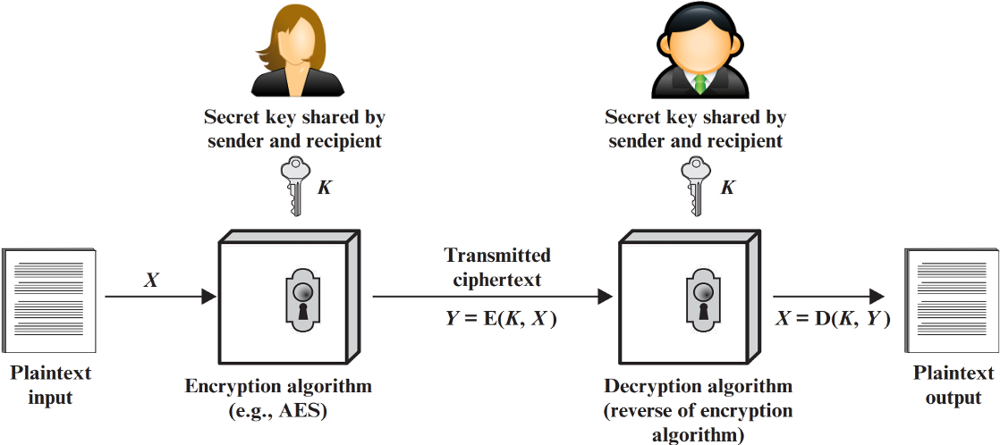
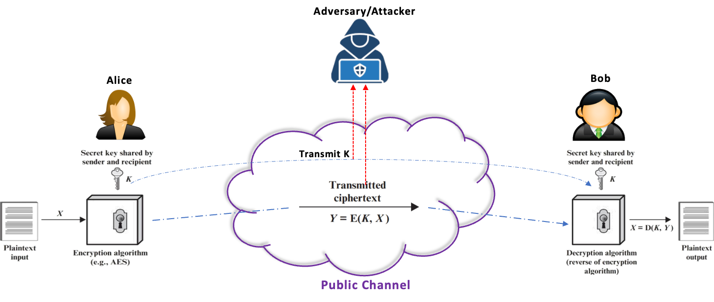
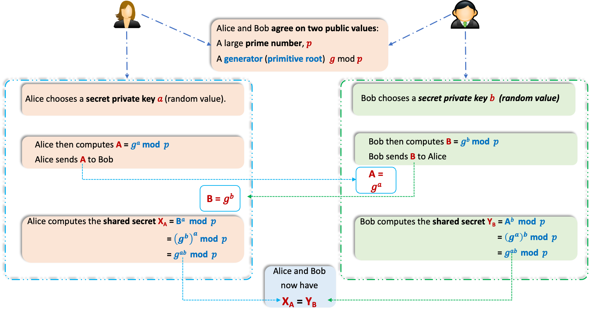
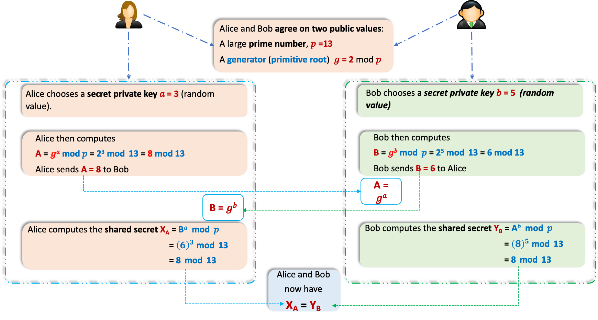
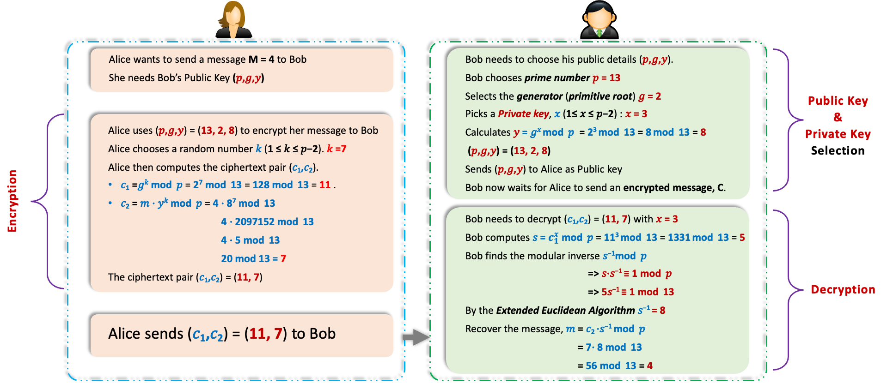
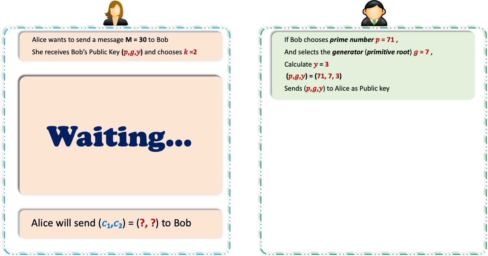
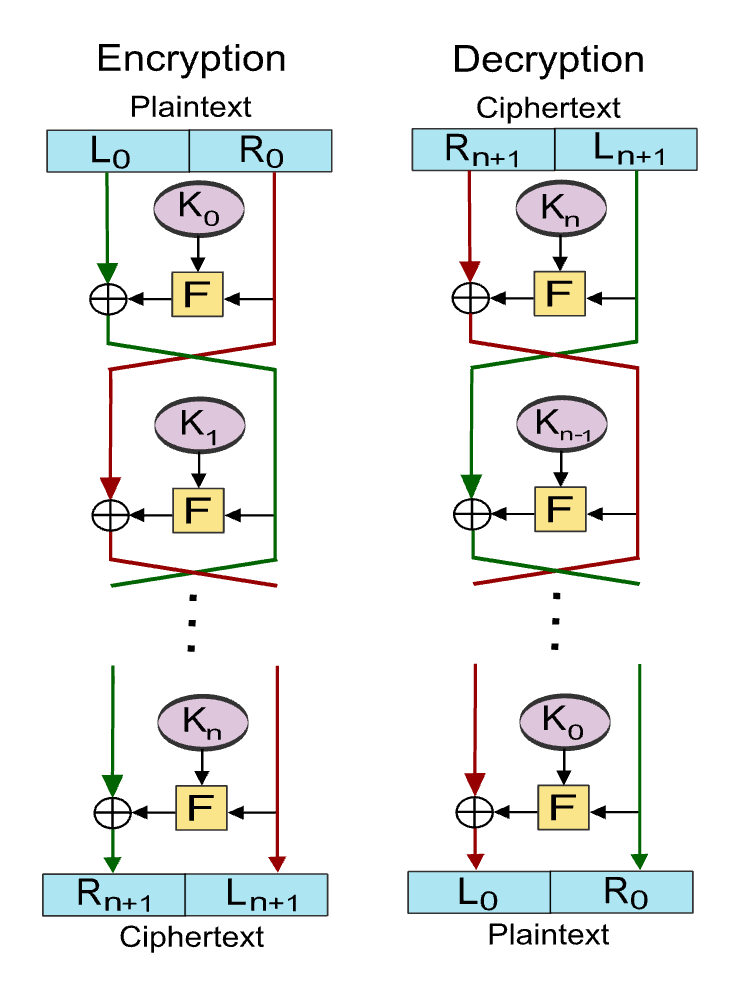
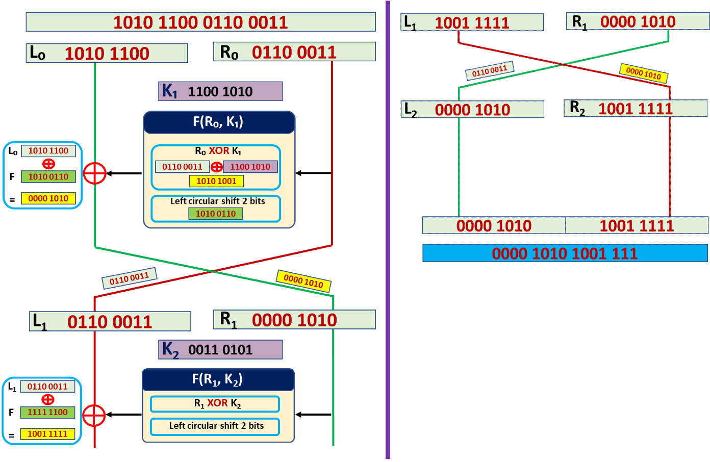

## Lecture Outline

1. Limitations of symmetric key encryption
2. Introduction to Diffie–Hellman key exchange
3. Introduction to ElGamal encryption
4. Key generation, encryption and decryption process of ElGamal
5. Introduction to Digital signature and RSA signature
6. Structure of the Feistel cipher

## Learning Outcomes

By the end of this lecture, students should be able to:

1. Explain the key distribution problem in symmetric encryption
2. Describe the purpose of the Diffie–Hellman key exchange
3. Explain how two parties establish a shared secret using Diffie–Hellman
4. Apply ElGamal encryption through practical examples
5. Understand Digital Signature and How the RSA signature works
6. Describe the structure and working principle of the Feistel cipher

## Symmetric Key Encryption

Symmetric Key Encryption is a cryptographic method where the same key is used for both encryption and decryption.

In this system, both the sender and the receiver share a secret key, and they use it to transform plaintext (original message) into ciphertext (encrypted message) and vice versa.

## Problem with the Symmetric Key Encryption

### Symmetric Key Encryption

### Problem with the Symmetric Key Encryption

1. Transmission of secret key over a public channel is vulnerable to attacks.
2. Attacker can intercept both the shared secret key (K) and ciphertext during transmission.
3. If the secret key is compromised, all communication using that key is at risk.

## Diffie-Hellman Key Exchange

- The Diffie–Hellman key exchange is a method for securely exchanging cryptographic keys over a public channel. It allows two parties to each generate a shared secret key without directly transmitting it over the network. 
- Introduced in 1976 by Whitfield Diffie and Martin Hellman. 
- It was the first practical method for establishing a shared secret over an unprotected communications channel. 
- It allows two parties who have never met before to securely establish a shared key, which can then be used to secure their communication.
- It enables secure key exchange without transmitting the actual secret key

### How it works

### Reading Assignment

#### How to find a generator/primitive root

### Example

### Quiz

|                  |                |
| -------------------------------------------------------- | ------------------------------------------------------ |
| Alice’s secret key: $\textcolor{blue}{S_A} \mathbf{= 3}$ | Bob’s secret key: $\textcolor{blue}{S_B} \mathbf{= 4}$ |

Task:

Users A and B are using the Diffie-Hellman key exchange method with a common prime $\textcolor{blue}{P=11}$ and a generator $\textcolor{blue}{g=2}$. User A chooses her secret key $\textcolor{blue}{S_A} \mathbf{= 3}$ and computes her public value $\textcolor{blue}{C_A}\mathbf{=8}$, which she sends to User B through the public channel. User B selects his secret key $\textcolor{blue}{S_B}\mathbf{=4}$ and computes his public value $\textcolor{blue}{C_B}\mathbf{=5}$, which he sends to User A through the public channel. What is the common secret key shared between User A and User B?

## ElGamal Encryption

The ElGamal Encryption Algorithm is a public-key cryptosystem based on the difficulty of the discrete logarithm problem. It was developed by Taher ElGamal in 1985 and is used for secure data transmission.

### Key Generation

1. Choose a large prime number, $\textcolor{blue}p$.
2. Select a generator ($g$): Pick a number $\textcolor{blue}g$ (where $1 < g < p−1$) that is a generator/primitive root modulo $p$. This ensures $g$ can generate all numbers from $1$ to $p−1$ when raised to different powers.
3. Pick a private key, $\textcolor{blue}x$: Choose a random integer 𝑥 (where $1 \leqslant x \leqslant p−2$) as the private key.
4. Compute the public key $\textcolor{blue}y$: Calculate $\textcolor{blue}{y = g^x \bmod p}$. The public key is the triplet ($\textcolor{red}{p,g,y}$), while $\textcolor{red}x$ remains secret. 

### Encryption

To encrypt a message $\textcolor{blue}m$ (where $0 \leqslant m < p$):

1. Obtain the recipient’s public key: Use their ($\textcolor{blue}{p,g,y}$)
2. Choose a random number $\textcolor{blue}k$: Select a random integer $k$ (where $1 \leqslant k \leqslant p−2$). This is the session key and should be unique for each encryption.
3. Compute the ciphertext pair: 
4. $\textcolor{blue}{c_1 = g^k \bmod p}$ (this hides 𝑘 and is sent as part of the ciphertext).
5. $\textcolor{blue}{c_2 = m \cdot y^k \bmod p}$ (this encrypts the message using the recipient’s public key).
6. Send the ciphertext: The encrypted message is the pair ($\textcolor{blue}{c_1,c_2}$).

### Decryption

To decrypt the ciphertext ($\textcolor{blue}{c_1,c_2}$) using the private key $x$:

1. **Compute the shared secret**: Calculate $\textcolor{blue}{s= c_1^x} \bmod p$. Since $\textcolor{blue}{c_1=g^k}$, this becomes $\textcolor{blue}{s=(g^k)^x=g^{kx} \bmod p}$.
2. **Find the modular inverse of** $s$: Compute $\textcolor{blue}{s^{−1} \bmod p}$ (the number such that $\textcolor{red}{s \cdot s^{−1} \equiv 1 \bmod p}$).
3. Recover the message: Calculate $\textcolor{blue}{m = c_2 \cdot s^{−1} \bmod p}$.

Why it works:  
$\textcolor{blue}{c_2} = m \cdot y^k = m \cdot \textcolor{blue}{(g^x)^k} = m \cdot \textcolor{blue}{g^{kx}}$, so  
$\textcolor{blue}{c_2} \cdot \textcolor{blue}{s^{−1}} = (m \cdot \textcolor{blue}{g^{kx}}) \cdot (\textcolor{blue}{g^{kx}})^{−1} = m$.  

## ElGamal Example

### ElGamal Encryption

### Quiz

#### ElGamal Encryption Quiz -1

#### ElGamal Encryption Quiz - 2

Task:

Consider an ElGamal encryption scheme with a common prime $\textcolor{red}{p=23}$ and a primitive root (generator) $\textcolor{red}{g=5}$. Given that the public key $\textcolor{red}{Y=4}$ and User C chooses the random integer $\textcolor{red}{k=3}$, what is the ciphertext for the message $\textcolor{red}{M=15}$?

## Digital Signature

- A digital signature is a cryptographic technique used to prove the authenticity and integrity of a digital message or document.
- It is created using the sender's private key and verified using the sender's public key.
- It provides assurance that the message has not been modified in transit.

    <!-- Authentication -->
    

        

            Authentication
        

        
Confirms the identity of the sender

    

    <!-- Integrity -->
    

        

            Integrity
        

        
Detects any change in the message

    

    <!-- Non-repudiation -->
    

        

            Non-repudiation
        

    

---

RSA Signature: Choosing Public and Private Keys

- Choose two prime numbers: $p = 3$ and $q = 17$
- Compute $n = p \times q = 3 \times 17 = 51$
- Compute $\phi(n) = (3 − 1)(17 − 1) = 2 \times 16 = 32$
- Choose e such that $1 < e < \phi(n)$ and $\gcd(e, \phi(n)) = 1$. Let $\textcolor{blue}{e = 5}$
- Find d such that $e \cdot d \equiv 1 (\bmod \phi(n))$
- Here, $5 \times 13 = 65 \equiv 1 (\bmod 32)$, so $\textcolor{blue}{d = 13}$

    <!-- Public Key Box -->
    

        

            Public key 
            (e, n) = (5, 51)
        

    

    <!-- Private Key Box -->
    

        

            Private key 
            (d, n) = (13, 51)
        

    

    <!-- Bottom Text -->
    

        These keys are used 
        for signing and verifying
    

---

RSA Signature: Signing and Verifying the Signature

    <!-- 左侧 Sender 签名卡片 -->
    

        <!-- 顶部标题 -->
        

            Sender uses private key to sign
        

        <!-- 步骤列表 -->
        <ul style="
            font-size: 1.4em;
            line-height: 1.6;
            margin: 0 0 20px 25px;
            padding: 0;
        ">
            <li style="margin-bottom: 10px;">
                Let the message hash be h = 2
            </li>
            <li style="margin-bottom: 10px;">
                Use the private key (d, n) = (13, 51)
            </li>
            <li>
                Compute signature: s = hd mod n
            </li>
        </ul>
        <!-- 计算框 -->
        

            s = 213 mod 51 
            &nbsp;= 8192 mod 51 
            &nbsp;= 32
        

        <!-- 底部结论 -->
        

            The digital signature is s = 32
        

    

    <!-- 右侧 Receiver 验证卡片 -->
    

        <!-- 顶部标题 -->
        

            Receiver uses public key to verify
        

        <!-- 步骤列表 -->
        <ul style="
            font-size: 1.4em;
            line-height: 1.6;
            margin: 0 0 20px 25px;
            padding: 0;
        ">
            <li style="margin-bottom: 10px;">
                Receiver uses the public key (e, n) = (5, 51)
            </li>
            <li style="margin-bottom: 10px;">
                Verify signature s = 32 by computing 
                h' = se mod n
            </li>
            <li>
                If h' equals the original hash h = 2, the signature is valid
            </li>
        </ul>
        <!-- 计算框 -->
        

            h' = 325 mod 51 
            &nbsp;&nbsp;= 33554432 mod 51 
            &nbsp;&nbsp;= 2
        

        <!-- 底部结论 -->
        

            Since h' = 2 = h, the signature is valid
        

    

## Feistel Cipher

- The Feistel Cipher is a symmetric encryption algorithm that uses a structure that divides the data into two halves and processes them through multiple rounds of permutation and substitution and then recombines them to produce the ciphertext.
- Its decryption process is essentially the same as encryption, just with the key schedule reversed. 

### How it works

- Splitting the Input: The plaintext block (say, 64 bits) is divided into two equal halves: a left half (L) and a right half (R). Eg. if the block is 64 bits, L₀ and R₀ = 32 bits each.
- Round Function: 
    - The right half (R) is fed into a round function **F**, which takes **R** and a round-specific subkey $\textcolor{red}{K_i}$(derived from the main encryption key) as inputs. This function involve substitution boxes, or S-boxes, and permutations that scrambles the data.
    - The output of F is XORed (**exclusive OR**) with the left half (L).
    - The halves **swap places**: the old **R** becomes the new **L**, and the **XOR result** becomes the new **R**.
- Multiple Rounds: This process repeats for a set number of rounds (usally 16). Each round uses a different subkey, generated from the main key via a key schedule algorithm.
- Final Step: After the last round, the halves are concatenated to form the ciphertext.

### Example

2 ROUNDS

- Plaintext: 16-bit plaintext `1010 1100 0110 0011`
- Subkeys: Two 8-bit
    - Round 1 subkey ($K_1$): `1100 1010`
    - Round 2 subkey ($K_2$): `0011 0101`
- Round Function (F): Define **F(R, K)** as **R** XOR **K** followed by a ***left circular shift of 2*** bits.

### How it works

#### Round 1

1. **Apply $F$ to $R_0$:**
    - $R_0 \textcolor{red}= 0110 ~ 0011$
    - $K_1 \textcolor{red}= 1100 ~ 1010$
    - $R_0 ~ XOR ~ K_1 \textcolor{red}= 0110 ~ 0011 \textcolor{red}\oplus 1100 ~ 1010 \textcolor{red}= 1010 ~ 1001$ (decimal 169)
    - Left shift 2 bits: $1010 ~ 1001$ → $1010 ~ 0110$ (decimal 166)
    - So, $F(R_0,~ K_1) \textcolor{red}= 1010 ~ 0110$
2. **XOR with $L_0$:**
    - $L_0 \textcolor{red}= 1010 ~ 1100$
    - $F(R_0,~ K_1) \textcolor{red}= 1010 ~ 0110$
    - $L_0 \oplus F(R_0,~ K_1) \textcolor{red}= 1010 ~ 1100 \textcolor{red}\oplus 1010 ~ 0110 \textcolor{red}= 0000 ~ 1010$ (decimal 10)
3. **Swap:**
    - New $L_1 = R_0 \textcolor{red}= 0110 ~ 0011$
    - New $R_1 = L_0 \oplus F(R_0,~ K_1) \textcolor{red}= 0000 ~ 1010$

After Round 1: $L_1 \textcolor{red}= 0110 ~ 0011,~ R_1 \textcolor{red}= 0000 ~ 1010$

#### Round 2

1.  **Apply $F$ to $R_1$:**
    - $R_1 \textcolor{red}= 0000\ 1010$
    - $K_2 \textcolor{red}= 0011\ 0101$
    - $R_1\ XOR\ K_2 = 0000\ 1010 \textcolor{red}\oplus 0011\ 0101 = 0011\ 1111$ (decimal 63)
    - Left shift 2 bits: $0011\ 1111$ → $1111\ 1100$ (decimal 252)
    - So, $F(R_1, K_2) = 1111\ 1100$

2.  **XOR with $L_1$:**
    - $L_1 \textcolor{red}= 0110\ 0011$
    - $F(R_1, K_2) \textcolor{red}= 1111\ 1100$
    - $L_1 \oplus F(R_1, K_2) \textcolor{red}= 0110\ 0011 \textcolor{red}\oplus 1111\ 1100 \textcolor{red}= 1001\ 1111$ (decimal 159)

3.  **Swap:**
    - New $L_2 = R_1 \textcolor{red}= 0000\ 1010$
    - New $R_2 = L_1 \oplus F(R_1, K_2) \textcolor{red}= 1001\ 1111$

After Round 2: $L_2 \textcolor{red}= 0000\ 1010,\ R_2 \textcolor{red}= 1001\ 1111$

#### Output

- **Ciphertext**: Concatenate $L_2$ and $R_2$:
    - $L_2 \mathbin{\|} R_2 = 0000\ 1010\ 1001\ 1111$ (16 bits, decimal 175)

