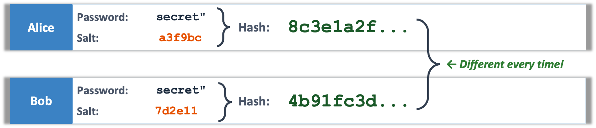
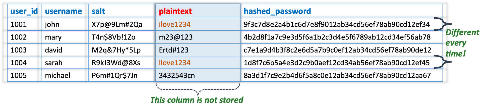
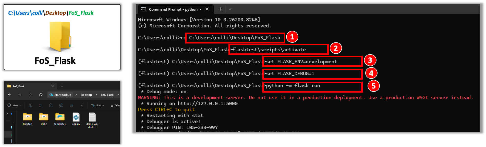
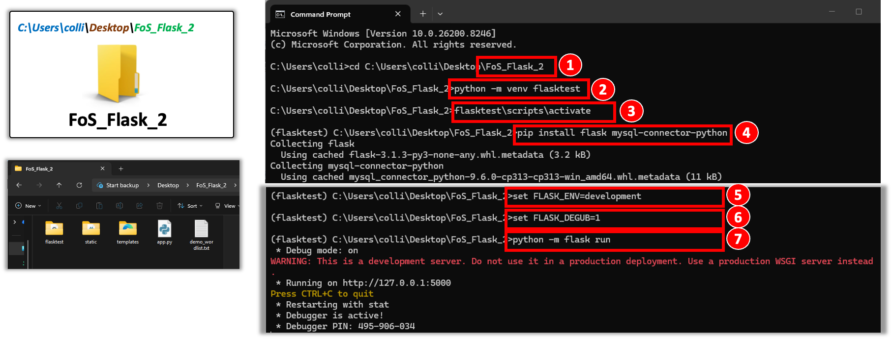

## Learning Outcomes

<html>
    
    

    

        <!-- 卡片1：Understand Hashing -->
        

        

            <svg width="24" height="24" viewBox="0 0 24 24" fill="none" stroke="currentColor" stroke-width="2" stroke-linecap="round" stroke-linejoin="round">
                <path d="M12 22s8-4 8-10V5l-8-3-8 3v7c0 6 8 10 8 10z"></path></svg>
        

        

            <h3 class="hash-card-title">Understand Hashing</h3>
            
Learn what hashing is and why it matters in security

        

        

        <!-- 卡片2：Hashing vs Encryption -->
        

        

            <svg width="24" height="24" viewBox="0 0 24 24" fill="none" stroke="currentColor" stroke-width="2" stroke-linecap="round" stroke-linejoin="round">
                <rect x="3" y="11" width="18" height="11" rx="2" ry="2"></rect>
                <path d="M7 11V7a5 5 0 0 1 10 0v4"></path></svg>
        

        

            <h3 class="hash-card-title">Hashing vs Encryption</h3>
            
Understand the key difference between these two concepts

        

        

        <!-- 卡片3：Generate & Compare Hashes -->
        

        

            <svg width="24" height="24" viewBox="0 0 24 24" fill="none" stroke="currentColor" stroke-width="2" stroke-linecap="round" stroke-linejoin="round">
                <polyline points="16 18 22 12 16 6"></polyline>
                <polyline points="8 6 2 12 8 18"></polyline></svg>
        

        

            <h3 class="hash-card-title">Generate & Compare Hashes</h3>
            
Practice creating password hashes using Python scripts

        

        

        <!-- 卡片4：Dictionary Attack -->
        

        

            <svg width="24" height="24" viewBox="0 0 24 24" fill="none" stroke="currentColor" stroke-width="2" stroke-linecap="round" stroke-linejoin="round">
                <circle cx="11" cy="11" r="8"></circle>
                <line x1="21" y1="21" x2="16.65" y2="16.65"></line></svg>
        

        

            <h3 class="hash-card-title">Dictionary Attack</h3>
            
Simulate a basic attack to crack weak password hashes

        

        

        <!-- 卡片5：Rainbow Tables -->
        

        

            <svg width="24" height="24" viewBox="0 0 24 24" fill="none" stroke="currentColor" stroke-width="2" stroke-linecap="round" stroke-linejoin="round">
                <rect x="3" y="3" width="18" height="18" rx="2" ry="2"></rect>
                <line x1="3" y1="9" x2="21" y2="9"></line>
                <line x1="3" y1="15" x2="21" y2="15"></line>
                <line x1="9" y1="3" x2="9" y2="21"></line>
                <line x1="15" y1="3" x2="15" y2="21"></line></svg>
        

        

            <h3 class="hash-card-title">Rainbow Tables</h3>
            
Know what rainbow tables are and how attackers use them

        

        

        <!-- 卡片6：Salting -->
        

        

            <svg width="24" height="24" viewBox="0 0 24 24" fill="none" stroke="currentColor" stroke-width="2" stroke-linecap="round" stroke-linejoin="round">
                <polygon points="12 2 2 7 12 12 22 7 12 2"></polygon>
                <polyline points="2 17 12 22 22 17"></polyline>
                <polyline points="2 12 12 17 22 12"></polyline></svg>
        

        

            <h3 class="hash-card-title">Salting</h3>
            
Learn why salting protects passwords from attacks

        

        

    

    

</html>

## What is Hashing

<html>
  

  

    

      <!-- 左侧特性列 -->
      

        <!-- 卡片1：One-Way Function -->
        

          

            <svg width="24" height="24" viewBox="0 0 24 24" fill="none" stroke="currentColor" stroke-width="2.5" stroke-linecap="round" stroke-linejoin="round">
              <line x1="6" y1="3" x2="6" y2="15"></line>
              <circle cx="18" cy="6" r="3"></circle>
              <circle cx="6" cy="18" r="3"></circle>
              <line x1="18" y1="9" x2="18" y2="21"></line>
            </svg>
          

          

            <h3 class="feature-title">One-Way Function</h3>
            
Hashing converts any input (like a password) into a fixed-length string of characters. It's a mathematical one-way street.

          

        

        <!-- 卡片2：Irreversible -->
        

          

            <svg width="24" height="24" viewBox="0 0 24 24" fill="none" stroke="currentColor" stroke-width="2" stroke-linecap="round" stroke-linejoin="round">
              <rect x="3" y="11" width="18" height="11" rx="2" ry="2"></rect>
              <path d="M7 11V7a5 5 0 0 1 10 0v4"></path>
            </svg>
          

          

            <h3 class="feature-title">Irreversible</h3>
            
Once hashed, you cannot retrieve the original input from the hash. This is what makes hashing perfect for password storage.

          

        

        <!-- 卡片3：Avalanche Effect -->
        

          

            <svg width="24" height="24" viewBox="0 0 24 24" fill="none" stroke="currentColor" stroke-width="2" stroke-linecap="round" stroke-linejoin="round">
              <path d="M21.5 2v6h-6M2.5 22v-6h6M2 11.5a10 10 0 0 1 18.8-4.3M22 12.5a10 10 0 0 1-18.8 4.2"/>
            </svg>
          

          

            <h3 class="feature-title">Avalanche Effect</h3>
            
Even a tiny change in input creates a completely different hash. This ensures uniqueness and security.

          

        

      

      <!-- 右侧内容列 -->
      

        <!-- 哈希流程卡片 -->
        

          <h2 class="flow-title">How Hashing Works</h2>
          

            

              

                <svg width="32" height="32" viewBox="0 0 24 24" fill="none" stroke="currentColor" stroke-width="2" stroke-linecap="round" stroke-linejoin="round">
                  <path d="M14 2H6a2 2 0 0 0-2 2v16a2 2 0 0 0 2 2h12a2 2 0 0 0 2-2V8z"></path>
                  <polyline points="14 2 14 8 20 8"></polyline>
                  <line x1="16" y1="13" x2="8" y2="13"></line>
                  <line x1="16" y1="17" x2="8" y2="17"></line>
                  <polyline points="10 9 9 9 8 9"></polyline>
                </svg>
              

              
Input

              
Any Length

            

            →
            

              

                <svg width="32" height="32" viewBox="0 0 24 24" fill="none" stroke="currentColor" stroke-width="2" stroke-linecap="round" stroke-linejoin="round">
                  <circle cx="12" cy="12" r="3"></circle>
                  <path d="M19.4 15a1.65 1.65 0 0 0 .33 1.82l.06.06a2 2 0 0 1 0 2.83 2 2 0 0 1-2.83 0l-.06-.06a1.65 1.65 0 0 0-1.82-.33 1.65 1.65 0 0 0-1 1.51V21a2 2 0 0 1-2 2 2 2 0 0 1-2-2v-.09A1.65 1.65 0 0 0 9 19.4a1.65 1.65 0 0 0-1.82.33l-.06.06a2 2 0 0 1-2.83 0 2 2 0 0 1 0-2.83l.06-.06a1.65 1.65 0 0 0 .33-1.82 1.65 1.65 0 0 0-1.51-1H3a2 2 0 0 1-2-2 2 2 0 0 1 2-2h.09A1.65 1.65 0 0 0 4.6 9a1.65 1.65 0 0 0-.33-1.82l-.06-.06a2 2 0 0 1 0-2.83 2 2 0 0 1 2.83 0l.06.06a1.65 1.65 0 0 0 1.82.33H9a1.65 1.65 0 0 0 1-1.51V3a2 2 0 0 1 2-2 2 2 0 0 1 2 2v.09a1.65 1.65 0 0 0 1 1.51 1.65 1.65 0 0 0 1.82-.33l.06-.06a2 2 0 0 1 2.83 0 2 2 0 0 1 0 2.83l-.06.06a1.65 1.65 0 0 0-.33 1.82V9a1.65 1.65 0 0 0 1.51 1H21a2 2 0 0 1 2 2 2 2 0 0 1-2 2h-.09a1.65 1.65 0 0 0-1.51 1z"></path>
                </svg>
              

              
Hash Function

              
Processing

            

            →
            

              

                <!-- 修正后的指纹图标，和原图完全匹配 -->
                <svg fill="#FFFFFF" width="32" height="32" viewBox="0 0 512 512" xmlns="http://www.w3.org/2000/svg">
                  <path d="M256.12 245.96c-13.25 0-24 10.74-24 24 1.14 72.25-8.14 141.9-27.7 211.55-2.73 9.72 2.15 30.49 23.12 30.49 10.48 0 20.11-6.92 23.09-17.52 13.53-47.91 31.04-125.41 29.48-224.52.01-13.25-10.73-24-23.99-24zm-.86-81.73C194 164.16 151.25 211.3 152.1 265.32c.75 47.94-3.75 95.91-13.37 142.55-2.69 12.98 5.67 25.69 18.64 28.36 13.05 2.67 25.67-5.66 28.36-18.64 10.34-50.09 15.17-101.58 14.37-153.02-.41-25.95 19.92-52.49 54.45-52.34 31.31.47 57.15 25.34 57.62 55.47.77 48.05-2.81 96.33-10.61 143.55-2.17 13.06 6.69 25.42 19.76 27.58 19.97 3.33 26.81-15.1 27.58-19.77 8.28-50.03 12.06-101.21 11.27-152.11-.88-55.8-47.94-101.88-104.91-102.72zm-110.69-19.78c-10.3-8.34-25.37-6.8-33.76 3.48-25.62 31.5-39.39 71.28-38.75 112 .59 37.58-2.47 75.27-9.11 112.05-2.34 13.05 6.31 25.53 19.36 27.89 20.11 3.5 27.07-14.81 27.89-19.36 7.19-39.84 10.5-80.66 9.86-121.33-.47-29.88 9.2-57.88 28-80.97 8.35-10.28 6.79-25.39-3.49-33.76zm109.47-62.33c-15.41-.41-30.87 1.44-45.78 4.97-12.89 3.06-20.87 15.98-17.83 28.89 3.06 12.89 16 20.83 28.89 17.83 11.05-2.61 22.47-3.77 34-3.69 75.43 1.13 137.73 61.5 138.88 134.58.59 37.88-1.28 76.11-5.58 113.63-1.5 13.17 7.95 25.08 21.11 26.58 16.72 1.95 25.51-11.88 26.58-21.11a929.06 929.06 0 0 0 5.89-119.85c-1.56-98.75-85.07-180.33-186.16-181.83zm252.07 121.45c-2.86-12.92-15.51-21.2-28.61-18.27-12.94 2.86-21.12 15.66-18.26 28.61 4.71 21.41 4.91 37.41 4.7 61.6-.11 13.27 10.55 24.09 23.8 24.2h.2c13.17 0 23.89-10.61 24-23.8.18-22.18.4-44.11-5.83-72.34zm-40.12-90.72C417.29 43.46 337.6 1.29 252.81.02 183.02-.82 118.47 24.91 70.46 72.94 24.09 119.37-.9 181.04.14 246.65l-.12 21.47c-.39 13.25 10.03 24.31 23.28 24.69.23.02.48.02.72.02 12.92 0 23.59-10.3 23.97-23.3l.16-23.64c-.83-52.5 19.16-101.86 56.28-139 38.76-38.8 91.34-59.67 147.68-58.86 69.45 1.03 134.73 35.56 174.62 92.39 7.61 10.86 22.56 13.45 33.42 5.86 10.84-7.62 13.46-22.59 5.84-33.43z"/>
                </svg>
              

              
Output

              
Fixed Length

            

          

        

        <!-- 示例卡片 -->
        

          <h3 class="example-title">
            
              <svg width="28" height="28" viewBox="0 0 24 24" fill="none" stroke="currentColor" stroke-width="2" stroke-linecap="round" stroke-linejoin="round">
                <polyline points="16 18 22 12 16 6"></polyline>
                <polyline points="8 6 2 12 8 18"></polyline>
              </svg>
            
            Real Example: Avalanche Effect
          </h3>
          

            

              
Input: password

              
5f4dcc3b5aa765d61d8327deb882cf99

            

            

              
Input: Password (capital P)

              
dc647eb65e6711e155375218212b3964

            

          

        

      

    

  

</html>

## How Hashing Works

<html>
  

  

    

      <!-- 左侧输入列 -->
      

        

          <h2>INPUT</h2>
          
(Any Length)

        

        
"password123"

        
"Hello World!"

        
"abc"

        
"MySecretP@ss2024!"

      

      <!-- 中间哈希函数核心块 -->
      

        <svg class="fingerprint-icon" viewBox="0 0 24 24" fill="none" stroke="currentColor" stroke-width="2" stroke-linecap="round" stroke-linejoin="round">
          <path d="M13.1427 20.9999C10.8077 19.5438 9.25254 16.9522 9.25254 13.9968C9.25254 12.4783 10.4833 11.2476 12.0008 11.2476C13.5184 11.2476 14.7491 12.4783 14.7491 13.9968C14.7491 15.5153 15.9798 16.746 17.4974 16.746C19.0149 16.746 20.2457 15.5153 20.2457 13.9968C20.2457 9.44139 16.5544 5.74922 12.0017 5.74922C7.44907 5.74922 3.75781 9.44139 3.75781 13.9968C3.75781 15.0122 3.87145 16.001 4.08038 16.954M8.49027 20.2989C7.23938 18.5138 6.50351 16.3419 6.50351 13.9968C6.50351 10.9599 8.96405 8.49844 11.9992 8.49844C15.0343 8.49844 17.4948 10.9599 17.4948 13.9968M17.7927 19.4806C17.6937 19.4861 17.5966 19.4953 17.4967 19.4953C14.4616 19.4953 12.0011 17.0338 12.0011 13.9969M19.6734 6.47682C17.7993 4.34802 15.0593 3 12.0004 3C8.94141 3 6.20138 4.34802 4.32734 6.47682" stroke="rgb(147, 198, 231)" stroke-width="1" stroke-linecap="round" stroke-linejoin="round"/>
        </svg>
        <h2>HASH FUNCTION</h2>
      

      <!-- 右侧输出列 -->
      

        

          <h2>OUTPUT</h2>
          
(Fixed 64 chars)

        

        
ef92b778...

        
315f5bdb...

        
ba7816bf...

        
9d4e6af0...

      

    

    <!-- 底部不可逆提示条 -->
    

      The hash cannot be reversed — you can never get the original password back from a hash!
    

  

</html>

## How Passwords Are Stored

<html>
  

  

    <!-- 步骤流程区域 -->
    

      <!-- Step 1 -->
      

        
Step 1

        

          

            <svg width="36" height="36" viewBox="0 0 24 24" fill="none" stroke="currentColor" stroke-width="2" stroke-linecap="round" stroke-linejoin="round">
              <path d="M19 11a4 4 0 0 0-4-4H7a4 4 0 0 0 0 8h8a4 4 0 0 0 4-4z"></path>
              <circle cx="16" cy="11" r="1"></circle>
            </svg>
          

          
User creates password

        

      

      <!-- 连接线1 -->
      

      <!-- Step 2 -->
      

        
Step 2

        

          

            <svg width="36" height="36" viewBox="0 0 24 24" fill="none" stroke="currentColor" stroke-width="2" stroke-linecap="round" stroke-linejoin="round">
              <path d="M13.1427 20.9999C10.8077 19.5438 9.25254 16.9522 9.25254 13.9968C9.25254 12.4783 10.4833 11.2476 12.0008 11.2476C13.5184 11.2476 14.7491 12.4783 14.7491 13.9968C14.7491 15.5153 15.9798 16.746 17.4974 16.746C19.0149 16.746 20.2457 15.5153 20.2457 13.9968C20.2457 9.44139 16.5544 5.74922 12.0017 5.74922C7.44907 5.74922 3.75781 9.44139 3.75781 13.9968C3.75781 15.0122 3.87145 16.001 4.08038 16.954M8.49027 20.2989C7.23938 18.5138 6.50351 16.3419 6.50351 13.9968C6.50351 10.9599 8.96405 8.49844 11.9992 8.49844C15.0343 8.49844 17.4948 10.9599 17.4948 13.9968M17.7927 19.4806C17.6937 19.4861 17.5966 19.4953 17.4967 19.4953C14.4616 19.4953 12.0011 17.0338 12.0011 13.9969M19.6734 6.47682C17.7993 4.34802 15.0593 3 12.0004 3C8.94141 3 6.20138 4.34802 4.32734 6.47682" stroke="#FFFFFF" stroke-width="2" stroke-linecap="round" stroke-linejoin="round"/>
            </svg>
          

          
System hashes the password

        

      

      <!-- 连接线2 -->
      

      <!-- Step 3 -->
      

        
Step 3

        

          

            <svg width="36" height="36" viewBox="0 0 24 24" fill="none" stroke="currentColor" stroke-width="2" stroke-linecap="round" stroke-linejoin="round">
              <ellipse cx="12" cy="5" rx="9" ry="3"></ellipse>
              <path d="M21 12c0 1.66-4 3-9 3s-9-1.34-9-3"></path>
              <path d="M3 5v14c0 1.66 4 3 9 3s9-1.34 9-3V5"></path>
            </svg>
          

          
Hash is stored in database

        

      

      <!-- 连接线3 -->
      

      <!-- Step 4 -->
      

        
Step 4

        

          

            <svg width="36" height="36" viewBox="0 0 24 24" fill="none" stroke="currentColor" stroke-width="2" stroke-linecap="round" stroke-linejoin="round">
              <rect x="3" y="11" width="18" height="11" rx="2" ry="2"></rect>
              <path d="M7 11V7a5 5 0 0 1 10 0v4"></path>
            </svg>
          

          
Original password is NEVER saved

        

      

    

    <!-- 数据库存储示例区域 -->
    

      <h3 class="example-title">Example — What a database actually stores:</h3>
      <table class="db-table">
        <tr>
          <td class="label-text">Username:</td>
          <td class="value-text">alice</td>
        </tr>
        <tr>
          <td class="label-text">Password Hash:</td>
          <td class="hash-text">5e884898da28047151d0e56f8dc6292773603d0d6...</td>
        </tr>
      </table>
    

  

</html>

---

<html>
  

  

    

      <!-- 上半部分对比卡片 -->
      

        <!-- 左侧：明文存储危险卡片 -->
        

          

            

              <svg width="24" height="24" viewBox="0 0 24 24" fill="none" stroke="currentColor" stroke-width="3" stroke-linecap="round" stroke-linejoin="round">
                <line x1="18" y1="6" x2="6" y2="18"></line>
                <line x1="6" y1="6" x2="18" y2="18"></line>
              </svg>
            

            <h2 class="card-title danger-title">DANGEROUS: Plain Text</h2>
          

          

            
Database stores:

            

              
Username: john_doe

              
Password: mysecret123

            

          

          <ul class="card-list">
            <li>
              
                <svg width="24" height="24" viewBox="0 0 24 24" fill="none" stroke="currentColor" stroke-width="2" stroke-linecap="round" stroke-linejoin="round">
                  <path d="M10.29 3.86L1.82 18a2 2 0 0 0 1.71 3h16.94a2 2 0 0 0 1.71-3L13.71 3.86a2 2 0 0 0-3.42 0z"></path>
                  <line x1="12" y1="9" x2="12" y2="13"></line>
                  <line x1="12" y1="17" x2="12.01" y2="17"></line>
                </svg>
              
              If database is breached, attacker sees all passwords immediately
            </li>
            <li>
              
                <svg width="24" height="24" viewBox="0 0 24 24" fill="none" stroke="currentColor" stroke-width="2" stroke-linecap="round" stroke-linejoin="round">
                  <path d="M10.29 3.86L1.82 18a2 2 0 0 0 1.71 3h16.94a2 2 0 0 0 1.71-3L13.71 3.86a2 2 0 0 0-3.42 0z"></path>
                  <line x1="12" y1="9" x2="12" y2="13"></line>
                  <line x1="12" y1="17" x2="12.01" y2="17"></line>
                </svg>
              
              Users often reuse passwords across sites
            </li>
            <li>
              
                <svg width="24" height="24" viewBox="0 0 24 24" fill="none" stroke="currentColor" stroke-width="2" stroke-linecap="round" stroke-linejoin="round">
                  <path d="M10.29 3.86L1.82 18a2 2 0 0 0 1.71 3h16.94a2 2 0 0 0 1.71-3L13.71 3.86a2 2 0 0 0-3.42 0z"></path>
                  <line x1="12" y1="9" x2="12" y2="13"></line>
                  <line x1="12" y1="17" x2="12.01" y2="17"></line>
                </svg>
              
              Legal and compliance violations (GDPR, etc.)
            </li>
          </ul>
        

        <!-- 右侧：哈希存储安全卡片 -->
        

          

            

              <svg width="24" height="24" viewBox="0 0 24 24" fill="none" stroke="currentColor" stroke-width="3" stroke-linecap="round" stroke-linejoin="round">
                <polyline points="20 6 9 17 4 12"></polyline>
              </svg>
            

            <h2 class="card-title secure-title">SECURE: Hashed Storage</h2>
          

          

            
Database stores:

            

              
Username: john_doe

              
Password Hash: 5f4dcc3b5aa765d61d8327deb882cf99

            

          

          <ul class="card-list">
            <li>
              
                <svg width="24" height="24" viewBox="0 0 24 24" fill="none" stroke="currentColor" stroke-width="3" stroke-linecap="round" stroke-linejoin="round">
                  <polyline points="20 6 9 17 4 12"></polyline>
                </svg>
              
              Even if database is breached, passwords remain protected
            </li>
            <li>
              
                <svg width="24" height="24" viewBox="0 0 24 24" fill="none" stroke="currentColor" stroke-width="3" stroke-linecap="round" stroke-linejoin="round">
                  <polyline points="20 6 9 17 4 12"></polyline>
                </svg>
              
              Attacker cannot reverse the hash to get original password
            </li>
            <li>
              
                <svg width="24" height="24" viewBox="0 0 24 24" fill="none" stroke="currentColor" stroke-width="3" stroke-linecap="round" stroke-linejoin="round">
                  <polyline points="20 6 9 17 4 12"></polyline>
                </svg>
              
              Meets security compliance requirements
            </li>
          </ul>
        

      

      <!-- 下半部分底部提示条 -->
      

        <!-- 左侧红色警告条 -->
        

          

            <svg width="24" height="24" viewBox="0 0 24 24" fill="none" stroke="currentColor" stroke-width="2" stroke-linecap="round" stroke-linejoin="round">
              <circle cx="12" cy="12" r="10"></circle>
              <line x1="4.93" y1="4.93" x2="19.07" y2="19.07"></line>
            </svg>
          

          

            <h3 class="bar-title">Never store passwords in plain text!</h3>
            
This is considered negligent and can result in severe penalties.

          

        

        <!-- 右侧绿色提示条 -->
        

          

            <svg width="24" height="24" viewBox="0 0 24 24" fill="none" stroke="currentColor" stroke-width="2" stroke-linecap="round" stroke-linejoin="round">
              <path d="M12 22s8-4 8-10V5l-8-3-8 3v7c0 6 8 10 8 10z"></path>
            </svg>
          

          

            <h3 class="bar-title">Always hash passwords!</h3>
            
This is the industry standard and minimum security requirement.

          

        

      

    

  

</html>

## Common Hash Algorithms

<html>
  

  

    

      <!-- MD5 卡片 -->
      

        

          <svg width="40" height="40" viewBox="0 0 24 24" fill="none" stroke="currentColor" stroke-width="1" stroke-linecap="round" stroke-linejoin="round">
            <path fill-rule="evenodd" clip-rule="evenodd" d="M10.7784 1C10.3231 1 9.92838 1.31506 9.82748 1.75902L8.63635 7H5C4.44772 7 4 7.44772 4 8C4 8.55228 4.44772 9 5 9H8.1818L6.81817 15H3C2.44772 15 2 15.4477 2 16C2 16.5523 2.44772 17 3 17H6.36362L5.27072 21.8088C5.13204 22.419 5.59584 23 6.22161 23C6.6769 23 7.07159 22.6849 7.17249 22.241L8.36362 17H13.3636L12.2707 21.8088C12.132 22.419 12.5958 23 13.2216 23C13.6769 23 14.0716 22.6849 14.1725 22.241L15.3636 17H19C19.5523 17 20 16.5523 20 16C20 15.4477 19.5523 15 19 15H15.8182L17.1818 9H21C21.5523 9 22 8.55228 22 8C22 7.44772 21.5523 7 21 7H17.6364L18.7292 2.19124C18.8679 1.58104 18.4041 1 17.7784 1C17.3231 1 16.9284 1.31506 16.8275 1.75902L15.6364 7H10.6363L11.7292 2.19124C11.8679 1.58104 11.4041 1 10.7784 1ZM13.8182 15L15.1818 9H10.1818L8.81817 15H13.8182Z" fill="#FFFFFF"/>
          </svg>
        

        
MD5

      

      <!-- SHA-1 卡片 -->
      

        

          <svg width="40" height="40" viewBox="0 0 24 24" fill="none" stroke="currentColor" stroke-width="1" stroke-linecap="round" stroke-linejoin="round">
            <path fill-rule="evenodd" clip-rule="evenodd" d="M10.7784 1C10.3231 1 9.92838 1.31506 9.82748 1.75902L8.63635 7H5C4.44772 7 4 7.44772 4 8C4 8.55228 4.44772 9 5 9H8.1818L6.81817 15H3C2.44772 15 2 15.4477 2 16C2 16.5523 2.44772 17 3 17H6.36362L5.27072 21.8088C5.13204 22.419 5.59584 23 6.22161 23C6.6769 23 7.07159 22.6849 7.17249 22.241L8.36362 17H13.3636L12.2707 21.8088C12.132 22.419 12.5958 23 13.2216 23C13.6769 23 14.0716 22.6849 14.1725 22.241L15.3636 17H19C19.5523 17 20 16.5523 20 16C20 15.4477 19.5523 15 19 15H15.8182L17.1818 9H21C21.5523 9 22 8.55228 22 8C22 7.44772 21.5523 7 21 7H17.6364L18.7292 2.19124C18.8679 1.58104 18.4041 1 17.7784 1C17.3231 1 16.9284 1.31506 16.8275 1.75902L15.6364 7H10.6363L11.7292 2.19124C11.8679 1.58104 11.4041 1 10.7784 1ZM13.8182 15L15.1818 9H10.1818L8.81817 15H13.8182Z" fill="#FFFFFF"/>
          </svg>
        

        
SHA-1

      

      <!-- SHA-256 卡片 -->
      

        

          <svg width="40" height="40" viewBox="0 0 24 24" fill="none" stroke="currentColor" stroke-width="1" stroke-linecap="round" stroke-linejoin="round">
            <path fill-rule="evenodd" clip-rule="evenodd" d="M10.7784 1C10.3231 1 9.92838 1.31506 9.82748 1.75902L8.63635 7H5C4.44772 7 4 7.44772 4 8C4 8.55228 4.44772 9 5 9H8.1818L6.81817 15H3C2.44772 15 2 15.4477 2 16C2 16.5523 2.44772 17 3 17H6.36362L5.27072 21.8088C5.13204 22.419 5.59584 23 6.22161 23C6.6769 23 7.07159 22.6849 7.17249 22.241L8.36362 17H13.3636L12.2707 21.8088C12.132 22.419 12.5958 23 13.2216 23C13.6769 23 14.0716 22.6849 14.1725 22.241L15.3636 17H19C19.5523 17 20 16.5523 20 16C20 15.4477 19.5523 15 19 15H15.8182L17.1818 9H21C21.5523 9 22 8.55228 22 8C22 7.44772 21.5523 7 21 7H17.6364L18.7292 2.19124C18.8679 1.58104 18.4041 1 17.7784 1C17.3231 1 16.9284 1.31506 16.8275 1.75902L15.6364 7H10.6363L11.7292 2.19124C11.8679 1.58104 11.4041 1 10.7784 1ZM13.8182 15L15.1818 9H10.1818L8.81817 15H13.8182Z" fill="#FFFFFF"/>
          </svg>
        

        
SHA-256

      

    

  

</html>

---

<html>
  

  

    

      <!-- MD5 卡片 -->
      

        

          

            <h2 class="card-title">MD5</h2>
            AVOID
          

          
Message Digest 5

        

        

          

            

              <svg class="info-icon" viewBox="0 0 24 24" fill="none" stroke="currentColor" stroke-width="2" stroke-linecap="round" stroke-linejoin="round">
                <rect x="3" y="4" width="18" height="18" rx="2" ry="2"></rect>
                <line x1="16" y1="2" x2="16" y2="6"></line>
                <line x1="8" y1="2" x2="8" y2="6"></line>
                <line x1="3" y1="10" x2="21" y2="10"></line>
              </svg>
              Created: 1991
            

            

              <svg class="info-icon" viewBox="0 0 24 24" fill="none" stroke="currentColor" stroke-width="2" stroke-linecap="round" stroke-linejoin="round">
                <line x1="3" y1="12" x2="21" y2="12"></line>
                <line x1="3" y1="6" x2="21" y2="6"></line>
                <line x1="3" y1="18" x2="21" y2="18"></line>
              </svg>
              Output: 128 bits (32 chars)
            

          

          

            <h3 class="note-title">Why Avoid:</h3>
            
Vulnerable to collision attacks. Can generate same hash for different inputs.

          

        

      

      <!-- SHA-1 卡片 -->
      

        

          

            <h2 class="card-title">SHA-1</h2>
            DEPRECATED
          

          
Secure Hash Algorithm 1

        

        

          

            

              <svg class="info-icon" viewBox="0 0 24 24" fill="none" stroke="currentColor" stroke-width="2" stroke-linecap="round" stroke-linejoin="round">
                <rect x="3" y="4" width="18" height="18" rx="2" ry="2"></rect>
                <line x1="16" y1="2" x2="16" y2="6"></line>
                <line x1="8" y1="2" x2="8" y2="6"></line>
                <line x1="3" y1="10" x2="21" y2="10"></line>
              </svg>
              Created: 1995
            

            

              <svg class="info-icon" viewBox="0 0 24 24" fill="none" stroke="currentColor" stroke-width="2" stroke-linecap="round" stroke-linejoin="round">
                <line x1="3" y1="12" x2="21" y2="12"></line>
                <line x1="3" y1="6" x2="21" y2="6"></line>
                <line x1="3" y1="18" x2="21" y2="18"></line>
              </svg>
              Output: 160 bits (40 chars)
            

          

          

            <h3 class="note-title">Why Deprecated:</h3>
            
Theoretical attacks proven. Google demonstrated real collision in 2017.

          

        

      

      <!-- SHA-256 卡片 -->
      

        

          

            <h2 class="card-title">SHA-256</h2>
            RECOMMENDED
          

          
Secure Hash Algorithm 256

        

        

          

            

              <svg class="info-icon" viewBox="0 0 24 24" fill="none" stroke="currentColor" stroke-width="2" stroke-linecap="round" stroke-linejoin="round">
                <rect x="3" y="4" width="18" height="18" rx="2" ry="2"></rect>
                <line x1="16" y1="2" x2="16" y2="6"></line>
                <line x1="8" y1="2" x2="8" y2="6"></line>
                <line x1="3" y1="10" x2="21" y2="10"></line>
              </svg>
              Created: 2001
            

            

              <svg class="info-icon" viewBox="0 0 24 24" fill="none" stroke="currentColor" stroke-width="2" stroke-linecap="round" stroke-linejoin="round">
                <line x1="3" y1="12" x2="21" y2="12"></line>
                <line x1="3" y1="6" x2="21" y2="6"></line>
                <line x1="3" y1="18" x2="21" y2="18"></line>
              </svg>
              Output: 256 bits (64 chars)
            

          

          

            <h3 class="note-title">Why Recommended:</h3>
            
Part of SHA-2 family. Currently secure with no practical attacks.

          

        

      

    

  

</html>

## Hashing vs Encryption

<html>
  

  

    

      <!-- 左侧 Hashing 卡片 -->
      

        

          

            <svg width="28" height="28" viewBox="0 0 24 24" fill="none" stroke="currentColor" stroke-width="1" stroke-linecap="round" stroke-linejoin="round">
              <path fill-rule="evenodd" clip-rule="evenodd" d="M10.7784 1C10.3231 1 9.92838 1.31506 9.82748 1.75902L8.63635 7H5C4.44772 7 4 7.44772 4 8C4 8.55228 4.44772 9 5 9H8.1818L6.81817 15H3C2.44772 15 2 15.4477 2 16C2 16.5523 2.44772 17 3 17H6.36362L5.27072 21.8088C5.13204 22.419 5.59584 23 6.22161 23C6.6769 23 7.07159 22.6849 7.17249 22.241L8.36362 17H13.3636L12.2707 21.8088C12.132 22.419 12.5958 23 13.2216 23C13.6769 23 14.0716 22.6849 14.1725 22.241L15.3636 17H19C19.5523 17 20 16.5523 20 16C20 15.4477 19.5523 15 19 15H15.8182L17.1818 9H21C21.5523 9 22 8.55228 22 8C22 7.44772 21.5523 7 21 7H17.6364L18.7292 2.19124C18.8679 1.58104 18.4041 1 17.7784 1C17.3231 1 16.9284 1.31506 16.8275 1.75902L15.6364 7H10.6363L11.7292 2.19124C11.8679 1.58104 11.4041 1 10.7784 1ZM13.8182 15L15.1818 9H10.1818L8.81817 15H13.8182Z" fill="#FFFFFF"/>
            </svg>
          

          <h2 class="card-title">Hashing</h2>
        

        

          <ul class="feature-list">
            <li class="feature-item">
              
                <svg viewBox="0 0 24 24" fill="#3b82f6" stroke="white" stroke-width="3" stroke-linecap="round" stroke-linejoin="round">
                  <circle cx="12" cy="12" r="10"></circle>
                  <polyline points="20 6 9 17 4 12"></polyline>
                </svg>
              
              One-Way Process
            </li>
            <li class="feature-item">
              
                <svg viewBox="0 0 24 24" fill="#3b82f6" stroke="white" stroke-width="3" stroke-linecap="round" stroke-linejoin="round">
                  <circle cx="12" cy="12" r="10"></circle>
                  <polyline points="20 6 9 17 4 12"></polyline>
                </svg>
              
              No Key Required
            </li>
            <li class="feature-item">
              
                <svg viewBox="0 0 24 24" fill="#3b82f6" stroke="white" stroke-width="3" stroke-linecap="round" stroke-linejoin="round">
                  <circle cx="12" cy="12" r="10"></circle>
                  <polyline points="20 6 9 17 4 12"></polyline>
                </svg>
              
              Fixed Output Length
            </li>
          </ul>
          

            <h3 class="used-for-title">
              
                <svg viewBox="0 0 24 24" fill="none" stroke="currentColor" stroke-width="2" stroke-linecap="round" stroke-linejoin="round">
                  <path d="M2 12h1M22 12h-1M12 2v1M12 22v-1M18.36 5.64l-.7.7M5.64 5.64l.7.7M18.36 18.36l-.7-.7M5.64 18.36l.7-.7"></path>
                  <circle cx="12" cy="12" r="4"></circle>
                </svg>
              
              Used For:
            </h3>
            
Password storage, data integrity verification, digital signatures

          

        

      

      <!-- 右侧 Encryption 卡片 -->
      

        

          

            <svg width="28" height="28" viewBox="0 0 16 16" fill="none" xmlns="http://www.w3.org/2000/svg">
              <path fill-rule="evenodd" clip-rule="evenodd" d="M16 5.5C16 8.53757 13.5376 11 10.5 11H7V13H5V15L4 16H0V12L5.16351 6.83649C5.0567 6.40863 5 5.96094 5 5.5C5 2.46243 7.46243 0 10.5 0C13.5376 0 16 2.46243 16 5.5ZM13 4C13 4.55228 12.5523 5 12 5C11.4477 5 11 4.55228 11 4C11 3.44772 11.4477 3 12 3C12.5523 3 13 3.44772 13 4Z" fill="#FFFFFF"/>
            </svg>
          

          <h2 class="card-title">Encryption</h2>
        

        

          <ul class="feature-list">
            <li class="feature-item">
              
                <svg viewBox="0 0 24 24" fill="#3b82f6" stroke="white" stroke-width="3" stroke-linecap="round" stroke-linejoin="round">
                  <circle cx="12" cy="12" r="10"></circle>
                  <polyline points="20 6 9 17 4 12"></polyline>
                </svg>
              
              Two-Way Process
            </li>
            <li class="feature-item">
              
                <svg viewBox="0 0 24 24" fill="#3b82f6" stroke="white" stroke-width="3" stroke-linecap="round" stroke-linejoin="round">
                  <circle cx="12" cy="12" r="10"></circle>
                  <polyline points="20 6 9 17 4 12"></polyline>
                </svg>
              
              Requires a Key
            </li>
            <li class="feature-item">
              
                <svg viewBox="0 0 24 24" fill="#3b82f6" stroke="white" stroke-width="3" stroke-linecap="round" stroke-linejoin="round">
                  <circle cx="12" cy="12" r="10"></circle>
                  <polyline points="20 6 9 17 4 12"></polyline>
                </svg>
              
              Variable Output Length
            </li>
          </ul>
          

            <h3 class="used-for-title">
              
                <svg viewBox="0 0 24 24" fill="none" stroke="currentColor" stroke-width="2" stroke-linecap="round" stroke-linejoin="round">
                  <path d="M2 12h1M22 12h-1M12 2v1M12 22v-1M18.36 5.64l-.7.7M5.64 5.64l.7.7M18.36 18.36l-.7-.7M5.64 18.36l.7-.7"></path>
                  <circle cx="12" cy="12" r="4"></circle>
                </svg>
              
              Used For:
            </h3>
            
Data transmission, file protection, secure messaging

          

        

      

    

  

</html>

## Dictionary Attack

<html>
  

  

    

      <!-- 左侧主卡片 -->
      

        <h1 class="main-title">What is a Dictionary Attack?</h1>
        
A dictionary attack uses a pre-compiled list of common passwords ("dictionary") and tries each one against a stolen hash.

        
Instead of trying every possible combination (brute force), attackers focus on passwords people actually use.

        

          <h3 class="list-title">
            <svg class="list-icon" viewBox="0 0 24 24" fill="none" stroke="currentColor" stroke-width="2" stroke-linecap="round" stroke-linejoin="round">
              <line x1="3" y1="12" x2="21" y2="12"></line>
              <line x1="3" y1="6" x2="21" y2="6"></line>
              <line x1="3" y1="18" x2="21" y2="18"></line>
            </svg>
            Common Password Lists Include:
          </h3>
          

            
password123

            
qwerty

            
12345678

            
admin

            
letmein

            
welcome1

            
iloveyou

            
monkey

          

        

      

      <!-- 右侧侧边卡片 -->
      

        <h2 class="side-title">
          <svg class="warning-icon" viewBox="0 0 24 24" fill="none" stroke="currentColor" stroke-width="2" stroke-linecap="round" stroke-linejoin="round">
            <path d="M10.29 3.86L1.82 18a2 2 0 0 0 1.71 3h16.94a2 2 0 0 0 1.71-3L13.71 3.86a2 2 0 0 0-3.42 0z"></path>
            <line x1="12" y1="9" x2="12" y2="13"></line>
            <line x1="12" y1="17" x2="12.01" y2="17"></line>
          </svg>
          Why It Works
        </h2>
        

          <h3 class="reason-title">People Use Weak Passwords</h3>
          
Studies show 23 million accounts use "123456"

        

        

          <h3 class="reason-title">Fast Processing</h3>
          
Modern GPUs can test billions of passwords per second

        

        

          <h3 class="reason-title">Password Reuse</h3>
          
59% of people reuse passwords across sites

        

      

    

  

</html>

## Rainbow Tables

<html>
  

  

    

      <!-- 左侧主卡片 -->
      

        <h1 class="main-title">Understanding Rainbow Tables</h1>
        
A rainbow table is a pre-computed database of password hashes.

        
Attackers create these tables in advance, then use them to crack passwords instantly without computing hashes during the attack.

        

          <h3 class="example-title">
            <svg class="table-icon" viewBox="0 0 24 24" fill="none" stroke="currentColor" stroke-width="2" stroke-linecap="round" stroke-linejoin="round">
              <rect x="3" y="3" width="18" height="18" rx="2" ry="2"></rect>
              <line x1="3" y1="9" x2="21" y2="9"></line>
              <line x1="3" y1="15" x2="21" y2="15"></line>
              <line x1="9" y1="3" x2="9" y2="21"></line>
              <line x1="15" y1="3" x2="15" y2="21"></line>
            </svg>
            What a Rainbow Table Looks Like:
          </h3>
          <table class="hash-table">
            <thead>
              <tr>
                <th>Plain Text</th>
                <th>MD5 Hash</th>
              </tr>
            </thead>
            <tbody>
              <tr>
                <td>password</td>
                <td class="hash-text" style="color: #3B82F6;">5f4dcc3b5aa765d61d...</td>
              </tr>
              <tr>
                <td>123456</td>
                <td class="hash-text" style="color: #3B82F6;">e10adc3949ba59abbe...</td>
              </tr>
              <tr>
                <td>qwerty</td>
                <td class="hash-text" style="color: #3B82F6;">d8578edf8458ce06fbc...</td>
              </tr>
              <tr>
                <td>admin</td>
                <td class="hash-text" style="color: #3B82F6;">21232f297a57a5a7438...</td>
              </tr>
              <tr>
                <td>letmein</td>
                <td class="hash-text" style="color: #3B82F6;">0d107d09f5bbe40cade...</td>
              </tr>
            </tbody>
          </table>
        

      

      <!-- 右侧侧边卡片 -->
      

        <h2 class="side-title">
          <svg class="warning-icon" viewBox="0 0 24 24" fill="none" stroke="currentColor" stroke-width="2" stroke-linecap="round" stroke-linejoin="round">
            <circle cx="12" cy="12" r="10"></circle>
            <line x1="12" y1="8" x2="12" y2="12"></line>
            <line x1="12" y1="16" x2="12.01" y2="16"></line>
          </svg>
          Why They're Dangerous
        </h2>
        

          

            <svg width="20" height="20" viewBox="0 0 24 24" fill="none" stroke="currentColor" stroke-width="2" stroke-linecap="round" stroke-linejoin="round">
              <path d="M13 2L3 14h9l-1 8 10-12h-9l1-8z"></path>
            </svg>
          

          

            <h3 class="item-title">Instant Cracking</h3>
            
No computation needed during attack - just a table lookup

          

        

        

          

            <svg width="20" height="20" viewBox="0 0 24 24" fill="none" stroke="currentColor" stroke-width="2" stroke-linecap="round" stroke-linejoin="round">
              <path d="M17 21v-2a4 4 0 0 0-4-4H5a4 4 0 0 0-4 4v2"></path>
              <circle cx="9" cy="7" r="4"></circle>
              <path d="M23 21v-2a4 4 0 0 0-3-3.87"></path>
              <path d="M16 3.13a4 4 0 0 1 0 7.75"></path>
            </svg>
          

          

            <h3 class="item-title">Mass Cracking</h3>
            
One table can crack millions of passwords

          

        

        

          

            <svg width="20" height="20" viewBox="0 0 24 24" fill="none" stroke="currentColor" stroke-width="2" stroke-linecap="round" stroke-linejoin="round">
              <path d="M21 15v4a2 2 0 0 1-2 2H5a2 2 0 0 1-2-2v-4"></path>
              <polyline points="7 10 12 15 17 10"></polyline>
              <line x1="12" y1="15" x2="12" y2="3"></line>
            </svg>
          

          

            <h3 class="item-title">Freely Available</h3>
            
Tables for common passwords can be downloaded online

          

        

      

    

  

</html>

## Comparison

<html>
  
  

    <table class="attack-comparison-table">
      <thead>
        <tr>
          <th>Attack Type</th>
          <th>Main Idea</th>
          <th>How it Works</th>
          <th>Speed</th>
          <th>Main Weakness</th>
          <th>Best Defense</th>
        </tr>
      </thead>
      <tbody>
        <tr>
          <td>Dictionary Attack</td>
          <td>Tries likely passwords</td>
          <td>Uses a list of common words, names, and weak password patterns</td>
          <td>Faster than brute force</td>
          <td>Fails if password is uncommon and strong</td>
          <td>Strong, unique passwords and account lockout</td>
        </tr>
        <tr>
          <td>Brute Force Attack</td>
          <td>Tries every possible combination</td>
          <td>Tests all possible characters and lengths until the correct password is found</td>
          <td>Slowest</td>
          <td>Very time consuming for long complex passwords</td>
          <td>Long, complex passwords and rate limiting</td>
        </tr>
        <tr>
          <td>Rainbow Table Attack</td>
          <td>Looks up precomputed hash values</td>
          <td>Compares stolen password hashes against a prebuilt table of password-hash pairs</td>
          <td>Very fast once table exists</td>
          <td>Fails against salted hashes</td>
          <td>Salting and strong hash algorithms</td>
        </tr>
      </tbody>
    </table>
  

</html>

## Salting

<html>
  

  

    

      <!-- 左侧主卡片 -->
      

        <h1 class="main-title">
          <svg class="title-icon" viewBox="0 0 24 24" fill="none" stroke="currentColor" stroke-width="2" stroke-linecap="round" stroke-linejoin="round">
            <path d="M12 22s8-4 8-10V5l-8-3-8 3v7c0 6 8 10 8 10z"></path>
          </svg>
          Understanding Salting
        </h1>
        
Salting is the process of adding a unique, random string to each password before hashing. This ensures that even identical passwords produce completely different hashes.

        

          <h3 class="steps-title">
            <svg class="key-icon" viewBox="0 0 24 24" fill="none" stroke="currentColor" stroke-width="2" stroke-linecap="round" stroke-linejoin="round">
              <path d="M21 2l-2 2m-7.61 7.61a5.5 5.5 0 1 1-7.778 7.778 5.5 5.5 0 0 1 7.778-7.778Z"></path>
              <path d="m15.5 7.5 4 4"></path>
            </svg>
            How Salting Works:
          </h3>
          

            

              
1

              
User enters password: password123

            

            

              
2

              
System generates random salt: x7#K9mP$

            

            

              
3

              
Combines: password123x7#K9mP$

            

            

              
4

              
Hashes combined string → stores salt + hash

            

          

        

      

      <!-- 右侧侧边卡片 -->
      

        <h2 class="side-title">
          <svg class="code-icon" viewBox="0 0 24 24" fill="none" stroke="currentColor" stroke-width="2" stroke-linecap="round" stroke-linejoin="round">
            <polyline points="16 18 22 12 16 6"></polyline>
            <polyline points="8 6 2 12 8 18"></polyline>
          </svg>
          Storage Format
        </h2>
        

          
Database stores:

          

            Username: john_doe
          

          

            Salt: x7#K9mP$
          

          

            Hash: a3f7c2d8...
          

        

        

          <svg class="info-icon" viewBox="0 0 24 24" fill="none" stroke="currentColor" stroke-width="2" stroke-linecap="round" stroke-linejoin="round">
            <circle cx="12" cy="12" r="10"></circle>
            <line x1="12" y1="16" x2="12" y2="12"></line>
            <line x1="12" y1="8" x2="12.01" y2="8"></line>
          </svg>
          
Salt is stored in plain text! Its purpose is to make pre-computed attacks impossible, not to be secret.

        

      

    

  

</html>

---

Same password, but different hashes — because of unique salts:

## Simple Database illustration

| user_id | username | salt | hashed_password |
| ---------------------------------------- | ----------------------------------------- | ------------------------------------- | ------------------------------------------------ |
| 1001                                     | john                                      | X7p@9Lm#2Qa                           | 9f3c7d8e2a4b1c6d7e8f9012ab34cd56ef78ab90cd12ef34 |
| 1002                                     | mary                                      | T4n$8Vb!1Zo                           | 4b2d8f1a7c9e3d5f6a1b2c3d4e5f6789ab12cd34ef56ab78 |
| 1003                                     | david                                     | M2q&7Hy*5Lp                           | c7e1a9d4b3f8c2e6d5a7b9c0ef12ab34cd56ef78ab90de12 |
| 1004                                     | sarah                                     | R9k!3Wd@8Xs                           | 1d8f7c6b5a4e3d2c9b0aef12cd34ab56ef78ab90cd12ef45 |
| 1005                                     | michael                                   | P6m#1Qr$7Jn                           | 8a3d1f7c9e2b4d6f5a8c0e12ab34cd56ef78ab90cd12aa67 |

## Password Security Best Practices

<html>
  

  

    

      <!-- 左上卡片：1. Use Strong Hash Algorithms -->
      

        

          <svg width="24" height="24" viewBox="0 0 24 24" fill="none" stroke="currentColor" stroke-width="3" stroke-linecap="round" stroke-linejoin="round">
            <polyline points="20 6 9 17 4 12"></polyline>
            <polyline points="15 5 8 12 6 10"></polyline>
          </svg>
        

        

          <h3 class="card-title">1. Use Strong Hash Algorithms</h3>
          
Choose algorithms specifically designed for password hashing:

          

            

              <svg class="tag-icon" viewBox="0 0 24 24" fill="none" stroke="currentColor" stroke-width="2" stroke-linecap="round" stroke-linejoin="round">
                <path d="M12 2l3.09 6.26L22 9.27l-5 4.87 1.18 6.88L12 17.77l-6.18 3.25L7 14.14 2 9.27l6.91-1.01L12 2z"></path>
              </svg>
              bcrypt (Recommended)
            

            

              <svg class="tag-icon" viewBox="0 0 24 24" fill="none" stroke="currentColor" stroke-width="2" stroke-linecap="round" stroke-linejoin="round">
                <path d="M12 2l3.09 6.26L22 9.27l-5 4.87 1.18 6.88L12 17.77l-6.18 3.25L7 14.14 2 9.27l6.91-1.01L12 2z"></path>
              </svg>
              Argon2 (Winner of Password Hashing Competition)
            

            

              <svg class="tag-icon" viewBox="0 0 24 24" fill="none" stroke="currentColor" stroke-width="2" stroke-linecap="round" stroke-linejoin="round">
                <path d="M10.29 3.86L1.82 18a2 2 0 0 0 1.71 3h16.94a2 2 0 0 0 1.71-3L13.71 3.86a2 2 0 0 0-3.42 0z"></path>
                <line x1="12" y1="9" x2="12" y2="13"></line>
                <line x1="12" y1="17" x2="12.01" y2="17"></line>
              </svg>
              SHA-256 (OK with proper salting)
            

          

        

      

      <!-- 右上卡片：3. Enforce Strong Password Policies -->
      

        

          <svg width="24" height="24" viewBox="0 0 48 48" xmlns="http://www.w3.org/2000/svg">
            <g id="Layer_2" data-name="Layer 2">
              <g id="invisible_box" data-name="invisible box">
                <rect width="48" height="48" fill="none"/>
              </g>
              <g id="Layer_7" data-name="Layer 7">
                <g>
                  <path d="M3,30.5l-1,.6V39a2,2,0,0,0,2,2H24V28.3A24.4,24.4,0,0,0,16,27,25.6,25.6,0,0,0,3,30.5Z" fill="#FFFFFF"/>
                  <path d="M16,5a9,9,0,1,0,9,9A9,9,0,0,0,16,5Z" fill="#FFFFFF"/>
                  <path d="M44,28H43V25a6,6,0,0,0-12,0v3H30a2,2,0,0,0-2,2V41a2,2,0,0,0,2,2H44a2,2,0,0,0,2-2V30A2,2,0,0,0,44,28Zm-9-3a2,2,0,0,1,4,0v3H35Z" fill="#FFFFFF"/>
                </g>
              </g>
            </g>
          </svg>
        

        

          <h3 class="card-title">3. Enforce Strong Password Policies</h3>
          
Help users create secure passwords:

          <ul class="feature-list">
            <li class="feature-item">
              <svg class="check-icon" viewBox="0 0 24 24" fill="none" stroke="currentColor" stroke-width="3" stroke-linecap="round" stroke-linejoin="round">
                <polyline points="20 6 9 17 4 12"></polyline>
              </svg>
              Minimum 12 characters
            </li>
            <li class="feature-item">
              <svg class="check-icon" viewBox="0 0 24 24" fill="none" stroke="currentColor" stroke-width="3" stroke-linecap="round" stroke-linejoin="round">
                <polyline points="20 6 9 17 4 12"></polyline>
              </svg>
              Require mixed case, numbers, symbols
            </li>
            <li class="feature-item">
              <svg class="check-icon" viewBox="0 0 24 24" fill="none" stroke="currentColor" stroke-width="3" stroke-linecap="round" stroke-linejoin="round">
                <polyline points="20 6 9 17 4 12"></polyline>
              </svg>
              Check against known breached passwords
            </li>
            <li class="feature-item">
              <svg class="check-icon" viewBox="0 0 24 24" fill="none" stroke="currentColor" stroke-width="3" stroke-linecap="round" stroke-linejoin="round">
                <polyline points="20 6 9 17 4 12"></polyline>
              </svg>
              Encourage password managers
            </li>
          </ul>
        

      

      <!-- 左下卡片：2. Always Add Unique Salts -->
      

        

          <svg width="24" height="24" viewBox="0 0 24 24" fill="none" stroke="currentColor" stroke-width="2" stroke-linecap="round" stroke-linejoin="round">
            <circle cx="12" cy="12" r="10"></circle>
            <line x1="12" y1="8" x2="12" y2="16"></line>
            <line x1="8" y1="12" x2="16" y2="12"></line>
          </svg>
        

        

          <h3 class="card-title">2. Always Add Unique Salts</h3>
          
Every password must have its own random salt:

          <ul class="feature-list">
            <li class="feature-item">
              <svg class="check-icon" viewBox="0 0 24 24" fill="none" stroke="currentColor" stroke-width="3" stroke-linecap="round" stroke-linejoin="round">
                <polyline points="20 6 9 17 4 12"></polyline>
              </svg>
              Generate 16+ byte random salt per user
            </li>
            <li class="feature-item">
              <svg class="check-icon" viewBox="0 0 24 24" fill="none" stroke="currentColor" stroke-width="3" stroke-linecap="round" stroke-linejoin="round">
                <polyline points="20 6 9 17 4 12"></polyline>
              </svg>
              Use cryptographically secure random generator
            </li>
            <li class="feature-item">
              <svg class="check-icon" viewBox="0 0 24 24" fill="none" stroke="currentColor" stroke-width="3" stroke-linecap="round" stroke-linejoin="round">
                <polyline points="20 6 9 17 4 12"></polyline>
              </svg>
              Store salt alongside hash (not a secret)
            </li>
          </ul>
        

      

      <!-- 右下卡片：4. Implement Additional Layers -->
      

        

          <!-- <svg width="24" height="24" viewBox="0 0 24 24" fill="none" stroke="currentColor" stroke-width="2" stroke-linecap="round" stroke-linejoin="round">
            <path d="M12 2H2v10h10V2z"></path>
            <path d="M22 2H12v10h10V2z"></path>
            <path d="M22 12H12v10h10V12z"></path>
            <path d="M12 12H2v10h10V12z"></path>
          </svg> -->
          <svg fill="#FFFFFF" width="24" height="24" viewBox="0 0 512 512" xmlns="http://www.w3.org/2000/svg"><path d="M12.41 148.02l232.94 105.67c6.8 3.09 14.49 3.09 21.29 0l232.94-105.67c16.55-7.51 16.55-32.52 0-40.03L266.65 2.31a25.607 25.607 0 0 0-21.29 0L12.41 107.98c-16.55 7.51-16.55 32.53 0 40.04zm487.18 88.28l-58.09-26.33-161.64 73.27c-7.56 3.43-15.59 5.17-23.86 5.17s-16.29-1.74-23.86-5.17L70.51 209.97l-58.1 26.33c-16.55 7.5-16.55 32.5 0 40l232.94 105.59c6.8 3.08 14.49 3.08 21.29 0L499.59 276.3c16.55-7.5 16.55-32.5 0-40zm0 127.8l-57.87-26.23-161.86 73.37c-7.56 3.43-15.59 5.17-23.86 5.17s-16.29-1.74-23.86-5.17L70.29 337.87 12.41 364.1c-16.55 7.5-16.55 32.5 0 40l232.94 105.59c6.8 3.08 14.49 3.08 21.29 0L499.59 404.1c16.55-7.5 16.55-32.5 0-40z"/></svg>
        

        

          <h3 class="card-title">4. Implement Additional Layers</h3>
          
Defense in depth approach:

          <ul class="feature-list">
            <li class="feature-item">
              <svg class="check-icon" viewBox="0 0 24 24" fill="none" stroke="currentColor" stroke-width="3" stroke-linecap="round" stroke-linejoin="round">
                <polyline points="20 6 9 17 4 12"></polyline>
              </svg>
              Rate limiting (prevent brute force)
            </li>
            <li class="feature-item">
              <svg class="check-icon" viewBox="0 0 24 24" fill="none" stroke="currentColor" stroke-width="3" stroke-linecap="round" stroke-linejoin="round">
                <polyline points="20 6 9 17 4 12"></polyline>
              </svg>
              Account lockout after failed attempts
            </li>
            <li class="feature-item">
              <svg class="check-icon" viewBox="0 0 24 24" fill="none" stroke="currentColor" stroke-width="3" stroke-linecap="round" stroke-linejoin="round">
                <polyline points="20 6 9 17 4 12"></polyline>
              </svg>
              Two-factor authentication (2FA)
            </li>
            <li class="feature-item">
              <svg class="check-icon" viewBox="0 0 24 24" fill="none" stroke="currentColor" stroke-width="3" stroke-linecap="round" stroke-linejoin="round">
                <polyline points="20 6 9 17 4 12"></polyline>
              </svg>
              Pepper (optional secret salt)
            </li>
          </ul>
        

      

    

  

</html>

## Password Hashing & Cracking Activity

Create a directory to work in, copy the extracted files and change to it by entering cd followed by that <i>directory name</i>.

Option 1: Use an old project’s already installed flask and virtual environment

Option 2: Create new virtual environment and install flask mysql-connector-python

