## Lecture Outline

1. Introduction to the Data Encryption Standard (DES) algorithm
2. Structure of DES block cipher
3. Initial permutation (IP) in DES
4. Key schedule and generation of 16 subkeys
5. 16 rounds of DES processing
6. Expansion function (E-box) and Subkey mixing using XOR operation
7. Substitution using S-boxes

## Learning Outcomes

By the end of this lecture, students should be able to:

1. Explain the structure of the DES encryption algorithm
2. Describe how plaintext is divided into left and right halves
3. Explain how the DES key schedule generates subkeys
4. Describe the steps involved in the 16 rounds of DES processing
5. Describe how the expansion function (E-box) works
6. Describe how S-boxes perform substitution in DES

## Data Encryption Standard (DES) Algorithm

Is a symmetric-key block cipher algorithm that was developed in the 1970s by IBM and later adopted by the U.S. National Institute of Standards and Technology (NIST) as a federal standard in 1977.  
It has since been replaced by more secure algorithms like AES (Advanced Encryption Standard) due to its small key size vulnerability.  

It encrypts data in 64-bit blocks using a 56-bit key (though the key is technically 64 bits, with 8 bits used for parity).  

Key Features of DES:  
**Symmetric Key Algorithm:** Uses the same key for encryption and decryption.  
**Block Cipher:** Encrypts data in fixed-size blocks (64-bit blocks).  
**Key Length:** 56-bit effective key length (64-bit key with 8 bits used for parity).  
**Rounds of Processing:** 16 rounds of substitution and permutation.  
**Feistel Network Structure:** Divides the block into two halves and processes them alternately.  

---

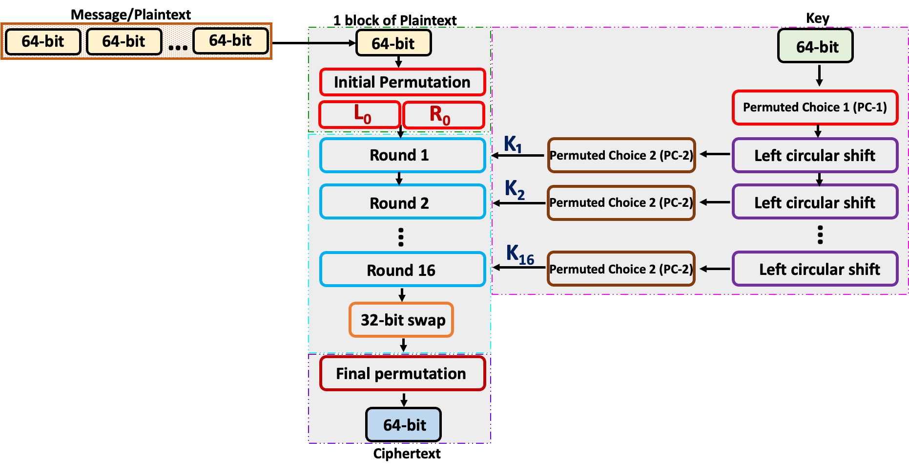

Step-by-Step Process

1. Input
2. Initial Permutation (IP)
3. Key Schedule (16 Subkeys Generation)
4. 16 Rounds of Processing
5. Final Permutation (FP)

### Initial Permutation (IP)

- The 64-bit plaintext is rearranged according to a fixed table (IP table).
- This doesn’t encrypt; it just prepares the data for processing.
- Bit 58 of the plaintext becomes bit 1, bit 50 becomes bit 2, and so on.

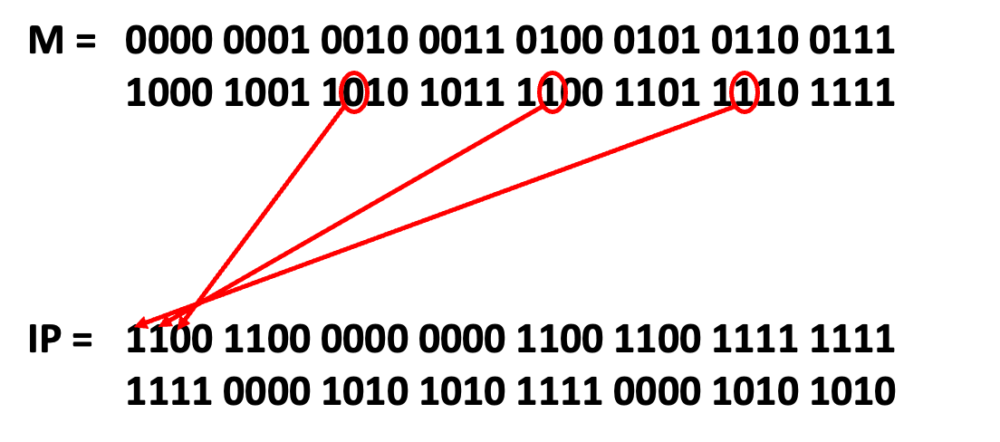

Initial Permutation (IP) Table

<table>
  <tr>
    <td>58</td>
    <td>50</td>
    <td>42</td>
    <td>34</td>
    <td>26</td>
    <td>18</td>
    <td>10</td>
    <td>2</td>
  </tr>
  <tr>
    <td>60</td>
    <td>52</td>
    <td>44</td>
    <td>36</td>
    <td>28</td>
    <td>20</td>
    <td>12</td>
    <td>4</td>
  </tr>
  <tr>
    <td>62</td>
    <td>54</td>
    <td>46</td>
    <td>38</td>
    <td>30</td>
    <td>22</td>
    <td>14</td>
    <td>6</td>
  </tr>
  <tr>
    <td>64</td>
    <td>56</td>
    <td>48</td>
    <td>40</td>
    <td>32</td>
    <td>24</td>
    <td>16</td>
    <td>8</td>
  </tr>
  <tr>
    <td>57</td>
    <td>49</td>
    <td>41</td>
    <td>33</td>
    <td>25</td>
    <td>17</td>
    <td>9</td>
    <td>1</td>
  </tr>
  <tr>
    <td>59</td>
    <td>51</td>
    <td>43</td>
    <td>35</td>
    <td>27</td>
    <td>19</td>
    <td>11</td>
    <td>3</td>
  </tr>
  <tr>
    <td>61</td>
    <td>53</td>
    <td>45</td>
    <td>37</td>
    <td>29</td>
    <td>21</td>
    <td>13</td>
    <td>5</td>
  </tr>
  <tr>
    <td>63</td>
    <td>55</td>
    <td>47</td>
    <td>39</td>
    <td>31</td>
    <td>23</td>
    <td>15</td>
    <td>7</td>
  </tr>
</table>

---

- Output: Split the 64-bit permuted block into two 32-bit halves: $\textcolor{red}{L_0}$ (left 32 bits) $\textcolor{red}{R_0}$ (right 32 bits).

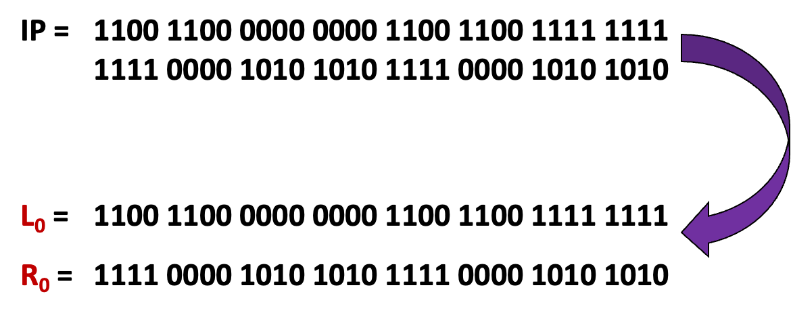

---

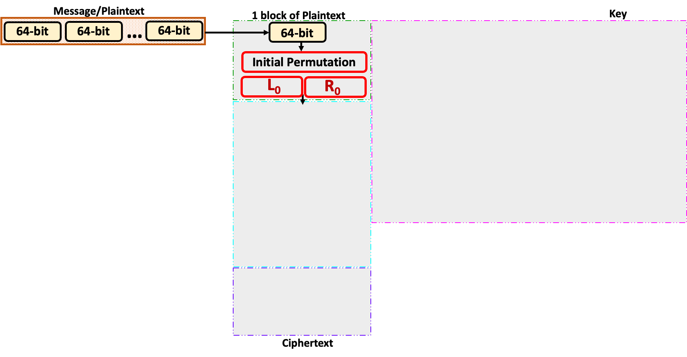

Step-by-Step Process

1. Input ✓
2. Initial Permutation (IP) ✓
3. Key Schedule (16 Subkeys Generation)
4. 16 Rounds of Processing
5. Final Permutation (FP)

### Key Schedule (16 Subkeys Generation)  Permutation (IP)

Key Schedule (16 Subkeys Generation)

- The key is provided in hexadecimal format  eg Hexadecimal Key = 133457799BBCDFF1 (16 hexadecimal digits).
- Convert to binary. 
- The 64-bit key is permuted using the Permuted choice 1 (PC-1) table, and 8 parity bits are discarded, leaving a 56-bit key. Bit 57 of the key becomes bit 1, bit 49 becomes bit 2, and so on.

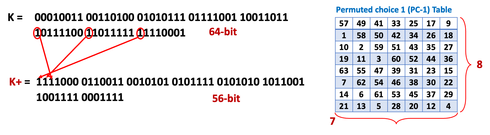

---

- Split into Halves: The 56-bit key is split into two 28-bit halves, C0 and D0
- Left Shifts: For each round, C0 and D0 are left-shifted (rotated) by 1 or 2 bits, depending on the round (e.g., rounds 1, 2, 9, 16 shift by 1 bit; others by 2).
- Permuted Choice 2 (PC-2): After shifting, a 48-bit subkey is selected from the 56-bit C and D using the PC-2 table

K+ = 1111000 0110011 0010101 0101111 0101010 1011001 1001111 0001111

C0 = 1111000 0110011 0010101 0101111  
D0 = 0101010 1011001 1001111 0001111

---

- Left Shifts: For each round, C0 and D0 are left-shifted (rotated) by 1 or 2 bits, depending on the round

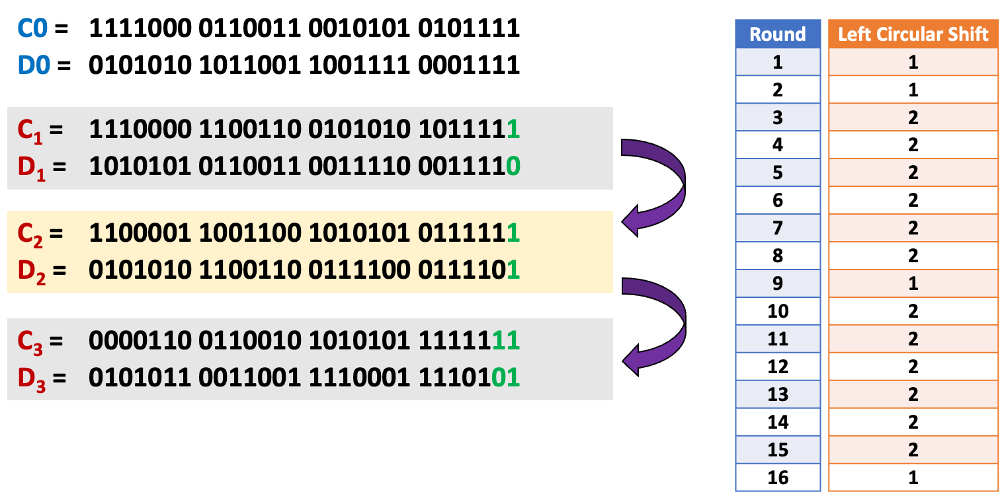

---

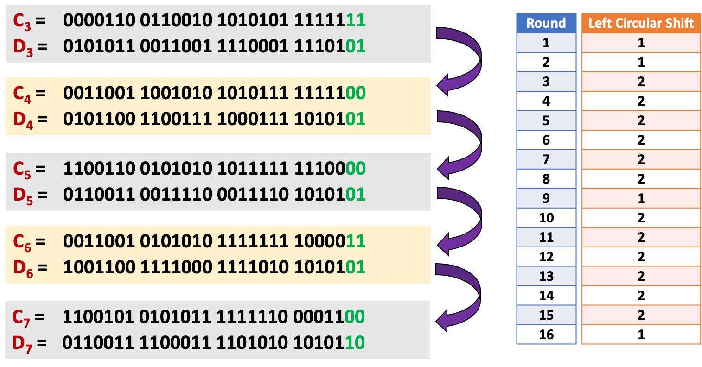

---

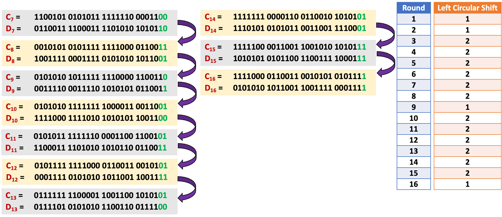

---

- Permuted Choice 2 (PC-2): After shifting, a 48-bit subkey is selected from the 56-bit C and D using the PC-2 table. We form the 16 $\textcolor{red}{K_n}$ keys of 48-bits.

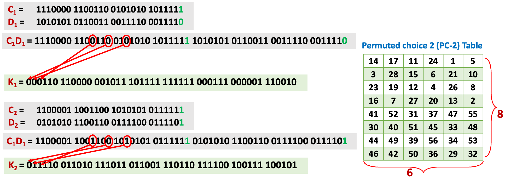

---

$\textcolor{red}{K_1}$ = `000110 110000 001011 101111 111111 000111 000001 110010`  
$\textcolor{red}{K_2}$ = `011110 011010 111011 011001 110110 111100 100111 100101`  
$\textcolor{red}{K_3}$ = `010101 011111 110010 001010 010000 101100 111110 011001`  
$\textcolor{red}{K_4}$ = `011100 101010 110111 010110 110110 110011 010100 011101`  
$\textcolor{red}{K_5}$ = `011111 001110 110000 000111 111010 110101 001110 101000`  
$\textcolor{red}{K_6}$ = `011000 111010 010100 111110 010100 000111 101100 101111`  
$\textcolor{red}{K_7}$ = `111011 001000 010010 110111 111101 100001 100010 111100`  
$\textcolor{red}{K_8}$ = `111101 111000 101000 111010 110000 010011 101111 111011`  
……  
$\textcolor{red}{K_{16}}$ = `110010 110011 110110 001011 000011 100001 011111 110101`  

---

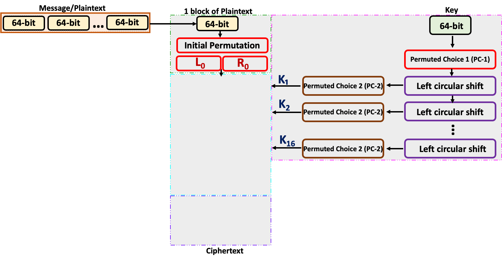

Step-by-Step Process

1. Input ✓
2. Initial Permutation (IP) ✓
3. Key Schedule (16 Subkeys Generation) ✓
4. 16 Rounds of Processing
5. Final Permutation (FP)

---

16 Rounds of Processing

- Input: The left half ($\textcolor{blue}{L_{n-1}}$) and right half ($\textcolor{blue}{R_{n-1}}$) from the previous round (or IP for round 1).
- Feistel Function (F): The right half ($\textcolor{blue}{R_{n-1}}$) is processed with the subkey ($\textcolor{blue}{K_n}$) to produce a 32-bit output:
- Expansion (E-box): The 32-bit $\textcolor{blue}{R_{n-1}}$ is expanded to 48 bits using an expansion table (some bits are duplicated).
- Subkey Mixing: The 48-bit expanded $\textcolor{blue}{R_{n-1}}$ is XORed with the 48-bit subkey $\textcolor{blue}{K_n}$. 
	- XOR: A bitwise operation where $\textcolor{purple}{0 \oplus 0 = 0}$, $\textcolor{purple}{1 \oplus 1 = 0}$, $\textcolor{purple}{1 \oplus 0 = 1}$, $\textcolor{purple}{0 \oplus 1 = 1}$.
- S-boxes (Substitution): The 48-bit result is divided into eight 6-bit chunks. Each chunk is passed through one of eight S-boxes (lookup tables), which map 6 bits to 4 bits, reducing the total to 32 bits ($8 \times 4 = 32$).
	- Each S-box uses the outer 2 bits of the 6-bit input to select a row and the inner 4 bits to select a column, outputting a 4-bit value.
- P-box (Permutation): The 32-bit S-box output is permuted using a fixed permutation table (P-box). 
- Output of Feistel Function: A 32-bit value, from F($\textcolor{blue}{R_{n-1}}$, $\textcolor{blue}{K_n}$).
- Swap Halves

---

$\textcolor{red}{L_0}$ = `1100 1100 0000 0000 1100 1100 1111 1111`  
$\textcolor{red}{R_0}$ = `1111 0000 1010 1010 1111 0000 1010 1010`

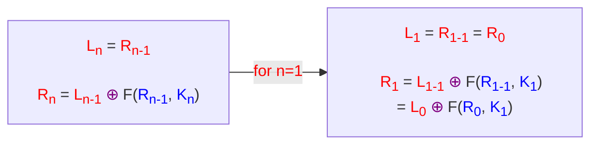

We have

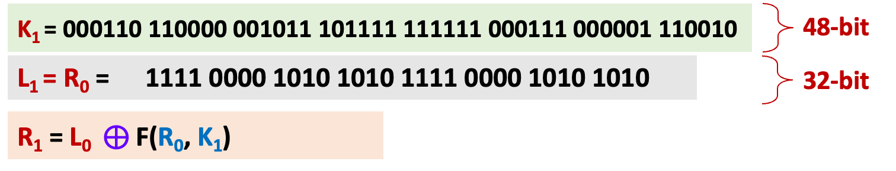

---

16 Rounds of Processing - Expansion (E-box)

To calculate F, we first expand each block $\textcolor{red}{R_0}$, from 32 bits to 48 bits.  
This is done by using a expansion table that repeats some of the bits in $\textcolor{red}{R_0}$  

F($\textcolor{blue}{R_0}$, $\textcolor{blue}{K_1}$)

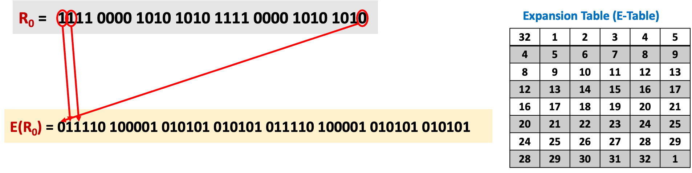

---

16 Rounds of Processing - Subkey Mixing

$F(\textcolor{blue}{R_0}, \textcolor{blue}{K_1}) \textcolor{purple}\longrightarrow F(\textcolor{red}{E(R_0)}, \textcolor{blue}{K_1})$

$$E(R_0) \oplus K_1$$

$$\colorbox{#FFF2CC}{$\textcolor{red}{E(R_0)} \textcolor{black}{= 011110 ~ 100001 ~ 010101 ~ 010101 ~ 011110 ~ 100001 ~ 010101 ~ 010101}$}$$

$$\textcolor{purple}\oplus$$

$$\colorbox{#E2F0D9}{$\textcolor{red}{K_1} \textcolor{black}{= 000110 ~ 110000 ~ 001011 ~ 101111 ~ 111111 ~ 000111 ~ 000001 ~ 110010}$}$$

$$\colorbox{#FBE5D6}{$\textcolor{black}{E(R_0) \oplus K_1 = 011000 ~ 010001 ~ 011110 ~ 111010 ~ 100001 ~ 100110 ~ 010100 ~ 100111}$}$$

---

16 Rounds of Processing - S-boxes (Substitution)

The 48-bit result is divided into eight 6-bit chunks. Each chunk is passed through one of eight S-boxes (lookup tables), which map 6 bits to 4 bits, reducing the total to 32 bits ($8 \times 4 = 32$).

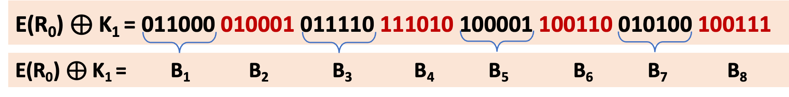

We now compute

S1(B1)   S2(B2)    S3(B3)    S4(B4)    S5(B5)    S6(B6)    S7(B7)    S8(B8)

S-box 1 (S1)

<table>
    <tbody>
      <tr>
        <td>14</td><td>4</td><td>13</td><td>1</td><td>2</td><td>15</td><td>11</td><td>8</td><td>3</td><td>10</td><td>6</td><td>12</td><td>5</td><td>9</td><td>0</td><td>7</td>
      </tr>
      <tr style="background-color: #d9e2f3;">
        <td>0</td><td>15</td><td>7</td><td>4</td><td>14</td><td>2</td><td>13</td><td>1</td><td>10</td><td>6</td><td>12</td><td>11</td><td>9</td><td>5</td><td>3</td><td>8</td>
      </tr>
      <tr>
        <td>4</td><td>1</td><td>14</td><td>8</td><td>13</td><td>6</td><td>2</td><td>11</td><td>15</td><td>12</td><td>9</td><td>7</td><td>3</td><td>10</td><td>5</td><td>0</td>
      </tr>
      <tr style="background-color: #d9e2f3;">
        <td>15</td><td>12</td><td>8</td><td>2</td><td>4</td><td>9</td><td>1</td><td>7</td><td>5</td><td>11</td><td>3</td><td>14</td><td>10</td><td>0</td><td>6</td><td>13</td>
      </tr>
    </tbody>
</table>

---

S1

| 14  | 4   | 13  | 1   | 2   | 15  | 11  | 8   | 3   | 10  | 6   | 12  | 5   | 9   | 0   | 7   |
| --- | --- | --- | --- | --- | --- | --- | --- | --- | --- | --- | --- | --- | --- | --- | --- |
| 0   | 15  | 7   | 4   | 14  | 2   | 13  | 1   | 10  | 6   | 12  | 11  | 9   | 5   | 3   | 8   |
| 4   | 1   | 14  | 8   | 13  | 6   | 2   | 11  | 15  | 12  | 9   | 7   | 3   | 10  | 5   | 0   |
| 15  | 12  | 8   | 2   | 4   | 9   | 1   | 7   | 5   | 11  | 3   | 14  | 10  | 0   | 6   | 13  |

S2

| 15  | 1   | 8   | 14  | 6   | 11  | 3   | 4   | 9   | 7   | 2   | 13  | 12  | 0   | 5   | 10  |
| --- | --- | --- | --- | --- | --- | --- | --- | --- | --- | --- | --- | --- | --- | --- | --- |
| 3   | 13  | 4   | 7   | 15  | 2   | 8   | 14  | 12  | 0   | 1   | 10  | 6   | 9   | 11  | 5   |
| 0   | 14  | 7   | 11  | 10  | 4   | 13  | 1   | 5   | 8   | 12  | 6   | 9   | 3   | 2   | 15  |
| 13  | 8   | 10  | 1   | 3   | 15  | 4   | 2   | 11  | 6   | 7   | 12  | 0   | 5   | 14  | 9   |

S3

| 10  | 0   | 9   | 14  | 6   | 3   | 15  | 5   | 1   | 13  | 12  | 7   | 11  | 4   | 2   | 8   |
| --- | --- | --- | --- | --- | --- | --- | --- | --- | --- | --- | --- | --- | --- | --- | --- |
| 13  | 7   | 0   | 9   | 3   | 4   | 6   | 10  | 2   | 8   | 5   | 14  | 12  | 11  | 15  | 1   |
| 13  | 6   | 4   | 9   | 8   | 15  | 3   | 0   | 11  | 1   | 2   | 12  | 5   | 10  | 14  | 7   |
| 1   | 10  | 13  | 0   | 6   | 9   | 8   | 7   | 4   | 15  | 14  | 3   | 11  | 5   | 2   | 12  |

S4

| 7   | 13  | 14  | 3   | 0   | 6   | 9   | 10  | 1   | 2   | 8   | 5   | 11  | 12  | 4   | 15  |
| --- | --- | --- | --- | --- | --- | --- | --- | --- | --- | --- | --- | --- | --- | --- | --- |
| 13  | 8   | 11  | 5   | 6   | 15  | 0   | 3   | 4   | 7   | 2   | 12  | 1   | 10  | 14  | 9   |
| 10  | 6   | 9   | 0   | 12  | 11  | 7   | 13  | 15  | 1   | 3   | 14  | 5   | 2   | 8   | 4   |
| 3   | 15  | 0   | 6   | 10  | 1   | 13  | 8   | 9   | 4   | 5   | 11  | 12  | 7   | 2   | 14  |

S5

| 2   | 12  | 4   | 1   | 7   | 10  | 11  | 6   | 8   | 5   | 3   | 15  | 13  | 0   | 14  | 9   |
| --- | --- | --- | --- | --- | --- | --- | --- | --- | --- | --- | --- | --- | --- | --- | --- |
| 14  | 11  | 2   | 12  | 4   | 7   | 13  | 1   | 5   | 0   | 15  | 10  | 3   | 9   | 8   | 6   |
| 4   | 2   | 1   | 11  | 10  | 13  | 7   | 8   | 15  | 9   | 12  | 5   | 6   | 3   | 0   | 14  |
| 11  | 8   | 12  | 7   | 1   | 14  | 2   | 13  | 6   | 15  | 0   | 9   | 10  | 4   | 5   | 3   |

S6

| 12  | 1   | 10  | 15  | 9   | 2   | 6   | 8   | 0   | 13  | 3   | 4   | 14  | 7   | 5   | 11  |
| --- | --- | --- | --- | --- | --- | --- | --- | --- | --- | --- | --- | --- | --- | --- | --- |
| 10  | 15  | 4   | 2   | 7   | 12  | 9   | 5   | 6   | 1   | 13  | 14  | 0   | 11  | 3   | 8   |
| 9   | 14  | 15  | 5   | 2   | 8   | 12  | 3   | 7   | 0   | 4   | 10  | 1   | 13  | 11  | 6   |
| 4   | 3   | 2   | 12  | 9   | 5   | 15  | 10  | 11  | 14  | 1   | 7   | 6   | 0   | 8   | 13  |

S7

| 4   | 11  | 2   | 14  | 15  | 0   | 8   | 13  | 3   | 12  | 9   | 7   | 5   | 10  | 6   | 1   |
| --- | --- | --- | --- | --- | --- | --- | --- | --- | --- | --- | --- | --- | --- | --- | --- |
| 13  | 0   | 11  | 7   | 4   | 9   | 1   | 10  | 14  | 3   | 5   | 12  | 2   | 15  | 8   | 6   |
| 1   | 4   | 11  | 13  | 12  | 3   | 7   | 14  | 10  | 15  | 6   | 8   | 0   | 5   | 9   | 2   |
| 6   | 11  | 13  | 8   | 1   | 4   | 10  | 7   | 9   | 5   | 0   | 15  | 14  | 2   | 3   | 12  |

S8

| 13  | 2   | 8   | 4   | 6   | 15  | 11  | 1   | 10  | 9   | 3   | 14  | 5   | 0   | 12  | 7   |
| --- | --- | --- | --- | --- | --- | --- | --- | --- | --- | --- | --- | --- | --- | --- | --- |
| 1   | 15  | 13  | 8   | 10  | 3   | 7   | 4   | 12  | 5   | 6   | 11  | 0   | 14  | 9   | 2   |
| 7   | 11  | 4   | 1   | 9   | 12  | 14  | 2   | 0   | 6   | 10  | 13  | 15  | 3   | 5   | 8   |
| 2   | 1   | 14  | 7   | 4   | 10  | 8   | 13  | 15  | 12  | 9   | 0   | 3   | 5   | 6   | 11  |

### Reading Assignment

Read on how to compute the following using the **8** S-boxes

S1(B1)   S2(B2)    S3(B3)    S4(B4)    S5(B5)    S6(B6)    S7(B7)    S8(B8)

To be continued
