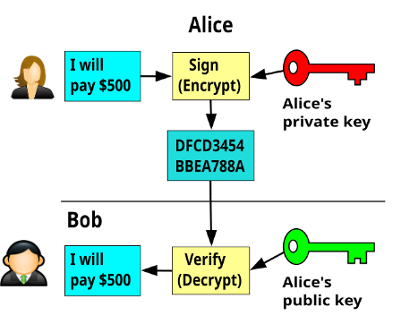
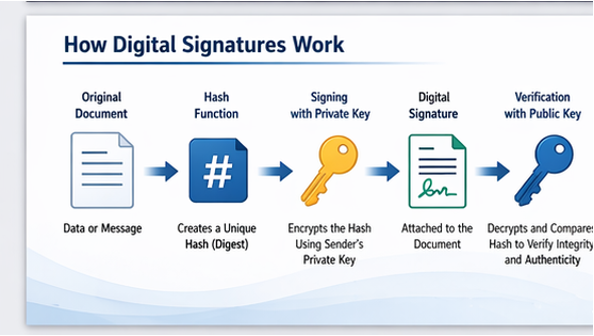
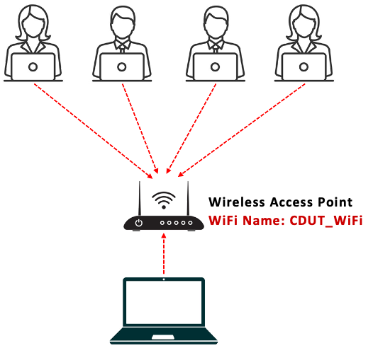
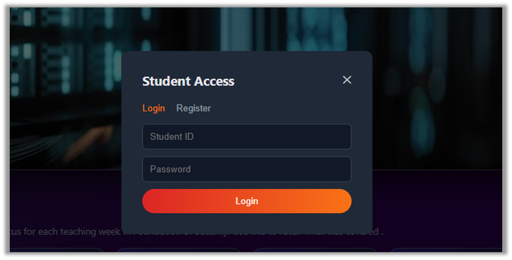
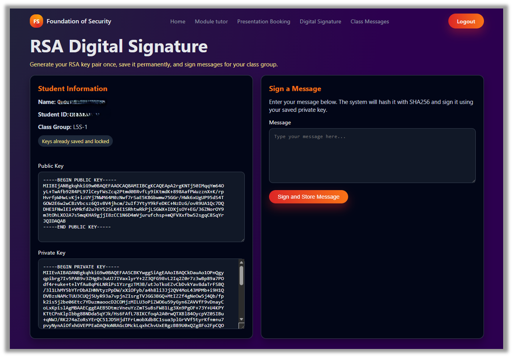
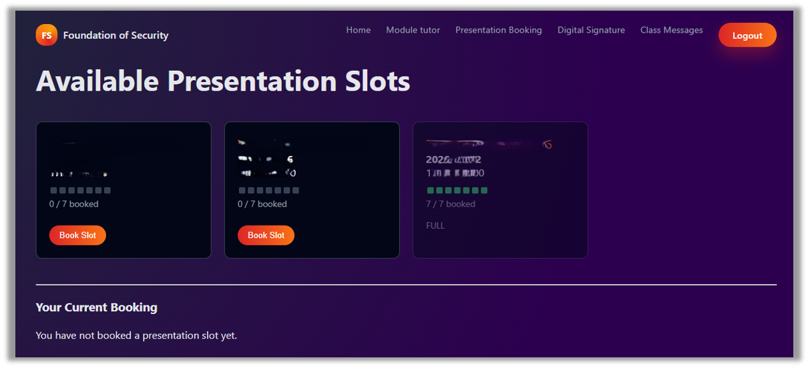

# Digital Signature

## What is a digital signature

A digital signature is a cryptographic result attached to data that helps a receiver verify three things:

|                            1                            |                      2                      |                         3                         |
| :-----------------------------------------------------: | :-----------------------------------------: | :-----------------------------------------------: |
|                       Who sent it                       |             It was not changed              |           Sender cannot easily deny it            |
| Origin authentication | Integrity | Non-repudiation |

Important: a digital signature does not hide the message. Confidentiality comes from encryption, not from the signature itself.

Simple idea: sign with the private key, verify with the public key.

## Why we need it

Without protection, a digital file can be copied, edited, or impersonated in transit. The receiver needs proof of source and integrity.

  

    <!-- 左侧无数字签名卡片 -->
    

      <h2 style="color: #e63946; font-size: 32px; font-weight: 600; margin: 0 0 28px 0; line-height: 1.3;">If there is no digital signature</h2>
      <ul style="list-style-type: disc; padding-left: 28px; margin: 0 0 40px 0;">
        <li style="font-size: 22px; line-height: 1.6; margin-bottom: 18px;">Anyone can claim “I sent this.”</li>
        <li style="font-size: 22px; line-height: 1.6; margin-bottom: 18px;">A message can be modified silently.</li>
        <li style="font-size: 22px; line-height: 1.6;">The receiver has no easy proof for a third party.</li>
      </ul>
      
trust is weak

    

    <!-- 右侧有效数字签名卡片 -->
    

      <h2 style="color: #219653; font-size: 32px; font-weight: 600; margin: 0 0 28px 0; line-height: 1.3;">With a valid digital signature</h2>
      <ul style="list-style-type: disc; padding-left: 28px; margin: 0 0 40px 0;">
        <li style="font-size: 22px; line-height: 1.6; margin-bottom: 18px;">The public key checks the sender’s signature.</li>
        <li style="font-size: 22px; line-height: 1.6; margin-bottom: 18px;">Any change to the signed data breaks verification.</li>
        <li style="font-size: 22px; line-height: 1.6;">It supports accountability in software, email, and documents.</li>
      </ul>
      
trust can be checked

    

  

## Building blocks

|                                                    #                                                     |                               K                                |                           V                           |                                       ID                                        |
| :------------------------------------------------------------------------------------------------------: | :------------------------------------------------------------: | :---------------------------------------------------: | :-----------------------------------------------------------------------------: |
|                                            **Hash function**                                             |                        **Private key**                         |                    **Public key**                     |                              **Certificate / PKI**                              |
| Turns any message into a fixed-size digest. Small changes in the message create a very different digest. | Kept secret by the signer. It is used to create the signature. | Shared with others. It is used to verify a signature. | Binds a public key to an identity so that people know whose key they are using. |

Together these components answer two questions: “Did this come from the claimed sender?” and “Has anything changed?”

## How digital signatures work

1. Hash the message A hash function converts the message into a short fingerprint.
2. Sign the hash The sender uses a private key to sign that fingerprint.
3. Verify The receiver recomputes the hash and uses the public key of the sender to check the signature.

### Key insight

The signature is created over a hash, not by encrypting the whole document. That makes signing efficient even for large files.

### Verification fails if

- the content changes
- the wrong public key is used
- the signature was forged

---

  

    <!-- 步骤1 卡片 -->
    

      
1. Hash message

    

    <!-- 箭头 -->
    

    <!-- 步骤2 卡片 -->
    

      
2. Encrypt hash with private key

    

    <!-- 箭头 -->
    

    <!-- 步骤3 卡片 -->
    

      
3. Send message + signature

    

    <!-- 箭头 -->
    

    <!-- 步骤4 卡片 -->
    

      
4. Decrypt with public key

    

    <!-- 箭头 -->
    

    <!-- 步骤5 卡片 -->
    

      
5. Compute message hash & compare hashes

    

  

If both hashes match, the signature is valid.

## Algorithms and common uses

  

    <!-- 左侧算法卡片 -->
    

      <h2 style="font-size: 36px; font-weight: 700; margin: 0 0 40px 0; line-height: 1.3;">Common signature algorithms</h2>
      

        <!-- RSA 项 -->
        

          RSA
          
Widely taught and widely deployed

        

        <!-- ECDSA 项 -->
        

          ECDSA
          
Strong security with smaller key sizes

        

        <!-- EdDSA 项 -->
        

          EdDSA
          
Modern design; included in FIPS 186-5 as Ed25519 / Ed448 family

        

      

    

    <!-- 右侧用途区域 -->
    

      <h2 style="font-size: 36px; font-weight: 700; margin: 0 0 32px 0; line-height: 1.3;">Common uses</h2>
      

        <!-- 软件签名卡片 -->
        

          <h3 style="color: #0f2b55; font-size: 28px; font-weight: 700; margin: 0 0 16px 0; line-height: 1.3;">Software signing</h3>
          
Proves a program or update came from its publisher.

        

        <!-- 签名邮件卡片 -->
        

          <h3 style="color: #0f2b55; font-size: 28px; font-weight: 700; margin: 0 0 16px 0; line-height: 1.3;">Signed email</h3>
          
Lets recipients verify sender identity and tamper detection.

        

        <!-- PDF/合同审批卡片 -->
        

          <h3 style="color: #0f2b55; font-size: 28px; font-weight: 700; margin: 0 0 16px 0; line-height: 1.3;">PDF / contract approval</h3>
          
Supports trusted document workflows and audit trails.

        

        <!-- 网站证书卡片 -->
        

          <h3 style="color: #0f2b55; font-size: 28px; font-weight: 700; margin: 0 0 16px 0; line-height: 1.3;">Certificates on the web</h3>
          
Certificates themselves are digitally signed by a CA.

        

      

    

  

## Limitations and best practices

  

    <!-- 左侧 限制与风险 卡片 -->
    

      <h2 style="color: #e63946; font-size: 32px; font-weight: 600; margin: 0 0 28px 0; line-height: 1.3;">Limitations / risks</h2>
      <ul style="list-style-type: disc; padding-left: 28px; margin: 0;">
        <li style="font-size: 22px; line-height: 1.6; margin-bottom: 32px;">If the private key is stolen, an attacker can create valid signatures.</li>
        <li style="font-size: 22px; line-height: 1.6; margin-bottom: 32px;">Verification only works if the receiver trusts the correct public key or certificate.</li>
        <li style="font-size: 22px; line-height: 1.6;">A signature proves integrity and origin, but it does not prove the content is true or safe.</li>
      </ul>
    

    <!-- 右侧 最佳实践 卡片 -->
    

      <h2 style="color: #219653; font-size: 32px; font-weight: 600; margin: 0 0 28px 0; line-height: 1.3;">Best practices</h2>
      <ul style="list-style-type: disc; padding-left: 28px; margin: 0;">
        <li style="font-size: 22px; line-height: 1.6; margin-bottom: 32px;">Protect private keys with strong storage and access control.</li>
        <li style="font-size: 22px; line-height: 1.6; margin-bottom: 32px;">Use trusted certificates and check validity / revocation status when relevant.</li>
        <li style="font-size: 22px; line-height: 1.6;">Choose modern approved algorithms and key sizes.</li>
      </ul>
    

  

## RSA Signature: Choosing Public and Private Keys

- Choose two prime numbers: $p = 3$ and $q = 11$
- Compute $n = p \times q = 3 \times 11 = 33$
- Compute $\phi(n) = (p − 1)(q − 1) = 2 \times 10 = 20$
- Choose e such that $1 < e < \phi(n)$ and $\gcd(e, \phi(n)) = 1$. Let $\textcolor{blue}{e = 3}$
- Find d such that $e \cdot d \equiv 1 (\bmod \phi(n))$
- Here, $3 \times 7 = 21 \equiv 1 (\bmod 20)$, so $\textcolor{blue}{d = 7}$

  <!-- 公钥卡片 -->
  

    
Public key

    
(e, n) = (3, 33)

  

  <!-- 私钥卡片 -->
  

    
Private key

    
(d, n) = (7, 33)

  

These keys are used for signing and verifying

## RSA Signature: Signing the Message

- Let the message hash be $h = 2$
- Use the private $key (d, n) = (7, 33)$
- Compute signature: $\textcolor{blue}{s = h^d \bmod n}$

$$\begin{aligned}s &= 2^7 \bmod 33 \\ &= 128 \bmod 33 \\ &= 29\end{aligned}$$

Therefore, the digital signature is $\textcolor{blue}{s = 29}$

Sender uses private key to sign

## RSA Signature: Verifying the Signature

- Receiver uses the public $key (e, n) = (3, 33)$
- Verify signature $s = 29$ by computing $h' = s^e \bmod n$
- If $\textcolor{blue}{h'}$ equals the original hash $h = 2$, the signature is valid

$$\begin{aligned}h' &= 29^3 \bmod 33 \\ &= 24389 \bmod 33 \\ &= 2 \end{aligned}$$

Since $\textcolor{blue}{h' = 2 = h}$, the signature is valid

  

    
Signature is

    
VALID

    
because

    
h' = h

    
2 = 2

  

## Digital Signature (Activity)

### Digital Signature Activity

Connect to CDUT_WIFI, open your browser and Enter the URL <u>http://</u><u>172.20.X.X</u> Click on the login button and register with your Student ID and appropriate Password. Login after successful registration

|  |  |
| ---------------------------------------- | ---------------------------------------- |

---

Click on “Digital Signature” on the navigation tabs. Generate your key pairs (public key and private key) 

Enter any message and click on “Sign and Store Message”

---

Click on “Class Messages” on the navigation tabs. 

Verify the messages submitted by your friends on the page using their public key

# Presentation Slot Booking

Connect to CDUT_WIFI, open your browser and Enter the URL <u>http://</u><u>172.20.X.X</u> Click on the “Presentation Booking” tab to book an available slot for your class.

|  |  |
| ---------------------------------------- | ---------------------------------------- |
