## Lecture Outline

1. Review of DES 16-round encryption process - Final Part
2. S-box substitution in DES
3. P-box permutation in DES
4. Generating the final DES ciphertext
5. Security limitations of DES
6. Introduction to Advanced Encryption Standard (AES)

## Learning Outcomes

By the end of this lecture, students should be able to:

1. Perform basic S-box calculations in DES encryption
2. Perform the P-box permutation in DES
3. Understand how the final ciphertext is generated in DES
4. Explain why DES was replaced by AES
5. Describe the key characteristics of AES encryption
6. Explain the main transformation steps used in AES encryption

## Data Encryption Standard (DES)
### S-boxes (Substitution)

#### 16 Rounds of Processing - Subkey Mixing

$F(\textcolor{blue}{R_0}, \textcolor{blue}{K_1}) \textcolor{purple}\longrightarrow F(\textcolor{red}{E(R_0)}, \textcolor{blue}{K_1})$

$$E(R_0) \oplus K_1$$
$$\colorbox{#FFF2CC}{$\textcolor{red}{E(R_0)} \textcolor{black}{= 011110 ~ 100001 ~ 010101 ~ 010101 ~ 011110 ~ 100001 ~ 010101 ~ 010101}$}$$  
$$\textcolor{purple}\oplus$$  
$$\colorbox{#E2F0D9}{$\textcolor{red}{K_1} \textcolor{black}{= 000110 ~ 110000 ~ 001011 ~ 101111 ~ 111111 ~ 000111 ~ 000001 ~ 110010}$}$$  
$$\colorbox{#FBE5D6}{$\textcolor{black}{E(R_0) \oplus K_1 = 011000 ~ 010001 ~ 011110 ~ 111010 ~ 100001 ~ 100110 ~ 010100 ~ 100111}$}$$

---

#### 16 Rounds of Processing - S-boxes (Substitution)

The 48-bit result is divided into eight 6-bit chunks. Each chunk is passed through one of eight S-boxes (lookup tables), which map 6 bits to 4 bits, reducing the total to 32 bits ($8 \times 4 = 32$).

We now compute

S1(B1)   S2(B2)    S3(B3)    S4(B4)    S5(B5)    S6(B6)    S7(B7)    S8(B8)

S-box 1 (S1)

<table>
    <tbody>
      <tr>
        <td>14</td><td>4</td><td>13</td><td>1</td><td>2</td><td>15</td><td>11</td><td>8</td><td>3</td><td>10</td><td>6</td><td>12</td><td>5</td><td>9</td><td>0</td><td>7</td>
      </tr>
      <tr style="background-color: #d9e2f3;">
        <td>0</td><td>15</td><td>7</td><td>4</td><td>14</td><td>2</td><td>13</td><td>1</td><td>10</td><td>6</td><td>12</td><td>11</td><td>9</td><td>5</td><td>3</td><td>8</td>
      </tr>
      <tr>
        <td>4</td><td>1</td><td>14</td><td>8</td><td>13</td><td>6</td><td>2</td><td>11</td><td>15</td><td>12</td><td>9</td><td>7</td><td>3</td><td>10</td><td>5</td><td>0</td>
      </tr>
      <tr style="background-color: #d9e2f3;">
        <td>15</td><td>12</td><td>8</td><td>2</td><td>4</td><td>9</td><td>1</td><td>7</td><td>5</td><td>11</td><td>3</td><td>14</td><td>10</td><td>0</td><td>6</td><td>13</td>
      </tr>
    </tbody>
</table>

---

S1

| 14  | 4   | 13  | 1   | 2   | 15  | 11  | 8   | 3   | 10  | 6   | 12  | 5   | 9   | 0   | 7   |
| --- | --- | --- | --- | --- | --- | --- | --- | --- | --- | --- | --- | --- | --- | --- | --- |
| 0   | 15  | 7   | 4   | 14  | 2   | 13  | 1   | 10  | 6   | 12  | 11  | 9   | 5   | 3   | 8   |
| 4   | 1   | 14  | 8   | 13  | 6   | 2   | 11  | 15  | 12  | 9   | 7   | 3   | 10  | 5   | 0   |
| 15  | 12  | 8   | 2   | 4   | 9   | 1   | 7   | 5   | 11  | 3   | 14  | 10  | 0   | 6   | 13  |

S2

| 15  | 1   | 8   | 14  | 6   | 11  | 3   | 4   | 9   | 7   | 2   | 13  | 12  | 0   | 5   | 10  |
| --- | --- | --- | --- | --- | --- | --- | --- | --- | --- | --- | --- | --- | --- | --- | --- |
| 3   | 13  | 4   | 7   | 15  | 2   | 8   | 14  | 12  | 0   | 1   | 10  | 6   | 9   | 11  | 5   |
| 0   | 14  | 7   | 11  | 10  | 4   | 13  | 1   | 5   | 8   | 12  | 6   | 9   | 3   | 2   | 15  |
| 13  | 8   | 10  | 1   | 3   | 15  | 4   | 2   | 11  | 6   | 7   | 12  | 0   | 5   | 14  | 9   |

S3

| 10  | 0   | 9   | 14  | 6   | 3   | 15  | 5   | 1   | 13  | 12  | 7   | 11  | 4   | 2   | 8   |
| --- | --- | --- | --- | --- | --- | --- | --- | --- | --- | --- | --- | --- | --- | --- | --- |
| 13  | 7   | 0   | 9   | 3   | 4   | 6   | 10  | 2   | 8   | 5   | 14  | 12  | 11  | 15  | 1   |
| 13  | 6   | 4   | 9   | 8   | 15  | 3   | 0   | 11  | 1   | 2   | 12  | 5   | 10  | 14  | 7   |
| 1   | 10  | 13  | 0   | 6   | 9   | 8   | 7   | 4   | 15  | 14  | 3   | 11  | 5   | 2   | 12  |

S4

| 7   | 13  | 14  | 3   | 0   | 6   | 9   | 10  | 1   | 2   | 8   | 5   | 11  | 12  | 4   | 15  |
| --- | --- | --- | --- | --- | --- | --- | --- | --- | --- | --- | --- | --- | --- | --- | --- |
| 13  | 8   | 11  | 5   | 6   | 15  | 0   | 3   | 4   | 7   | 2   | 12  | 1   | 10  | 14  | 9   |
| 10  | 6   | 9   | 0   | 12  | 11  | 7   | 13  | 15  | 1   | 3   | 14  | 5   | 2   | 8   | 4   |
| 3   | 15  | 0   | 6   | 10  | 1   | 13  | 8   | 9   | 4   | 5   | 11  | 12  | 7   | 2   | 14  |

S5

| 2   | 12  | 4   | 1   | 7   | 10  | 11  | 6   | 8   | 5   | 3   | 15  | 13  | 0   | 14  | 9   |
| --- | --- | --- | --- | --- | --- | --- | --- | --- | --- | --- | --- | --- | --- | --- | --- |
| 14  | 11  | 2   | 12  | 4   | 7   | 13  | 1   | 5   | 0   | 15  | 10  | 3   | 9   | 8   | 6   |
| 4   | 2   | 1   | 11  | 10  | 13  | 7   | 8   | 15  | 9   | 12  | 5   | 6   | 3   | 0   | 14  |
| 11  | 8   | 12  | 7   | 1   | 14  | 2   | 13  | 6   | 15  | 0   | 9   | 10  | 4   | 5   | 3   |

S6

| 12  | 1   | 10  | 15  | 9   | 2   | 6   | 8   | 0   | 13  | 3   | 4   | 14  | 7   | 5   | 11  |
| --- | --- | --- | --- | --- | --- | --- | --- | --- | --- | --- | --- | --- | --- | --- | --- |
| 10  | 15  | 4   | 2   | 7   | 12  | 9   | 5   | 6   | 1   | 13  | 14  | 0   | 11  | 3   | 8   |
| 9   | 14  | 15  | 5   | 2   | 8   | 12  | 3   | 7   | 0   | 4   | 10  | 1   | 13  | 11  | 6   |
| 4   | 3   | 2   | 12  | 9   | 5   | 15  | 10  | 11  | 14  | 1   | 7   | 6   | 0   | 8   | 13  |

S7

| 4   | 11  | 2   | 14  | 15  | 0   | 8   | 13  | 3   | 12  | 9   | 7   | 5   | 10  | 6   | 1   |
| --- | --- | --- | --- | --- | --- | --- | --- | --- | --- | --- | --- | --- | --- | --- | --- |
| 13  | 0   | 11  | 7   | 4   | 9   | 1   | 10  | 14  | 3   | 5   | 12  | 2   | 15  | 8   | 6   |
| 1   | 4   | 11  | 13  | 12  | 3   | 7   | 14  | 10  | 15  | 6   | 8   | 0   | 5   | 9   | 2   |
| 6   | 11  | 13  | 8   | 1   | 4   | 10  | 7   | 9   | 5   | 0   | 15  | 14  | 2   | 3   | 12  |

S8

| 13  | 2   | 8   | 4   | 6   | 15  | 11  | 1   | 10  | 9   | 3   | 14  | 5   | 0   | 12  | 7   |
| --- | --- | --- | --- | --- | --- | --- | --- | --- | --- | --- | --- | --- | --- | --- | --- |
| 1   | 15  | 13  | 8   | 10  | 3   | 7   | 4   | 12  | 5   | 6   | 11  | 0   | 14  | 9   | 2   |
| 7   | 11  | 4   | 1   | 9   | 12  | 14  | 2   | 0   | 6   | 10  | 13  | 15  | 3   | 5   | 8   |
| 2   | 1   | 14  | 7   | 4   | 10  | 8   | 13  | 15  | 12  | 9   | 0   | 3   | 5   | 6   | 11  |

---

16 Rounds of Processing - S-boxes (Substitution):

Step-by-Step Example: Compute $\textcolor{red}{S_1}(B_1)$  
If $B_1 = \textcolor{green}0\textcolor{purple}{1100}\textcolor{green}0$  

To compute $S_1(B_1)$:  

➤ First, determine the row number by using the first and last bits of $B_1$:  
$\textcolor{green}0$ (first bit) and $\textcolor{green}0$ (last bit) $\rightarrow$ Row = $\textcolor{green}{00}_2$. Convert to decimal = $\textcolor{green}0$

➤ Next, determine the column number using the middle 4 bits of $B_1$:  
Bits = $\textcolor{purple}{1100}$ $\rightarrow$ Column = $1100_2$ . Convert to decimal = $\textcolor{purple}{12}$

➤ From the S1-box table, the value at row 0 and column 12 is <mark>5</mark>. Convert to binary = $0101$. Therefore, $\textcolor{red}{S_1}(B_1) = 0101$

  <table style="border-collapse: collapse; margin: 0 auto; font-family: sans-serif; font-weight: bold; text-align: center; color: black; background: transparent;">
    <tr>
      <td colspan="3" style="border: none;"></td>
      <td colspan="16" style="border: none; text-align: left; color: #7030a0; font-size: 18px; padding-bottom: 4px;">Column</td>
    </tr>
    <tr>
      <td colspan="3" style="border: none;"></td>
      <td style="border-top: 3px solid #7030a0; border-bottom: 3px solid #7030a0; border-left: 3px solid #7030a0; border-right: 1px solid #ed7d31; color: #7030a0; padding: 6px 12px; font-size: 18px;">0</td>
      <td style="border-top: 3px solid #7030a0; border-bottom: 3px solid #7030a0; border-right: 1px solid #ed7d31; color: #7030a0; padding: 6px 12px; font-size: 18px;">1</td>
      <td style="border-top: 3px solid #7030a0; border-bottom: 3px solid #7030a0; border-right: 1px solid #ed7d31; color: #7030a0; padding: 6px 12px; font-size: 18px;">2</td>
      <td style="border-top: 3px solid #7030a0; border-bottom: 3px solid #7030a0; border-right: 1px solid #ed7d31; color: #7030a0; padding: 6px 12px; font-size: 18px;">3</td>
      <td style="border-top: 3px solid #7030a0; border-bottom: 3px solid #7030a0; border-right: 1px solid #ed7d31; color: #7030a0; padding: 6px 12px; font-size: 18px;">4</td>
      <td style="border-top: 3px solid #7030a0; border-bottom: 3px solid #7030a0; border-right: 1px solid #ed7d31; color: #7030a0; padding: 6px 12px; font-size: 18px;">5</td>
      <td style="border-top: 3px solid #7030a0; border-bottom: 3px solid #7030a0; border-right: 1px solid #ed7d31; color: #7030a0; padding: 6px 12px; font-size: 18px;">6</td>
      <td style="border-top: 3px solid #7030a0; border-bottom: 3px solid #7030a0; border-right: 1px solid #ed7d31; color: #7030a0; padding: 6px 12px; font-size: 18px;">7</td>
      <td style="border-top: 3px solid #7030a0; border-bottom: 3px solid #7030a0; border-right: 1px solid #ed7d31; color: #7030a0; padding: 6px 12px; font-size: 18px;">8</td>
      <td style="border-top: 3px solid #7030a0; border-bottom: 3px solid #7030a0; border-right: 1px solid #ed7d31; color: #7030a0; padding: 6px 12px; font-size: 18px;">9</td>
      <td style="border-top: 3px solid #7030a0; border-bottom: 3px solid #7030a0; border-right: 1px solid #ed7d31; color: #7030a0; padding: 6px 12px; font-size: 18px;">10</td>
      <td style="border-top: 3px solid #7030a0; border-bottom: 3px solid #7030a0; border-right: 1px solid #ed7d31; color: #7030a0; padding: 6px 12px; font-size: 18px;">11</td>
      <td style="border-top: 3px solid #7030a0; border-bottom: 3px solid #7030a0; border-right: 1px solid #ed7d31; color: #7030a0; padding: 6px 12px; font-size: 18px; background-color: red">12</td>
      <td style="border-top: 3px solid #7030a0; border-bottom: 3px solid #7030a0; border-right: 1px solid #ed7d31; color: #7030a0; padding: 6px 12px; font-size: 18px;">13</td>
      <td style="border-top: 3px solid #7030a0; border-bottom: 3px solid #7030a0; border-right: 1px solid #ed7d31; color: #7030a0; padding: 6px 12px; font-size: 18px;">14</td>
      <td style="border-top: 3px solid #7030a0; border-bottom: 3px solid #7030a0; border-right: 3px solid #7030a0; color: #7030a0; padding: 6px 12px; font-size: 18px;">15</td>
    </tr>
    <tr>
      <td colspan="19" style="border: none; text-align: center; color: #0070c0; font-size: 24px; padding: 25px 0 15px 0;">S-box 1 (S1)</td>
    </tr>
    <tr>
      <td style="border: none; color: #00b050; padding-right: 10px; font-size: 18px; text-align: right; vertical-align: middle;">Row</td>
      <td style="border: 1.5px solid #70ad47; color: #00b050; padding: 8px 12px; font-size: 18px; background-color: red">0</td>
      <td style="border: none; width: 15px;"></td>
      <td style="border: 1px solid #4472c4; padding: 8px 12px; font-size: 18px;">14</td>
      <td style="border: 1px solid #4472c4; padding: 8px 12px; font-size: 18px;">4</td>
      <td style="border: 1px solid #4472c4; padding: 8px 12px; font-size: 18px;">13</td>
      <td style="border: 1px solid #4472c4; padding: 8px 12px; font-size: 18px;">1</td>
      <td style="border: 1px solid #4472c4; padding: 8px 12px; font-size: 18px;">2</td>
      <td style="border: 1px solid #4472c4; padding: 8px 12px; font-size: 18px;">15</td>
      <td style="border: 1px solid #4472c4; padding: 8px 12px; font-size: 18px;">11</td>
      <td style="border: 1px solid #4472c4; padding: 8px 12px; font-size: 18px;">8</td>
      <td style="border: 1px solid #4472c4; padding: 8px 12px; font-size: 18px;">3</td>
      <td style="border: 1px solid #4472c4; padding: 8px 12px; font-size: 18px;">10</td>
      <td style="border: 1px solid #4472c4; padding: 8px 12px; font-size: 18px;">6</td>
      <td style="border: 1px solid #4472c4; padding: 8px 12px; font-size: 18px;">12</td>
      <td style="border: 1px solid #4472c4; padding: 8px 12px; font-size: 18px; background-color: red">5</td>
      <td style="border: 1px solid #4472c4; padding: 8px 12px; font-size: 18px;">9</td>
      <td style="border: 1px solid #4472c4; padding: 8px 12px; font-size: 18px;">0</td>
      <td style="border: 1px solid #4472c4; padding: 8px 12px; font-size: 18px;">7</td>
    </tr>
    <tr>
      <td style="border: none;"></td>
      <td style="border: 1.5px solid #70ad47; background-color: #e2efda; color: #00b050; padding: 8px 12px; font-size: 18px;">1</td>
      <td style="border: none;"></td>
      <td style="border: 1px solid #4472c4; background-color: #d9e1f2; padding: 8px 12px; font-size: 18px;">0</td>
      <td style="border: 1px solid #4472c4; background-color: #d9e1f2; padding: 8px 12px; font-size: 18px;">15</td>
      <td style="border: 1px solid #4472c4; background-color: #d9e1f2; padding: 8px 12px; font-size: 18px;">7</td>
      <td style="border: 1px solid #4472c4; background-color: #d9e1f2; padding: 8px 12px; font-size: 18px;">4</td>
      <td style="border: 1px solid #4472c4; background-color: #d9e1f2; padding: 8px 12px; font-size: 18px;">14</td>
      <td style="border: 1px solid #4472c4; background-color: #d9e1f2; padding: 8px 12px; font-size: 18px;">2</td>
      <td style="border: 1px solid #4472c4; background-color: #d9e1f2; padding: 8px 12px; font-size: 18px;">13</td>
      <td style="border: 1px solid #4472c4; background-color: #d9e1f2; padding: 8px 12px; font-size: 18px;">1</td>
      <td style="border: 1px solid #4472c4; background-color: #d9e1f2; padding: 8px 12px; font-size: 18px;">10</td>
      <td style="border: 1px solid #4472c4; background-color: #d9e1f2; padding: 8px 12px; font-size: 18px;">6</td>
      <td style="border: 1px solid #4472c4; background-color: #d9e1f2; padding: 8px 12px; font-size: 18px;">12</td>
      <td style="border: 1px solid #4472c4; background-color: #d9e1f2; padding: 8px 12px; font-size: 18px;">11</td>
      <td style="border: 1px solid #4472c4; background-color: #d9e1f2; padding: 8px 12px; font-size: 18px;">9</td>
      <td style="border: 1px solid #4472c4; background-color: #d9e1f2; padding: 8px 12px; font-size: 18px;">5</td>
      <td style="border: 1px solid #4472c4; background-color: #d9e1f2; padding: 8px 12px; font-size: 18px;">3</td>
      <td style="border: 1px solid #4472c4; background-color: #d9e1f2; padding: 8px 12px; font-size: 18px;">8</td>
    </tr>
    <tr>
      <td style="border: none;"></td>
      <td style="border: 1.5px solid #70ad47; color: #00b050; padding: 8px 12px; font-size: 18px;">2</td>
      <td style="border: none;"></td>
      <td style="border: 1px solid #4472c4; padding: 8px 12px; font-size: 18px;">4</td>
      <td style="border: 1px solid #4472c4; padding: 8px 12px; font-size: 18px;">1</td>
      <td style="border: 1px solid #4472c4; padding: 8px 12px; font-size: 18px;">14</td>
      <td style="border: 1px solid #4472c4; padding: 8px 12px; font-size: 18px;">8</td>
      <td style="border: 1px solid #4472c4; padding: 8px 12px; font-size: 18px;">13</td>
      <td style="border: 1px solid #4472c4; padding: 8px 12px; font-size: 18px;">6</td>
      <td style="border: 1px solid #4472c4; padding: 8px 12px; font-size: 18px;">2</td>
      <td style="border: 1px solid #4472c4; padding: 8px 12px; font-size: 18px;">11</td>
      <td style="border: 1px solid #4472c4; padding: 8px 12px; font-size: 18px;">15</td>
      <td style="border: 1px solid #4472c4; padding: 8px 12px; font-size: 18px;">12</td>
      <td style="border: 1px solid #4472c4; padding: 8px 12px; font-size: 18px;">9</td>
      <td style="border: 1px solid #4472c4; padding: 8px 12px; font-size: 18px;">7</td>
      <td style="border: 1px solid #4472c4; padding: 8px 12px; font-size: 18px;">3</td>
      <td style="border: 1px solid #4472c4; padding: 8px 12px; font-size: 18px;">10</td>
      <td style="border: 1px solid #4472c4; padding: 8px 12px; font-size: 18px;">5</td>
      <td style="border: 1px solid #4472c4; padding: 8px 12px; font-size: 18px;">0</td>
    </tr>
    <tr>
      <td style="border: none;"></td>
      <td style="border: 1.5px solid #70ad47; background-color: #e2efda; color: #00b050; padding: 8px 12px; font-size: 18px;">3</td>
      <td style="border: none;"></td>
      <td style="border: 1px solid #4472c4; background-color: #d9e1f2; padding: 8px 12px; font-size: 18px;">15</td>
      <td style="border: 1px solid #4472c4; background-color: #d9e1f2; padding: 8px 12px; font-size: 18px;">12</td>
      <td style="border: 1px solid #4472c4; background-color: #d9e1f2; padding: 8px 12px; font-size: 18px;">8</td>
      <td style="border: 1px solid #4472c4; background-color: #d9e1f2; padding: 8px 12px; font-size: 18px;">2</td>
      <td style="border: 1px solid #4472c4; background-color: #d9e1f2; padding: 8px 12px; font-size: 18px;">4</td>
      <td style="border: 1px solid #4472c4; background-color: #d9e1f2; padding: 8px 12px; font-size: 18px;">9</td>
      <td style="border: 1px solid #4472c4; background-color: #d9e1f2; padding: 8px 12px; font-size: 18px;">1</td>
      <td style="border: 1px solid #4472c4; background-color: #d9e1f2; padding: 8px 12px; font-size: 18px;">7</td>
      <td style="border: 1px solid #4472c4; background-color: #d9e1f2; padding: 8px 12px; font-size: 18px;">5</td>
      <td style="border: 1px solid #4472c4; background-color: #d9e1f2; padding: 8px 12px; font-size: 18px;">11</td>
      <td style="border: 1px solid #4472c4; background-color: #d9e1f2; padding: 8px 12px; font-size: 18px;">3</td>
      <td style="border: 1px solid #4472c4; background-color: #d9e1f2; padding: 8px 12px; font-size: 18px;">14</td>
      <td style="border: 1px solid #4472c4; background-color: #d9e1f2; padding: 8px 12px; font-size: 18px;">10</td>
      <td style="border: 1px solid #4472c4; background-color: #d9e1f2; padding: 8px 12px; font-size: 18px;">0</td>
      <td style="border: 1px solid #4472c4; background-color: #d9e1f2; padding: 8px 12px; font-size: 18px;">6</td>
      <td style="border: 1px solid #4472c4; background-color: #d9e1f2; padding: 8px 12px; font-size: 18px;">13</td>
    </tr>
  </table>

---

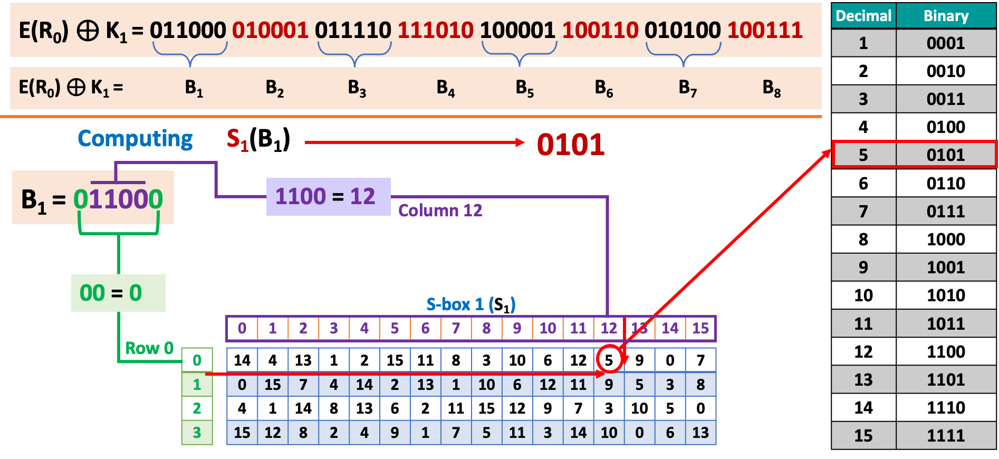

---

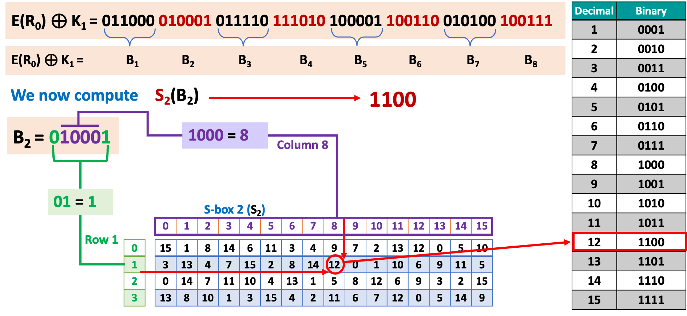

---

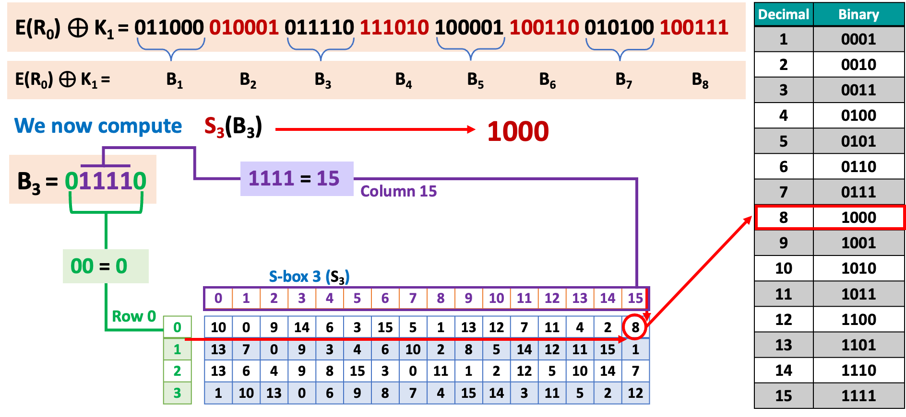

---

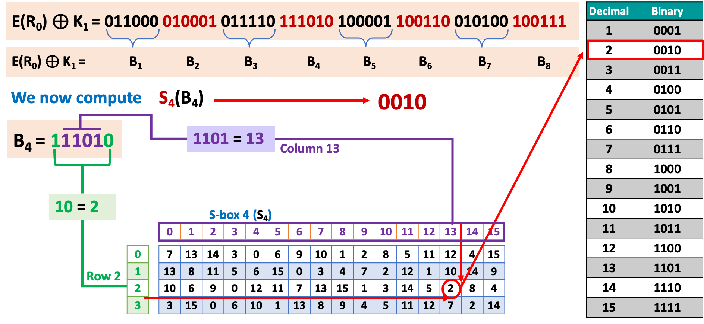

---

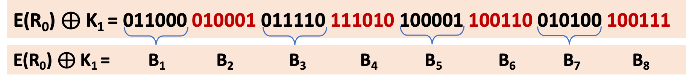

Computing all S-boxes
$$
\begin{array}{cccccccc} % 8列居中对齐：*{8}{c} = 8列 + 居中（c=center）
\color{red}S_1\color{black}(B_1) & \color{red}S_2\color{black}(B_2) & \color{red}S_3\color{black}(B_3) & \color{red}S_4\color{black}(B_4) & \color{red}S_5\color{black}(B_5) & \color{red}S_6\color{black}(B_6) & \color{red}S_7\color{black}(B_7) & \color{red}S_8\color{black}(B_8) \\
0101 & \color{red}1100 & 1000 & \color{red}\text{XXXX} & \text{XXXX} & \color{red}\text{XXXX} & \text{XXXX} & \color{red}\text{XXXX} \\
\end{array}
$$

### P-box (Permutation)

#### 16 Rounds of Processing - P-box (Permutation):

- P-box (Permutation): The 32-bit S-box output is permuted using a fixed permutation table (P-box).

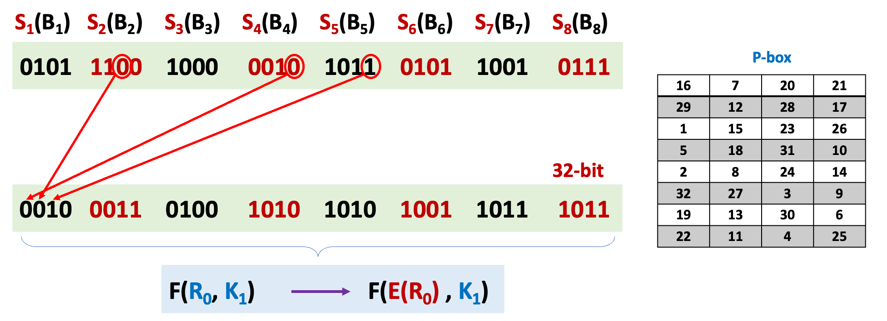

---

16 Rounds of Processing

$\textcolor{red}{L_0} = 1100~1100~0000~0000~1100~1100~1111~1111$  
$\textcolor{red}{R_0} = 1111~0000~1010~1010~1111~0000~1010~1010$

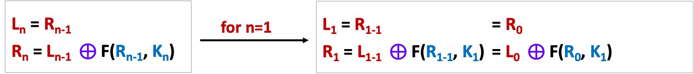

We have  
$$\colorbox{#E2F0D9}{$\textcolor{red}{K_1} = 000110~110000~001011~101111~111111~000111~000001~110010$} \hspace{1em}\textcolor{red}\}\text{~48-bit}$$
$$\colorbox{#E7E6E6}{$\textcolor{red}{L_1 = R_0} = 1111~0000~1010~1010~1111~0000~1010~1010$}\hspace{1em}\textcolor{red}\}\text{~32-bit}$$
$$\colorbox{#FBE5D6}{$\textcolor{red}{R_1} = \textcolor{red}{L_0} \textcolor{purple}\oplus F(R_0, K_1)$}$$

---

$$
\left.
\begin{aligned}
\textcolor{red}{L_0} = 1100\ 1100\ 0000\ 0000\ 1100\ 1100\ 1111\ 1111 \\
\textcolor{red}{R_0} = 1111\ 0000\ 1010\ 1010\ 1111\ 0000\ 1010\ 1010 \\
\colorbox{#E7E6E6}{$\textcolor{red}{L_1} = \textcolor{red}{R_0} = 1111\ 0000\ 1010\ 1010\ 1111\ 0000\ 1010\ 1010$} \\
\colorbox{#E2F0D9}{$F(\textcolor{blue}{R_0}, \textcolor{blue}{K_1}) = 0010\ \textcolor{red}{0011}\ 0100\ \textcolor{red}{1010}\ 1010\ \textcolor{red}{1001}\ 1011\ \textcolor{red}{1011}$}
\end{aligned}
\color{red}\right\}
\textcolor{red}{32\text{-bit}}
$$

We can now compute  
$$\colorbox{#FBE5D6}{$\textcolor{red}{R_1} = \textcolor{red}{L_0} \textcolor{purple}\oplus F(R_0, K_1)$}$$
$$
\begin{aligned}
\textcolor{red}{L_0} &= 1100\ 1100\ 0000\ 0000\ 1100\ 1100\ 1111\ 1111 \\
F(\textcolor{blue}{R_0}, \textcolor{blue}{K_1}) &= 0010\ \textcolor{red}{0011}\ 0100\ \textcolor{red}{1010}\ 1010\ \textcolor{red}{1001}\ 1011\ \textcolor{red}{1011} \\
\textcolor{red}{R_1} &= 1110\ 1111\ 0100\ 1010\ 0110\ 0101\ 0100\ 0100 \\
\end{aligned}
$$

---

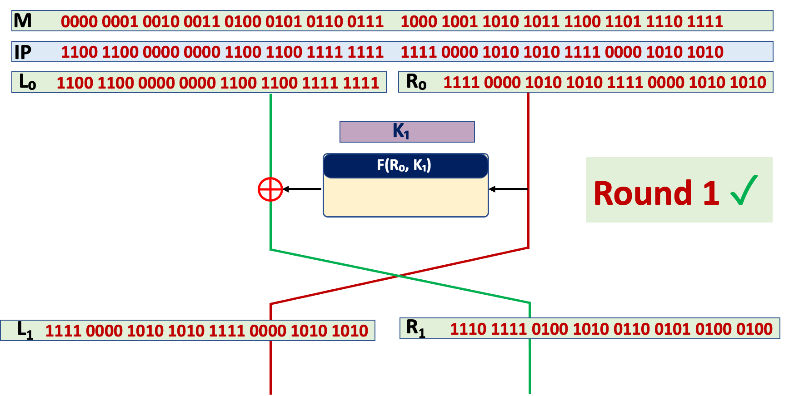
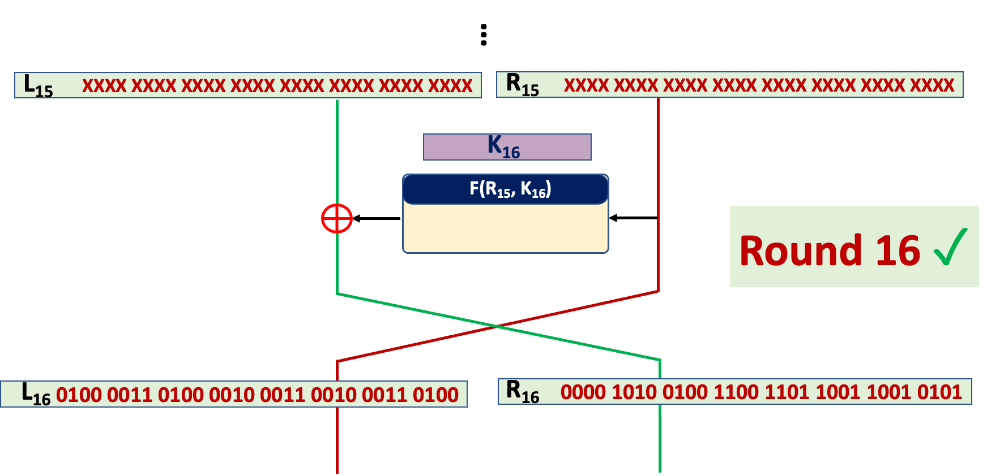
#### 16 Rounds of Processing - 32-bit Swap
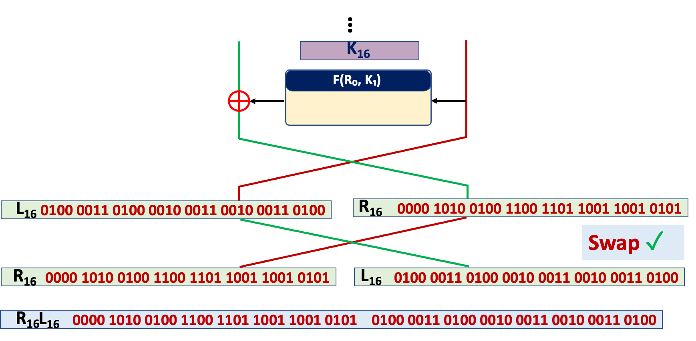

---

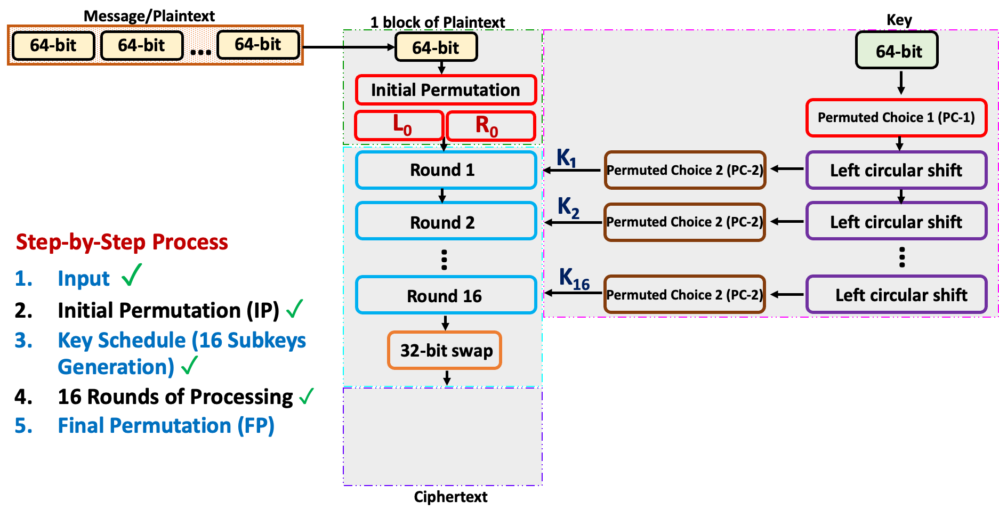

### Final Permutation (FP/IP-1)

#### Final Permutation (FP)

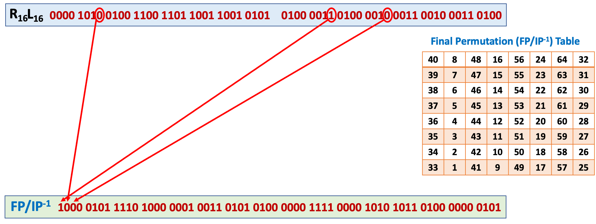

#### Final Ciphertext Output

- Convert to hexadecimal: Convert the final permutation output to hexadecimal to get the ciphertext.

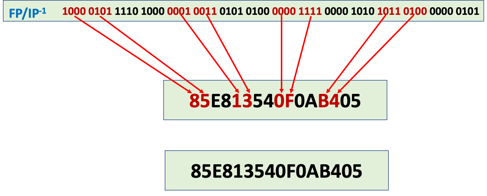

### Conclusion

- DES exhibits strong avalanche effect − A small change in plaintext results in the very great change in the ciphertext. 
- DES was proved insecure - In January 1999, distributed `.net` and the Electronic Frontier Foundation collaborated to publicly break a DES key in 22 hours and 15 minutes.
- DES has been withdrawn as a standard by the National Institute of Standards and Technology
- This cipher has been superseded by the Advanced Encryption Standard (AES).

## Advanced Encryption Standard (AES)

- AES is a symmetric encryption algorithm, meaning the same key is used for both encrypting and decrypting data.
- It was established as a standard by the U.S. National Institute of Standards and Technology (NIST) in 2001 after a competition to replace the older Data Encryption Standard (DES), which was becoming vulnerable to attacks.
- It is fast, secure, and efficient, making it the go-to choice for protecting sensitive data.

Key Features of AES:  
**Symmetric Key Algorithm:** Uses the same key for encryption and decryption.  
**Block Cipher:** Operates on fixed-size blocks of data (128 bits, or 16 bytes).  
**Key Length:** uses keys of varying lengths (128, 192, or 256 bits).  
**Rounds of Processing:** The encryption process involves multiple rounds of transformations that scramble the data in a way that’s extremely hard to reverse without the key. The number of round in Encryption and Decryption is dependent on the key length

### How it works

- Key Expansion: The original key (e.g., 128 bits) is expanded into a set of "round keys" used in each step of the encryption. This ensures the key evolves throughout the process, adding complexity.
- Initial Round: The input data (a 16-byte block) is combined with the first round key using a bitwise XOR operation.
- Main Rounds: It applies a series of transformations to the data in multiple rounds (10 rounds for 128-bit keys, 12 for 192-bit, 14 for 256-bit). Each round consists of four steps:
    - **SubBytes**: Each byte in the block is replaced with another byte according to a predefined substitution table (S-box).
    - **ShiftRows**: The rows of the data block (visualized as a 4x4 grid) are shifted to the left by different amounts.
    - **MixColumns**: The columns of the grid are mixed using a mathematical operation, further scrambling the data.
    - **AddRoundKey**: The current round key is XORed with the block, integrating the key into the process.
- Final Round: The last round skips the MixColumns step but includes **SubBytes**, **ShiftRows**, and **AddRoundKey** to finalize the encryption.

---

To be continued
