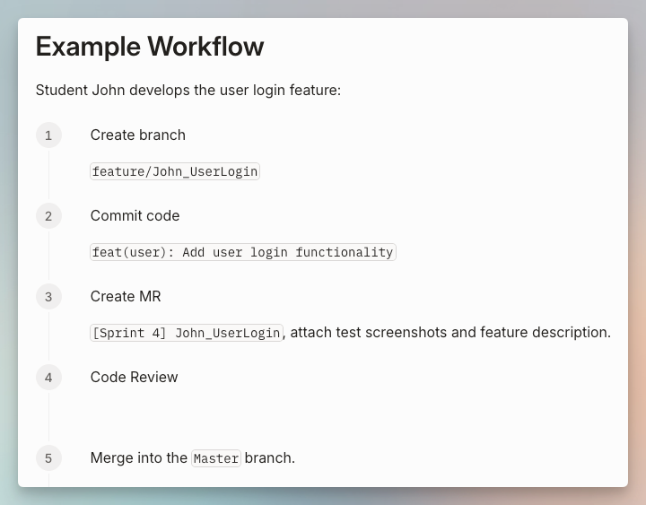
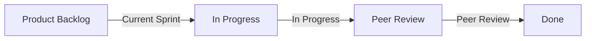

# Semester 2 Guide

> "Plans are nothing; planning is everything."

## Semester 1 — What We Covered
### **Phase I: Preparation (Weeks 1–5)**

1. Week 1 — Module Introduction & IPD Overview (What is Product Development?)
2. Week 2 — From Idea to Requirement (User Story and Requirement Gathering)
3. Week 3 — User Story Mapping & Product Backlog
4. Week 4 — Product Roadmap & Release Plan
5. Week 5 — MVP & MDP

### **Phase II: Agile Theory & Norming (Weeks 6–12)**

1. Week 6 — Scrum Framework & Roles (How Scrum Teams Operate)
2. Week 7 — Sprint Planning & Daily Scrum (Daily Stand-up Meeting)
3. Week 8 — Sprint Review & Retrospective (Continues Improve)
4. Week 9 — Product Design & Confirmation
5. Week 10 — Agile Testing & Quality Building-In
6. Week 11 — Social, Legal, Ethical & Professional Issues (Responsibilities of Professionals)
7. Week 12 — Project Management Tools & Part B Presentation

## Semester 1 — Quick Retrospective

3 Questions for You: 
1. What was the best thing your team did in Semester 1? 
2. What was the biggest challenge you encountered? 
3. What will you do differently in Semester 2?

## Semester 2 - Guide

Core Mission of S2: **Apply knowledge to truly build products.**

### Session Objects

- Learning and Development in the AI Era: Navigating Your Intelligent "Co-pilot"
- Academic Research and Literature Review
- Product Development Metrics: Velocity, Technical Debt and Burn-ups
- Systems Issues – Errors, Failures, Risks and Hazards
- Finance and Product Cost Management

### S2 Sprint Plan — Your Roadmap

<table style="border-collapse: collapse; width: 100%; font-family: Arial, sans-serif;">
    <thead>
        <tr style="background-color: #8fa8bf; color: white; font-weight: bold;">
            <th style="border: 1px solid black; padding: 12px; text-align: center; font-size: 16px;">Sprint</th>
            <th style="border: 1px solid black; padding: 12px; text-align: center; font-size: 16px;">Week</th>
            <th style="border: 1px solid black; padding: 12px; text-align: center; font-size: 16px;">Core Mission</th>
        </tr>
    </thead>
    <tbody>
        <tr>
            <td style="border: 1px solid black; padding: 12px; text-align: center; font-size: 16px; background-color: #d9e2f3;"><strong>Sprint 3</strong></td>
            <td style="border: 1px solid black; padding: 12px; text-align: center; font-size: 16px; background-color: #e8e0c9;"><strong>Week 2–5</strong></td>
            <td style="border: 1px solid black; padding: 12px; text-align: center; font-size: 16px; background-color: #e8e0c9;">Core functionality development and enhancement</td>
        </tr>
        <tr>
            <td style="border: 1px solid black; padding: 12px; text-align: center; font-size: 16px; background-color: #d9e2f3;"><strong>Sprint 4</strong></td>
            <td style="border: 1px solid black; padding: 12px; text-align: center; font-size: 16px; background-color: #e8e0c9;"><strong>Week 5–8</strong></td>
            <td style="border: 1px solid black; padding: 12px; text-align: center; font-size: 16px; background-color: #e8e0c9;">Technical debt, Fix Bugs</td>
        </tr>
        <tr>
            <td style="border: 1px solid black; padding: 12px; text-align: center; font-size: 16px; background-color: #d9e2f3;"><strong>Sprint 5</strong></td>
            <td style="border: 1px solid black; padding: 12px; text-align: center; font-size: 16px; background-color: #e8e0c9;"><strong>Week 8–11</strong></td>
            <td style="border: 1px solid black; padding: 12px; text-align: center; font-size: 16px; background-color: #e8e0c9;">Final Presentation</td>
        </tr>
    </tbody>
</table>

At the end of each Sprint: Product Backlog + Sprint Plan + Sprint Review + Sprint Retrospective

### Assessment Reminders — S2 Deadlines

<table style="border-collapse: collapse; width: 100%; font-family: Arial, sans-serif;">
    <thead>
        <tr style="background-color: #f5c76f; color: #5c6e70; font-weight: bold;">
            <th style="border: 1px solid black; padding: 12px; text-align: center; font-size: 16px;">Courseworks</th>
            <th style="border: 1px solid black; padding: 12px; text-align: center; font-size: 16px;">DDL</th>
            <th style="border: 1px solid black; padding: 12px; text-align: center; font-size: 16px;">PER</th>
        </tr>
    </thead>
    <tbody>
        <tr>
            <td style="border: 1px solid black; padding: 12px; text-align: center; font-size: 16px; background-color: #e8e0c9; color: #5c6e70;">Part A — Project Proposal/ Plan & Defense</td>
            <td style="border: 1px solid black; padding: 12px; text-align: center; font-size: 16px; background-color: #e8e0c9; color: #5c6e70;">S1 Week 5 ✅</td>
            <td style="border: 1px solid black; padding: 12px; text-align: center; font-size: 16px; background-color: #e8e0c9; color: #5c6e70;">30%</td>
        </tr>
        <tr>
            <td style="border: 1px solid black; padding: 12px; text-align: center; font-size: 16px; background-color: #e8e0c9; color: #5c6e70;">Part B — Group Presentation</td>
            <td style="border: 1px solid black; padding: 12px; text-align: center; font-size: 16px; background-color: #e8e0c9; color: #5c6e70;">S1 Week 12 ✅</td>
            <td style="border: 1px solid black; padding: 12px; text-align: center; font-size: 16px; background-color: #e8e0c9; color: #5c6e70;">10%</td>
        </tr>
        <tr>
            <td style="border: 1px solid black; padding: 12px; text-align: center; font-size: 16px; background-color: #e8e0c9; color: #5c6e70;">Part C — Employability Portfolio</td>
            <td style="border: 1px solid black; padding: 12px; text-align: center; font-size: 16px; background-color: #e8e0c9; color: #5c6e70; font-weight: bold;">S2 Week 11</td>
            <td style="border: 1px solid black; padding: 12px; text-align: center; font-size: 16px; background-color: #e8e0c9; color: #5c6e70;">10%</td>
        </tr>
        <tr>
            <td style="border: 1px solid black; padding: 12px; text-align: center; font-size: 16px; background-color: #e8e0c9; color: #5c6e70;">Part D — Online Quiz Examination</td>
            <td style="border: 1px solid black; padding: 12px; text-align: center; font-size: 16px; background-color: #e8e0c9; color: #5c6e70; font-weight: bold;">S2 Exam Week</td>
            <td style="border: 1px solid black; padding: 12px; text-align: center; font-size: 16px; background-color: #e8e0c9; color: #5c6e70;">10%</td>
        </tr>
        <tr>
            <td style="border: 1px solid black; padding: 12px; text-align: center; font-size: 16px; background-color: #e8e0c9; color: #5c6e70;">Personal Performance</td>
            <td style="border: 1px solid black; padding: 12px; text-align: center; font-size: 16px; background-color: #e8e0c9; color: #5c6e70; font-weight: bold;">Sprint Review</td>
            <td style="border: 1px solid black; padding: 12px; text-align: center; font-size: 16px; background-color: #e8e0c9; color: #5c6e70;">8%*5</td>
        </tr>
    </tbody>
</table>

### Session Objects

- <i>New</i> - Case Study
- <i>New</i> - Coursework Part C - Employability Portfolio

### Courseworks

1. Coursework Part C - Employability Portfolio
2. Coursework Part D – Individual Journal of Agile Development
3. Coursework Part D – Class Test

### Coursework Part C - Employability Portfolio

- Set – Semester 2, Week 1;
- Due – Semester 2, Week 11
- Reward: 10% of the module mark
- Total word count – 1000 words

Section 1. Developing a Career Plan  
Section 2. Building CVs and Covering Letters  
Section 3. Job Descriptions and Interview Questions  
Section 4. Interviews  
Section 5. Formative Feedback  
Section 6. Psychometric Tests  
Section 7. Assessment Centre Preparation  

### Agile Development

<u>3 Sprints</u> to complete your MVP(Minimum Viable Product)

### Agile Project Ideas

The ideas include bullets – indicating essential features of the product, with some ideas for extending the core system.  
Make the project your own, by developing your own features.  
https://ipd.cdut-sinobritish.com/coursework/agile-project-ideas

### S2 Expectations — What We Need From You

As a student, S2, you need to: 
1. Proactively drive projects. Don’t wait for lectures to tell you what to do; initiate sprints 
2. Maintain high-quality journals. Write immediately after each Sprint, reflecting honestly 
3. Collaborate as a team. Hold daily stand-ups (Daily Scrum) consistently; the Scrum Master drives this process 
4. Submit work on time. Part C (Week 11) and each journal round have deadlines

As a Module Leader, I will provide: 
1. Weekly lectures provide specialized knowledge support. 
2. Provide Product Owner-style feedback during the Sprint Review 
3. Feel free to reach out to me anytime if you have any questions.

### Where Do You Manage Your Working Results?

1. Your Code/Framework/Prototype/etc. 
2. Your UI Design/Tech Research/etc.

### Standardized Gitee Workflow

https://ipd.cdut-sinobritish.com/reading-materials/git/standardized-gitee-workflow

### Where Do You Track Your Project Progress?

Product Backlog -> Current Sprint -> In Progress -> Peer Review -> Done  

Retrospective

## Today's Action Items

Before the end of today, please confirm: 
1. Do you know who your Scrum team members are? 
2. Do you know what the goal of Sprint 3 is? 
3. Your Sprint 3 Backlog has been groomed. 
4. Are you aware of the deadlines for Parts C and D?

> [!INFO] Attachment
> [semester-2-sprints-preparation.pdf](https://vle.zycdut.net/sites/student.zy.cdut.edu.cn/files/attachments/semester-2-sprints-preparation.pdf)
