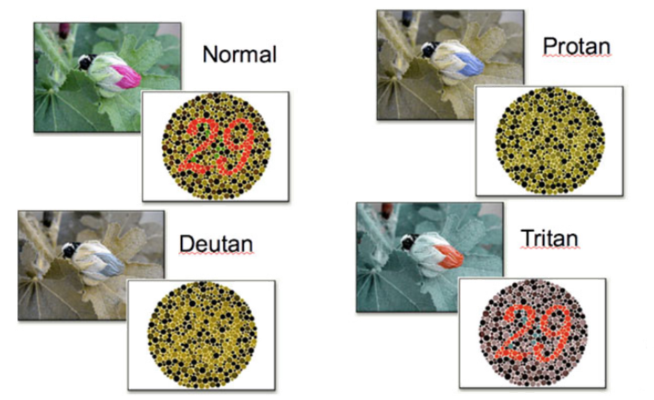
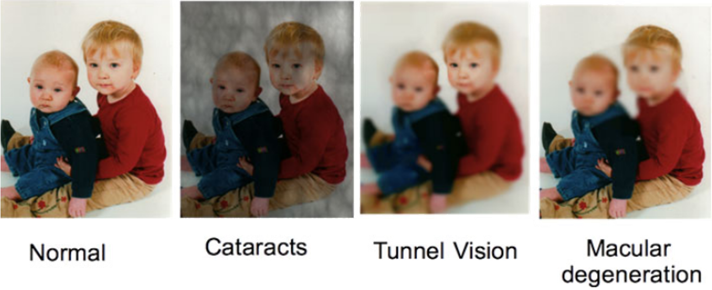

# Accessibility

## Why Accessibility

- In many cases it is a legal responsibility.
- It widens the access to your product or service.
- It enables you to take advantage of emerging technologies.
- It gives you an overall better product.

## Accessibility on the Web

- The web is an important vehicle for communication for government bodies who want accessible information
- Many applications are now web based (web mail… etc.).
- Accessibility improves use on small function devices
- Accessibility can improve the ability to query information

## What Accessibility does NOT mean

- You have to do away with all multimedia content.
- You have to write for text only web browsers.
- You just need to enlarge the font for everything.
- Lots of expense.

## Relevant law and guidelines

- Disability Discrimination Act 1995 (no longer relevant but you will still hear references to it)
- Equality Act 2010
- Web Consortium Accessibility Guidelines 1.0 (previous)
- Web Consortium Accessibility Guidelines 2.1 (current)
- EU Directive on web accessibility
    - UK law - Public Sector Bodies (Websites and Mobile Applications) Accessibility Regulations 2018.

## DDA & Equality Act

- Equality Act 2010 replaces Disability Discrimination Act (and other pieces of equality legislation)
- Covers a wide range of areas of life
- Outlaws discrimination of people on the grounds of disability
- Puts a duty on organisations and companies to provide accessible goods, service, premises and information
- Puts further duties on public bodies to promote equality
- It has been a legal requirement since 1999 for web sites to be accessible

## Famous Cases: Sydney Olympics 2000

- Relevant to the UK as the Australian Law is very similar to UK law in this respect.
- Olympic Committee was found guilty of producing an inaccessible website. 
- The fine was $A20,000 plus they had to fix the site before the Olympics.
- The cost of fixing the site was much greater than if accessibility had been included from the start

## WCAG 1.0

- Provides a basic checklist for accessibility.
- Created as part of the Web Access Initiative ( https://www.w3.org/WAI/ ).
- The W3C Web Accessibility Initiative (WAI) develops standards and support materials to help people understand and implement accessibility.
- Partially automatable.
- Superseded by WCAG 2.0 (and now 2.1) but still useful as it takes a slightly different approach.

## WCAG 2.1

- 3 Levels of Compliance
- Level A success criteria:
    - Achieve a minimum level of accessibility
    - Can reasonably be applied to all Web content
- Level AA success criteria:
    - Achieves an enhanced level of accessibility
    - Can reasonably be applied to all Web content
- Level AAA success criteria:
    - Achieves additional accessibility enhancements.
    - Can not necessarily be applied to all Web content.
- Not every criterion has all three levels.

---

- Extends WCAG 1.0 to cover new technologies
- Organised around 4 basic design principles
    1. Content must be perceivable
    2. Interface components in the content must be operable
    3. Content and controls must be understandable
    4. Content should be robust enough to work with current and future user agents (including assistive technologies.
- POUR - Perceivable Operable Understandable Robust
- Introduces the idea of a baseline (the set of technologies which the user is assumed to have)

---

- WCAG 2.0: 4 principles divided up into 12 guidelines 
- WCAG 2.1 adds a 13th guideline (2.5 Input Modalities) and extends the scope of others
- WCAG 2.1 is an extension of 2.0. If you meet 2.1 you automatically meet 2.0
- Each guideline has associated success criteria which say if that guideline has been met.
- Every appropriate guideline at a particular level must be met before you can say you have met that level of conformance
- Alternative pages can be used to help meet guidelines.
- Minimum level of conformance desirable in the UK is AA

---

- Principle 1: Content must be perceivable
- **Guideline 1.1: Text alternatives must be provided for any non-text content.**
- Images must have alternative text (“alt” attribute). Must convey the same information or, if this is not possible, describe the image.
- Icon based controls must have a name that describes the input.
- Purely decorative graphics must be marked to allow assistive systems to 
- ignore them.
- CAPTCHA tests must not have the only option being the reading of an image.

---

- **Guideline 1.2: Time-based Media (audio and video)**
- Grade A: provide alternative representation of prerecorded media.
- Grade A: provide captions on prerecorded audio or audio 
- description for prerecorded video.
- Grade AA: provide captions on live audio.
- Grade AAA: provide sign language video for prerecorded audio.
- Grade AAA: provide audio descriptions that can pause prerecorded video in order to fit descriptions in.
- Grade AAA: provide alternative representation of live audio

---

- **Guideline 1.3: Adaptable** Create content that can be presented in different ways
- Use appropriate semantic markup for HTML including header styles. Make input names clear. Do not display important information purely using visual or audio characteristics (colour, size, etc.)
- **Guideline 1.4: Distinguishable** Make it easier for users to see and hear content
- Ensure appropriate contrast between text and background. Avoid images of text. Make text resizable if possible. Do not convey information purely using colour. Ensure any automatically played audio can be paused, stopped, or changed in volume without changing the volume of other sound.

---

- **Principle 2: Interface components in the content must be operable**
- **Guideline 2.1: Keyboard Accessible** make all functionality available from the keyboard
- Browsers provide default systems for editing forms with the keyboard; ensure they work and can access all controls in a sensible order and don’t get stuck. Add keyboard alternatives for non-standard input. Ensure that keyboard shortcuts can be disabled or prevented from conflicting with keyboard input.
- **Guideline 2.2: Enough Time** Provide users with enough time to read and use content
- Avoid time limits. Allow scrolling or flashing text to be paused. If the user’s session times out, ask them to log in again but resume exactly where they left off, including data entered on the request that caused the time out to be detected

---

- **Guideline 2.3: Seizures and Physical Reactions** Do not design content in such a way that is known to cause seizures
- Flashing objects should be avoided or limited to 3 flashes per second, and avoid red
- **Guideline 2.4: Navigable** Provide ways to help users navigate, find content, and determine where they are
- Pages must have clear titles, focus order must be sensible, the purpose of links must be made clear within the link (not only by surrounding content); repeated text is marked and can be skipped; pages can be found multiple ways
- **Guideline 2.5: Input Modalities** Make it easier for users to operate functionality through various inputs beyond the keyboard
- Don’t require path-based gestures or device motion. Execute functions on button release, not button press, to give the user a chance to cancel.

---

- **Principle 3: Content and controls must be understandable**
- **Guideline 3.1: Readable** Make content readable and understandable
- Identify language of text or subsection of text with a language code. Ideally provide ways to clarify the meanings of words and abbreviations. 
- **Guideline 3.2: Predictable** Make web pages appear and operate in predictable ways
- Navigational mechanisms that appear on multiple pages occur in the same relative order. Things that look the same on multiple pages do the same and vice versa. Focusing a form component or typing input alone does not immediately change the context or page.
- **Guideline 3.3: Input Assistance** Help users avoid and correct mistakes
- Clearly label input. Where an input error can be detected, do so and identify the error to the user in text. Allow users to reverse submissions or correct them, or at least to give final confirmation before submission.

---

- **Principle 4: Content should be robust**
- **Guideline 4.1 Compatible:** Maximize compatibility with current and future user agents including assistive technologies
- Use validated and correct HTML markup.
- If you create non-standard input components, make sure they can be changed in software as well as by the user, and that software can be notified when they are changed.
- For more information look at the WCAG links on the last slide

## Some accessibility issues: sensory

- Use of color to indicate information

---

- Visual only information

---

- Audio is sometimes not seen as an important part of the web experience but can be vital e.g Bilibili
- People’s acuity, frequency range and volume range decrease as they get older.
- Many portable devices struggle to reproduce audio correctly.

## Some accessibility issues: mental

- Blinking and flashing images and text can cause problems with epilepsy.
- Poor organization of information can cause problems for everybody, but particularly for people with dyslexia.
- Too much use of colour, particularly moving and clashing colours can cause problems for people with synaesthesia.

## Some accessibility issues: physical

- Fine motor control may be problematic for people with dyspraxia, motor neuron disease, mobility impairment, or those working on a small format device.
- Performing repetitive movements is boring for everybody but can be a particular issue for people with chronic pain.

## Some accessibility issues: navigational

- JavaScript menus can look pretty, but may not work on all machines. They can also be hard for screen readers.
- Flash is now considered deprecated and should be avoided. It is very, very hard to make accessible. 
- Simple menus are easiest to program and the most accessible.
- Need to pay attention to structure as well.

## Some accessibility solutions: visual

- Visual impairment is the main disability for which there exists technical solutions.
- These include:
    - Braille screens
    - Hepatic controllers (e.g mice)
    - Screen readers
    - Magnifiers

## Other Accessibility solutions

- Linear version of the site for screen readers.
- Audio should be additional, not essential
- Audio should be mutable

## Basic design considerations

- Choice of fonts
- Icons or text
- Resolution Independence

## Choice of fonts and icons

- Use San Serif fonts such as Arial, or Verdana
- Use a minimum of 12 point as the default size for main text.
- Users should have the ability to change font size (and if possible, font) – different CCSs (or at least an accessible one) can help here.
- Try to keep icons a) clear, b) consistent, c) not dependent on any cultural bias
- Best to use both icons and text.

## HTML5 and other technologies

- HTML5 can be used to enhance accessibility by providing alternative content and increasing semantic clarity of page blocks.
- Some screen readers and related technology cannot cope well (esp. asynchronous technologies)
- PDF can have particular accessibility issues so should be avoided unless tagged pdf can be used.
- Use only standard CAPTCHAs that are maintained to offer accessible options.

## Captchas

- A captcha is a distorted word or phrase intended to be unreadable by machine.
    - Designed to stop bots from accessing web pages
    - Requires letters or numbers to be identified from an image
- Can be a problem for blind or severely visually disabled users
    - Rely on screen readers
    - Captchas can defeat screen readers as easily as bots
- Solution: captchas don’t need to be based on visual perception
    - Identifying letters, numbers or phrases is also effective as an audio task
    - Offering the choice covers most users but there is still a problem for those with both visual and hearing impairment.
- Modern validation is often identify items
    - Which squares in a picture contain x?

## Top ten tips for web accessibility

1. Images & animations: use the alt attribute to describe the function of each visual. RNIB have guidelines about the use of Alt text.  https://www.rnib.org.uk/accessibility-guidelines-alt-text-what-you-need-know
2. Image maps: Use client-side maps and text for hotspots.
3. Multimedia: Provide captioning and transcripts of audio, and descriptions of video.
4. Hypertext Links: use text that makes sense when read out of context. For example, avoid “click here” and links with the same name that lead to different places.
5. Page Organisation: use headings, lists and consistent structure. 
6. Use CSS for layout and style where possible. Provide accessible CSS as an alternative.
7. Graphs & Charts: Summarize or use the long desc attribute. SVG is particularly good as metadata can be embedded in the picture.
8. Scripts, applets & plugins: provide alternative content in case features are inaccessible or unsupported.
9. Frames: use the no frames element and meaningful titles.
10. Tables: make line by line reading sensible. Summarize.
11. Check your work: validate, use tools and checklists, and guidelines at https://www.w3.org/TR/WCAG

## Tools and resources

- WAI
    - https://www.w3.org/WAI/
- WAI list of accessibility guidelines
    - https://www.w3.org/WAI/ER/tools/complete
- Web Content Accessibility Guidelines 2.1
    - w3.org Recommendation
    - Understanding WCAG - gov.uk
