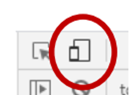

# Designing Web Sites for Mobile Devices (Responsive Design)

## Mobile Web Access

Since 2018, most surveys have shown the majority of web traffic (by a small margin) was generated by mobile devices, in particular mobile phones.

In some countries and areas, mobile devices are much easier to connect to the Internet than desktop ones.

In the UK in 2019, a majority of people surveyed identified smartphones as their most important method for accessing the internet.

Mobile users were originally thought to be only interested in “quick access” to websites while “on the go”, but this is not the case any more. Just because a user is using a mobile doesn’t mean they’re not browsing your site while simply sat at home.

## Mobile User Interface Restrictions

- Small Screen

Harder to display large amounts of information at once, Greater dependence on icons to save space compared to text

- Unusual aspect ratio

Most desktop screens are landscape and do not change, Mobile phones are portrait by default but can be changed by the user

- No feedback

Clicking a mouse or touchpad gives automatic tactile feedback, Touching a screen does not - although in the future it may do

- Fingers are not transparent

User may have to interrupt a series of touches to see the screen, Items that are dragged or touched continuously are invisible at the time

- Typing isn’t a separate channel and has a tradeoff

Can’t type to do one thing while using mouse for another - both are touch, Soft keyboard covers up part of the user interface

## Mobile User Interface Advantages

**Higher quality display**  
Most mobile displays are now higher quality and DPI than computer ones

**Greater range of gestures**  
Tap, drag, hold, swipe, double/triple gesture, pinch, antipinch, rotate, hardware buttons

**More obvious direct manipulation**  
Touching an object to move it is more intuitive than using a mouse

**Greater overall experience control**  
Have control over the entire screen with less interference from other apps

**Better OS support**  
OSs and browsers built from scratch for modern UIs and the web, with less legacy code hanging on

## Adaptive and Responsive Design

- Adaptive web design: start from a “standard” appearance and design for a site (probably based on a desktop view), and adapt to provide different versions for mobile devices
- Problem: mobile devices and their capabilities constantly changing and offering new functionality in different combinations, and differing user preferences
- Responsive web design: designing with no standard appearance, only a general set of rules for creating a suitable site design on a device of any size or capability
- Easily allows for new devices or altered software or preferences, but a paradigm shift in web design

## Viewport Tag

- All mobile browsers support “zooming” of web pages. This means that pixel measurements on mobile devices are not exact, as zooming a web page changes all scales it uses.
- By default, mobile browsers assume pages are not designed for them, and will attempt to scale the page to fit on a mobile screen - effectively starting with the page “zoomed out” compared to the actual pixels on the screen.
- While helpful for sites that are not designed for mobile, this is problematic for other sites because the site will not be able to detect or work with the actual size of the mobile device
- To disable this, add the following to the head element:

```html
<meta name="viewport" content="width=device-width, initial-scale=1.0">
```

---

- `width=device-width` tells the mobile device not to simulate a wider screen. You can also specify an exact width in pixels, but if the device is wider than this, it will ignore it. (If it is narrower, it will zoom the page out.)
- initial-scale=1.0 disables any initial zooming. You can also specify minimum-scale and maximum-scale to limit zooming applied at any time, including by the user (watch out for accessibility!)
- Be careful with orientation changes which may abruptly change the width of the device. Different phones deal with this is different ways; some repeat the layout of the whole page, some retain the old layout but zoom in.

## CSS media query

- An additional syntax, part of CSS selectors, allowing a CSS style sheet to customise the page based on the displaying media.
- Written as the keyword `@media` followed by a series of media feature or media type specifications.
- Media types are Booleans and are simply written on their own.
- Media features are attributes and can be checked for equality. Some media features are integers, and can be compared using and =. These also have “min-” and “max-” variations which can be tested for equality.

---

- **Media types**: print, speech, screen or all (although “all” is the default and doesn’t usually need to be specified).
- **Media features (not exhaustive)**:

`aspect-ratio`: aspect ratio of the screen as a pair of numbers.
`color`: number of bits of color the screen offers, or 0 for monochrome.
`monochrome`: number of greys the screen offers, or 0 for color.
`height, width`: height and width of the display viewport (including scrollbar)
`pointer`: “none”, “coarse” or “fine” based on availability and accuracy of pointer
`hover`: “none” or “hover” based on whether hovering an element is convenient (it is easily done with a mouse but awkward with a finger)
`resolution`: pixel density of the device (usually higher on mobiles)
`prefers-color-scheme`: “none”, “light”, or “dark” based on OS preference

### CSS media query example

- If screen is wide (probably a desktop), then make navigation area a smaller part of the page.

```css
@media (min-width: 70rem) {
	nav { width: 70%; }
}
```

- If screen is narrower, make navigation area fill the screen and remove section that was previously on the right; also adjust the font size of the navigation area.

```css
@media (max-width: 70rem) {
    nav { width: 100%; font-size: 1rem; }
    div.extra { display: none; }
}
```

#### Rem?

- 1 em is the width of the letter M in the currently selected font.
- Because the currently selected font can vary and be resized across an HTML page, browsers also support the rem or “root em”, which is the width of the letter M in the font at the root of the page CSS tree (and is thus the same for all parts of the page)
- This has benefits over pixel measurements in that it potentially allows the user or device to adjust the font size of a page and have the design respond to that adjustment.
- However, some older browser may have difficulties with media queries specified in rems

### Another example

```css
nav { border: 1px solid black; } %% Use borders on all devices %%
aside { border: 1px solid red; } %% Use borders on all devices %%
@media (min-width: 70rem) {
    nav { width: 68%; float: left; }    %% On wide devices, %%
    aside { width: 30%; float: right; } %% place nav and aside side-by-side. %%
}
@media (max-width: 70rem) {
    nav { width: 100%; float: none; }   %% On narrow devices, %%
    aside { width: 100%; float: none; } %% widen them and place one above the other %%
}
body {
    max-width: 100rem; %% Limit maximum width of the entire page to prevent strange blank spaces in the layout on very wide configurations. %%
}
```

---

You can just resize your browser window, but both browsers offer a more convenient option  
In Firefox: <span style="color: red">Web Developer &gt; Responsive Design Mode</span>  
In Chrome: Open developer tools and click the mobile icon.  

This will allow you to restrict and scale the desktop view of the web page to simulate its appearance on a mobile.  
<span style="color: red">Don’t forget the viewport meta tag or the page will be incorrectly scaled!</span>

## Images

- Images can be problematic for responsive design because of their fixed pixel sizes.
- <span style="color: red">All</span> images will need to be resized in CSS to particular proportional sizes (ems, percentages, etc). Otherwise, their default pixel sizes will look wildly different on different resolution screens, and will knock other parts of the design out of whack.
- This can create problems: an image that looks fine on a desktop screen may look less sharp than text on a mobile device because although the mobile screen is smaller, it is higher resolution. You can use a very high resolution image, but then that image will have to be sent to all browsers, even desktops; and worse yet, mobiles may have high resolution screens, but they pay by the mb!

---

- Distinguish <span style="color: red">decorative</span> images from those that are essential to operate your web site.
- Try to use vector formats (like SVG or icon fonts) for essential images. They can automatically be scaled to any size.
- To load appropriate images based on device size, two techniques are used: the `srcset` attribute and the picture element. The `srcset` attribute (on the `img` tag) allows several different sources to be listed for the browser to choose from based on the resolution of image needed. The picture element does the same but allows more detailed matching of images to media queries.
- Don’t forget the alt text either way! 

## Designing a responsive site

- **Don’t start with a page layout.** Start with knowing what the **content** and **functionality** of your page is going to be and decide how the user will most easily gain access to it.
- You can write up a site storyboard or site map at this time to represent how content connects together, but don’t start with wireframes or mock-ups at this stage.
- **Design in a linear fashion.** Think in terms of the user seeing everything on your page in a single fixed order. This is always how your site will end up being displayed on the narrowest devices, so it is always relevant. Once you have a good linear design it can be expanded.

---

- Start from a simple page with <span style="color: red">content only</span>, divided into content-based sections using HTML5 semantic tags or `divs` and `spans`.
- No CSS, no images, no JavaScript yet; just completely plain content. This will not look suitable for a modern website, but that is ok - it is only the starting point of your design.
- You might not want to have pages generated or modified by a server yet; this is your choice depending on how much you expect to change the template rather than just the styling and CSS.

## Small screen first

- Start with getting the design working on a small screen. You can then refine and expand for a larger screen. (“It’s easier to move from a small house to a large one than the other way around!”)
- Drawing wireframes can still be helpful, but they are not ideal as final expressions of responsive design because they do not show how the site will change as size changes.
- As well as drawing wireframes, create prototypes by creating wireframes in HTML/CSS (ie, the page with no content, but borders around content areas). This will allow you to test your layout at different sizes dynamically.

## Breakpoints

- A responsive <span style="color: red">breakpoint</span> (different from a JavaScript debugging breakpoint) is the fixed value at which a media query changes state. For example, the earlier CSS example changed dramatically at 70rem. 
- Remember that there could be any number of sizes at which your site appears between the breakpoints. Make sure that the design still looks good when the size is **just before** and **just after** the breakpoints, and **in the middle** of the ranges.
- **Don’t use device sizes as your breakpoints** – a new device could come out tomorrow! However, if a natural breakpoint falls just above or just below a device’s size, it might be worth tweaking it up or down slightly to whichever looks best on that device.

## Touch screen issues

- Fingers are less precise than mouse pointers. Make sure that areas to be touched are big enough to be touched unambiguously.
- Make sure that touched controls give an immediate and clear response (changing text, appearing indented, etc.) to make up for the lack of tactile feedback. This means that the control must be bigger than the finger so that the response is visible while the finger is covering the control. Again, don’t use pixel sizes – a higher resolution device doesn’t come with smaller fingers!
- `mouseMove` and `hover` events usually do not work on mobile devices. Moving a finger around on the screen is used to scroll the page. 
- Some browsers offer touch specific events which do directly refer to touches. Beware of multitouch! There may be several `touchstart` events before a `touchend` if the user places several fingers on the device.

## Mobile keyboard issues

- Note that many mobile browsers will add a delay after an initial touch, in order to see if a double touch was intended. This may slow down responsiveness. (Some browsers have begun to change this.) 
- Many desktop applications place menus and control buttons at the **top** or **side** of the window. However, on mobile devices, controls at the bottom are easiest to access, as they are nearer the hand and can be touched without covering the screen. It may even be better for menus to open **upwards** rather than downwards.
- Bear in mind: **desktop machines can have touch screens too**!

---

- On most desktop machines and some tablets, the keyboard represents a “second channel” to the mouse. The keyboard cursor can be on one item while the mouse cursor is on another and interactions between the two can be made in parallel.
- On most mobile devices there is effectively only one channel. The keyboard cursor must be moved by touching the appropriate spot on the form and touching anything else deselects the keyboard as well. Make sure that the user can easily move between the two if they need to.
- Devices that use a soft keyboard (which are not necessarily only mobiles, nor all mobiles) will cover part of the screen, usually the bottom, during keyboard input. Make sure nothing important is there. Also, many devices will zoom or pan the page when a keyboard input is selected.
- On soft keyboard devices, keyboard navigation is not usually possible as the keyboard is not shown at all times, but check use of additional keyboards!

## Performance and content issues

Bear in mind that:

- Mobile devices tend to run more slowly
- Mobile internet connections are paid for by the mb
- Mobile internet connections drop out or pause more frequently

Again, make sure to give the user feedback where a process may be slow. Any contact with a server may be slow or fail. Make sure that entered data is not lost if a server fails to respond. AJAX is often helpful for this.  
Minimize the loading of content which is not needed on a mobile device. Decorative images may not be important enough to render; remember that gradients, glows, etc. can be made up in CSS3 without needing to load an image.  
