> People ignore design that ignores people.
> ——Frank Chimero

> A designer is a planner with an aesthetic sense.
> ——Bruno Munari

# Design

## Understanding Web Development

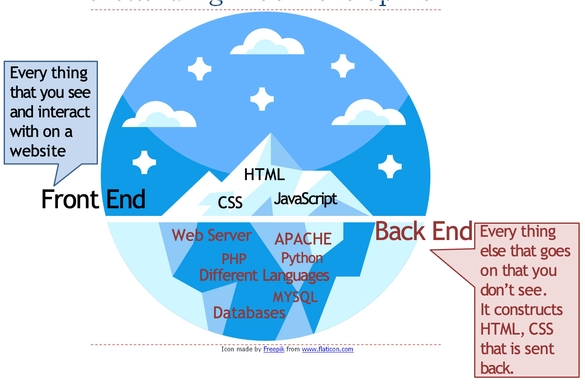

## Web Development: The Environment matters in Design

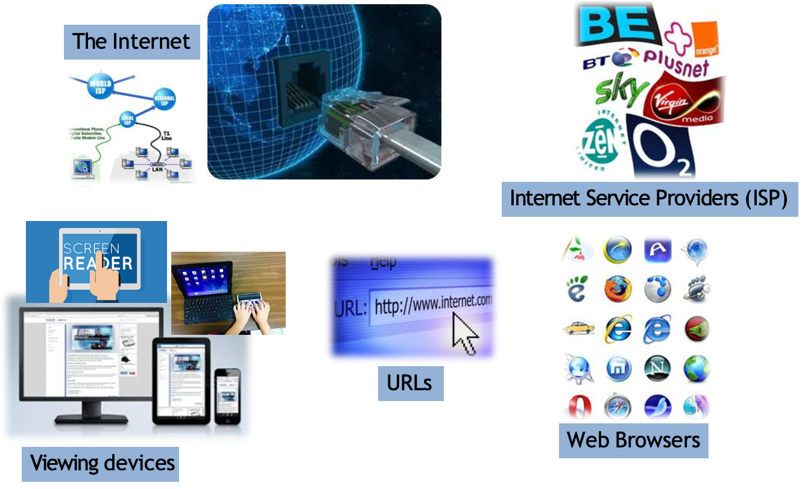
> Web Browsers: https://www.testing-web-sites.co.uk/tools-category/screen-resolution-tools/

## Web Design Tools

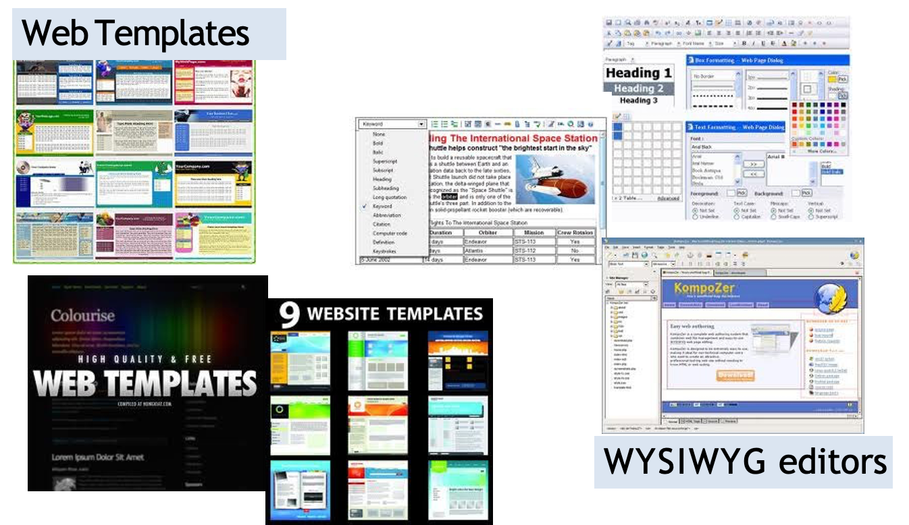
> This Photo by Unknown Author is licensed under CC BY-ND

## 10 Year Challenge

| 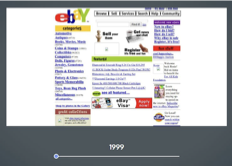 | 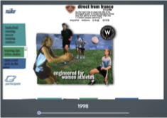 |
| ------------------------------------ | ------------------------------------ |
| 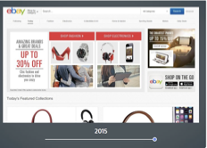 |  |

Website Design Through the Years
https://tutorialzine.com/2015/03/how-your-favorite-websites-changed-over-the-years

## Types of Websites

| 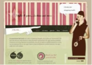 | 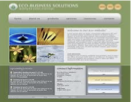 | 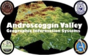 |
| ------------------------------------ | ------------------------------------ | ------------------------------------ |

  

    
Service-based business websites try to convince website visitors that they should become customers of the service company.

  

  

    

      
Information websites convey specific, helpful information to a specific user/audience so that the reader learns something or understands a topic better.

    

    
More actionable information guidance, support information, instructions, etc.

  

  

    

      
e-Commerce websites are to sell products to users.

    

    
Optimized to achieve a high percentage of sales.

  

  

    

      
Entertainment websites showcase entertaining information for visitors.

    

    
Often updated and engaging by using dynamic content

  

## Types of Web Applications

  

    
e-Commerce websites have some properties of web applications, as they can be used purely functionally to buy a product the user already knows about and chooses to buy from that source.

  

  

    
Web-based games often focus on interactive graphics, but can also be text based and include real-time elements, requiring use of dynamic content loading.

  

  

    
Web-based applications use extensive client side scripting, combined with server support, to replicate the functionality of a desktop application within a web browser; usually with extra features related to network connectivity.

  

  

    
Content Management Systems arrange content provided by the site authors and/or visitors into a pleasing layout or framework of interaction. They go beyond web templates in that they do not provide purely aesthetic traits.

  

  
Embedded Browser Applications are desktop applications written using web technologies that run using internal web browsers. Web technologies are used purely to provide the UI and to create platform independence.

## eCommerce Website Design

|                                      |                                                                                                                                                                        |                                      |                                                                                                                                                        |
| ------------------------------------ | ---------------------------------------------------------------------------------------------------------------------------------------------------------------------- | ------------------------------------ | ------------------------------------------------------------------------------------------------------------------------------------------------------ |
|  | Integrate the latest online techniques available which have been proven to increase the chances that a visitor will purchase, but that are well supported by browsers. |  | Remove friction during the purchasing process, making the checkout smooth and easy.  Use the proper payment options.                             |
|  | Incentivising buyers. Remarket to past visitors who haven’t yet purchased.  Reward past buyers to buy again.                                                  | 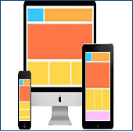 | Fast and attractive. E-commerce sites must be faster than other sites because of the higher level of trust.  Mobile ready and responsive design. |

> “Design your website so that it communicates trustworthiness, timeliness and value.”
> ——Gary Shelly

## The Website Development Planning Process

|  | Detailed planning is vital not only in the development of a website, but also in any other similar investment to which time and other significant resources are dedicated. |
| ------------------------------------ | -------------------------------------------------------------------------------------------------------------------------------------------------------------------------- |

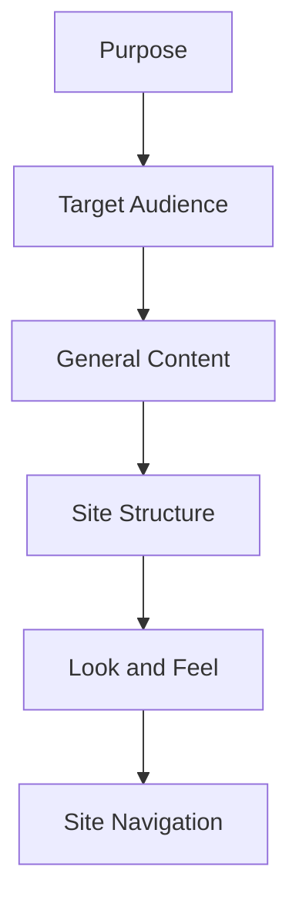

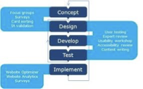
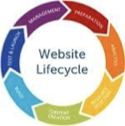

## Purpose of the Website

|  | eCommerce company that focuses on selling organic and fair-trade products.                                                                                                                         |
| ------------------------------------ | -------------------------------------------------------------------------------------------------------------------------------------------------------------------------------------------------- |
|                                      | **Primary Goal:** Increase sales of company product and services.  Objectives for Primary Goal - Testimonials of existing customers. - Limited offer discount for returning customers. |

| Secondary Goals                                                                                                                                                                                               | Objectives for Secondary Goals                                                                                                                                                                                                                                                                                                                                                                                                                      |
| ------------------------------------------------------------------------------------------------------------------------------------------------------------------------------------------------------------- | --------------------------------------------------------------------------------------------------------------------------------------------------------------------------------------------------------------------------------------------------------------------------------------------------------------------------------------------------------------------------------------------------------------------------------------------------- |
| - Promote online awareness of the company and its products. - Establish the company’s credibility. - Educate site users about the fair-trade products. - Encourage site users to return to the site. | - Develop attractive and user friendly site to promote awareness of the company. - Provide e-commerce tools to streamline and enhance shopping experience. - Provide product reviews by infuencers. - Include links and provide multimedia elements to create interest and help site visitors visualise the need for fair- trade products. - Offer online tools to encourage site visitors to make a change to their buying habits.  |

## Target Audience

A Target Audience profile is research-based overview that includes information about potentials visitors demographics & psychographic characteristics

|                                      | 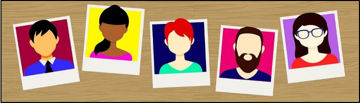                                                                                                                                                                            |                                      |
| ------------------------------------ | --------------------------------------------------------------------------------------------------------------------------------------------------------------------------------------------------------------- | ------------------------------------ |
| 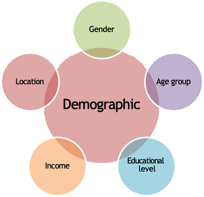 | TARGET AUDIENCE Core target is men & women, who are 16-24 years old Fashion lovers Trend followers Supporters of street culture People, who love sports, music, & values, such as being part of a crew | 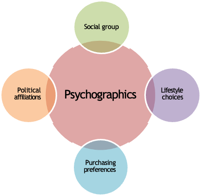 |

|  | A target audience profile identifies potential website visitors by refining who they are and why they are likely to visit your site. |
| ------------------------------------ | ------------------------------------------------------------------------------------------------------------------------------------ |

## Website General Contents

|  | The content elements you choose for your website must support the purpose and meet your target audience’s expectations. |
| ------------------------------------ | ----------------------------------------------------------------------------------------------------------------------- |

1. Determine your site’s home page and underlying pages.
2. Ensure that the homepage answers visitors’ **who**, **what** and **where** questions.
3. Determine the visual identity to be added to all pages that will brand your site.
4. Determine the value-added contents for your pages.

### Value - Added Contents

|  | Value Added Content is information that is relative, informative and timely; accurate and of high quality and reusable. |
| ------------------------------------ | ----------------------------------------------------------------------------------------------------------------------- |

|  | Value Added Content can be text, images, video, audio, animation, multimedia, and dynamically generated contents. |
| ------------------------------------ | ----------------------------------------------------------------------------------------------------------------- |

| Do the content elements: - Add value to the site? - Further the sites purpose? - Enhance visitors experience at the site? | 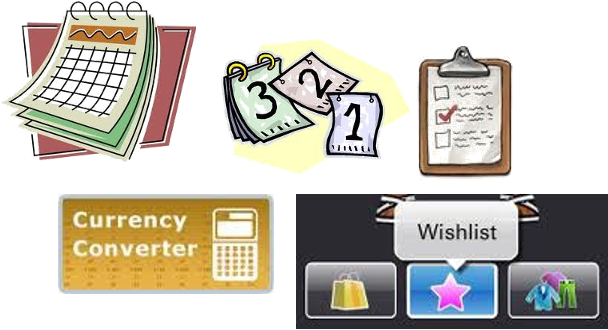 |
| ---------------------------------------------------------------------------------------------------------------------------------- | ------------------------------------ |

### Homepage

|  | A website home page should contain elements that draw the visitor in and encourage further exploration. The home page should be different enough to stand out as the primary page, but still connect visually with other pages in the site. |
| ------------------------------------ | ------------------------------------------------------------------------------------------------------------------------------------------------------------------------------------------------------------------------------------------- |

Ensure that the homepage answers visitors’ who,  what and where questions.
- Who: Elements which clearly identify the company.
- What: Elements that show visitors what content or is functionality is available on the site.
- Where: Easily identifiable navigation links to other pages.

Example https://www.vacaway.com

---

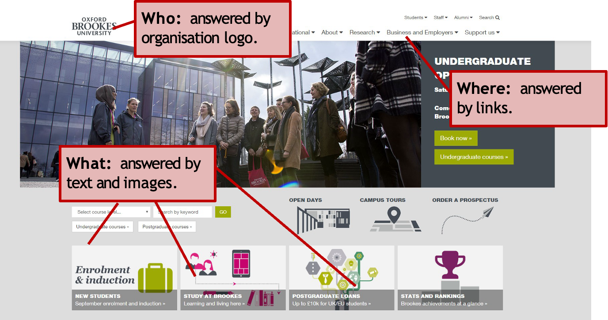

### Visual Identity

|  | Visual identity is one of the efficient part in creating a strong brand. |
| ------------------------------------ | ------------------------------------------------------------------------ |

“Consistent and effective visual communication is one of the easiest and most widely used tools a business can use to communicate its values and identity to the consumer – without even saying a word...” https://www.snowflakecreative.co.uk/blog

| 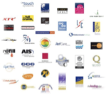 | 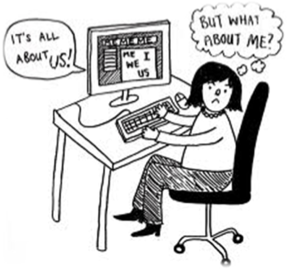 |
| ------------------------------------ | ------------------------------------ |

## Look and Feel
### Text

> “\[typography\] is a craft by which the meanings of text (or its absence of meaning) can be clarified, honoured and shared..”
> ——Robert Bringhurst

Font sizes add flavour and character.
> Follow Nielsen’s Readability Guidelines for Website Font Size. https://www.hobo-web.co.uk/best-font-size/

- Design Features Font Choices, and Contrast Size and Hierarchy
- Text Features Kerning Anti-aliasing Embedded Fonts Graphical Text

> Good typefaces are designed for a good purpose, but not even the very best types are suited to every situation.
> Johno@ilovetypography.com

https://ilovetypography.com/2008/02/28/a-guide-to-web-typography/

#### Text: Embedded

- Allows the designer to transform dull text into eye-catching or colourful designs.
- Eye-catching, looks good on small text, logos, menu/tool bars.

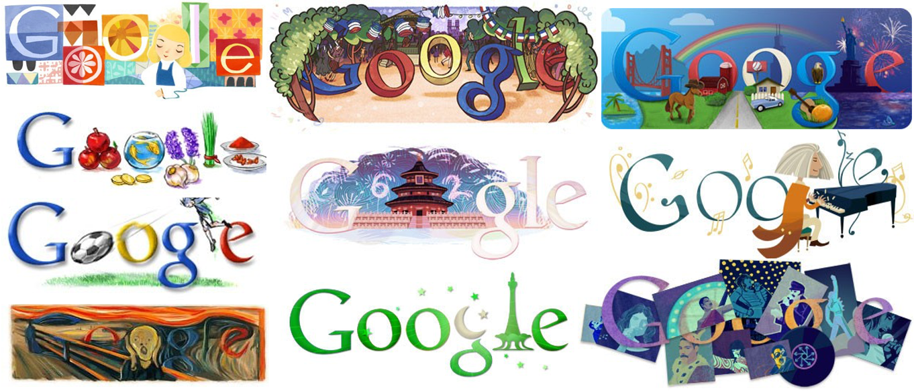

---

|  | Allows fonts that were originally created for branding, marketing and other media to be embedded in the webpage, guaranteeing the end user the complete original document. |
| ------------------------------------ | -------------------------------------------------------------------------------------------------------------------------------------------------------------------------- |

|  https://www.linotype.com/1418/fontoftheweek.html  | Before font embedding was available, web designers had to rely on the compatibility of the browser and the user’s various application. |
| -------------------------------------------------------------------------------------------- | -------------------------------------------------------------------------------------------------------------------------------------- |

|                                                | The disadvantage of embedding fonts is that larger files are created, and this can slow down page loading. |
| ---------------------------------------------------------------------------------- | ---------------------------------------------------------------------------------------------------------- |
| helps you add web fonts to any web page. https://code.google.com/apis/webfonts/ | 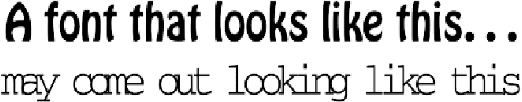                                                                       |

#### Text: Replacing Text with Icons

Replace letters with icons to add meaning to your words and reinforce the message visually. The shape of the icon and the letter have to be similar so that audience have no trouble in reading the word in its totality.

| 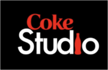 | 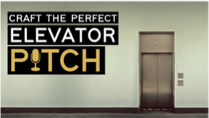 |  |  |  |
| ------------------------------------ | ------------------------------------ | ------------------------------------ | ------------------------------------ | ------------------------------------ |

### Colour

https://material.google.com/style/color.html

| 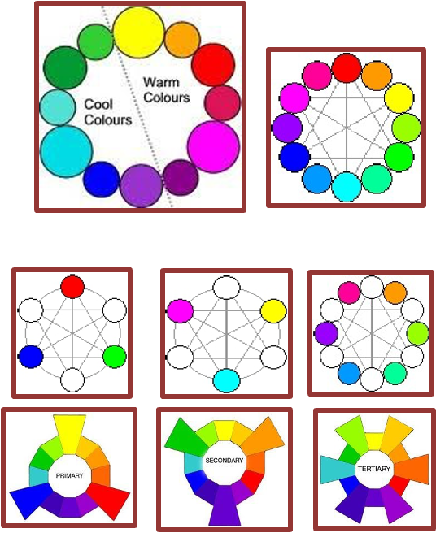          | 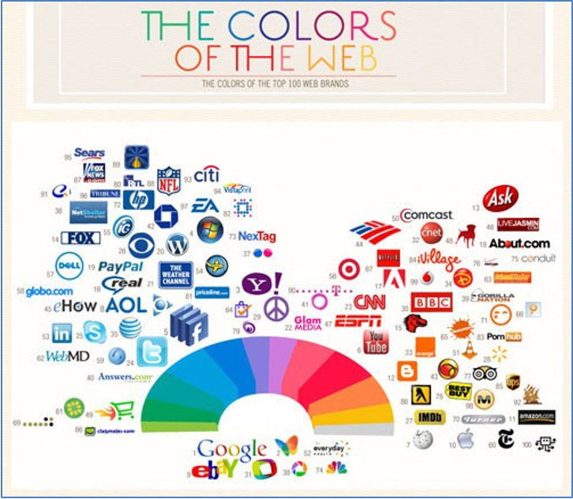                                                  |
| --------------------------------------------- | ------------------------------------------------------------------------------------- |
| https://www.colorsontheweb.com/colorwheel.asp | https://www.iwebsolutions.co.uk/blog/2010/10/the-most-powerful-colors-of-the-web/  |

---

|  | Make sure that you use colours appropriately to cover  all groups.      |
| ------------------------------------ | ----------------------------------------------------------------------- |
| 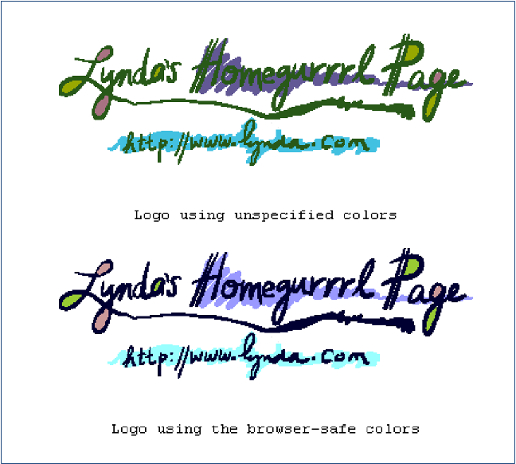 | 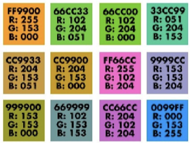 https://www.lynda.com/hexv.html |

---

| 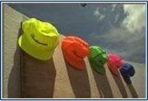 | 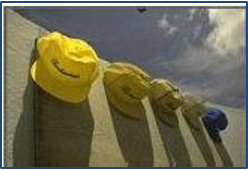                            | 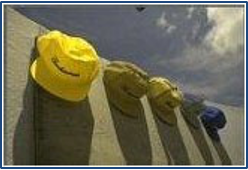                              |
| ------------------------------------ | --------------------------------------------------------------- | ----------------------------------------------------------------- |
| 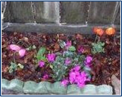 | 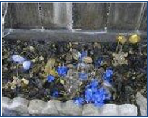                            | 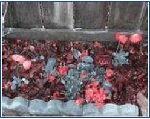                              |
|  |                             |                               |
| The world                            | How the world looks to a person with a red/green colour deficit | How the world looks to a person with a blue/yellow colour deficit |

### Graphics Audio and Video

|  | When creating graphics remember that the user’s display technology may not display the graphics and colours exactly as intended. When creating your own graphics for use on the web, consider using colours from the Web Palette |
| ------------------------------------ | ----------------------------------------------------------------------------------------------------------------------------------------------------------------------------------------------------------------------------------- |
|  | **Consider how your target audience will be accessing your site when adding audio and video clips to your site.**                                                                                                                   |
|  | **Use these elements only to support your site’s purpose and to satisfy your audience’s expectation for content at your site.**                                                                                                     |

## Site Structure

|  | The website structure should support the site’s purpose and make it easy for visitors to find what they want at the site in a few clicks as possible. |
| ------------------------------------ | ----------------------------------------------------------------------------------------------------------------------------------------------------- |

- Visualise the organisation of the site’s pages and linking relationship.
- Organise the pages by level of detail.
- Follow the links between pages to make certain visitors can quickly click through the site to find what they are looking for.
- Detect dead-end pages, pages that currently do not fit into the linking arrangement.
- Rearrange pages and revise linking relationships.

| Planning the site’s structure before you begin creating its pages has several benefits. | 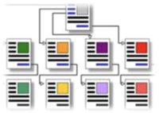 |
| --------------------------------------------------------------------------------------- | ------------------------------------ |

### Linear Structure

|  | A Linear structure organises and presents web pages in a specific order. It controls the navigation of the user by progressing them from one webpage to the next. |
| ------------------------------------ | -------------------------------------------------------------------------------------------------------------------------------------------------------------------- |

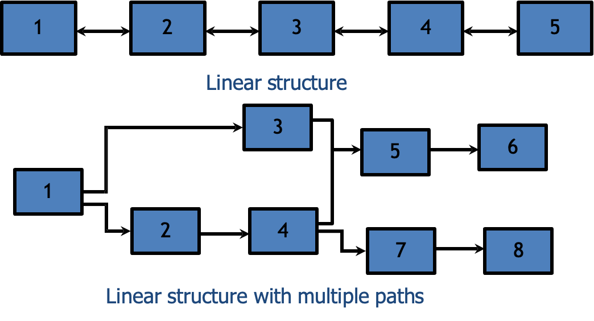

### Random Access Structure

|  | A random access site structure does not arrange its pages in a specific order. The visitor can choose any other web page according to their interests. |
| ------------------------------------ | --------------------------------------------------------------------------------------------------------------------------------------------------------- |

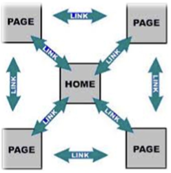

### Hierarchical Structure

|  | A hierarchical site structure  organises web pages into categorise and subcategories by increasing the level of detail. The visitor can choose web pages according to their needs. |
| ------------------------------------ | ------------------------------------------------------------------------------------------------------------------------------------------------------------------------------------- |

Some websites can have a combinational; linear and a hierarchical structure.

| 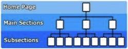 | 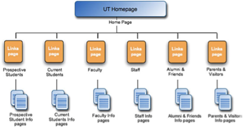 |
| ------------------------------------ | ------------------------------------ |

## Navigation

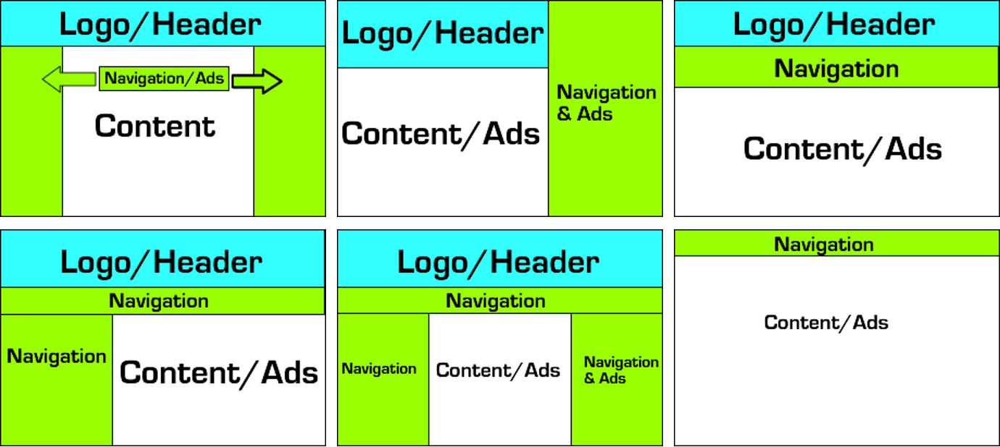
The structure of a webpage is an important factor to consider when designing a webpage, since it impacts the usability and over all look of the webpage.

### Start Designing...

|                                                                                                                                                    | Creating a successful website begins with developing a detailed plan. |
| -------------------------------------------------------------------------------------------------------------------------------------------------------------------------------------- | --------------------------------------------------------------------- |
| 'If you don't know where you're going, any road will do’ ——The White Rabbit, in 'Alice in Wonderland’ (Lewis Carrol) |                                   |

> “You have to have the idea before you can go to the computer or your work will lack authority. The way I do that is with a pencil, paper and stupid little drawings.”
> ——Jonathan Barnbrook,Typography

> “Design is a plan for arranging elements in such a way as best to accomplish a particular purpose.”
> ——Charles Eames

You can design in different ways
- Storyboard.
- Mockup.
- Wireframe.

| 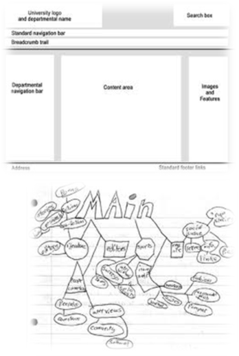 | 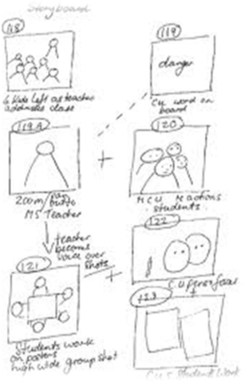 |
| ------------------------------------ | ------------------------------------ |

## Storyboard

|                                                                                                                                                         | “Creating a storyboard and defining the links between the pages gives you as the designer a "Big Picture" of your project and more confidence and speed (with less errors) during the actual design phase.” https://www.mediaworkshop.org/hses/criticalbasics01 |
| ------------------------------------------------------------------------------------------------------------------------------------------------------------------------------------------- | ------------------------------------------------------------------------------------------------------------------------------------------------------------------------------------------------------------------------------------------------------------------ |

| Outline Storyboard - Show the overall structure of the website, but no fine detail. Detailed Storyboard - Contain ALL the elements that the finished website should cover. | 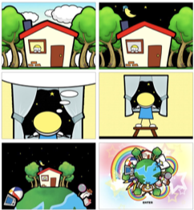 |
| --------------------------------------------------------------------------------------------------------------------------------------------------------------------------------------------------------------------------------------------------------------------------------------------------------------------------------------------------------------- | ------------------------------------ |

### Outline Storyboard

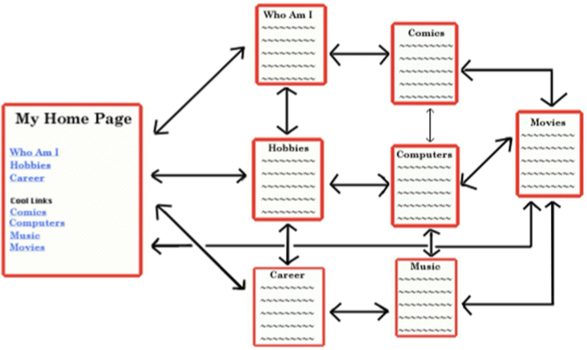

### Detailed Storyboard

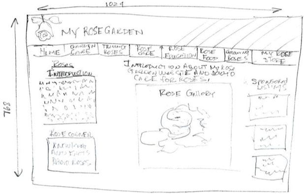

## Wireframe

|  | Wireframe mainly concerned with content organisation. |
| ------------------------------------ | ----------------------------------------------------- |

- Wireframe is a mock-up of a screen layout focusing on the organisation of content and navigation.
- Can be used for:
    - Screen sequences.
    - Order of items on menus.
    - Content organisation on screen.
    - Content organisation into sections.

| 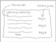 | 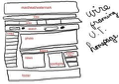 | 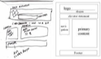 | 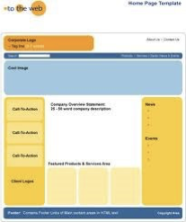 |
| ------------------------------------ | ------------------------------------ | ------------------------------------ | ------------------------------------ |

---

- They are simple line drawings.
- Aims to plan the page layout:
    - Where are you going to place page elements.
    - What are the sizes of these page elements.
    - Positioning global and local elements

- Wireframe should not include:
    - Colours to be used.
    - Fonts.
    - Graphics (pictures, backgrounds, etc.)
    - Branding (logo, slogan, etc.)

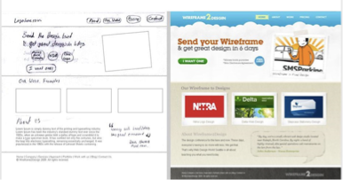

## Mockup

- A mockup is a static visual design draft of a design, used to represent the structure of information, visualise the content and demonstrate the basic functionalities in a static way.
- Mockups are created before actual design to finalised the layout of website, blog or landing page.

## Simplicity

> “If a design works without a certain design element, kill it”
> ——Nielsen 2000

Unnecessary design elements to your website will only make it harder for visitors to accomplish their task.

The simpler the design, the better.

In a study by Google in August of 2012, researchers found that not only will users judge websites as beautiful or not within 1/50th – 1/20th of a second, but also that “visually complex” websites are consistently rated as less beautiful than their simpler counterparts.

Minimalism (the use of basic design elements) is not necessarily the same as simplicity. Consider the tradeoff between making your page look too busy and complex, and making it hard to identify what the user can do.This often involves prior expectations.

---

| Why do website redesigns make us angry? https://www.telegraph.co.uk/technology/news/8940312/BBC-homepage-rage-why-do-website-redesigns-make-us-angry.html# Emma Barnett, Digital Media Editor |  |
| --------------------------------------------------------------------------------------------------------------------------------------------------------------------------------------------------- | ------------------------------------ |

- Humans are typically creatures of habit. We get into set patterns and quickly find ourselves attached to anything we regularly interact with – whether it is a favourite mug or indeed a website.
- Increasingly, as the web has become more socially-driven and interactive, people feel like they have an ownership stake over the sites they visit every day.
- This is why so many people \[felt\] the need to complain about the latest \[at that time\] major website makeover: the BBC homepage.
- However, despite people’s protestations that the new site makes them feel ‘dizzy’ and ‘sick’, the page’s design is unlikely to change.
- As is so often the case with many redesigns, a great deal of thought and research (and often money) has gone into a new look and feel. And although website owners, including the BBC, often ask for feedback while a new site is in the beta testing phase, rarely does it amount to much change.
