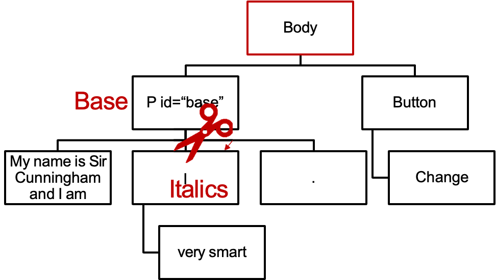
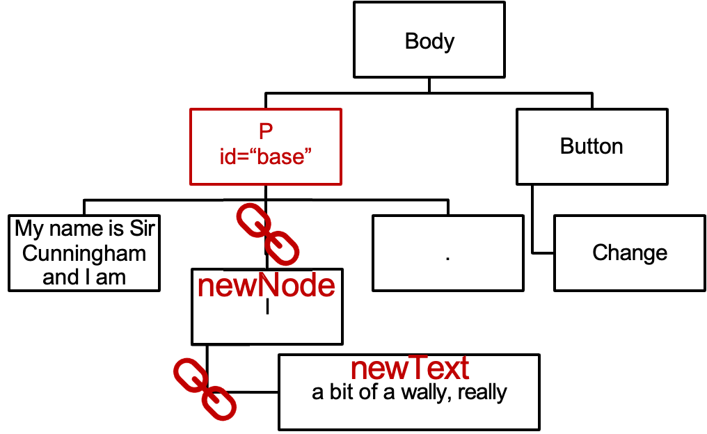

# The Document Object Model

- Last lecture you saw the basics of control flow programs in JavaScript.
- We now need to learn how to manipulate the <span style="color: red">web page</span> and <span style="color: red">browser</span> using JavaScript.
- This is done through a series of built-in objects. The specifications of these objects are called the DOM (Document Object Model) and BOM (Browser Object Model).
- The BOM is not officially standardised, although there are standards for most browsers. The DOM is standardised as part of HTML5.

## The Browser Object Model

- The Browser Object model covers all available data about 	the browser other than the actual page.
- It provides:
    - <span style="color: red">window</span>: holds all your declared variables. Also can get the size of the window (or tab). May be able to open or move windows but this functionality is often restricted. Also displays alerts and prompts and manages timing.
    - <span style="color: red">screen</span>: contains the height, width and color depth of the screen; however, these are better accessed elsewhere.
    - <span style="color: red">location</span>: accesses the entered web address.
    - <span style="color: red">history</span>: can simulate clicking Back and Forward on the browser. Cannot access previously visited URLs.
    - <span style="color: red">navigator</span>: identifies the browser and OS.

## Document Object

- The <span style="color: red">document</span> object is built based on the document object model.
- It provides access to a database of all other elements on the HTML page.
- When you extract an element from the database, it is returned in the form of an object, with properties and methods as appropriate for that type of element.
- By calling or changing these properties or methods, you can manipulate the element.

### Accessing the document

```html
<html>
    <head><title>Example</title></head>
    <body>
        
    </body>
</html>
```

This `img` element has the ID `menu`, so we can get a reference to it with `document.GetElementById("menu")`.

---

```html
<html>
    <head><title>Example</title></head>
    <body>
        <form name=“login”>
            <input ID=“username” type=text>
        </form>
    </body>
</html>
```

This `input` element has ID `username`, so we can get a reference to it with `document.GetElementById("username")`. IDs have to be unique across the whole document, so it does not matter that it is nested within a form.

---

```html
<html>
    <head><title>Example</title></head>
    <body>
        <form id="login">
            <input type=text>
        </form>
    </body>
</html>
```

You can also get all elements of a particular type.
Doing so returns a list, to allow for the possibility of there being more than one. 
```js
document.GetElementsByTagName("input")
```

> [!INFO] Note
> `id` is unique, but `class` and `tag` are not.
> 
> Only `GetElementsById` gets one element, others get collection.

## HTML tree

- The document object model is built in a <span style="color: red">tree</span> structure, as with the HTML document itself.
- Traditionally, positions in the tree are described using terms taken from <span style="color: red">family trees</span>, even though these are not always absolutely accurate.

### Accessing the document

```html
<html>
    <head><title>Example</title></head>
    <body>
        <p name="username">Username:</p>
        <form name="login">
            <input name="username" type="text">
        </form>
        <p name="password">Password:</p>
        <form name="login2">
            <input name="password" type="hidden">
        </form>
    </body>
</html>
```

---

```html {4}
<html>
    <head><title>Example</title></head>
    <body>
        <p name="username">Username:</p>
        <form name="login">
            <input name="username" type="text">
        </form>
        <p name="password">Password:</p>
        <form name="login2">
            <input name="password" type="hidden">
        </form>
    </body>
</html>
```

> This `p` element is a <span style="color: red">child</span> of the body.
> 
> The body is the <span style="color: red">parent</span> of the `p`.

> [!INFO] Note
> Tag `p` here still has child —— the text.

---

```html {6}
<html>
    <head><title>Example</title></head>
    <body>
        <p name="username">Username:</p>
        <form name="login">
            <input name="username" type="text">
        </form>
        <p name="password">Password:</p>
        <form name="login2">
            <input name="password" type="hidden">
        </form>
    </body>
</html>
```

> This input element is a <span style="color: red">child</span> of the form.
> 
> The form is the <span style="color: red">parent</span> of the input.
> 
> The body is <span style="color: red">not</span> the parent of the input.
> 
> The input is <span style="color: red">not</span> a child of the body.
> 
> The input and the form are <span style="color: red">not</span> siblings.

> The body is <span style="color: red">not</span> the parent of the input.
> 
> The body is the <span style="color: red">ancestor</span> of the input.
> 
> The input is <span style="color: red">not</span> a child of the body.
> 
> The input is the <span style="color: red">descendant</span> of the body.

---

> In the DOM, plain text is considered another form of child, in the same way that another element would be.
> 
> The text "username:" is a <span style="color: red">child</span> of the p element.

---

```html
<body>
    <p>
	    My name is <b>Bob</b> and I am
	    <i>here</i>.
    </p>
</body>
```

(This is why it is important to nest your elements correctly!)

---

```html
<html>
    <head><title>Example</title></head>
    <body>
        <div id="upper"><p>Hi!</p></div>
        <div id="lower"><p>Lo!</p></div>
    </body>
</html>
```

Calling `getElementsByTagName` on elements other than the top-level document will get only <span style="color: red">descendants</span> of that element.
`document.getElementById("upper").getElementsByTagName("p")` will get only the `p` tag containing "Hi!".

---

```html
<html>
    <head><title>Example</title></head>
    <body>
        <div class=“item”>Item 1</div>
        <div class=“item lite”>Item 2</div>
    </body>
</html>
```

You can also get lists of items based on their CSS style class. Any object which is a member of the named class will be included in the resulting list, even if it is a member of
other classes as well. 
```js
document.GetElementsByClassName("item")
```

## Finding HTML elements

- Ideally you should structure your HTML to make finding elements to be altered via JavaScript as easy as possible.
    - If one particular element needs to be found, give it an ID.
    - If one particular set of elements are manipulated together, make them the children of an element with a particular ID, or give them the same CSS class.

## Using Element Objects

- Once you have obtained an HTML element object you can store it in a variable:
```js
let top = document.getElementById(“main”);
```
- You can then call methods and properties on that object to alter the web page.
- You can also access other parts of the tree based on the element. Every element has these properties:
    - <span style="color: red">parentNode</span>: the parent element
    - <span style="color: red">childNodes</span>: an array of the child elements
    - <span style="color: red">firstChild</span>, <span style="color: red">lastChild</span>
    - <span style="color: red">nextSibling</span>, <span style="color: red">previousSibling</span>

## The DOM tree and CSS

- Although we did not mention it at the time, you can also use the DOM tree when writing CSS files.

- `nav {...}` Affects all nav elements
- `nav p {...}` Affects all `p` elements that are descendents of nav elements
- `nav > p {...}` Affects all `p` elements that are children of nav elements
- `nav ~ p {...}` Affects all `p` elements that are later siblings of nav elements

## Selector API

- You can also use CSS style specifications to obtain sets of elements in JavaScript.
- The function `document.querySelectorAll` can be called with a CSS-style selector as a string. It returns the list of all elements matching that selector.
- For example:
```js
let clickedLinks = document.querySelectorAll ("nav > a:visited");
```

## Manipulating element objects

- Once you have an element object, you can modify the object to modify the web page.
- The simplest case is <span style="color: red">changing an attribute</span>.
- For every attribute that an HTML element has <span style="color: red">or could legally have</span>, there will be a property on the element object which you can read or write.

### Accessing the document

```html {4}
<html>
    <head><title>Example</title></head>
    <body>
        
    </body>
</html>
```

This image has an attribute called `src`. If we 
```js
let ourMenu=document.getElementById("menu");
```
our `menu.src` will contain the string `menu.jpg`. The src attribute on an image specifies the filename of the image. So by changing this attribute in our script, we could alter the image, make it animate, etc.

---

```html {5}
<html>
    <head><title>Example</title></head>
    <body>
        <form id="login">
            <input id="username" type=text>
        </form>
    </body>
</html>
```

This element doesn’t have a <span style="color: red">value</span> attribute – but it is <span style="color: red">possible</span> for an HTML input element to have one. The rules of HTML specify that this attribute holds the contents of the element – ie, the text appearing within the input box. Thus, our JavaScript program can read this as 
```js
document.getElementById("username").value
```

---

```html {4}
<html>
    <head><title>Example</title></head>
    <body>
        <div id="one" class="moose">Moose!</div>
    </body>
</html>
```

You can alter the CSS attributes of an element by using its <span style="color: red">style</span> property. For example, to change the background color of this div, we can change
```js
document.getElementById("one").style.backgroundColor
```
Note that doing this is equivalent to inserting a <span style="color: red">style</span> attribute in the HTML that overrides that aspect of the class; other elements of class <span style="color: red">moose</span> will not be affected.

---

```html {4}
<html>
    <head><title>Example</title></head>
    <body>
        <div id="one" data-price="14.99">Our new product</div>
    </body>
</html>
```

HTML5 allows `data-` attributes to be used to store arbitrary data inline in an HTML5 file. The names of data attributes must begin with `data-` but thereafter may be anything.  
The values of these attributes can then be accessed, eg:
```js
document.getElementById("one").dataset.price
```

## Manipulating text and content

- You can change the entire content of a tag as text by altering its `innerHTML` property. However, this will overwrite everything inside the tag and force the browser to recalculate the DOM. It may be better to use fields.
- You can also manipulate the tree to alter the page directly by calling methods on an element object.

## Altering the HTML tree

```html
<body onLoad="start()">
    <p id="base">My name is Sir Cunningham and I am
    <i>very smart</i>.</p>
    <button onClick="change()">Change</button>
</body>
```


---

```js
function change() {
    let base=document.getElementById("base");
    let italics=base.getElementsByTagName("i")[0]; italics.remove();
    let newNode=document.createElement("i");
    let newText=document.createTextNode("a bit of a wally, really");
    newNode.appendChild(newText);
    base.insertBefore(newNode, base.lastChild);
}
```

---

```js
let base=document.getElementById("base");
let italics=base.getElementsByTagName("i")[0];
italics.remove();
```



---

```js
let newNode=document.createElement("i");
let newText=document.createTextNode("a bit of a wally, really");
newNode.appendChild(newText);
base.insertBefore(newNode, base.lastChild);
```


