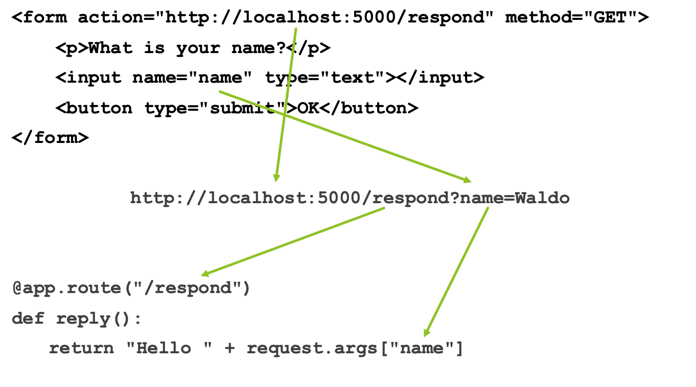
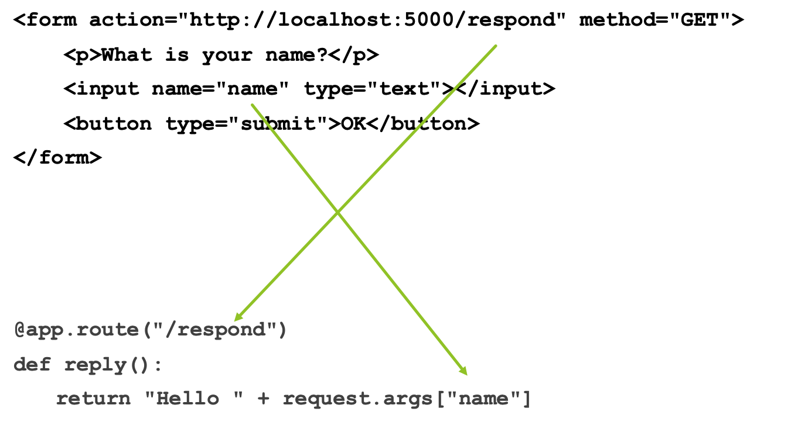

# Flask and Web Server Programming

## Web Server Development

- Standard web servers served content from a file - called static content
- When we develop server-side apps, we instead serve content based on the result of running a program - called dynamic content
- This allows the website to deliver varying responses to user requests and to update data on the server in response to requests
- Methods for integrating the program with the server were discussed in the first lecture.

## Web Server Languages and Frameworks

- C, Perl: originally used before the development of web scripting languages. No longer popular
- PHP: scripting language that evolved from a standard format for personal home pages. One of the first server languages made for the web, so extremely well adapted for it, but has some issues with security and language design
- Java: well established language with multiple web server projects and strong commercial-level support.

---

- Ruby: contemporary with PHP as a web language, most known for the Ruby On Rails framework for producing database backed sites. But has some scalability issues
- C# / .NET: languages tightly integrated with Microsoft web servers and again with very strong commercial support
- Python: friendlier language than Perl and had features making it more adaptable for web based programming; rapidly increasing in popularity, although still behind Java.

## Python Integration

- Python programs can integrate with web servers using a standard interface called WSGI
- WSGI can allow any Python program to produce output for the web. But additional libraries are available to simplify and standardise the process of writing Python web applications
- On this module we will use the Flask library, which also integrates Jinja2, a templating system.

## A basic Flask program

```python
from flask import Flask
app = Flask(__name__)
@app.route('/')
def hello_world():
    return 'Hello, World!'
```

---

```python
from flask import Flask
app = Flask(__name__)
```

- Loads the Flask library, then tells Flask to read your code to integrate with the web server.
- Note: no main function or method, and no code outside functions. This is correct (unless you need to initialize globals). Your program effectively becomes a library that is used by the web server to satisfy certain calls, and so has no main program in itself.

---

```python
@app.route('/')
def hello_world():
    return 'Hello, World!'
```

- Functions are specified in the usual Python way.
- `@app.route` is an annotation. It means that when Flask reads your file it will create a connection to that function in the object it passes to the web server.
- `/` is the route to the function; that is, the URL (or part of the URL) that will cause the function to run.

---

```python
@app.route('/goodbye')
def goodbye():
    return 'Goodbye!'
```

- A single Flask file can respond to multiple routes by running different functions.
- Note that the presence or absence of a `/` at the end of the route is important. Accessing `/goodbye/` will not run the function above, and will give an error.
- Python functions without a route will not run in response to web requests, but can be called from other functions that do, in the normal way.

## Running Flask programs

- Because Flask programs have to be called from a web server, you can’t run them in IDLE or in the normal way
- Flask provides a simple local-only web server to use for testing your code
- To run this, you must enter the following at a command line:

```console
set FLASK_APP=<name of your Python file>
set FLASK_ENV=development
flask run or python -m flask run
```

- This will create the server and a local server address. To run your function, visit that address (and the appropriate route) in a web browser.

## Routes

```python
@app.route('/')
```

- When you use the built-in Flask server, it exists only to test your web app. So the route `/` will match the root URL on whatever the test server is (usually http://localhost:5000/ )
- On a real web server, the server performs its own routing first. It has to be configured internally to tell it which requests should be sent to your Flask program (and which Flask program, as there could be several). This is done by modifying values inside the server configuration file, which depends on the server program being used

## Routes and the web server

- A typical web server will match a URL on a web server to a Flask file. 
- The route in the Flask file is then treated as a subpath of that route.
- For example, if file myApp.py is routed to server path `/interact`, then a function with `@app.route('/')` would be accessed at http://server/interact/ ; a function with `@app.route('/test')` would be accessed at http://server/interact/test .

## Taking input in a web app

- A web server application can’t ask the user for input directly; it must serve a complete response to a request then stop.
- Input must thus be included in that request. This can be done in three ways. 
    - In form parameters (`POST` parameters): must be set up by a form on a linking web page or by JavaScript. Invisible to the user. 
    - Flexible but harder to test and difficult to share between users.
    - In URL arguments (`GET` parameters): can be set by forms, scripts, or by the user. Visible to the user and can be shared, but harder to read.
    - In the URL itself: can be set only by scripts or the user. Easy for users to understand and share, but has more restrictions.

### Taking input: GET

```html
<form action="http://localhost:5000/respond" method="GET">
    <p>What is your name?</p>
    <input name="name" type="text"></input>
    <button type="submit">OK</button>
</form>
```

↓

```
http://localhost:5000/respond?name=Waldo
```

↓

```python
@app.route("/respond")
def reply():
    return "Hello " + request.args.get("name")
```

---



---



### Taking input: POST

```html
<form action="http://localhost:5000/respond" method="POST">
    <p>What is your name?</p>
    <input name="name" type="text"></input>
    <button type="submit">OK</button>
</form>
```

↓

```
http://localhost:5000/respond (+headers)
```

↓

```python
@app.route("/respond")
def reply():
    return "Hello " + request.form["name"]
```

---

```
http://localhost:5000/respond/Waldo (+headers)
```

↓

```python
@app.route("/respond/<name>")
def reply(name):
    return "Hello " + name
```

## Input through JavaScript

- JavaScript can redirect the page to another page with `GET` parameters, or a custom URL.
- JavaScript cannot set `POST` parameters except when making async requests (we will look at these later)
- These should be set through forms. If necessary, you can create an invisible hidden form, set its fields and then call the `submit()` function on the form element from JavaScript

## Checking for input

- Note that if you attempt to access `args[]` or `form[]` for a value that does not exist, your script will give an error, which will result in an “internal server error” being sent to the client.
- These structures are Python `dicts`, and so you should check for membership in the normal way you would for a dict. 
- Remember that users, especially hackers, can forge requests. Always treat input from the web as radioactive
- When using an in-URL parameter, the route will not match if the parameter is empty.
