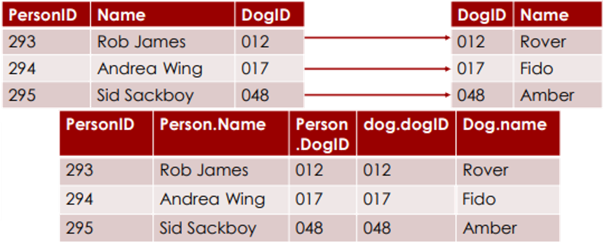
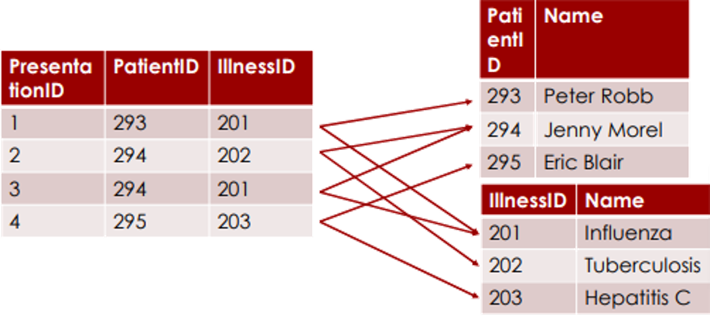
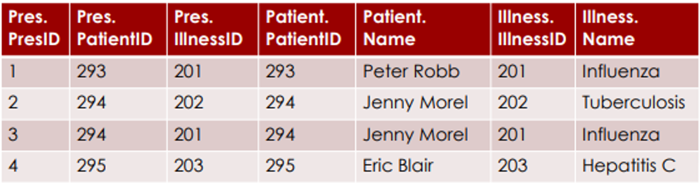

# Databases and SQL

## Databases and web applications

- Technically, a web application can use any method of storing persistent data that you would normally use (saving to files, etc)
- However, standard database servers offer a wide range of useful functionality and are also designed for efficiency, reliability and (in particular) scalability. They are also well supported by web and database hosting services.
- Using a full database server on a desktop or client app is not usually a good option because the end user probably would not want to install one just to run your app. But when writing a web app that runs on its own server or server farm, this is no longer an issue.

## Relational Database

| CarReg  | Make    | Model | Colour | Year |
| ------- | ------- | ----- | ------ | ---- |
| AB02ERT | Peugeot | 206   | Silver | 2002 |
| AG51DRT | Ford    | Focus | Green  | 2001 |

- A collection of tables similar to the one above

---

<table style="font-family: Arial, sans-serif; font-size: 16px;">
  <tr style="border-collapse: collapse;">
    <th style="border: 1px solid; padding: 8px 12px; text-align: left;">CarReg</th>
    <th style="border: 1px solid; padding: 8px 12px; text-align: left;">Make</th>
    <th style="border: 1px solid; padding: 8px 12px; text-align: left;">Model</th>
    <th style="border: 1px solid; padding: 8px 12px; text-align: left;">Colour</th>
    <th style="border: 1px solid; padding: 8px 12px; text-align: left;">Year</th>
  </tr>
  <tr>
    <td style="border-left: 2px solid red; border-top: 2px solid red; padding: 8px 12px;">AB02ERT</td>
    <td style="border-top: 2px solid red; padding: 8px 12px;">Peugeot</td>
    <td style="border-top: 2px solid red; padding: 8px 12px;">206</td>
    <td style="border-top: 2px solid red; padding: 8px 12px;">Silver</td>
    <td style="border-right: 2px solid red; border-top: 2px solid red; padding: 8px 12px;">2002</td>
  </tr>
  <tr>
    <td style="border-left: 2px solid red; border-top: 2px solid red; border-bottom: 2px solid red; padding: 8px 12px;">AG51DRT</td>
    <td style="border-top: 2px solid red; border-bottom: 2px solid red; padding: 8px 12px;">Ford</td>
    <td style="border-top: 2px solid red; border-bottom: 2px solid red; padding: 8px 12px;">Focus</td>
    <td style="border-top: 2px solid red; border-bottom: 2px solid red; padding: 8px 12px;">Green</td>
    <td style="border-right: 2px solid red; border-top: 2px solid red; border-bottom: 2px solid red; padding: 8px 12px;">2001</td>
  </tr>
</table>

<span style="color: red">Records</span> or <span style="color: red">Rows</span>

---

<table style="border-collapse: separate; border-spacing: 0; font-family: Arial, sans-serif; font-size: 16px; border: 1px solid black;">
  <!-- 表头行 -->
  <tr>
    <th style="border: solid black; padding: 8px 12px; text-align: left; margin: 0;">CarReg</th>
    <th style="border: solid black; padding: 8px 12px; text-align: left; margin: 0;">Make</th>
    <th style="border: solid black; padding: 8px 12px; text-align: left; margin: 0;">Model</th>
    <th style="border: solid black; padding: 8px 12px; text-align: left; margin: 0;">Colour</th>
    <th style="border: solid black; padding: 8px 12px; text-align: left; margin: 0;">Year</th>
  </tr>
  <!-- 第一行数据 -->
  <tr>
    <td style="border: 3px solid red; padding: 8px 12px; margin: 0;">AB02ERT</td>
    <td style="border: 3px solid red; padding: 8px 12px; margin: 0;">Peugeot</td>
    <td style="border: 3px solid red; padding: 8px 12px; margin: 0;">206</td>
    <td style="border: 3px solid red; padding: 8px 12px; margin: 0;">Silver</td>
    <td style="border: 3px solid red; padding: 8px 12px; margin: 0;">2002</td>
  </tr>
  <!-- 第二行数据 -->
  <tr>
    <td style="border: 3px solid red; border-top: none; padding: 8px 12px; margin: 0;">AG51DRT</td>
    <td style="border: 3px solid red; border-top: none; padding: 8px 12px; margin: 0;">Ford</td>
    <td style="border: 3px solid red; border-top: none; padding: 8px 12px; margin: 0;">Focus</td>
    <td style="border: 3px solid red; border-top: none; padding: 8px 12px; margin: 0;">Green</td>
    <td style="border: 3px solid red; border-top: none; padding: 8px 12px; margin: 0;">2001</td>
  </tr>
</table>

<span style="color: red">Fields</span> or <span style="color: red">Columns</span>

---

The Primary Key is a value that is different for every value in the database. In this case, the Car Registration is suitable because no two cars can have the same registration. If the real entities do not have any applicable value to be a primary key, we can make one up. In a large database it might be better to use a numeric type is a primary key, because they are more efficiently stored.

## Other terminology

- Report – a human-readable document generated from data in a database.
- SQL – the standard computer language used to communicate with the DBMS.
- Index – an extra set of data stored in the database to speed up searches on a field.
- Entity – a real life object about which data is stored.
- Query – a question asked to a database.

### An Example Data Dictionary

<table style="border-collapse: collapse; font-family: Arial, sans-serif; font-size: 14px; width: auto; border: 1px solid orange;">
  <!-- 表头行 -->
  <tr>
    <th style="border: 1px solid #FF7F50; padding: 8px 10px; text-align: left; font-weight: bold;">Attribute</th>
    <th style="border: 1px solid #FF7F50; padding: 8px 10px; text-align: left; font-weight: bold;">Data Type</th>
    <th style="border: 1px solid #FF7F50; padding: 8px 10px; text-align: left; font-weight: bold;">Field Size</th>
    <th style="border: 1px solid #FF7F50; padding: 8px 10px; text-align: left; font-weight: bold;">Required?</th>
    <th style="border: 1px solid #FF7F50; padding: 8px 10px; text-align: left; font-weight: bold;">Format</th>
  </tr>
  <!-- Surname行 -->
  <tr>
    <td style="border: 1px solid #FF7F50; padding: 8px 10px;">Surname</td>
    <td style="border: 1px solid #FF7F50; padding: 8px 10px;">Text</td>
    <td style="border: 1px solid #FF7F50; padding: 8px 10px;">25</td>
    <td style="border: 1px solid #FF7F50; padding: 8px 10px;">Yes</td>
    <td style="border: 1px solid #FF7F50; padding: 8px 10px;"></td>
  </tr>
  <!-- First Name行 -->
  <tr>
    <td style="border: 1px solid #FF7F50; padding: 8px 10px;">First Name</td>
    <td style="border: 1px solid #FF7F50; padding: 8px 10px;">Text</td>
    <td style="border: 1px solid #FF7F50; padding: 8px 10px;">15</td>
    <td style="border: 1px solid #FF7F50; padding: 8px 10px;">No</td>
    <td style="border: 1px solid #FF7F50; padding: 8px 10px;"></td>
  </tr>
  <!-- Title行（跨行） -->
  <tr>
    <td style="border: 1px solid #FF7F50; padding: 8px 10px; vertical-align: top;">Title</td>
    <td style="border: 1px solid #FF7F50; padding: 8px 10px; vertical-align: top;">Text</td>
    <td style="border: 1px solid #FF7F50; padding: 8px 10px; vertical-align: top;">6</td>
    <td style="border: 1px solid #FF7F50; padding: 8px 10px; vertical-align: top;">Yes</td>
    <td style="border: 1px solid #FF7F50; padding: 8px 10px; line-height: 1.5;">Mr, Ms,<br>Mrs, Miss,<br>Dr, Rev</td>
  </tr>
  <!-- Street行 -->
  <tr>
    <td style="border: 1px solid #FF7F50; padding: 8px 10px;">Street</td>
    <td style="border: 1px solid #FF7F50; padding: 8px 10px;">Text</td>
    <td style="border: 1px solid #FF7F50; padding: 8px 10px;">20</td>
    <td style="border: 1px solid #FF7F50; padding: 8px 10px;">Yes</td>
    <td style="border: 1px solid #FF7F50; padding: 8px 10px;"></td>
  </tr>
  <!-- Town行 -->
  <tr>
    <td style="border: 1px solid #FF7F50; padding: 8px 10px;">Town</td>
    <td style="border: 1px solid #FF7F50; padding: 8px 10px;">Text</td>
    <td style="border: 1px solid #FF7F50; padding: 8px 10px;">20</td>
    <td style="border: 1px solid #FF7F50; padding: 8px 10px;">Yes</td>
    <td style="border: 1px solid #FF7F50; padding: 8px 10px;"></td>
  </tr>
  <!-- Post Code行 -->
  <tr>
    <td style="border: 1px solid #FF7F50; padding: 8px 10px;">Post Code</td>
    <td style="border: 1px solid #FF7F50; padding: 8px 10px;">Text</td>
    <td style="border: 1px solid #FF7F50; padding: 8px 10px;">8</td>
    <td style="border: 1px solid #FF7F50; padding: 8px 10px;">No</td>
    <td style="border: 1px solid #FF7F50; padding: 8px 10px;">LLNN NNLL</td>
  </tr>
  <!-- Tel. No.行（跨行） -->
  <tr>
    <td style="border: 1px solid #FF7F50; padding: 8px 10px; vertical-align: top;">Tel. No.</td>
    <td style="border: 1px solid #FF7F50; padding: 8px 10px; vertical-align: top;">Text</td>
    <td style="border: 1px solid #FF7F50; padding: 8px 10px; vertical-align: top;">15</td>
    <td style="border: 1px solid #FF7F50; padding: 8px 10px; vertical-align: top;">No</td>
    <td style="border: 1px solid #FF7F50; padding: 8px 10px; line-height: 1.5;">(STD Code) - number</td>
  </tr>
</table>

## Relationship

- A relationship is a link or association between entities
- Represented by matching values in multiple tables

---

- One-to-one:
    - One Husband has One Wife
    - One Wife has One Husband
- One-to-many
    - One Mother has Many Children
    - One Child has One Mother
- Many-to-many
    - One Student studies Many Courses
    - One Course is studied by Many Students 

### Entity-Relationship Diagrams


- Specify both degree and name of relationship

---

One-to-one


One-to-many


Many-to-many


---


The name of a relationship helps to establish its degree

---


The name of a relationship helps to establish its degree

---


Many-to-many relationship

### Representing a One-to-one relationship

- Store the primary key for each table in the other
- When stored in this way, value is called a foreign key

| PersonID | Name        | DogID |
| -------- | ----------- | ----- |
| 293      | Rob James   | 012   |
| 294      | Andrea Wing | 017   |
| 295      | Sid Sackboy | 048   |

|DogID|Name|
|---|---|
|012|Rover|
|017|Fido|
|048|Amber|

#### Querying a one-to-one relationship

- What is the name of Rob James’ dog?
    - Search Person table for Rob James
    - Store DogID value from that person record
    - Look up this DogID in dog table
    - Collect Name value from that dog record
- Who owns Rover?
    - Look up Rover in dog table
    - Store DogID of Rover
    - Search person table for this DogID
    - Collect Name value from the person record

#### Other representations

- While it would be OK to add a PersonID field to the Dog table,to easily find who owns a dog, indexing the Person table byDogID has the same effect and removes risk of desyncing
- We could also store the name of the person’s dog in the same table as the name of the person: whether or not this is a good idea depends on how many of the people in the database have dogs and what purposes the table is used for

### Representing a One-to many relationship

- Similar to a one-to-one relationship, but foreign ID values 

|PatientID|Name|WardID|
|---|---|---|
|293|Peter Robb|012|
|294|Jenny Morel|014|
|295|Eric Blair|012|

|WardID|Name|
|---|---|
|012|General|
|013|Triage|
|014|Presurgery|

#### Querying a one-to-many relationship

- Which ward is Jenny Morel in?
    - Search Patient table for Jenny Morel
    - Store WardID value from that patient record
    - Look up this WardID in ward table
    - Collect Name value from that ward record
- Who is in the general ward?
    - Look up General in ward table
    - Store WardID of General ward
    - Search patient table for this WardID
    - Collect multiple name values from the patient records

#### Other representations

- We now cannot add a PatientID field to the Ward table since a ward may hold several patients
- We should not store the name of a patient’s ward in their Patient record since an identical ward name (and any other data about the ward) would be stored once for each patient, wasting space in the database and risking desync

### Many to Many relationships

- Representing a many-to-many relationship without wasting database space is difficult
- A new table (link table or link entity) must be created to remove the many-to-many relationship
- Each record in the link table represents a connection between two entries in the connected tables

#### Removing many-to-many


- One patient has many illnesses
- One illness can affect many patients

---


- One patient has many presentations
- Each presentation is for one patient

- One illness has many presentations
- Each presentation is for one illness

#### Representing a normalized many-to-many relationship

<div>
<div style="display: flex; gap: 30px; margin-bottom: 20px;">
  <!-- 第一个表格：患者表 -->
  <table border="1" cellpadding="6" cellspacing="0">
    <tr>
      <th>PatientID</th>
      <th>Name</th>
    </tr>
    <tr>
      <td>293</td>
      <td>Peter Robb</td>
    </tr>
    <tr>
      <td>294</td>
      <td>Jenny Morel</td>
    </tr>
    <tr>
      <td>295</td>
      <td>Eric Blair</td>
    </tr>
  </table>
  <!-- 第二个表格：疾病表 -->
  <table border="1" cellpadding="6" cellspacing="0">
    <tr>
      <th>IllnessID</th>
      <th>Name</th>
    </tr>
    <tr>
      <td>201</td>
      <td>Influenza</td>
    </tr>
    <tr>
      <td>202</td>
      <td>Tuberculosis</td>
    </tr>
    <tr>
      <td>203</td>
      <td>Hepatitis C</td>
    </tr>
  </table>
</div>
<!-- 第三个表格：就诊关联表（单独一行） -->
<table border="1" cellpadding="6" cellspacing="0">
  <tr>
    <th>PresentationID</th>
    <th>PatientID</th>
    <th>IllnessID</th>
  </tr>
  <tr>
    <td>1</td>
    <td>293</td>
    <td>201</td>
  </tr>
  <tr>
    <td>2</td>
    <td>294</td>
    <td>202</td>
  </tr>
  <tr>
    <td>3</td>
    <td>294</td>
    <td>201</td>
  </tr>
  <tr>
    <td>4</td>
    <td>295</td>
    <td>203</td>
  </tr>
</table>
</div>

#### Querying a normalized many-to-many relationship

- What illnesses is Jenny Morel presenting?
    - Search patient table for Jenny Morel
    - Store her PatientID
    - Search Presentation table for this PatientID
    - Store a list of all matching IllnessIDs
    - Look each of these up in Illness table
    - Collect the name of each

## Structured Query Language (SQL)

- A standard language used to extract data from a database, used by almost all modern DBMSs
- Key commands for queries:
    - SELECT
    - FROM
    - WHERE
    - ORDER BY

---

- To create a table
```sql
CREATE TABLE <NAME> <DATA DICTIONARY>
```
- To insert data
```sql
INSERT INTO <TABLENAME> <FIELDS>
VALUES <CORRESPONDING VALUES>
```

### Create Table

```sql
create table customer(
    customerID int not null primary key,
    firstName varchar(20),
    lastName varchar(20),
    dateOfBirth date);
```

---

```sql
create table car(
    carReg char(8) not null primary key,
    make varchar(20),
    model varchar(20),
    yearOfReg smallint unsigned);
```

### MySQL types

| Name                                      | Type                                                                                                                          |
| ----------------------------------------- | ----------------------------------------------------------------------------------------------------------------------------- |
| TINYINT, SMALLINT, MEDIUMINT, INT, BIGINT | 8, 16, 24, 32, and 64 bit int (like Java BYTE, SHORT, ..., INT, LONG)                                                         |
| DECIMAL(x,y)                              | Fixed point value with x significant digits and y after the decimal point                                                     |
| FLOAT, DOUBLE                             | 32 and 64 bit floating point (like Java FLOAT and DOUBLE)                                                                     |
| DATE, DATETIME, TIME                      | Standard values for date and time                                                                                             |
| CHAR(x)                                   | String up to x characters, allocating x characters of space. Use for known lengths or changing strings                        |
| VARCHAR(x)                                | String up to x characters, dynamically allocated. Use for variable lengths, ideally that do not change or do not change often |

#### MySQL type modifiers

|Name|Type|
|---|---|
|UNSIGNED|Makes an int value unsigned in the same way as Java|
|AUTO_INCREMENT|Default to one larger than the highest current value in the table|
|NOT NULL|Column must be filled in. Needed for indexes to be generated|
|UNIQUE|Column value must not be duplicated in table|
|PRIMARY KEY|Column value is primary key; implies UNIQUE|

### INSERT INTO

```sql
INSERT INTO car
	(carReg, make, model, yearOfReg)
Values
	("MF59 YXS","Hyundai","i20",2009);
```

Listing the fields in the INSERT INTO statement is not mandatory, but avoids errors if other columns are later added to the table.

### SELECT...FROM...WHERE

```sql
SELECT CarReg, Make
FROM Car
WHERE YearOfReg=2009;
```

### Creating a reference

```sql
Create table person (
    personID int unsigned not null primary key,
    name varchar(40),
    dogID int unsigned not null);
Create table dog (
    dogID int unsigned not null primary key,
    name varchar(40));
```

### Using a reference

```sql
Select person.name, dog.name
    From person inner join dog
        On person.dogID = dog.dogID;
```



#### Using a many-to-many reference

```sql
Select patient.name, illness.name
From presentation
inner join patient on presentation.patientID = patient.patientID
inner join illness on presentation.illnessID = illness.illnessID;
```




## Using MySQL from Python

- import the MySQL connector

```python
import sql.connector
```

- Connect to the database:

```python
cnx = mysql.connector.connect(user='dbuser', password='rubbish', host='127.0.0.1', database='dogs')
```

- Note that the database must already exist (a database is not the same as a table)
- Because the password must appear in the Python script, it is important that scripts are kept secure

### Sending queries

- Create a cursor (an object used for a series of database interactions)

```python
cursor = cnx.cursor() 
```

- Send a query via the cursor

```python
cursor.execute(“select dogid, name from dog”)
```

- The cursor then becomes a Python iterator which you can loop through to read the results

```python
for (dogid, name) in cursor:
    print (dogid, name) 
```

### Sending definitions/commands

- Send the command via the cursor

```python
cursor.execute(“INSERT INTO CAR (carReg, make, model, YearOfReg) VALUES (‘AB2 3CD’, ’Vauxhall’, ’Labrador’,2005)”)
```

- Commit changes to the database

```python
cnx.commit()
```

- Close the database before your program ends

```python
cnx.close()
```

### Security

- Be very careful about using strings input from the user in SQL commands
- This is a very easy route for hackers to damage the database. <br>SQL injection is among the <span style="color: red">most common attacks</span> on sites!
- For example:

```python
for row in c.execute("SELECT ID FROM person WHERE name = " + request.form["name"] + ";"):
	print row
```

- What happens if a hacker fakes the form, and sends the string "x";

`select password as ID from users` as the name form field?

#### Security: query templating

- To avoid this, use query templates instead of raw string modification to build query strings

```python
query = "Select id from person where name=%s;"
c.execute(query,("Robert",))
```

- `%s` in the query string marks where a value is to be inserted. More than one can be used.
- The execute statement fills in the values for insertion. They will only be allowed to be inserted as data values, not commands
- Note:
    - `%s` is the only marker supported. It is used even if the value is a number (unlike C or pyformat)
    - If there is only one value to be filled in, the extra comma is mandatory to force Python to see the value as a tuple with one element
