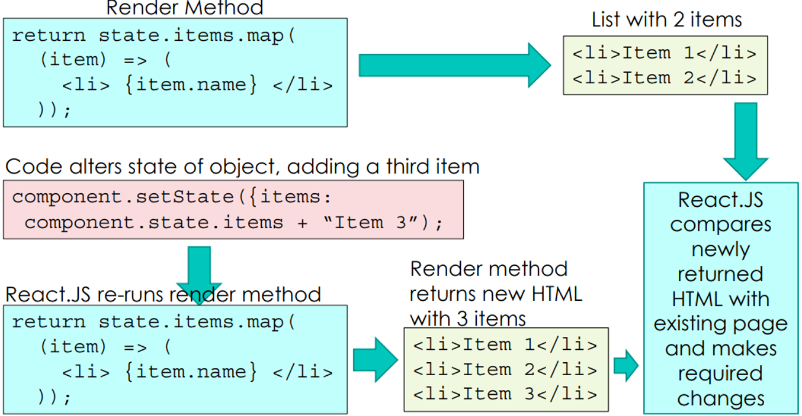

# jQuery and JavaScript frameworks

## JavaScript support

- Since JavaScript is effectively the only complete language for writing web clients, a great deal of effort has been put into support material for it.
- <span style="color: red">Libraries</span> provide sets of standard functions implemented using browser-independent and established methods.
- <span style="color: red">Frameworks</span> provide alternative ways of assembling and preprocessing JavaScript code to build code with complex standard functionality.
- <span style="color: red">JavaScript supersets</span> provide actual language extensions to JavaScript which are converted to standard JavaScript by another program before being placed in web pages
- <span style="color: red">Languages compiling to JavaScript</span> allow web scripts to be written in entirely different languages

## jQuery

- One of the first and best-known JavaScript libraries
- Some of the functions jQuery provides have been added to JavaScript/ECMAscript itself in later versions. jQuery’s versions are still usable, as they will call the built-in version on browsers that support it, or use the old jQuery version on those that don’t
### Including jQuery

- You can download jQuery for free from jquery.com/download
- There are several versions: the “compressed” and “uncompressed” versions. The compressed version has tiny variable names and compressed lines to minimize the time taken for the browser to load it. Unless you are debugging jQuery itself you should probably use it.
- Add the jQuery library to your web app (in the static directory if appropriate) and include it via<br>`<script src="jquery.min.js"></script>`

## jQuery

- The primary function of jQuery is to simplify the process of writing code to update the content of web pages via the DOM.
- The main functions it provides are:
    - The ability to use CSS selectors easily to select parts of the page to change (this was added to JavaScript later via <span style="color: red">querySelectorAll</span>)
    - The ability to change all matching parts of a web page in similar ways without writing a loop or higher order call every time
    - Easy function-based adjustment of attributes and conversion of values to attribute types

## CSS selectors (recap)

| Selector             | Meaning                                                                            |
| -------------------- | ---------------------------------------------------------------------------------- |
| `p`                  | All elements of type p.                                                            |
| `.highlight`         | All elements with class highlight.                                                 |
| `p.highlight`        | All elements of type p with class highlight                                        |
| `#banner`            | Element with ID banner                                                             |
| `p b`                | All b descendents of p elements                                                    |
| `p > b`              | All b children of p elements                                                       |
| `#banner>.highlight` | All elements with class highlight that are children of the element with ID banner. |

> See lecture 4 for DOM element relation terminology. See https://www.w3schools.com/cssref/css_selectors.asp for full reference.

## jQuery DOM updates

- jQuery provides a function named `$` (to shorten code that uses it) which, called with a CSS selector, returns an object representing all elements that match that selector.
- You can then call the methods of this object to read or update attributes or contents of the element(s) in question.
- If the selector matches more than one element, then:
    - Update methods affect all elements matched. There is no need to write a loop.
    - Read methods return the data for the first element matched. Depending on how your page is organized, this may be the same for all elements, but jQuery does not check this.

### jQuery benefits example

- To turn all text in `p` elements, throughout the document, red:
- Without jQuery:

```javascript
for (let x of document.getElementsByTagName("p")) {
		x.style.color = "red";
}

// document.querySelectorAll("#id")
// document.getElementById("id")
```

- With jQuery:

```javascript
$("p").css("color","red")

// $("#id")
```

---

- Most can be called in several ways:
- with one parameter, they read the given attribute for the first item in the selected set, eg `css("color")`
- with two parameters, where the second is a value: they set the given attribute for all items in the set, eg `css("color", "red")`
- with two parameters, where the second is a function: they call the function on the index number of the item in the set, and the existing attribute value for that item, and store the value it returns in the attribute
- Most also return the value they were invoked on, allowing a series of method calls to be chained into a single command.
- You can run a lower level selector query (to find items which are a subset of an existing found set) using the method `.find()`.

## Methods on jQuery objects

- `.attr(…)` manipulates DOM attributes (IDs, names, links, enabled/disabled, etc..).
- `.prop(…)` manipulates DOM **properties**. These are distinguished from attributes by whether or not their standard representations are in the HTML or not.
    - Eg, form input **values** like the value of a text box, or the **checked** status of a checkbox, should be accessed with `prop()`. Although they can appear in the HTML, those are only initial values; the real values can be changed by the user and then no longer tie directly to the HTML file.
- `.css(…)` manipulates CSS attributes (color, width, height, position, etc..)
- `.data(…)` allows arbitrary data to be stored about elements in jQuery. (This is not the same as the HTML5 data- attributes.

---

- Certain frequently used values, or ones harder to work with, have their own special functions.
- `.val()`: value of form field (as property).
- `.height()`, `.innerHeight()`, `.outerHeight()`, .`width()`, `innerWidth()`, `.outerWidth()`: access width or height values allowing for changes caused by computation, and as pixel sizes as integers (when accessed directly in CSS they are strings that contain unit indicators)
- `.position()`, `.offset()`: access both x and y position values as dicts with two elements, already converted to pixel sizes as integers. `.position()` returns relative to the containing elements. `.offset()` returns relative to the entire document.

## Manipulating jQuery events

- You can add an event handler to an object in jQuery by calling the method .on eg, `$("button").on("click",x => window.alert("Click! "));`
- There are also a large number of convenience methods for commonly used events, eg `.click()`, `.change()`, `.focus()`…
- Unlike setting the `onClick` attribute, this adds an event handler. Previous event handlers are not removed. This allows different parts of your script to "stack" event handlers on elements.
- If you want to remove event handlers, use the corresponding method `.off()`.

## The ready event

- When using jQuery, if you want code to run as soon as the page is loaded, you should use jQuery’s ready event handler which has a custom syntax.

```javascript
$(x => { …. });
```

- jQuery will run your code as soon as the DOM and page are fully loaded and jQuery is set up. If this happens so quickly that it has already occurred by the time the `$()` command runs, it will run it immediately

## Removing elements

- `.detach()` removes the set of elements from the page, but keeps their data around so they can be reinserted.
- `.remove()` removes the set of elements from the page and erases their data. 
- `.empty()` removes all descendants of all elements in the set.
- `.unwrap()` removes the immediate parents of all elements in the set, replacing them with the elements themselves.

## Inserting elements

- `.append()` and `.prepend()` insert new content inside the target elements, before or after the existing content.
- `.after()` and `.before()` insert new content after or before the target element(s), inside their parent elements.
- `.wrap()` encloses each target element in a new element. `.wrapAll()` creates a new element with the smallest scope that can cover all target elements.
- You can create new elements to pass as parameters to these functions using the `createElement` DOM function as before, or by passing a string of HTML to jQuery: eg, `$("<p>New Paragraph</p>")`

## Animation

- jQuery includes some support for simple animations. 
- These should not be used frivolously, but can be very useful for making it clear to the user how a web page is changing.
- For example, if a new item is added at the top of a list, it is much clearer to the user if they see the other items slide down first.
- Like AJAX, jQuery animations are asynchronous. The methods return instantly and your script can continue running while the animation is taking place. 
    - Each animation method can accept a dictionary of specific settings for that method, or a standard set of two parameters: a duration (how long the animation should take in milliseconds -higher is slower) and a completion function (to be called when the animation is finished - not mandatory).
- If multiple animation methods are called on a single object, they form a queue and occur in order.

### Animation methods

- `.delay()`: waits the given number of ms (use between steps).
- `.fadeIn()`, `.fadeOut()`, `fadeToggle()`: makes an object visible or invisible (using the CSS display property) by fading it in or out from the background, by altering the opacity.
- `.slideDown()`, `.slideUp()`, `.slideToggle()`: make an object visible or invisible by sliding; slideDown reveals an object, slideUp hides it.
- `.animate()` can animate any CSS property that is a single number (not a color or similar) by changing its value to a different value over time.

## jQuery and AJAX

- jQuery also includes a global helper function for making AJAX calls.

```javascript
function menuLoaded(response, status) {
	…
}
$.ajax({
    url: "menuserver?pageid="+menuid,
    method: "GET",
    timeout: 500,
    complete: menuLoaded
});
```

## JavaScript Frameworks

- JavaScript frameworks are extensions to JavaScript that change how your JavaScript code is executed.
- Typically, code written using a JavaScript framework will need to be either:
    - Run using a custom tool;
    - Compiled into regular JavaScript and web pages before being deployed on a web server.
- The Node.js framework allows JavaScript to be used as an interpreted language, like Python, to write ordinary desktop programs rather than web pages. It is not used for web development but it is important to know about it, because most compilers used to generate pages from web frameworks are written using it.

---

- One of the biggest difficulties with writing JavaScript programs is that when data changes, you have to manually restructure the web page to represent the updated data.
- For example, if a page contains a list of options and you want to add a new option, you have to manually
    - Find the part of the DOM holding the list
    - Create a new element to hold the new option
    - Insert it at an appropriate place in the DOM
    - Hook up appropriate event handlers to it
- jQuery can help, but you still have to do these tasks. 
- This is a classic issue addressed by web based JavaScript Frameworks.

---

- You have seen the template language that can be used when outputting a web page from Flask.
- In Flask, maintaining a template is fairly simple, because the server’s task ends after the template is used to generate HTML. If the template is generated again later, it will be on a separate web request and can be done from scratch.
- On the client, however, the user is constantly interacting with the page. A client template must be <span style="color: red">dynamic</span> and <span style="color: red">reactive</span>:
    - It must be able to provide interaction with the user in the same way a regular web page could;
    - It must be able to <span style="color: red">update</span> when the variables used in the template are changed, rather than being calculated again from scratch.

## ReactJS

- The <span style="color: red">ReactJS</span> framework is a JavaScript-centric framework for reactive templates.
- Instead of writing HTML for interactive areas of the page, you define JavaScript functions that return the HTML.
- ReactJS uses a special syntax called JSX to allow this. JSX must be compiled to regular JavaScript using a tool included with ReactJS.

```jsx
return items.map((item) => (
	<li> {item.name} </li>
));
```

---

- Each interactive part of the page is represented by an **instance** of a class you **define**.
    - This allows you to have several parts with similar interactions but different data by instantiating the class twice.
- The **class** contains a **state** dictionary, and must define a `render()` method which returns the HTML for that part of the page, based on the state.
- Whenever the **state** of an instances is changed, ReactJS automatically calls the `render()` method and updates the appropriate part of the page to reflect the new HTML it returns.

### ReactJS update flow




## Angular

- The Angular framework functions in a similar way, but presents dynamic templates by modifying HTML files instead of returning them from JavaScript.
- This can be harder to work with and requires more work by the framework, but has the advantage that the templates are similar to those used in Jinja and other server side template languages.

```angular-html
<div *ngFor="let item of items">
    <li>
        <p>{{ item.text }}</p>
        <button (click)="share()">
        Share
        </button>
    </li>
</div>
```

## Vue

- Vue or Vue.js works in a similar way to Angular, except that rather than being pre-processed, templates are stored inside regular HTML files.
- Vue loads the HTML file to the client and then processes it **on the client** to create the template data structures it needs. 
- This saves a conversion step in development and can make templates easier to integrate with other software, but puts more load on the client.

## JavaScript Frameworks

- Covering JavaScript frameworks in detail is beyond the scope of the module, but all can be downloaded and used freely.
- Most also provide basic online development tools to allow you to experiment with them.
- The frameworks and libraries presented here are not the only ones available, just some of the most popular ones.
